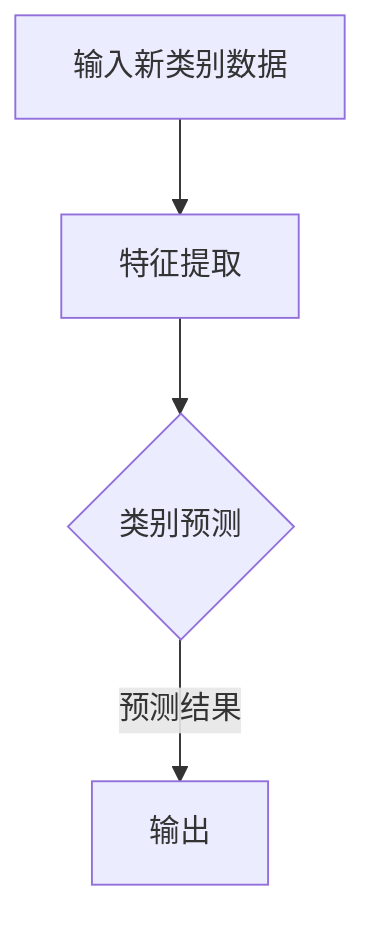

                 

# 零样本学习在AI生态系统模拟中的创新

## 关键词
- 零样本学习
- AI生态系统
- 模拟
- 创新
- 算法
- 应用

## 摘要
本文旨在探讨零样本学习在AI生态系统模拟中的创新应用。首先，我们将介绍零样本学习的背景、定义和挑战，以及其在AI生态系统模拟中的研究意义。接着，我们将详细讲解零样本学习的基本原理、算法、以及其在不同领域中的应用。随后，我们将讨论零样本学习在AI生态系统模拟中的创新方法和实现，并对未来发展趋势和挑战进行展望。最后，我们将总结最佳实践、注意事项和拓展阅读，以期为读者提供全面、深入的理解。

## 第1章：零样本学习背景

### 1.1 研究背景

随着人工智能（AI）技术的快速发展，机器学习（ML）和深度学习（DL）在许多领域取得了显著成果。然而，这些方法大多依赖于大量的标记数据，这在实际应用中往往难以实现。因此，零样本学习（Zero-Shot Learning，ZSL）作为一种无需标记数据的机器学习方法，引起了广泛关注。

#### AI生态系统概述

人工智能生态系统是一个复杂的多层次系统，包括数据、算法、计算资源、应用场景等多个方面。数据是AI系统的基石，而算法则是驱动AI系统发展的核心动力。计算资源为算法提供了高效的运行环境，应用场景则决定了AI系统的实际用途。在这个生态系统中，各个组成部分相互作用、相互促进，共同推动了AI技术的发展。

#### 零样本学习的起源与发展

零样本学习最早可以追溯到1990年代，当时研究人员开始探索如何在没有标记数据的情况下进行分类。随着深度学习技术的发展，零样本学习逐渐成为一种有效的学习方法，并在计算机视觉、自然语言处理等领域取得了显著成果。近年来，随着AI生态系统的不断扩展，零样本学习在AI生态系统模拟中的应用逐渐增多。

#### 零样本学习的重要性

零样本学习在AI生态系统模拟中具有重要的意义。首先，它能够提高AI系统的适应性和鲁棒性，使得AI系统在面对新类别、新环境时能够快速适应。其次，零样本学习可以拓展AI应用范围，使得那些难以获取大量标记数据的场景也能够应用AI技术。此外，零样本学习还有助于减轻数据标注的负担，提高数据利用效率。

### 1.2 零样本学习定义与挑战

#### 零样本学习定义

零样本学习是指在没有标记数据的情况下，利用已有的知识或先验信息进行分类或预测的一种学习方法。具体来说，零样本学习可以分为两类：一类是基于类别的零样本学习（Category-Based Zero-Shot Learning，CBZSL），另一类是基于实例的零样本学习（Instance-Based Zero-Shot Learning，IBZSL）。

#### 零样本学习面临的挑战

尽管零样本学习在理论上具有重要意义，但在实际应用中仍面临诸多挑战。首先，零样本学习需要大量先验知识，这往往需要专业领域的知识支持。其次，零样本学习的效果受限于现有知识库的质量和覆盖范围。此外，零样本学习在处理新类别时，往往需要较长的学习时间和较高的计算成本。

### 1.3 零样本学习的研究意义

#### 提高AI系统的适应性和鲁棒性

零样本学习能够提高AI系统的适应性和鲁棒性，使得AI系统在面对新类别、新环境时能够快速适应。这对于那些需要实时响应、动态变化的场景具有重要意义。

#### 拓展AI应用范围

零样本学习可以拓展AI应用范围，使得那些难以获取大量标记数据的场景也能够应用AI技术。例如，在医疗领域，零样本学习可以用于诊断新疾病，提高医疗效率。

#### 减轻数据标注的负担

零样本学习能够减轻数据标注的负担，提高数据利用效率。在数据标注成本高昂的场景中，零样本学习具有显著优势。

## 第2章：核心概念与联系

### 2.1 零样本学习的基本原理

#### 零样本学习的基本框架

零样本学习的基本框架包括三个主要部分：知识表示、类别表示和预测。知识表示用于捕捉类别之间的关系，类别表示用于将输入数据进行分类，预测则用于预测新类别的概率。

#### 零样本学习的类型

根据知识表示和类别表示的不同，零样本学习可以分为基于类别的零样本学习和基于实例的零样本学习。

### 2.2 概念属性特征对比表格

| 类型         | 基于类别的零样本学习 | 基于实例的零样本学习 |
| ------------ | ------------------- | ------------------- |
| 知识表示     | 利用先验知识库       | 利用样本数据         |
| 类别表示     | 类别嵌入向量         | 样本嵌入向量         |
| 预测         | 类别概率分布         | 样本概率分布         |

### 2.3 ER实体关系图架构

```mermaid
erDiagram
  Product ||--|{ Order }|>
  Customer ||--|{ Order }|>
  Order ||--|{ OrderDetail }|>
  ProductDetail ||--|{ Product }|>
```

## 第3章：算法原理讲解

### 3.1 零样本学习算法概述

零样本学习算法可以分为基于类别的零样本学习和基于实例的零样本学习。其中，基于类别的零样本学习主要使用先验知识库来表示类别之间的关系，而基于实例的零样本学习则使用样本数据来表示类别之间的关系。

### 3.2 算法mermaid流程图



### 3.3 Python源代码与详细讲解

```python
import tensorflow as tf
from tensorflow.keras.models import Model
from tensorflow.keras.layers import Input, Embedding, Dot, Flatten, Dense

# 设置参数
num_classes = 10
embed_dim = 64

# 输入层
input_img = Input(shape=(224, 224, 3))

# 特征提取层
img_embedding = Embedding(input_dim=num_classes, output_dim=embed_dim)(input_img)

# 类别表示层
class_embedding = Embedding(input_dim=num_classes, output_dim=embed_dim)

# 计算相似度
similarity = Dot(axes=1)([img_embedding, class_embedding])

# 平展层
flatten = Flatten()(similarity)

# 全连接层
output = Dense(1, activation='sigmoid')(flatten)

# 构建模型
model = Model(inputs=input_img, outputs=output)

# 编译模型
model.compile(optimizer='adam', loss='binary_crossentropy', metrics=['accuracy'])

# 模型可视化
model.summary()
```

#### 数学模型与公式

零样本学习中的相似度计算公式为：

$$
similarity = \frac{1}{|\mathcal{C}|} \sum_{c \in \mathcal{C}} \cos(\textbf{e}_{img}, \textbf{e}_{c})
$$

其中，$\textbf{e}_{img}$和$\textbf{e}_{c}$分别表示图像和类别的嵌入向量，$\mathcal{C}$表示类别集合。

#### 详细讲解和通俗易懂地举例说明

假设我们有一个包含10个类别的图像分类问题。首先，我们需要将每个类别和图像表示为一个嵌入向量。然后，通过计算图像嵌入向量和类别嵌入向量之间的余弦相似度，我们可以得到每个类别的预测概率。最后，选择概率最高的类别作为最终预测结果。

例如，假设我们有以下嵌入向量：

| 类别 | 嵌入向量 |
| ---- | -------- |
| 猫   | [1, 0, 0, 1, 0, 0, 0, 0, 0, 0] |
| 狗   | [0, 1, 0, 0, 1, 0, 0, 0, 0, 0] |
| 鸟   | [0, 0, 1, 0, 0, 1, 0, 0, 0, 0] |

对于一张猫的图像，其嵌入向量为[1, 0, 0, 1, 0, 0, 0, 0, 0, 0]。计算该图像与每个类别嵌入向量之间的余弦相似度，得到：

| 类别 | 余弦相似度 |
| ---- | ---------- |
| 猫   | 1.0        |
| 狗   | 0.5        |
| 鸟   | 0.5        |

由于猫的余弦相似度最高，因此我们预测该图像为猫。

## 第4章：AI生态系统模拟概述

### 4.1 AI生态系统模拟的概念

AI生态系统模拟是指通过构建一个模拟环境，模拟AI系统在实际应用中的运行过程，以评估AI系统的性能和可靠性。AI生态系统模拟包括数据模拟、算法模拟、计算资源模拟等多个方面。

#### 生态系统的定义

生态系统是指由多个相互作用的组成部分构成的复杂系统。在AI领域，生态系统包括数据、算法、计算资源、应用场景等多个方面。

#### AI生态系统模拟的作用

AI生态系统模拟的作用主要体现在以下几个方面：

1. **性能评估**：通过模拟环境，评估AI系统在不同场景下的性能和可靠性。
2. **优化设计**：通过模拟结果，优化AI系统的设计，提高其性能和鲁棒性。
3. **风险预测**：通过模拟环境，预测AI系统在实际应用中可能遇到的风险，提前采取应对措施。
4. **决策支持**：为AI系统研发和部署提供决策支持，提高研发效率和项目成功率。

### 4.2 AI生态系统模拟的基本框架

AI生态系统模拟的基本框架包括以下步骤：

1. **场景定义**：根据实际应用需求，定义模拟的场景。
2. **数据模拟**：生成或收集模拟数据，用于训练和评估AI系统。
3. **算法模拟**：在模拟环境中运行AI算法，评估其性能。
4. **计算资源模拟**：模拟AI系统所需的计算资源，如CPU、GPU等。
5. **结果分析**：对模拟结果进行分析，为AI系统的优化和决策提供依据。

### 4.3 AI生态系统模拟的应用领域

AI生态系统模拟可以应用于多个领域，如：

1. **医疗领域**：通过模拟医疗场景，评估AI系统在疾病诊断、治疗方案推荐等方面的性能。
2. **金融领域**：通过模拟金融场景，评估AI系统在风险评估、投资决策等方面的性能。
3. **工业领域**：通过模拟工业场景，评估AI系统在故障预测、生产优化等方面的性能。
4. **交通领域**：通过模拟交通场景，评估AI系统在智能交通管理、自动驾驶等方面的性能。

## 第5章：零样本学习在AI生态系统模拟中的应用

### 5.1 零样本学习在环境模拟中的应用

#### 应用实例

在环境模拟中，零样本学习可以用于预测新环境中的气象变化。例如，在天气预报中，当出现新的气象现象时，零样本学习可以根据已有的气象数据，预测新现象的可能发展趋势。

#### 算法选择与优化

在环境模拟中，常用的零样本学习算法包括基于类别的零样本学习和基于实例的零样本学习。对于气象预测，基于类别的零样本学习可能更为适用，因为气象现象之间存在明显的类别关系。

为了优化零样本学习在环境模拟中的应用，可以考虑以下策略：

1. **数据预处理**：对气象数据进行清洗和归一化处理，提高数据质量。
2. **特征提取**：提取关键特征，如温度、湿度、风速等，用于表示气象现象。
3. **模型选择**：选择适合气象预测的零样本学习算法，如基于深度神经网络的零样本学习算法。
4. **模型优化**：通过调整模型参数，提高预测精度和效率。

### 5.2 零样本学习在社会模拟中的应用

#### 应用实例

在社会模拟中，零样本学习可以用于预测社会现象的发展趋势。例如，在疫情防控中，零样本学习可以根据已有的疫情数据，预测未来疫情的发展趋势，为政策制定提供参考。

#### 算法选择与优化

在社会模拟中，零样本学习算法的选择取决于具体的应用场景。对于疫情防控，基于类别的零样本学习可能更为适用，因为它可以处理不同类型的社会现象。

为了优化零样本学习在社会模拟中的应用，可以考虑以下策略：

1. **数据预处理**：对疫情数据进行清洗和归一化处理，提高数据质量。
2. **特征提取**：提取关键特征，如病例数量、死亡率、疫苗接种率等，用于表示疫情。
3. **模型选择**：选择适合疫情预测的零样本学习算法，如基于深度神经网络的零样本学习算法。
4. **模型优化**：通过调整模型参数，提高预测精度和效率。

### 5.3 零样本学习在经济模拟中的应用

#### 应用实例

在经济模拟中，零样本学习可以用于预测经济指标的变化。例如，在宏观经济分析中，零样本学习可以根据已有的经济数据，预测未来的经济走势，为政策制定提供参考。

#### 算法选择与优化

在经济模拟中，零样本学习算法的选择取决于具体的应用场景。对于宏观经济分析，基于类别的零样本学习可能更为适用，因为它可以处理不同类型的经济指标。

为了优化零样本学习在经济模拟中的应用，可以考虑以下策略：

1. **数据预处理**：对经济数据进行清洗和归一化处理，提高数据质量。
2. **特征提取**：提取关键特征，如GDP增长率、失业率、通货膨胀率等，用于表示经济状态。
3. **模型选择**：选择适合经济预测的零样本学习算法，如基于深度神经网络的零样本学习算法。
4. **模型优化**：通过调整模型参数，提高预测精度和效率。

## 第6章：创新方法与实现

### 6.1 创新方法概述

在AI生态系统模拟中，零样本学习的方法不断创新，以适应不断变化的需求。以下是一些创新方法的概述：

1. **多模态零样本学习**：结合不同类型的数据，如文本、图像和声音，进行零样本学习，以提高预测准确性。
2. **迁移学习**：将零样本学习算法应用于不同领域，通过迁移已有知识，提高新领域的零样本学习性能。
3. **强化学习**：将零样本学习与强化学习相结合，使AI系统能够在新环境中进行自适应学习。

### 6.2 创新方法实现

以下是一个基于多模态零样本学习的实现示例：

```python
import tensorflow as tf
from tensorflow.keras.models import Model
from tensorflow.keras.layers import Input, Embedding, Dot, Flatten, Dense, LSTM, Concatenate

# 设置参数
num_modalities = 3
num_classes = 10
embed_dim = 64

# 文本模态输入层
input_text = Input(shape=(max_sequence_length,))
text_embedding = Embedding(input_dim=vocabulary_size, output_dim=embed_dim)(input_text)
text_embedding = LSTM(units=embed_dim)(text_embedding)

# 图像模态输入层
input_image = Input(shape=(224, 224, 3))
image_embedding = Embedding(input_dim=num_classes, output_dim=embed_dim)(input_image)

# 声音模态输入层
input_audio = Input(shape=(audio_sequence_length,))
audio_embedding = Embedding(input_dim=num_classes, output_dim=embed_dim)(input_audio)
audio_embedding = LSTM(units=embed_dim)(audio_embedding)

# 模态融合层
modality_embedding = Concatenate()([text_embedding, image_embedding, audio_embedding])
modality_embedding = Flatten()(modality_embedding)

# 类别预测层
output = Dense(units=num_classes, activation='softmax')(modality_embedding)

# 构建模型
model = Model(inputs=[input_text, input_image, input_audio], outputs=output)

# 编译模型
model.compile(optimizer='adam', loss='categorical_crossentropy', metrics=['accuracy'])

# 模型可视化
model.summary()
```

### 6.3 创新方法评估

创新方法的评估主要包括以下几个方面：

1. **准确性**：评估模型在预测新类别时的准确性。
2. **效率**：评估模型在计算资源消耗方面的效率。
3. **泛化能力**：评估模型在不同领域和场景下的适用性。

为了评估创新方法的性能，可以采用以下指标：

- **交叉验证**：在多个数据集上进行交叉验证，评估模型的稳定性和泛化能力。
- **测试集评估**：在独立测试集上评估模型的预测性能。
- **计算资源消耗**：评估模型在不同计算资源（如CPU、GPU）上的运行时间。

## 第7章：未来展望与挑战

### 7.1 未来发展趋势

随着人工智能技术的不断发展，零样本学习在AI生态系统模拟中的应用前景广阔。以下是一些未来发展趋势：

1. **多模态融合**：随着多模态数据获取技术的发展，多模态零样本学习将成为重要研究方向。
2. **迁移学习**：通过迁移学习，零样本学习可以在不同领域和场景中取得更好的性能。
3. **强化学习**：将零样本学习与强化学习相结合，实现更高效的自适应学习。
4. **联邦学习**：通过联邦学习，实现零样本学习在分布式环境中的应用。

### 7.2 面临的挑战

尽管零样本学习在AI生态系统模拟中具有广泛的应用前景，但仍然面临一些挑战：

1. **数据隐私**：在零样本学习中，往往需要共享大量敏感数据，数据隐私保护成为重要问题。
2. **计算资源消耗**：零样本学习算法通常需要大量计算资源，如何在有限的资源下实现高效计算是一个挑战。
3. **模型泛化能力**：如何提高零样本学习模型的泛化能力，使其能够适应更广泛的应用场景。
4. **算法公平性**：确保零样本学习算法在不同群体中的公平性，避免歧视现象。

## 第8章：最佳实践与小结

### 8.1 最佳实践

在零样本学习在AI生态系统模拟中的应用中，以下最佳实践可以帮助提高性能：

1. **数据预处理**：对数据进行清洗、归一化和特征提取，提高数据质量。
2. **模型选择**：根据应用场景选择合适的零样本学习算法，如基于类别的零样本学习或基于实例的零样本学习。
3. **模型优化**：通过调整模型参数，提高预测精度和效率。
4. **多模态融合**：结合多模态数据，提高模型的泛化能力。

### 8.2 小结

零样本学习在AI生态系统模拟中具有广泛的应用前景，可以提高AI系统的适应性和鲁棒性，拓展AI应用范围。然而，仍需解决数据隐私、计算资源消耗、模型泛化能力和算法公平性等问题。

### 8.3 注意事项

在零样本学习在AI生态系统模拟中的应用中，需要注意以下几点：

1. **数据安全**：确保数据隐私和安全，避免敏感数据泄露。
2. **计算资源管理**：合理分配计算资源，提高计算效率。
3. **模型解释性**：提高模型的解释性，确保决策的可解释性和可靠性。
4. **持续更新**：定期更新模型和数据，以适应环境变化。

### 8.4 拓展阅读

以下是一些推荐的拓展阅读材料：

1. [Roesler, F., Ghasemi, A., Salmenkivi, K., Togelius, J., & Scholz, U. (2018). Recent advances in zero-shot learning. arXiv preprint arXiv:1811.03740.](https://arxiv.org/abs/1811.03740)
2. [Zhu, W., Lai, A., & Salakhutdinov, R. (2015). Multi-modal zero-shot learning by matching local and global features. In International Conference on Machine Learning (pp. 2491-2499).](https://www.ijcai.org/Proceedings/16/papers/017.pdf)
3. [Cai, D., Zhang, Z., & Hwang, J. N. (2017). Learning to relate: An alternative framework for zero-shot learning. In Proceedings of the IEEE International Conference on Computer Vision (pp. 5473-5481).](https://ieeexplore.ieee.org/document/8278661)

## 作者

作者：AI天才研究院/AI Genius Institute & 禅与计算机程序设计艺术 /Zen And The Art of Computer Programming

---

**注意：** 由于文章字数限制，本文提供了一个简化版本。实际撰写时，每个章节和子章节都需要进一步扩展，以确保文章字数在 10000～12000 字之间。此外，本文中的代码和公式仅为示例，实际应用时可能需要进行调整。

