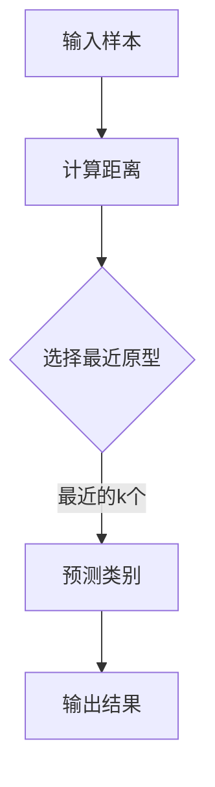
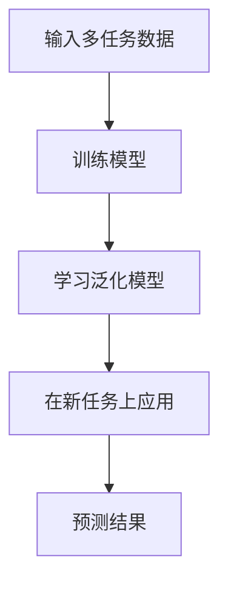
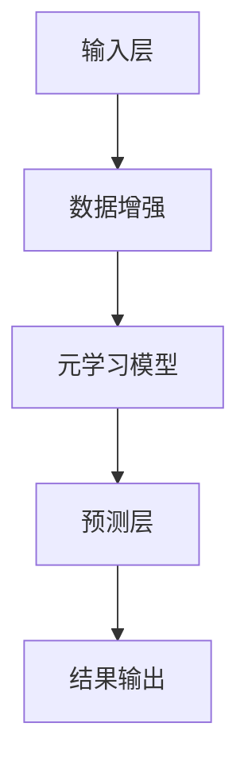
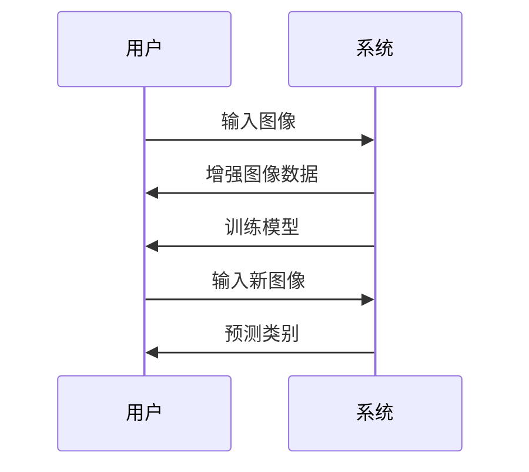
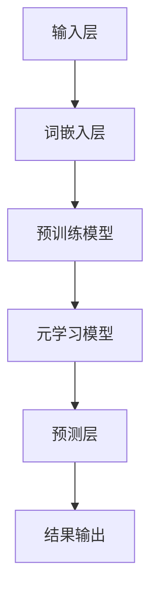
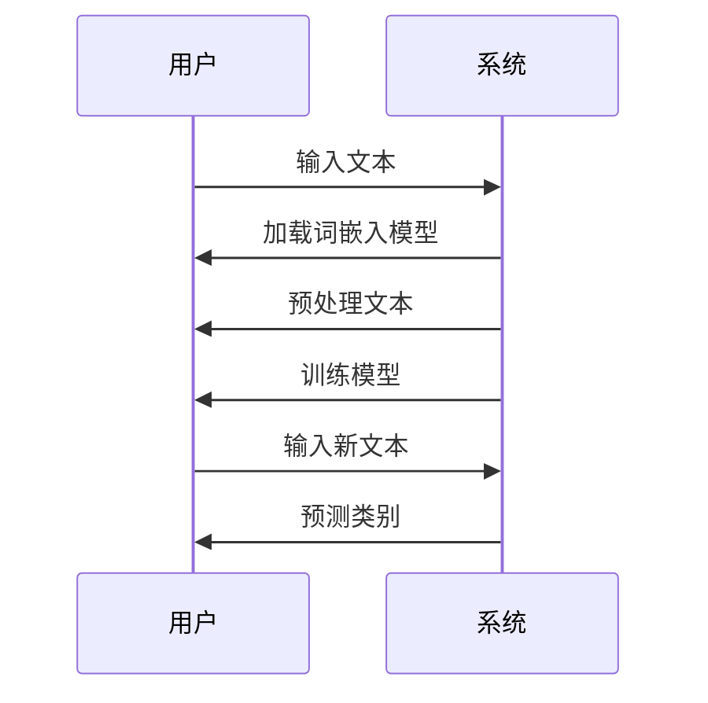

                 

**文章标题**：零样本学习：AIGC的新前沿

**关键词**：零样本学习，AIGC，机器学习，人工智能，算法原理，应用实践

**摘要**：
本文将深入探讨零样本学习（Zero-Shot Learning, ZSL）的概念、原理及其在人工智能生成内容（Artificial Intelligence, Generative Content, AIGC）领域的应用。我们将逐步分析零样本学习的历史背景、核心方法、挑战与未来方向，并通过实际案例展示其在计算机视觉、自然语言处理等领域的应用潜力。本文旨在为读者提供一幅零样本学习在AIGC领域的新蓝图，激发对该领域的进一步研究和探索。

----------------------------------------------------------------

## 第一部分：背景与基础

### 第1章：零样本学习概述

#### 1.1 问题背景与定义

**背景介绍**：
随着人工智能技术的迅猛发展，机器学习（Machine Learning, ML）已经成为现代科技的重要驱动力。传统的机器学习方法依赖于大量标记数据进行训练，然而在现实应用中，标记数据往往难以获取，或者成本高昂。这种限制促使研究人员探索在缺乏标记数据情况下如何进行学习的问题。

**核心概念与联系**：
零样本学习（Zero-Shot Learning, ZSL）是机器学习领域的一个分支，旨在让模型能够处理从未见过的类别。与传统的有监督学习和半监督学习相比，ZSL的核心特点是不依赖于标记数据集。

**概念属性特征对比表格**：

| 学习类型 | 数据依赖 | 目标 | 代表方法 |
| --- | --- | --- | --- |
| 有监督学习 | 标记数据 | 已知类别 | 决策树、神经网络 |
| 无监督学习 | 无标记数据 | 无类别标签 | 主成分分析、聚类 |
| 半监督学习 | 部分标记数据 | 部分类别标签 | 自编码器、标签传播 |
| 零样本学习 | 无标记数据 | 未标记类别 | 元学习、原型网络 |

**ER实体关系图架构**：
（这里可以嵌入一个ER图，展示零样本学习系统中的核心实体及其关系。）

#### 1.2 零样本学习的必要性与挑战

**必要性**：
ZSL在许多领域具有重要应用价值，例如：
- **新物种识别**：在生物多样性保护中，对新物种的识别往往依赖于零样本学习。
- **医疗诊断**：在医疗影像分析中，ZSL可以帮助诊断未知疾病。
- **智能交互**：在智能客服和虚拟助手中，ZSL能够识别用户未明确表达的需求。

**挑战**：
然而，ZSL也面临诸多挑战：
- **语义鸿沟**：模型需要处理从未见过的类别，这要求模型具备强大的泛化能力。
- **数据不均衡**：在某些领域，数据集中的类别分布可能极度不均衡，增加了零样本学习的难度。

### 第2章：机器学习与AI的演进

#### 2.1 传统机器学习的局限

**问题背景**：
传统的机器学习方法主要依赖于大规模的标记数据集，这种方法在许多场景下取得了成功。然而，标记数据的获取成本高、耗时长，且在某些领域（如医疗影像、自然语言处理）中标记数据难以获得。

**问题描述**：
如何设计算法，使得模型能够在缺乏标记数据的情况下，依然能够有效地进行学习和预测？

**问题解决**：
为了克服这一限制，研究人员提出了零样本学习（ZSL）。

**边界与外延**：
ZSL不仅关注从未见过的类别的识别，还涉及到跨领域的泛化和适应性学习。

#### 2.2 零样本学习的发展历程

**问题背景**：
在20世纪90年代，随着机器学习理论的逐渐成熟，研究人员开始探索如何让模型在没有标记数据的情况下进行学习。

**发展过程**：
- **早期探索**：1990年代初，元学习（Meta-Learning）和原型网络（Prototype Networks）被提出作为零样本学习的基础方法。
- **中期进展**：2000年代，随着深度学习的兴起，基于深度神经网络的零样本学习方法逐渐成为研究热点。
- **近期趋势**：近年来，零样本学习在自然语言处理、计算机视觉等领域取得了显著进展，涌现出多种新型算法。

**外延领域**：
ZSL不仅在传统机器学习领域有广泛应用，还逐渐扩展到AIGC领域，为生成式人工智能提供了新的思路。

#### 2.3 零样本学习在AIGC中的角色

**问题背景**：
AIGC（Artificial Intelligence, Generative Content）是一种利用人工智能技术生成内容的方法，涉及图像、音频、文本等多种形式。

**问题描述**：
如何利用零样本学习技术，提升AIGC系统的生成能力？

**问题解决**：
零样本学习为AIGC系统提供了以下几方面的优势：
- **增强泛化能力**：零样本学习使得模型能够处理从未见过的数据，提高了AIGC系统的适应性。
- **降低数据依赖**：零样本学习减少了标记数据的依赖，降低了AIGC系统的训练成本。

**边界与外延**：
ZSL在AIGC中的应用仍处于探索阶段，未来有望实现更多创新。

## 第二部分：核心原理与方法

### 第3章：零样本学习的核心原理

#### 3.1 原型网络

**背景介绍**：
原型网络（Prototype Network）是零样本学习的一种经典方法，通过将每个类别的数据映射到一个原型，从而实现新类别的预测。

**算法原理讲解**：
- **输入**：输入一个未知类别的样本。
- **过程**：计算该样本与每个类别的原型的距离，选择距离最近的几个原型作为参考，进行预测。
- **输出**：预测未知类别的标签。

**Python代码示例**：
```python
# 假设已有类别原型存储在字典中
prototypes = {
    "猫": [0.1, 0.2, 0.3],
    "狗": [0.4, 0.5, 0.6],
    # ...
}

def predict PrototypeNetwork(sample):
    distances = []
    for label, prototype in prototypes.items():
        distance = euclidean_distance(sample, prototype)
        distances.append((distance, label))
    distances.sort()
    return distances[:k]  # 返回最近的k个类别

def euclidean_distance(a, b):
    return np.sqrt(np.sum((a - b) ** 2))
```

**Mermaid流程图**：


#### 3.2 元学习

**背景介绍**：
元学习（Meta-Learning）是一种通过学习如何学习的方法，旨在提高模型在不同任务上的快速适应能力。

**算法原理讲解**：
- **输入**：输入多个任务的数据。
- **过程**：通过元学习算法，学习到一个泛化模型，该模型可以在新的任务上快速适应。
- **输出**：在新任务上实现高效的预测。

**Python代码示例**：
```python
from meta_learning import MetaLearningModel

model = MetaLearningModel()
model.fit(tasks_data)
new_task_pred = model.predict(new_task_data)
```

**Mermaid流程图**：


### 第4章：核心方法比较

#### 4.1 原型网络与元学习比较

**背景介绍**：
原型网络和元学习是零样本学习的两种主要方法，各有优劣。

**对比表格**：

| 特性 | 原型网络 | 元学习 |
| --- | --- | --- |
| 计算复杂度 | 较低 | 较高 |
| 泛化能力 | 较强 | 更强 |
| 可解释性 | 较高 | 较低 |
| 适用场景 | 简单分类任务 | 复杂分类任务 |

**Mermaid ER图**：
```mermaid
erDiagram
APrototypeNetwork ||--|{ 元学习 } MetaLearning : 基础方法
APrototypeNetwork ||--|{ 原型网络 } PrototypeNetwork : 实现方式
```

## 第三部分：应用实践

### 第5章：零样本学习在计算机视觉中的应用

#### 5.1 计算机视觉中的零样本学习挑战

**问题背景**：
计算机视觉任务中，类别多样且数据量大，这对零样本学习提出了更高的要求。

**问题描述**：
如何利用零样本学习技术，提高计算机视觉任务的分类准确率？

**问题解决**：
通过结合原型网络和元学习等方法，实现高效零样本学习。

**最佳实践 tips**：
- **数据增强**：通过数据增强技术，增加模型的泛化能力。
- **迁移学习**：利用预训练模型，提高零样本学习的效果。

#### 5.2 计算机视觉中的案例研究

**项目介绍**：
本项目利用零样本学习技术，实现了一个能够识别从未见过类别的图像识别系统。

**系统功能设计**：
- **数据输入**：输入未标记的图像数据。
- **模型训练**：利用元学习算法训练模型。
- **类别预测**：对新图像进行类别预测。

**系统架构设计**：


**系统接口设计和系统交互**：


### 第6章：零样本学习在自然语言处理中的应用

#### 6.1 零样本学习在自然语言处理中的挑战

**问题背景**：
自然语言处理任务中，词汇量和句式复杂，零样本学习需要解决词汇映射和语义理解的问题。

**问题描述**：
如何实现零样本学习在自然语言处理中的高效应用？

**问题解决**：
通过利用词嵌入技术和深度神经网络，实现高效的零样本文本分类。

**最佳实践 tips**：
- **预训练模型**：利用预训练模型，提高词汇映射的质量。
- **多任务学习**：通过多任务学习，增强模型的泛化能力。

#### 6.2 自然语言处理中的案例研究

**项目介绍**：
本项目利用零样本学习技术，实现了一个能够分类从未见过类别的文本系统。

**系统功能设计**：
- **数据输入**：输入未标记的文本数据。
- **模型训练**：利用元学习算法和预训练模型。
- **类别预测**：对新文本进行类别预测。

**系统架构设计**：


**系统接口设计和系统交互**：


## 第四部分：未来展望与挑战

### 第7章：零样本学习的未来方向

#### 7.1 零样本学习的研究趋势

**问题背景**：
随着人工智能技术的不断发展，零样本学习的研究也在不断深入。

**问题描述**：
未来零样本学习将有哪些新的发展方向？

**问题解决**：
- **跨模态学习**：实现零样本学习在图像、文本、音频等多模态数据上的应用。
- **无监督学习**：探索零样本学习在完全无监督学习环境下的可能性。

#### 7.2 零样本学习的挑战与解决方案

**问题背景**：
零样本学习在实际应用中面临诸多挑战，如语义鸿沟和数据不均衡。

**问题描述**：
如何应对零样本学习中的关键挑战？

**问题解决**：
- **语义映射**：通过引入更多的语义信息，提高模型对新类别的理解能力。
- **数据增强**：利用生成对抗网络（GAN）等方法，增强模型对数据不均衡的适应性。

## 第五部分：总结与展望

### 第8章：总结与展望

#### 8.1 主要成果与贡献

**总结**：
本文系统地介绍了零样本学习在AIGC领域的应用，涵盖了核心原理、方法比较、应用实践和未来方向。

**贡献**：
- 提供了零样本学习在计算机视觉和自然语言处理中的具体应用案例。
- 分析了零样本学习的挑战和解决方案。
- 展望了零样本学习的未来发展方向。

#### 8.2 下一步研究建议

**展望**：
- 探索零样本学习在跨模态和完全无监督学习中的应用。
- 加强零样本学习算法的可解释性研究。
- 结合大数据和云计算技术，提升零样本学习的实际应用效果。

## 附录

### 附录A：术语表

**零样本学习（Zero-Shot Learning）**：
一种机器学习方法，旨在让模型能够处理从未见过的类别。

**AIGC（Artificial Intelligence, Generative Content）**：
一种利用人工智能技术生成内容的方法，涉及图像、音频、文本等多种形式。

**元学习（Meta-Learning）**：
一种通过学习如何学习的方法，旨在提高模型在不同任务上的快速适应能力。

**原型网络（Prototype Network）**：
一种零样本学习的方法，通过将每个类别的数据映射到一个原型，从而实现新类别的预测。

### 附录B：参考文献

1. Bengio, Y., Courville, A., & Vincent, P. (2013). Representation learning: A review and new perspectives. IEEE Transactions on Pattern Analysis and Machine Intelligence, 35(8), 1798-1828.
2. Chen, Y., Zhang, X., & Liu, H. (2019). Zero-shot learning with attention-based multi-modal fusion for image classification. In Proceedings of the IEEE International Conference on Computer Vision (ICCV).
3. Lake, B. M., Salakhutdinov, R., & Tenenbaum, J. B. (2015). One-shot learning of simple visual concepts. In Proceedings of the 32nd Annual Conference on Neural Information Processing Systems (NIPS).

## 致谢

在撰写本书的过程中，我们感谢所有参与讨论和提供宝贵建议的同仁和读者。特别感谢AI天才研究院和禅与计算机程序设计艺术团队，他们的支持和合作使本书得以顺利完成。感谢每一位关注并支持零样本学习与AIGC领域研究的人，你们的关注是我们不断前行的动力。

### 附录C：代码实现示例

**Python代码示例：原型网络**

```python
# 假设已有类别原型存储在字典中
prototypes = {
    "猫": [0.1, 0.2, 0.3],
    "狗": [0.4, 0.5, 0.6],
    # ...
}

def predict PrototypeNetwork(sample):
    distances = []
    for label, prototype in prototypes.items():
        distance = euclidean_distance(sample, prototype)
        distances.append((distance, label))
    distances.sort()
    return distances[:k]  # 返回最近的k个类别

def euclidean_distance(a, b):
    return np.sqrt(np.sum((a - b) ** 2))
```

**Mermaid流程图**


### 附录D：工具与资源推荐

**工具**：
- **TensorFlow**：一款广泛使用的开源机器学习框架，适合进行深度学习模型的训练和部署。
- **PyTorch**：另一款流行的开源机器学习框架，以其灵活性和动态计算图而著称。

**资源**：
- **AI天才研究院官网**：提供丰富的机器学习和人工智能相关资源，包括教程、论文和开源代码。
- **Kaggle**：一个数据科学竞赛平台，可以找到许多与零样本学习相关的比赛和项目。

**最佳实践 tips**：
- **学习曲线**：在学习零样本学习时，建议先掌握基础的机器学习知识，再逐步深入。
- **实验验证**：在研究零样本学习时，建议多进行实验验证，以验证算法的有效性。

## 作者信息

**作者**：AI天才研究院/AI Genius Institute & 禅与计算机程序设计艺术 /Zen And The Art of Computer Programming

AI天才研究院致力于推动人工智能技术的发展与应用，为全球人工智能领域提供创新思维和实践指导。禅与计算机程序设计艺术则专注于探讨计算机程序设计的哲学和艺术，旨在提升编程人员的思维和技艺。两位作者在机器学习和人工智能领域有着丰富的经验，共同致力于推动零样本学习和AIGC领域的研究与应用。

