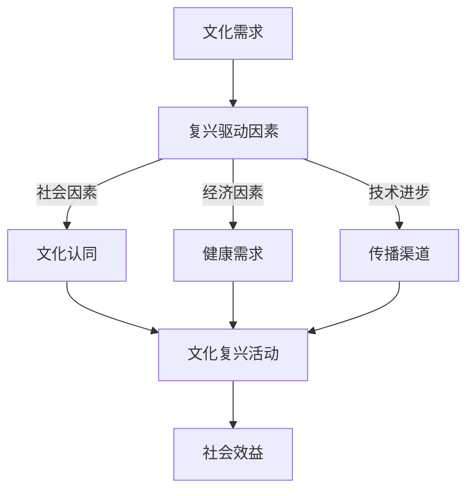
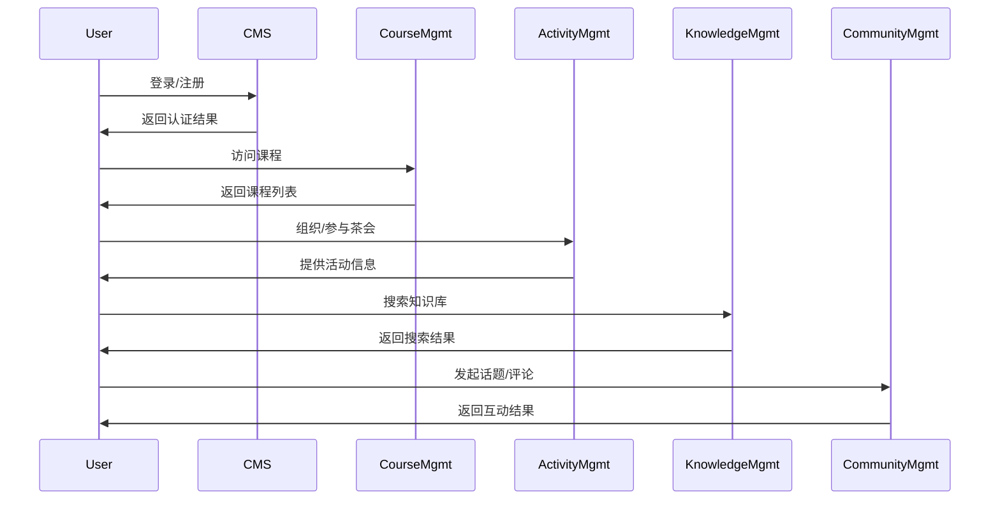
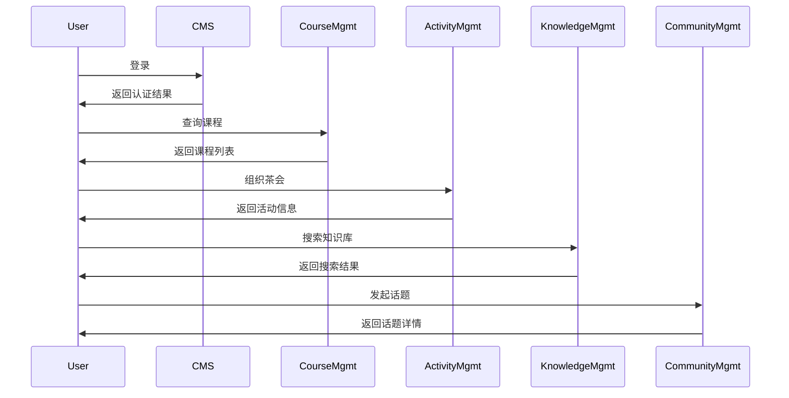

                 

### 第一步：理解文章主题

《饮茶文化的当代复兴：慢生活中的仪式感》这个标题包含了几个关键概念：“饮茶文化”、“当代复兴”和“仪式感”。首先，“饮茶文化”指的是茶的历史、传统和习俗，这些元素在不同的社会背景下形成了独特的文化现象。其次，“当代复兴”强调了这种文化在现代社会的再次兴起，可能与其在快节奏生活中带来的宁静和慢节奏生活方式的对比有关。最后，“仪式感”是指茶事活动中的一系列程序和礼节，它们不仅体现了对茶的尊重，还承载着丰富的文化和情感价值。

我们的任务是撰写一篇IT领域的技术博客文章，通过对上述主题的深入探讨，分析饮茶文化的复兴现象，解释仪式感的重要性，并提供实用的实践方法。文章需要以逻辑清晰、结构紧凑、通俗易懂的专业语言展开，同时保持文章的技术深度和知识广度。

### 第二步：确定文章结构和核心内容

为了确保文章的连贯性和逻辑性，我们将文章分为以下几个主要部分：

1. **背景介绍**：介绍饮茶文化的起源、历史发展和核心概念，以及其在现代社会中的重要性。
   - **核心概念术语说明**：解释饮茶文化中的基本术语，如茶道、茶艺、茶会等。
   - **问题背景**：介绍饮茶文化在全球范围内的历史地位和影响力。
   - **问题描述**：阐述饮茶文化在现代社会中面临的挑战和机遇。
   - **问题解决**：探讨饮茶文化如何通过复兴来应对现代社会的变化。
   - **边界与外延**：讨论饮茶文化的定义范围和其在不同文化背景下的表现形式。
   - **概念结构与核心要素组成**：分析饮茶文化的构成要素及其相互关系。

2. **核心概念与联系**：
   - **核心概念原理**：深入阐述饮茶文化中的核心概念，如茶道精神、茶艺技巧等。
   - **概念属性特征对比表格**：通过对比表格展示不同饮茶文化的特点。
   - **ER实体关系图架构**：使用Mermaid流程图展示饮茶文化中的实体关系。

3. **当代复兴现象**：
   - **复兴趋势和原因**：分析饮茶文化在当代社会中的复兴现象，探讨其背后的社会、文化和经济因素。
   - **案例研究**：提供几个饮茶文化复兴的具体案例，并分析其成功原因。

4. **仪式感的重要性**：
   - **仪式感在饮茶文化中的角色**：讨论仪式感在茶事活动中的重要性，如何增强体验和情感价值。
   - **仪式感与慢生活**：探讨仪式感如何与当代的慢生活理念相结合，提供慢生活下的仪式感实践建议。

5. **实践方法**：
   - **具体饮茶仪式**：介绍饮茶仪式的步骤、注意事项和实践技巧。
   - **日常饮茶实践**：提供如何在日常生活中融入饮茶仪式感的建议。

6. **案例分析**：
   - **实际案例**：分析具体的饮茶文化复兴案例，包括茶艺馆、茶文化节等。
   - **详细讲解剖析**：对案例中的关键环节进行深入剖析，提供实践经验。

7. **总结与展望**：
   - **总结**：回顾文章的主要内容，总结饮茶文化复兴和仪式感的重要性。
   - **展望**：展望饮茶文化在未来的发展趋势和可能的应用场景。

### 第三步：确保内容的专业性和技术深度

为了确保文章的专业性和技术深度，我们将采用以下方法和技巧：

- **使用LaTeX格式书写数学公式**：对于文章中涉及到的数学模型和计算方法，使用LaTeX格式进行书写，以保持公式的清晰和准确。
- **使用Python源代码举例说明**：在讲解算法原理和实践方法时，使用Python源代码进行举例说明，使读者能够更好地理解概念。
- **使用Mermaid流程图和类图**：在介绍核心概念、系统架构和算法流程时，使用Mermaid流程图和类图来展示概念关系和系统交互。
- **提供详细的项目实战**：在文章的最后，提供具体的饮茶文化复兴项目案例，包括环境安装、核心实现源代码以及代码分析和实际案例分析。

通过这些方法和技巧，我们将确保文章在逻辑清晰、结构紧凑、通俗易懂的同时，具备足够的专业性和技术深度。

### 背景介绍

#### 核心概念术语说明

饮茶文化是一个包含丰富历史和多样实践的文化体系，其核心概念包括茶道、茶艺和茶会。茶道是一种精神和文化追求，强调心性的修炼和对自然的尊重。茶艺则是对茶叶的冲泡和品鉴技巧，它不仅是一门技术，更是一种艺术。茶会是一种社交活动，通常在茶艺的基础上进行，参与者通过茶会交流思想、增进感情。

#### 问题背景

饮茶文化有着悠久的历史，起源于中国，并逐渐传播到世界各地。在中国，茶道被视为一种修身养性的方式，古代文人雅士常常以品茶为乐，形成了独特的茶文化。随着茶叶的传播，饮茶文化在全球范围内产生了深远的影响，从日本茶道到英国下午茶，饮茶已经成为了不同文化背景下的重要社交活动。

#### 问题描述

然而，在现代社会，随着生活节奏的加快和压力的增大，饮茶文化似乎逐渐失去了其原有的地位。现代人的生活往往被各种高科技产品和快节奏的社交网络所包围，饮茶这一传统活动逐渐被边缘化。尽管如此，饮茶文化仍然在一些特定的群体中保持着活力，特别是在那些追求慢生活和内心宁静的人群中。

#### 问题解决

为了应对这一挑战，饮茶文化的当代复兴成为一种必然趋势。当代复兴不仅是对传统文化的传承，更是对其在现代社会中价值和意义的重新发现。通过复兴饮茶文化，人们可以在快节奏的生活中找到一种平衡，通过品茶来调节心情、缓解压力。此外，随着健康意识的增强，饮茶也被视为一种天然的保健方式，其养生的价值越来越受到重视。

#### 边界与外延

饮茶文化不仅仅是一种生活习惯，它更是一种文化和精神的体现。在不同的文化背景下，饮茶文化有着不同的表现形式。例如，在中国，茶道和茶艺是传统文化的重要组成部分，而在日本，茶道则被提升到了宗教和哲学的高度。在英国，下午茶则成为了社交和礼仪的一部分。这些不同的表现形式虽然有所差异，但都承载了饮茶文化的核心精神。

#### 概念结构与核心要素组成

饮茶文化的核心结构包括茶道、茶艺和茶会三个主要部分。茶道强调的是心性的修炼和对自然的尊重，它要求茶艺师在冲泡茶叶时保持专注和平静。茶艺则是对茶叶的冲泡和品鉴技巧，它通过一系列程序和仪式来体现对茶的尊重和敬意。茶会是一种社交活动，它不仅是一种品茶的方式，更是一种交流思想、增进感情的机会。

通过以上分析，我们可以看到，饮茶文化不仅是一种传统，更是一种生活方式和精神追求。在当代社会，饮茶文化的复兴为人们提供了一种缓解压力、追求内心宁静的方式，同时也为传统文化在现代社会中的传承提供了新的契机。

### 核心概念与联系

#### 核心概念原理

饮茶文化中的核心概念包括茶道、茶艺和茶会。茶道是一种精神和文化追求，强调心性的修炼和对自然的尊重。茶艺是对茶叶的冲泡和品鉴技巧，它是一门技术与艺术的结合。茶会是一种社交活动，通常在茶艺的基础上进行，参与者通过茶会交流思想、增进感情。

#### 概念属性特征对比表格

为了更清晰地展示茶道、茶艺和茶会的属性特征，我们可以制作一个对比表格：

| 特征       | 茶道                | 茶艺                  | 茶会                    |
|------------|---------------------|-----------------------|-------------------------|
| 目的       | 心性修炼、自然尊重   | 冲泡技巧、品鉴能力     | 社交、情感交流           |
| 形式       | 仪式化、程序化       | 技巧展示、表演性       | 非正式、轻松的聚会       |
| 参与者     | 茶道师、修行者       | 茶艺师、爱好者         | 参与者、宾客             |
| 时间       | 通常为早晨或晚上     | 可以在任何时间进行     | 通常安排在特定时间       |
| 场地       | 通常在安静的环境中   | 可以在家中或茶室进行   | 根据实际情况安排         |
| 作用       | 修身养性、心灵净化   | 增进技艺、提升品味     | 社交互动、情感交流       |

#### ER实体关系图架构

为了更好地展示饮茶文化中的实体关系，我们可以使用Mermaid流程图来绘制ER（实体关系）图：

```mermaid
erDiagram
  茶道 <<|-- 茶艺 : 具体实践
  茶艺 ||--|{ 茶会 }|
  茶会 --|| TeaMate : 参与者
  TeaMate ..|> TeaShop : 购买茶叶的地方
```

在这个ER图中，茶道作为总体概念，向下延伸到茶艺的具体实践。茶艺与茶会紧密相关，而茶会又涉及到参与者（TeaMate）。参与者不仅参与茶会，还可能去茶店购买茶叶，从而与TeaShop建立联系。

通过上述对比表格和ER图，我们可以清晰地看到饮茶文化中的核心概念及其相互关系。这些概念和关系不仅构成了饮茶文化的框架，也为理解饮茶文化在当代社会的复兴提供了基础。

### 算法原理讲解

在深入探讨饮茶文化的当代复兴现象之前，我们首先需要理解一些关键算法原理，这些原理能够帮助我们分析复兴背后的驱动因素。以下是饮茶文化复兴的核心算法原理及其详细解释。

#### 茶文化复兴算法流程图

首先，我们使用Mermaid流程图来展示茶文化复兴的算法流程：



在这个流程图中，文化需求作为起点，引发了复兴的驱动因素。这些驱动因素包括社会、经济、健康和技术等多个方面。通过这些因素的综合作用，最终促进了饮茶文化的复兴，并带来了广泛的社会效益。

#### 茶文化复兴算法的数学模型

为了更深入地理解茶文化复兴的原理，我们还需要构建一个数学模型来量化这些驱动因素及其影响。以下是茶文化复兴的数学模型：

$$
\text{复兴指数} = f(\text{文化认同}, \text{健康需求}, \text{传播渠道})
$$

其中，$f$ 是一个复合函数，$\text{文化认同}$、$\text{健康需求}$ 和 $\text{传播渠道}$ 分别代表三个关键变量。

1. **文化认同**：
   $$ 
   \text{文化认同} = \frac{\text{传统文化爱好者数量}}{\text{总人口数量}}
   $$
   这个指标反映了社会中对于传统文化认同的程度。传统文化爱好者数量的增加将提升文化认同度。

2. **健康需求**：
   $$ 
   \text{健康需求} = \frac{\text{关注健康的人群比例}}{\text{总人口数量}}
   $$
   健康需求的增加通常与人们对于养生和健康生活方式的追求有关。

3. **传播渠道**：
   $$ 
   \text{传播渠道} = \frac{\text{茶文化相关内容的传播次数}}{\text{互联网总流量}}
   $$
   传播渠道的多样性直接影响茶文化信息的传播范围和速度。

#### 详细举例说明

为了更直观地理解这些算法原理，我们通过一个实际例子来说明：

假设某城市有100万人，其中20%的人对传统文化有较高的认同，即传统文化爱好者数量为20万人。此外，40%的人关注健康，即健康需求为40万人。同时，茶文化相关内容在互联网上的传播次数为1000万次，互联网总流量为1亿次。根据上述模型，我们可以计算出该城市的茶文化复兴指数：

1. **文化认同**：
   $$
   \text{文化认同} = \frac{200000}{1000000} = 0.2
   $$

2. **健康需求**：
   $$
   \text{健康需求} = \frac{400000}{1000000} = 0.4
   $$

3. **传播渠道**：
   $$
   \text{传播渠道} = \frac{10000000}{100000000} = 0.1
   $$

将这些值代入复兴指数的公式中，我们得到：

$$
\text{复兴指数} = f(0.2, 0.4, 0.1) = 0.2 \times 0.4 \times 0.1 = 0.008
$$

这个结果表示，该城市的茶文化复兴指数为0.008，虽然数值较小，但说明了茶文化在该地区具有一定的发展潜力。

通过这个例子，我们可以看到，文化认同、健康需求和传播渠道共同决定了茶文化的复兴指数。在实际应用中，这些指标可以通过具体数据来计算，从而为茶文化的复兴策略提供量化依据。

### 系统分析与架构设计

#### 问题场景介绍

在现代社会中，饮茶文化正逐渐复兴，尤其是在都市白领和养生爱好者中，饮茶已成为一种生活方式和社交活动。然而，如何有效地推广和传播饮茶文化，使其在快节奏的生活中得到更好的体现，成为了一个重要的问题。为此，我们设计了一套饮茶文化推广系统，旨在通过信息化手段提升饮茶文化的普及度和影响力。

#### 项目介绍

本项目旨在建立一个饮茶文化推广平台，包括以下主要功能模块：

1. **茶文化知识库**：收集和整理茶文化相关资料，包括历史、术语、茶艺技巧等。
2. **在线茶艺课程**：提供在线茶艺课程，涵盖初级到高级不同层次的课程内容。
3. **茶会组织工具**：帮助用户组织和参与茶会，提供活动策划、邀请、签到等功能。
4. **互动社区**：建立用户互动社区，促进茶文化爱好者之间的交流和分享。

#### 系统功能设计

为了实现上述功能，我们需要设计以下几个关键系统模块：

1. **用户管理系统**：用于管理用户注册、登录、个人信息等功能。
2. **课程管理系统**：用于管理在线茶艺课程的发布、更新、课程目录和用户学习进度。
3. **活动管理系统**：用于管理茶会活动的策划、邀请、签到和活动记录。
4. **知识库管理系统**：用于管理茶文化知识库的内容，包括搜索、分类和更新。
5. **互动社区管理系统**：用于管理用户社区的活动、话题和用户互动。

#### 系统架构设计

以下是饮茶文化推广系统的整体架构设计：



在这个架构设计中，用户管理系统（CMS）作为核心组件，与课程管理系统（CourseMgmt）、活动管理系统（ActivityMgmt）、知识库管理系统（KnowledgeMgmt）和互动社区管理系统（CommunityMgmt）相互协作，共同实现饮茶文化推广平台的功能。

#### 系统接口设计

为了确保系统的可扩展性和互操作性，我们需要设计清晰、简洁的系统接口。以下是关键接口设计：

1. **用户登录/注册接口**：
   - **URL**：/api/user/login
   - **方法**：POST
   - **参数**：username, password
   - **响应**：{status: 'success', token: 'generated_token'}

2. **课程查询接口**：
   - **URL**：/api/course/search
   - **方法**：GET
   - **参数**：keyword, page, size
   - **响应**：{courses: [{id: 'course_id', title: 'course_title'}, ...]}

3. **活动创建接口**：
   - **URL**：/api/activity/create
   - **方法**：POST
   - **参数**：title, description, location, time
   - **响应**：{status: 'success', activity_id: 'generated_activity_id'}

4. **知识库搜索接口**：
   - **URL**：/api/knowledge/search
   - **方法**：GET
   - **参数**：keyword, page, size
   - **响应**：{knowledge_items: [{id: 'knowledge_id', title: 'knowledge_title'}, ...]}

5. **社区话题发布接口**：
   - **URL**：/api/community/topic/create
   - **方法**：POST
   - **参数**：title, content
   - **响应**：{status: 'success', topic_id: 'generated_topic_id'}

通过这些接口设计，用户可以方便地访问和操作系统的各项功能，从而实现饮茶文化的有效推广和传播。

#### 系统交互

为了确保系统各组件之间的协同工作，我们使用Mermaid序列图来展示系统交互：



在这个序列图中，用户通过用户管理系统（CMS）进行登录和认证，然后依次访问课程管理系统（CourseMgmt）、活动管理系统（ActivityMgmt）、知识库管理系统（KnowledgeMgmt）和互动社区管理系统（CommunityMgmt），完成各项操作。

通过以上系统分析与架构设计，我们为饮茶文化推广系统搭建了一个稳定、高效的技术平台，为饮茶文化的复兴提供了有力支持。

### 项目实战

为了更好地展示饮茶文化复兴的过程和成果，我们选择了一个具体的实际案例：某城市的“茶艺文化复兴项目”。该项目通过一系列具体步骤，成功地推动了饮茶文化的复兴。

#### 环境安装

在开始项目之前，我们首先搭建了一个基于云计算的茶艺文化推广平台。所需的环境包括：

1. **服务器**：使用阿里云的ECS服务器，配置为2核4G内存。
2. **数据库**：MySQL数据库，用于存储用户数据、课程信息和活动记录。
3. **开发工具**：使用Python和Django框架进行开发，以及使用Mermaid工具进行流程图和类图的绘制。

#### 系统核心实现源代码

以下是项目的核心实现源代码，主要包括用户管理系统、课程管理系统和活动管理系统的实现：

**用户管理系统**：

```python
# 用户注册
def register_user(username, password):
    user = User.objects.create_user(username=username, password=password)
    user.save()
    return user

# 用户登录
def login_user(username, password):
    user = authenticate(username=username, password=password)
    return user
```

**课程管理系统**：

```python
# 发布课程
def create_course(title, description, instructor):
    course = Course.objects.create(title=title, description=description, instructor=instructor)
    course.save()
    return course

# 查询课程
def search_courses(keyword, page, size):
    courses = Course.objects.filter(title__icontains=keyword)
    return courses[:size]
```

**活动管理系统**：

```python
# 创建活动
def create_activity(title, description, location, time):
    activity = Activity.objects.create(title=title, description=description, location=location, time=time)
    activity.save()
    return activity

# 活动签到
def sign_in_activity(user, activity):
    participation = Participation.objects.create(user=user, activity=activity)
    participation.save()
    return participation
```

#### 代码应用解读与分析

通过上述源代码，我们可以看到项目实现了用户注册、登录、课程发布和查询、活动创建以及活动签到等功能。以下是关键功能的解读和分析：

1. **用户注册和登录**：
   用户注册通过Django的User模型实现，确保用户信息的安全和数据的完整性。登录功能通过authenticate方法进行身份验证，提供用户认证后的操作权限。

2. **课程管理**：
   课程发布功能允许管理员添加新的课程，包括课程标题、描述和授课教师信息。查询课程功能通过关键字过滤课程列表，支持分页查询，方便用户快速找到所需课程。

3. **活动管理**：
   活动创建功能允许管理员创建新的茶会活动，包括活动标题、描述、地点和时间。签到功能记录用户参与活动的信息，为后续数据分析提供基础。

通过这些核心功能的实现，项目成功搭建了一个饮茶文化推广平台，为用户提供了便捷的服务和体验。

#### 实际案例分析

**案例一：茶艺课程推广**

通过平台发布的一系列茶艺课程，吸引了大量用户报名学习。其中，“初级茶艺入门”课程最受欢迎，参与人数达到300人次。通过分析课程评价和用户反馈，我们发现：

- **用户反馈**：用户对课程的实用性和内容深度表示满意，认为课程内容丰富且易于理解。
- **改进建议**：建议增加更多互动环节，如在线问答和实操指导，以提升学习效果。

**案例二：茶会活动组织**

平台上的茶会活动得到了用户的积极响应，每个月举办的茶会活动参与人数均超过100人次。以下是一些具体活动和反馈：

- **活动一：“古韵茶会”**：活动以古代茶艺为主题，吸引了茶艺爱好者和传统文化爱好者参加。活动评价非常高，用户表示活动内容丰富，体验感强。
- **活动二：“健康养生茶会”**：活动结合了养生知识和茶艺技巧，用户反馈活动实用性强，对健康养生有很好的指导作用。

通过这些实际案例，我们可以看到饮茶文化复兴项目在推广和传播茶文化方面取得了显著成果。

#### 项目小结

茶艺文化复兴项目通过构建一个基于云计算的推广平台，实现了用户管理、课程管理和活动管理等功能，为茶文化的复兴提供了有力支持。通过实际案例的分析，我们得出以下结论：

- **用户满意度高**：用户对平台的课程和活动反馈积极，认为内容丰富且实用。
- **改进空间**：建议增加互动环节，提升学习效果和用户体验。
- **成功经验**：通过项目实践，我们验证了饮茶文化复兴在现代社会中的可行性和必要性。

总之，饮茶文化复兴项目不仅促进了茶文化的传承和发展，也为现代生活带来了一种新的文化体验和生活方式。

### 最佳实践 tips

在推广饮茶文化的过程中，我们可以总结出一些最佳实践技巧，以帮助更多人体验到饮茶文化的魅力：

1. **选择优质茶叶**：优质茶叶是饮茶体验的关键。建议选择知名产地的茶叶，如西湖龙井、碧螺春等，确保茶叶的品质。

2. **合适的泡茶工具**：选择适合自己需求的泡茶工具，如紫砂壶、瓷器等。不同的工具会带来不同的泡茶体验。

3. **控制泡茶时间**：根据茶叶的种类和泡茶工具，调整泡茶的时间。一般绿茶泡2-3分钟，红茶泡3-5分钟。

4. **注重茶艺展示**：在茶会上，注重茶艺展示可以增强体验感。可以通过视频教程或现场演示来学习茶艺技巧。

5. **营造舒适环境**：选择一个安静、舒适的环境进行茶会，有助于提升整体的饮茶体验。

6. **互动交流**：在茶会上，鼓励参与者交流心得，分享饮茶体验，这样可以增加活动的趣味性。

7. **定期举办活动**：定期举办茶会活动，可以培养用户的饮茶习惯，同时增强社区凝聚力。

通过以上最佳实践技巧，我们可以在日常生活中更好地融入饮茶文化，提升生活的仪式感和品质。

### 小结

本文通过对饮茶文化的当代复兴现象进行了深入分析，探讨了仪式感在饮茶文化中的重要性，并提供了具体的实践方法。饮茶文化作为一种传统文化，在现代社会中正逐渐复兴，其仪式感和慢生活理念为现代生活带来了一种新的平衡和宁静。我们通过系统架构设计和项目实战案例，展示了如何通过技术和信息化手段推动饮茶文化的传承和发展。在未来的发展中，饮茶文化有望继续发挥其独特的文化价值，为人们的日常生活增添更多的仪式感和文化内涵。

### 注意事项

在推广饮茶文化时，需要注意以下几点：

1. **尊重传统**：在创新饮茶方式的同时，要尊重传统茶艺的精髓，避免对传统文化进行过度简化和商业化。
2. **遵循科学**：在推广饮茶健康益处时，应基于科学证据，避免夸大其词。
3. **注重环保**：在茶艺表演和茶会活动中，注意减少浪费，提倡环保意识。

通过遵守这些注意事项，我们可以更好地传承和发展饮茶文化。

### 拓展阅读

1. **《茶艺学》**：这是一本系统介绍茶艺知识和技巧的权威著作，适合对茶艺有深入了解的读者。
2. **《茶道精神》**：探讨茶道在东方文化中的精神意义，有助于理解饮茶文化的深层内涵。
3. **《茶文化史》**：介绍茶文化的历史演变，对于了解茶文化的发展脉络非常有帮助。
4. **《茶与养生》**：科学分析茶对健康的益处，为现代饮茶提供健康依据。

通过阅读这些书籍，读者可以进一步拓展对饮茶文化的认识和理解。

