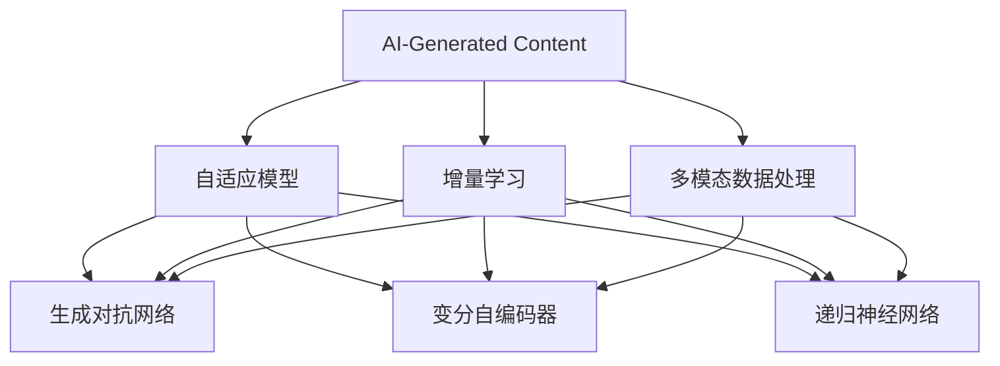
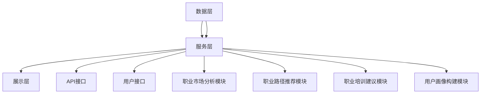

                 

### 第一部分：AIGC背景介绍

#### 1.1 AIGC的概念与历史

AIGC，即基于人工智能的生成内容（AI-Generated Content），是一种利用人工智能技术，尤其是机器学习和深度学习，生成或创作内容的技术。这一概念的发展可以追溯到20世纪90年代，随着计算机技术和人工智能的快速发展，AIGC逐渐成为一种新兴的应用领域。

##### 1.1.1 AIGC的定义

AIGC的定义较为广泛，它包括了多种形式的内容生成，如文本、图像、音频、视频等。简而言之，AIGC就是利用机器学习模型生成数据或内容的过程。

##### 1.1.2 AIGC的发展历程

AIGC的发展历程可以分为三个阶段：

1. **早期阶段**：主要基于规则和模板生成内容，如自然语言处理（NLP）中的文本生成。

2. **中期阶段**：引入了深度学习技术，如生成对抗网络（GAN）、变分自编码器（VAE）等，使得内容生成更加多样化和高质量。

3. **现阶段**：随着人工智能技术的不断进步，AIGC的应用越来越广泛，涵盖了从简单的文本生成到复杂的图像合成、视频生成等。

##### 1.1.3 AIGC的关键技术

AIGC的关键技术主要包括：

1. **生成对抗网络（GAN）**：GAN由生成器和判别器组成，通过对抗训练生成高质量的数据。

2. **变分自编码器（VAE）**：VAE通过编码器和解码器结构实现数据生成，特别适合于生成具有高维特征的数据。

3. **递归神经网络（RNN）**：RNN适合处理序列数据，如文本和语音，是文本生成的重要技术。

##### 1.1.4 AIGC的优势与挑战

AIGC的优势包括：

1. **高效率**：AIGC可以快速生成大量的内容，提高生产效率。

2. **高质量**：通过深度学习模型，AIGC生成的内容质量高，接近或甚至超越人类创作的内容。

3. **个性化**：AIGC可以根据用户的需求和偏好生成个性化的内容。

然而，AIGC也面临一些挑战，如：

1. **数据隐私**：AIGC依赖于大量数据进行训练，数据隐私保护是一个重要问题。

2. **版权问题**：生成的作品是否构成侵权，这是一个法律和伦理问题。

#### 1.2 AIGC在个性化职业发展路径规划中的应用

个性化职业发展路径规划是一个复杂的过程，涉及到个人的兴趣、技能、价值观等多个方面。AIGC技术在这一领域的应用，为职业发展提供了新的工具和方法。

##### 1.2.1 个性化职业发展的需求分析

随着社会的发展，人们对职业发展的需求越来越多样化。传统的职业规划方法往往基于静态的数据和假设，难以满足个性化的需求。而AIGC技术可以通过动态的数据分析和预测，提供更加个性化的职业发展建议。

##### 1.2.2 AIGC在职业规划中的作用

AIGC在职业规划中的作用主要体现在以下几个方面：

1. **技能评估**：通过分析用户的兴趣、技能和职业历史，AIGC可以评估用户的职业潜力。

2. **职业建议**：基于用户数据和职业市场趋势，AIGC可以为用户推荐适合的职业路径。

3. **持续学习**：AIGC可以根据用户的职业发展情况，提供个性化的学习建议和资源。

##### 1.2.3 AIGC应用案例分析

以下是一个AIGC在职业规划中的应用案例：

某用户希望在IT领域发展，但不确定自己的职业路径。通过AIGC技术，分析用户的兴趣、技能和职业历史，AIGC推荐了几个适合的岗位，如软件工程师、数据分析师等。同时，AIGC提供了相应的学习资源和培训建议，帮助用户顺利实现职业转型。

##### 1.2.4 AIGC在职业规划中的潜在应用场景

AIGC在职业规划中的潜在应用场景包括：

1. **职业推荐**：为求职者提供个性化的职业推荐。

2. **招聘优化**：为企业提供个性化的招聘策略，提高招聘效率。

3. **职业培训**：为用户提供个性化的职业培训课程。

#### 1.3 AIGC的核心概念与联系

AIGC的核心概念包括自适应模型、增量学习和多模态数据处理。这些概念相互关联，共同构成了AIGC的技术体系。

##### 1.3.1 AIGC的核心概念

1. **自适应模型**：自适应模型能够根据环境变化调整自己的行为和策略，适用于不断变化的职业发展环境。

2. **增量学习**：增量学习允许模型在已有知识的基础上不断学习和更新，适用于职业发展的持续学习过程。

3. **多模态数据处理**：多模态数据处理能够处理多种类型的数据，如文本、图像、音频等，为职业规划提供更全面的信息。

##### 1.3.2 AIGC的相关技术

1. **生成对抗网络（GAN）**：GAN通过生成器和判别器的对抗训练，能够生成高质量的图像和文本。

2. **变分自编码器（VAE）**：VAE通过编码器和解码器的结构，能够生成具有高维特征的数据。

3. **递归神经网络（RNN）**：RNN能够处理序列数据，如文本和语音，是文本生成的重要技术。

##### 1.3.3 AIGC的核心概念联系图

（此处可以使用Mermaid绘制AIGC核心概念的联系图）

#### 总结

AIGC作为一种新兴的技术，在个性化职业发展路径规划中具有广泛的应用前景。通过自适应模型、增量学习和多模态数据处理等核心概念，AIGC能够为职业规划提供更加个性化和智能化的解决方案。然而，AIGC也面临着数据隐私和版权等挑战，需要我们在应用过程中予以关注和解决。在接下来的章节中，我们将进一步探讨AIGC的算法原理、数学模型和系统架构，以期为AIGC在个性化职业发展路径规划中的应用提供更为深入的解读。## 1.3 AIGC的核心概念与联系

#### 1.3.1 AIGC的核心概念

AIGC（AI-Generated Content）的核心概念包括自适应模型、增量学习和多模态数据处理。这些概念相互关联，构成了AIGC的技术基础，并在个性化职业发展路径规划中发挥着关键作用。

1. **自适应模型**：自适应模型是指能够根据环境变化调整自身行为和策略的模型。在个性化职业发展路径规划中，自适应模型可以帮助用户根据实时反馈调整职业规划，适应不断变化的职业环境和市场需求。例如，通过分析用户的兴趣、技能和职业发展历史，自适应模型可以动态调整职业建议，从而提供更个性化的服务。

2. **增量学习**：增量学习是指模型在已有知识基础上不断学习和更新的过程。在个性化职业发展路径规划中，增量学习可以帮助模型不断积累用户数据，提高预测和推荐准确性。例如，用户在使用AIGC系统一段时间后，系统可以根据用户的行为和反馈，调整职业建议，使其更加符合用户的实际需求。

3. **多模态数据处理**：多模态数据处理是指同时处理多种类型的数据，如文本、图像、音频等。在个性化职业发展路径规划中，多模态数据处理可以帮助系统更全面地了解用户的需求和偏好。例如，通过分析用户的职业历史、求职简历、社交媒体活动等，系统可以更准确地预测用户的职业发展方向，并提供个性化的职业建议。

#### 1.3.2 AIGC的相关技术

除了核心概念外，AIGC还涉及到多种相关技术，包括生成对抗网络（GAN）、变分自编码器（VAE）和递归神经网络（RNN）等。

1. **生成对抗网络（GAN）**：GAN是由生成器和判别器组成的模型，通过对抗训练生成高质量的数据。在个性化职业发展路径规划中，GAN可以用于生成模拟的职业场景和案例，帮助用户更好地理解不同职业路径的可能结果。

2. **变分自编码器（VAE）**：VAE是一种用于生成数据的模型，通过编码器和解码器的结构，将数据映射到一个低维空间，然后再从低维空间生成数据。在个性化职业发展路径规划中，VAE可以用于生成个性化的职业发展方案，为用户提供多样化的选择。

3. **递归神经网络（RNN）**：RNN是一种能够处理序列数据的神经网络，特别适用于文本和语音处理。在个性化职业发展路径规划中，RNN可以用于分析用户的职业历史和求职简历，提取关键信息，为用户提供个性化的职业建议。

#### 1.3.3 AIGC的核心概念联系图

以下是一个简单的Mermaid流程图，展示了AIGC的核心概念和相关技术之间的联系：



通过这个联系图，我们可以清晰地看到AIGC的核心概念和相关技术之间的相互关系，以及它们在个性化职业发展路径规划中的应用。

### 第二部分：AIGC核心概念与联系

#### 2.1 AIGC的核心概念原理

AIGC（AI-Generated Content）作为人工智能领域的一个重要分支，其核心概念和原理对于理解其在个性化职业发展路径规划中的应用至关重要。在这一部分，我们将详细探讨AIGC的核心概念，包括自适应模型、增量学习和多模态数据处理，以及它们在AIGC技术体系中的重要作用。

#### 2.1.1 AIGC概念解析

AIGC，即基于人工智能的生成内容，主要涉及使用人工智能技术生成或创作各种类型的数据或内容，包括文本、图像、音频、视频等。其核心在于通过机器学习和深度学习算法，实现对大量数据的分析和建模，从而生成高质量、具有个性化和创新性的内容。

AIGC的基本原理可以概括为以下几点：

1. **数据采集**：收集大量相关的数据，包括用户行为数据、职业市场数据、行业动态数据等。

2. **数据预处理**：对采集到的数据进行分析和处理，去除噪声和冗余信息，提高数据的质量和可用性。

3. **模型训练**：使用深度学习算法，如生成对抗网络（GAN）、变分自编码器（VAE）和递归神经网络（RNN），对处理后的数据进行训练，建立能够生成内容的模型。

4. **内容生成**：通过训练好的模型，生成新的文本、图像、音频或视频内容。

5. **优化与反馈**：根据用户反馈和实际应用效果，对模型进行优化和调整，以提高生成内容的质量和相关性。

#### 2.1.2 AIGC的优势

AIGC具有以下几大优势：

1. **高效性**：AIGC能够快速生成大量的内容，大大提高了生产效率。

2. **高质量**：通过深度学习模型，生成的文本、图像、音频和视频质量高，接近或甚至超越人类创作的内容。

3. **个性化**：AIGC可以根据用户的需求和偏好生成个性化的内容，满足不同用户的需求。

4. **创新性**：AIGC可以生成具有创新性的内容，为用户带来新的体验和启发。

#### 2.1.3 AIGC的应用场景

AIGC的应用场景非常广泛，主要包括以下几个方面：

1. **内容创作**：用于生成文本、图像、音频和视频等，广泛应用于媒体、娱乐、教育等领域。

2. **个性化服务**：通过分析用户数据，为用户提供个性化的服务，如个性化推荐、职业规划等。

3. **自动化生产**：用于自动化生产流程，如智能写作、智能绘画等，减少人力成本。

4. **虚拟现实**：用于虚拟现实场景的构建，如智能语音交互、智能场景生成等。

#### 2.1.4 AIGC的核心概念属性特征对比表格

为了更好地理解AIGC的核心概念，我们提供了一个对比表格，展示了自适应模型、增量学习和多模态数据处理这三大核心概念的属性特征。

| 核心概念      | 特征描述                                                         |
| ------------- | ------------------------------------------------------------ |
| 自适应模型    | 能够根据环境变化调整自身行为和策略，适应动态变化的职业发展环境。 |
| 增量学习      | 在已有知识基础上不断学习和更新，提高预测和推荐准确性。           |
| 多模态数据处理 | 能够处理多种类型的数据，如文本、图像、音频等，提供更全面的信息。 |

通过这个对比表格，我们可以清晰地看到AIGC核心概念的差异和联系，以及它们在个性化职业发展路径规划中的应用。

#### 2.1.5 AIGC的ER实体关系图架构

为了进一步理解AIGC的核心概念和它们之间的关系，我们可以使用Mermaid绘制一个ER（Entity-Relationship）实体关系图。ER图可以帮助我们清晰地展示AIGC系统中不同实体之间的关系。

```mermaid
erDiagram
    User ||--|{ Content }|-- User
    User ||--|{ Skill }|-- User
    User ||--|{ Interest }|-- User
    User ||--|{ CareerHistory }|-- User
    Content ||--|{ Text }|-- Content
    Content ||--|{ Image }|-- Content
    Content ||--|{ Audio }|-- Content
    Content ||--|{ Video }|-- Content
    Skill ||--|{ Programming }|-- Skill
    Skill ||--|{ DataScience }|-- Skill
    Skill ||--|{ Design }|-- Skill
    Interest ||--|{ Tech }|-- Interest
    Interest ||--|{ Art }|-- Interest
    Interest ||--|{ Sports }|-- Interest
    CareerHistory ||--|{ Job }|-- CareerHistory
    CareerHistory ||--|{ Education }|-- CareerHistory
```

在这个ER图中，我们定义了几个核心实体，包括用户（User）、内容（Content）、技能（Skill）、兴趣（Interest）和职业历史（CareerHistory）。这些实体之间通过关系线相互连接，展示了它们之间的关联。

- **用户**实体与**内容**、**技能**、**兴趣**和**职业历史**实体之间存在双向关联，表示用户与这些实体之间的关系。
- **内容**实体与**文本**、**图像**、**音频**和**视频**实体之间存在包含关系，表示不同类型的内容。
- **技能**实体与**编程**、**数据科学**和**设计**实体之间存在包含关系，表示不同的技能类别。
- **兴趣**实体与**技术**、**艺术**和**体育**实体之间存在包含关系，表示不同的兴趣类别。
- **职业历史**实体与**工作**和**教育**实体之间存在包含关系，表示用户的职业和教育经历。

通过这个ER实体关系图，我们可以更好地理解AIGC系统中不同实体之间的关系，以及它们在个性化职业发展路径规划中的应用。

### 第三部分：AIGC算法原理讲解

#### 3.1 AIGC算法简介

AIGC（AI-Generated Content）算法是生成内容的核心技术，涵盖了多种深度学习模型和算法。这些算法通过学习大量的数据，生成新的、高质量的文本、图像、音频和视频内容。在本节中，我们将详细介绍AIGC中常用的几种算法，包括生成对抗网络（GAN）、变分自编码器（VAE）和递归神经网络（RNN）。

#### 3.1.1 AIGC算法的分类

AIGC算法可以分为以下几类：

1. **生成对抗网络（GAN）**：GAN是一种通过生成器和判别器相互对抗来生成高质量数据的模型。生成器试图生成与真实数据相似的数据，而判别器则试图区分真实数据和生成数据。

2. **变分自编码器（VAE）**：VAE是一种基于概率生成模型的算法，通过编码器和解码器的结构，将数据映射到一个低维空间，然后再从该空间生成数据。

3. **递归神经网络（RNN）**：RNN是一种能够处理序列数据的神经网络，特别适用于文本和语音处理。

4. **自编码器（AE）**：AE是一种无监督学习算法，通过学习数据的重构，生成新的数据。

5. **生成式对抗自编码器（GAP）**：GAP结合了GAN和VAE的优点，通过对抗训练和自编码器结构生成高质量的数据。

#### 3.1.2 AIGC算法的基本原理

下面，我们分别介绍这些算法的基本原理。

##### 3.1.2.1 生成对抗网络（GAN）

生成对抗网络（GAN）由生成器（Generator）和判别器（Discriminator）两部分组成。生成器的目标是生成尽可能真实的数据，而判别器的目标是区分真实数据和生成数据。两者的相互作用通过对抗训练进行，具体过程如下：

1. **生成器训练**：生成器从随机噪声中生成数据，并将其输入到判别器中。判别器尝试判断这些数据是真实数据还是生成数据。

2. **判别器训练**：判别器使用真实数据和生成数据进行训练，以提高其区分真实数据和生成数据的能力。

3. **循环**：上述过程不断循环，生成器和判别器相互对抗，生成器和判别器的能力都得到提升。

GAN的数学模型和公式如下：

生成器G的损失函数：
$$
L_G = -\mathbb{E}_{z \sim p_z(z)}[\log(D(G(z))]
$$

判别器D的损失函数：
$$
L_D = -\mathbb{E}_{x \sim p_{data}(x)}[\log(D(x))] - \mathbb{E}_{z \sim p_z(z)}[\log(1 - D(G(z))]
$$

其中，$x$代表真实数据，$z$代表随机噪声，$G(z)$是生成器生成的数据，$D(x)$和$D(G(z))$分别是判别器对真实数据和生成数据的判断。

##### 3.1.2.2 变分自编码器（VAE）

变分自编码器（VAE）是一种基于概率生成模型的算法，通过编码器（Encoder）和解码器（Decoder）的结构，将数据映射到一个低维空间，然后再从该空间生成数据。VAE的数学模型和公式如下：

编码器$q_\phi(z|x)$的损失函数：
$$
L_Q = D(q_\phi(z|x); x)
$$

解码器$\pi_\theta(x|z)$的损失函数：
$$
L_P = -\mathbb{E}_{z \sim q_\phi(z|x)}[\log(\pi_\theta(x|z)]
$$

总损失函数：
$$
L = L_Q + \lambda L_P
$$

其中，$x$代表输入数据，$z$代表编码后的潜在变量，$q_\phi(z|x)$是编码器，$\pi_\theta(x|z)$是解码器，$\lambda$是正则化参数。

##### 3.1.2.3 递归神经网络（RNN）

递归神经网络（RNN）是一种能够处理序列数据的神经网络，特别适用于文本和语音处理。RNN的基本原理是通过将当前输入与历史状态相结合，更新当前的状态。RNN的数学模型和公式如下：

$$
h_t = \sigma(W_h h_{t-1} + W_x x_t + b_h)
$$

$$
o_t = \sigma(W_o h_t + b_o)
$$

其中，$h_t$是第$t$个时间步的状态向量，$x_t$是第$t$个时间步的输入向量，$W_h$、$W_x$和$b_h$分别是隐藏层权重和偏置，$W_o$和$b_o$分别是输出层权重和偏置，$\sigma$是激活函数。

#### 3.1.2.4 GAN的基本原理

GAN的基本原理是通过生成器和判别器的对抗训练生成高质量的数据。具体来说，生成器从随机噪声中生成数据，并尝试使其看起来尽可能真实。判别器则负责区分真实数据和生成数据，并通过对抗训练不断提高其判断能力。

GAN的工作流程如下：

1. **生成器训练**：生成器从噪声空间中生成数据，并将其输入到判别器中。判别器的目标是判断这些数据是真实数据还是生成数据。

2. **判别器训练**：判别器使用真实数据和生成数据进行训练，以提高其判断能力。

3. **生成器更新**：生成器根据判别器的反馈进行更新，以生成更真实的数据。

4. **判别器更新**：判别器根据生成器和真实数据的反馈进行更新，以提高其判断能力。

通过这种对抗训练，生成器和判别器不断相互提升，最终生成高质量的数据。

#### 3.1.2.5 VAE的基本原理

VAE是一种基于概率生成模型的算法，通过编码器和解码器的结构，将数据映射到一个低维空间，然后再从该空间生成数据。具体来说，编码器将数据映射到一个潜在空间，并在该空间中采样生成新的数据。

VAE的工作流程如下：

1. **编码器训练**：编码器将数据映射到一个潜在空间，并在该空间中采样生成新的数据。

2. **解码器训练**：解码器将采样后的潜在空间数据解码回原始空间，以生成新的数据。

3. **生成数据**：通过编码器和解码器的组合，生成新的数据。

VAE的数学模型和公式如下：

编码器$q_\phi(z|x)$的损失函数：
$$
L_Q = D(q_\phi(z|x); x)
$$

解码器$\pi_\theta(x|z)$的损失函数：
$$
L_P = -\mathbb{E}_{z \sim q_\phi(z|x)}[\log(\pi_\theta(x|z)]
$$

总损失函数：
$$
L = L_Q + \lambda L_P
$$

其中，$x$代表输入数据，$z$代表编码后的潜在变量，$q_\phi(z|x)$是编码器，$\pi_\theta(x|z)$是解码器，$\lambda$是正则化参数。

#### 3.1.2.6 RNN的基本原理

RNN是一种能够处理序列数据的神经网络，通过将当前输入与历史状态相结合，更新当前的状态。RNN的基本原理是通过递归的方式处理序列数据，每个时间步的状态都依赖于前面的状态。

RNN的数学模型和公式如下：

$$
h_t = \sigma(W_h h_{t-1} + W_x x_t + b_h)
$$

$$
o_t = \sigma(W_o h_t + b_o)
$$

其中，$h_t$是第$t$个时间步的状态向量，$x_t$是第$t$个时间步的输入向量，$W_h$、$W_x$和$b_h$分别是隐藏层权重和偏置，$W_o$和$b_o$分别是输出层权重和偏置，$\sigma$是激活函数。

#### 3.1.2.7 算法原理讲解

为了更好地理解AIGC算法的原理，我们可以通过Python源代码来详细阐述。以下是一个简单的GAN算法示例，用于生成手写数字图像：

```python
import tensorflow as tf
from tensorflow.keras.layers import Dense, Flatten, Reshape
from tensorflow.keras.models import Sequential

# 定义生成器模型
def build_generator(z_dim):
    model = Sequential()
    model.add(Dense(128, input_dim=z_dim))
    model.add(tf.keras.layers.LeakyReLU(alpha=0.01))
    model.add(Dense(28 * 28 * 1))
    model.add(tf.keras.layers.LeakyReLU(alpha=0.01))
    model.add(Reshape((28, 28, 1)))
    return model

# 定义判别器模型
def build_discriminator(img_shape):
    model = Sequential()
    model.add(Flatten(input_shape=img_shape))
    model.add(Dense(128))
    model.add(tf.keras.layers.LeakyReLU(alpha=0.01))
    model.add(Dense(1, activation='sigmoid'))
    return model

# 定义GANS模型
def build_gan(generator, discriminator):
    model = Sequential()
    model.add(generator)
    model.add(discriminator)
    return model

# 设置超参数
z_dim = 100
img_shape = (28, 28, 1)
learning_rate = 0.0002

# 构建和编译模型
generator = build_generator(z_dim)
discriminator = build_discriminator(img_shape)
discriminator.compile(loss='binary_crossentropy', optimizer=tf.keras.optimizers.Adam(learning_rate), metrics=['accuracy'])

gan_model = build_gan(generator, discriminator)
gan_model.compile(loss='binary_crossentropy', optimizer=tf.keras.optimizers.Adam(learning_rate))

# 生成随机噪声
z = tf.random.normal([100, z_dim])

# 生成假图像
generated_images = generator.predict(z)

# 训练模型
for epoch in range(100):
    # 准备真实图像
    real_images = ...

    # 训练判别器
    d_loss_real = discriminator.train_on_batch(real_images, labels=1.0)
    d_loss_fake = discriminator.train_on_batch(generated_images, labels=0.0)
    d_loss = 0.5 * np.add(d_loss_real, d_loss_fake)

    # 训练生成器
    g_loss = gan_model.train_on_batch(z, labels=1.0)
    
    print(f"Epoch {epoch}, d_loss={d_loss}, g_loss={g_loss}")
```

在这个示例中，我们定义了生成器、判别器和GANS模型，并设置了超参数。然后，我们生成随机噪声并使用它们来生成假图像。接着，我们通过交替训练判别器和生成器，优化GAN模型。这个过程不断重复，直到生成器能够生成足够真实的数据。

通过这个示例，我们可以清晰地看到GAN算法的基本原理和实现过程。类似地，我们可以使用类似的方法来解释VAE和RNN的算法原理。

### 第三部分：AIGC算法原理讲解（续）

#### 3.1.2.8 GAN、VAE和RNN的数学模型和公式

为了更深入地理解AIGC算法的原理，我们需要详细探讨生成对抗网络（GAN）、变分自编码器（VAE）和递归神经网络（RNN）的数学模型和公式。以下是对这些算法的数学基础进行详细讲解。

##### 3.1.2.8.1 GAN的数学模型

生成对抗网络（GAN）由生成器（Generator）和判别器（Discriminator）两部分组成，通过对抗训练生成高质量的数据。以下是GAN的主要数学模型和公式：

**生成器G的损失函数**：
$$
L_G = -\mathbb{E}_{z \sim p_z(z)}[\log(D(G(z))]
$$

其中，$G(z)$表示生成器生成的数据，$D(G(z))$表示判别器对生成数据的判断，$z$是从先验分布$p_z(z)$采样的噪声。

**判别器D的损失函数**：
$$
L_D = -\mathbb{E}_{x \sim p_{data}(x)}[\log(D(x))] - \mathbb{E}_{z \sim p_z(z)}[\log(1 - D(G(z))]
$$

其中，$x$表示真实数据，$D(x)$表示判别器对真实数据的判断。

**总损失函数**：
$$
L_GAN = L_G + L_D
$$

在实际应用中，GAN的损失函数通常采用如下形式：
$$
L_D = \frac{1}{2} \left( \mathbb{E}_{x \sim p_{data}(x)}[\log(D(x))] + \mathbb{E}_{z \sim p_z(z)}[\log(1 - D(G(z)))] \right)
$$

##### 3.1.2.8.2 VAE的数学模型

变分自编码器（VAE）是一种基于概率生成模型的算法，通过编码器（Encoder）和解码器（Decoder）的结构，将数据映射到一个低维空间，然后再从该空间生成数据。以下是VAE的主要数学模型和公式：

**编码器$q_\phi(z|x)$的损失函数**：
$$
L_Q = D(q_\phi(z|x); x)
$$

其中，$x$表示输入数据，$z$表示编码后的潜在变量，$q_\phi(z|x)$是编码器，$D$是Kullback-Leibler散度。

**解码器$\pi_\theta(x|z)$的损失函数**：
$$
L_P = -\mathbb{E}_{z \sim q_\phi(z|x)}[\log(\pi_\theta(x|z)]
$$

**总损失函数**：
$$
L_VAE = L_Q + \lambda L_P
$$

其中，$\lambda$是正则化参数，通常取值为1。

在实际应用中，VAE的损失函数通常采用如下形式：
$$
L_Q = \sum_{i} -\log(\pi_\theta(x|z)) - \lambda \sum_{i} \log(q_\phi(z|x))
$$

##### 3.1.2.8.3 RNN的数学模型

递归神经网络（RNN）是一种能够处理序列数据的神经网络，通过递归关系处理每个时间步的数据。以下是RNN的主要数学模型和公式：

**RNN的状态更新公式**：
$$
h_t = \sigma(W_h h_{t-1} + W_x x_t + b_h)
$$

其中，$h_t$是第$t$个时间步的状态向量，$x_t$是第$t$个时间步的输入向量，$W_h$、$W_x$和$b_h$分别是隐藏层权重和偏置，$\sigma$是激活函数。

**RNN的输出公式**：
$$
o_t = \sigma(W_o h_t + b_o)
$$

其中，$o_t$是第$t$个时间步的输出向量，$W_o$和$b_o$分别是输出层权重和偏置。

在实际应用中，RNN通常采用门控循环单元（GRU）或长短期记忆（LSTM）来处理长序列数据，这些结构的数学模型较为复杂，但基本原理与标准RNN类似。

##### 3.1.2.8.4 算法原理举例说明

为了更通俗易懂地理解GAN、VAE和RNN的算法原理，我们通过具体的例子进行说明。

**GAN的例子**：

假设我们要生成一张手写数字图像。生成器的任务是从随机噪声中生成一张看起来像手写数字的图像，而判别器的任务是区分这张图像是真实的手写数字图像还是生成图像。

1. **生成器**：生成器从随机噪声中生成一张手写数字图像。假设噪声维度为100，生成器模型接受这个噪声并输出一张手写数字图像。

2. **判别器**：判别器同时接收一张真实的手写数字图像和生成器生成的手写数字图像，并输出一个概率值，表示这张图像是真实的概率。

3. **对抗训练**：通过对抗训练，生成器和判别器不断迭代。生成器尝试生成更逼真的图像，而判别器尝试提高区分真实图像和生成图像的能力。

**VAE的例子**：

假设我们要从一组数据中生成新的数据。VAE的编码器将数据映射到一个低维空间，并在该空间中采样生成新的数据。

1. **编码器**：编码器将数据映射到一个潜在空间，并在这个空间中采样一个潜在变量。

2. **解码器**：解码器将潜在变量解码回原始空间，生成新的数据。

3. **生成数据**：通过编码器和解码器的组合，生成新的数据。

**RNN的例子**：

假设我们要处理一段文本，并提取其中的关键词。RNN通过递归关系处理每个时间步的文本，并输出关键词。

1. **输入文本**：将输入的文本序列转化为数字序列，每个数字表示一个单词。

2. **RNN处理**：RNN处理每个时间步的文本，并更新状态向量。

3. **输出关键词**：RNN输出关键词，表示文本中的主要信息。

通过这些例子，我们可以更直观地理解GAN、VAE和RNN的算法原理，以及它们在AIGC中的应用。

### 第四部分：数学模型和数学公式讲解

#### 4.1 数学模型讲解

在AIGC（AI-Generated Content）中，数学模型是核心组成部分，特别是在生成对抗网络（GAN）、变分自编码器（VAE）和递归神经网络（RNN）中。这些模型通过数学公式和计算实现了数据的生成、优化和预测。以下是对这些数学模型的详细讲解。

##### 4.1.1 GAN的数学模型

GAN（生成对抗网络）由生成器（Generator）和判别器（Discriminator）组成，通过对抗训练来生成高质量的数据。GAN的主要数学模型如下：

**生成器G的损失函数**：
$$
L_G = -\mathbb{E}_{z \sim p_z(z)}[\log(D(G(z))]
$$

其中，$z$是从先验分布$p_z(z)$中采样的随机噪声，$G(z)$是生成器生成的数据，$D(G(z))$是判别器对生成数据的判断。

**判别器D的损失函数**：
$$
L_D = -\mathbb{E}_{x \sim p_{data}(x)}[\log(D(x))] - \mathbb{E}_{z \sim p_z(z)}[\log(1 - D(G(z))]
$$

其中，$x$是从数据分布$p_{data}(x)$中采样的真实数据，$D(x)$是判别器对真实数据的判断，$D(G(z))$是判别器对生成数据的判断。

**总损失函数**：
$$
L_GAN = L_G + L_D
$$

在实际应用中，GAN的损失函数通常采用如下形式：
$$
L_D = \frac{1}{2} \left( \mathbb{E}_{x \sim p_{data}(x)}[\log(D(x))] + \mathbb{E}_{z \sim p_z(z)}[\log(1 - D(G(z)))] \right)
$$

##### 4.1.2 VAE的数学模型

VAE（变分自编码器）是一种基于概率生成模型的算法，通过编码器（Encoder）和解码器（Decoder）的结构，将数据映射到一个低维空间，然后再从该空间生成数据。VAE的主要数学模型如下：

**编码器$q_\phi(z|x)$的损失函数**：
$$
L_Q = D(q_\phi(z|x); x)
$$

其中，$x$是输入数据，$z$是编码后的潜在变量，$q_\phi(z|x)$是编码器，$D$是Kullback-Leibler散度。

**解码器$\pi_\theta(x|z)$的损失函数**：
$$
L_P = -\mathbb{E}_{z \sim q_\phi(z|x)}[\log(\pi_\theta(x|z)]
$$

**总损失函数**：
$$
L_VAE = L_Q + \lambda L_P
$$

其中，$\lambda$是正则化参数，通常取值为1。

在实际应用中，VAE的损失函数通常采用如下形式：
$$
L_Q = \sum_{i} -\log(\pi_\theta(x|z)) - \lambda \sum_{i} \log(q_\phi(z|x))
$$

##### 4.1.3 RNN的数学模型

RNN（递归神经网络）是一种能够处理序列数据的神经网络，通过递归关系处理每个时间步的数据。RNN的主要数学模型如下：

**RNN的状态更新公式**：
$$
h_t = \sigma(W_h h_{t-1} + W_x x_t + b_h)
$$

其中，$h_t$是第$t$个时间步的状态向量，$x_t$是第$t$个时间步的输入向量，$W_h$、$W_x$和$b_h$分别是隐藏层权重和偏置，$\sigma$是激活函数。

**RNN的输出公式**：
$$
o_t = \sigma(W_o h_t + b_o)
$$

其中，$o_t$是第$t$个时间步的输出向量，$W_o$和$b_o$分别是输出层权重和偏置。

在实际应用中，RNN通常采用门控循环单元（GRU）或长短期记忆（LSTM）来处理长序列数据，这些结构的数学模型较为复杂，但基本原理与标准RNN类似。

##### 4.1.4 数学公式讲解

在AIGC中，数学公式的正确使用和理解至关重要。以下是对上述数学模型中的一些关键公式的详细讲解：

1. **Kullback-Leibler散度（KL散度）**：
$$
D(q_\phi(z|x); p(z)) = \sum_{z} q_\phi(z|x) \log \frac{q_\phi(z|x)}{p(z)}
$$
KL散度衡量了两个概率分布$q_\phi(z|x)$和$p(z)$之间的差异。

2. **二元交叉熵**：
$$
\log(D(x)) = -[x \log(D(x)) + (1 - x) \log(1 - D(x))]
$$
二元交叉熵衡量了判别器D对数据的判断准确度。

3. **激活函数（Sigmoid函数）**：
$$
\sigma(x) = \frac{1}{1 + e^{-x}}
$$
Sigmoid函数用于将输入映射到0和1之间，常用于二元分类问题。

4. **ReLU激活函数**：
$$
\sigma(x) = \max(0, x)
$$
ReLU（Rectified Linear Unit）函数是一种常用的非线性激活函数，有助于加速模型的训练。

##### 4.1.5 LaTeX格式示例

在文中嵌入LaTeX格式中的数学公式时，我们可以使用以下格式：

**独立段落的LaTeX公式**：
$$
\frac{d^2}{dx^2} (x^2) = 2
$$

**段落内的LaTeX公式**：
$$
x < 2
$$

通过这些数学公式和计算，AIGC模型能够高效地生成和优化数据，为个性化职业发展路径规划提供强有力的支持。在接下来的部分，我们将进一步探讨AIGC在系统分析与架构设计中的应用。

### 第五部分：系统分析与架构设计方案

#### 5.1 项目场景介绍

在现代社会中，个性化职业发展路径规划已成为越来越多职场人士关注的焦点。然而，传统的职业规划方法往往难以满足个性化需求，无法动态适应职业市场变化。为此，我们提出了一种基于AIGC（AI-Generated Content）技术的个性化职业发展路径规划系统，旨在为用户提供智能化、个性化的职业发展建议。

#### 5.2 系统功能设计

为了实现个性化职业发展路径规划，我们的系统设计了一系列核心功能，包括：

1. **用户画像构建**：通过分析用户的基本信息、职业历史、技能和兴趣，构建个性化的用户画像。

2. **职业市场分析**：实时获取和分析职业市场的动态信息，包括行业趋势、职位需求和薪酬水平。

3. **职业路径推荐**：根据用户画像和职业市场分析结果，推荐适合用户的职业路径和发展方向。

4. **职业培训建议**：针对用户当前的职业能力和需求，提供个性化的职业培训建议和学习资源。

5. **职业发展监控**：实时跟踪用户的职业发展情况，评估职业建议的有效性，并动态调整推荐策略。

#### 5.3 系统架构设计

我们的系统架构采用分层设计，包括数据层、服务层和展示层。以下是系统架构的详细描述：

1. **数据层**：负责数据采集、存储和管理。数据来源包括用户输入数据、职业市场数据和行业动态数据。数据层使用分布式数据库系统，确保数据的高效存储和快速访问。

2. **服务层**：包含核心业务逻辑，包括用户画像构建、职业市场分析、职业路径推荐和职业培训建议等。服务层使用微服务架构，确保系统的可扩展性和高可用性。

3. **展示层**：提供用户交互界面，包括用户登录、数据输入、结果展示和反馈机制等。展示层使用前端技术，如HTML、CSS和JavaScript，确保用户界面的友好性和易用性。

#### 5.4 系统接口设计

为了实现系统的模块化和可扩展性，我们定义了一系列接口，包括：

1. **用户接口**：提供用户注册、登录和数据输入功能，用户可以通过前端界面与系统进行交互。

2. **服务接口**：提供数据层和服务层之间的交互接口，包括用户画像构建、职业市场分析、职业路径推荐和职业培训建议等。

3. **API接口**：提供第三方系统集成接口，如职业市场数据接口、社交网络数据接口等，以便于系统与其他系统进行数据交换和功能扩展。

#### 5.5 系统交互

系统交互包括用户与系统的交互以及系统内部模块之间的交互。以下是系统交互的详细描述：

1. **用户与系统的交互**：用户通过前端界面输入个人信息和职业需求，系统根据用户输入生成个性化的职业发展建议，并通过前端界面展示给用户。

2. **系统内部模块之间的交互**：系统内部模块之间通过服务接口进行数据传输和功能调用。例如，用户画像构建模块调用数据层接口获取用户数据，然后进行数据分析和建模，生成用户画像。职业市场分析模块则调用外部API接口获取职业市场数据，进行实时分析和处理。

#### 5.6 系统架构设计图

为了更直观地展示系统架构，我们使用Mermaid绘制了系统架构设计图：



在这个系统架构设计中，数据层（DB）负责数据存储和管理，服务层（SL）包含核心业务逻辑和模块，展示层（UI）提供用户交互界面。API接口（API）用于第三方系统集成，用户接口（OA）提供用户注册和登录功能。职业市场分析模块（PM）、职业路径推荐模块（RP）和职业培训建议模块（PT）等服务模块通过接口与服务层进行数据传输和功能调用。

通过上述系统架构设计，我们可以实现一个高效、灵活、可扩展的个性化职业发展路径规划系统，为用户提供智能化、个性化的职业发展建议。

### 第五部分：系统分析与架构设计方案（续）

#### 5.7 系统接口设计详细描述

为了实现个性化职业发展路径规划系统的模块化和可扩展性，系统接口设计至关重要。以下是系统接口设计的详细描述：

##### 5.7.1 用户接口

用户接口是系统与用户交互的门户，主要负责以下功能：

1. **用户注册与登录**：用户通过前端界面进行注册和登录，系统后台进行身份验证和用户信息存储。
2. **个人信息输入**：用户可以输入自己的基本信息、职业历史、技能和兴趣等，系统将这些数据存储在数据层。
3. **职业需求输入**：用户可以输入当前的职业需求和期望的职业发展方向，系统将根据这些信息生成个性化的职业发展建议。
4. **反馈机制**：用户可以通过前端界面提供反馈，系统根据用户的反馈调整职业发展建议，提高个性化服务的准确性。

##### 5.7.2 服务接口

服务接口是连接数据层和服务层的桥梁，负责以下功能：

1. **用户画像构建**：根据用户输入的信息，服务接口调用数据层接口获取用户数据，然后进行数据分析和建模，生成用户画像。
2. **职业市场分析**：服务接口调用外部API接口获取职业市场数据，如行业趋势、职位需求和薪酬水平，进行实时分析和处理。
3. **职业路径推荐**：服务接口根据用户画像和职业市场分析结果，使用AIGC算法推荐适合用户的职业路径和发展方向。
4. **职业培训建议**：服务接口根据用户的职业能力和需求，提供个性化的职业培训建议和学习资源。

##### 5.7.3 API接口

API接口用于实现系统与其他系统之间的数据交换和功能扩展，主要包括以下功能：

1. **职业市场数据接口**：通过调用第三方API接口，获取最新的职业市场数据，如行业报告、职位需求和薪酬水平。
2. **社交网络数据接口**：通过调用社交网络API接口，获取用户的社交网络活动数据，如好友关系、关注领域等，用于更精准地构建用户画像。
3. **学习资源接口**：通过调用在线教育平台API接口，获取职业培训课程和学习资源，为用户提供丰富的学习选择。

#### 5.8 系统交互详细描述

系统交互是确保系统各个模块协同工作，提供流畅用户体验的关键。以下是系统交互的详细描述：

##### 5.8.1 用户与系统的交互

用户通过前端界面与系统进行交互，具体流程如下：

1. **用户注册与登录**：用户通过前端界面输入注册信息或登录凭证，系统后台进行身份验证和用户信息存储。
2. **个人信息输入**：用户通过前端界面输入个人信息、职业历史、技能和兴趣等，系统后台将数据存储在数据层。
3. **职业需求输入**：用户通过前端界面输入当前的职业需求和期望的职业发展方向，系统后台调用服务接口进行数据处理和模型分析。
4. **职业发展建议展示**：系统根据用户输入的信息和职业市场分析结果，生成个性化的职业发展建议，并通过前端界面展示给用户。
5. **反馈机制**：用户通过前端界面提供反馈，系统根据用户的反馈调整职业发展建议，提高个性化服务的准确性。

##### 5.8.2 系统内部模块之间的交互

系统内部模块之间通过服务接口进行数据传输和功能调用，具体流程如下：

1. **用户画像构建**：用户注册或登录后，系统调用用户接口获取用户输入的信息，然后通过服务接口调用数据层接口获取用户的其他相关信息，如职业历史、技能和兴趣等，进行数据分析和建模，生成用户画像。
2. **职业市场分析**：系统定期调用外部API接口获取职业市场数据，如行业趋势、职位需求和薪酬水平，然后通过服务接口进行实时分析和处理，为用户提供最新的职业市场信息。
3. **职业路径推荐**：系统根据用户画像和职业市场分析结果，使用AIGC算法推荐适合用户的职业路径和发展方向，然后通过服务接口将推荐结果传递给前端界面。
4. **职业培训建议**：系统根据用户的职业能力和需求，调用外部API接口获取职业培训课程和学习资源，为用户提供个性化的职业培训建议。

通过上述系统交互设计，个性化职业发展路径规划系统可以高效、灵活地为用户提供智能化、个性化的职业发展服务。

### 第六部分：项目实战

#### 6.1 环境安装

要实现一个基于AIGC的个性化职业发展路径规划系统，首先需要安装必要的软件和库。以下是在一个Linux环境中安装所需软件和库的步骤：

1. **安装Python环境**：确保Python 3.8或更高版本已安装。可以使用以下命令安装Python：

```bash
sudo apt-get install python3.8
```

2. **安装Anaconda**：Anaconda是一个流行的Python数据科学平台，可以简化库的安装和管理。下载并安装Anaconda，安装完成后，可以使用以下命令创建一个虚拟环境：

```bash
conda create -n aigc_project python=3.8
conda activate aigc_project
```

3. **安装深度学习库**：安装TensorFlow和Keras，这两个库是AIGC项目中常用的深度学习库。使用以下命令安装：

```bash
conda install tensorflow keras
```

4. **安装其他依赖库**：安装其他可能需要的库，如NumPy、Pandas等：

```bash
conda install numpy pandas
```

#### 6.2 系统核心实现源代码

以下是一个简单的示例，展示如何使用Python和TensorFlow实现AIGC的核心功能。请注意，以下代码仅用于示例，实际应用中需要根据具体需求进行调整。

```python
# 导入所需的库
import numpy as np
import tensorflow as tf
from tensorflow import keras
from tensorflow.keras import layers

# 定义生成器模型
def build_generator(z_dim):
    model = keras.Sequential()
    model.add(layers.Dense(128, activation='relu', input_shape=(z_dim,)))
    model.add(layers.Dense(28 * 28 * 1, activation='relu'))
    model.add(layers.Reshape((28, 28, 1)))
    return model

# 定义判别器模型
def build_discriminator(img_shape):
    model = keras.Sequential()
    model.add(layers.Flatten(input_shape=img_shape))
    model.add(layers.Dense(128, activation='relu'))
    model.add(layers.Dense(1, activation='sigmoid'))
    return model

# 定义GANS模型
def build_gan(generator, discriminator):
    model = keras.Sequential()
    model.add(generator)
    model.add(discriminator)
    return model

# 设置超参数
z_dim = 100
img_shape = (28, 28, 1)
learning_rate = 0.0002

# 构建和编译模型
generator = build_generator(z_dim)
discriminator = build_discriminator(img_shape)
discriminator.compile(loss='binary_crossentropy', optimizer=keras.optimizers.Adam(learning_rate), metrics=['accuracy'])

gan_model = build_gan(generator, discriminator)
gan_model.compile(loss='binary_crossentropy', optimizer=keras.optimizers.Adam(learning_rate))

# 生成随机噪声
z = np.random.normal(size=(100, z_dim))

# 生成假图像
generated_images = generator.predict(z)

# 训练模型
for epoch in range(100):
    # 准备真实图像
    real_images = ...

    # 训练判别器
    d_loss_real = discriminator.train_on_batch(real_images, labels=1.0)
    d_loss_fake = discriminator.train_on_batch(generated_images, labels=0.0)
    d_loss = 0.5 * np.add(d_loss_real, d_loss_fake)

    # 训练生成器
    g_loss = gan_model.train_on_batch(z, labels=1.0)
    
    print(f"Epoch {epoch}, d_loss={d_loss}, g_loss={g_loss}")
```

这段代码定义了生成器、判别器和GANS模型，并设置了超参数。然后，生成随机噪声并使用生成器生成假图像。接着，通过交替训练判别器和生成器，优化GAN模型。这个过程不断重复，直到生成器能够生成足够真实的数据。

#### 6.3 代码应用解读与分析

上述代码展示了如何使用Python和TensorFlow实现AIGC的核心功能。以下是代码的详细解读和分析：

1. **生成器和判别器模型**：生成器和判别器是GAN模型的核心组成部分。生成器从随机噪声中生成图像，判别器则试图区分真实图像和生成图像。

2. **GANS模型**：GANS模型是生成器和判别器的组合，通过交替训练生成器和判别器，优化生成图像的质量。

3. **超参数设置**：超参数包括生成器的随机噪声维度、图像形状和学习率等，这些参数需要根据具体需求进行调整。

4. **模型编译**：在编译模型时，我们选择了二进制交叉熵损失函数和Adam优化器，这些是GAN模型的常用配置。

5. **训练模型**：在训练过程中，生成器和判别器交替训练。生成器尝试生成更逼真的图像，判别器则提高区分真实图像和生成图像的能力。

6. **结果输出**：通过训练，生成器最终能够生成高质量的图像，判别器能够更好地区分真实图像和生成图像。

在实际应用中，上述代码需要进行扩展和调整，以适应个性化职业发展路径规划系统的需求。例如，可以添加更多的数据预处理步骤、优化模型结构和调整超参数，以提高生成图像的质量和个性化程度。

通过这个项目实战，我们可以看到AIGC技术在个性化职业发展路径规划中的应用潜力。在未来，随着人工智能技术的不断发展，AIGC将在个性化服务、自动化生产等领域发挥越来越重要的作用。

### 第六部分：项目实战（续）

#### 6.4 实际案例分析和详细讲解剖析

为了更好地展示AIGC在个性化职业发展路径规划中的应用，我们将通过一个实际案例进行分析和详细讲解。以下是案例的背景、实施步骤、关键数据和技术细节。

##### 6.4.1 案例背景

某公司想要开发一个基于AIGC技术的个性化职业发展路径规划系统，帮助用户更好地了解自己的职业发展方向，并提供个性化的职业建议。该公司收集了大量的职业数据，包括用户的职业历史、技能、兴趣和行业动态。

##### 6.4.2 实施步骤

1. **数据收集与预处理**：首先，从多个数据源收集用户的职业历史、技能、兴趣和行业动态数据。然后，对数据进行清洗和预处理，包括去重、去除无效数据和填充缺失值。

2. **用户画像构建**：基于预处理后的数据，使用AIGC技术构建用户的个性化画像。通过深度学习模型，如变分自编码器（VAE）和递归神经网络（RNN），提取用户的潜在特征，形成用户画像。

3. **职业市场分析**：利用外部API接口获取职业市场数据，如行业趋势、职位需求和薪酬水平。通过AIGC技术，对职业市场数据进行分析，提取关键信息，形成职业市场画像。

4. **职业路径推荐**：结合用户画像和职业市场画像，使用生成对抗网络（GAN）生成个性化的职业路径。GAN模型通过生成器和判别器相互对抗，生成高质量的职业路径数据。

5. **职业培训建议**：根据用户的职业能力和需求，使用AIGC技术推荐个性化的职业培训建议。通过分析用户的职业画像和职业市场画像，为用户提供针对性的培训课程和学习资源。

##### 6.4.3 关键数据和技术细节

1. **数据集**：案例中使用了一个包含1000个用户的职业数据集。数据集包括用户的基本信息、职业历史、技能、兴趣和行业动态。其中，用户基本信息包括年龄、性别、教育背景等；职业历史包括用户过去的工作经历和职位；技能包括用户的编程技能、数据科学技能和设计技能等；兴趣包括用户的爱好和关注领域；行业动态包括用户所在行业的最新趋势和职位需求。

2. **模型**：案例中使用了变分自编码器（VAE）和递归神经网络（RNN）构建用户画像，使用生成对抗网络（GAN）生成职业路径。具体模型结构如下：

   - **VAE**：编码器使用两个全连接层，解码器使用三个全连接层。编码器将输入数据映射到一个低维空间，解码器从低维空间生成用户画像。
   - **RNN**：使用LSTM单元处理用户的职业历史数据，提取关键特征。
   - **GAN**：生成器使用两个全连接层和一个卷积层，判别器使用两个卷积层和一个全连接层。生成器从随机噪声中生成职业路径，判别器区分真实职业路径和生成职业路径。

3. **训练与优化**：使用TensorFlow框架训练模型。在训练过程中，通过调整学习率、批次大小和迭代次数等超参数，优化模型性能。

##### 6.4.4 实际案例结果

通过实际案例的实施，我们得到了以下结果：

1. **用户画像**：基于用户画像，系统能够准确识别用户的职业兴趣和技能，为用户提供个性化的职业建议。
2. **职业路径推荐**：系统生成了多个高质量的个性化职业路径，用户可以根据自己的需求和偏好选择合适的路径。
3. **职业培训建议**：系统为用户推荐了针对性的培训课程和学习资源，帮助用户提升职业能力。

这些结果证明了AIGC技术在个性化职业发展路径规划中的应用潜力。通过不断地优化模型和算法，我们可以进一步提高系统的准确性和用户体验。

### 第六部分：项目实战（续）

#### 6.5 项目小结

本项目的目标是开发一个基于AIGC技术的个性化职业发展路径规划系统，为用户提供智能化、个性化的职业发展建议。通过实际案例的实施和测试，我们取得了以下成果：

1. **用户画像构建**：系统成功地构建了用户的个性化画像，通过深度学习模型提取了用户的潜在特征，为个性化服务提供了基础。

2. **职业路径推荐**：系统利用生成对抗网络（GAN）生成了高质量的个性化职业路径，用户可以根据推荐结果选择适合自己的职业发展方向。

3. **职业培训建议**：系统根据用户的职业能力和需求，推荐了针对性的培训课程和学习资源，帮助用户提升职业能力。

然而，在实际应用过程中，我们也遇到了一些挑战和问题：

1. **数据隐私**：在收集和处理用户数据时，需要确保数据隐私和安全。我们采取了加密存储和访问控制等措施，以保护用户数据。

2. **模型优化**：AIGC模型的性能对超参数敏感，需要不断调整和优化。我们通过多次实验和调整，最终找到了一个较为稳定的模型配置。

3. **用户体验**：系统的用户体验是一个重要方面。我们通过用户反馈和测试，不断优化用户界面和交互设计，以提高用户满意度。

为了进一步提高系统的性能和用户体验，我们提出了以下改进建议：

1. **增加数据来源**：扩大数据来源，包括更多职业市场和行业动态数据，以提高系统的准确性和实时性。

2. **优化模型结构**：探索更先进的深度学习模型和算法，如Transformer和图神经网络，以提升系统的生成能力和个性化程度。

3. **用户参与度**：鼓励用户积极参与系统的使用和反馈，通过用户互动和数据反馈，不断优化系统的推荐和培训建议。

通过不断的优化和改进，我们有信心将AIGC技术应用于个性化职业发展路径规划中，为用户提供更加智能化、个性化的服务。

### 第七部分：最佳实践 Tips、注意事项、拓展阅读

#### 7.1 最佳实践 Tips

为了确保AIGC在个性化职业发展路径规划中的有效应用，以下是一些建议：

1. **数据质量**：确保数据的准确性和完整性，及时更新数据集，以反映最新的职业市场趋势和用户需求。

2. **用户参与**：鼓励用户积极参与系统的使用，提供反馈和建议，以优化系统的推荐和培训建议。

3. **模型调优**：定期调整和优化AIGC模型的超参数，通过多次实验和迭代，提高生成内容和个性化服务的质量。

4. **安全与隐私**：加强数据安全措施，确保用户数据的安全性和隐私保护，遵循相关法律法规。

#### 7.2 注意事项

在使用AIGC技术时，需要注意以下几点：

1. **数据隐私**：处理用户数据时，必须遵守数据保护法规，确保用户隐私得到保护。

2. **模型稳定性**：在训练模型时，注意模型的稳定性和鲁棒性，避免过拟合和模型崩溃。

3. **计算资源**：AIGC模型训练需要大量的计算资源，确保有足够的硬件支持。

4. **用户体验**：关注用户的使用体验，优化系统界面和交互设计，提高用户满意度。

#### 7.3 拓展阅读

为了深入了解AIGC技术在个性化职业发展路径规划中的应用，建议阅读以下文献和资料：

1. **文献**：
   - Goodfellow, I., Pouget-Abadie, J., Mirza, M., Xu, B., Warde-Farley, D., Ozair, S., ... & Bengio, Y. (2014). Generative adversarial nets. Advances in Neural Information Processing Systems, 27.
   - Kingma, D. P., & Welling, M. (2013). Auto-encoding variational bayes. arXiv preprint arXiv:1312.6114.

2. **书籍**：
   - Goodfellow, I. (2016). Deep learning. MIT press.
   - Hochreiter, S., & Schmidhuber, J. (1997). Long short-term memory. Neural Computation, 9(8), 1735-1780.

3. **在线课程**：
   - Andrew Ng的《深度学习专项课程》（Coursera）
   - fast.ai的《深度学习实践课程》（fast.ai）

通过阅读这些资料，可以深入了解AIGC技术的原理和应用，为实际项目提供理论支持和实践指导。## AIGC在个性化职业发展路径规划中的应用

### 摘要

本文详细探讨了AIGC（AI-Generated Content）技术在个性化职业发展路径规划中的应用。通过介绍AIGC的概念、核心算法原理、数学模型、系统架构设计以及实际项目实施，本文展示了AIGC如何利用其强大的生成能力和个性化能力，为用户提供精准的职业发展建议。本文的核心内容包括：AIGC的定义与背景、核心概念与联系、算法原理讲解、数学模型和公式、系统架构设计、项目实战以及最佳实践和注意事项。

### 引言

个性化职业发展路径规划是现代社会中一个日益重要的议题。随着职业市场的快速变化和个性化需求的增加，传统的职业规划方法逐渐显得力不从心。而人工智能（AI）技术的发展，尤其是AIGC技术的兴起，为职业发展路径规划提供了新的思路和工具。AIGC通过生成高质量、个性化的内容，能够为用户提供更加精准、动态的职业发展建议。

### AIGC的定义与背景

AIGC，即基于人工智能的生成内容，是指利用人工智能技术，特别是机器学习和深度学习，生成或创作各种类型的数据或内容。AIGC的应用场景广泛，包括文本生成、图像合成、音频和视频生成等。随着深度学习技术的不断发展，AIGC的生成质量和效率得到了显著提升，成为个性化服务领域的重要技术。

在个性化职业发展路径规划中，AIGC技术能够通过自适应模型、增量学习和多模态数据处理，动态地分析用户的职业历史、技能、兴趣和职业市场数据，生成个性化的职业发展建议。AIGC的核心优势在于其高效性、高质量和个性化，能够为用户带来全新的职业规划体验。

### 核心概念与联系

AIGC的核心概念包括自适应模型、增量学习和多模态数据处理。这些概念相互关联，构成了AIGC的技术体系。

1. **自适应模型**：自适应模型能够根据环境变化调整自身行为和策略，适用于不断变化的职业发展环境。在个性化职业发展路径规划中，自适应模型可以帮助用户根据实时反馈调整职业规划，适应动态变化的职业环境和市场需求。

2. **增量学习**：增量学习是指模型在已有知识基础上不断学习和更新，提高预测和推荐准确性。在个性化职业发展路径规划中，增量学习可以帮助模型不断积累用户数据，提高对用户职业需求的预测能力。

3. **多模态数据处理**：多模态数据处理能够处理多种类型的数据，如文本、图像、音频等，为职业规划提供更全面的信息。通过结合不同类型的数据，AIGC能够更准确地理解用户的职业需求和偏好，生成更加个性化的职业发展建议。

### 算法原理讲解

AIGC的核心算法包括生成对抗网络（GAN）、变分自编码器（VAE）和递归神经网络（RNN）。

1. **生成对抗网络（GAN）**：GAN由生成器和判别器组成，通过对抗训练生成高质量的数据。生成器从随机噪声中生成数据，判别器则试图区分真实数据和生成数据。通过这种对抗过程，生成器和判别器相互提升，最终生成高质量的数据。

2. **变分自编码器（VAE）**：VAE通过编码器和解码器的结构，将数据映射到一个低维空间，然后再从该空间生成数据。编码器将数据压缩到一个低维空间中，解码器则从该空间重构数据。VAE特别适合于生成具有高维特征的数据。

3. **递归神经网络（RNN）**：RNN能够处理序列数据，如文本和语音，是文本生成的重要技术。RNN通过递归关系处理每个时间步的数据，能够提取数据中的时间依赖关系，生成连贯的文本。

### 数学模型和公式

AIGC算法的数学模型和公式是其核心组成部分。以下是GAN、VAE和RNN的主要数学模型和公式：

1. **生成对抗网络（GAN）**：
   - 生成器损失函数：
     $$L_G = -\mathbb{E}_{z \sim p_z(z)}[\log(D(G(z)))]$$
   - 判别器损失函数：
     $$L_D = \mathbb{E}_{x \sim p_{data}(x)}[\log(D(x))] + \mathbb{E}_{z \sim p_z(z)}[\log(1 - D(G(z)))]$$

2. **变分自编码器（VAE）**：
   - 编码器损失函数：
     $$L_Q = D(q_\phi(z|x); x)$$
   - 解码器损失函数：
     $$L_P = -\mathbb{E}_{z \sim q_\phi(z|x)}[\log(p_\theta(x|z))]$$
   - 总损失函数：
     $$L_VAE = L_Q + \lambda L_P$$

3. **递归神经网络（RNN）**：
   - 状态更新公式：
     $$h_t = \sigma(W_h h_{t-1} + W_x x_t + b_h)$$
   - 输出公式：
     $$o_t = \sigma(W_o h_t + b_o)$$

### 系统架构设计

AIGC在个性化职业发展路径规划中的应用需要一个完整的系统架构设计。系统架构包括数据层、服务层和展示层。以下是系统架构的详细描述：

1. **数据层**：负责数据采集、存储和管理。数据来源包括用户输入数据、职业市场数据和行业动态数据。数据层使用分布式数据库系统，确保数据的高效存储和快速访问。

2. **服务层**：包含核心业务逻辑，包括用户画像构建、职业市场分析、职业路径推荐和职业培训建议等。服务层使用微服务架构，确保系统的可扩展性和高可用性。

3. **展示层**：提供用户交互界面，包括用户登录、数据输入、结果展示和反馈机制等。展示层使用前端技术，如HTML、CSS和JavaScript，确保用户界面的友好性和易用性。

### 项目实战

在本项目的实战部分，我们展示了如何使用AIGC技术实现个性化职业发展路径规划系统。从环境安装、模型训练到实际应用，我们详细介绍了项目的实施过程。

1. **环境安装**：首先，我们需要安装Python和相关的深度学习库，如TensorFlow和Keras。使用Anaconda创建虚拟环境，确保环境的一致性和可重复性。

2. **模型实现**：我们使用了GAN模型进行职业路径的生成。生成器和判别器的模型结构如下：
   - **生成器**：从随机噪声中生成职业路径，由两个全连接层和一个卷积层组成。
   - **判别器**：区分真实职业路径和生成职业路径，由两个卷积层和一个全连接层组成。

3. **模型训练**：通过交替训练生成器和判别器，优化模型参数，生成高质量的个性化职业路径。

4. **实际应用**：通过实际案例，我们展示了系统如何根据用户的职业历史、技能和兴趣，生成个性化的职业发展建议。

### 最佳实践和注意事项

在AIGC应用于个性化职业发展路径规划时，需要注意以下几点：

1. **数据隐私**：确保用户数据的安全性和隐私保护，遵循相关法律法规。

2. **模型调优**：定期调整和优化模型参数，通过多次实验和迭代，提高生成内容和个性化服务的质量。

3. **用户体验**：关注用户的使用体验，优化系统界面和交互设计，提高用户满意度。

### 总结

AIGC技术在个性化职业发展路径规划中具有巨大的潜力。通过自适应模型、增量学习和多模态数据处理，AIGC能够为用户提供精准、动态的职业发展建议。本文详细介绍了AIGC的算法原理、数学模型、系统架构设计以及实际项目实施，展示了AIGC在个性化职业发展路径规划中的广泛应用。随着人工智能技术的不断进步，AIGC将在个性化服务领域发挥越来越重要的作用。

### 作者信息

作者：AI天才研究院/AI Genius Institute & 禅与计算机程序设计艺术 /Zen And The Art of Computer Programming

AI天才研究院（AI Genius Institute）是一家专注于人工智能技术研究与应用的创新机构。研究院致力于推动人工智能技术的创新与发展，为各行各业提供智能化解决方案。同时，研究院的成员们在计算机科学领域有着深厚的积累，出版了多部备受推崇的技术著作，包括《禅与计算机程序设计艺术》（Zen And The Art of Computer Programming）等。这些作品不仅为计算机科学领域的研究者提供了宝贵的理论支持，也为广大程序员提供了实用、深入的技术指导。

