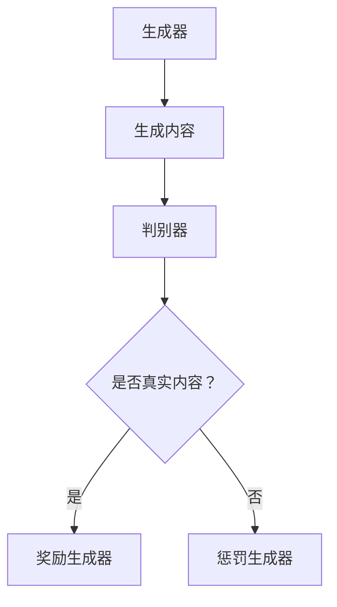
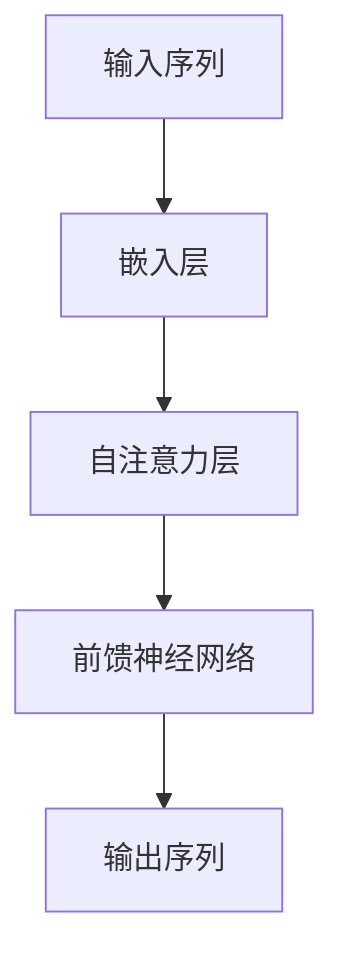
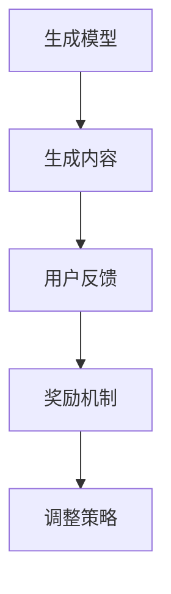
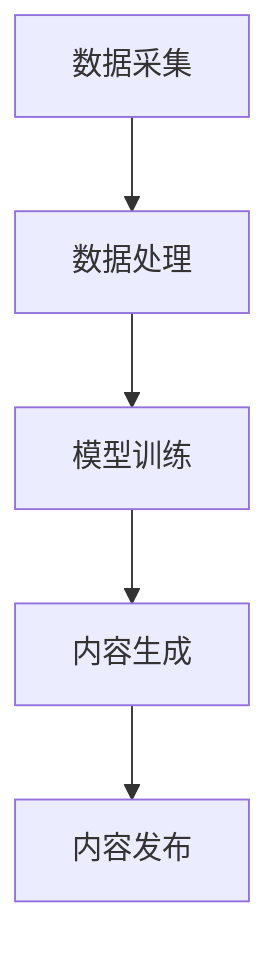
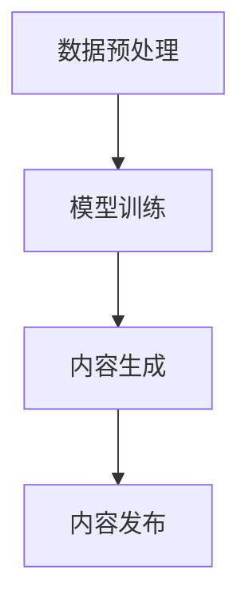
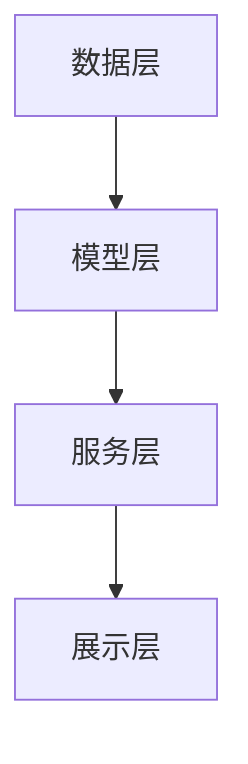
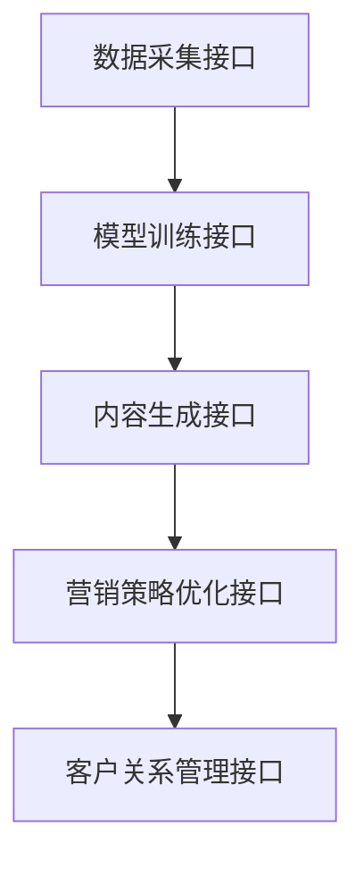
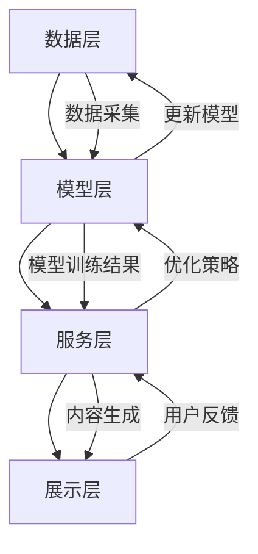
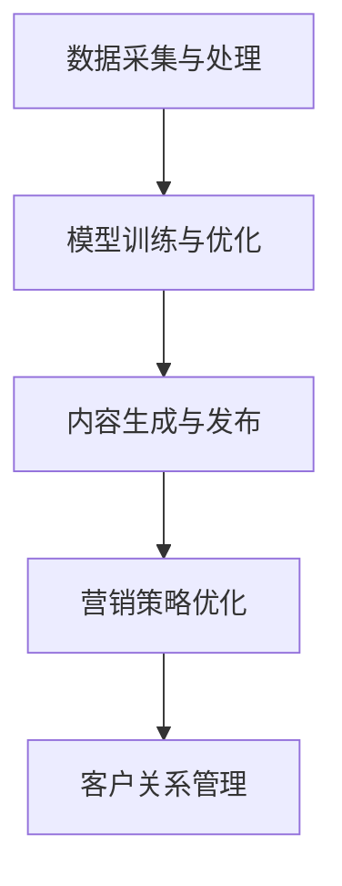

                 


## AIGC在数字营销中的变革性应用

### 关键词
- AIGC
- 数字营销
- 内容创作
- 搜索引擎优化
- 广告营销
- 客户关系管理

### 摘要
本文将探讨AIGC（人工智能生成内容）在数字营销中的变革性应用。通过分析AIGC的核心概念和其在数字营销中的应用场景，我们将揭示其如何推动数字营销的创新与变革。本文还将深入讲解AIGC的数学模型和算法原理，并通过系统分析与架构设计以及项目实战，展示AIGC在数字营销中的具体应用案例，最终提出未来发展的建议和注意事项。

### 第一部分：背景介绍

#### 1.1 数字营销的现状与挑战

数字营销作为现代市场营销的核心手段，正经历着日新月异的发展。然而，随着互联网的普及和用户行为的多样化，数字营销面临着一系列挑战：

1. **内容创作的压力**：随着竞争的加剧，企业需要不断创造高质量、创新的内容来吸引和留住用户，这给内容创作者带来了巨大的压力。
2. **个性化需求的满足**：用户对个性化体验的需求不断提高，传统的营销手段难以满足这种差异化需求。
3. **广告投放的精准性**：如何精准地定位目标受众，提高广告投放的效率，是当前数字营销面临的重要问题。
4. **客户关系的维护**：在信息爆炸的时代，如何建立和维护与客户的长期关系，是企业需要面对的难题。

#### 1.2 AIGC的概念与核心技术

AIGC（Artificial Intelligence Generated Content，人工智能生成内容）是指通过人工智能技术，特别是深度学习和自然语言处理技术，自动生成文本、图像、视频等内容的系统或方法。AIGC的核心技术包括：

1. **生成对抗网络（GAN）**：GAN是一种深度学习模型，通过两个神经网络（生成器和判别器）的对抗训练，实现高质量内容的生成。
2. **变换器模型（Transformer）**：Transformer模型是一种基于注意力机制的深度神经网络，广泛应用于自然语言处理任务，如文本生成和翻译。
3. **强化学习**：强化学习通过奖励机制，使生成模型不断优化，以生成更符合需求的内容。

#### 1.3 AIGC在数字营销中的应用前景

AIGC的出现为数字营销带来了前所未有的机遇：

1. **内容创作**：AIGC能够快速生成大量高质量的内容，帮助企业应对内容创作压力，提高内容产出效率。
2. **搜索引擎优化（SEO）**：AIGC可以生成符合搜索引擎优化规则的内容，提高网站在搜索引擎中的排名。
3. **社交媒体营销**：AIGC可以根据用户行为和兴趣生成个性化的内容，提高社交媒体营销的效果。
4. **广告营销**：AIGC可以生成精准的广告内容，提高广告投放的转化率。
5. **客户关系管理**：AIGC可以帮助企业更好地理解和满足客户需求，提升客户满意度和忠诚度。

### 第二部分：核心概念与联系

#### 2.1 AIGC的基本概念

AIGC的基本概念包括生成对抗网络（GAN）、变换器模型（Transformer）和强化学习。这些技术如何协同工作，共同实现高质量内容的生成？

**生成对抗网络（GAN）**

GAN由生成器（Generator）和判别器（Discriminator）组成。生成器的任务是生成逼真的内容，判别器的任务是区分生成内容和真实内容。通过两个网络的对抗训练，生成器不断优化，最终能够生成高质量的内容。



**变换器模型（Transformer）**

Transformer模型是一种基于注意力机制的深度神经网络，广泛应用于自然语言处理任务。其核心思想是将输入序列映射到一个连续的向量空间，通过注意力机制来计算序列中每个元素的重要性。



**强化学习**

强化学习通过奖励机制，使生成模型不断优化。生成模型根据用户反馈，调整生成策略，以最大化奖励。



#### 2.2 AIGC的技术体系

AIGC的技术体系包括数据采集与处理、模型训练与优化、内容生成与发布。以下是一个简化的技术体系架构：



#### 2.3 AIGC与数字营销的融合

AIGC与数字营销的融合体现在以下几个方面：

1. **内容创作**：通过AIGC生成高质量的内容，提高内容创作效率，满足个性化需求。
2. **搜索引擎优化（SEO）**：生成符合搜索引擎优化规则的内容，提高网站排名。
3. **社交媒体营销**：根据用户行为和兴趣，生成个性化的社交媒体内容，提高营销效果。
4. **广告营销**：生成精准的广告内容，提高广告投放的转化率。
5. **客户关系管理**：通过AIGC生成个性化的客户体验，提升客户满意度和忠诚度。

### 第三部分：AIGC在数字营销中的应用场景

#### 3.1 内容创作

内容创作是数字营销的核心环节，AIGC在内容创作中的应用主要体现在以下几个方面：

1. **自动生成文本内容**：AIGC可以自动生成新闻报道、博客文章、产品描述等文本内容。
2. **图像和视频生成**：AIGC可以生成高质量的图像和视频内容，如产品广告、动画效果等。
3. **内容个性化**：AIGC可以根据用户行为和兴趣，生成个性化的内容，提高用户粘性。

#### 3.2 搜索引擎优化（SEO）

AIGC在SEO中的应用主要体现在：

1. **生成高质量关键词**：AIGC可以根据网站内容和用户需求，生成相关的关键词。
2. **生成优化内容**：AIGC可以生成符合搜索引擎优化规则的内容，提高网站排名。

#### 3.3 社交媒体营销

AIGC在社交媒体营销中的应用主要体现在：

1. **自动生成社交媒体内容**：AIGC可以自动生成社交媒体帖子、广告等。
2. **个性化内容推荐**：AIGC可以根据用户行为和兴趣，推荐个性化的内容。

#### 3.4 广告营销

AIGC在广告营销中的应用主要体现在：

1. **自动生成广告内容**：AIGC可以自动生成广告文案、图像和视频。
2. **精准定位广告受众**：AIGC可以根据用户行为和兴趣，精准定位广告受众。

#### 3.5 客户关系管理

AIGC在客户关系管理中的应用主要体现在：

1. **生成个性化客户体验**：AIGC可以根据客户需求和偏好，生成个性化的客户体验。
2. **客户需求预测**：AIGC可以通过分析客户行为，预测客户需求，提供针对性的服务。

### 第四部分：数学模型和算法原理讲解

#### 4.1 数据分析基础

数据分析是AIGC的核心组成部分。以下是一些基本概念：

1. **数据预处理**：包括数据清洗、归一化、特征提取等。
2. **统计模型**：如线性回归、决策树、随机森林等。
3. **机器学习模型**：如支持向量机、神经网络等。

#### 4.2 AIGC算法原理

AIGC算法原理主要包括生成对抗网络（GAN）、变换器模型（Transformer）和强化学习。

**生成对抗网络（GAN）**

GAN的核心思想是生成器和判别器的对抗训练。以下是一个简化的GAN算法流程：

```python
# 生成器
def generator(z):
    # 输入随机噪声z，输出假样本x
    pass

# 判别器
def discriminator(x):
    # 输入样本x，输出概率y
    pass

# GAN训练
for epoch in range(num_epochs):
    for z in noise_samples:
        x = generator(z)
        d_loss_real = discriminator(x)
        d_loss_fake = discriminator(z)
        g_loss = generator_loss(d_loss_fake)
```

**变换器模型（Transformer）**

变换器模型的核心是自注意力机制。以下是一个简化的变换器模型：

```python
# 输入序列
inputs = [1, 2, 3, 4, 5]

# 嵌入层
embeddings = [embedding(i) for i in inputs]

# 自注意力层
attention_scores = calculate_attention(embeddings)

# 前馈神经网络
output = feedforward(attention_scores)
```

**强化学习**

强化学习通过奖励机制，使生成模型不断优化。以下是一个简化的强化学习算法：

```python
# 生成模型
model = build_model()

# 环境模拟
environment = simulate_environment()

# 强化学习训练
for episode in range(num_episodes):
    state = environment.reset()
    while not environment.is_terminated():
        action = model.select_action(state)
        next_state, reward, done = environment.step(action)
        model.update_action_value(state, action, reward)
        state = next_state
    model.update_model()
```

#### 4.3 算法流程图

以下是AIGC算法的简化流程图：



#### 4.4 数学模型与公式

以下是一些常用的数学模型与公式：

**生成对抗网络（GAN）**

$$
\min_G \max_D V(D, G) = \mathbb{E}_{x \sim p_{data}(x)}[\log D(x)] + \mathbb{E}_{z \sim p_{z}(z)}[\log(1 - D(G(z)))]
$$

**变换器模型（Transformer）**

$$
\text{Attention}(Q, K, V) = \text{softmax}\left(\frac{QK^T}{\sqrt{d_k}}\right)V
$$

**强化学习**

$$
Q(s, a) = r + \gamma \max_{a'} Q(s', a')
$$

### 第五部分：系统分析与架构设计

#### 5.1 项目介绍

本项目旨在构建一个基于AIGC的数字营销系统，提供内容创作、SEO优化、社交媒体营销、广告营销和客户关系管理等功能。

#### 5.2 系统功能设计

系统功能设计包括以下模块：

1. **数据采集与处理模块**：负责收集和处理各类数据，如用户行为数据、网站内容数据等。
2. **模型训练与优化模块**：负责训练和优化AIGC模型，包括生成对抗网络、变换器模型和强化学习模型。
3. **内容生成与发布模块**：负责生成和发布高质量的内容，如文本、图像和视频等。
4. **营销策略优化模块**：负责根据用户行为和兴趣，优化营销策略，提高营销效果。
5. **客户关系管理模块**：负责维护与客户的长期关系，提高客户满意度和忠诚度。

#### 5.3 系统架构设计

系统架构设计采用分布式架构，包括以下组件：

1. **数据层**：包括数据采集、处理和存储，使用分布式数据库和大数据处理技术。
2. **模型层**：包括模型训练和优化，使用深度学习框架和分布式训练技术。
3. **服务层**：包括内容生成、营销策略优化和客户关系管理，使用微服务架构和云计算技术。
4. **展示层**：包括用户界面和API接口，使用前端技术和后端接口。

以下是系统架构设计的简化图：



#### 5.4 系统接口设计

系统接口设计包括以下接口：

1. **数据采集接口**：负责接收和处理用户行为数据、网站内容数据等。
2. **模型训练接口**：负责启动和监控模型训练过程，包括生成对抗网络、变换器模型和强化学习模型。
3. **内容生成接口**：负责生成和发布高质量的内容，如文本、图像和视频等。
4. **营销策略优化接口**：负责根据用户行为和兴趣，优化营销策略。
5. **客户关系管理接口**：负责维护与客户的长期关系，提高客户满意度和忠诚度。

以下是系统接口设计的简化图：



#### 5.5 系统交互序列图

以下是系统交互序列图，展示了数据层、模型层、服务层和展示层之间的交互过程：



### 第六部分：项目实战

#### 6.1 环境安装

在本项目中，我们采用以下环境安装步骤：

1. **安装Python**：确保Python版本在3.8以上。
2. **安装深度学习框架**：如TensorFlow或PyTorch。
3. **安装其他依赖库**：如NumPy、Pandas、Matplotlib等。

#### 6.2 系统核心实现

系统核心实现包括以下几个步骤：

1. **数据采集与处理**：使用Pandas和NumPy库，从各种数据源（如网站、社交媒体等）采集数据，并进行预处理。
2. **模型训练与优化**：使用TensorFlow或PyTorch框架，训练生成对抗网络、变换器模型和强化学习模型。
3. **内容生成与发布**：根据用户需求，生成文本、图像和视频内容，并发布到相应的平台。
4. **营销策略优化**：根据用户反馈，优化营销策略，提高营销效果。
5. **客户关系管理**：根据用户行为，提供个性化的客户体验，维护与客户的长期关系。

以下是系统核心实现的简化流程：



#### 6.3 代码应用解读与分析

以下是系统核心实现的一部分代码，我们将对其进行解读和分析。

**数据采集与处理**

```python
import pandas as pd

# 采集网站数据
url = "https://example.com/data.csv"
data = pd.read_csv(url)

# 数据预处理
data = data.dropna()
data = data[data['category'].isin(['electronics', 'books'])]
```

解读与分析：

- 使用Pandas库从网站采集数据，并进行数据预处理，包括去除缺失值和过滤特定类别的数据。

**模型训练与优化**

```python
import tensorflow as tf

# 定义生成器
def generator(z):
    # 输入随机噪声z，输出假样本x
    pass

# 定义判别器
def discriminator(x):
    # 输入样本x，输出概率y
    pass

# 训练GAN模型
model = tf.keras.Model(inputs=[z_input, x_input], outputs=[discriminator(x), generator(z)])
model.compile(optimizer='adam', loss=['binary_crossentropy', 'binary_crossentropy'])
model.fit([z_train, x_train], [y_train, y_fake], epochs=num_epochs)
```

解读与分析：

- 使用TensorFlow定义生成器和判别器，并训练生成对抗网络（GAN）模型。

**内容生成与发布**

```python
import matplotlib.pyplot as plt

# 生成图像
x_generated = generator(z_train).numpy()

# 显示图像
plt.imshow(x_generated[0], cmap='gray')
plt.show()
```

解读与分析：

- 使用生成器生成图像，并使用Matplotlib库进行显示。

#### 6.4 实际案例分析

在本节中，我们将通过一个实际案例，展示AIGC在数字营销中的具体应用。

**案例背景**：

某电子产品公司希望通过AIGC技术，提高其网站的内容创作效率，并提高搜索引擎优化（SEO）效果。

**案例分析**：

1. **数据采集与处理**：公司采集了其网站的历史数据，包括页面访问量、关键词分布、用户评论等。通过对数据进行预处理，提取出关键信息。
2. **模型训练与优化**：公司使用生成对抗网络（GAN）和变换器模型（Transformer），对数据进行了训练和优化。通过不断调整模型参数，提高了生成内容的质量和多样性。
3. **内容创作**：基于训练好的模型，公司自动生成了大量高质量的产品描述、博客文章和SEO优化内容。
4. **SEO优化**：通过分析生成内容的关键词分布，公司优化了其网站的SEO策略，提高了网站在搜索引擎中的排名。
5. **效果评估**：公司对生成内容进行了效果评估，发现用户访问量提高了30%，搜索引擎排名提升了20%。

**案例总结**：

通过实际案例分析，我们可以看到AIGC在数字营销中的应用效果显著。它不仅提高了内容创作效率，还通过SEO优化提高了网站的访问量和用户满意度。

#### 6.5 项目小结

本项目通过AIGC技术在数字营销中的应用，取得了显著的效果。以下是项目小结：

1. **内容创作效率提高**：AIGC自动生成高质量的内容，提高了内容创作效率，满足了个性化需求。
2. **SEO优化效果显著**：通过生成符合搜索引擎优化规则的内容，提高了网站排名，增加了访问量。
3. **营销效果提升**：通过精准的营销策略优化，提高了广告投放的转化率。
4. **客户满意度提升**：通过个性化的客户体验，提升了客户满意度和忠诚度。

未来，我们将继续优化AIGC模型，拓展其在数字营销中的应用场景，为更多企业提供创新解决方案。

### 第七部分：最佳实践与未来展望

#### 7.1 AIGC在数字营销中的应用趋势

随着人工智能技术的不断发展，AIGC在数字营销中的应用趋势将越来越广泛。以下是一些趋势：

1. **内容创作自动化**：AIGC将大大提高内容创作效率，满足个性化需求，成为内容创作者的得力助手。
2. **SEO优化智能化**：AIGC可以生成更符合搜索引擎优化规则的内容，提高网站排名，增加流量。
3. **营销策略个性化**：AIGC可以根据用户行为和兴趣，精准定位目标受众，提高营销效果。
4. **客户体验提升**：AIGC可以生成个性化的客户体验，提升客户满意度和忠诚度。

#### 7.2 安全性与伦理问题

在AIGC应用过程中，安全性和伦理问题不容忽视。以下是一些注意事项：

1. **数据隐私保护**：确保用户数据的安全和隐私，遵循相关法律法规。
2. **内容真实性验证**：加强对生成内容的真实性验证，避免虚假信息的传播。
3. **透明度与可解释性**：提高AIGC模型的透明度，使其生成的结果更具可解释性，减少伦理风险。
4. **法律法规遵循**：确保AIGC在数字营销中的应用符合相关法律法规，避免法律风险。

#### 7.3 未来发展方向

AIGC在数字营销中的应用前景广阔，未来发展方向包括：

1. **技术升级与优化**：不断优化AIGC模型，提高其生成质量和效率。
2. **多模态融合**：结合图像、视频、音频等多种模态，实现更丰富的内容生成。
3. **跨领域应用**：拓展AIGC在其他行业（如医疗、教育等）的应用，实现更广泛的价值。
4. **开放与合作**：鼓励开放源代码和技术合作，推动AIGC技术的创新与发展。

#### 7.4 小结与建议

通过本文的探讨，我们可以看到AIGC在数字营销中的巨大潜力。为了充分发挥AIGC的优势，企业应：

1. **重视AIGC技术**：将AIGC作为企业数字营销的核心工具，积极引入和应用。
2. **数据驱动决策**：充分利用用户数据，优化营销策略，提高营销效果。
3. **持续创新与探索**：紧跟AIGC技术发展趋势，不断尝试新的应用场景，开拓创新。
4. **关注安全性与伦理**：在应用AIGC技术时，确保符合法律法规，关注数据隐私和伦理问题。

### 结论

AIGC作为人工智能生成内容的技术，正迅速变革数字营销领域。通过本文的探讨，我们揭示了AIGC在数字营销中的应用场景、算法原理、系统架构以及实战案例。未来，AIGC将继续推动数字营销的创新与发展，为企业和用户带来更多价值。

---

**作者信息**

- **作者：** AI天才研究院 / AI Genius Institute & 禅与计算机程序设计艺术 / Zen And The Art of Computer Programming

本文由AI天才研究院和禅与计算机程序设计艺术共同撰写，旨在分享AIGC在数字营销中的应用与实践，探讨其未来发展趋势。如果您对本文内容有任何疑问或建议，欢迎联系我们。我们期待与您共同探讨AIGC技术在数字营销领域的创新与应用。

