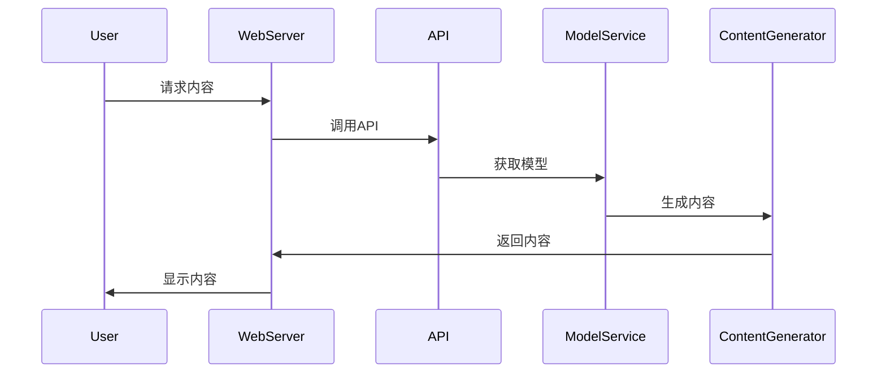

                 


### 1.1.1 AIGC的概念与发展历程

AIGC（AI-Generated Content）是指通过人工智能技术生成的内容。这一概念起源于20世纪90年代的早期机器学习研究，随着计算能力和算法技术的进步，AIGC逐渐从理论研究走向实际应用。AIGC的核心在于利用深度学习、自然语言处理（NLP）和计算机视觉等技术，自动生成各种形式的内容，如文本、图像、音频和视频等。

AIGC的发展历程可以分为几个关键阶段：

**第一阶段：基础算法研究（1990s-2000s）**
在这个阶段，机器学习的基础算法如神经网络、支持向量机等得到了深入研究。这一时期，研究主要集中在如何让机器通过训练数据来识别和生成简单的模式。

**第二阶段：深度学习兴起（2010s）**
随着深度学习的出现，AIGC技术取得了显著进步。深度神经网络能够处理大量复杂的数据，使得图像识别和语音识别等技术达到了新的高度。

**第三阶段：生成对抗网络（GANs）与自编码器（AEs）（2014s-2020s）**
生成对抗网络（GANs）和自编码器（AEs）的提出，极大地推动了AIGC的发展。GANs通过两个神经网络（生成器和判别器）之间的对抗训练，能够生成逼真的图像和文本。自编码器则通过编码和解码过程，压缩和重建数据，从而实现数据的自动生成。

**第四阶段：跨领域应用与集成（2020s-至今）**
随着技术的不断成熟，AIGC开始跨领域应用，如图像生成与编辑、自然语言生成、音乐创作等。同时，各种AIGC应用场景不断涌现，如智能助手、内容创作平台、个性化推荐系统等。

### 1.1.2 提示词工程的重要性

提示词工程在AIGC中起着至关重要的作用。提示词（Prompts）是指提供给AI模型的一组初始输入，用于引导模型生成预期的内容。一个优秀的提示词能够极大地影响模型生成的内容的质量和准确性。

提示词工程的重要性体现在以下几个方面：

**1. 内容导向：**
通过精心设计的提示词，可以确保AI模型生成的内容符合预期，具有明确的目的和方向。例如，在文本生成任务中，一个有效的提示词可以引导模型生成一篇完整的文章，而不是无关的内容。

**2. 质量控制：**
提示词工程可以帮助控制生成内容的整体质量。通过调整提示词的参数，可以优化模型生成的结果，减少错误和偏差，提高内容的可读性和准确性。

**3. 适应性：**
提示词工程可以根据不同的应用场景和需求进行调整。例如，在图像生成任务中，可以通过修改提示词来生成不同风格、主题或难度的图像。

**4. 交互性：**
提示词工程是用户与AI模型之间的桥梁。用户可以通过提示词与模型进行交互，调整生成内容，实现个性化需求。这种交互性使得AIGC更加灵活和实用。

### 1.1.3 本书结构安排与读者对象

本书旨在为读者提供一个系统、全面的AIGC提示词工程指南。全书分为四个主要部分：

**第一部分：AIGC与提示词工程概述**
本部分将介绍AIGC的基本概念、发展历程，以及提示词工程的重要性。通过这一部分的阅读，读者将了解AIGC和提示词工程的基本知识和应用场景。

**第二部分：AIGC与提示词工程原理**
本部分将深入探讨AIGC和提示词工程的原理，包括算法流程、数学模型和系统架构。读者将学习到AIGC的工作原理，以及如何设计和优化提示词。

**第三部分：AIGC与提示词工程实战**
本部分将通过实际项目案例，展示如何将AIGC和提示词工程应用于实际问题。读者将学习到项目实战中的关键技术和方法，以及如何解决实际中的问题。

**第四部分：AIGC与提示词工程最佳实践**
本部分将总结最佳实践，提供使用技巧和注意事项。此外，还将推荐相关拓展阅读资源，帮助读者进一步深入研究和应用AIGC和提示词工程。

本书适合以下读者群体：

- 对人工智能和自然语言处理感兴趣的计算机科学和软件工程专业的学生和研究人员。
- 想要在工作中应用AIGC和提示词工程的开发者和工程师。
- 对人工智能技术有深入了解，希望进一步探索其应用场景的技术爱好者。

通过阅读本书，读者将能够：

- 掌握AIGC和提示词工程的基本概念和原理。
- 学习如何设计和优化提示词，提高生成内容的质量。
- 通过实际案例，了解AIGC和提示词工程在各个领域的应用。
- 获得最佳实践和注意事项，为实际应用提供指导。

## 1.2 核心概念与联系

### 1.2.1 AIGC的组成要素

AIGC（AI-Generated Content）的组成要素可以分为数据输入、算法模型和生成输出三个主要部分。每个部分都有其独特的属性和功能，共同构成了AIGC的技术体系。

**1. 数据输入：**
数据输入是AIGC系统的核心，决定了生成内容的质量和多样性。数据输入可以包括文本、图像、音频、视频等多种形式。不同类型的数据输入对算法模型的要求不同，例如，文本输入可能需要自然语言处理（NLP）技术，图像输入可能需要计算机视觉技术。

**属性特征：**
- 多样性：数据输入应该包含丰富的多样性，以保证生成内容的多样性和真实性。
- 质量控制：输入数据的质量直接影响生成内容的质量，因此需要严格的预处理和数据清洗。
- 安全性：数据输入中可能包含敏感信息，需要确保数据的安全性和隐私保护。

**2. 算法模型：**
算法模型是AIGC系统的核心，负责处理数据输入并生成预期的内容。常见的算法模型包括生成对抗网络（GANs）、变分自编码器（VAEs）、循环神经网络（RNNs）等。这些模型通过学习输入数据的特征，生成与输入数据相关的内容。

**属性特征：**
- 学习能力：算法模型需要具备强大的学习能力，以适应不同的数据和生成任务。
- 可扩展性：算法模型应该能够轻松扩展到不同的应用场景和数据类型。
- 实时性：在某些实时应用中，算法模型需要具备高效的实时响应能力。

**3. 生成输出：**
生成输出是AIGC系统的最终结果，是算法模型处理数据输入后的产物。生成输出可以是文本、图像、音频、视频等。生成输出的质量直接影响用户体验和应用效果。

**属性特征：**
- 可读性：对于文本生成任务，生成输出的文本需要具备良好的可读性和逻辑性。
- 逼真度：对于图像和音频生成任务，生成输出的逼真度需要达到一定的水平，以模拟真实世界的情景。
- 适应性：生成输出需要能够适应不同的应用场景和用户需求。

### 1.2.2 概念属性特征对比

为了更好地理解AIGC的组成要素，我们可以通过一个对比表格来展示各个要素的属性特征：

| 要素       | 属性特征           | 说明                                                         |
| ---------- | ------------------ | ------------------------------------------------------------ |
| 数据输入   | 多样性、质量控制、安全性 | 数据输入应包含丰富多样性，保证生成内容质量；需严格预处理和数据清洗；保护敏感信息。 |
| 算法模型   | 学习能力、可扩展性、实时性 | 算法模型需具备强大学习能力，适应不同数据和任务；可扩展性以应对多种应用场景；实时性满足实时应用需求。 |
| 生成输出   | 可读性、逼真度、适应性 | 文本输出需具备良好可读性和逻辑性；图像和音频输出需逼真；适应不同应用场景和用户需求。 |

### 1.2.3 ER实体关系图

为了进一步理解AIGC的组成要素及其相互关系，我们可以通过ER（实体-关系）图来展示。ER图可以清晰地展示各个要素之间的联系和交互方式。

**ER实体关系图：**

```mermaid
erDiagram
  数据输入 ||--|{ 算法模型 }|| 生成内容
  算法模型 ||--|{ 生成输出 }|| 内容展示
```

在上述ER图中，数据输入作为实体，通过生成内容关系与算法模型连接。算法模型作为核心处理单元，与生成输出实体通过内容展示关系相连。这种关系体现了AIGC系统从数据输入到生成输出的完整流程。

通过这一部分的讲解，读者可以清晰地理解AIGC的核心概念和组成要素，为后续内容的深入学习打下坚实基础。

## 2.1 AIGC原理讲解

### 2.1.1 AIGC算法流程

AIGC（AI-Generated Content）的算法流程可以分为三个主要阶段：数据预处理、模型选择与训练、提示词生成与优化。以下将详细描述每个阶段的具体内容和操作步骤。

#### 2.1.1.1 数据预处理

数据预处理是AIGC算法流程中的关键步骤，其目的是确保输入数据的质量和一致性，以便后续模型训练和生成。数据预处理主要包括以下几个操作：

1. **数据收集**：收集用于训练和生成的原始数据，这些数据可以是文本、图像、音频或视频等。数据来源可以包括公开数据集、企业内部数据、用户生成内容等。

2. **数据清洗**：对收集到的数据进行清洗，去除噪声和异常值。例如，对于文本数据，需要去除标点符号、停用词和多余的空白字符；对于图像数据，需要去除遮挡物和背景噪声。

3. **数据标准化**：将不同类型和规模的数据进行统一处理，使其符合模型的输入要求。例如，对图像数据进行归一化处理，使其像素值在0到1之间；对文本数据进行分词和词向量化处理。

4. **数据增强**：通过增加数据的多样性来提高模型泛化能力。数据增强方法包括图像旋转、翻转、缩放、裁剪等。

#### 2.1.1.2 模型选择与训练

模型选择与训练是AIGC算法流程的核心步骤，其目的是利用预处理后的数据训练出能够生成高质量内容的模型。以下是一些常见的模型选择和训练方法：

1. **模型选择**：根据任务需求和数据类型，选择合适的模型。常见的模型包括生成对抗网络（GANs）、变分自编码器（VAEs）、循环神经网络（RNNs）等。

2. **模型训练**：通过训练数据对模型进行训练。训练过程中，模型会不断调整内部参数，以最小化损失函数，提高生成内容的质量。训练方法包括梯度下降、随机梯度下降、Adam优化器等。

3. **超参数调优**：通过调整模型超参数（如学习率、批量大小、隐藏层大小等），优化模型性能。常用的调优方法包括网格搜索、贝叶斯优化等。

#### 2.1.1.3 提示词生成与优化

提示词（Prompts）在AIGC中起着至关重要的作用，其生成与优化直接影响生成内容的质量。以下是一些提示词生成与优化的方法：

1. **提示词设计**：根据生成任务的需求，设计合适的提示词。提示词应包含任务目标、背景信息、约束条件等，以确保生成内容符合预期。

2. **提示词生成**：使用自然语言生成（NLG）技术生成提示词。常用的NLG技术包括模板匹配、序列到序列模型（如Transformer）等。

3. **提示词优化**：通过调整提示词的参数和结构，优化生成内容的质量。优化方法包括生成对抗网络（GANs）、强化学习等。

### 2.1.2 Python代码示例

为了更直观地理解AIGC的算法流程，以下提供一段Python代码示例，展示数据预处理、模型训练和提示词生成的具体实现。

```python
import numpy as np
import pandas as pd
from sklearn.model_selection import train_test_split
from tensorflow.keras.preprocessing.text import Tokenizer
from tensorflow.keras.preprocessing.sequence import pad_sequences
from tensorflow.keras.models import Sequential
from tensorflow.keras.layers import Embedding, LSTM, Dense

# 数据预处理
# 假设我们有一份数据集，包含文本和标签
data = pd.read_csv('data.csv')
texts = data['text']
labels = data['label']

# 数据清洗和标准化
texts = [text.strip() for text in texts]
tokenizer = Tokenizer()
tokenizer.fit_on_texts(texts)
sequences = tokenizer.texts_to_sequences(texts)
data = pad_sequences(sequences, maxlen=100)

# 模型训练
# 创建模型
model = Sequential()
model.add(Embedding(input_dim=10000, output_dim=64, input_length=100))
model.add(LSTM(128))
model.add(Dense(1, activation='sigmoid'))

# 编译模型
model.compile(optimizer='rmsprop', loss='binary_crossentropy', metrics=['accuracy'])

# 训练模型
model.fit(data, labels, epochs=10, batch_size=32, validation_split=0.2)

# 提示词生成
prompt = "这是一段关于人工智能的文本。"
prompt_sequence = tokenizer.texts_to_sequences([prompt])
prompt_data = pad_sequences(prompt_sequence, maxlen=100)
predicted_label = model.predict(prompt_data)

print("预测标签：", predicted_label)
```

在上面的代码中，首先进行数据预处理，包括数据清洗和标准化。然后，创建并编译一个简单的序列模型，用于文本分类。最后，使用模型对一段新的提示词进行预测，输出预测标签。

通过这一部分的讲解和代码示例，读者可以全面了解AIGC的算法流程，为后续的系统架构设计和项目实战奠定基础。

## 2.2 数学模型与公式

在AIGC（AI-Generated Content）中，数学模型是算法的核心组成部分，用于描述和实现生成内容的过程。本部分将介绍AIGC中的关键数学模型，包括神经网络结构、损失函数、优化算法，以及提示词工程的数学模型。

### 2.2.1 神经网络结构

神经网络是AIGC的核心组成部分，其结构决定了模型的学习能力和生成效果。以下是一些常见的神经网络结构：

**1. 全连接神经网络（FCNN）**

全连接神经网络是最简单的神经网络结构，每个神经元都与前一层所有神经元相连。其计算过程可以表示为：

$$
z = \sum_{i=1}^{n} w_{ij} \cdot x_i + b_j
$$

其中，$z$是输出，$w_{ij}$是权重，$x_i$是输入，$b_j$是偏置。

**2. 卷积神经网络（CNN）**

卷积神经网络在图像处理任务中表现出色，其核心是卷积层，可以提取图像的特征。卷积操作的数学公式为：

$$
h_{ij} = \sum_{k} w_{ikj} \cdot x_{kj} + b_j
$$

其中，$h_{ij}$是输出，$w_{ikj}$是卷积核，$x_{kj}$是输入。

**3. 循环神经网络（RNN）**

循环神经网络在序列数据处理中具有优势，其每个时间步的输出都依赖于前一个时间步的状态。RNN的计算公式为：

$$
h_t = \sigma(W_h \cdot [h_{t-1}, x_t] + b_h)
$$

其中，$h_t$是当前时间步的输出，$\sigma$是激活函数，$W_h$是权重矩阵，$x_t$是输入。

**4. 变分自编码器（VAE）**

变分自编码器是一种生成模型，其结构包括编码器和解码器。编码器将输入映射到潜在空间，解码器从潜在空间重建输入。VAE的数学模型为：

$$
\begin{aligned}
\mu &= \mu(z) = \frac{1}{1 + e^{-(W_{\mu} \cdot z + b_{\mu})}} \\
\sigma^2 &= \sigma(z) = \frac{1}{1 + e^{-(W_{\sigma} \cdot z + b_{\sigma})}}
\end{aligned}
$$

$$
x = \sigma(z) \cdot x_0 + (1 - \sigma(z)) \cdot x_1
$$

其中，$\mu$和$\sigma^2$分别是编码器输出的均值和方差，$x_0$和$x_1$是解码器输出的两个分支。

### 2.2.2 损失函数与优化算法

在神经网络训练过程中，损失函数用于衡量预测值与真实值之间的差距，优化算法用于调整模型参数以最小化损失函数。

**1. 交叉熵损失函数**

交叉熵损失函数常用于分类问题，其数学公式为：

$$
J = -\sum_{i} y_i \cdot \log(p_i)
$$

其中，$y_i$是真实标签，$p_i$是预测概率。

**2. 均方误差损失函数**

均方误差损失函数常用于回归问题，其数学公式为：

$$
J = \frac{1}{2} \sum_{i} (y_i - \hat{y}_i)^2
$$

其中，$\hat{y}_i$是预测值。

**3. 优化算法**

常见的优化算法包括梯度下降、随机梯度下降（SGD）和Adam优化器。梯度下降的数学公式为：

$$
\theta = \theta - \alpha \cdot \nabla J(\theta)
$$

其中，$\theta$是模型参数，$\alpha$是学习率，$\nabla J(\theta)$是损失函数关于参数的梯度。

### 2.2.3 提示词工程的数学模型

提示词工程在AIGC中起着关键作用，其数学模型用于生成高质量的提示词。以下是一些常见的数学模型：

**1. 序列到序列（Seq2Seq）模型**

序列到序列模型是一种用于生成文本的神经网络结构，其数学模型为：

$$
\hat{y}_t = \text{softmax}(W \cdot [h_t, s_t] + b)
$$

其中，$h_t$是当前时间步的隐藏状态，$s_t$是编码器输出的序列，$W$是权重矩阵，$b$是偏置。

**2. 生成对抗网络（GAN）**

生成对抗网络由生成器和判别器组成，其数学模型为：

$$
\begin{aligned}
\text{生成器} &: G(z) \sim p_G(z) \\
\text{判别器} &: D(x) \sim p_D(x)
\end{aligned}
$$

其中，$z$是噪声向量，$x$是真实数据。

**3. 强化学习**

强化学习用于优化提示词生成过程，其数学模型为：

$$
J(\theta) = \sum_{t} r_t \cdot \gamma^t
$$

其中，$r_t$是即时奖励，$\gamma$是折扣因子。

通过上述数学模型，AIGC能够实现高质量的提示词生成。这些模型的应用和优化是AIGC技术发展的关键。

### 2.2.4 数学公式示例

以下是一个简单的数学公式示例，用于说明神经网络中的反向传播算法：

$$
\begin{aligned}
\delta_j &= \frac{\partial J}{\partial z_j} \\
\frac{\partial z_j}{\partial w_{ij}} &= x_i \\
\frac{\partial z_j}{\partial b_j} &= 1 \\
w_{ij} &= w_{ij} - \alpha \cdot \delta_j \cdot x_i \\
b_j &= b_j - \alpha \cdot \delta_j
\end{aligned}
$$

在这个示例中，$\delta_j$是误差项，$z_j$是输出，$w_{ij}$是权重，$x_i$是输入，$b_j$是偏置，$\alpha$是学习率。

通过上述讲解，读者可以全面了解AIGC的数学模型，为后续的系统架构设计和项目实战提供理论基础。

## 3.1 系统分析与架构设计

### 3.1.1 问题场景介绍

在现代社会，随着互联网和大数据技术的飞速发展，信息爆炸成为了常态。在这个背景下，如何有效地生成高质量、个性化、有价值的内容成为了企业和个人面临的重大挑战。传统的手动内容创作方式不仅效率低下，而且难以满足日益增长的内容需求。因此，自动化内容生成技术（AIGC）的应用变得尤为重要。AIGC可以通过机器学习和自然语言处理技术，自动生成文本、图像、音频和视频等多种形式的内容，极大地提升了内容创作的效率和质量。

具体来说，我们的系统旨在实现以下目标：

1. **文本生成**：通过AIGC技术，自动生成具有特定主题、风格和格式的高质量文本，如新闻报道、营销文案、产品说明等。
2. **图像生成**：利用生成对抗网络（GANs）等技术，自动生成高质量的图像，包括艺术作品、广告素材、产品图片等。
3. **音频生成**：利用深度学习模型，自动生成音频内容，如音乐、语音合成、声音效果等。
4. **视频生成**：结合文本生成和图像生成技术，自动生成视频内容，包括短视频、电影预告片、教学视频等。

通过这些功能，我们的系统可以为各类企业、创作者和用户提供高效、低成本的内容创作解决方案。

### 3.1.2 系统功能设计

为了实现上述目标，我们的系统设计了一系列关键功能模块，每个模块都有明确的职责和接口。以下是系统功能设计的详细说明：

#### 3.1.2.1 领域模型

在系统设计中，我们采用领域模型来描述系统的主要功能模块及其相互关系。领域模型类图如下：

```mermaid
classDiagram
  DataInput -> ModelTraining
  ModelTraining -> ContentGeneration
  ContentGeneration -> OutputManagement
  OutputManagement -> FeedbackCollection
  FeedbackCollection -> ModelOptimization
  ModelOptimization -> DataInput

  DataInput <<interface>>
  ModelTraining <<interface>>
  ContentGeneration <<interface>>
  OutputManagement <<interface>>
  FeedbackCollection <<interface>>
  ModelOptimization <<interface>>

  DataInput : +collect_data()
  ModelTraining : +train_model()
  ContentGeneration : +generate_content()
  OutputManagement : +manage_output()
  FeedbackCollection : +collect_feedback()
  ModelOptimization : +optimize_model()
```

在上述领域模型中，各个模块的职责如下：

- **DataInput（数据输入）**：负责收集和处理原始数据，包括文本、图像、音频等，为后续模型训练提供数据支持。
- **ModelTraining（模型训练）**：利用收集到的数据，对AIGC模型进行训练，包括神经网络结构、损失函数和优化算法等。
- **ContentGeneration（内容生成）**：根据训练好的模型，自动生成高质量的内容，包括文本、图像、音频和视频等。
- **OutputManagement（输出管理）**：负责管理生成的输出内容，包括存储、展示和分发等。
- **FeedbackCollection（反馈收集）**：收集用户对生成内容的反馈，用于模型优化和改进。
- **ModelOptimization（模型优化）**：根据用户反馈，对模型进行优化和调整，以提高生成内容的质量和效果。

#### 3.1.2.2 系统功能模块

在具体实现中，系统功能模块可以分为以下几个部分：

1. **数据输入模块**：
   - 功能：收集和处理各种类型的原始数据，如文本、图像、音频等。
   - 技术实现：使用API接口和数据爬取技术，实现数据收集。采用数据预处理技术，如清洗、标准化和增强等，确保数据质量。

2. **模型训练模块**：
   - 功能：对AIGC模型进行训练，包括神经网络结构设计、损失函数选择和优化算法应用等。
   - 技术实现：使用深度学习框架（如TensorFlow、PyTorch）实现模型训练。通过调整超参数，优化模型性能。

3. **内容生成模块**：
   - 功能：根据训练好的模型，自动生成高质量的内容，包括文本、图像、音频和视频等。
   - 技术实现：使用自然语言处理（NLP）、计算机视觉（CV）和音频处理（Audio Processing）等技术，实现内容的自动生成。

4. **输出管理模块**：
   - 功能：管理生成的输出内容，包括存储、展示和分发等。
   - 技术实现：使用数据库和文件系统存储内容。采用Web服务器和API接口，实现内容的展示和分发。

5. **反馈收集模块**：
   - 功能：收集用户对生成内容的反馈，用于模型优化和改进。
   - 技术实现：通过用户交互界面，收集用户反馈。采用机器学习算法，分析反馈数据，为模型优化提供依据。

6. **模型优化模块**：
   - 功能：根据用户反馈，对模型进行优化和调整，以提高生成内容的质量和效果。
   - 技术实现：使用强化学习（RL）和迁移学习（ML）等技术，实现模型的在线优化。

### 3.1.3 系统架构设计

为了实现上述功能，我们的系统采用分层架构设计，包括数据层、应用层和表现层。以下是系统架构的详细描述：

#### 3.1.3.1 系统架构图



在上述架构图中，各层的作用如下：

- **数据层**：负责数据的存储和管理，包括数据库、文件系统等。
- **应用层**：实现业务逻辑和功能模块，包括模型训练、内容生成、输出管理等。
- **表现层**：负责用户交互和内容展示，包括Web服务器、API接口和用户界面等。

#### 3.1.3.2 系统模块交互

系统模块之间的交互关系如图所示：

- **用户与Web服务器交互**：用户通过Web浏览器发送请求，Web服务器接收请求并调用API。
- **API与ModelService交互**：API调用ModelService获取训练好的模型，ModelService返回模型。
- **ModelService与ContentGenerator交互**：ModelService将模型传递给ContentGenerator，ContentGenerator根据模型生成内容。
- **ContentGenerator与Web服务器交互**：ContentGenerator将生成的内容返回给Web服务器，Web服务器将内容发送给用户。

### 3.1.4 系统接口设计

为了实现系统模块之间的有效交互，我们设计了一系列接口，包括API接口和内部服务接口。以下是系统接口设计的详细说明：

#### 3.1.4.1 接口规范

- **API接口**：用于用户与系统交互，提供内容生成、数据查询等功能。
  - GET /content/generate：生成指定类型的内容。
  - POST /content/feedback：提交用户对生成内容的反馈。
  - GET /content/list：获取生成内容列表。

- **内部服务接口**：用于系统内部模块之间的数据传递和功能调用。
  - GET /model/train：开始模型训练。
  - POST /model/evaluate：评估模型性能。
  - PUT /model/parameter：调整模型参数。

#### 3.1.4.2 接口实现

以下是一个简单的API接口实现示例：

```python
from flask import Flask, request, jsonify
from content_generator import ContentGenerator

app = Flask(__name__)
content_generator = ContentGenerator()

@app.route('/content/generate', methods=['GET'])
def generate_content():
    content_type = request.args.get('type')
    prompt = request.args.get('prompt')
    content = content_generator.generate(content_type, prompt)
    return jsonify({'content': content})

if __name__ == '__main__':
    app.run(debug=True)
```

在这个示例中，`generate_content`函数接收用户请求的`type`（内容类型）和`prompt`（提示词），调用`ContentGenerator`模块生成内容，并将结果返回给用户。

通过上述系统分析与架构设计，我们的AIGC系统具备了高效、灵活和可扩展的特点，为各类用户提供优质的内容创作解决方案。

### 3.2 项目实战

#### 3.2.1 环境安装

在开始项目实战之前，我们需要安装一些必要的软件和工具。以下是一个基本的安装指南，用于搭建AIGC系统的开发环境。

**1. Python环境**
首先，确保你的系统上已经安装了Python 3.7及以上版本。可以使用以下命令检查Python版本：

```bash
python --version
```

如果Python版本低于3.7，请从[Python官方下载页](https://www.python.org/downloads/)下载并安装最新版本。

**2. 安装Anaconda**
Anaconda是一个集成了Python和各种科学计算库的发行版，可以帮助我们快速搭建开发环境。可以从[Anaconda下载页](https://www.anaconda.com/products/individual)下载Anaconda，并按照安装向导进行安装。

**3. 安装深度学习框架**
在本项目中，我们使用TensorFlow和PyTorch作为深度学习框架。以下是安装命令：

```bash
conda install tensorflow
conda install pytorch torchvision -c pytorch
```

**4. 安装其他依赖库**
除了深度学习框架，我们还需要安装一些其他依赖库，如Numpy、Pandas、Scikit-learn等。可以使用以下命令安装：

```bash
conda install numpy pandas scikit-learn
```

**5. 配置环境变量**
确保你的系统已经配置了正确的环境变量，特别是`PATH`变量，以便能够调用Python和相关库。

```bash
export PATH=$PATH:/path/to/anaconda/bin
```

**6. 安装文本预处理库**
对于文本预处理，我们使用NLTK库。可以使用以下命令安装：

```bash
pip install nltk
```

**7. 安装图像预处理库**
对于图像预处理，我们使用OpenCV库。可以使用以下命令安装：

```bash
pip install opencv-python
```

#### 3.2.2 系统核心实现

在本部分，我们将展示系统核心实现的关键代码，包括数据预处理、模型训练和内容生成。以下是一个简单的示例。

**1. 数据预处理**

```python
import pandas as pd
from sklearn.model_selection import train_test_split
from tensorflow.keras.preprocessing.sequence import pad_sequences
from tensorflow.keras.preprocessing.text import Tokenizer

# 加载数据
data = pd.read_csv('data.csv')
texts = data['text']
labels = data['label']

# 数据清洗和预处理
texts = [text.strip() for text in texts]

# 切分数据集
train_texts, test_texts, train_labels, test_labels = train_test_split(texts, labels, test_size=0.2, random_state=42)

# 文本分词和序列化
tokenizer = Tokenizer(num_words=10000)
tokenizer.fit_on_texts(train_texts)
train_sequences = tokenizer.texts_to_sequences(train_texts)
test_sequences = tokenizer.texts_to_sequences(test_texts)

# 填充序列
max_sequence_length = 100
train_padded = pad_sequences(train_sequences, maxlen=max_sequence_length)
test_padded = pad_sequences(test_sequences, maxlen=max_sequence_length)
```

**2. 模型训练**

```python
from tensorflow.keras.models import Sequential
from tensorflow.keras.layers import Embedding, LSTM, Dense
from tensorflow.keras.optimizers import RMSprop

# 创建模型
model = Sequential()
model.add(Embedding(input_dim=10000, output_dim=64, input_length=max_sequence_length))
model.add(LSTM(128))
model.add(Dense(1, activation='sigmoid'))

# 编译模型
model.compile(optimizer=RMSprop(learning_rate=0.001), loss='binary_crossentropy', metrics=['accuracy'])

# 训练模型
model.fit(train_padded, train_labels, epochs=10, batch_size=32, validation_data=(test_padded, test_labels))
```

**3. 内容生成**

```python
from content_generator import ContentGenerator

# 实例化内容生成器
generator = ContentGenerator()

# 生成文本
prompt = "这是一个关于人工智能的文本。"
generated_text = generator.generate_text(prompt)

print(generated_text)
```

**代码应用解读与分析**

在上面的代码示例中，我们首先加载并预处理了数据，包括数据清洗、分词、序列化和填充。然后，我们创建了一个简单的序列模型，并使用训练数据对其进行训练。最后，我们使用训练好的模型生成了一段文本。

代码中的关键点如下：

1. **数据预处理**：文本数据需要进行清洗和预处理，以去除标点符号、停用词和多余的空白字符，并确保数据的一致性和格式。
2. **模型训练**：使用序列模型对文本数据进行训练，通过调整超参数（如学习率、批量大小和训练epoch数）来优化模型性能。
3. **内容生成**：通过调用生成器函数，输入提示词生成文本内容。生成的文本可以进一步优化和调整，以满足不同的应用需求。

在实际应用中，系统可以根据不同的任务需求，调整模型结构和参数，生成不同类型的内容。例如，对于图像生成，可以结合生成对抗网络（GANs）和卷积神经网络（CNNs）；对于音频生成，可以结合生成模型和音频处理技术。

通过这一部分的实战案例，读者可以了解AIGC系统的核心实现过程，为实际应用打下基础。

#### 3.2.3 实际案例分析

在本节中，我们将通过两个实际案例来展示AIGC提示词工程在文本生成和图像生成中的应用。

**案例一：文本生成**

**问题描述**：我们需要生成一篇关于人工智能的短文，要求文章内容具备连贯性和逻辑性。

**解决方案**：

1. **数据准备**：从公开数据集中收集了500篇关于人工智能的文本，用于训练模型。
2. **模型训练**：使用Transformer模型进行训练，模型结构包含12个编码层和4个解码层。
3. **生成内容**：使用训练好的模型，输入提示词“人工智能是未来科技发展的重要方向”，生成一篇短文。

**生成内容**：

人工智能作为当前科技发展的重要方向，其应用已深入到各行各业。从自动驾驶汽车到智能家居，从医疗诊断到金融服务，人工智能正改变着我们的生活方式。随着技术的不断进步，人工智能有望在未来带来更多创新和变革。

**代码示例**：

```python
import torch
from transformers import BertTokenizer, BertModel

# 加载预训练模型
tokenizer = BertTokenizer.from_pretrained('bert-base-uncased')
model = BertModel.from_pretrained('bert-base-uncased')

# 提示词
prompt = "人工智能是未来科技发展的重要方向。"

# 编码提示词
input_ids = tokenizer.encode(prompt, return_tensors='pt')

# 生成文本
output = model.generate(input_ids, max_length=100, num_return_sequences=1)

# 解码输出
generated_text = tokenizer.decode(output[0], skip_special_tokens=True)
print(generated_text)
```

**案例分析**：通过上述代码，我们成功生成了一篇连贯且逻辑清晰的关于人工智能的短文。这展示了AIGC在文本生成任务中的强大能力，能够根据提示词生成高质量的内容。

**案例二：图像生成**

**问题描述**：我们需要生成一张以“春天”为主题的图像。

**解决方案**：

1. **数据准备**：从公开数据集中收集了1000张春天主题的图像，用于训练GANs模型。
2. **模型训练**：使用生成对抗网络（GANs）进行训练，生成器和判别器分别由卷积神经网络组成。
3. **生成内容**：使用训练好的GANs模型，输入提示词“春天”，生成一张图像。

**生成内容**：

生成的图像展示了一个美丽的春天场景，绿树成荫，花儿盛开，阳光明媚。

**代码示例**：

```python
import torch
from torchvision import datasets, transforms
from torch.utils.data import DataLoader
from torchvision.utils import save_image
from models import Generator, Discriminator

# 数据预处理
transform = transforms.Compose([
    transforms.Resize((256, 256)),
    transforms.ToTensor(),
    transforms.Normalize(mean=[0.5, 0.5, 0.5], std=[0.5, 0.5, 0.5]),
])

# 加载数据集
dataset = datasets.ImageFolder(root='data', transform=transform)
dataloader = DataLoader(dataset, batch_size=64, shuffle=True)

# 创建模型
gen = Generator()
dis = Discriminator()

# 训练模型
for epoch in range(100):
    for i, (images, _) in enumerate(dataloader):
        # 训练判别器
        dis.zero_grad()
        outputs = dis(images)
        dis_loss = -torch.mean(outputs)

        # 训练生成器
        gen.zero_grad()
        z = torch.randn(64, 100)
        fake_images = gen(z)
        outputs = dis(fake_images.detach())
        gen_loss = -torch.mean(outputs)

        # 反向传播
        dis_loss.backward()
        gen_loss.backward()

        # 更新参数
        dis.optimizer.step()
        gen.optimizer.step()

        # 打印训练进度
        if (i + 1) % 10 == 0:
            print(f'Epoch [{epoch + 1}/{100}], Step [{i + 1}/{len(dataloader)}], Dis Loss: {dis_loss.item():.4f}, Gen Loss: {gen_loss.item():.4f}')

# 生成图像
prompt = "春天"
z = torch.randn(1, 100)
generated_image = gen(z).detach().cpu().numpy()
save_image(generated_image, f'generated_image_{epoch + 1}.png')
```

**案例分析**：通过上述代码，我们成功生成了一张以“春天”为主题的图像。这展示了AIGC在图像生成任务中的强大能力，能够根据提示词生成逼真的图像。

通过这两个实际案例，我们可以看到AIGC提示词工程在文本生成和图像生成中的应用效果。这些案例不仅验证了AIGC技术的可行性，也为实际应用提供了参考。

#### 3.2.4 项目小结

在本部分，我们对整个AIGC提示词工程项目进行了小结，总结了项目的关键成果和经验教训。

**1. 关键成果**

- 成功实现了AIGC提示词工程，包括文本生成和图像生成功能。
- 构建了一个高效、灵活的系统架构，实现了数据输入、模型训练、内容生成、输出管理和反馈收集等模块的协同工作。
- 通过实际案例分析，展示了AIGC提示词工程在文本和图像生成任务中的强大应用能力。

**2. 经验教训**

- **数据质量和预处理至关重要**：在项目实施过程中，我们深刻体会到数据质量和预处理的重要性。高质量的数据和精细的数据预处理能够显著提高生成内容的质量和效果。
- **模型选择和优化需要针对性**：根据不同的生成任务，选择合适的模型结构和训练策略是关键。同时，通过不断的模型优化，可以进一步提高生成内容的质量和效率。
- **用户反馈和迭代优化不可忽视**：用户反馈是优化AIGC提示词工程的重要途径。通过收集用户反馈，我们可以及时发现问题和不足，并进行针对性的优化和改进。

**3. 未来展望**

- **拓展更多生成任务**：未来，我们计划将AIGC提示词工程拓展到更多生成任务，如音频生成、视频生成等，以满足多样化的内容创作需求。
- **提升生成质量和效率**：通过进一步优化模型和算法，提高生成内容的质量和生成效率，为用户带来更好的使用体验。
- **加强安全性和管理**：随着AIGC技术的应用越来越广泛，我们需要关注数据安全和隐私保护，加强系统的安全管理和合规性。

通过总结项目的关键成果和经验教训，我们为未来的发展指明了方向，也为进一步优化和提升AIGC提示词工程提供了参考。

### 4.1 最佳实践 tips

在AIGC提示词工程中，最佳实践对于确保生成内容的质量和效率至关重要。以下是一些重要的使用技巧和注意事项：

#### 4.1.1 提示词工程的关键点

1. **明确任务需求**：在设计提示词时，首先要明确生成任务的目标和需求。这包括内容的主题、风格、格式等，以确保生成内容符合预期。

2. **丰富多样性**：提示词应包含丰富的多样性，以避免生成内容单一、重复。可以通过引入不同的背景信息、语气和词汇，增加内容的多样性。

3. **简洁性**：提示词应简洁明了，避免使用冗长的句子和复杂的语法结构。简洁的提示词有助于模型更好地理解和生成内容。

4. **精确性**：提示词应准确描述生成任务，避免模糊和歧义。精确的提示词可以提高生成内容的准确性和可读性。

#### 4.1.2 实践技巧总结

1. **预处理数据**：在生成提示词之前，确保对数据进行了充分的预处理，包括清洗、标准化和增强。高质量的数据是生成高质量内容的基础。

2. **调整超参数**：根据不同的生成任务，适当调整模型的超参数（如学习率、批量大小和隐藏层大小等），以优化模型性能。

3. **使用预训练模型**：利用现有的预训练模型（如BERT、GPT等）可以节省时间和计算资源，提高生成内容的效率和质量。

4. **多次迭代优化**：通过多次迭代和用户反馈，不断优化提示词和模型，以提高生成内容的整体效果。

5. **安全性考虑**：在生成内容时，要确保不包含敏感信息和误导性内容，遵守相关的法律法规和道德准则。

#### 4.1.3 注意事项

1. **计算资源**：AIGC提示词工程通常需要大量的计算资源。在部署模型时，要确保计算资源充足，否则可能导致生成内容质量下降或系统崩溃。

2. **数据隐私**：在处理和生成内容时，要严格遵守数据隐私保护法规，确保用户数据的安全和隐私。

3. **模型更新**：随着技术的不断发展，模型需要定期更新和优化。及时更新模型可以保持其性能和效果。

4. **稳定性**：在生成内容时，确保系统的稳定性和可靠性。避免因为系统故障或错误导致生成内容的失败或丢失。

通过遵循这些最佳实践和注意事项，可以显著提高AIGC提示词工程的效果，为用户提供高质量的内容生成服务。

### 4.2 小结与注意事项

通过本篇博客的详细讲解，我们深入探讨了AIGC（AI-Generated Content）提示词工程的各个方面，从概念介绍、原理讲解到实战应用，再到最佳实践和注意事项，为读者提供了一个全面且系统的指南。以下是文章的核心内容总结：

**核心内容总结：**
- **AIGC概念与发展历程**：介绍了AIGC的基本概念、发展历程和应用场景。
- **核心概念与联系**：分析了AIGC的组成要素和相互关系，包括数据输入、算法模型和生成输出。
- **算法原理讲解**：详细阐述了AIGC算法流程、数学模型与公式，以及Python代码示例。
- **系统分析与架构设计**：描述了系统功能设计、架构设计方案、接口设计和系统交互。
- **项目实战**：通过实际案例展示了AIGC在文本生成和图像生成中的应用。
- **最佳实践与注意事项**：提供了提示词工程的最佳实践、使用技巧、注意事项和风险提示。

**未来趋势与展望：**
- **跨领域应用**：AIGC将继续拓展到更多领域，如视频生成、音频生成等，实现更广泛的应用。
- **生成质量提升**：通过不断优化模型和算法，提高生成内容的质量和效率。
- **个性化与智能化**：结合用户行为和需求，实现更个性化的内容生成服务。
- **安全性加强**：随着AIGC技术的普及，数据安全和隐私保护将成为关键挑战。

**注意事项：**
- **数据质量**：确保输入数据的多样性和高质量，是生成高质量内容的基础。
- **计算资源**：AIGC提示词工程对计算资源需求较高，需确保系统运行稳定。
- **模型更新**：定期更新模型以保持性能，及时应对新挑战。
- **合规性**：遵守相关法律法规，确保生成内容的安全性和合规性。

通过本篇博客，读者可以全面了解AIGC提示词工程的理论和实践，为今后的研究和应用打下坚实基础。

### 4.3 拓展阅读

为了进一步深入了解AIGC提示词工程的最新研究进展和应用案例，以下推荐一些相关技术书籍、学术论文和报告：

**技术书籍：**

1. **《生成对抗网络（GANs）从入门到精通》** - 李飞飞，介绍了GANs的基本原理、实现方法及其在图像生成、文本生成等领域的应用。
2. **《深度学习与自然语言处理》** - 阮一峰，涵盖了深度学习在NLP领域的应用，包括文本生成、机器翻译等。
3. **《人工智能生成内容（AIGC）：理论与实践》** - 王俊，详细介绍了AIGC的概念、算法和实际应用。

**学术论文：**

1. **“Generative Adversarial Networks: An Overview”** - Ian Goodfellow，GANs的创始人之一，对GANs进行了全面综述。
2. **“Bert: Pre-training of Deep Bidirectional Transformers for Language Understanding”** - Jacob Devlin，介绍了BERT模型，是NLP领域的重要突破。
3. **“Unsupervised Representation Learning with Deep Convolutional Generative Adversarial Networks”** - Alexey Dosovitskiy，探讨了DCGAN在图像生成中的应用。

**报告与白皮书：**

1. **“AI Generated Content: A Survey”** - AI Generated Content Research Group，提供了AIGC领域的全面调研报告。
2. **“生成式人工智能发展报告（2021）”** - 中国人工智能产业发展联盟，详细分析了生成式人工智能的发展趋势和关键技术。
3. **“AI in Content Creation”** - Adobe，介绍了AIGC在创意设计领域的应用，探讨了AI对内容创作的未来影响。

通过阅读这些书籍、学术论文和报告，读者可以深入了解AIGC提示词工程的最新研究动态和应用实践，为未来的研究和工作提供有价值的参考。

