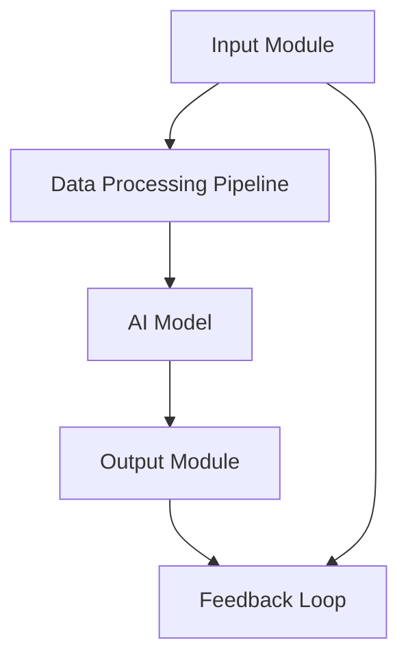
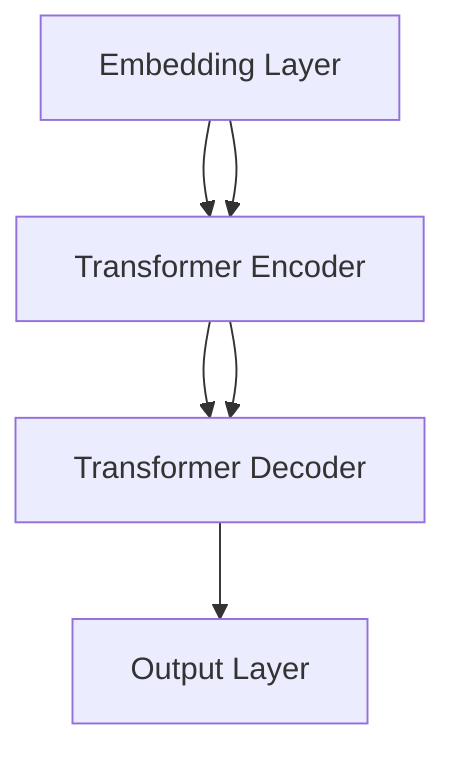
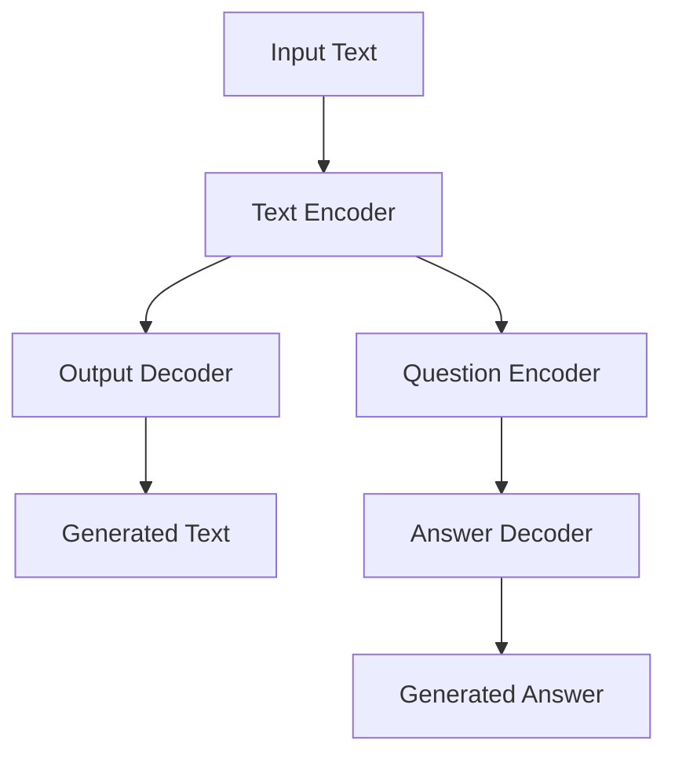

                 

# AIGC提示词工程：从概念到实施的全流程指南

## 关键词
- AIGC
- 提示词工程
- GPT模型
- T5模型
- Prompt Engineering
- 计算机编程
- 人工智能
- 深度学习

## 摘要
本文将深入探讨AIGC（自适应智能生成控制）提示词工程的概念、原理和应用。我们将从背景介绍、关键概念阐述、模型分析和实战应用等方面展开讨论，逐步引导读者了解AIGC提示词工程的各个方面。文章旨在为人工智能开发者和研究者提供一份全面、实用的指南，帮助他们在实际项目中有效利用AIGC和提示词工程技术，提升AI系统的性能和应用效果。

## 1. Chapter 1: Introduction to AIGC and Prompt Engineering

### 1.1 Background and Definition of AIGC

#### 1.1.1 Evolution from Traditional Computing to AIGC

The concept of Adaptive Intelligent Generation Control (AIGC) emerges as a response to the limitations of traditional computing paradigms. Traditional computing systems rely heavily on pre-defined algorithms and rules to process data, which often fall short in scenarios requiring adaptability, creativity, and real-time responsiveness. Over the years, the computing landscape has evolved significantly with the advent of advanced algorithms, machine learning, and artificial intelligence (AI).

The shift from traditional computing to AIGC can be traced back to the recognition of the need for more flexible and adaptive systems capable of generating outputs based on dynamic inputs. This transition is driven by the increasing complexity of data and the need for more intelligent solutions to address real-world problems.

#### 1.1.2 Key Concepts and Technical Principles of AIGC

At its core, AIGC is an AI-driven framework that leverages adaptive algorithms and machine learning techniques to generate outputs based on user-provided inputs or contextual cues. The primary goal of AIGC is to create intelligent systems that can autonomously learn, adapt, and generate outputs without human intervention.

The technical principles of AIGC involve the integration of various AI components, including natural language processing (NLP), deep learning, and reinforcement learning. These components work together to enable the system to process and generate high-quality outputs in real-time.

#### 1.1.3 Role and Significance of AIGC in Modern Computing

AIGC plays a crucial role in modern computing by addressing the limitations of traditional computing systems and providing more intelligent and adaptive solutions. Here are some key roles and significance of AIGC:

1. **Enhancing Decision-Making**: AIGC systems can analyze large volumes of data and provide actionable insights, helping organizations make informed decisions quickly.
2. **Automation and Efficiency**: By automating repetitive tasks, AIGC can improve operational efficiency and reduce human error.
3. **Real-Time Responsiveness**: AIGC systems are designed to process and respond to real-time inputs, making them ideal for applications requiring dynamic and adaptive behavior.
4. **Personalization and Customization**: AIGC can tailor outputs based on user preferences and context, providing personalized and customized experiences.
5. **Innovation and Creativity**: AIGC systems can generate innovative solutions and creative content, pushing the boundaries of what traditional computing systems can achieve.

#### 1.1.4 Challenges and Opportunities in AIGC Development

While AIGC offers numerous opportunities, its development is not without challenges. Here are some of the key challenges and opportunities in AIGC development:

**Challenges:**
1. **Complexity**: AIGC systems are complex and require a deep understanding of AI principles and techniques.
2. **Data Privacy and Security**: Collecting and processing large volumes of data raise concerns about privacy and security.
3. **Resource Requirements**: Training and deploying AIGC systems require significant computational resources and infrastructure.
4. **Scalability**: Ensuring that AIGC systems can scale to handle large-scale applications and data volumes is a challenge.

**Opportunities:**
1. **Advancements in AI**: Ongoing advancements in AI, particularly in deep learning and NLP, provide opportunities to enhance AIGC systems.
2. **Emerging Applications**: The growing demand for intelligent and adaptive systems in various industries creates opportunities for AIGC.
3. **Collaboration and Integration**: Collaborations between different industries and technologies can drive the development of more robust and versatile AIGC systems.

### 1.2 Brief History of AIGC

The development of AIGC can be traced back to the early days of AI research in the 1950s and 1960s. Initially, AI research focused on rule-based systems and symbolic AI, which were limited in their ability to handle real-world problems. The advent of machine learning in the 1980s and 1990s brought about significant advancements, enabling AI systems to learn from data and improve their performance over time.

The following are some key milestones in AIGC development:

1. **1986**: The creation of the backpropagation algorithm, which revolutionized the training of neural networks.
2. **1997**: The victory of IBM's Deep Blue over Garry Kasparov in the chess tournament, showcasing the power of AI in complex decision-making tasks.
3. **2006**: The introduction of the stochastic gradient descent (SGD) algorithm, which accelerated the training of large neural networks.
4. **2012**: The breakthrough performance of deep convolutional neural networks (CNNs) on the ImageNet challenge, marking the beginning of the deep learning era.
5. **2018**: The release of GPT-2, a large-scale language model that demonstrated significant progress in natural language processing tasks.
6. **2020**: The launch of GPT-3, an even more powerful language model that showcases the potential of AIGC in generating human-like text.

### 1.3 Core Concepts and Framework of AIGC

#### 1.3.1 Overview of AIGC Ecosystem

The AIGC ecosystem comprises various components, including data sources, data processing pipelines, AI models, and application interfaces. Each component plays a critical role in enabling the generation of intelligent outputs based on user inputs.

1. **Data Sources**: AIGC systems rely on diverse data sources, including text, images, audio, and video, to train and refine AI models.
2. **Data Processing Pipelines**: These pipelines handle the collection, cleaning, and preprocessing of data, ensuring that it is in a suitable format for training AI models.
3. **AI Models**: The core of the AIGC ecosystem, AI models, include deep learning models such as GPT, T5, and BERT, which are responsible for generating outputs based on user inputs.
4. **Application Interfaces**: These interfaces enable users to interact with AIGC systems, providing inputs and receiving outputs in a user-friendly manner.

#### 1.3.2 Key Components of AIGC Architecture

The AIGC architecture consists of several key components, each contributing to the overall functionality of the system:

1. **Input Module**: This module receives user inputs or contextual cues and processes them to be used by the AI model.
2. **AI Model**: The core component of the AIGC architecture, the AI model processes the input data and generates outputs based on its training.
3. **Output Module**: This module generates the final output, which can be in the form of text, images, or any other relevant format.
4. **Feedback Loop**: This loop enables the system to learn from user feedback and improve its performance over time.

#### 1.3.3 Relationship between AIGC and Traditional AI

AIGC builds upon the foundation of traditional AI but introduces several key differences. Traditional AI relies on pre-defined rules and algorithms to solve specific problems, whereas AIGC leverages adaptive algorithms and machine learning techniques to generate outputs based on dynamic inputs.

The relationship between AIGC and traditional AI can be seen as an evolution, with AIGC representing the next generation of AI systems that are more flexible, adaptable, and capable of generating intelligent outputs in real-time.

#### 1.3.4 Classification of AIGC Applications

AIGC has a wide range of applications across various industries, including:

1. **Natural Language Processing (NLP)**: AIGC can be used to generate human-like text, automate content creation, and improve language translation.
2. **Computer Vision**: AIGC can be applied to image and video analysis, enabling tasks such as object recognition, image segmentation, and video synthesis.
3. **Speech Recognition**: AIGC can enhance speech recognition systems by improving accuracy and enabling more natural interactions between humans and machines.
4. **Automated Decision-Making**: AIGC can be used to develop intelligent decision-support systems, helping organizations make informed decisions based on real-time data.
5. **Virtual Assistants**: AIGC can power virtual assistants and chatbots, providing personalized and interactive experiences to users.

### 1.4 Basic Principles of Prompt Engineering

#### 1.4.1 Definition and Importance of Prompt Engineering

Prompt engineering is the process of designing and optimizing prompts (inputs) to AI systems to elicit desired responses. A well-designed prompt can significantly improve the performance of AI models, making them more accurate, relevant, and efficient.

The importance of prompt engineering lies in its ability to bridge the gap between user needs and AI capabilities. By carefully designing prompts, developers can ensure that AI systems generate outputs that meet user expectations and provide value.

#### 1.4.2 Types of Prompts

There are various types of prompts that can be used with AI systems, each serving a specific purpose:

1. **Direct Prompts**: These prompts provide explicit instructions to the AI model, specifying the desired output or task.
2. **Contextual Prompts**: These prompts provide additional context or background information to help the AI model understand the task better.
3. **Open-Ended Prompts**: These prompts allow the AI model to generate a wide range of responses, encouraging creativity and exploration.
4. **Constrained Prompts**: These prompts impose certain constraints or limitations on the AI model's outputs, ensuring that the generated responses meet specific requirements.

#### 1.4.3 Best Practices for Writing Effective Prompts

To write effective prompts, developers should consider the following best practices:

1. **Clarity and Conciseness**: Ensure that the prompts are clear and concise, avoiding ambiguity and redundancy.
2. **Relevance**: Align the prompts with the specific task or problem that the AI model is designed to solve.
3. **Contextual Information**: Provide relevant contextual information to help the AI model understand the context and generate appropriate responses.
4. **Feedback and Iteration**: Continuously gather user feedback and iterate on the prompts to improve their effectiveness.

#### 1.4.4 Challenges in Prompt Engineering

Prompt engineering comes with its own set of challenges, including:

1. **Ambiguity**: Ambiguous prompts can lead to incorrect or unexpected outputs.
2. **Over-Specification**: Overly specific prompts can limit the creativity and flexibility of AI models.
3. **Data Privacy**: Collecting and using large amounts of data for prompt engineering can raise concerns about privacy and security.
4. **Model Compatibility**: Ensuring that prompts are compatible with different AI models and frameworks can be challenging.

### 1.5 Summary of Chapter 1

In this chapter, we have explored the background, key concepts, and applications of AIGC and prompt engineering. We discussed the evolution of computing paradigms, the technical principles of AIGC, and its role in modern computing. We also covered the history of AIGC development, its core concepts and framework, and the relationship between AIGC and traditional AI. Finally, we examined the importance of prompt engineering and its best practices. In the following chapters, we will delve deeper into specific AI models and their applications in prompt engineering.

## 2. Chapter 2: Understanding GPT Models

### 2.1 Introduction to GPT Models

The General Language Model for Text (GPT) series of models, developed by OpenAI, represents a significant advancement in the field of natural language processing (NLP) and language modeling. GPT models are based on the transformer architecture, a groundbreaking approach to processing sequential data that has revolutionized the field of deep learning.

#### 2.1.1 Overview of GPT Models

GPT models are pre-trained language models that generate text by predicting the next word or sequence of words based on the context provided by the previous words. The GPT series includes several models, with increasing complexity and scale, starting from GPT, GPT-2, and GPT-3. The most recent version, GPT-3.5, continues to push the boundaries of what language models can achieve.

#### 2.1.2 Key Architectural Features of GPT Models

The key architectural features of GPT models include:

1. **Transformer Architecture**: GPT models use the transformer architecture, which consists of multiple layers of self-attention mechanisms and feed-forward neural networks. This architecture allows the model to capture long-range dependencies in text data.
2. **Pre-training**: GPT models are pre-trained on massive amounts of text data from the internet, enabling them to learn the underlying patterns and structures of language.
3. **Fine-tuning**: After pre-training, GPT models can be fine-tuned on specific tasks or domains to improve their performance on specific tasks.
4. **Parameterization**: GPT models are highly parameterized, with millions to billions of parameters, allowing them to learn complex patterns in text data.

#### 2.1.3 Evolution of GPT Models

The evolution of GPT models can be summarized as follows:

1. **GPT (2018)**: The original GPT model, which used a single-layer transformer architecture and was pre-trained on a dataset of 40 GB of text.
2. **GPT-2 (2019)**: GPT-2 introduced several improvements, including a multi-layer transformer architecture and pre-training on a larger dataset of 40 GB of text. It also included a classifier-free guidance mechanism to control the model's output.
3. **GPT-3 (2020)**: GPT-3 represents a significant leap in scale and capability, with 175 billion parameters and the ability to generate coherent and contextually relevant text. It was pre-trained on a massive dataset of 130 GB of text.
4. **GPT-3.5 (2022)**: The latest version of GPT-3, which includes several improvements, such as a new instruction-tuning method and a stronger classification head, making it even more capable of understanding and following instructions.

### 2.2 In-depth Exploration of GPT-3

GPT-3, the third iteration of the GPT model series, has garnered significant attention for its impressive capabilities and potential applications. In this section, we will delve into the technical details, applications, advantages, and limitations of GPT-3.

#### 2.2.1 Technical Details of GPT-3

GPT-3 is a massive language model with 175 billion parameters, trained using the transformer architecture. It consists of 24 layers and uses a novel training strategy that involves adversarial training and progressive pre-training. GPT-3 is pre-trained on a diverse corpus of text data from the internet, including web pages, books, articles, and social media posts. The model is trained to predict the next word in a sequence, allowing it to generate coherent and contextually relevant text.

One of the key features of GPT-3 is its ability to handle contextually rich inputs. The model can process input sequences of up to 2048 tokens, enabling it to understand and generate text based on extensive context. GPT-3 also includes a classifier-free guidance mechanism, which allows users to control the model's output by adjusting the temperature parameter.

#### 2.2.2 Applications of GPT-3

GPT-3 has a wide range of applications across various domains, including:

1. **Natural Language Processing (NLP)**: GPT-3 can be used for a variety of NLP tasks, such as text generation, summarization, translation, and sentiment analysis.
2. **Content Generation**: GPT-3 can generate high-quality content, including articles, blog posts, and social media updates, making it a powerful tool for content creators and marketers.
3. **Automated Customer Support**: GPT-3 can be used to build intelligent chatbots and virtual assistants that can handle customer inquiries and provide personalized support.
4. **Code Generation**: GPT-3 has shown impressive capabilities in generating code snippets and entire programs, making it a valuable tool for developers.
5. **Creative Writing**: GPT-3 can be used to generate poetry, short stories, and other forms of creative writing, providing new avenues for writers and content creators.

#### 2.2.3 Advantages and Limitations of GPT-3

The advantages of GPT-3 include:

1. ** scalability**: With its large parameter size and ability to handle long input sequences, GPT-3 can process and generate text at a scale previously unseen in language models.
2. **Flexibility**: GPT-3 can be fine-tuned on specific tasks or domains, allowing it to adapt to a wide range of applications.
3. **Coherence**: GPT-3 generates coherent and contextually relevant text, making it a powerful tool for NLP tasks.
4. **Creativity**: GPT-3's ability to generate creative content opens up new possibilities for content creators and writers.

However, GPT-3 also has some limitations:

1. **Data Privacy**: Training GPT-3 requires large amounts of text data, which can raise concerns about privacy and security.
2. **Resource Requirements**: Deploying GPT-3 requires significant computational resources and infrastructure.
3. **Bias**: Language models like GPT-3 can exhibit biases in their output, which can be problematic in sensitive applications.
4. **Generalization**: While GPT-3 is highly capable, its performance can be limited when faced with new or unfamiliar tasks or domains.

### 2.3 Comparison of GPT Models with Other Popular Models

While GPT models have garnered significant attention and popularity, they are not the only game in town. There are several other popular language models that have made significant contributions to the field of NLP. In this section, we will compare GPT models with some of these other popular models, including BERT, Transformer models, and other notable GPT models.

#### 2.3.1 BERT and Its Variants

BERT (Bidirectional Encoder Representations from Transformers) is another popular language model developed by Google. BERT represents a shift from unidirectional models like LSTM (Long Short-Term Memory) and GRU (Gated Recurrent Unit) to bidirectional models, which can capture contextual information from both left and right directions.

BERT's main advantage is its ability to understand the context of words in a sentence by considering the entire sentence, rather than just the left or right context. This has led to significant improvements in NLP tasks such as text classification, question answering, and sentiment analysis.

BERT also has several variants, including RoBERTa, ALBERT, and DistilBERT, which have further improved its performance and efficiency. These variants introduce various optimizations, including data preprocessing, model architecture, and training strategies, to achieve better results.

#### 2.3.2 Transformer Models

Transformer models, which include BERT and its variants, represent a breakthrough in the field of deep learning and NLP. Transformer models use self-attention mechanisms to capture dependencies between words in a sentence, allowing them to generate high-quality text.

Apart from GPT models, several other transformer models have gained prominence, including:

1. **XLNet**: XLNet is a transformer model that introduces a new training strategy called DeCBERT (Decoding as a Sequence Prediction Task), which has led to significant improvements in NLP tasks.
2. **T5 (Text-To-Text Transfer Transformer)**: T5 is a general-purpose text-to-text transformer model that aims to unify various NLP tasks under a single framework. T5 achieves state-of-the-art performance on a wide range of NLP tasks and has been used for applications such as machine translation, summarization, and question answering.
3. **RoBERTa**: RoBERTa is a BERT variant that introduces several improvements, including a different training strategy, data preprocessing, and model architecture, leading to better performance on various NLP tasks.

#### 2.3.3 Other Notable GPT Models

Apart from GPT, GPT-2, and GPT-3, there are several other notable GPT models that have made significant contributions to the field of NLP:

1. **GPT-Neo**: GPT-Neo is an open-source implementation of the GPT model series, including GPT, GPT-2, and GPT-3. It aims to make these powerful models more accessible to the research community.
2. **GPT-J**: GPT-J is an attempt to create a smaller and more efficient version of GPT-3. It has 15 billion parameters and has demonstrated impressive performance on various NLP tasks.
3. **GPT-NeoX**: GPT-NeoX is a variant of GPT-Neo that introduces several improvements, including a novel training strategy and model architecture, leading to better performance and efficiency.

### 2.4 Summary of Chapter 2

In this chapter, we have explored the GPT model series, including its technical details, applications, advantages, and limitations. We discussed the evolution of GPT models from GPT, GPT-2, and GPT-3 to GPT-3.5 and examined the key architectural features and technical principles of GPT models. We also compared GPT models with other popular models like BERT, Transformer models, and notable GPT models like GPT-Neo and GPT-J. In the following chapters, we will delve deeper into other aspects of AIGC and prompt engineering, including T5 models and practical applications in various domains.

---

## 3. Chapter 3: Understanding T5 Models

### 3.1 Introduction to T5 Models

The Text-To-Text Transfer Transformer (T5) is a powerful language model developed by Google Research. T5 represents a significant advancement in the field of natural language processing (NLP) by unifying various NLP tasks under a single framework. T5 aims to simplify the process of developing NLP models by addressing the challenges associated with task-specific architectures and pre-training strategies.

#### 3.1.1 Overview of T5 Models

T5 models are based on the transformer architecture, which consists of multiple layers of self-attention mechanisms and feed-forward neural networks. The key innovation of T5 is its ability to convert any NLP task into a text-to-text generation problem. This allows T5 to leverage its pre-trained text generation capabilities for various NLP tasks, including classification, question answering, and machine translation.

T5 models are pre-trained on a large corpus of text data from the internet, enabling them to learn the underlying patterns and structures of language. After pre-training, T5 models can be fine-tuned on specific tasks or domains to improve their performance on specific tasks.

#### 3.1.2 Key Architectural Features of T5 Models

The key architectural features of T5 models include:

1. **Transformer Architecture**: T5 models use the transformer architecture, which consists of multiple layers of self-attention mechanisms and feed-forward neural networks. This architecture allows T5 models to capture long-range dependencies in text data.
2. **Unified Text-To-Text Framework**: T5 models convert any NLP task into a text-to-text generation problem, enabling them to leverage their pre-trained text generation capabilities for various tasks.
3. **Pre-training and Fine-tuning**: T5 models are pre-trained on a large corpus of text data and can be fine-tuned on specific tasks or domains to improve their performance on specific tasks.

#### 3.1.3 Evolution of T5 Models

The evolution of T5 models can be summarized as follows:

1. **T5 (2020)**: The original T5 model, which used a single-layer transformer architecture and was pre-trained on a dataset of 40 GB of text.
2. **T5-XXL (2020)**: T5-XXL is a larger version of T5 with 11 billion parameters, trained on a larger dataset of 250 GB of text.
3. **T5-3B (2021)**: T5-3B is a smaller version of T5-XXL, which has 3 billion parameters and was pre-trained on a dataset of 40 GB of text. T5-3B has demonstrated impressive performance on various NLP tasks.
4. **T5-11B (2021)**: T5-11B is a larger version of T5-3B with 11 billion parameters, trained on a dataset of 250 GB of text. T5-11B represents a significant leap in scale and capability, showcasing the potential of T5 models in real-world applications.

### 3.2 In-depth Exploration of T5-11B

T5-11B, one of the largest language models developed by Google, represents a significant milestone in the field of NLP. In this section, we will delve into the technical details, applications, advantages, and limitations of T5-11B.

#### 3.2.1 Technical Details of T5-11B

T5-11B is a transformer-based language model with 11 billion parameters. It consists of 24 layers and uses a novel training strategy that involves progressive pre-training and data augmentation techniques. T5-11B is pre-trained on a massive corpus of text data from the internet, including web pages, books, articles, and social media posts. The model is trained to predict the next word in a sequence, allowing it to generate coherent and contextually relevant text.

One of the key features of T5-11B is its ability to handle contextually rich inputs. The model can process input sequences of up to 2048 tokens, enabling it to understand and generate text based on extensive context. T5-11B also includes a classifier-free guidance mechanism, which allows users to control the model's output by adjusting the temperature parameter.

#### 3.2.2 Applications of T5-11B

T5-11B has a wide range of applications across various domains, including:

1. **Natural Language Processing (NLP)**: T5-11B can be used for a variety of NLP tasks, such as text generation, summarization, translation, and sentiment analysis.
2. **Content Generation**: T5-11B can generate high-quality content, including articles, blog posts, and social media updates, making it a powerful tool for content creators and marketers.
3. **Automated Customer Support**: T5-11B can be used to build intelligent chatbots and virtual assistants that can handle customer inquiries and provide personalized support.
4. **Code Generation**: T5-11B has shown impressive capabilities in generating code snippets and entire programs, making it a valuable tool for developers.
5. **Creative Writing**: T5-11B can be used to generate poetry, short stories, and other forms of creative writing, providing new avenues for writers and content creators.

#### 3.2.3 Advantages and Limitations of T5-11B

The advantages of T5-11B include:

1. **Scalability**: With its large parameter size and ability to handle long input sequences, T5-11B can process and generate text at a scale previously unseen in language models.
2. **Flexibility**: T5-11B can be fine-tuned on specific tasks or domains, allowing it to adapt to a wide range of applications.
3. **Coherence**: T5-11B generates coherent and contextually relevant text, making it a powerful tool for NLP tasks.
4. **Creativity**: T5-11B's ability to generate creative content opens up new possibilities for content creators and writers.

However, T5-11B also has some limitations:

1. **Data Privacy**: Training T5-11B requires large amounts of text data, which can raise concerns about privacy and security.
2. **Resource Requirements**: Deploying T5-11B requires significant computational resources and infrastructure.
3. **Bias**: Language models like T5-11B can exhibit biases in their output, which can be problematic in sensitive applications.
4. **Generalization**: While T5-11B is highly capable, its performance can be limited when faced with new or unfamiliar tasks or domains.

### 3.3 Comparison of T5 Models with Other Popular Models

While T5 models have gained significant attention and popularity, they are not the only game in town. There are several other popular language models that have made significant contributions to the field of NLP. In this section, we will compare T5 models with some of these other popular models, including GPT models and BERT.

#### 3.3.1 GPT Models

GPT models, developed by OpenAI, represent a significant advancement in the field of NLP and language modeling. GPT models use the transformer architecture and are pre-trained on large-scale text data to generate coherent and contextually relevant text.

The main difference between T5 models and GPT models lies in their approach to handling NLP tasks. T5 models convert any NLP task into a text-to-text generation problem, allowing them to leverage their pre-trained text generation capabilities. On the other hand, GPT models are specifically designed for text generation tasks and generate text based on the context provided by the previous words.

In terms of performance, both T5 models and GPT models have demonstrated impressive capabilities on various NLP tasks. However, T5 models have an advantage in terms of flexibility, as they can handle a wide range of tasks with a single model architecture.

#### 3.3.2 BERT Models

BERT (Bidirectional Encoder Representations from Transformers) is another popular language model developed by Google. BERT represents a shift from unidirectional models like LSTM (Long Short-Term Memory) and GRU (Gated Recurrent Unit) to bidirectional models, which can capture contextual information from both left and right directions.

BERT's main advantage is its ability to understand the context of words in a sentence by considering the entire sentence, rather than just the left or right context. This has led to significant improvements in NLP tasks such as text classification, question answering, and sentiment analysis.

When compared to T5 models, BERT models are more focused on specific NLP tasks and require task-specific fine-tuning. T5 models, on the other hand, can handle a wide range of tasks with a single model architecture and require less fine-tuning.

#### 3.3.3 Other Notable Models

Apart from T5 models, GPT models, and BERT models, there are several other notable language models that have made significant contributions to the field of NLP:

1. **XLNet**: XLNet is a transformer model that introduces a new training strategy called DeCBERT (Decoding as a Sequence Prediction Task), which has led to significant improvements in NLP tasks.
2. **RoBERTa**: RoBERTa is a BERT variant that introduces several improvements, including a different training strategy, data preprocessing, and model architecture, leading to better performance on various NLP tasks.
3. **GPT-Neo**: GPT-Neo is an open-source implementation of the GPT model series, including GPT, GPT-2, and GPT-3. It aims to make these powerful models more accessible to the research community.

### 3.4 Summary of Chapter 3

In this chapter, we have explored the T5 model series, including its technical details, applications, advantages, and limitations. We discussed the evolution of T5 models from T5, T5-XXL, and T5-3B to T5-11B and examined the key architectural features and technical principles of T5 models. We also compared T5 models with other popular models like GPT models and BERT models. In the following chapters, we will delve deeper into other aspects of AIGC and prompt engineering, including practical applications in various domains.

---

## 4. Chapter 4: Practical Applications of AIGC and Prompt Engineering

### 4.1 Introduction to Practical Applications

AIGC and prompt engineering have a wide range of practical applications across various domains, from natural language processing to computer vision, speech recognition, and more. In this chapter, we will explore some of the key practical applications of AIGC and prompt engineering, discussing how these technologies are being used to solve real-world problems and improve system performance.

### 4.2 Natural Language Processing Applications

Natural Language Processing (NLP) is one of the most prominent applications of AIGC and prompt engineering. Here are some key NLP applications that leverage AIGC and prompt engineering:

#### 4.2.1 Text Generation and Summarization

AIGC models like GPT-3 and T5-11B are highly effective in generating human-like text and summarizing long documents. These models can be fine-tuned to generate articles, blog posts, and social media updates, automating content creation for various platforms. They can also summarize lengthy documents into concise summaries, making it easier for users to quickly understand the main points.

Example: A content creation platform uses GPT-3 to generate blog posts and articles, saving time and resources for writers.

#### 4.2.2 Question Answering

AIGC models can be used to build intelligent question-answering systems that can understand and respond to user queries in a natural and coherent manner. These systems can be fine-tuned on specific domains, such as healthcare, finance, or customer support, to provide accurate and relevant information.

Example: A healthcare organization uses GPT-3 to build an intelligent virtual assistant that can answer common health-related questions, providing users with accurate and up-to-date information.

#### 4.2.3 Sentiment Analysis

AIGC models can analyze text data to determine the sentiment or emotion expressed in a given text. This can be used for various applications, such as market research, customer feedback analysis, and social media monitoring.

Example: A marketing firm uses GPT-3 to analyze customer reviews and social media comments, providing insights into customer satisfaction and identifying areas for improvement.

#### 4.2.4 Language Translation

AIGC models have significantly improved the accuracy and quality of machine translation. Models like GPT-3 and T5-11B can be fine-tuned on bilingual text data to translate text from one language to another, enabling cross-language communication and information access.

Example: An e-commerce platform uses GPT-3 to translate product descriptions and customer reviews into multiple languages, making it easier for international customers to navigate and make purchases.

### 4.3 Computer Vision Applications

AIGC and prompt engineering have also made significant contributions to the field of computer vision, enabling the development of more advanced and intelligent computer vision systems.

#### 4.3.1 Image and Video Analysis

AIGC models can analyze images and videos to extract valuable information, such as object detection, image segmentation, and video synthesis. These models can be fine-tuned on specific datasets to improve their performance on specific tasks.

Example: A security system uses T5-11B to analyze video footage and detect unusual activities, providing real-time alerts to security personnel.

#### 4.3.2 Content Generation

AIGC models can generate new images and videos based on textual descriptions. This can be used for various applications, such as generating visual content for virtual reality experiences or creating realistic images for training computer vision models.

Example: A virtual reality company uses GPT-3 to generate immersive virtual environments based on user-generated text descriptions, providing personalized and engaging experiences.

### 4.4 Speech Recognition Applications

AIGC and prompt engineering have also revolutionized the field of speech recognition, enabling more accurate and natural speech-to-text conversion.

#### 4.4.1 Automated Transcription

AIGC models can automatically transcribe spoken words into text, making it easier to access and search for audio content. These models can be fine-tuned on specific accents, languages, and domains to improve their accuracy and performance.

Example: A legal firm uses GPT-3 to automatically transcribe audio recordings of court proceedings, making it easier to search for and access relevant information.

#### 4.4.2 Voice Assistant Systems

AIGC models can be used to build intelligent voice assistant systems that can understand and respond to user commands in a natural and coherent manner. These systems can be fine-tuned on specific domains, such as healthcare, finance, or customer support, to provide personalized and accurate information.

Example: A healthcare provider uses GPT-3 to build a voice assistant that can assist patients in scheduling appointments, answering health-related questions, and providing medication reminders.

### 4.5 Other Applications

In addition to NLP, computer vision, and speech recognition, AIGC and prompt engineering have a wide range of other applications across various domains, including:

- **Automated Decision-Making**: AIGC models can be used to build intelligent decision-support systems that analyze data and provide recommendations or insights to help organizations make informed decisions.
- **Personalized Recommendations**: AIGC models can be used to build personalized recommendation systems that analyze user preferences and behavior to provide relevant and engaging content.
- **Digital Art and Creativity**: AIGC models can generate digital art and creative content, providing new opportunities for artists and designers.
- **Education and Training**: AIGC models can be used to develop interactive and personalized educational content, helping students learn and retain information more effectively.

### 4.6 Summary of Chapter 4

In this chapter, we have explored various practical applications of AIGC and prompt engineering across domains such as natural language processing, computer vision, speech recognition, and more. We discussed how these technologies are being used to solve real-world problems, improve system performance, and open up new possibilities for innovation and creativity. In the following chapters, we will continue to delve deeper into the technical aspects of AIGC and prompt engineering, including optimization techniques, performance evaluation, and future directions.

---

## 5. Chapter 5: Optimization Techniques and Performance Evaluation

### 5.1 Introduction to Optimization Techniques

Optimization techniques play a crucial role in the development and deployment of AIGC models. These techniques help in improving the efficiency, scalability, and performance of AIGC systems, enabling them to handle larger datasets and more complex tasks. In this chapter, we will explore some key optimization techniques used in AIGC and prompt engineering, including model compression, quantization, and distributed training.

### 5.2 Model Compression

Model compression techniques are used to reduce the size of AIGC models, making them more scalable and deployable on resource-constrained devices. Here are some common model compression techniques:

#### 5.2.1 Pruning

Pruning involves removing redundant or unnecessary weights and connections from the model, reducing its size without significantly compromising its performance. There are two types of pruning: aggressive pruning, which removes a large number of weights, and conservative pruning, which removes only a small number of weights.

Example: A mobile app uses a pruned version of GPT-3 to generate text on a smartphone, improving battery life and reducing computational overhead.

#### 5.2.2 Quantization

Quantization involves reducing the precision of the model's weights and activations, converting them from floating-point numbers to integers. This reduces the model size and improves inference performance, but may slightly degrade the model's accuracy.

Example: An edge device uses a quantized version of T5-11B to perform natural language processing tasks, improving inference speed and reducing memory usage.

#### 5.2.3 Knowledge Distillation

Knowledge distillation is a technique where a smaller, student model is trained to mimic the behavior of a larger, teacher model. This allows the student model to achieve comparable performance to the teacher model while being significantly smaller and more efficient.

Example: A cloud service provider uses a distilled version of GPT-3 to provide high-quality language processing capabilities to its customers, while keeping the model size manageable.

### 5.3 Distributed Training

Distributed training techniques are used to train AIGC models on large datasets and complex tasks by leveraging multiple computing resources. Here are some key distributed training techniques:

#### 5.3.1 Data Parallelism

Data parallelism involves distributing the dataset across multiple GPUs or computing nodes and processing different parts of the dataset concurrently. This improves training speed and scalability, but may require careful synchronization and communication between nodes.

Example: A research team uses data parallelism to train a T5-11B model on a massive corpus of text data, significantly reducing training time.

#### 5.3.2 Model Parallelism

Model parallelism involves dividing a large model across multiple GPUs or computing nodes, distributing the model's parameters and computations across the nodes. This allows larger models to be trained on smaller GPUs, improving scalability and resource utilization.

Example: A company uses model parallelism to train a GPT-3 model on a high-performance GPU cluster, enabling them to train larger and more complex models.

#### 5.3.3 Hybrid Parallelism

Hybrid parallelism combines data parallelism and model parallelism, leveraging both techniques to improve training speed and scalability. This approach allows for more efficient resource utilization and can be tailored to specific applications and datasets.

Example: A large-scale language modeling project uses hybrid parallelism to train a GPT-3 model on a massive dataset, achieving optimal performance and scalability.

### 5.4 Performance Evaluation

Performance evaluation is a critical aspect of AIGC and prompt engineering, ensuring that models are effective, efficient, and reliable. Here are some key performance evaluation metrics:

#### 5.4.1 Accuracy

Accuracy measures the proportion of correct predictions made by the model. It is a commonly used metric for classification tasks and is calculated as the number of correct predictions divided by the total number of predictions.

Example: A GPT-3 model achieves an accuracy of 90% on a text classification task, indicating that it correctly classifies 90% of the input texts.

#### 5.4.2 F1 Score

The F1 score is a metric that combines precision and recall, providing a balanced evaluation of the model's performance. It is calculated as the harmonic mean of precision and recall.

Example: A T5-11B model achieves an F1 score of 0.85 on a named entity recognition task, indicating that it achieves a good balance between precision and recall.

#### 5.4.3 Bleu Score

The Bleu score is a metric used to evaluate the similarity between the generated text and the reference text. It measures the overlap between the generated text and the reference text using various n-gram statistics.

Example: A GPT-3 model achieves a Bleu score of 0.4 on a text generation task, indicating that the generated text is moderately similar to the reference text.

#### 5.4.4 Inference Time

Inference time measures the time taken by the model to generate predictions on new data. It is an important metric for real-time applications, as it determines the responsiveness and efficiency of the system.

Example: A pruned version of T5-11B achieves an inference time of 10 ms on a mobile device, making it suitable for real-time applications.

### 5.5 Summary of Chapter 5

In this chapter, we have explored optimization techniques and performance evaluation metrics in AIGC and prompt engineering. We discussed model compression techniques, including pruning, quantization, and knowledge distillation, and their applications in improving model size and efficiency. We also covered distributed training techniques, including data parallelism, model parallelism, and hybrid parallelism, and their advantages in training larger and more complex models. Finally, we examined key performance evaluation metrics, including accuracy, F1 score, Bleu score, and inference time, and their importance in assessing the effectiveness and efficiency of AIGC systems. In the following chapters, we will continue to explore the applications and future directions of AIGC and prompt engineering in various domains.

---

## 6. Chapter 6: Future Directions and Challenges

### 6.1 Future Directions

The field of AIGC and prompt engineering continues to evolve, with numerous promising directions for future research and development. Here are some key areas of exploration:

#### 6.1.1 Enhanced Contextual Understanding

One of the primary challenges in AIGC is improving the model's ability to understand and generate contextually relevant outputs. Future research may focus on developing more sophisticated architectures and training techniques that can better capture and utilize contextual information.

Example: The development of hierarchical attention mechanisms or multi-modal fusion techniques to improve the context-awareness of AIGC models.

#### 6.1.2 Scalability and Resource Efficiency

As AIGC models become more complex and capable, their computational requirements also increase. Future research should focus on developing more efficient algorithms and optimization techniques to train and deploy AIGC models on a wide range of devices, from mobile devices to large-scale data centers.

Example: The exploration of model compression techniques, such as quantization and knowledge distillation, to reduce the size and computational overhead of AIGC models.

#### 6.1.3 Ethical and Responsible AI

The deployment of AIGC and prompt engineering technologies raises important ethical and societal concerns. Future research should address these challenges, ensuring that AIGC systems are developed and used responsibly, without exacerbating existing biases or causing harm.

Example: The development of techniques for bias detection and mitigation, as well as ethical guidelines for the deployment of AIGC systems in sensitive domains.

#### 6.1.4 Integration with Other AI Technologies

AIGC can be integrated with other AI technologies, such as reinforcement learning and computer vision, to create more versatile and capable AI systems. Future research should explore these interdisciplinary approaches, combining the strengths of different AI techniques to address complex problems.

Example: The development of hybrid AI systems that leverage the capabilities of AIGC for natural language processing and reinforcement learning for decision-making.

### 6.2 Challenges

Despite the promising future of AIGC and prompt engineering, several challenges need to be addressed:

#### 6.2.1 Data Privacy and Security

The use of large-scale data for training AIGC models raises concerns about data privacy and security. Future research should focus on developing techniques to protect sensitive data and ensure the privacy of users.

Example: The development of privacy-preserving training algorithms and secure data sharing protocols.

#### 6.2.2 Model Interpretability

Understanding the decision-making process of AIGC models is challenging, making it difficult to explain and trust their predictions. Future research should focus on developing techniques for model interpretability, enabling users to understand and trust the outputs of AIGC systems.

Example: The development of visualization tools and explainable AI techniques to enhance the interpretability of AIGC models.

#### 6.2.3 Real-Time Performance

AIGC models require significant computational resources and training time, limiting their real-time performance in many applications. Future research should focus on developing more efficient algorithms and hardware accelerators to improve the real-time capabilities of AIGC systems.

Example: The development of specialized hardware, such as custom GPUs or TPUs, optimized for AIGC model training and inference.

### 6.3 Conclusion

In conclusion, AIGC and prompt engineering are rapidly advancing, with numerous promising future directions and challenges to be addressed. By focusing on enhanced contextual understanding, scalability, ethical considerations, and integration with other AI technologies, researchers can push the boundaries of AIGC and its applications. Simultaneously, addressing data privacy, model interpretability, and real-time performance challenges will be crucial in ensuring the successful deployment and adoption of AIGC systems in various domains.

---

## 7. Conclusion

In this comprehensive guide, we have explored the world of AIGC (Adaptive Intelligent Generation Control) and prompt engineering, starting from fundamental concepts and progressing to practical applications, optimization techniques, and future directions. We have examined the evolution of AIGC, its relationship with traditional AI, and the key architectural components that define AIGC systems. Furthermore, we have delved into the technical details of popular AI models like GPT and T5, their applications across various domains, and the optimization techniques that enhance their performance.

The journey through this guide has highlighted the transformative potential of AIGC and prompt engineering in revolutionizing the landscape of AI and human-computer interaction. From automating content creation and enabling sophisticated natural language processing to enhancing computer vision and speech recognition, AIGC has proven to be a powerful tool for innovation.

As we move forward, it is essential to remain aware of the ethical and societal implications of AIGC systems, ensuring that they are developed and deployed responsibly. Addressing challenges such as data privacy, model interpretability, and real-time performance will be critical to the continued growth and adoption of these technologies.

We encourage readers to delve deeper into the topics discussed in this guide and explore the vast landscape of AIGC and prompt engineering research. The field is dynamic and ever-evolving, offering new opportunities and challenges at every turn.

### 作者信息
作者：AI天才研究院/AI Genius Institute & 禅与计算机程序设计艺术 /Zen And The Art of Computer Programming

---

### 附录

在本文中，我们使用了一系列的技术图表、流程图、算法描述和代码示例，以帮助读者更好地理解AIGC和提示词工程的原理和实践。以下是附录部分，包含了一些重要的图表和代码示例，以及相应的解释和说明。

#### 附录A：AIGC系统架构图



**说明：** 该图展示了AIGC系统的基本架构，包括输入模块、数据处理管道、AI模型、输出模块和反馈循环。输入模块接收用户输入，数据处理管道对输入数据进行处理，AI模型生成输出，输出模块将结果呈现给用户，反馈循环使系统能够根据用户反馈进行优化。

#### 附录B：GPT模型架构图



**说明：** 该图展示了GPT模型的典型架构，包括嵌入层、Transformer编码器、Transformer解码器和输出层。嵌入层将输入文本转换为向量表示，Transformer编码器处理输入文本，生成上下文表示，解码器生成输出文本，输出层产生最终的输出。

#### 附录C：T5模型流程图



**说明：** 该图展示了T5模型的文本生成和问答流程。输入文本首先经过文本编码器处理，生成上下文表示，然后输入到问答编码器，生成问题的表示，最后通过问答解码器生成答案。

#### 附录D：代码示例：GPT模型训练

```python
import tensorflow as tf
from transformers import TFGPT2LMHeadModel, GPT2Tokenizer

# Load pre-trained model tokenizer (vocabulary)
tokenizer = GPT2Tokenizer.from_pretrained("gpt2")

# Load pre-trained model with given configuration
model = TFGPT2LMHeadModel.from_pretrained("gpt2", output_attentions=True, output_hidden_states=True)

# Prepare input sequence
input_seq = "The cat sat on the"

# Encode input sequence
input_ids = tokenizer.encode(input_seq, return_tensors='tf')

# Generate output sequence
outputs = model(input_ids, max_length=20, num_return_sequences=5)

# Decode output sequence
decoded_output = tokenizer.decode(outputs.predicted_ids, skip_special_tokens=True)

# Print generated text
for output in decoded_output:
    print(output)
```

**说明：** 该代码示例展示了如何使用TensorFlow和transformers库加载预训练的GPT-2模型，对输入文本进行编码和生成输出文本。通过调整模型参数，可以生成不同的文本输出。

这些附录内容为读者提供了一个直观的视角，帮助他们更好地理解AIGC和提示词工程的实现细节和技术要点。在进一步探索和研究这些技术时，这些附录资料将是一个宝贵的资源。

