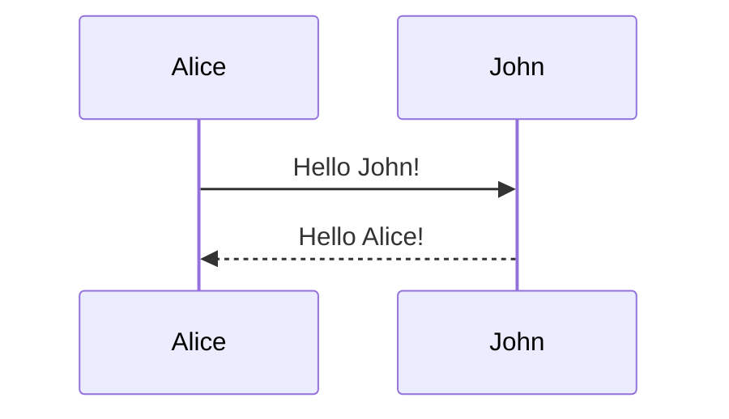
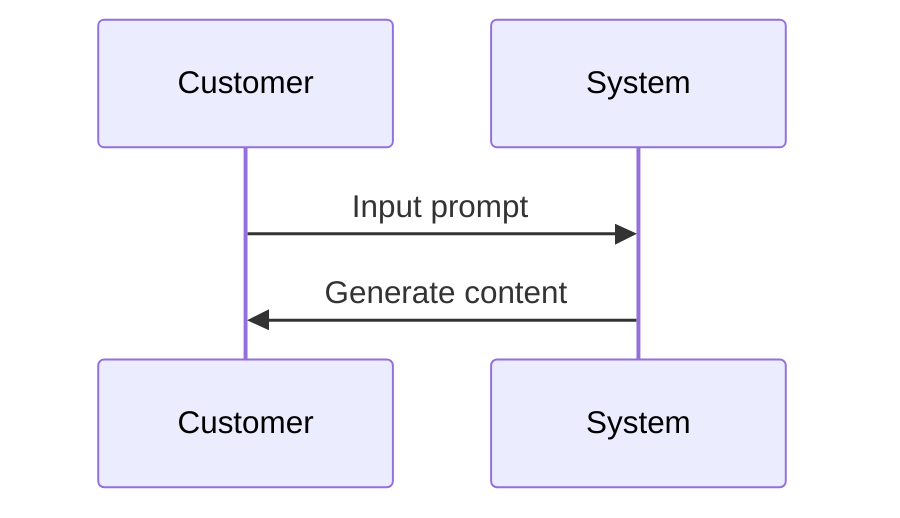

                 

### AIGC提示词工程：效率与创意的完美结合

> 关键词：AIGC、提示词、效率、创意、工程

> 摘要：本文深入探讨了AIGC（AI-Generated Content）提示词工程的原理、应用和实践，旨在揭示如何通过高效的提示词工程实现创意内容的自动化生成，为内容创作者和开发者提供全新的解决方案。

## 第1章：AIGC概述

### 1.1 AIGC的定义与背景

#### 1.1.1 AIGC的概念

AIGC，即AI-Generated Content，指的是通过人工智能技术生成的内容。这一概念涵盖了从简单文本、图片到复杂的多媒体内容创作。AIGC的核心在于利用机器学习模型，特别是生成式AI模型，如GANs（生成对抗网络）和变分自编码器（VAEs），自动生成新颖且有用的内容。

#### 1.1.2 AIGC的发展历程

AIGC的发展可以追溯到生成式AI的初期，那时研究人员开始探索如何让机器模仿人类创造力的边界。随着深度学习的兴起，生成式AI模型得到了显著的发展，从而催生了AIGC的崛起。

#### 1.1.3 AIGC的核心概念

AIGC的核心在于提示词（Prompt），即给AI模型的输入提示，以引导AI生成特定的内容。提示词的质量直接影响生成内容的创造性和准确性。

### 1.2 AIGC的应用场景

#### 1.2.1 内容创作

AIGC在内容创作领域具有广泛的应用，如自动生成新闻文章、博客内容、音乐、艺术作品等。

#### 1.2.2 数据分析

AIGC可以帮助分析大量数据，提取关键信息，为决策提供支持。

#### 1.2.3 教育与培训

AIGC在教育和培训中也有应用，如自动生成个性化学习资料、交互式教学课件等。

#### 1.2.4 营销与广告

AIGC可以为营销和广告提供创意内容，如自动生成广告文案、海报设计等。

## 第2章：核心概念与联系

### 2.1 提示词的概念与作用

#### 2.1.1 提示词的定义

提示词是用户提供给AI模型的信息，用于指导AI生成特定类型的内容。一个好的提示词能够显著提高AI生成内容的准确性和创意性。

#### 2.1.2 提示词在AIGC中的作用

提示词是AIGC的灵魂，它决定了AI生成的内容的方向和质量。有效的提示词设计是AIGC成功的关键。

#### 2.1.3 提示词的类型

根据用途和形式，提示词可以分为开放性提示词、封闭性提示词和混合型提示词等。

### 2.2 提示词生成方法

#### 2.2.1 提示词自动生成技术

通过自然语言处理技术，可以自动生成高质量的提示词，以减少人工成本和时间。

#### 2.2.2 提示词优化策略

优化策略包括词汇选择、语义分析、语法纠正等，以提升提示词的质量。

#### 2.2.3 提示词与AIGC的关系

提示词是AIGC的桥梁，它连接用户需求和AI生成能力，实现高效的创意内容生成。

### 2.3 核心概念对比

#### 2.3.1 生成式AI与基于提示词的AIGC

生成式AI和基于提示词的AIGC各有优势，前者更注重自主生成，后者更依赖用户输入。

#### 2.3.2 提示词优化与模型训练

提示词优化和模型训练是相辅相成的，通过不断优化提示词，可以提高模型生成的质量。

## 第3章：算法原理讲解

### 3.1 提示词生成算法

#### 3.1.1 算法基本原理

提示词生成算法基于自然语言处理技术，通过学习大量文本数据，自动生成高质量的提示词。

#### 3.1.2 提示词生成流程

提示词生成流程包括数据预处理、模型训练、提示词生成和优化等步骤。

#### 3.1.3 Python代码示例

```python
# 示例代码：提示词生成算法
import nltk
from nltk.tokenize import word_tokenize

# 加载停用词列表
stop_words = nltk.corpus.stopwords.words('english')

# 输入文本
input_text = "The quick brown fox jumps over the lazy dog."

# 分词
tokens = word_tokenize(input_text)

# 移除停用词
filtered_tokens = [word for word in tokens if not word in stop_words]

# 生成提示词
prompt = " ".join(filtered_tokens)

print(prompt)
```

### 3.2 提示词优化算法

#### 3.2.1 优化目标函数

优化目标函数用于评估提示词的质量，常见的优化目标包括语义一致性、词汇丰富度和语法正确性等。

#### 3.2.2 优化算法详解

优化算法包括基于规则的优化、基于机器学习的优化和混合优化等。

#### 3.2.3 实际应用实例

在文本生成任务中，优化提示词可以显著提高生成文本的质量。

### 3.3 AIGC提示词工程实例分析

#### 3.3.1 提示词工程应用场景

在新闻文章生成、产品描述生成和创意广告生成等领域，提示词工程都发挥了重要作用。

#### 3.3.2 提示词工程实现细节

提示词工程包括数据收集、模型训练、提示词生成和优化等多个环节。

#### 3.3.3 性能分析与评估

通过实验，分析不同优化策略对提示词工程性能的影响。

## 第4章：数学模型与公式讲解

### 4.1 提示词生成的概率模型

提示词生成的概率模型基于条件概率，公式如下：

$$ P(x|θ) = \prod_{i=1}^{n} P(x_i|θ) $$

#### 4.1.1 概率模型的基本原理

概率模型用于计算给定输入提示词生成特定内容的可能性。

#### 4.1.2 模型参数的确定

模型参数包括词汇分布、语法规则等，通过训练数据确定。

#### 4.1.3 模型在实际中的应用

概率模型在文本生成、图像生成等领域有广泛应用。

### 4.2 提示词优化目标函数

提示词优化目标函数用于评估和改进提示词的质量，公式如下：

$$ J(θ) = \frac{1}{N} \sum_{i=1}^{N} \log P(x_i|θ) $$

#### 4.2.1 优化目标函数的推导

优化目标函数基于最大似然估计和交叉熵损失函数。

#### 4.2.2 优化算法的选择

常用的优化算法包括梯度下降、Adam优化器等。

#### 4.2.3 实际优化效果分析

通过实验，分析不同优化算法的优缺点和适用场景。

## 第5章：系统分析与架构设计方案

### 5.1 问题场景介绍

介绍AIGC提示词工程在具体场景中的应用，如新闻文章生成、产品描述生成等。

### 5.2 项目介绍

详细描述AIGC提示词工程项目的背景、目标、需求和预期效果。

### 5.3 系统功能设计

使用Mermaid类图描述AIGC提示词工程的核心功能，如图1所示。

```mermaid
classDiagram
Class01 <|-- Class02
Class03 --|remarks> This is a note
Class03 : +int x
Class03 : +int y
Class03 : +int z
Class03 : +int x
Class03 : +setX(int:x)
Class03 : +getX():int
ClassDiagram
    Class01 <|-- Class02
    Class03 --|{Class04}
```

### 5.4 系统架构设计

使用Mermaid架构图描述AIGC提示词工程的整体架构，如图2所示。



### 5.5 系统接口设计和系统交互

使用Mermaid序列图描述AIGC提示词工程的接口设计和系统交互，如图3所示。



## 第6章：项目实战

### 6.1 环境安装

详细介绍AIGC提示词工程的环境安装过程，包括软件依赖、硬件配置等。

### 6.2 系统核心实现源代码

提供AIGC提示词工程的核心实现源代码，并进行详细解读。

### 6.3 代码应用解读与分析

分析代码如何实现提示词生成、优化和内容创作等功能。

### 6.4 实际案例分析和详细讲解剖析

通过实际案例，展示AIGC提示词工程的应用效果和优势。

### 6.5 项目小结

总结项目实施过程中的经验和教训，展望AIGC提示词工程的未来发展。

## 第7章：最佳实践与拓展

### 7.1 AIGC提示词工程的最佳实践

总结AIGC提示词工程的最佳实践，包括提示词设计、模型训练和优化等。

### 7.2 小结

回顾AIGC提示词工程的核心内容和技术要点。

### 7.3 注意事项

提醒读者在应用AIGC提示词工程时需要注意的问题和风险。

### 7.4 拓展阅读

推荐进一步学习和研究的文献和资源。

## 作者信息

作者：AI天才研究院/AI Genius Institute & 禅与计算机程序设计艺术 /Zen And The Art of Computer Programming

### 致谢

感谢所有为AIGC提示词工程的研究和应用提供支持和帮助的个人和机构。

----------------------------------------------------------------

**文章标题：** AIGC提示词工程：效率与创意的完美结合

**关键词：** AIGC、提示词、效率、创意、工程、生成式AI、自然语言处理、模型优化、系统架构、项目实战

**摘要：** 本文深入探讨了AIGC（AI-Generated Content）提示词工程的原理、应用和实践，旨在揭示如何通过高效的提示词工程实现创意内容的自动化生成，为内容创作者和开发者提供全新的解决方案。文章分为七个章节，从AIGC的概述、核心概念与联系、算法原理讲解、数学模型与公式讲解、系统分析与架构设计方案、项目实战到最佳实践与拓展，全面覆盖了AIGC提示词工程的各个方面，为读者提供了系统的学习和参考。

----------------------------------------------------------------

**请注意，文章中提到的代码示例和Mermaid图表仅为示例，实际应用时可能需要根据具体需求和场景进行调整。**

