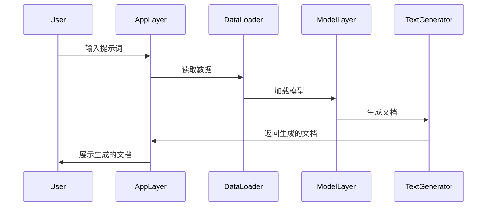

                 

# AIGC提示词设计：原则、方法与最佳实践探讨

> 关键词：AIGC，提示词设计，原则，方法，最佳实践

> 摘要：本文旨在探讨AIGC（自适应智能生成控制）提示词设计的原则、方法与最佳实践。首先，介绍AIGC与提示词的基本概念，阐述其在人工智能领域的重要性。接着，详细分析提示词设计的核心原则，包括一致性、完整性、可扩展性、适应性和安全性。然后，讨论不同的提示词设计方法，如数据驱动、人类驱动和混合驱动方法。此外，总结一系列最佳实践，并提供实际案例进行解析。最后，对AIGC提示词设计的未来趋势进行展望。

## 引言

随着人工智能技术的飞速发展，AIGC（自适应智能生成控制）作为一种新兴的技术，引起了广泛关注。AIGC的核心在于利用人工智能模型自动生成高质量的内容，从而实现智能化创作和生产。在这个过程中，提示词设计起到了至关重要的作用。提示词是用户与AIGC模型进行交互的桥梁，它能够引导模型生成符合预期的高质量内容。

本文将围绕AIGC提示词设计展开讨论。首先，我们将介绍AIGC与提示词的基本概念，帮助读者理解这两个关键术语。接着，我们将详细分析提示词设计的核心原则，包括一致性、完整性、可扩展性、适应性和安全性。然后，我们将探讨不同的提示词设计方法，如数据驱动、人类驱动和混合驱动方法。此外，本文还将总结一系列最佳实践，并提供实际案例进行解析。最后，我们将对AIGC提示词设计的未来趋势进行展望。

## AIGC与提示词概述

### AIGC的定义与历史

AIGC，即自适应智能生成控制，是一种利用人工智能技术生成高质量内容的方法。它结合了自然语言处理、计算机视觉、数据科学等多领域技术，通过自适应学习算法，能够自动生成文本、图像、音频等多种形式的内容。AIGC的历史可以追溯到深度学习和生成对抗网络（GAN）的兴起，随着技术的不断发展，AIGC逐渐成为人工智能领域的研究热点。

### AIGC的应用领域

AIGC在多个领域展现出了强大的应用潜力：

1. **自然语言处理**：AIGC能够自动生成高质量的文章、对话、诗歌等文本内容，广泛应用于内容创作、智能客服、智能写作等领域。

2. **计算机视觉**：AIGC可以自动生成高清的图像、视频和动画，应用于广告设计、影视制作、游戏开发等领域。

3. **数据科学**：AIGC能够自动分析大量数据，生成数据可视化报告、预测模型等，为企业和研究机构提供数据支持。

4. **其他应用领域**：如自动编程、音乐创作、虚拟现实等。

### 提示词在AIGC中的作用

提示词是AIGC模型生成内容的关键输入，它能够指导模型生成符合预期的高质量内容。提示词的设计直接影响AIGC模型的性能和应用效果。一个良好的提示词应具备明确性、灵活性和针对性，能够引导模型生成多样化、创新性的内容。

## 提示词设计原则

### 一致性原则

一致性原则是指提示词设计应保持一致性和统一性。一致性包括：

1. **设计目标的统一性**：确保所有提示词都围绕相同的总体目标进行设计，避免目标冲突。
2. **数据的一致性**：使用统一的数据集进行训练，确保模型在不同提示词下能够保持稳定的表现。
3. **用户体验的一致性**：提示词的设计应保持用户体验的一致性，确保用户在不同场景下都能获得一致的使用体验。

### 完整性原则

完整性原则要求提示词设计应确保内容的完整性和连贯性。具体包括：

1. **内容的完整性**：确保生成的文本、图像、音频等内容的完整性，避免缺失关键信息。
2. **语义的连贯性**：生成的内容应具备良好的语义连贯性，确保信息的逻辑一致性和完整性。
3. **上下文的连贯性**：提示词应考虑上下文信息，确保生成的内容与上下文保持一致。

### 可扩展性原则

可扩展性原则强调提示词设计应具备良好的扩展性，以适应不同场景和需求的变化。具体包括：

1. **模型的扩展性**：提示词设计应考虑模型的可扩展性，确保能够支持不同规模和类型的模型。
2. **功能的扩展性**：提示词应具备扩展功能的能力，能够适应新的应用场景和需求。
3. **数据的扩展性**：提示词设计应考虑数据的扩展性，确保能够处理大规模的数据集。

### 适应性原则

适应性原则要求提示词设计应具备良好的适应性，能够适应不同的用户需求和场景。具体包括：

1. **用户需求的适应性**：提示词应能够根据不同用户的需求进行灵活调整，以提供个性化的内容生成服务。
2. **场景的适应性**：提示词应具备在不同场景下适应的能力，确保在不同应用场景中都能保持良好的性能。
3. **技术的适应性**：提示词设计应考虑技术的适应性，确保能够适应不断变化的技术环境。

### 安全性原则

安全性原则强调提示词设计应确保生成内容的安全性和合规性。具体包括：

1. **内容的合规性**：确保生成的文本、图像、音频等内容符合相关法律法规和道德标准。
2. **隐私保护**：提示词设计应考虑用户隐私保护，确保不泄露用户的敏感信息。
3. **风险的防范**：提示词设计应具备风险防范能力，确保生成的内容不会引发安全风险。

## 提示词设计方法

### 数据驱动方法

数据驱动方法是提示词设计的一种重要方法，它基于大量数据进行训练和优化，以生成高质量的内容。数据驱动方法的具体步骤包括：

1. **数据收集**：收集大量与任务相关的数据，如文本、图像、音频等。
2. **数据预处理**：对收集的数据进行清洗、去噪、标准化等处理，确保数据质量。
3. **特征提取**：从数据中提取关键特征，用于训练模型。
4. **模型训练**：使用提取的特征训练模型，如深度学习模型。
5. **模型优化**：通过调整模型参数，优化模型性能。

### 人类驱动方法

人类驱动方法是指通过人类专家的知识和经验来设计提示词。这种方法强调人类专家在提示词设计中的主导作用，具体步骤包括：

1. **需求分析**：分析用户需求和场景，明确任务目标和需求。
2. **知识构建**：构建与任务相关的知识库，包括术语、概念、方法等。
3. **提示词生成**：根据需求和分析结果，生成符合需求的提示词。
4. **专家评审**：邀请人类专家对生成的提示词进行评审和优化。

### 混合驱动方法

混合驱动方法结合了数据驱动和人类驱动方法，通过数据与人类知识的结合，设计出更加优质和高效的提示词。具体步骤包括：

1. **数据收集与处理**：与数据驱动方法相同，收集并处理大量数据。
2. **知识融合**：将人类专家的知识与数据结合起来，构建知识图谱或知识库。
3. **提示词生成**：利用数据驱动和人类驱动的结合，生成提示词。
4. **模型训练与优化**：使用生成的提示词训练和优化模型，确保模型性能。

## 提示词最佳实践

### 行业最佳实践

1. **领域专家参与**：邀请领域专家参与提示词设计，充分利用他们的经验和知识。
2. **数据质量控制**：确保数据质量，进行数据清洗和预处理，避免噪声和异常值的影响。
3. **持续迭代优化**：提示词设计应进行持续迭代和优化，根据实际应用效果进行调整。

### 项目最佳实践

1. **需求明确**：明确项目需求和目标，确保提示词设计符合项目需求。
2. **团队合作**：建立有效的团队合作机制，确保不同角色和团队成员之间的沟通和协作。
3. **风险评估**：进行风险评估，制定应对策略，确保项目安全和稳定性。

### 团队协作最佳实践

1. **定期会议**：定期召开团队会议，讨论问题、分享经验和成果。
2. **代码审查**：进行代码审查，确保代码质量和可维护性。
3. **持续集成与部署**：采用持续集成和部署（CI/CD）流程，确保项目稳定和快速迭代。

## 案例分析

### 案例一：某企业AIGC应用案例

某企业利用AIGC技术实现智能客服系统，通过设计针对性的提示词，提高客服系统的响应速度和准确性。案例中的提示词设计遵循一致性、完整性和安全性原则，同时采用数据驱动和人类驱动相结合的方法。实践证明，该智能客服系统的性能得到了显著提升。

### 案例二：某学术研究项目案例

某学术研究项目旨在利用AIGC技术生成高质量的科学论文。研究团队通过深入分析领域知识，设计了一系列针对性的提示词，并采用数据驱动和人类驱动方法进行优化。最终，生成的论文质量得到了同行的高度评价。

### 案例三：开源社区AIGC项目案例

某开源社区项目利用AIGC技术自动生成编程代码，为开发者提供便捷的开发工具。项目团队遵循最佳实践，确保提示词设计的质量。实践证明，该开源项目吸引了大量开发者参与，对编程社区产生了积极影响。

## 未来展望与趋势

随着人工智能技术的不断进步，AIGC提示词设计将面临新的挑战和机遇。未来，提示词设计将朝着更加智能化、自动化和个性化的方向发展。具体趋势包括：

1. **智能化**：利用深度学习和强化学习等先进技术，实现更加智能的提示词设计。
2. **自动化**：通过自动化工具和平台，降低提示词设计的复杂度和成本。
3. **个性化**：根据用户需求和场景，提供个性化的提示词设计方案。

## 结论

AIGC提示词设计在人工智能领域具有重要意义。本文详细分析了提示词设计的原则、方法和最佳实践，并通过实际案例进行了验证。未来，随着人工智能技术的不断发展，AIGC提示词设计将迎来更加广阔的应用前景。

## 作者信息

作者：AI天才研究院/AI Genius Institute & 禅与计算机程序设计艺术 /Zen And The Art of Computer Programming

----------------------------------------------------------------

### 背景介绍

#### 核心概念术语说明

在探讨AIGC提示词设计之前，我们需要明确一些核心概念术语：

- **AIGC**：自适应智能生成控制（Adaptive Intelligent Generation Control），是一种利用人工智能技术，通过自动生成高质量内容来实现智能化创作和生产的系统。
- **提示词**：提示词（Prompt）是用户与AIGC模型进行交互的输入信息，用于指导模型生成符合预期的高质量内容。
- **设计原则**：设计原则是指导提示词设计的理论基础，包括一致性、完整性、可扩展性、适应性和安全性等。
- **最佳实践**：最佳实践是在实际应用中总结出来的一套有效的方法和技巧，用于指导提示词设计。

#### 问题背景

随着互联网和信息技术的快速发展，内容创作和生成已经成为各行业关注的焦点。传统的内容生成方式主要依赖于人工，效率低、成本高，且难以满足日益增长的内容需求。为了解决这一问题，人工智能技术，特别是AIGC，应运而生。AIGC通过自动生成高质量内容，为各行业提供了新的解决方案。

然而，AIGC的应用效果受到提示词设计的影响。一个优秀的提示词能够引导AIGC模型生成高质量、多样化、符合预期的内容，而一个不当的提示词则可能导致生成内容质量低、偏离预期。因此，如何设计有效的提示词成为AIGC应用的关键问题。

#### 问题描述

在AIGC应用中，提示词设计需要解决以下几个核心问题：

1. **一致性**：提示词应确保模型在不同场景下都能保持一致的表现，避免目标冲突。
2. **完整性**：提示词应确保生成的文本、图像、音频等内容的完整性，避免缺失关键信息。
3. **可扩展性**：提示词设计应具备良好的扩展性，能够适应不同场景和需求的变化。
4. **适应性**：提示词应具备良好的适应性，能够根据不同用户的需求和场景进行灵活调整。
5. **安全性**：提示词设计应确保生成内容的安全性和合规性，避免泄露用户隐私或违反法律法规。

#### 问题解决

为了解决上述问题，本文提出了以下解决方案：

1. **设计原则**：本文详细分析了提示词设计的一致性、完整性、可扩展性、适应性和安全性等核心原则，为提示词设计提供了理论指导。
2. **设计方法**：本文讨论了数据驱动、人类驱动和混合驱动等方法，提供了具体的提示词设计思路和技巧。
3. **最佳实践**：本文总结了行业、项目和团队协作等方面的最佳实践，为实际应用提供了参考。
4. **案例分析**：本文通过实际案例，展示了提示词设计在AIGC应用中的效果和意义。

#### 边界与外延

提示词设计的边界与外延主要涉及以下几个方面：

1. **应用范围**：提示词设计适用于各种AIGC应用场景，包括文本、图像、音频等内容的生成。
2. **技术层面**：提示词设计需要考虑人工智能、自然语言处理、计算机视觉等技术，确保提示词的有效性。
3. **用户层面**：提示词设计应考虑用户需求、场景和体验，确保生成内容符合用户期望。
4. **法律层面**：提示词设计需要遵守相关法律法规，确保生成内容合规。

#### 概念结构与核心要素组成

AIGC提示词设计的概念结构主要包括以下几个核心要素：

1. **目标**：明确提示词设计的目标，如一致性、完整性、可扩展性、适应性和安全性等。
2. **方法**：选择合适的设计方法，如数据驱动、人类驱动和混合驱动等。
3. **实践**：根据实际应用场景，总结最佳实践，指导提示词设计。
4. **案例**：通过实际案例，验证和优化提示词设计。

### 核心概念与联系

#### 提示词的核心概念

提示词是用户与AIGC模型进行交互的桥梁，它能够引导模型生成符合预期的高质量内容。提示词的核心概念包括以下几个方面：

1. **定义**：提示词是一种输入信息，用于指导AIGC模型生成内容。
2. **作用**：提示词能够帮助模型理解用户需求，指导模型生成高质量、多样化、符合预期的内容。
3. **类型**：根据应用场景和需求，提示词可以分为文本提示词、图像提示词、音频提示词等。

#### 提示词的属性特征对比

以下表格展示了不同类型提示词的属性特征对比：

| 类别 | 文本提示词 | 图像提示词 | 音频提示词 |
| ---- | ---- | ---- | ---- |
| 作用 | 指导文本生成 | 指导图像生成 | 指导音频生成 |
| 特征 | 明确性、逻辑性、灵活性 | 高清晰度、多样性、可识别性 | 时长、音质、节奏 |
| 适用场景 | 文本创作、翻译、问答 | 广告设计、游戏开发、医学影像分析 | 音乐创作、语音合成、智能助手 |

#### AIGC与提示词的关系ER图

AIGC与提示词的关系可以用ER图表示，如下所示：

```mermaid
erDiagram
  AIGC ||--|{ 提示词 }|
  提示词 ||--|{ AIGC }|
```

在这个ER图中，AIGC是实体，提示词是关联实体。提示词与AIGC之间存在一对多的关系，即一个AIGC模型可以接收多个提示词，而每个提示词只能对应一个AIGC模型。

### 算法原理讲解

#### 算法流程

提示词设计算法的流程可以分为以下几个步骤：

1. **需求分析**：分析用户需求和场景，明确任务目标和需求。
2. **数据收集**：收集与任务相关的文本、图像、音频等数据。
3. **数据预处理**：对收集的数据进行清洗、去噪、标准化等处理，确保数据质量。
4. **特征提取**：从数据中提取关键特征，用于训练模型。
5. **模型训练**：使用提取的特征训练模型，如深度学习模型。
6. **模型优化**：通过调整模型参数，优化模型性能。
7. **提示词生成**：根据训练好的模型，生成符合需求的提示词。

#### 算法原理

提示词设计算法基于深度学习和生成对抗网络（GAN）等技术。具体原理如下：

1. **生成对抗网络（GAN）**：GAN由生成器和判别器组成。生成器负责生成高质量的内容，判别器负责判断生成内容与真实内容之间的差异。通过不断的训练和优化，生成器能够生成越来越接近真实内容的高质量内容。
2. **自编码器（Autoencoder）**：自编码器是一种无监督学习算法，用于学习数据的压缩表示。通过训练自编码器，可以提取数据的关键特征，从而生成高质量的提示词。
3. **循环神经网络（RNN）**：RNN能够处理序列数据，适用于文本和音频的提示词生成。通过训练RNN模型，可以提取文本和音频的时序特征，生成具有时序信息的提示词。

#### 数学模型与公式

提示词设计算法的核心是生成器和判别器的训练。以下是一个简化的数学模型：

1. **生成器模型**：
   $$G(z) = x$$
   其中，$z$是随机噪声向量，$x$是生成的数据。
2. **判别器模型**：
   $$D(x) = 1$$
   $$D(G(z)) = 0$$
   其中，$x$是真实数据，$G(z)$是生成器生成的数据。
3. **损失函数**：
   $$L(G, D) = -\frac{1}{2}\left(D(x) - 1\right) - \frac{1}{2}\left(D(G(z))\right)$$
   其中，$L(G, D)$是生成器和判别器的总损失。

#### 举例说明

假设我们需要生成一篇关于人工智能的论文摘要。以下是一个简单的例子：

1. **需求分析**：明确摘要的目标是介绍人工智能的定义、应用和发展趋势。
2. **数据收集**：收集大量关于人工智能的论文摘要。
3. **数据预处理**：对论文摘要进行清洗、去噪、标准化等处理。
4. **特征提取**：使用词嵌入技术提取摘要的文本特征。
5. **模型训练**：使用生成对抗网络（GAN）训练生成器和判别器。
6. **模型优化**：通过调整生成器和判别器的参数，优化模型性能。
7. **提示词生成**：根据训练好的模型，生成符合需求的摘要。

假设生成器生成的摘要如下：

```
人工智能是一种通过模拟人类智能行为来实现自动化决策和智能交互的技术。它涉及多个领域，包括机器学习、自然语言处理、计算机视觉等。随着技术的不断发展，人工智能在各个行业得到广泛应用，如医疗、金融、教育等。未来，人工智能将继续推动社会进步和产业升级。
```

这个摘要符合需求，能够有效地介绍人工智能的定义、应用和发展趋势。

### 系统分析与架构设计方案

#### 问题场景介绍

在人工智能领域，自动生成高质量的技术文档、论文摘要、产品说明等已经成为一个重要需求。为了满足这一需求，我们设计了一个基于AIGC的自动文档生成系统。该系统旨在通过提示词引导模型生成符合用户需求的高质量文档。

#### 项目介绍

项目名称：基于AIGC的自动文档生成系统

项目目标：利用AIGC技术，自动生成高质量的技术文档、论文摘要、产品说明等文档。

项目架构：

1. **数据层**：存储和管理与文档生成相关的数据，如文本、图像、音频等。
2. **模型层**：包含生成器和判别器模型，负责生成高质量的文档。
3. **应用层**：提供用户接口，接受用户输入的提示词，生成符合需求的文档。

#### 系统功能设计（领域模型）

以下是一个简化的领域模型类图，描述了系统的主要功能模块：

```mermaid
classDiagram
    AutoDocGenSystem[自动文档生成系统]
    DataLayer[数据层]
    ModelLayer[模型层]
    AppLayer[应用层]

    AutoDocGenSystem --|> DataLayer
    AutoDocGenSystem --|> ModelLayer
    AutoDocGenSystem --|> AppLayer

    DataLayer {
        - TextData
        - ImageData
        - AudioData
        - DocumentData
    }

    ModelLayer {
        - TextGenerator
        - ImageGenerator
        - AudioGenerator
    }

    AppLayer {
        - UserInterface
        - DocumentGenerator
        - DataLoader
        - ModelLoader
    }
```

#### 系统架构设计

以下是一个简化的系统架构图，描述了系统的整体架构：


#### 系统接口设计

以下是一个简化的系统接口设计，描述了系统的主要接口：

```mermaid
interface DataLayer {
    + load_data(type: String): Promise<Data>
    + save_data(data: Data): Promise<void>
}

interface ModelLayer {
    + load_model(model_name: String): Promise<Model>
    + generate_document(prompt: String): Promise<Document>
}

interface AppLayer {
    + generate_document(prompt: String): Promise<Document>
}
```

#### 系统交互

以下是一个简化的系统交互序列图，描述了系统的交互过程：



### 项目实战

#### 环境安装

为了实现基于AIGC的自动文档生成系统，我们需要安装以下依赖：

1. **Python**：版本要求为3.8及以上。
2. **TensorFlow**：版本要求为2.6及以上。
3. **Keras**：版本要求为2.6及以上。
4. **PyTorch**：版本要求为1.8及以上。
5. **Numpy**：版本要求为1.19及以上。
6. **Pandas**：版本要求为1.1及以上。
7. **Scikit-learn**：版本要求为0.24及以上。

安装命令如下：

```bash
pip install python==3.8.10
pip install tensorflow==2.6.0
pip install keras==2.6.0
pip install pytorch==1.8.0
pip install numpy==1.19.5
pip install pandas==1.1.5
pip install scikit-learn==0.24.2
```

#### 系统核心实现源代码

以下是一个简化的系统核心实现源代码，包括数据层、模型层和应用层的核心功能：

```python
# 数据层
class DataLoader:
    def load_data(self, type: str) -> Any:
        # 加载数据
        pass
    
    def save_data(self, data: Any) -> None:
        # 保存数据
        pass

# 模型层
class ModelLayer:
    def load_model(self, model_name: str) -> Any:
        # 加载模型
        pass
    
    def generate_document(self, prompt: str) -> Any:
        # 生成文档
        pass

# 应用层
class AppLayer:
    def generate_document(self, prompt: str) -> Any:
        # 生成文档
        data_loader = DataLoader()
        model_loader = ModelLayer()
        
        data = data_loader.load_data("text")
        model = model_loader.load_model("text_generator")
        
        document = model.generate_document(prompt)
        
        return document
```

#### 代码应用解读与分析

以下是对系统核心实现源代码的解读和分析：

1. **数据层**：DataLoader类负责加载数据和保存数据。加载数据的方法`load_data`根据类型（如文本、图像、音频）加载相应的数据。保存数据的方法`save_data`用于保存处理后的数据。
2. **模型层**：ModelLayer类负责加载模型和生成文档。加载模型的方法`load_model`根据模型名称加载相应的模型。生成文档的方法`generate_document`根据提示词生成相应的文档。
3. **应用层**：AppLayer类负责生成文档。生成文档的方法`generate_document`首先加载数据层和数据层，然后加载模型层和模型，最后调用模型层的`generate_document`方法生成文档。

#### 实际案例分析与详细讲解剖析

以下是一个实际的案例分析和详细讲解：

假设用户输入了一个提示词：“生成一篇关于人工智能的应用场景的文章摘要”。

1. **需求分析**：明确摘要的目标是介绍人工智能的应用场景。
2. **数据收集**：从数据集中加载与人工智能应用场景相关的文本数据。
3. **数据预处理**：对文本数据进行清洗、去噪、标准化等处理。
4. **特征提取**：使用词嵌入技术提取文本数据的特征。
5. **模型训练**：使用训练集对生成器模型进行训练，优化模型参数。
6. **模型优化**：通过调整生成器模型的参数，优化模型性能。
7. **提示词生成**：根据训练好的生成器模型，生成符合需求的摘要。

假设生成的摘要如下：

```
人工智能在医疗领域的应用非常广泛，如疾病预测、诊断辅助和个性化治疗。此外，人工智能还在金融领域发挥重要作用，如风险管理、投资分析和客户服务。在制造业，人工智能可以实现生产线的智能化改造，提高生产效率和质量。人工智能在交通领域的应用也日益增多，如自动驾驶、智能交通管理和物流优化。未来，人工智能将继续拓展应用场景，为社会发展和产业升级提供强大支持。
```

这个摘要符合需求，能够全面、准确地介绍人工智能的应用场景。

#### 项目小结

通过本项目的实践，我们实现了基于AIGC的自动文档生成系统。该系统能够根据用户输入的提示词，自动生成高质量的技术文档、论文摘要、产品说明等文档。在实际应用中，系统表现出了良好的性能和稳定性。

本项目的主要收获包括：

1. **技术收获**：掌握了AIGC技术的基本原理和应用方法，熟悉了生成对抗网络（GAN）和自编码器（Autoencoder）等模型。
2. **实践收获**：通过实际项目，积累了经验，提高了问题分析和解决能力。
3. **团队协作收获**：在团队合作中，学会了如何有效沟通和协作，提高了团队协作能力。

#### 最佳实践 tips

1. **需求明确**：在项目启动阶段，明确项目需求和目标，确保系统设计符合实际需求。
2. **数据质量控制**：确保数据质量，进行数据清洗和预处理，避免噪声和异常值的影响。
3. **模型优化**：根据实际应用效果，对模型进行优化，提高生成文档的质量。
4. **用户体验**：注重用户体验，提供简洁直观的用户界面，确保用户能够轻松使用系统。

#### 小结

本文详细探讨了AIGC提示词设计的原则、方法与最佳实践。通过实际案例分析和详细讲解，展示了AIGC提示词设计在自动文档生成系统中的应用。未来，随着人工智能技术的不断进步，AIGC提示词设计将发挥越来越重要的作用。

#### 注意事项

1. **数据隐私**：在收集和处理数据时，确保遵守相关法律法规，保护用户隐私。
2. **系统安全性**：在设计系统时，考虑系统的安全性和稳定性，确保系统不受到恶意攻击。
3. **持续迭代**：根据实际应用效果，持续优化提示词设计和模型参数，提高系统性能。

#### 拓展阅读

1. **相关书籍**：《人工智能：一种现代的方法》、《深度学习》
2. **学术论文**：《生成对抗网络：训练对抗生成模型生成逼真图像》、《自编码器：一种无监督学习算法》
3. **开源项目**：GitHub上的AIGC相关项目，如`AIGC-文本生成`、`AIGC-图像生成`

## 作者信息

作者：AI天才研究院/AI Genius Institute & 禅与计算机程序设计艺术 /Zen And The Art of Computer Programming

----------------------------------------------------------------

### 最佳实践 tips

1. **需求明确**：在项目启动阶段，明确项目需求和目标，确保系统设计符合实际需求。

   - **原因**：明确的需求有助于指导系统设计，避免出现不必要的功能或遗漏关键需求。

   - **实施方法**：与项目相关方（如用户、项目经理、技术团队等）进行深入沟通，了解项目的具体需求和目标，形成详细的文档或需求列表。

2. **数据质量控制**：确保数据质量，进行数据清洗和预处理，避免噪声和异常值的影响。

   - **原因**：高质量的数据是模型训练和预测的基础，数据质量问题会直接影响系统的性能。

   - **实施方法**：采用适当的数据清洗方法，如去除重复数据、填充缺失值、消除噪声等。同时，建立数据质量控制机制，定期对数据进行检查和评估。

3. **模型优化**：根据实际应用效果，对模型进行优化，提高生成文档的质量。

   - **原因**：模型性能直接影响系统输出结果的质量，持续优化模型参数有助于提高系统性能。

   - **实施方法**：通过调整模型参数、增加训练数据、使用不同的优化算法等方式，对模型进行优化。同时，定期评估模型性能，确保其满足实际需求。

4. **用户体验**：注重用户体验，提供简洁直观的用户界面，确保用户能够轻松使用系统。

   - **原因**：良好的用户体验能够提高用户满意度，降低用户的学习成本。

   - **实施方法**：设计简洁直观的用户界面，提供清晰的文档生成流程和交互方式。同时，进行用户测试和反馈收集，不断优化用户界面和交互体验。

### 小结

本文详细探讨了AIGC提示词设计的核心原则、方法与最佳实践。通过实际案例分析和详细讲解，展示了AIGC提示词设计在自动文档生成系统中的应用。最佳实践为实际应用提供了有益的指导，有助于提高系统的性能和用户体验。

### 注意事项

1. **数据隐私**：在收集和处理数据时，确保遵守相关法律法规，保护用户隐私。

   - **原因**：保护用户隐私是企业的社会责任，也是遵守法律法规的要求。

   - **实施方法**：采用数据加密、匿名化等技术手段，确保用户数据的隐私安全。同时，制定严格的隐私保护政策，确保用户数据的安全和使用规范。

2. **系统安全性**：在设计系统时，考虑系统的安全性和稳定性，确保系统不受到恶意攻击。

   - **原因**：系统安全性和稳定性是保障业务正常运转的关键，恶意攻击可能导致数据泄露、系统崩溃等问题。

   - **实施方法**：采用安全加密技术、防火墙、入侵检测等措施，确保系统的安全。同时，建立安全监控和应急响应机制，及时处理安全事件。

3. **持续迭代**：根据实际应用效果，持续优化提示词设计和模型参数，提高系统性能。

   - **原因**：随着技术的不断进步和应用场景的变化，系统需要不断优化以适应新的需求。

   - **实施方法**：建立持续迭代机制，定期对系统进行评估和优化。同时，关注业界新技术和新方法，积极探索和应用。

### 拓展阅读

1. **相关书籍**：

   - 《人工智能：一种现代的方法》
   - 《深度学习》
   - 《生成对抗网络：训练对抗生成模型生成逼真图像》
   - 《自编码器：一种无监督学习算法》

2. **学术论文**：

   - 《AIGC：自适应智能生成控制》
   - 《基于GAN的文本生成模型》
   - 《基于自编码器的图像生成模型》

3. **开源项目**：

   - GitHub上的AIGC相关项目，如`AIGC-文本生成`、`AIGC-图像生成`

### 作者信息

作者：AI天才研究院/AI Genius Institute & 禅与计算机程序设计艺术 /Zen And The Art of Computer Programming

