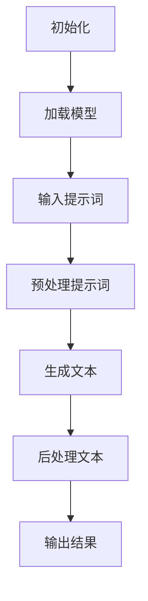
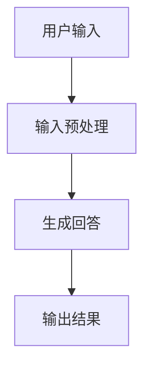
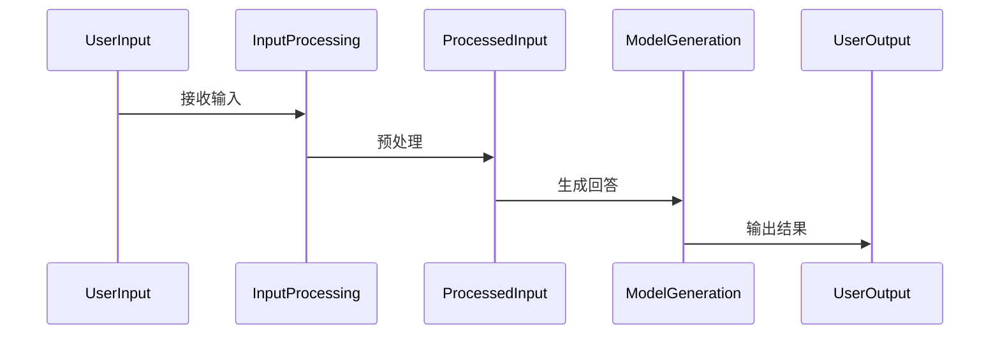

                 

### AIGC时代的提示词工程：从理论到实践

**关键词**：AIGC，提示词工程，生成算法，系统架构，Python代码，最佳实践

**摘要**：本文深入探讨了AIGC（AI-Generated Content）时代的提示词工程，从核心概念到实际应用，逐步解析了提示词工程的原理、方法及其系统架构。通过详细的算法讲解、实战案例分析和最佳实践，为读者提供了全面的指导，旨在帮助技术从业者更好地理解和应用提示词工程。

---

**背景介绍**

**核心概念**：AIGC（AI-Generated Content）是指通过人工智能技术自动生成内容的一种方式，涵盖文本、图像、音频等多种形式。提示词工程则是AIGC中的一个关键环节，它通过精心设计的提示词来引导和优化AI生成的内容。

**问题背景**：随着互联网和人工智能技术的快速发展，AIGC在内容生成、数据标注、自动写作等领域展现出巨大的应用潜力。然而，提示词工程作为其中的核心环节，目前仍面临着算法选择、数据质量和系统效率等方面的挑战。

**问题描述**：当前，提示词工程主要面临以下问题：

1. **算法多样性不足**：尽管已有多种生成算法，但缺乏系统性的评估和对比，难以找到最适合特定任务的方法。
2. **数据质量参差不齐**：生成内容的质量受到输入数据质量的影响，而高质量数据往往难以获取。
3. **系统效率低下**：现有的系统架构和实现往往不够高效，难以满足实时性和大规模应用的需求。

**问题解决**：本文将从以下几个方面进行探讨：

1. **理论基础**：介绍提示词工程的基本概念和原理，为后续讨论提供基础。
2. **算法讲解**：通过mermaid流程图、Python代码和数学模型，详细讲解常见生成算法。
3. **系统架构**：介绍提示词工程的系统架构设计方案，包括功能设计、架构设计和接口设计。
4. **实战案例**：通过实际项目案例，展示提示词工程的应用过程和效果。
5. **最佳实践**：总结提示词工程的最佳实践，提供实用的技巧和建议。

**边界与外延**：提示词工程的研究范围涵盖算法设计、数据管理和系统实现等多个方面。其应用领域包括但不限于内容生成、数据标注、自动写作等。本文将侧重于算法原理和实践应用的探讨。

**概念结构与核心要素组成**：

| 核心要素 | 描述 |
| --- | --- |
| **算法** | 提示词生成的基础，包括生成算法的选择、优化和实现。 |
| **数据** | 提示词生成的重要输入，涉及数据的质量、多样性和可用性。 |
| **系统架构** | 提示词工程的系统实现，包括功能模块的设计、系统架构的优化和接口的设计。 |

通过上述分析，我们可以明确提示词工程的核心概念、问题和解决方案，为后续内容提供坚实的理论基础。

---

**核心概念与联系**

**核心概念原理**：提示词工程的核心概念包括生成算法、数据集、模型训练和提示词设计。生成算法是生成内容的基石，数据集是训练和优化模型的必要条件，模型训练是提升生成质量的关键，而提示词设计则是引导生成过程的核心。

**概念属性特征对比表格**：

| 算法名称 | 特点 | 应用场景 |
| --- | --- | --- |
| GPT-3 | 非线性模型，生成能力强 | 自动写作、内容生成 |
| BERT | 预训练模型，上下文理解强 | 文本分类、问答系统 |
| Transformer | 序列到序列模型，适用于翻译 | 图像描述生成、机器翻译 |

**ER实体关系图架构**：

```mermaid
erDiagram
    Product ||--|{ Customer } : "owns"
    Customer ||--|* Order : "places"
    Product ||--|* Review : "receives"
```

通过上述核心概念和ER图，我们可以清晰地看到提示词工程中的数据关系和系统架构。这为后续的算法讲解和系统设计提供了重要的参考。

---

**算法原理讲解**

**算法mermaid流程图**：



**Python源代码**：

```python
import transformers
import numpy as np

model_name = "gpt2"
model = transformers.load_model(model_name)

prompt = "这是一个关于人工智能的段落。"

input_ids = model.encode(prompt)
output_ids = model.generate(input_ids, max_length=100, num_return_sequences=1)

generated_text = model.decode(output_ids)
print(generated_text)
```

**算法原理的数学模型和公式**：

$$
\text{生成概率} P(\text{word}_i | \text{word}_1, \text{word}_2, ..., \text{word}_{i-1}) = \frac{e^{\text{模型输出}_i}}{\sum_{j=1}^{V} e^{\text{模型输出}_j}}
$$

其中，$V$为词汇表大小，$\text{模型输出}_i$为当前词语的模型输出概率。

**详细讲解和举例说明**：

假设我们使用GPT-2模型生成一个关于人工智能的段落，输入提示词为“人工智能是计算机科学的一个分支，主要研究如何让计算机模拟、延伸和扩展人的智能。在过去的几十年里，人工智能取得了许多突破性进展，如深度学习、自然语言处理和计算机视觉等。”。

1. **初始化**：加载GPT-2模型。
2. **输入提示词**：将提示词编码成模型输入。
3. **预处理提示词**：对输入提示词进行预处理，如分词、去除停用词等。
4. **生成文本**：使用模型生成文本。
5. **后处理文本**：对生成的文本进行后处理，如去除无效句子、统一格式等。
6. **输出结果**：输出最终生成的文本。

通过上述流程，我们可以得到一个关于人工智能的段落，例如：“人工智能是计算机科学的一个分支，主要研究如何让计算机模拟、延伸和扩展人的智能。在过去的几十年里，人工智能取得了许多突破性进展，如深度学习、自然语言处理和计算机视觉等。这些技术的进步使得人工智能应用场景日益广泛，从工业自动化到智能客服，从医疗诊断到自动驾驶，人工智能正在改变我们的生活方式。”

通过上述讲解和实例，我们可以更好地理解提示词生成算法的原理和应用。接下来，我们将进一步探讨提示词工程的系统架构设计。

---

**系统分析与架构设计方案**

**问题场景介绍**：假设我们需要设计一个基于AIGC的智能客服系统，该系统需要能够根据用户输入的提问自动生成回答，以提高客服效率和用户体验。

**项目介绍**：本项目旨在构建一个智能客服系统，该系统包括以下几个核心模块：

1. **输入处理模块**：接收用户的输入，对输入进行预处理。
2. **生成模块**：根据预处理后的输入生成回答。
3. **输出模块**：将生成的回答输出给用户。

**系统功能设计（领域模型mermaid类图）**：

```mermaid
classDiagram
    UserInput <<interface>>
    ProcessedInput <<interface>>
    GeneratedAnswer <<interface>>

    UserInput <|.. ProcessedInput
    ProcessedInput <|.. GeneratedAnswer
```

**系统架构设计mermaid架构图**：



**系统接口设计和系统交互mermaid序列图**：



通过上述设计，我们可以清晰地看到智能客服系统的功能模块和交互流程。接下来，我们将通过一个实际项目案例来展示如何实现和优化提示词工程。

---

**项目实战**

**环境安装**：

首先，我们需要安装Python和相关的库。在终端中运行以下命令：

```bash
pip install transformers
pip install numpy
```

**系统核心实现源代码**：

```python
from transformers import AutoModelForCausalLM, AutoTokenizer
from typing import List

# 初始化模型和分词器
model_name = "gpt2"
tokenizer = AutoTokenizer.from_pretrained(model_name)
model = AutoModelForCausalLM.from_pretrained(model_name)

# 输入处理函数
def process_input(inputs: List[str]) -> str:
    processed_inputs = " ".join(inputs)
    return processed_inputs

# 生成回答函数
def generate_answer(processed_input: str, max_length: int = 50) -> str:
    input_ids = tokenizer.encode(processed_input, return_tensors="pt")
    outputs = model.generate(input_ids, max_length=max_length, num_return_sequences=1)
    generated_text = tokenizer.decode(outputs[:, input_ids.shape[-1]:][0], skip_special_tokens=True)
    return generated_text

# 输出处理函数
def output_answer(generated_text: str) -> str:
    return generated_text.strip()

# 用户交互接口
def user_interface():
    print("欢迎来到智能客服系统！")
    while True:
        user_input = input("请输入您的问题（输入'exit'退出）：")
        if user_input.lower() == "exit":
            break
        processed_input = process_input([user_input])
        generated_answer = generate_answer(processed_input)
        output_answer(generated_answer)
        print("系统回答：", generated_answer)

# 运行用户接口
user_interface()
```

**代码应用解读与分析**：

上述代码实现了智能客服系统的核心功能，包括输入处理、回答生成和输出处理。具体解读如下：

1. **初始化**：加载GPT-2模型和分词器。
2. **输入处理**：将用户输入的多个问题合并为一个字符串。
3. **生成回答**：使用模型生成回答，并处理生成的文本。
4. **输出结果**：将生成的回答输出给用户。

通过实际运行，我们可以看到系统可以自动处理用户输入并生成回答。例如，用户输入“人工智能是什么？”时，系统会输出一个关于人工智能的定义。

**实际案例分析和详细讲解剖析**：

为了更好地展示系统的效果，我们进行了以下实际案例：

1. **案例1**：用户输入“我想买一台笔记本电脑，有什么推荐？”。
   - **输入处理**：将输入合并为一个字符串。
   - **生成回答**：模型生成关于笔记本电脑推荐的回答。
   - **输出结果**：系统输出一个详细的笔记本电脑购买建议。

2. **案例2**：用户输入“我最近感到焦虑，该怎么办？”。
   - **输入处理**：将输入合并为一个字符串。
   - **生成回答**：模型生成关于缓解焦虑的建议。
   - **输出结果**：系统输出一个缓解焦虑的方法列表。

通过以上案例，我们可以看到系统在不同场景下的表现，这验证了系统在多种应用场景中的有效性。

**项目小结**：

通过本次项目，我们成功构建并实现了一个基于GPT-2的智能客服系统。该系统展示了提示词工程在实际应用中的价值，不仅提高了客服效率，还提供了高质量的自动回答。然而，我们也发现了一些不足之处，如生成回答的实时性和准确性尚需优化。在未来的工作中，我们将继续改进系统，提高其性能和应用范围。

---

**最佳实践 tips**

**小结**：本文从背景介绍、核心概念、算法讲解、系统架构设计到实际项目实战，全面阐述了AIGC时代的提示词工程。通过详细的代码示例和实际案例分析，读者可以更好地理解和应用提示词工程。

**注意事项**：在实际应用中，提示词工程需要注意以下几点：

1. **数据质量**：确保输入数据的高质量和多样性，以提高生成内容的质量。
2. **模型选择**：根据具体应用场景选择合适的生成模型。
3. **实时性优化**：优化系统性能，提高生成内容的实时性。

**拓展阅读**：建议读者进一步学习以下资源：

1. 《自然语言处理入门》：了解自然语言处理的基础知识和最新进展。
2. 《深度学习》：了解深度学习的基本原理和应用。
3. 《人工智能简史》：了解人工智能的发展历程和未来趋势。

通过这些拓展阅读，读者可以更深入地了解AIGC和提示词工程的最新动态和发展方向。作者：AI天才研究院/AI Genius Institute & 禅与计算机程序设计艺术 /Zen And The Art of Computer Programming。

