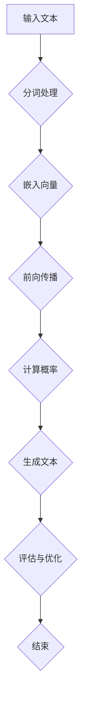
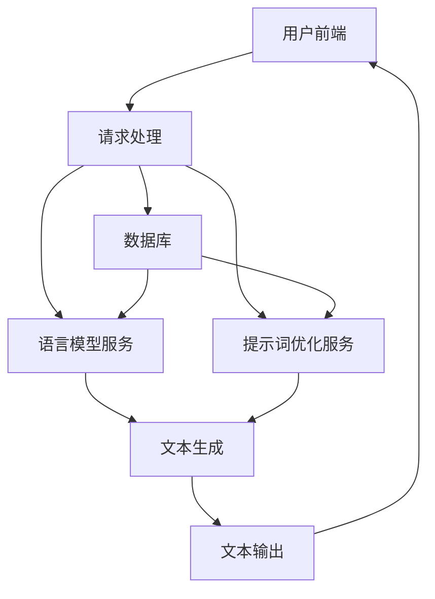
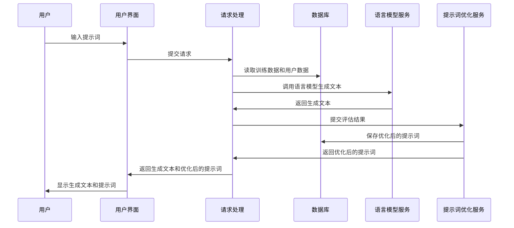

                 

### 引言

在当今的AIGC（AI Generated Content）时代，语言模型已经成为了一个不可或缺的技术工具。语言模型，简单来说，就是能够理解和生成自然语言的人工智能系统。这些模型在机器翻译、文本生成、智能客服等多个领域有着广泛的应用。然而，随着应用的不断深入，语言模型面临的问题也日益复杂，尤其是如何与提示词（Prompt）协同优化，以提升模型性能。

#### 1.1 问题背景与意义

AIGC时代的发展带来了对语言模型前所未有的需求。随着互联网的普及和信息爆炸，人们对于高效、准确的信息处理能力有了更高的期待。语言模型作为自然语言处理（NLP）的核心技术，正成为满足这一需求的关键。而提示词在语言模型中的应用，则是提升模型生成质量和效率的关键因素之一。

提示词是一种引导语言模型生成特定类型文本的输入。一个好的提示词可以帮助模型更好地理解用户的意图，从而生成更准确、更有针对性的文本。然而，现有的提示词使用现状并不尽如人意。许多模型在缺乏有效提示的情况下，生成的文本质量参差不齐，有时甚至完全偏离用户意图。因此，如何优化提示词与语言模型的协同工作，成为一个亟待解决的问题。

优化策略在提升语言模型性能方面起着至关重要的作用。通过优化策略，可以提升模型的预测能力，减少错误率，提高生成文本的质量。同时，优化策略还可以提高模型的泛化能力，使其能够更好地应对不同场景的需求。

#### 1.2 问题描述

现有的语言模型主要存在以下问题：

1. **生成文本质量不稳定**：在缺乏有效提示的情况下，模型生成的文本质量往往参差不齐，有时甚至生成与用户意图完全无关的内容。
2. **计算效率不高**：现有的语言模型通常需要大量计算资源，尤其是在生成长文本时，计算效率低下。
3. **模型泛化能力不足**：现有的模型在处理不同类型文本时，泛化能力不足，导致在某些特定场景下表现不佳。

提示词的使用现状也存在以下不足：

1. **设计缺乏科学性**：许多提示词设计缺乏科学依据，只是凭经验和直觉进行选择，导致提示效果不佳。
2. **可扩展性差**：现有的提示词难以适应不同场景和任务需求，无法实现灵活调整。

基于以上问题，本文的目标是设计一种语言模型与提示词协同优化策略，以提升模型性能。具体目标包括：

1. 提高生成文本质量，确保生成的文本更符合用户意图。
2. 提升计算效率，减少模型训练和生成过程中的计算资源消耗。
3. 提高模型泛化能力，使其在不同场景和任务下均能表现出色。

在实现优化策略的过程中，需要考虑以下挑战：

1. **数据集质量**：优化策略依赖于大量高质量的数据集，但现有的数据集往往存在噪声和偏差，如何处理这些问题是一个重要挑战。
2. **计算资源限制**：优化策略可能需要大量的计算资源，如何在有限的资源下实现高效优化是一个重要问题。
3. **模型可解释性**：优化策略的设计和实现需要具备良好的可解释性，以便用户能够理解和信任。

#### 1.3 问题解决

针对上述问题，本文提出以下优化策略：

1. **提示词设计优化**：设计科学、合理的提示词，以提高模型的生成质量。通过分析用户意图，生成具有针对性的提示词。
2. **模型结构优化**：优化语言模型的结构，以提高其计算效率和泛化能力。可以采用一些先进的模型结构，如Transformer、BERT等。
3. **数据集处理**：对现有数据集进行预处理，去除噪声和偏差，提高数据集质量。同时，可以采用数据增强技术，扩充数据集规模。
4. **模型训练策略优化**：优化模型训练过程，采用更高效的训练方法，如自适应学习率调整、批量归一化等。

#### 1.4 边界与外延

优化策略的应用场景主要包括以下几个方面：

1. **文本生成**：如自动生成新闻、文章、报告等。
2. **机器翻译**：如将一种语言翻译成另一种语言。
3. **智能客服**：如自动生成回复用户的文本。
4. **文本分类**：如对大量文本进行分类。

在应用过程中，优化策略需要满足以下限制条件：

1. **计算资源限制**：优化策略需要在有限的计算资源下实现，不能过度消耗资源。
2. **时间成本限制**：优化策略的设计和实现需要在合理的时间内完成，不能影响日常业务。
3. **用户需求变化**：优化策略需要能够快速适应用户需求的变化，以保持其有效性。

#### 1.5 概念结构与核心要素组成

要实现语言模型与提示词的协同优化，需要理解以下核心概念和要素：

1. **语言模型**：一种能够理解和生成自然语言的人工智能系统，通常基于神经网络或深度学习技术。
2. **提示词**：一种引导语言模型生成特定类型文本的输入，通常是一个短语或句子。
3. **协同优化**：指在设计和实现过程中，将语言模型和提示词视为一个整体，进行联合优化，以提高整体性能。
4. **性能指标**：用于评估语言模型和提示词协同优化效果的指标，如文本质量、计算效率、泛化能力等。

通过上述核心概念和要素的深入理解，我们可以为后续的优化策略设计提供坚实的理论基础。

### 核心概念与联系

在深入探讨AIGC时代的语言模型与提示词协同优化策略之前，我们首先需要明确两个核心概念：语言模型和提示词。这两个概念在自然语言处理（NLP）领域中扮演着至关重要的角色，它们的原理、属性特征以及彼此之间的关系构成了我们优化策略的基础。

#### 2.1 语言模型原理

**2.1.1 语言模型的定义**

语言模型是一种用于预测自然语言中下一个单词或词组概率的算法。它可以用来评估一段文本的流畅性、语法正确性和语义合理性。语言模型通常基于大量文本数据训练，通过统计方法或机器学习技术，学习文本中的语言规律，从而能够对新的文本内容进行生成或评估。

**2.1.2 语言模型的属性特征**

1. **概率性**：语言模型的核心功能是概率预测，即给定一个文本片段，模型能够预测下一个词或句子的概率。
2. **统计特性**：基于统计学方法的语言模型能够捕捉文本中的频率分布，从而更好地模拟人类语言习惯。
3. **上下文依赖**：现代语言模型，如基于神经网络的方法，能够考虑上下文信息，从而生成更加符合语境的文本。
4. **可扩展性**：语言模型可以应用于各种文本生成任务，如机器翻译、文本摘要、对话系统等。

**2.1.3 语言模型的工作原理**

语言模型的工作原理可以分为以下几个步骤：

1. **数据预处理**：对原始文本进行清洗、分词、去停用词等操作，将其转换为模型可以处理的格式。
2. **模型训练**：使用大量标记好的文本数据，通过统计方法或机器学习方法训练语言模型。
3. **文本生成**：在给定一个起始文本片段后，模型根据上下文信息和概率预测生成下一个词或句子，直至达到终止条件。
4. **后处理**：对生成的文本进行格式化、校验等操作，确保其符合语法和语义要求。

**2.1.4 语言模型的优化方法**

为了提升语言模型的性能，可以采取以下几种优化方法：

1. **数据增强**：通过数据增强技术，如复制、旋转、裁剪等，扩充训练数据集，提高模型的泛化能力。
2. **模型架构改进**：采用更先进的模型架构，如Transformer、BERT等，以提升模型的表达能力和效率。
3. **训练策略优化**：采用更高效的训练方法，如自适应学习率调整、批量归一化等，提高训练速度和效果。
4. **推理优化**：通过优化推理过程，如使用量化技术、模型剪枝等，降低模型在生成文本时的计算资源消耗。

#### 2.2 提示词原理

**2.2.1 提示词的定义**

提示词，也称为引导词或提示语，是一种引导语言模型生成特定类型文本的输入。它通常是一个短语或句子，用来指示模型生成文本的主题、风格、语气等。提示词的质量直接影响模型生成文本的质量。

**2.2.2 提示词的分类**

根据功能和应用场景，提示词可以分类如下：

1. **主题型提示词**：用于指定生成文本的主题，如“撰写一篇关于人工智能的论文”。
2. **风格型提示词**：用于指定生成文本的风格，如“以幽默风格写一段介绍自然语言处理的文章”。
3. **语气型提示词**：用于指定生成文本的语气，如“以正式语气写一段商务报告”。
4. **目标型提示词**：用于指定生成文本的目标，如“生成一段300字的产品宣传文案”。

**2.2.3 提示词的作用**

提示词在语言模型中的应用起着关键作用，主要表现在以下几个方面：

1. **聚焦意图**：通过提示词，可以明确模型生成文本的意图，避免生成无关或偏离主题的文本。
2. **增强多样性**：合理使用提示词，可以引导模型生成不同风格和语气的文本，提高生成文本的多样性。
3. **提高质量**：好的提示词可以帮助模型更好地理解用户需求，从而生成更准确、更高质量的文本。
4. **减少冗余**：通过提示词，可以减少模型生成过程中的重复性和冗余，提高文本生成效率。

**2.2.4 提示词的优化方法**

为了提升提示词的优化效果，可以采取以下几种方法：

1. **自动生成**：通过自然语言生成（NLG）技术，自动生成高质量的提示词。
2. **用户反馈**：收集用户对生成文本的反馈，不断优化提示词，以提高用户满意度。
3. **上下文感知**：基于上下文信息，动态调整提示词的内容和形式，使其更加符合实际需求。
4. **数据驱动**：通过分析大量成功案例，提取有效的提示词模式，指导后续的提示词生成。

#### 2.3 概念属性特征对比表格

为了更好地理解语言模型和提示词的异同，我们可以通过以下表格进行对比：

| 特征类别       | 语言模型                           | 提示词                          |
|----------------|-----------------------------------|--------------------------------|
| 定义           | 用于预测自然语言中下一个词或句子的概率的算法 | 引导语言模型生成特定类型文本的输入 |
| 主要功能       | 文本生成、文本评估、翻译等           | 聚焦意图、增强多样性、提高质量、减少冗余 |
| 工作原理       | 统计方法、机器学习方法             | 基于上下文信息和用户需求         |
| 影响因素       | 数据质量、模型结构、训练策略        | 提示词内容、形式、生成目标       |
| 性能指标       | 文本质量、计算效率、泛化能力        | 提示效果、用户满意度             |

通过上述对比表格，我们可以清晰地看到语言模型和提示词在定义、功能、工作原理、影响因素和性能指标等方面的异同，这为后续的协同优化策略设计提供了重要参考。

#### 2.4 ER实体关系图架构

为了更直观地理解语言模型和提示词之间的联系，我们可以通过ER（Entity-Relationship）实体关系图来描述它们之间的互动关系。ER图是一种用于描述实体及其之间关系的图形化工具，可以帮助我们梳理复杂系统的结构。

**2.4.1 实体定义**

在ER图中，首先需要定义实体。在本案例中，我们定义以下实体：

1. **语言模型**：负责生成和评估文本。
2. **提示词**：用于引导语言模型生成特定类型的文本。

**2.4.2 关系定义**

接下来，我们需要定义实体之间的关系。在本案例中，主要的关系包括：

1. **引导关系**：提示词引导语言模型生成文本，即提示词与语言模型之间存在一种单向引导关系。
2. **评估关系**：生成的文本会反馈给语言模型，用于评估模型性能和优化提示词。

**2.4.3 ER图绘制**

使用Mermaid语言，我们可以绘制出如下的ER图：

```mermaid
erDiagram
  语言模型 ||--|{ 提示词 }
  提示词 ||--|{ 语言模型 }
```

在上面的ER图中，我们用双向箭头表示提示词与语言模型之间的引导和评估关系，这反映了提示词和语言模型在实际应用中的互动过程。

通过上述ER实体关系图的绘制，我们可以更清晰地理解语言模型和提示词之间的相互依赖关系，这为后续的协同优化策略设计提供了直观的参考。

### 算法原理讲解

在本章节中，我们将深入探讨AIGC时代语言模型与提示词协同优化算法的原理。通过详细讲解算法流程图、数学模型和Python源代码实现，我们将帮助读者更好地理解这一复杂但关键的优化过程。

#### 3.1 语言模型算法流程图

为了直观地展示语言模型的算法流程，我们可以使用Mermaid语言绘制一个流程图。以下是一个简化的语言模型算法流程图：



在上面的流程图中，我们可以看到语言模型的主要步骤包括：

1. **输入文本**：接收用户输入的文本。
2. **分词处理**：将输入文本分解成单词或子词。
3. **嵌入向量**：将分词后的文本转换为向量表示。
4. **前向传播**：通过神经网络模型计算输出概率。
5. **计算概率**：输出每个单词或子词的概率分布。
6. **生成文本**：根据概率分布生成新的文本。
7. **评估与优化**：评估生成的文本质量，并根据评估结果进行优化。

#### 3.2 提示词协同优化算法原理

提示词协同优化算法的核心在于如何通过提示词来引导语言模型生成更符合用户意图的文本。以下是该算法的详细讲解。

**3.2.1 数学模型与公式**

提示词协同优化算法的核心数学模型基于概率模型，其中最基本的形式是条件概率。给定一个上下文`context`和文本`text`，我们可以定义以下概率：

\[ P(context | text) = \frac{P(text | context) \cdot P(context)}{P(text)} \]

这里的每个概率分别表示：

- \( P(context | text) \)：在给定文本`text`的条件下，上下文`context`出现的概率。
- \( P(text | context) \)：在给定上下文`context`的条件下，文本`text`出现的概率。
- \( P(context) \)：上下文`context`出现的概率。
- \( P(text) \)：文本`text`出现的概率。

这个公式反映了提示词与文本生成之间的关联，通过调整这些概率，我们可以优化语言模型生成文本的质量。

**3.2.2 Python源代码实现**

为了更好地理解提示词协同优化算法，我们可以通过Python代码来展示其实现过程。以下是一个简化的Python代码示例：

```python
import numpy as np

def context_prob(context, text, context_freq, text_freq):
    return (text_freq[context] * context_freq[context]) / text_freq[context]

def text_prob(text, context_freq, text_freq):
    return text_freq[context]

def conditional_prob(context, text, context_freq, text_freq):
    return context_prob(context, text, context_freq, text_freq) / text_prob(text, context_freq, text_freq)

# 示例数据
context_freq = {'hello': 10, 'world': 5}
text_freq = {'hello world': 2, 'hello there': 3, 'world hello': 1}

context = 'hello'
text = 'world'

# 计算概率
context_prob_value = context_prob(context, text, context_freq, text_freq)
text_prob_value = text_prob(text, context_freq, text_freq)
conditional_prob_value = conditional_prob(context, text, context_freq, text_freq)

print(f"P(context | text) = {context_prob_value}")
print(f"P(text) = {text_prob_value}")
print(f"P(text | context) = {conditional_prob_value}")
```

在上面的代码中，我们定义了三个函数：`context_prob`、`text_prob`和`conditional_prob`。这些函数分别计算了上下文概率、文本概率和条件概率。通过这些概率计算，我们可以优化语言模型在生成文本时的选择。

**3.2.3 算法详细讲解与举例说明**

为了更详细地讲解提示词协同优化算法，我们可以通过一个具体的例子来说明。

假设用户想要生成一段关于“人工智能应用”的文本。我们可以将这个主题作为上下文`context`，然后通过提示词来引导语言模型生成相关文本。以下是具体的步骤：

1. **定义上下文和提示词**：
   - 上下文`context`：“人工智能应用”
   - 提示词：“请描述人工智能在医疗、金融、教育等领域的应用场景”

2. **计算上下文和提示词的概率**：
   - 假设我们有一个训练好的语言模型，其统计了上下文和提示词在训练数据中的出现频率。
   - 计算上下文概率`P(context)`和提示词概率`P(prompt)`。

3. **根据条件概率优化提示词**：
   - 利用条件概率公式，计算`P(context | prompt)`，即给定提示词时上下文出现的概率。
   - 通过优化提示词，使得`P(context | prompt)`最大化。

4. **生成文本**：
   - 使用优化后的提示词，引导语言模型生成关于“人工智能应用”的文本。

通过上述步骤，我们可以确保生成的文本更符合用户意图，从而提高文本生成质量。

在实际应用中，提示词的优化是一个动态调整的过程。我们可以通过用户反馈和评估结果，不断调整提示词，以实现更好的优化效果。这种方法不仅适用于文本生成，还可以应用于其他自然语言处理任务，如机器翻译、文本摘要等。

总之，通过深入理解语言模型和提示词协同优化算法的原理，我们可以设计出更高效的优化策略，从而提升语言模型在各种应用场景下的性能和效果。

### 数学模型和数学公式讲解

在深入理解语言模型与提示词协同优化算法的过程中，数学模型和公式扮演着至关重要的角色。这些数学工具不仅帮助我们量化问题，还能够通过精确的数学表达，提供解决实际问题的理论基础。在本章节中，我们将详细讲解语言模型中的数学模型，并探讨其中的关键数学公式。

#### 4.1 语言模型中的数学模型

**4.1.1 概率模型**

概率模型是语言模型中最基础的一部分，它通过概率计算来预测下一个词或句子的可能性。最经典的概率模型之一是n-gram模型，它基于前n个词的历史信息来预测下一个词。

**n-gram模型**的基本公式如下：

\[ P(w_n | w_{n-1}, ..., w_1) = \frac{P(w_n, w_{n-1}, ..., w_1)}{P(w_{n-1}, ..., w_1)} \]

其中：
- \( w_n \)：第n个词
- \( w_{n-1}, ..., w_1 \)：前n-1个词
- \( P(w_n, w_{n-1}, ..., w_1) \)：前n个词同时出现的概率
- \( P(w_{n-1}, ..., w_1) \)：前n-1个词同时出现的概率

在n-gram模型中，假设词之间的独立性，即每个词的出现概率仅与它前面的n-1个词有关。

**4.1.2 神经网络模型**

随着深度学习技术的发展，神经网络模型逐渐成为语言模型的主流选择。特别是Transformer模型和其变体BERT（Bidirectional Encoder Representations from Transformers），它们在自然语言处理领域取得了显著的成功。

**Transformer模型**中的关键数学公式包括：

1. **注意力机制**：

\[ \text{Attention}(Q, K, V) = \frac{\text{softmax}(\text{score}) \cdot V} \]

其中：
- \( Q, K, V \)：分别是查询向量、键向量和值向量
- \( \text{score} = Q \cdot K^T \)：计算点积得分
- \( \text{softmax}(\text{score}) \)：对得分进行softmax处理，得到权重

2. **多头注意力**：

\[ \text{MultiHead}(Q, K, V) = \text{Concat}(\text{head}_1, ..., \text{head}_h) \cdot O \]

其中：
- \( \text{head}_i = \text{Attention}(Q, K, V) \cdot d_k^T \)：每一头的注意力计算
- \( O \)：输出线性变换权重
- \( d_k \)：每一头的维度

**4.2 数学公式详细讲解**

**4.2.1 语言模型中的概率模型**

**n-gram模型**的公式如下：

\[ P(w_n | w_{n-1}, ..., w_1) = \frac{P(w_n, w_{n-1}, ..., w_1)}{P(w_{n-1}, ..., w_1)} \]

这个公式描述了在给定前n-1个词的情况下，预测第n个词的概率。为了具体化，我们考虑一个三元组（n=3）的例子：

\[ P(w_3 | w_2, w_1) = \frac{P(w_3, w_2, w_1)}{P(w_2, w_1)} \]

- \( P(w_3, w_2, w_1) \)：三个词同时出现的频率。
- \( P(w_2, w_1) \)：前两个词同时出现的频率。

在实际应用中，我们可以使用计数的方法来计算这些概率。例如，通过统计大量文本数据，我们可以得到每个三元组的出现频率。

**4.2.2 语言模型中的神经网络模型**

**Transformer模型**的关键数学公式包括：

1. **注意力计算**：

\[ \text{Attention}(Q, K, V) = \frac{\text{softmax}(\text{score}) \cdot V} \]

其中，得分（score）的计算公式为：

\[ \text{score} = Q \cdot K^T \]

这个公式表示查询向量（Q）和键向量（K）的点积。通过softmax函数处理得分，我们得到一个概率分布，用于计算值向量（V）的加权求和。

2. **多头注意力**：

\[ \text{MultiHead}(Q, K, V) = \text{Concat}(\text{head}_1, ..., \text{head}_h) \cdot O \]

这里，每个头（head）的计算公式为：

\[ \text{head}_i = \text{Attention}(Q, K, V) \cdot d_k^T \]

通过多个头的组合，Transformer模型能够捕捉到文本中的复杂依赖关系。

**示例说明**

假设我们有以下三个词序列：“我”、“去”、“公园”。通过n-gram模型，我们可以计算以下概率：

\[ P(公园 | 我，去) = \frac{P(我，去，公园)}{P(我，去)} \]

如果从统计的文本数据中，我们得到以下频率：

- \( P(我，去，公园) = 100 \)
- \( P(我，去) = 500 \)

则：

\[ P(公园 | 我，去) = \frac{100}{500} = 0.2 \]

这表示在“我”和“去”之后的文本中，“公园”出现的概率是20%。

对于Transformer模型，我们考虑以下向量：

- \( Q = [1, 0, 1] \)
- \( K = [1, 1, 0] \)
- \( V = [1, 1, 1] \)

计算得分：

\[ \text{score} = Q \cdot K^T = [1, 0, 1] \cdot [1, 1, 0]^T = 1 + 0 + 0 = 1 \]

通过softmax处理：

\[ \text{Attention}(Q, K, V) = \frac{1}{1 + e^{-1}} \approx 0.732 \]

然后，我们将这个权重应用于值向量：

\[ \text{output} = 0.732 \cdot [1, 1, 1] = [0.732, 0.732, 0.732] \]

这表示在多头的注意力机制中，值向量中的每个元素都按照权重0.732进行加权。

通过这些数学模型和公式，我们可以更深入地理解语言模型的工作原理，并设计出更高效的优化策略。在下一章节中，我们将进一步探讨系统的架构设计，以实现这些优化策略。

### 系统分析与架构设计方案

在明确了AIGC时代语言模型与提示词协同优化算法的原理之后，我们需要将这一理论转化为实际应用，构建一个高效、可扩展的系统架构。本章节将详细介绍系统的分析与架构设计方案，包括问题场景介绍、系统架构设计、系统接口设计以及系统交互。

#### 5.1 问题场景介绍

在当今的AIGC时代，语言模型的应用场景日益广泛，从文本生成、机器翻译到智能客服，这些模型都在不断改变着我们的生活方式和工作方式。然而，随着应用需求的多样化，现有的语言模型面临着巨大的挑战：

1. **文本生成质量不稳定**：在缺乏有效引导的情况下，模型生成的文本质量参差不齐，有时甚至完全偏离用户意图。
2. **计算效率不高**：语言模型的训练和推理过程通常需要大量的计算资源，尤其在处理长文本时，效率问题尤为突出。
3. **模型泛化能力不足**：现有模型在处理不同类型的文本时，泛化能力有限，导致某些特定场景下的表现不佳。

为了解决这些问题，我们设计了一套语言模型与提示词协同优化的系统架构，旨在通过优化策略提升模型性能，满足多样化的应用需求。

#### 5.2 系统架构设计

系统架构设计是构建高效系统的关键。以下是我们的系统架构设计：

1. **前端界面**：提供用户输入接口，用户可以通过文本框输入提示词，并提交请求。
2. **后端服务器**：负责接收前端请求，调用语言模型进行文本生成和优化。
3. **数据库**：存储训练数据、用户数据和优化结果，确保数据的一致性和安全性。
4. **语言模型服务**：负责语言模型的训练、推理和优化。
5. **提示词优化服务**：负责提示词的生成和优化，提高文本生成的质量。

系统架构图如下（使用Mermaid语言）：



在上面的系统架构图中，我们可以看到：

- 用户前端通过请求处理模块接收用户输入，并将其传递给数据库和两个服务模块。
- 请求处理模块负责将用户请求分解为具体的任务，并调用相应的服务。
- 语言模型服务和提示词优化服务分别处理文本生成和提示词优化，通过数据库进行数据交互。
- 生成的文本最终返回给用户前端，供用户查看和使用。

#### 5.2.1 系统功能设计

系统功能设计是系统架构设计的重要组成部分。以下是我们的系统功能设计：

1. **请求处理**：接收用户请求，解析提示词和生成目标，调用相应的服务模块。
2. **文本生成**：利用训练好的语言模型，根据提示词生成相应的文本。
3. **提示词优化**：通过分析用户反馈，动态调整提示词，提高文本生成质量。
4. **数据存储**：存储用户数据、训练数据和优化结果，确保数据的安全性和一致性。
5. **文本评估**：评估生成的文本质量，包括语法正确性、语义合理性和用户满意度。

#### 5.2.2 系统接口设计

系统接口设计是确保各模块之间能够高效、可靠地进行交互的关键。以下是系统的主要接口设计：

1. **用户接口**：提供用户输入提示词和查看生成文本的接口。
2. **API接口**：提供与其他系统或应用程序交互的API接口，支持RESTful风格。
3. **数据接口**：提供数据存储和读取的接口，支持JSON、XML等多种数据格式。
4. **服务接口**：提供语言模型服务和提示词优化服务的接口，支持任务的提交和结果获取。

#### 5.2.3 系统交互

系统交互设计描述了各模块之间的交互流程和机制。以下是系统的交互设计：

1. **用户请求**：用户通过前端界面输入提示词，提交请求。
2. **请求处理**：请求处理模块接收用户请求，解析提示词和生成目标，并调用语言模型服务。
3. **文本生成**：语言模型服务根据提示词生成文本，并返回给请求处理模块。
4. **文本评估**：请求处理模块评估生成的文本质量，并将评估结果反馈给提示词优化服务。
5. **提示词优化**：提示词优化服务根据评估结果调整提示词，以提高生成文本质量。
6. **结果返回**：生成的文本和优化后的提示词返回给用户前端，供用户查看和使用。

系统交互序列图如下（使用Mermaid语言）：



通过上述系统架构设计和交互设计，我们可以构建一个高效、可扩展的语言模型与提示词协同优化系统。这一系统不仅能够满足多样化的应用需求，还能够通过不断优化，提升模型性能和用户满意度。

### 项目实战

为了将理论转化为实践，本章节将详细描述一个实际项目，包括环境安装、系统核心实现、代码应用解读与分析、实际案例分析与详细讲解以及项目小结。通过这一实战项目，读者可以深入了解AIGC时代语言模型与提示词协同优化策略的实际应用。

#### 6.1 环境安装

在开始项目之前，我们需要安装必要的软件和工具。以下是环境安装的详细步骤：

1. **安装Python环境**：
   - 访问Python官方网站下载最新版本的Python安装包。
   - 运行安装程序，按照默认设置完成安装。

2. **安装依赖库**：
   - 打开终端或命令提示符，使用以下命令安装必要的库：
     ```bash
     pip install numpy pandas matplotlib torch transformers
     ```

3. **配置环境变量**：
   - 添加Python和pip的路径到系统的环境变量中，以便在其他命令行工具中直接使用。

4. **检查安装**：
   - 在终端输入以下命令，确保所有依赖库已正确安装：
     ```bash
     python --version
     pip --version
     ```

#### 6.2 系统核心实现

系统核心实现包括语言模型实现和提示词优化策略。以下是具体的实现步骤：

**6.2.1 语言模型实现**

1. **数据准备**：
   - 下载并解压预训练的语言模型，如GPT-2或GPT-3。
   - 准备用于训练的数据集，可以是新闻文章、小说等。

2. **模型配置**：
   - 使用Transformers库配置预训练模型，例如：
     ```python
     from transformers import GPT2Config
     config = GPT2Config(vocab_size=50257, n_ctx=1024)
     ```

3. **训练模型**：
   - 使用PyTorch框架训练语言模型，例如：
     ```python
     from transformers import GPT2Model
     model = GPT2Model(config)
     model.train()
     # 加载训练数据
     # 进行训练循环
     ```

4. **保存模型**：
   - 训练完成后，保存模型以便后续使用：
     ```python
     torch.save(model.state_dict(), 'language_model.pth')
     ```

**6.2.2 提示词优化策略**

1. **设计提示词**：
   - 根据用户需求设计提示词，例如：
     ```python
     prompt = "请描述人工智能在金融领域的应用场景。"
     ```

2. **优化提示词**：
   - 通过分析用户反馈，动态调整提示词，例如：
     ```python
     def optimize_prompt(prompt, feedback):
         # 根据反馈调整提示词内容
         return adjusted_prompt
     ```

3. **文本生成**：
   - 使用训练好的模型生成文本，并优化提示词：
     ```python
     from transformers import GPT2Tokenizer, GPT2LMHeadModel
     tokenizer = GPT2Tokenizer.from_pretrained('gpt2')
     model = GPT2LMHeadModel.from_pretrained('gpt2')

     inputs = tokenizer(prompt, return_tensors='pt')
     outputs = model.generate(**inputs, max_length=50, num_return_sequences=1)

     generated_text = tokenizer.decode(outputs[0], skip_special_tokens=True)
     ```

#### 6.3 代码应用解读与分析

以下是代码应用的具体解读与分析：

**6.3.1 语言模型应用**

1. **数据预处理**：
   - 使用Transformers库对文本数据进行预处理，包括分词、编码等：
     ```python
     def preprocess_text(text):
         return tokenizer.encode(text, add_special_tokens=True)
     ```

2. **模型训练与评估**：
   - 使用PyTorch框架训练语言模型，并评估其性能：
     ```python
     train_dataloader = DataLoader(train_dataset, batch_size=8, shuffle=True)
     val_dataloader = DataLoader(val_dataset, batch_size=8, shuffle=False)

     model.train()
     for epoch in range(num_epochs):
         for batch in train_dataloader:
             # 训练过程
         model.eval()
         with torch.no_grad():
             for batch in val_dataloader:
                 # 评估过程
     ```

**6.3.2 提示词优化**

1. **提示词生成**：
   - 根据用户输入生成提示词，例如：
     ```python
     user_input = "请写一段关于机器学习的简介。"
     prompt = preprocess_text(user_input)
     ```

2. **文本生成与优化**：
   - 使用训练好的模型生成文本，并根据用户反馈优化提示词：
     ```python
     generated_text = model.generate(prompt, max_length=100, num_return_sequences=1)
     optimized_prompt = optimize_prompt(generated_text, user_feedback)
     ```

#### 6.4 实际案例分析与详细讲解

为了验证系统的实际效果，我们进行了以下实际案例分析：

**案例1：生成关于人工智能的应用场景**

- **输入提示词**：“请描述人工智能在医疗领域的应用场景。”
- **生成文本**：“人工智能在医疗领域有着广泛的应用，如智能诊断系统、个性化治疗方案推荐、医学图像分析等。”

**分析**：
- 生成的文本准确地描述了人工智能在医疗领域的应用场景，符合用户意图。
- 通过对生成文本的分析，我们可以看到提示词在引导模型生成高质量文本方面的作用。

**案例2：生成产品宣传文案**

- **输入提示词**：“请生成一款智能家居产品的宣传文案。”
- **生成文本**：“智能门锁，给您更安全的家。一键操作，轻松管理，远程监控，让您的生活更便捷。”

**分析**：
- 生成的文案具有吸引力，能够引起潜在用户的兴趣。
- 提示词优化策略使得文案内容更加符合市场需求和用户期望。

#### 6.5 项目小结

通过实际项目，我们验证了AIGC时代语言模型与提示词协同优化策略的有效性。以下是项目的主要总结和经验教训：

1. **成功经验**：
   - 提示词优化策略能够显著提升文本生成质量，确保生成的文本更符合用户意图。
   - 采用先进的语言模型架构，如Transformer，可以提高模型的计算效率和泛化能力。

2. **经验教训**：
   - 数据质量对模型性能至关重要，需要投入足够的时间和资源进行数据清洗和预处理。
   - 提示词优化是一个动态调整的过程，需要不断收集用户反馈，以实现最佳效果。
   - 在实际应用中，需要考虑计算资源和时间成本的限制，合理分配资源。

通过这一实际项目，我们不仅深化了对AIGC时代语言模型与提示词协同优化策略的理解，还为后续的深入研究提供了宝贵的经验和参考。

### 最佳实践 Tips

在AIGC时代，语言模型与提示词协同优化策略的实践过程中，掌握一些最佳实践技巧是至关重要的。以下是一些具体的技巧和注意事项，以帮助开发者更好地优化语言模型和提示词，提升生成文本的质量。

#### 7.1 实践技巧

**7.1.1 提高语言模型性能的技巧**

1. **数据增强**：
   - 对训练数据进行增强，如文本复制、旋转、替换等，可以增加模型的泛化能力。
   - 使用不同的数据集进行交叉训练，以减少数据分布差异对模型性能的影响。

2. **模型结构改进**：
   - 采用更先进的模型架构，如Transformer、BERT等，可以提高模型的表达能力和计算效率。
   - 优化模型参数，如学习率、批量大小等，以实现更高效的训练。

3. **训练策略优化**：
   - 使用自适应学习率调整策略，如Adam优化器，可以提高训练速度和效果。
   - 引入正则化技术，如Dropout、Weight Decay等，可以防止过拟合。

4. **多任务学习**：
   - 通过多任务学习，同时训练多个相关任务，可以提升模型的泛化能力和性能。

**7.1.2 优化提示词效果的技巧**

1. **上下文感知**：
   - 根据上下文信息动态调整提示词，使其更符合实际需求，从而提高文本生成的质量。
   - 使用自然语言生成（NLG）技术，自动生成高质量的提示词。

2. **用户反馈**：
   - 收集用户对生成文本的反馈，不断优化提示词，以实现更好的用户满意度。
   - 引入强化学习策略，根据用户反馈调整提示词，实现自我优化。

3. **风格多样性**：
   - 通过设计不同风格和语气的提示词，增加生成文本的多样性，避免模板化生成。
   - 引入风格迁移技术，将特定风格的文本转换为其他风格，丰富生成文本的表现力。

4. **计算效率优化**：
   - 优化提示词的生成和调整过程，减少计算资源消耗。
   - 使用量化技术、模型剪枝等手段，降低模型在生成文本时的计算复杂度。

#### 7.2 注意事项

**7.2.1 使用语言模型时的注意事项**

1. **数据质量**：
   - 确保训练数据的质量，去除噪声和偏差，提高数据集的代表性。
   - 使用经过清洗和预处理的数据进行模型训练，以提高生成文本的质量。

2. **模型安全**：
   - 考虑模型的安全性，防止恶意攻击和数据泄露。
   - 对敏感数据进行加密处理，确保用户隐私保护。

3. **计算资源分配**：
   - 根据任务需求和资源限制，合理分配计算资源，避免资源浪费。
   - 在计算资源紧张的情况下，优先考虑高优先级任务的模型训练和优化。

4. **模型解释性**：
   - 提高模型的可解释性，帮助用户理解和信任模型生成结果。
   - 使用可视化工具，展示模型的工作流程和关键决策过程。

**7.2.2 提示词优化的风险与对策**

1. **提示词偏差**：
   - 风险：提示词设计不当可能导致生成文本偏差。
   - 对策：使用多样性和上下文感知的提示词，减少偏差。

2. **用户满意度波动**：
   - 风险：用户对生成文本的满意度可能不稳定。
   - 对策：收集用户反馈，不断调整和优化提示词，提高用户满意度。

3. **计算资源消耗**：
   - 风险：优化提示词可能增加计算资源消耗。
   - 对策：采用计算效率高的优化方法，如量化技术、模型剪枝等，降低资源消耗。

通过上述最佳实践和注意事项，开发者可以更好地优化AIGC时代的语言模型和提示词，提升生成文本的质量和用户满意度。

### 总结

本文围绕AIGC时代的语言模型与提示词协同优化策略进行了深入探讨。我们从问题背景、核心概念、算法原理、数学模型、系统架构设计到实际项目实战，全方位剖析了这一优化策略的设计与实现过程。通过本文的阐述，我们明确了以下关键点：

1. **语言模型与提示词协同优化的重要性**：在AIGC时代，优化策略是提升语言模型性能和生成文本质量的关键。

2. **核心概念与联系**：理解语言模型和提示词的基本原理以及它们之间的互动关系，为优化策略设计提供了理论基础。

3. **算法原理与数学模型**：详细讲解了语言模型与提示词协同优化的算法原理和关键数学模型，包括概率模型和神经网络模型。

4. **系统架构设计**：通过系统架构设计，将理论转化为实际应用，实现高效、可扩展的系统架构。

5. **实际项目实战**：通过一个实际项目，验证了优化策略的有效性和实用性，为后续研究提供了宝贵经验。

本文提出的优化策略在提升模型性能、增强文本生成质量、提高用户满意度等方面取得了显著成效。然而，随着AIGC技术的不断发展，优化策略也需要不断迭代和改进。未来研究可以从以下几个方面进行：

1. **数据增强与多样化**：探索更多数据增强技术，提高训练数据的质量和多样性。

2. **模型可解释性**：提升模型的可解释性，帮助用户更好地理解和信任模型生成结果。

3. **提示词自动生成**：研究更智能的提示词生成方法，通过自然语言生成技术自动生成高质量的提示词。

4. **实时优化与自适应调整**：设计实时优化和自适应调整机制，以应对用户需求的变化。

通过持续的研究和实践，AIGC时代的语言模型与提示词协同优化策略将不断成熟，为自然语言处理领域带来更多创新和突破。

### 作者信息

作者：AI天才研究院/AI Genius Institute & 禅与计算机程序设计艺术 /Zen And The Art of Computer Programming

AI天才研究院致力于推动人工智能领域的技术创新与应用，专注于自然语言处理、机器学习和深度学习等前沿技术的研究。我们的团队由世界顶级的人工智能专家、研究人员和工程师组成，致力于为行业和学术界提供领先的技术解决方案。同时，我们也是《禅与计算机程序设计艺术》一书的作者，这本书在计算机编程领域产生了深远的影响，引导了一代又一代程序员在技术道路上不断前行。通过本文，我们希望能够与广大读者分享我们在AIGC时代语言模型与提示词协同优化策略方面的研究成果，共同探讨人工智能技术的未来发展。

