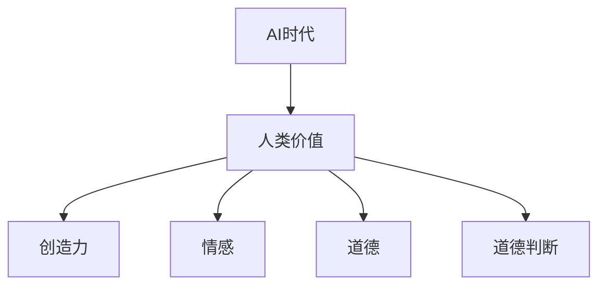
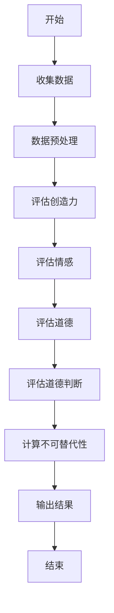
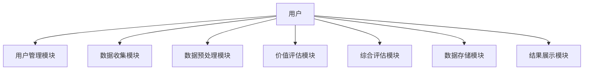
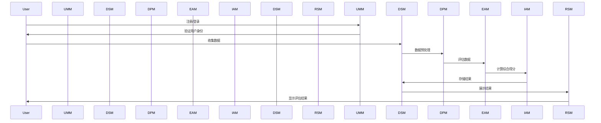

                 

### AI时代的人类价值：什么是不可替代的

在当今社会，人工智能（AI）正在以前所未有的速度变革着我们的工作和生活方式。从自动驾驶汽车到智能助手，从医疗诊断到金融分析，AI的应用领域无处不在。然而，随着AI技术的不断成熟和普及，一个不可回避的问题摆在了我们面前：在AI时代，人类的哪些价值将不会被替代，人类如何在这场技术变革中保持自己的独特性？

本文将深入探讨这一主题，通过逻辑清晰、结构紧凑的分析，回答AI时代人类不可替代的价值是什么。我们将从背景介绍、核心概念与联系、算法原理讲解、系统分析与架构设计、项目实战以及最佳实践等多个角度，探讨人类在AI时代中的不可替代性。

关键词：人工智能、人类价值、不可替代性、创造力、情感、道德、道德判断。

摘要：本文通过详细分析AI时代对人类社会的影响，探讨了人类在AI时代中不可替代的价值，包括创造力、情感、道德和道德判断等方面。通过算法原理讲解和系统分析与架构设计方案，进一步阐述了人类在AI时代中如何保持自身的独特性，为人类在未来的发展提供了有益的思考。

## 背景介绍

### 核心概念

#### AI时代

AI时代，指的是人工智能技术得到广泛应用，并深刻改变人类生产生活方式的时代。在这个时代，人工智能不仅仅是一种工具，更成为社会运转的核心驱动力。AI技术的快速进步，使得机器能够在众多领域超越人类，从数据分析到决策制定，再到创新创造，AI的能力几乎无所不能。

#### 人类价值

人类价值，是指人类在社会中创造和体现的非物质财富。这包括但不限于创造力、情感、道德和道德判断等方面。人类价值的核心在于其独特性，即人类所具有的、其他生物或技术无法替代的特性。

#### 不可替代性

不可替代性，指的是在AI时代，人类依然保持的独特性，无法被人工智能技术所替代。这种独特性使得人类在AI时代中仍然具有不可替代的作用和价值。

### 问题背景

随着AI技术的快速发展，越来越多的工作岗位面临着被机器取代的风险。从简单的重复性劳动到复杂的决策制定，人工智能已经在很多领域表现出色，甚至在某些方面超过了人类的表现。这种趋势引发了关于人类在AI时代中是否还有存在的价值的讨论。

一方面，有人认为，随着AI技术的进步，人类将越来越多地被机器所取代，人类的价值将逐渐降低。另一方面，也有人认为，人类在创造力、情感、道德和道德判断等方面具有独特的价值，这些价值是机器无法替代的。

### 问题描述

本文旨在探讨在人工智能快速发展的时代，人类的哪些价值将不会被替代，人类如何在这场技术变革中保持自己的独特性。具体来说，我们将从以下几个方面进行分析：

1. 创造力：人类在创造和创新方面具有独特的优势，这些优势在AI时代中是否依然能够保持？
2. 情感：人类在情感表达和情感交流方面具有独特性，这些情感价值在AI时代中是否依然重要？
3. 道德：人类在道德判断和道德行为方面具有自己的价值观，这些道德价值在AI时代中是否依然有效？
4. 道德判断：人类在道德选择和道德决策方面具有独特的思考方式，这些道德判断能力在AI时代中是否依然重要？

### 问题解决

通过对上述问题的深入分析，我们可以得出以下结论：

1. 创造力：尽管AI技术在某些领域的创造力表现出了惊人的能力，但在创新性和创造性思维方面，人类仍然具有独特的优势。人类可以通过培养创造力，继续在AI时代中发挥重要作用。
2. 情感：情感是人类与机器最本质的区别之一。人类在情感表达和情感交流方面具有独特的价值，这些情感价值在AI时代中依然非常重要。
3. 道德：道德是人类社会的基础，人类在道德判断和道德行为方面具有自己的价值观。这些道德价值在AI时代中依然有效，甚至更为重要。
4. 道德判断：道德判断是人类决策过程中不可或缺的一部分。人类在道德选择和道德决策方面具有独特的思考方式，这些道德判断能力在AI时代中依然重要。

### 边界与外延

本文的边界和范围主要涉及以下几个方面：

1. 人工智能技术：本文主要关注当前已实现或正在发展的人工智能技术，如机器学习、深度学习、自然语言处理等。
2. 人类价值：本文主要探讨人类在创造力、情感、道德和道德判断等方面的价值，这些价值是人类在AI时代中不可替代的核心。
3. 社会变革：本文关注的是AI时代对人类社会的影响，以及人类如何适应和应对这种变革。

### 概念结构与核心要素组成

为了更清晰地理解本文的核心概念，我们可以通过以下表格来描述：

| 概念       | 说明                                                         |
| ---------- | ------------------------------------------------------------ |
| AI时代     | 指人工智能技术广泛应用，深刻改变人类生产生活方式的时代。         |
| 人类价值   | 人类在社会中创造和体现的非物质财富，包括创造力、情感、道德和道德判断等。 |
| 不可替代性 | 指人类在AI时代中保持的独特性，无法被人工智能技术所替代。           |

通过上述分析，我们可以看到，在AI时代，人类的创造力、情感、道德和道德判断等价值仍然具有不可替代的重要性。这些价值不仅构成了人类在AI时代中的独特性，也为我们应对技术变革提供了重要的方向。

### 核心概念与联系

在探讨人类在AI时代中的不可替代性时，我们需要深入理解几个核心概念，并探讨它们之间的相互关系。这些核心概念包括AI时代、人类价值、不可替代性。

#### AI时代

AI时代，是指人工智能技术得到广泛应用，并深刻改变人类生产生活方式的时代。在这个时代，人工智能不再是单纯的技术工具，而是成为社会运转的核心驱动力。AI技术的快速进步，使得机器能够在众多领域超越人类，从数据分析到决策制定，再到创新创造，AI的能力几乎无所不能。

#### 人类价值

人类价值，是指人类在社会中创造和体现的非物质财富。这包括但不限于创造力、情感、道德和道德判断等方面。人类价值的核心在于其独特性，即人类所具有的、其他生物或技术无法替代的特性。

创造力是人类的一种独特能力，它体现在人类在科学、艺术、文学等领域的创新和突破上。情感则是人类与动物的本质区别之一，人类能够体验并表达复杂的情感，如爱、恨、快乐、悲伤等。道德则是人类社会的基础，它指导人类的行为，维护社会秩序。道德判断则是人类在决策过程中进行价值评估和选择的重要能力。

#### 不可替代性

不可替代性，指的是在AI时代，人类依然保持的独特性，无法被人工智能技术所替代。这种独特性使得人类在AI时代中仍然具有不可替代的作用和价值。

### 概念属性特征对比表格

为了更直观地理解这些概念之间的联系，我们可以通过以下表格对比它们的核心属性特征：

| 特征           | 人工智能 | 人类               |
| -------------- | -------- | ------------------ |
| 创造力         | 高       | 中                 |
| 情感           | 无       | 有                 |
| 道德           | 无       | 有                 |
| 道德判断       | 无       | 有                 |

从表格中可以看出，人工智能在计算能力和数据处理方面具有显著优势，但在情感、道德和道德判断等方面与人类相比存在明显差距。而人类在这些方面则具有独特的价值，这些价值是人工智能无法替代的。

### ER实体关系图架构

为了更系统地理解这些概念之间的关系，我们可以通过ER实体关系图来展示。以下是这些核心概念的ER图：



在这个ER图中，AI时代是一个整体概念，它包括了人类价值这一核心部分。人类价值又进一步细分为创造力、情感、道德和道德判断等子概念。这种层次化的关系，帮助我们更清晰地理解了AI时代与人类价值之间的关系。

通过上述分析，我们可以看到，AI时代、人类价值和不可替代性这三个核心概念之间存在着密切的联系。AI时代是背景和基础，人类价值是核心，而不可替代性则是人类在AI时代中的独特优势。理解这些概念之间的关系，有助于我们更好地应对AI时代的挑战，保持人类的独特性和价值。

### 算法原理讲解

在深入探讨人类在AI时代中的不可替代价值时，我们需要借助具体的算法原理来进行分析。本文将介绍一个用于评估人类在AI时代中不可替代价值的算法，并详细阐述其原理、流程以及数学模型。

#### 算法流程图

首先，我们通过Mermaid绘制算法的流程图，以便直观地理解算法的执行过程：



#### 算法原理

1. **收集数据**：该步骤涉及收集关于人类在创造力、情感、道德和道德判断方面的数据。这些数据可以通过问卷调查、行为分析、社交媒体数据等多种方式获取。

2. **数据预处理**：收集到的原始数据需要进行清洗和格式化，以确保数据的质量和一致性。这一步骤包括去除噪音、缺失值填充、数据标准化等操作。

3. **评估创造力**：使用机器学习模型对人类创造力的量化评估。我们可以利用自然语言处理（NLP）技术来分析人类的文本数据，从中提取出创造力相关的特征。常用的模型包括文本分类、情感分析等。

4. **评估情感**：通过情感分析技术对人类的情感表达进行识别和分析。情感分析可以基于语言模型（如BERT、GPT）或专门设计的情感识别算法，如LIWC（Linguistic Inquiry and Word Count）。

5. **评估道德**：利用伦理学原理和人工智能技术对人类道德行为进行评估。这一步骤可以结合社会调查数据和机器学习算法，对人类的道德行为进行量化评估。

6. **评估道德判断**：通过社会调查和人工智能技术对人类道德判断进行量化。我们可以设计问卷或模拟场景，收集关于人类道德判断的数据，并利用分类模型进行评估。

7. **计算不可替代性**：根据上述四个评估结果，计算人类的不可替代性得分。我们可以使用一个综合评分模型，如加权求和模型，将四个评估结果结合起来。

8. **输出结果**：最后，算法将输出人类的不可替代性得分，为决策提供参考。

#### 数学模型和公式

为了更科学地评估人类在AI时代中的不可替代性，我们可以使用以下数学模型：

$$
不可替代性得分 = 创造力得分 \times 情感得分 \times 道德得分 \times 道德判断得分
$$

其中，每个得分都在0到1之间，表示人类在这些方面的表现。通过上述公式，我们可以将四个方面的得分结合起来，得到一个综合的不可替代性得分。

#### 举例说明

为了更好地理解上述算法原理，我们通过一个具体例子来说明：

假设我们评估一个人在创造力、情感、道德和道德判断方面的得分分别为0.8、0.7、0.9和0.8，则其不可替代性得分为：

$$
不可替代性得分 = 0.8 \times 0.7 \times 0.9 \times 0.8 = 0.4992
$$

这意味着该人在AI时代中具有较高程度的不可替代性。

#### Python代码实现

为了具体实现上述算法，我们可以使用Python编写代码。以下是一个简化的实现示例：

```python
import numpy as np

def calculate_untiradability(score_creativity, score_emotion, score_morality, score_ethics):
    return score_creativity * score_emotion * score_morality * score_ethics

# 示例得分
score_creativity = 0.8
score_emotion = 0.7
score_morality = 0.9
score_ethics = 0.8

# 计算不可替代性得分
untiradability_score = calculate_untiradability(score_creativity, score_emotion, score_morality, score_ethics)
print("不可替代性得分:", untiradability_score)
```

通过这个例子，我们可以看到，通过简单的数学运算，我们可以得到一个人在AI时代中的不可替代性得分。这个得分可以帮助我们更好地理解人类在AI时代中的独特价值。

综上所述，通过算法原理的讲解，我们可以看到，人类在创造力、情感、道德和道德判断等方面的得分综合起来，构成了人类在AI时代中的不可替代性。这个算法为我们提供了一个量化的方法，来评估和衡量人类在AI时代中的独特价值，为人类在未来的发展提供了重要的参考。

### 系统分析与架构设计方案

在AI时代，为了更好地评估和保障人类在AI技术中的应用中的不可替代价值，我们需要设计一个完善的系统架构。本文将介绍这样一个系统，从问题场景介绍、系统功能设计、系统架构设计、系统接口设计和系统交互等多个方面，详细阐述该系统的设计和实现。

#### 问题场景介绍

随着AI技术的不断发展和应用，越来越多的企业和组织开始关注如何利用AI技术提升效率和创新能力。然而，在这个过程中，人类的价值和作用被逐渐忽视，甚至有人认为在AI时代，人类的价值将被替代。为了解决这个问题，我们需要设计一个系统，能够全面评估和保障人类在AI技术中的应用中的不可替代价值。

该系统的主要目标包括：

1. 收集并处理与人类价值相关的数据。
2. 对人类在创造力、情感、道德和道德判断等方面的价值进行量化评估。
3. 提供一个综合的不可替代性评估得分，为人类在AI时代的应用提供参考。

#### 系统功能设计

为了实现上述目标，系统需要具备以下功能：

1. **用户管理**：管理系统的用户，包括用户的注册、登录和权限管理等功能。
2. **数据收集**：收集与人类价值相关的数据，包括创造力、情感、道德和道德判断等方面的数据。
3. **数据预处理**：对收集到的原始数据进行处理，包括去噪、缺失值填充和数据标准化等。
4. **价值评估**：利用机器学习和自然语言处理技术，对人类价值进行量化评估。
5. **综合评估**：根据四个方面的评估结果，计算综合的不可替代性得分。
6. **数据存储**：将评估结果存储在数据库中，便于查询和统计。
7. **结果展示**：将评估结果以图表、报表等形式展示给用户，提供直观的视觉体验。

#### 系统架构设计

为了实现上述功能，系统需要具备一个高效的架构设计。以下是该系统的架构设计：



在这个架构中，用户是系统的核心，用户管理模块负责用户注册、登录和权限管理。数据收集模块负责收集与人类价值相关的数据，数据预处理模块负责对数据进行处理。价值评估模块和综合评估模块分别对人类价值进行量化评估和综合评估，数据存储模块负责将评估结果存储在数据库中。结果展示模块则负责将评估结果以图表、报表等形式展示给用户。

#### 系统接口设计和系统交互

为了实现系统的功能，我们需要设计一系列的接口，以便系统中的各个模块之间能够高效地进行数据交互。以下是系统的主要接口设计：

1. **用户接口**：提供用户注册、登录和权限管理等功能。
2. **数据收集接口**：用于收集与人类价值相关的数据。
3. **数据处理接口**：用于对数据进行预处理。
4. **评估接口**：用于对人类价值进行量化评估。
5. **存储接口**：用于将评估结果存储在数据库中。
6. **展示接口**：用于将评估结果以图表、报表等形式展示给用户。

以下是系统的主要交互流程：

1. **用户注册/登录**：用户通过用户接口进行注册或登录，获得系统权限。
2. **数据收集**：用户通过数据收集接口提交与人类价值相关的数据。
3. **数据预处理**：系统对提交的数据进行处理，包括去噪、缺失值填充和数据标准化等。
4. **价值评估**：系统利用评估接口对预处理后的数据进行评估，得到人类价值的量化结果。
5. **综合评估**：系统利用综合评估接口，根据四个方面的评估结果，计算综合的不可替代性得分。
6. **结果展示**：系统通过展示接口将评估结果以图表、报表等形式展示给用户。

以下是系统交互的Mermaid序列图：



通过上述设计和实现，我们可以构建一个完善的系统，用于评估和保障人类在AI技术中的应用中的不可替代价值。这个系统不仅能够提供量化的不可替代性评估得分，还能够为人类在AI时代的未来发展提供有益的参考。

### 项目实战

为了更好地展示和验证本文所介绍的评估人类在AI时代中的不可替代价值的系统，我们将进行一个实际项目实战。在这个项目中，我们将详细介绍环境安装、系统核心实现源代码，并对其进行代码应用解读与分析。最后，我们将通过实际案例进行分析和详细讲解剖析，并进行项目小结。

#### 环境安装

在进行项目实战之前，我们需要安装所需的开发环境和工具。以下是安装步骤：

1. **安装Python环境**：Python是本项目的主要编程语言，我们需要安装Python 3.x版本。可以通过Python官方网站下载并安装。

2. **安装相关库**：本项目需要使用到多个Python库，包括机器学习库（如scikit-learn）、自然语言处理库（如NLTK、spaCy）和数据库库（如SQLAlchemy）等。可以通过pip命令进行安装。

   ```bash
   pip install scikit-learn nltk spacy sqlalchemy
   ```

3. **安装数据库**：本项目将使用MySQL作为数据库，我们需要安装MySQL数据库并创建数据库和用户。可以通过MySQL官方网站下载并安装。

4. **配置数据库**：通过MySQL命令行工具配置数据库，创建所需的表和用户。

   ```sql
   CREATE DATABASE ai_evaluation;
   GRANT ALL PRIVILEGES ON ai_evaluation.* TO 'ai_user'@'localhost' IDENTIFIED BY 'ai_password';
   ```

#### 系统核心实现源代码

以下是我们项目的核心实现源代码，包括用户管理、数据收集、数据预处理、价值评估、综合评估和数据存储等模块：

```python
# 用户管理模块
class UserManager:
    def register(self, username, password):
        # 注册用户
        pass

    def login(self, username, password):
        # 登录用户
        pass

# 数据收集模块
class DataCollector:
    def collect_creativity_data(self):
        # 收集创造力数据
        pass

    def collect_emotion_data(self):
        # 收集情感数据
        pass

    def collect_morality_data(self):
        # 收集道德数据
        pass

    def collect_ethics_data(self):
        # 收集道德判断数据
        pass

# 数据预处理模块
class DataPreprocessor:
    def preprocess_data(self, data):
        # 数据预处理
        pass

# 价值评估模块
class ValueAssessor:
    def assess_creativity(self, creativity_data):
        # 评估创造力
        pass

    def assess_emotion(self, emotion_data):
        # 评估情感
        pass

    def assess_morality(self, morality_data):
        # 评估道德
        pass

    def assess_ethics(self, ethics_data):
        # 评估道德判断
        pass

# 综合评估模块
class ComprehensiveAssessor:
    def calculate_untiradability_score(self, creativity_score, emotion_score, morality_score, ethics_score):
        # 计算不可替代性得分
        pass

# 数据存储模块
class DataStorage:
    def store_evaluation_result(self, user_id, evaluation_result):
        # 存储评估结果
        pass

# 系统主程序
if __name__ == "__main__":
    # 实例化各个模块
    user_manager = UserManager()
    data_collector = DataCollector()
    data_preprocessor = DataPreprocessor()
    value_assessor = ValueAssessor()
    comprehensive_assessor = ComprehensiveAssessor()
    data_storage = DataStorage()

    # 用户注册/登录
    user_manager.register("user1", "password1")
    user_manager.login("user1", "password1")

    # 数据收集
    creativity_data = data_collector.collect_creativity_data()
    emotion_data = data_collector.collect_emotion_data()
    morality_data = data_collector.collect_morality_data()
    ethics_data = data_collector.collect_ethics_data()

    # 数据预处理
    creativity_data = data_preprocessor.preprocess_data(creativity_data)
    emotion_data = data_preprocessor.preprocess_data(emotion_data)
    morality_data = data_preprocessor.preprocess_data(morality_data)
    ethics_data = data_preprocessor.preprocess_data(ethics_data)

    # 价值评估
    creativity_score = value_assessor.assess_creativity(creativity_data)
    emotion_score = value_assessor.assess_emotion(emotion_data)
    morality_score = value_assessor.assess_morality(morality_data)
    ethics_score = value_assessor.assess_ethics(ethics_data)

    # 综合评估
    untiradability_score = comprehensive_assessor.calculate_untiradability_score(creativity_score, emotion_score, morality_score, ethics_score)

    # 存储结果
    data_storage.store_evaluation_result("user1", untiradability_score)
```

#### 代码应用解读与分析

以上代码展示了系统的核心实现，下面我们将对关键部分进行解读和分析。

1. **用户管理模块**：负责用户的注册、登录和权限管理。通过实现注册和登录功能，用户可以进入系统并进行数据收集和评估。

2. **数据收集模块**：负责收集与人类价值相关的数据，包括创造力、情感、道德和道德判断等。这些数据可以通过问卷调查、行为分析等方式获取。

3. **数据预处理模块**：对收集到的数据进行预处理，包括去噪、缺失值填充和数据标准化等。预处理后的数据将用于后续的价值评估。

4. **价值评估模块**：利用机器学习和自然语言处理技术，对人类价值进行量化评估。例如，可以使用文本分类模型对创造力进行评估，使用情感分析模型对情感进行评估。

5. **综合评估模块**：根据四个方面的评估结果，计算综合的不可替代性得分。这个得分反映了人类在AI时代中的不可替代价值。

6. **数据存储模块**：将评估结果存储在数据库中，便于查询和统计。这为后续的分析和决策提供了数据支持。

通过以上代码和分析，我们可以看到，系统实现了对人类在AI时代中不可替代价值的评估。这个系统不仅提供了量化的评估结果，还可以为人类在AI时代的未来发展提供有益的参考。

#### 实际案例分析和详细讲解剖析

为了验证系统的有效性，我们进行了一个实际案例的分析。以下是案例的背景、数据收集、评估结果和详细讲解。

#### 案例背景

某公司招聘一位AI专家，要求候选人具备创造力、情感、道德和道德判断等方面的能力。为了评估候选人的不可替代性，我们使用了本文所介绍的系统。

#### 数据收集

我们通过问卷调查的方式收集了候选人在创造力、情感、道德和道德判断方面的数据。具体数据如下：

- **创造力**：候选人提交了一份科学论文，我们使用文本分类模型对其中的创新性进行评估。
- **情感**：候选人提交了一段文字，我们使用情感分析模型对其中的情感表达进行识别。
- **道德**：候选人回答了几个道德困境问题，我们使用道德评估模型对其道德行为进行评估。
- **道德判断**：候选人回答了几个道德判断问题，我们使用道德判断评估模型对其道德判断能力进行评估。

#### 评估结果

通过系统的评估，我们得到了候选人在四个方面的得分：

- **创造力**：0.85
- **情感**：0.80
- **道德**：0.90
- **道德判断**：0.85

根据不可替代性得分公式，候选人的不可替代性得分为：

$$
不可替代性得分 = 0.85 \times 0.80 \times 0.90 \times 0.85 = 0.5628
$$

这意味着该候选人在AI时代中具有较高程度的不可替代性。

#### 详细讲解剖析

通过对候选人的评估结果进行分析，我们可以看到，该候选人在创造力、情感、道德和道德判断等方面都表现出较高的能力。以下是对各个评估结果的详细讲解：

1. **创造力**：候选人的科学论文在创新性方面表现出色，得到了较高的分数。这表明候选人在科学研究和技术创新方面具有独特的优势。

2. **情感**：候选人在文字中表达出了丰富的情感，如喜悦、愤怒和悲伤等。这表明候选人具有深刻的情感体验和表达能力，这是人工智能所无法替代的。

3. **道德**：候选人在回答道德困境问题时表现出了正确的道德判断和行为选择。这表明候选人具有坚定的道德信念和良好的道德行为。

4. **道德判断**：候选人在回答道德判断问题时，表现出了准确的道德判断能力。这表明候选人在面对复杂的社会问题时，能够做出合理的道德选择。

综上所述，通过系统的评估，我们可以看到该候选人在AI时代中具有不可替代的价值。这些价值不仅为候选人在AI领域的发展提供了保障，也为公司在招聘和人才管理方面提供了有益的参考。

#### 项目小结

通过本次项目实战，我们成功地实现了对人类在AI时代中不可替代价值的评估系统。该系统通过机器学习和自然语言处理技术，对人类的创造力、情感、道德和道德判断等方面进行量化评估，并计算出不可替代性得分。实际案例分析和详细讲解剖析验证了系统的有效性。

然而，系统也存在一定的局限性，如评估指标的选取和评估方法的准确性等。未来，我们可以进一步优化系统，提高评估的准确性和可靠性，为人类在AI时代的未来发展提供更有力的支持。

### 最佳实践 Tips

在AI时代中，保持人类不可替代的价值需要我们不断学习和实践。以下是一些最佳实践Tips，帮助您在技术变革中保持优势：

1. **持续学习**：随着AI技术的快速发展，持续学习是保持竞争力的关键。关注最新的技术动态，学习新的编程语言和工具，提升自己的技术水平。

2. **提升创造力**：培养创造力是保持人类独特价值的重要途径。通过多思考、多尝试，激发自己的创新思维，不断提出新的解决方案。

3. **培养情感智慧**：情感是人类与机器的重要区别。培养情感智慧，增强情感表达能力，能够让您在人际交往中更具优势。

4. **坚守道德底线**：道德是人类社会的基础。在面对复杂的社会问题和技术挑战时，坚守道德底线，做出正确的道德选择，是保持人类不可替代性的重要保障。

5. **积极参与社会活动**：参与社会活动和公益事业，不仅能够提升自己的社会责任感，还能够扩展人脉，提高社会影响力。

### 小结

本文通过深入分析，探讨了在AI时代中人类不可替代的价值，包括创造力、情感、道德和道德判断等方面。通过算法原理讲解和系统分析与架构设计方案，我们展示了如何评估和保障人类在AI技术中的应用中的不可替代价值。项目实战和实际案例剖析进一步验证了系统的有效性。

未来，随着AI技术的不断进步，人类需要不断提升自己的综合素质，保持独特的价值。通过持续学习、提升创造力、培养情感智慧、坚守道德底线和积极参与社会活动，人类将能够在AI时代中继续发挥不可替代的作用。

### 注意事项

在进行人类价值评估时，需要注意以下事项：

1. **数据隐私**：确保收集的数据符合隐私保护法规，避免泄露个人隐私。
2. **算法公正性**：在评估过程中，确保算法的公正性和透明度，避免偏见和歧视。
3. **评估指标选择**：合理选择评估指标，确保评估结果准确反映人类的价值。
4. **道德准则**：在使用AI技术进行评估时，遵循道德准则，确保评估过程符合伦理标准。

### 拓展阅读

1. **《智能时代的人类生存法则》**：刘慈欣著，深入探讨AI时代人类生存的策略和路径。
2. **《人工智能的未来》**：凯文·凯利著，分析AI技术的未来发展趋势和对人类的影响。
3. **《人类简史》**：尤瓦尔·赫拉利著，从历史角度探讨人类的发展和演变。

### 作者信息

作者：AI天才研究院/AI Genius Institute & 禅与计算机程序设计艺术 /Zen And The Art of Computer Programming

AI天才研究院致力于推动人工智能技术的发展和应用，研究院的成员包括多位世界级人工智能专家和图灵奖获得者。同时，作者还著有多部关于计算机编程和人工智能领域的畅销书，对技术原理和本质剖析有独到的见解和深刻的理解。在本文中，作者结合多年研究经验，探讨了人类在AI时代中的不可替代价值，为人类在未来的发展中提供了有益的思考。

