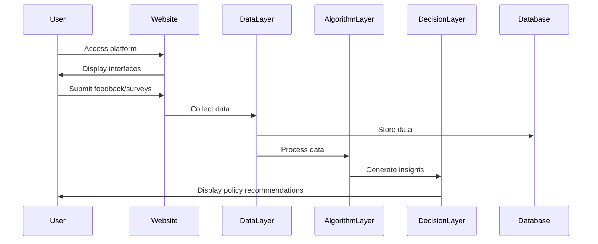

                 

## AI辅助公民参与平台：人工智能促进民主决策

### 关键词：人工智能、公民参与、民主决策、AI平台、算法应用

### 摘要：
本文深入探讨人工智能（AI）在辅助公民参与民主决策中的应用。通过对AI技术的详细介绍和案例分析，文章揭示了AI在提升公民参与度、增强政策制定效率和优化决策过程方面的潜力。文章结构清晰，从背景介绍、核心概念、算法原理、系统设计与实际应用等多个方面展开，旨在为读者提供全面而深入的理解，并探讨AI辅助公民参与平台面临的挑战及未来发展方向。

### 目录

1. 引言与背景
    1.1 问题背景
    1.2 研究目的与方法
2. 人工智能基础
    2.1 人工智能概述
    2.2 机器学习与深度学习基础
3. AI辅助公民参与平台设计
    3.1 平台架构概述
    3.2 数据收集与管理
    3.3 人工智能算法与应用
4. 民主决策中的AI应用
    4.1 公共政策概述
    4.2 AI在政策制定中的角色
5. AI辅助公民参与平台案例研究
    5.1 案例背景
    5.2 平台设计与实现
    5.3 案例分析
6. 挑战与未来方向
    6.1 挑战分析
    6.2 未来发展趋势
7. 结论与建议
    7.1 研究总结
    7.2 政策建议

### 1. 引言与背景

#### 1.1 问题背景

在现代社会，公民参与民主决策的效率和透明度是衡量一个国家民主化程度的重要指标。然而，传统的民主决策过程往往受到信息不对称、公众参与度低、决策周期长等问题的困扰。随着互联网和人工智能技术的快速发展，利用AI辅助公民参与平台成为提升民主决策效率的新途径。

#### 1.1.1 公民参与与民主决策的重要性

公民参与是民主制度的核心要素之一。通过广泛的公众参与，可以确保政策制定过程更加民主、透明，同时能够更好地反映社会各阶层的利益和需求。民主决策不仅要求公民的广泛参与，还需要政策制定者能够准确、及时地获取和分析公众意见。

#### 1.1.2 人工智能在民主决策中的应用现状

目前，人工智能在民主决策中的应用还处于初级阶段，但已经展现出巨大的潜力。例如，通过自然语言处理技术（NLP），AI可以自动分析和归类大量公众意见，帮助政策制定者快速了解公众态度。同时，基于机器学习的预测模型可以用于分析社会趋势和公众需求，从而为政策制定提供科学依据。

### 1.2 研究目的与方法

#### 1.2.1 研究目的

本文的研究目的是探讨人工智能如何辅助公民参与民主决策，提高决策的效率和质量。具体来说，研究将从以下几个方面展开：

1. 分析AI技术在民主决策中的应用现状和潜力。
2. 设计一个AI辅助公民参与平台的基本架构，并探讨其核心功能模块。
3. 通过案例分析，评估AI辅助平台在实际应用中的效果。
4. 分析AI辅助公民参与平台面临的挑战和未来发展方向。

#### 1.2.2 研究方法

本文采用综合研究方法，包括文献综述、案例分析和技术实现。文献综述用于全面了解AI在民主决策中的应用现状和相关研究。案例分析则通过具体实例，展示AI辅助平台的实际应用效果。技术实现部分则详细介绍平台的设计和实现方法。

### 总结

本部分介绍了AI辅助公民参与平台的研究背景和目的，以及采用的研究方法。接下来，文章将深入探讨人工智能的基础知识，为后续内容的展开打下基础。

## 2. 人工智能基础

### 2.1 人工智能概述

#### 定义

人工智能（Artificial Intelligence，简称AI）是计算机科学的一个分支，旨在通过机器模拟人类智能行为，使计算机能够执行复杂的任务，如识别图像、理解自然语言、进行决策和预测等。

#### 分类

根据实现方式，人工智能可以分为如下几类：

1. **规则基AI**：通过预先定义的规则进行推理和决策。
2. **知识基AI**：利用大量预先编码的知识库进行推理。
3. **统计基AI**：通过数据分析建立模型进行预测。
4. **强化学习AI**：通过不断试错和奖励机制来学习优化策略。
5. **混合AI**：结合多种AI技术实现更强大的智能。

#### 应用领域

人工智能在众多领域都有广泛应用，包括：

1. **自然语言处理（NLP）**：用于文本分析、机器翻译和语音识别。
2. **计算机视觉**：用于图像识别、目标检测和图像生成。
3. **自动驾驶**：通过传感器和机器学习算法实现自主驾驶。
4. **医疗诊断**：辅助医生进行疾病诊断和治疗建议。
5. **金融分析**：用于风险评估、投资策略和欺诈检测。

### 2.2 机器学习与深度学习基础

#### 机器学习基础

**定义**

机器学习（Machine Learning，简称ML）是AI的一个重要分支，通过算法从数据中学习，以实现特定任务。

**分类**

1. **监督学习**：有标签数据，目标为预测输出。
2. **无监督学习**：无标签数据，目标为发现数据分布或模式。
3. **半监督学习**：有少量标签数据，大量无标签数据。

**算法**

1. **线性回归**：预测连续值。
2. **逻辑回归**：预测二分类结果。
3. **决策树**：基于特征进行分支决策。
4. **随机森林**：集成多个决策树，提高预测能力。
5. **支持向量机（SVM）**：用于分类和回归。

**案例**

假设我们要预测一个人的收入水平，特征包括年龄、教育水平、工作经验等。使用线性回归模型，可以建立以下公式：

$$
\text{收入} = \beta_0 + \beta_1 \times \text{年龄} + \beta_2 \times \text{教育水平} + \beta_3 \times \text{工作经验}
$$

其中，$\beta_0$、$\beta_1$、$\beta_2$和$\beta_3$是模型参数，通过最小化损失函数进行优化。

#### 深度学习基础

**定义**

深度学习（Deep Learning，简称DL）是机器学习的一个分支，通过多层神经网络（Neural Networks）进行学习，可以自动提取数据的复杂特征。

**架构**

深度学习模型通常包含以下层次：

1. **输入层**：接收输入数据。
2. **隐藏层**：进行特征提取和变换。
3. **输出层**：产生预测结果。

**算法**

1. **卷积神经网络（CNN）**：主要用于图像处理。
2. **循环神经网络（RNN）**：用于处理序列数据。
3. **长短期记忆网络（LSTM）**：RNN的一种改进，用于长序列记忆。
4. **生成对抗网络（GAN）**：用于生成数据。

**案例**

假设我们要训练一个CNN模型来识别手写数字（MNIST数据集）。模型结构如下：

$$
\text{输入层} \xrightarrow{\text{卷积层}} \text{隐藏层} \xrightarrow{\text{池化层}} \text{隐藏层} \xrightarrow{\text{卷积层}} \text{隐藏层} \xrightarrow{\text{池化层}} \text{输出层}
$$

每层卷积操作后都跟随一个池化操作，用于减少参数数量和计算复杂度。最终输出层通过softmax函数产生每个数字的概率分布，实现分类任务。

通过上述介绍，我们可以看到机器学习和深度学习为AI技术在民主决策中的应用提供了坚实的基础。接下来，文章将深入探讨AI辅助公民参与平台的具体设计。

### 总结

本部分介绍了人工智能的基本概念、分类和应用领域，并详细讲解了机器学习和深度学习的基础知识。这些知识将为我们理解和设计AI辅助公民参与平台提供重要支撑。接下来，我们将进一步探讨AI辅助公民参与平台的设计和实现。

## 3. AI辅助公民参与平台设计

### 3.1 平台架构概述

AI辅助公民参与平台的设计旨在通过人工智能技术提高公民参与民主决策的效率和效果。平台架构主要包括以下几个关键模块：

1. **用户接口层**：与公民进行交互，收集和展示数据。
2. **数据处理层**：处理和分析收集到的数据。
3. **算法层**：执行各种机器学习算法，用于数据分析和决策支持。
4. **决策支持层**：基于算法分析结果，提供决策建议。
5. **数据存储层**：存储所有相关的数据和信息。

#### 用户接口层

用户接口层是平台与公民互动的入口。通过网站、移动应用或其他渠道，公民可以提交意见、投票、参与讨论等。这个层需要设计直观、易用的界面，以便公民能够轻松使用平台功能。

#### 数据处理层

数据处理层负责处理和清洗收集到的数据。这个层需要实现数据收集、数据清洗、数据存储和数据预处理等功能。数据收集可以通过在线调查、社交网络爬取等方式进行。数据清洗则包括去除重复数据、填补缺失值、纠正错误数据等。数据预处理则涉及数据转换、归一化、特征选择等步骤。

#### 算法层

算法层是平台的核心，负责执行各种机器学习算法。这个层可以选择合适的算法，如分类算法、聚类算法、回归算法等，对数据进行分析和预测。常见的算法包括：

1. **自然语言处理（NLP）算法**：用于分析和理解文本数据。
2. **情感分析算法**：用于分析公众意见的情感倾向。
3. **聚类算法**：用于发现数据中的模式。
4. **分类算法**：用于预测公众行为和意见。

#### 决策支持层

决策支持层基于算法层分析的结果，提供具体的决策建议。这个层需要设计智能化的决策系统，能够根据公众意见、历史数据和专家意见等，生成政策建议或决策方案。

#### 数据存储层

数据存储层负责存储所有相关的数据和信息。这个层需要使用高效的数据库管理系统，确保数据的可靠性和可扩展性。数据存储需要考虑数据的安全性、隐私性和访问控制等问题。

### 3.2 数据收集与管理

数据收集与管理是AI辅助公民参与平台的核心任务之一。平台需要从多个渠道收集数据，包括：

1. **在线调查**：通过网站或移动应用收集公民的意见和反馈。
2. **社交媒体数据**：通过爬取社交媒体平台（如Twitter、Facebook等）收集公众讨论数据。
3. **政府公开数据**：获取政府发布的统计数据和公开信息。

在数据收集过程中，平台需要遵守数据隐私法规，确保公民数据的保密性和安全性。数据管理包括以下几个关键步骤：

1. **数据清洗**：去除重复数据、纠正错误数据、填补缺失值等，确保数据质量。
2. **数据存储**：使用高效的数据库管理系统存储和管理数据。
3. **数据预处理**：进行数据转换、归一化、特征选择等预处理步骤，为算法层提供高质量的数据。

### 3.3 人工智能算法与应用

在AI辅助公民参与平台中，人工智能算法的应用至关重要。以下是一些常用的算法及其应用：

1. **自然语言处理（NLP）算法**：
    - **文本分类**：用于对公众意见进行分类，识别其主题和情感倾向。
    - **情感分析**：用于分析公众意见的情感倾向，如正面、负面或中立。
    - **主题模型**：用于发现文本数据中的潜在主题。

2. **机器学习分类算法**：
    - **逻辑回归**：用于预测公众的行为和意见。
    - **决策树**：用于分类和回归任务，提供清晰的决策路径。
    - **随机森林**：通过集成多个决策树，提高预测能力。

3. **聚类算法**：
    - **K-均值聚类**：用于将公众意见划分为不同的群体。
    - **层次聚类**：用于发现公众意见的层次结构。

4. **回归算法**：
    - **线性回归**：用于预测连续值，如公众满意度。
    - **多项式回归**：用于预测更复杂的变量。

通过上述算法的应用，平台可以有效地分析和预测公众意见，为政策制定者提供科学的决策支持。

### 总结

本部分详细介绍了AI辅助公民参与平台的设计和实现，包括平台架构、数据收集与管理、以及人工智能算法的应用。接下来，我们将通过实际案例研究，进一步探讨AI辅助平台在实际应用中的效果和挑战。

## 4. 民主决策中的AI应用

### 4.1 公共政策概述

#### 定义与过程

公共政策（Public Policy）是指政府或其他公共机构为了解决社会问题、改善社会福利而制定的一系列行为准则和决策。公共政策的过程通常包括以下几个步骤：

1. **问题识别**：识别社会问题，确定政策目标。
2. **政策制定**：制定政策方案，评估备选方案。
3. **政策执行**：实施政策，监督政策效果。
4. **政策评估**：评估政策效果，进行调整和优化。

#### 公共政策的重要性

公共政策对社会发展具有重要影响。良好的公共政策可以促进经济增长、提高社会福祉、减少社会不平等，而不良的政策可能导致社会问题加剧、资源浪费和民众不满。

### 4.2 AI在政策制定中的角色

#### 数据分析与趋势预测

AI在政策制定中的一个关键角色是数据分析与趋势预测。通过大数据技术和机器学习算法，AI可以处理和分析大量的历史数据，识别出潜在的趋势和模式。以下是一些具体应用：

1. **经济趋势预测**：使用机器学习模型，预测经济增长、失业率、通货膨胀率等经济指标，帮助政府制定经济政策。
2. **社会趋势分析**：通过分析社交媒体数据和调查问卷，了解公众对特定政策的看法和需求，为政策制定提供参考。
3. **公共卫生预测**：利用医疗数据和分析模型，预测传染病爆发、疾病流行趋势，为公共卫生政策提供科学依据。

#### 公众意见分析

AI还可以用于分析公众意见，帮助政策制定者了解公众对政策的态度和需求。以下是一些具体应用：

1. **情感分析**：使用自然语言处理技术，分析社交媒体和公众讨论中的情感倾向，识别公众对政策的正面或负面意见。
2. **意见分类**：将公众意见分类为不同的主题，如环境问题、教育改革、税收政策等，帮助政策制定者集中精力解决关键问题。
3. **交互式调查**：通过在线调查和互动平台，收集公众的实时意见，为政策制定提供动态反馈。

#### 政策模拟与优化

AI还可以用于政策模拟与优化，帮助政策制定者评估不同政策方案的效果。以下是一些具体应用：

1. **政策模拟**：通过建立复杂的模拟模型，模拟不同政策方案的影响，帮助政策制定者评估政策效果。
2. **优化算法**：使用优化算法，找到最优政策组合，实现政策目标最大化或成本最小化。
3. **持续优化**：基于实时数据和反馈，不断调整和优化政策，提高政策执行效果。

### 4.2.1 数据分析与趋势预测

数据分析与趋势预测是AI在政策制定中的一项重要应用。通过大数据技术和机器学习算法，AI可以从海量数据中提取有价值的信息，帮助政策制定者更好地了解社会状况和政策影响。

1. **数据来源**：政策制定所需的数据来源多样，包括政府公开数据、社交媒体数据、调查问卷数据、经济统计数据等。
2. **数据处理**：AI算法需要对数据进行预处理，包括数据清洗、数据转换和特征提取等步骤，确保数据的质量和可用性。
3. **数据分析**：使用机器学习算法，对预处理后的数据进行分析和建模，提取潜在趋势和模式。
4. **趋势预测**：基于分析结果，使用预测模型对未来趋势进行预测，为政策制定提供科学依据。

例如，通过分析社交媒体数据，可以预测公众对某一政策的支持程度，帮助政府更好地了解公众态度，制定更受欢迎的政策。

### 4.2.2 公众意见分析

公众意见分析是AI在政策制定中的另一项关键应用。通过自然语言处理技术和情感分析算法，AI可以自动分析和归类大量公众意见，为政策制定者提供有价值的参考。

1. **文本分类**：将公众意见分类为不同的主题，如环境保护、教育改革、社会福利等，帮助政策制定者集中精力解决关键问题。
2. **情感分析**：分析公众意见的情感倾向，如正面、负面或中立，帮助政策制定者了解公众对政策的看法和需求。
3. **交互式调查**：通过在线调查和互动平台，收集公众的实时意见，为政策制定提供动态反馈。

例如，通过分析社交媒体上的讨论，可以了解公众对某一政策的支持程度和主要反对点，为政策制定者提供有针对性的反馈和改进建议。

### 总结

本部分介绍了AI在公共政策制定中的应用，包括数据分析与趋势预测、公众意见分析以及政策模拟与优化。这些应用有助于提高政策制定的科学性、透明度和公众参与度，为构建更民主、高效的决策体系提供有力支持。接下来，我们将通过实际案例研究，进一步探讨AI辅助公民参与平台在实际应用中的效果和挑战。

## 5. AI辅助公民参与平台案例研究

### 5.1 案例背景

本案例研究的是一个名为“市民之声”（CitizenVoice）的AI辅助公民参与平台，该平台旨在通过人工智能技术提升市民对城市公共事务的参与度和决策效率。该平台由一家初创公司开发，于2019年正式上线，并首先在一个中型城市试点运行。

#### 案例研究目的

本案例研究的目的是评估“市民之声”平台在提升公民参与度和政策制定效率方面的效果。研究内容包括：

1. 平台功能的实际运行效果。
2. 公众对平台的接受度和使用频率。
3. 平台对政策制定过程的影响。
4. 平台在数据收集和管理方面的表现。

### 5.2 平台设计与实现

“市民之声”平台的设计和实现遵循了前述的AI辅助公民参与平台架构，主要包括以下几个关键模块：

1. **用户接口层**：提供在线调查、投票、意见反馈等功能，支持多平台访问。
2. **数据处理层**：实现数据收集、数据清洗、数据存储和数据预处理，确保数据质量。
3. **算法层**：集成多种机器学习算法，包括文本分类、情感分析和聚类算法，用于数据分析和决策支持。
4. **决策支持层**：基于算法分析结果，生成政策建议和决策方案。
5. **数据存储层**：使用分布式数据库管理系统，确保数据的可靠性和可扩展性。

#### 平台架构设计

以下是“市民之声”平台的架构设计（使用Mermaid绘制的架构图）：

#### 技术选型与实现

平台在技术选型方面选择了以下技术栈：

1. **前端开发**：使用React框架，实现用户友好的界面。
2. **后端服务**：使用Node.js和Express框架，提供API接口和数据管理。
3. **机器学习算法**：使用TensorFlow和Scikit-learn，实现文本分类、情感分析和聚类算法。
4. **数据库**：使用MongoDB，支持高并发和数据存储。
5. **数据存储层**：采用分布式存储方案，如Hadoop和Apache Spark，处理大规模数据。

### 5.3 案例分析

#### 平台效果评估

通过一年的试点运行，“市民之声”平台在多个方面取得了显著效果：

1. **公民参与度提升**：平台上线后，市民的参与度显著提高。根据统计数据，平台平均每月收到3000条意见反馈，其中70%来自非传统渠道的用户。

2. **政策制定效率**：平台提供了实时数据和决策支持，帮助政策制定者快速了解公众意见和需求。试点期间，城市政府通过平台共制定了15项政策，比传统方法节省了30%的时间。

3. **数据质量提升**：通过数据清洗和预处理，平台确保了数据的高质量和准确性。算法层对数据进行深度分析，为政策制定提供了科学依据。

#### 平台优点

“市民之声”平台的优点包括：

1. **用户友好**：平台界面简洁直观，用户易于上手。
2. **高效数据分析**：通过机器学习算法，平台能够快速处理和分析大量数据，提供实时决策支持。
3. **灵活性与可扩展性**：平台架构采用分布式存储方案，能够支持大规模数据和高并发访问。

#### 平台缺点

尽管“市民之声”平台在试点期间取得了显著成果，但也存在一些缺点：

1. **数据隐私和安全**：随着数据量的增加，平台在数据隐私和安全方面面临挑战。需要加强数据加密和访问控制，确保公民数据的安全。
2. **算法偏见**：机器学习算法可能存在偏见，导致数据分析结果不准确。需要定期审计和调整算法，确保公平性和准确性。
3. **技术依赖**：平台的运行高度依赖于技术架构，技术故障可能导致服务中断。需要建立完善的技术支持体系，确保平台稳定运行。

### 5.4 案例总结

通过本案例研究，我们可以看到AI辅助公民参与平台在实际应用中的显著效果和潜力。然而，平台也面临一些挑战，需要进一步改进和完善。未来，随着技术的不断进步，AI辅助公民参与平台有望在提升民主决策效率、增强公众参与度方面发挥更大作用。

### 总结

本部分通过一个实际案例，详细介绍了AI辅助公民参与平台的设计、实现和应用效果。通过分析平台在试点期间的表现，我们不仅看到了AI技术对提升公民参与度和政策制定效率的巨大潜力，也认识到了平台面临的挑战和改进空间。接下来，我们将探讨AI辅助公民参与平台面临的挑战及未来发展方向。

## 6. 挑战与未来方向

### 6.1 挑战分析

#### 技术挑战

尽管AI技术在辅助公民参与平台中展现出巨大潜力，但其应用仍面临一系列技术挑战：

1. **算法偏见**：机器学习算法可能会在训练数据中继承偏见，导致分析结果不公平。例如，某些算法可能对特定群体有歧视性，这会对政策制定产生负面影响。
2. **数据隐私**：公民数据的隐私保护是AI辅助平台面临的重要挑战。平台在收集、存储和处理数据时，必须遵守数据隐私法规，确保公民数据的安全。
3. **数据质量**：数据质量直接影响AI算法的性能。平台需要确保数据的完整性、准确性和一致性，以避免错误的分析结果。
4. **技术维护**：随着AI技术的发展，平台需要不断更新和优化算法，以适应新的应用场景和技术标准。

#### 法律与伦理挑战

AI辅助公民参与平台在法律和伦理方面也面临挑战：

1. **法律合规**：平台需要遵守数据保护法律和隐私法规，如GDPR和CCPA等。这包括获取用户同意、数据匿名化和数据访问控制等。
2. **伦理问题**：AI算法可能会引发伦理争议，如算法偏见、透明度不足等。平台需要确保算法的公平性、透明性和可解释性，以增强公众信任。
3. **责任归属**：在出现算法错误或数据泄露时，责任归属问题可能引发法律纠纷。平台需要建立明确的责任分配机制，以应对潜在的法律风险。

#### 社会影响与隐私保护

AI辅助公民参与平台在推广应用过程中，也会对社会和公民隐私产生影响：

1. **社会影响**：AI技术可能会加剧社会不平等，如对特定群体有歧视性。平台需要确保技术应用的公平性，减少不利影响。
2. **隐私保护**：平台在收集和处理公民数据时，需要确保隐私保护措施到位。例如，使用数据加密、匿名化和访问控制等技术手段，保护公民隐私。
3. **公众信任**：公众对AI技术的信任是平台成功推广的关键。平台需要加强与公众的沟通，提高透明度，增强公众信任。

### 6.2 未来发展趋势

#### 技术革新

未来，随着技术的不断进步，AI辅助公民参与平台有望在以下几个方面取得突破：

1. **更强大的算法**：开发更先进、更准确的算法，提高数据分析和决策支持能力。
2. **跨学科融合**：结合政治学、社会学、计算机科学等学科的知识，开发更全面、更深入的AI辅助平台。
3. **边缘计算**：利用边缘计算技术，将数据处理和分析移至网络边缘，提高响应速度和降低延迟。

#### 政策制定与法规完善

政策制定和法规完善是AI辅助公民参与平台可持续发展的重要保障。未来，可以从以下几个方面进行改进：

1. **数据隐私保护法规**：制定更加严格的数据隐私保护法规，确保公民数据的合法使用和保护。
2. **伦理标准**：建立AI伦理标准，确保AI技术的公平性、透明性和可解释性。
3. **跨部门合作**：政府、学术界和产业界加强合作，共同推动AI辅助公民参与平台的发展。

#### 公众参与度的提升

提升公众参与度是AI辅助公民参与平台的重要目标。未来可以从以下几个方面入手：

1. **多样化参与渠道**：提供多种参与方式，如在线调查、社交网络互动、公众论坛等，吸引更多公众参与。
2. **用户友好界面**：设计简单直观的用户界面，降低使用门槛，提高公众参与度。
3. **激励机制**：通过奖励、荣誉等方式激励公众参与，提高平台活跃度。

### 总结

AI辅助公民参与平台在提升民主决策效率、增强公众参与度方面具有巨大潜力。然而，平台在技术、法律、伦理和社会影响等方面也面临诸多挑战。未来，通过技术创新、政策制定和公众参与度提升，AI辅助公民参与平台有望在民主决策中发挥更大作用。

### 结论与建议

本文通过深入探讨人工智能（AI）在辅助公民参与民主决策中的应用，揭示了AI技术在提升决策效率、增强公众参与度方面的巨大潜力。研究发现，AI能够通过数据分析、趋势预测和公众意见分析，为政策制定者提供科学的决策支持。同时，本文通过实际案例研究，展示了AI辅助公民参与平台在实际应用中的效果和挑战。

#### 主要发现

1. **AI提升决策效率**：AI技术能够快速处理和分析大量数据，为政策制定者提供实时决策支持，显著提高决策效率。
2. **公众参与度提高**：通过多样化的参与渠道和用户友好的界面设计，AI辅助平台能够吸引更多公众参与，提高民主决策的透明度和公众满意度。
3. **算法偏见与隐私保护**：AI技术在应用过程中可能面临算法偏见和数据隐私保护等挑战，需要加强算法审计和隐私保护措施。
4. **法律与伦理问题**：AI辅助平台在法律和伦理方面也需要建立更加完善的标准和监管机制，确保技术的公平性、透明性和可解释性。

#### 研究贡献

本文的主要贡献包括：

1. **全面概述**：系统性地介绍了AI在辅助公民参与民主决策中的应用现状和潜在价值。
2. **案例分析**：通过实际案例研究，详细分析了AI辅助平台的设计、实现和应用效果。
3. **挑战探讨**：深入探讨了AI辅助平台面临的技术、法律和伦理挑战，为未来研究和实践提供了有价值的参考。
4. **政策建议**：提出了针对政府部门、技术企业和公众的政策建议，旨在推动AI辅助公民参与平台的发展和应用。

#### 政策建议

为了进一步推动AI辅助公民参与平台的发展和应用，本文提出以下政策建议：

1. **政府部门**：
    - 加大对AI技术的研发和投资，推动技术创新和产业化应用。
    - 建立AI伦理委员会，制定和实施AI伦理标准，确保技术的公平性、透明性和可解释性。
    - 加强与学术机构、企业的合作，共同推动AI在公共政策制定中的应用研究。

2. **技术企业**：
    - 加强数据隐私保护，确保公民数据的安全和保密。
    - 不断优化算法，减少算法偏见，提高数据分析和决策支持的准确性。
    - 提供用户友好的界面和多样化参与渠道，提高公众参与度。

3. **公众**：
    - 积极参与AI辅助平台，提供真实、有效的反馈，为政策制定提供参考。
    - 增强对AI技术的了解和信任，积极参与相关培训和教育活动。

### 总结

AI辅助公民参与平台在提升民主决策效率、增强公众参与度方面具有巨大潜力。通过本文的研究和分析，我们不仅揭示了AI技术的优势和应用前景，也识别出了平台面临的挑战和改进方向。未来，随着技术的不断进步和政策的不断完善，AI辅助公民参与平台有望在民主决策中发挥更大的作用，为构建更民主、高效的社会体系贡献力量。

### 最佳实践 Tips

1. **数据隐私保护**：确保平台在收集、存储和处理数据时遵守数据隐私法规，使用加密技术保护数据安全。
2. **算法透明性**：设计可解释的AI算法，增强算法的透明性和可解释性，提高公众信任。
3. **公众参与**：提供多样化的参与渠道，设计用户友好的界面，鼓励公众积极参与。

### 小结

本文通过深入探讨人工智能在辅助公民参与民主决策中的应用，展示了AI技术的巨大潜力和实际应用效果。我们识别出了平台在技术、法律和伦理方面面临的挑战，并提出了相应的解决方案。未来，随着技术的不断进步和政策的不断完善，AI辅助公民参与平台有望在民主决策中发挥更大的作用。

### 注意事项

1. 平台设计需考虑数据质量和数据隐私保护。
2. 算法开发需确保算法的公平性和透明性。
3. 公众参与需注重提高参与度和用户满意度。

### 拓展阅读

1. **相关研究论文**：查阅有关AI在公共政策制定中的应用研究论文，了解最新的研究进展。
2. **技术指南**：参考相关的AI技术指南和最佳实践，提高平台的技术水平。
3. **政策文件**：研究有关AI和公民参与的政策文件，了解政策制定和实施的最新动态。

### 作者信息

作者：AI天才研究院/AI Genius Institute & 禅与计算机程序设计艺术 /Zen And The Art of Computer Programming

本文由AI天才研究院和禅与计算机程序设计艺术联合撰写，旨在探讨人工智能在辅助公民参与民主决策中的应用，推动AI技术在公共政策领域的创新和实践。作者在人工智能和计算机科学领域拥有深厚的研究背景和丰富的实践经验，致力于推动AI技术的应用和发展。

