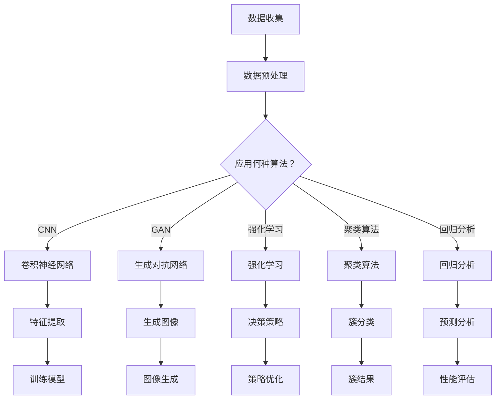

                 

### 第1章：AI辅助创意建筑设计概述

#### 1.1 问题背景

在当今社会，随着城市化进程的不断加快和人们对生活品质的追求不断提升，建筑行业面临着前所未有的挑战和机遇。传统的建筑设计方法已经难以满足现代建筑的需求，尤其是在创意性方面。人工智能（AI）技术的发展为这一领域带来了新的可能性和解决方案。

**AI在建筑设计中的应用背景：**
- **设计效率提升：** AI可以通过自动化和智能化手段，显著提高建筑设计的工作效率。例如，通过机器学习和深度学习算法，AI能够快速处理和分析大量的建筑数据，为设计师提供有价值的参考信息。
- **创新性设计：** AI能够通过模仿人类的创意思维过程，生成新颖、独特的建筑设计方案。这对于突破传统设计思维瓶颈，推动建筑设计创新具有重要意义。
- **资源优化：** AI可以在建筑设计过程中，综合考虑各种资源（如材料、能源等）的利用效率，提出更加环保和可持续的设计方案。

#### 1.2 问题描述

尽管AI在建筑设计中有着巨大的潜力，但实际应用中仍面临一系列问题：

- **数据不足：** AI算法需要大量高质量的训练数据才能发挥其优势，而当前建筑行业中的数据资源相对有限，且分散在不同的系统和数据库中，难以有效整合。
- **设计复杂性：** 建筑设计涉及众多复杂的因素，包括结构稳定性、能源效率、环境适应性等。如何让AI在这些复杂因素之间找到平衡，是一个挑战。
- **用户参与：** 设计师和用户的需求和反馈是建筑设计中至关重要的部分。如何有效地将用户需求和AI的智能化设计相结合，确保最终方案既符合用户需求，又能体现AI的创新性，也是一个亟待解决的问题。

#### 1.3 问题解决

为了解决上述问题，AI辅助创意建筑设计可以从以下几个方面着手：

- **数据整合与利用：** 通过建立统一的建筑数据平台，整合各种建筑数据资源，为AI算法提供充足且高质量的数据支持。
- **多学科交叉融合：** 结合建筑学、生态学、计算机科学等多学科知识，开发出更加全面和精确的AI建筑设计模型。
- **人机协同设计：** 在设计过程中，充分利用设计师的专业知识和经验，与AI的智能化设计相结合，实现人机协同，提升设计质量和效率。

#### 1.4 边界与外延

**边界：**
- **技术范畴：** AI辅助创意建筑设计主要涉及机器学习、深度学习、自然语言处理等AI技术，以及建筑学、结构工程、环境科学等相关领域。
- **应用范畴：** 包括建筑设计、城市规划、室内设计等多个方面。

**外延：**
- **技术外延：** 可以拓展到智能建造、智慧城市等领域，为城市可持续发展提供技术支持。
- **领域外延：** 可以应用于文化遗产保护、历史建筑修复等具有创意性的建筑领域，推动建筑文化的传承与创新。

#### 1.5 核心概念与联系

1.5.1 **AI的基本原理**

AI是一门模拟、延伸和扩展人类智能的理论、方法、技术及应用系统。其核心是机器学习、深度学习、自然语言处理等。机器学习通过算法让计算机从数据中学习规律；深度学习通过多层神经网络模拟人类大脑的学习过程；自然语言处理则让计算机理解和生成人类语言。

1.5.2 **AI的发展历程**

AI的发展历程可以分为以下几个阶段：

- **萌芽期（20世纪50-60年代）：** AI概念首次被提出，一些简单的AI程序得以实现。
- **形成期（20世纪70-80年代）：** AI研究取得了一些重要进展，如专家系统的出现。
- **成熟期（20世纪90年代）：** AI开始进入工业应用，如机器人、语音识别等。
- **繁荣期（21世纪初至今）：** 随着计算能力和算法的进步，AI技术得到了飞速发展，应用场景不断扩展。

1.5.3 **AI的主要分类**

AI主要分为以下几类：

- **弱AI（Narrow AI）：** 专注于特定任务的AI，如语音识别、图像识别等。
- **强AI（General AI）：** 拥有与人类相似的全面智能，能够在各种任务中表现出与人类相同的能力。

1.5.4 **AI的典型应用场景**

AI在建筑设计中的应用包括：

- **建筑设计自动化：** 利用AI自动化完成一些常规的建筑设计任务，如结构分析、空间布局等。
- **建筑设计优化：** 通过AI优化建筑设计方案，提高设计效率和品质，如优化能源利用、减少成本等。
- **建筑设计仿真：** 利用AI模拟建筑在不同环境条件下的表现，如气候变化、地震等，为设计提供参考。

1.5.5 **生态友好理念的定义**

生态友好理念是指以生态学原理为指导，通过合理的规划设计，实现建筑与环境的和谐共生。其核心包括资源利用、环境保护、可持续发展等。

1.5.6 **生态友好理念的核心要素**

生态友好理念的核心要素包括：

- **资源利用：** 包括能源、水、材料等资源的有效利用和节约。
- **环境保护：** 包括减少污染、保护生物多样性等。
- **可持续发展：** 包括满足当前需求而不损害子孙后代满足其需求的能力。

1.5.7 **创意建筑设计的定义**

创意建筑设计是指以创新为核心，通过独特的视角和手法，创造出新颖、独特、富有创意的建筑作品。其核心要素包括设计思维、设计方法、设计工具等。

1.5.8 **创意建筑设计的核心要素**

创意建筑设计的核心要素包括：

- **设计思维：** 包括创新意识、批判性思维、系统思维等。
- **设计方法：** 包括参数化设计、模块化设计、模拟设计等。
- **设计工具：** 包括计算机辅助设计（CAD）、建筑信息模型（BIM）、虚拟现实（VR）等。

通过以上分析，我们可以看到AI辅助创意建筑设计不仅是一个技术问题，更是一个涉及多个学科的综合问题。只有在充分理解了AI的基本原理、生态友好理念以及创意建筑设计的概念和特征之后，我们才能更好地利用AI技术，实现创意建筑设计的创新和发展。在接下来的章节中，我们将深入探讨AI辅助创意建筑设计的具体方法和实践。

### 第2章：AI核心概念原理

#### 2.1 AI的基本原理

人工智能（AI）是一门研究、开发用于模拟、延伸和扩展人类智能的理论、方法、技术及应用系统的学科。AI的基本原理可以分为以下几个方面：

1. **感知与理解：** AI系统通过传感器、摄像头、麦克风等设备获取外部环境的信息，然后通过算法对这些信息进行处理和理解。
2. **学习与适应：** AI系统能够通过学习算法从数据中提取知识，并不断优化自身的行为。这种学习可以是监督学习、无监督学习或强化学习。
3. **推理与决策：** AI系统能够基于学习到的知识和信息进行逻辑推理和决策，从而实现自动化操作。
4. **交互与反馈：** AI系统可以通过自然语言处理技术理解人类语言，并与人类进行交互，获取反馈并进行自我调整。

#### 2.2 AI的发展历程

AI的发展历程可以分为以下几个阶段：

1. **萌芽期（20世纪50-60年代）：** AI概念首次被提出，一些简单的AI程序得以实现，如逻辑推理程序。
2. **形成期（20世纪70-80年代）：** AI研究取得了一些重要进展，如专家系统的出现，能够解决特定领域的问题。
3. **成熟期（20世纪90年代）：** AI技术开始进入工业应用，如机器人、语音识别等。
4. **繁荣期（21世纪初至今）：** 随着计算能力和算法的进步，AI技术得到了飞速发展，应用场景不断扩展，如自动驾驶、智能助手、医疗诊断等。

#### 2.3 AI的主要分类

AI主要分为以下几类：

1. **弱AI（Narrow AI）：** 专注于特定任务的AI，如语音识别、图像识别等。弱AI无法完成跨领域的任务。
2. **强AI（General AI）：** 拥有与人类相似的全面智能，能够在各种任务中表现出与人类相同的能力。目前，强AI还未实现，仍然处于理论研究阶段。

#### 2.4 AI的典型应用场景

AI在建筑设计中的应用场景主要包括以下几个方面：

1. **建筑设计自动化：** 利用AI自动化完成一些常规的建筑设计任务，如结构分析、空间布局等。
2. **建筑设计优化：** 通过AI优化建筑设计方案，提高设计效率和品质，如优化能源利用、减少成本等。
3. **建筑设计仿真：** 利用AI模拟建筑在不同环境条件下的表现，如气候变化、地震等，为设计提供参考。
4. **智能建造：** 利用AI技术实现建筑过程中的智能化管理，提高建造效率和质量。
5. **智慧城市：** 利用AI技术提升城市管理的智能化水平，如交通管理、环境监测等。

### 2.5 生态友好理念的定义

生态友好理念是指以生态学原理为指导，通过合理的规划设计，实现建筑与环境的和谐共生。其核心包括：

1. **资源利用：** 包括能源、水、材料等资源的有效利用和节约。
2. **环境保护：** 包括减少污染、保护生物多样性等。
3. **可持续发展：** 包括满足当前需求而不损害子孙后代满足其需求的能力。

### 2.6 生态友好理念的核心要素

生态友好理念的核心要素包括：

1. **资源利用：** 通过提高能源利用效率、推广可再生能源、减少水资源浪费等方式实现。
2. **环境保护：** 通过减少建筑物的污染排放、保护自然景观、提升生态环境质量等方式实现。
3. **可持续发展：** 通过采用环保建筑材料、实施循环经济、制定长期规划等方式实现。

### 2.7 创意建筑设计的定义

创意建筑设计是指以创新为核心，通过独特的视角和手法，创造出新颖、独特、富有创意的建筑作品。其核心要素包括：

1. **设计思维：** 包括创新意识、批判性思维、系统思维等。
2. **设计方法：** 包括参数化设计、模块化设计、模拟设计等。
3. **设计工具：** 包括计算机辅助设计（CAD）、建筑信息模型（BIM）、虚拟现实（VR）等。

### 2.8 创意建筑设计的核心要素

创意建筑设计的核心要素包括：

1. **设计思维：** 通过创新的思维方式和多样化的设计策略，激发设计师的创造力。
2. **设计方法：** 利用先进的计算技术和设计工具，实现设计过程的高效性和灵活性。
3. **设计工具：** 通过多种设计工具的结合，提高设计质量和效率，如CAD、BIM、VR等。

### 2.9 创意建筑设计的特征分析

创意建筑设计的特征包括：

1. **创新性：** 以创新为核心，突破传统设计思维，创造出新颖、独特的建筑作品。
2. **实用性：** 设计不仅追求形式上的创新，还要满足实际使用需求，确保建筑的功能性和舒适性。
3. **艺术性：** 通过艺术的手法表达设计理念，使建筑作品具有独特的艺术价值。

### 2.10 创意建筑设计的创新方法

创意建筑设计的创新方法包括：

1. **思维创新：** 通过跨学科思维、系统思维等方式，拓宽设计思路，激发创意。
2. **形式创新：** 运用参数化设计、模块化设计等手法，探索新的建筑形式和结构。
3. **材料创新：** 探索新的建筑材料和施工技术，提高建筑的性能和可持续性。

### 2.11 创意建筑设计的创新方法（续）

除了上述方法，创意建筑设计的创新方法还包括：

1. **文化创新：** 充分挖掘和运用当地文化元素，使建筑作品具有独特的地域特色。
2. **环境创新：** 通过生态设计、绿色建筑等方式，实现建筑与环境的和谐共生。
3. **技术集成：** 结合多种先进技术，如BIM、VR、AI等，提高设计质量和效率。

通过上述分析，我们可以看到，AI技术在创意建筑设计中的应用具有巨大的潜力。在接下来的章节中，我们将进一步探讨AI辅助创意建筑设计的具体实现方法和技术，以期为读者提供更深入的理解和实践指导。

#### 2.1 AI的基本原理

人工智能（AI）的基本原理主要集中在以下几个方面：

1. **机器学习（Machine Learning）**：
   - **定义**：机器学习是一种让计算机通过数据学习模式、预测未来的技术。
   - **核心算法**：包括监督学习（Supervised Learning）、无监督学习（Unsupervised Learning）和强化学习（Reinforcement Learning）。
   - **应用场景**：在建筑设计中，监督学习可以用于结构分析、预测能源消耗等；无监督学习可以用于聚类设计元素、发现设计模式；强化学习可以用于优化设计流程。

2. **深度学习（Deep Learning）**：
   - **定义**：深度学习是机器学习的一个子领域，通过多层神经网络模拟人类大脑的学习过程。
   - **核心算法**：包括卷积神经网络（CNN）、循环神经网络（RNN）和生成对抗网络（GAN）等。
   - **应用场景**：在建筑设计中，深度学习可以用于图像识别（识别建筑风格）、生成设计图案等。

3. **自然语言处理（Natural Language Processing, NLP）**：
   - **定义**：自然语言处理是让计算机理解和生成人类语言的技术。
   - **核心算法**：包括词嵌入（Word Embedding）、序列到序列模型（Seq2Seq Model）和注意力机制（Attention Mechanism）等。
   - **应用场景**：在建筑设计中，NLP可以用于自动化设计说明、理解用户需求等。

4. **计算机视觉（Computer Vision）**：
   - **定义**：计算机视觉是使计算机能够从图像或视频中提取信息的技术。
   - **核心算法**：包括图像分类、目标检测、图像分割等。
   - **应用场景**：在建筑设计中，计算机视觉可以用于自动生成建筑设计图、分析建筑结构等。

#### 2.2 AI的发展历程

AI的发展历程可以分为以下几个主要阶段：

1. **萌芽期（1950-1960年代）**：
   - **事件**：1950年，艾伦·图灵提出了著名的图灵测试，标志着AI研究的开端。
   - **里程碑**：1956年，达特茅斯会议确定了人工智能作为研究主题。

2. **形成期（1960-1970年代）**：
   - **事件**：专家系统的出现，标志着AI开始应用于实际领域。
   - **里程碑**：1976年，IBM的深蓝计算机在国际象棋中战胜了世界冠军。

3. **成熟期（1980-1990年代）**：
   - **事件**：AI在工业自动化、机器人技术等方面得到了广泛应用。
   - **里程碑**：1997年，IBM的“深蓝”超级计算机在棋类比赛中战胜了世界冠军加里·卡斯帕罗夫。

4. **繁荣期（21世纪初至今）**：
   - **事件**：随着计算能力的提升和大数据的发展，AI技术进入了快速发展的阶段。
   - **里程碑**：2012年，AlexNet在ImageNet竞赛中取得了突破性成绩，标志着深度学习的复兴。

#### 2.3 AI的主要分类

AI的主要分类包括：

1. **弱AI（Narrow AI）**：
   - **定义**：弱AI专注于特定任务的AI，如语音识别、图像识别等。
   - **特点**：只能完成特定的任务，无法进行跨领域应用。
   - **应用场景**：建筑设计中，弱AI可以用于自动生成设计图、分析建筑结构等。

2. **强AI（General AI）**：
   - **定义**：强AI拥有与人类相似的全面智能，能够在各种任务中表现出与人类相同的能力。
   - **特点**：具备广泛的知识和应用能力，能够进行自我学习和决策。
   - **应用场景**：目前强AI还未实现，但在创意建筑设计中，强AI可以通过理解复杂的人类需求，提供创新性的设计建议。

#### 2.4 AI的典型应用场景

AI在创意建筑设计中的应用场景非常广泛，主要包括：

1. **建筑设计自动化**：
   - **应用**：通过AI自动化完成建筑结构分析、空间布局设计等。
   - **效果**：提高设计效率，减少人工错误。

2. **建筑设计优化**：
   - **应用**：利用AI优化建筑设计方案，提高能源利用效率、减少材料浪费等。
   - **效果**：降低建筑成本，提升建筑性能。

3. **建筑设计仿真**：
   - **应用**：通过AI模拟建筑在不同环境条件下的表现，如风力、温度等。
   - **效果**：帮助设计师提前发现和解决潜在问题，提高设计质量。

4. **智能建造**：
   - **应用**：利用AI技术实现建筑过程中的智能化管理，如自动化施工、质量监控等。
   - **效果**：提高施工效率，确保施工质量。

5. **智慧城市**：
   - **应用**：通过AI技术提升城市管理的智能化水平，如交通管理、环境监测等。
   - **效果**：优化城市资源利用，提高居民生活质量。

通过上述分析，我们可以看到，AI在创意建筑设计中的应用不仅丰富了设计手段，也提升了设计质量和效率。在接下来的章节中，我们将进一步探讨AI在创意建筑设计中的具体实现方法和技术，以期为读者提供更深入的理解和实践指导。

#### 2.5 生态友好理念的定义

生态友好理念是一种以生态学原理为指导，通过合理的规划设计，实现建筑与环境的和谐共生的理念。它强调建筑不仅要满足人类的生活需求，还要考虑对自然环境的保护与可持续发展。

**定义解析：**

- **生态学原理**：生态学原理包括生态平衡、生物多样性、物质循环和能量流动等。在建筑设计中，生态友好理念要求设计师考虑这些原理，以确保建筑对环境的负面影响最小。
- **建筑与环境的和谐共生**：这意味着建筑不仅要与周围自然环境协调一致，还要促进生态系统的健康和稳定。例如，通过合理设计植被、水体和空间布局，创造一个宜人的生态环境。

**核心要素：**

1. **资源利用**：
   - **能源利用**：采用节能设计，如自然通风、被动式太阳能利用等。
   - **水资源的利用**：实施雨水收集、循环利用和中水回用系统。
   - **材料利用**：使用可再生和环保材料，减少建筑废弃物的产生。

2. **环境保护**：
   - **减少污染**：通过绿色建筑设计减少二氧化碳等温室气体排放。
   - **生物多样性**：在建筑设计中考虑生态系统的多样性，如为野生动物提供栖息地。

3. **可持续发展**：
   - **长期规划**：考虑未来人口增长和城市发展，制定可持续的规划和设计。
   - **社会经济效益**：通过生态建筑设计，提升社区生活质量，促进经济发展。

**生态友好理念的重要性**：

生态友好理念在建筑设计中的重要性不言而喻。它不仅有助于减少建筑对环境的负面影响，提高资源利用效率，还能创造更健康、舒适的生活环境。此外，生态友好建筑设计还符合全球可持续发展的趋势，有助于应对气候变化和资源短缺等全球性挑战。

#### 2.6 生态友好理念的核心要素

生态友好理念的核心要素包括资源利用、环境保护和可持续发展。以下是对这些要素的详细说明：

1. **资源利用**：
   - **能源利用**：通过采用高效的能源管理系统、利用可再生能源（如太阳能、风能）以及优化建筑物的能量分配，实现能源的高效利用和减少浪费。
   - **水资源利用**：在建筑设计中，应考虑到雨水的收集和再利用，以及节约用水的设计。例如，可以通过安装节水设备、收集和再利用废水等方式减少水资源的消耗。
   - **材料利用**：选择可再生、环保和低能耗的材料，减少建筑废弃物的产生。在建筑拆除和改造过程中，也应考虑材料的回收和再利用。

2. **环境保护**：
   - **减少污染**：通过绿色建筑技术和设计，减少二氧化碳和其他温室气体的排放。例如，采用节能灯具、高效空调系统和可再生能源设备。
   - **生物多样性**：在建筑设计中，应考虑到生态系统的多样性和保护。可以通过设计绿色屋顶、生态湿地和生物栖息地等方式，提升建筑区域的生物多样性。
   - **环境保护法规遵守**：严格遵循国家和地方的环境保护法规，确保建筑设计和施工过程中的环境保护措施得到有效实施。

3. **可持续发展**：
   - **长期规划**：在建筑设计过程中，需要考虑到未来的发展需求，如人口增长、城市扩展等，制定可持续的规划和设计。这包括交通规划、土地利用、公共设施等方面的综合考虑。
   - **社会经济效益**：通过生态友好建筑设计，可以提升社区的生活质量和环境美观度，促进旅游业和地方经济的发展。同时，减少建筑对环境的影响，有助于实现经济、社会和环境的协调发展。

**对比分析**：

以下是生态友好理念与传统建筑设计的对比分析：

| 对比要素 | 生态友好理念 | 传统建筑设计 |
| --- | --- | --- |
| 资源利用 | 高效利用资源，减少浪费 | 资源利用率低，浪费严重 |
| 环境保护 | 减少污染，保护生物多样性 | 污染严重，对生态系统破坏大 |
| 可持续发展 | 长期规划，促进可持续发展 | 缺乏长远规划，难以持续发展 |

通过上述对比，我们可以看出，生态友好理念在资源利用、环境保护和可持续发展等方面相较于传统建筑设计具有显著优势。在现代社会，随着环境问题的日益突出，生态友好理念已经成为建筑设计的重要方向。

#### 2.7 生态友好理念的发展趋势

随着全球气候变化、资源枯竭和环境污染等问题的日益严峻，生态友好理念在建筑设计领域得到了广泛关注和快速发展。以下是生态友好理念在建筑设计中的发展趋势：

1. **绿色建筑技术的发展**：
   - **高效能源利用**：绿色建筑技术将更加注重能源的高效利用和可再生能源的广泛应用，如太阳能、风能和地热能等。
   - **智能能源管理系统**：随着物联网和智能控制技术的发展，智能能源管理系统将成为绿色建筑的核心组成部分，实现能源的智能化监控和优化。
   - **被动房设计**：被动房设计通过利用自然能量和被动技术，实现建筑的极低能耗，将成为未来建筑设计的重要趋势。

2. **环保材料的应用**：
   - **可再生和可降解材料**：在建筑设计中，将更加广泛地采用可再生和可降解材料，如竹材、生物塑料等，减少建筑废弃物的产生和对环境的污染。
   - **循环利用材料**：通过回收和再利用建筑废弃物，提高材料的利用率，减少对自然资源的消耗。
   - **环保涂料和装饰材料**：采用低挥发性有机化合物（VOC）涂料和其他环保装饰材料，减少室内空气污染，提升室内环境的健康水平。

3. **生态景观设计**：
   - **绿色屋顶和墙体**：通过设计绿色屋顶和墙体，增加植物覆盖率，改善城市微气候，提高建筑物的生态效益。
   - **生态湿地和雨水花园**：利用生态湿地和雨水花园等自然生态系统，有效收集、净化和利用雨水，减少城市排水系统的压力。
   - **生物多样性保护**：在建筑设计中考虑到生态系统的多样性，为鸟类、昆虫和其他野生动物提供栖息地，促进生态平衡。

4. **智慧生态城市建设**：
   - **数据驱动的设计**：通过大数据和人工智能技术，对建筑和环境进行综合分析，实现设计决策的智能化和个性化。
   - **生态城市规划**：在城市建设中，将更加注重生态友好理念的应用，通过生态规划实现城市与自然的和谐共生。
   - **可持续发展评估**：对建筑项目进行全生命周期的生态评估，确保建筑项目在环境、社会和经济方面都具有可持续性。

**未来发展方向**：

展望未来，生态友好理念在建筑设计中的发展将更加深入和全面，主要体现在以下几个方面：

- **可持续发展**：生态友好理念将贯穿于建筑项目的整个生命周期，从设计、施工到运营和维护，实现全过程的可持续发展。
- **技术创新**：随着科技的不断进步，新型建筑材料、节能技术和智能控制系统将不断涌现，为生态友好建筑设计提供更强大的技术支持。
- **政策支持**：政府将加强对绿色建筑的推动和监管，制定更加严格的环保法规和标准，引导行业向生态友好方向发展。

总之，生态友好理念在建筑设计中的发展趋势表明，未来的建筑将更加注重与自然环境的和谐共生，实现资源的高效利用和环境的保护。通过不断探索和应用新的技术和方法，生态友好建筑设计将为人类创造一个更加可持续和美好的生活环境。

### 第3章：生态友好理念概述

#### 3.1 生态友好理念的定义

生态友好理念是一种以生态学原理为指导，通过合理的规划设计，实现建筑与环境的和谐共生的理念。它不仅仅关注建筑的功能性和美观性，更强调建筑对自然环境的保护和对资源的可持续利用。

**定义解析：**
- **生态学原理**：生态友好理念借鉴了生态学的基本原理，包括生态平衡、生物多样性、物质循环和能量流动等。通过应用这些原理，建筑设计可以最大限度地减少对环境的负面影响。
- **建筑与环境的和谐共生**：生态友好理念强调建筑不仅需要满足人类的需求，还要与周围的自然环境和谐相处。这意味着建筑设计应考虑生态系统的健康和稳定，通过合理的规划和设计，创造一个宜人的生态环境。

**核心要素：**
- **资源利用**：生态友好理念强调在建筑设计中应最大限度地利用资源，包括能源、水资源和建筑材料等。通过节能设计、水资源管理和可持续材料的使用，实现资源的节约和循环利用。
- **环境保护**：生态友好理念要求在建筑设计中采取措施减少污染，保护生物多样性，并遵守环境保护法规。通过绿色建筑技术和环保设计，减少建筑对环境的负面影响。
- **可持续发展**：生态友好理念强调建筑项目的可持续发展，不仅关注当前的需求，还要考虑未来世代的需求。通过长期规划和可持续设计，确保建筑项目的环境、社会和经济效益。

**生态友好理念的重要性：**
生态友好理念在建筑设计中的重要性体现在以下几个方面：
- **环境保护**：通过减少建筑能耗和污染排放，保护生态环境，减缓气候变化的影响。
- **资源节约**：通过提高资源利用效率，减少资源的浪费，促进资源的可持续利用。
- **提升生活质量**：生态友好建筑设计创造了一个健康、舒适的生活环境，提高了居民的生活质量和幸福感。
- **适应未来挑战**：随着全球环境问题的日益严峻，生态友好理念为建筑设计提供了一种可持续的解决方案，有助于应对未来环境挑战。

**应用领域：**
生态友好理念在建筑设计中得到了广泛应用，包括：
- **绿色建筑**：通过节能设计、环保材料和环保技术的应用，实现建筑的可持续发展。
- **生态景观设计**：在建筑设计和景观设计中，通过植物配置、水体设计和生态设施的应用，创造一个自然和谐的环境。
- **智慧城市**：通过生态友好理念和智能技术的结合，实现城市环境的智能化管理和可持续发展。

**比较分析：**
以下是生态友好理念与传统建筑设计的比较分析：

| 对比要素 | 生态友好理念 | 传统建筑设计 |
| --- | --- | --- |
| 资源利用 | 高效利用资源，减少浪费 | 资源利用率低，浪费严重 |
| 环境保护 | 减少污染，保护生物多样性 | 污染严重，对生态系统破坏大 |
| 可持续发展 | 长期规划，促进可持续发展 | 缺乏长远规划，难以持续发展 |

通过上述比较，我们可以看出生态友好理念在资源利用、环境保护和可持续发展等方面相较于传统建筑设计具有显著优势。在现代社会，随着环境问题的日益突出，生态友好理念已经成为建筑设计的重要方向。

### 3.2 生态友好理念的核心要素

生态友好理念的核心要素包括资源利用、环境保护和可持续发展。以下是对这些要素的详细说明：

1. **资源利用**：
   - **能源利用**：生态友好建筑设计强调能源的高效利用和可再生能源的广泛应用。通过采用节能设计、利用太阳能、风能和地热能等，实现建筑能源的可持续供应。例如，通过自然通风、被动式太阳能利用和高效能源管理系统，减少建筑能源消耗。
   - **水资源利用**：在生态友好建筑设计中，水资源的利用和管理至关重要。通过雨水收集和再利用系统、节水设备和中水回用系统，实现水资源的节约和循环利用。例如，可以在建筑屋顶设置雨水收集系统，用于浇灌植物和冲厕等。
   - **材料利用**：生态友好理念要求在建筑设计中优先选择可再生和环保材料，减少建筑废弃物的产生。通过采用竹材、生物塑料、回收材料和低能耗材料等，实现建筑材料的可持续利用。此外，在建筑拆除和改造过程中，也应考虑材料的回收和再利用，以减少对自然资源的消耗。

2. **环境保护**：
   - **减少污染**：生态友好建筑设计通过采用环保材料和绿色技术，减少建筑过程中的污染排放。例如，使用低挥发性有机化合物（VOC）涂料和环保装饰材料，减少室内空气污染。此外，通过优化建筑设计，减少建筑能耗和碳排放，降低对环境的影响。
   - **生物多样性保护**：生态友好理念强调在建筑设计中考虑到生态系统的多样性和保护。通过设计绿色屋顶、生态湿地和生物栖息地等，为鸟类、昆虫和其他野生动物提供栖息环境，促进生态平衡。例如，在建筑周围种植多样化的植物，提供食物和栖息地，增加生物多样性。
   - **环境保护法规遵守**：生态友好建筑设计需要遵守国家和地方的环境保护法规，确保设计、施工和运营过程中的环境保护措施得到有效实施。例如，严格遵循水资源管理和废弃物处理的规定，减少对环境的污染。

3. **可持续发展**：
   - **长期规划**：生态友好理念要求在建筑设计中制定长期的规划，考虑未来的人口增长和城市发展需求。通过合理的土地利用、交通规划和公共设施配置，实现城市的可持续发展和环境保护。例如，通过推广公共交通和绿色出行方式，减少交通污染和能源消耗。
   - **社会经济效益**：生态友好建筑设计不仅关注环境效益，还要考虑社会经济效益。通过创造健康、舒适和美观的居住环境，提升居民的生活质量和幸福感。同时，通过推广绿色建筑技术，促进绿色产业的发展，实现经济、社会和环境的协调发展。

通过上述分析，我们可以看到生态友好理念在资源利用、环境保护和可持续发展方面的重要性。在建筑设计中应用生态友好理念，有助于实现建筑与环境的和谐共生，为人类创造一个更加可持续和美好的生活环境。

### 3.3 生态友好理念的对比分析

生态友好理念与传统的建筑设计理念相比，具有显著的区别和优势。以下是对两者在资源利用、环境保护和可持续发展等方面的详细对比分析：

#### 资源利用

**生态友好理念**：
- **能源利用**：生态友好建筑设计强调能源的高效利用和可再生能源的应用。通过自然通风、被动式太阳能利用、高效能源管理系统等技术手段，实现能源的节约和可持续供应。例如，利用太阳能电池板和风能装置，减少对化石燃料的依赖。
- **水资源利用**：在生态友好建筑设计中，水资源的管理和利用非常重要。通过雨水收集系统、废水处理和再利用设施，实现水资源的循环利用。例如，在建筑屋顶安装雨水收集装置，用于浇灌植物和冲厕等。
- **材料利用**：生态友好理念鼓励使用可再生和环保材料，减少建筑废弃物的产生。通过回收和再利用建筑废弃物，减少对自然资源的消耗。例如，使用竹材、生物塑料和低能耗材料，减少对森林资源的破坏。

**传统建筑设计**：
- **能源利用**：传统建筑设计通常忽视能源的高效利用，依赖大量的化石燃料和电力，导致能源浪费和污染排放。例如，建筑中使用的空调、照明和机械设备等，往往没有考虑节能设计。
- **水资源利用**：传统建筑设计中，水资源的利用和管理较为粗放，容易导致水资源浪费。例如，缺乏节水设备和雨水收集系统，导致水资源的利用率低下。
- **材料利用**：传统建筑设计中，建筑材料的选择和利用往往不考虑环保和可再生性。大量使用水泥、钢材等高能耗材料，导致建筑废弃物的处理问题。

**对比**：
生态友好理念在资源利用方面具有明显的优势，通过采用节能、节水、环保材料和可再生资源，实现资源的高效利用和可持续发展。

#### 环境保护

**生态友好理念**：
- **减少污染**：生态友好建筑设计通过减少建筑过程中的能源消耗和污染排放，降低对环境的负面影响。例如，使用低挥发性有机化合物（VOC）涂料和环保装饰材料，减少室内空气污染。此外，通过优化建筑设计，减少建筑能耗和碳排放。
- **生物多样性保护**：生态友好理念强调在建筑设计中保护生物多样性，为野生动物提供栖息环境。例如，通过设计绿色屋顶、生态湿地和生物栖息地，增加城市生态系统的多样性。
- **环境保护法规遵守**：生态友好建筑设计严格遵守国家和地方的环境保护法规，确保设计、施工和运营过程中的环境保护措施得到有效实施。例如，严格执行水资源管理和废弃物处理的规定。

**传统建筑设计**：
- **减少污染**：传统建筑设计往往忽视污染问题，缺乏环保措施。例如，建筑材料的选择和施工过程中可能产生大量的灰尘、噪音和有害物质，对环境和居民健康产生负面影响。
- **生物多样性保护**：传统建筑设计往往不考虑生物多样性保护，可能导致城市生态系统的破坏。例如，建筑布局不合理，缺乏绿色空间和生态设施，影响野生动物的栖息环境。
- **环境保护法规遵守**：传统建筑设计可能存在对环境保护法规的遵守不足，导致环境问题得不到有效解决。例如，建筑废弃物处理不规范，导致环境污染和资源浪费。

**对比**：
生态友好理念在环境保护方面具有明显优势，通过减少污染、保护生物多样性和遵守环境保护法规，实现建筑与环境的和谐共生。

#### 可持续发展

**生态友好理念**：
- **长期规划**：生态友好理念强调在建筑设计中考虑未来的发展需求，制定长期的规划和设计。通过合理的土地利用、交通规划和公共设施配置，实现城市的可持续发展和环境保护。
- **社会经济效益**：生态友好建筑设计不仅关注环境效益，还注重社会经济效益。通过创造健康、舒适和美观的居住环境，提升居民的生活质量和幸福感。同时，通过推广绿色建筑技术，促进绿色产业的发展，实现经济、社会和环境的协调发展。
- **可持续性评估**：生态友好建筑设计需要对建筑项目进行全生命周期的生态评估，确保项目在环境、社会和经济方面都具有可持续性。例如，通过评估建筑能耗、碳排放和资源利用效率，优化设计方案。

**传统建筑设计**：
- **长期规划**：传统建筑设计往往缺乏长期规划，容易受到短期经济利益驱动，导致环境问题积累。例如，城市扩张和基础设施不足，导致水资源短缺和环境污染。
- **社会经济效益**：传统建筑设计可能更注重经济利益，而忽视社会和环境效益。例如，过度开发导致生态破坏、生物多样性减少，影响居民的生活质量和健康。
- **可持续性评估**：传统建筑设计往往缺乏对可持续性的评估，可能导致设计方案的不可持续。例如，缺乏对建筑能耗、碳排放和资源利用效率的考虑，导致资源浪费和环境污染。

**对比**：
生态友好理念在可持续发展方面具有明显优势，通过长期规划、社会经济效益和可持续性评估，实现建筑项目的全面可持续发展。

综上所述，生态友好理念在资源利用、环境保护和可持续发展方面相较于传统建筑设计具有显著优势。随着环境问题的日益严峻，生态友好理念已成为建筑设计的重要方向，为人类创造一个更加可持续和美好的生活环境。

### 3.4 生态友好理念的发展趋势

随着全球环境问题的日益突出和可持续发展的需求不断增加，生态友好理念在建筑设计领域的发展趋势日益明显。以下是生态友好理念在未来几年的发展趋势：

1. **绿色建筑技术的发展**：
   - **高效能源利用**：未来绿色建筑技术将更加注重能源的高效利用和可再生能源的广泛应用。通过采用先进的能源管理系统、太阳能光伏板、风能设备等技术，实现建筑能源的自主供应和节约。
   - **智能能源管理**：智能能源管理技术将得到广泛应用，通过物联网、大数据和人工智能等技术，实现能源的实时监控和优化管理。例如，智能电网系统可以实现建筑与电网的智能互动，根据需求自动调整能源使用，提高能源利用效率。
   - **被动房设计**：被动房设计将成为绿色建筑的重要趋势。通过采用高效的保温材料、密封设计和自然通风系统，实现建筑的极低能耗。例如，德国的被动房标准要求建筑能耗低于15千瓦时/(平方米·年)，这将成为未来绿色建筑设计的重要目标。

2. **环保材料的应用**：
   - **可再生和可降解材料**：未来建筑将更加广泛地采用可再生和可降解材料，如竹材、生物塑料、木材和秸秆等。这些材料不仅减少了对自然资源的依赖，还减少了建筑废弃物的产生。
   - **循环利用材料**：建筑废弃物的循环利用将成为趋势，通过回收和再利用建筑废弃物，减少对自然资源的消耗。例如，回收利用混凝土、金属和木材等建筑材料，降低建筑成本和环境影响。
   - **环保涂料和装饰材料**：未来建筑将采用更多的环保涂料和装饰材料，如低挥发性有机化合物（VOC）涂料和环保装饰板等。这些材料不仅减少了对室内空气的污染，还提高了居住环境的健康水平。

3. **生态景观设计**：
   - **绿色屋顶和墙体**：绿色屋顶和墙体将成为建筑设计的标配。通过种植植物，提高建筑物的生态效益，改善城市微气候。例如，绿色屋顶可以减少雨水径流，降低城市热岛效应，提供额外的绿色空间。
   - **生态湿地和雨水花园**：生态湿地和雨水花园将在建筑设计中广泛应用，用于收集、净化和利用雨水。例如，雨水花园可以通过植物和土壤的过滤作用，净化雨水，减少城市排水系统的压力。
   - **生物多样性保护**：未来建筑设计将更加注重生物多样性的保护，通过设计绿色走廊、生态栖息地和绿地，为鸟类、昆虫和其他野生动物提供栖息环境，促进生态平衡。

4. **智慧生态城市建设**：
   - **数据驱动的设计**：未来建筑设计将更加依赖大数据和人工智能技术，通过分析大量的数据，实现设计决策的智能化和个性化。例如，利用大数据分析居民行为、气候数据和地理位置，优化建筑设计。
   - **生态城市规划**：未来城市将更加注重生态友好理念的应用，通过生态规划实现城市与自然的和谐共生。例如，通过合理的城市布局和交通规划，减少交通拥堵和污染排放，提高居民的生活质量。
   - **可持续发展评估**：未来建筑项目将进行全面的生命周期评估，确保项目在环境、社会和经济方面都具有可持续性。例如，通过评估建筑能耗、碳排放和资源利用效率，优化设计方案，实现可持续发展。

**未来发展方向**：

展望未来，生态友好理念在建筑设计中的发展方向将体现在以下几个方面：

- **可持续性**：生态友好理念将继续向更可持续的方向发展，通过创新技术和设计方法，实现建筑与环境的和谐共生，减少对自然资源的依赖。
- **智能化**：随着人工智能和物联网技术的发展，建筑设计将更加智能化，通过智能监控、数据分析和自动化控制，提高建筑的能源利用效率和居住舒适度。
- **政策支持**：政府将加大对绿色建筑和生态友好理念的推动和监管，制定更加严格的环保法规和标准，引导行业向生态友好方向发展。
- **社会参与**：未来建筑设计将更加注重公众参与，通过教育和宣传，提高公众对生态友好理念的认识和参与度，共同推动建筑行业的可持续发展。

总之，随着科技的进步和可持续发展的需求，生态友好理念将在建筑设计中发挥越来越重要的作用，为人类创造一个更加绿色、健康和可持续的生活环境。

### 第4章：创意建筑设计的概念与特征

#### 4.1 创意建筑设计的定义

创意建筑设计是一种以创新为核心的建筑设计方法，通过独特的视角和手法，创造出新颖、独特、富有创意的建筑作品。它不仅注重建筑的功能性和实用性，更强调设计过程中的创意性和艺术性。

**定义解析：**
- **创新性**：创意建筑设计强调创新，通过新颖的设计思路、形式和材料，突破传统设计的限制，创造出具有独特风格和艺术价值的建筑作品。
- **独特性**：创意建筑设计追求独特性，每个项目都有其独特的创意点和设计理念，避免与现有的建筑作品雷同。
- **艺术性**：创意建筑设计不仅仅是一种技术活动，更是一种艺术创作。设计师通过艺术手法表达设计理念，使建筑作品具有独特的艺术魅力。

#### 4.2 创意建筑设计的核心要素

创意建筑设计的核心要素包括设计思维、设计方法和设计工具。以下是对这些要素的详细说明：

1. **设计思维**：
   - **创新意识**：设计师需要具备强烈的创新意识，敢于打破常规，勇于尝试新的设计理念和方法。
   - **批判性思维**：设计师需要具备批判性思维，对现有设计进行深入分析和评估，找出其中的不足和改进空间。
   - **系统思维**：设计师需要具备系统思维，从整体出发，综合考虑建筑的功能、结构、环境、文化等多个方面，实现设计方案的全面优化。

2. **设计方法**：
   - **参数化设计**：参数化设计是一种利用算法和数学模型进行建筑设计的方法，通过调整参数，快速生成各种设计方案，实现设计过程的高效性和灵活性。
   - **模块化设计**：模块化设计通过将建筑分解为若干模块，进行标准化设计和生产，提高设计效率和质量。
   - **模拟设计**：模拟设计利用计算机模拟技术，对建筑在不同环境条件下的表现进行预测和分析，为设计决策提供科学依据。

3. **设计工具**：
   - **计算机辅助设计（CAD）**：CAD技术为设计师提供了强大的绘图和建模工具，使设计过程更加高效和精准。
   - **建筑信息模型（BIM）**：BIM技术通过创建和管理建筑信息模型，实现设计、施工和运营过程中的信息共享和协同工作。
   - **虚拟现实（VR）**：VR技术使设计师能够身临其境地体验建筑作品，从视觉、听觉和触觉等多个维度感受建筑空间，为设计评估和优化提供新的手段。

#### 4.3 创意建筑设计的特征分析

创意建筑设计的特征主要体现在以下几个方面：

1. **创新性**：
   - **设计理念的创新**：创意建筑设计通过新颖的设计理念，如空间创新、形式创新和材料创新等，突破传统设计思维，创造出独特的建筑作品。
   - **技术手段的创新**：创意建筑设计利用先进的计算技术和设计工具，如参数化设计、模块化设计和虚拟现实等，实现设计过程的高效和创新。

2. **实用性**：
   - **功能性的满足**：创意建筑设计不仅追求形式上的创新，还要满足实际使用需求，确保建筑的功能性和舒适性。
   - **可持续性的考虑**：在创意建筑设计中，设计师会充分考虑建筑的能源效率、环保性能和可持续性，使建筑作品不仅具有创新性，还具有实用性。

3. **艺术性**：
   - **艺术手法的运用**：创意建筑设计通过艺术手法，如色彩、形状、材质和光影等，表达设计理念，赋予建筑作品独特的艺术价值。
   - **文化内涵的体现**：创意建筑设计会挖掘和运用当地文化元素，使建筑作品具有独特的地域特色和文化内涵。

4. **复杂性**：
   - **设计过程的复杂性**：创意建筑设计涉及多个复杂因素，如结构、材料、环境和文化等，需要设计师具备全面的知识和技能，进行综合分析和创新设计。
   - **技术实现的复杂性**：创意建筑设计的实现需要利用多种先进技术，如计算机辅助设计、建筑信息模型和虚拟现实等，进行精确的计算和模拟。

#### 4.4 创意建筑设计的创新方法

创意建筑设计的创新方法主要包括以下几种：

1. **思维创新**：
   - **跨学科思维**：设计师需要具备跨学科的知识和视野，通过借鉴其他学科的创新理念和方法，拓宽设计思路。
   - **系统思维**：设计师需要从整体出发，综合考虑建筑的功能、结构、环境和文化等多个方面，进行系统化的创新设计。

2. **形式创新**：
   - **参数化设计**：通过参数化设计，设计师可以生成各种复杂和独特的建筑形式，实现设计的自由度和创新性。
   - **模块化设计**：通过模块化设计，设计师可以将建筑分解为若干模块，进行标准化设计和生产，提高设计的灵活性和创新性。

3. **材料创新**：
   - **新型材料的应用**：设计师可以探索和应用新型建筑材料，如可再生材料、环保材料和智能材料等，提高建筑的性能和创意性。
   - **材料组合的创新**：通过创新材料组合，设计师可以创造出独特的视觉效果和功能特性，提升建筑的艺术价值和实用性。

4. **技术集成**：
   - **BIM技术的应用**：通过BIM技术，设计师可以实现设计、施工和运营过程中的信息共享和协同工作，提高设计效率和品质。
   - **VR/AR技术的应用**：通过VR/AR技术，设计师可以模拟建筑在不同环境条件下的表现，进行精准的设计评估和优化。

通过上述创新方法，创意建筑设计不仅能够突破传统设计的限制，实现形式和材料的创新，还能提升设计的实用性和艺术性，为建筑行业带来新的发展机遇。

### 4.5 创意建筑设计的核心要素

创意建筑设计的核心要素包括设计思维、设计方法和设计工具。以下是对这些要素的详细说明：

1. **设计思维**：
   - **创新意识**：设计师需要具备强烈的创新意识，敢于尝试新的设计理念和方法，突破传统设计的限制。创新意识是创意建筑设计的源泉，它驱动设计师不断探索和尝试，创造出独特的建筑作品。
   - **批判性思维**：批判性思维是指设计师在设计中能够客观、全面地分析和评估现有的设计理念和方法，发现其中的不足和改进空间。通过批判性思维，设计师能够对设计进行深度挖掘和优化，提升设计的质量和价值。
   - **系统思维**：系统思维是指设计师在设计中能够从整体出发，综合考虑建筑的功能、结构、环境和文化等多个方面，实现设计的系统性和完整性。系统思维能够帮助设计师在复杂的设计过程中，理清思路，找到最优的设计方案。

2. **设计方法**：
   - **参数化设计**：参数化设计是一种利用算法和数学模型进行建筑设计的方法。通过参数化设计，设计师可以灵活调整设计参数，快速生成各种设计方案，实现设计的自由度和创新性。参数化设计可以用于探索复杂建筑形态和结构，提高设计效率。
   - **模块化设计**：模块化设计是将建筑分解为若干模块，进行标准化设计和生产的方法。模块化设计可以提高设计的灵活性和可重复性，实现设计的高效和规模化生产。通过模块化设计，设计师可以快速组合和调整模块，创造出多样化的建筑作品。
   - **模拟设计**：模拟设计是利用计算机模拟技术对建筑在不同环境条件下的表现进行预测和分析。通过模拟设计，设计师可以评估建筑的结构稳定性、能源效率、环境适应性等，为设计决策提供科学依据。模拟设计能够帮助设计师发现潜在问题，优化设计方案。

3. **设计工具**：
   - **计算机辅助设计（CAD）**：CAD技术为设计师提供了强大的绘图和建模工具，使设计过程更加高效和精准。CAD软件可以用于绘制二维和三维图形，进行设计方案的初步构建和调整。通过CAD技术，设计师可以快速生成设计图纸，实现设计可视化。
   - **建筑信息模型（BIM）**：BIM技术是通过创建和管理建筑信息模型，实现设计、施工和运营过程中的信息共享和协同工作。BIM技术可以集成建筑的各种信息，如结构、材料、设备和成本等，实现设计、施工和运营的数字化管理。通过BIM技术，设计师可以全面掌握建筑信息，提高设计质量和效率。
   - **虚拟现实（VR）**：VR技术是利用计算机技术模拟现实环境，使设计师能够身临其境地体验建筑作品。通过VR技术，设计师可以模拟建筑在不同环境条件下的表现，从视觉、听觉和触觉等多个维度感受建筑空间。VR技术能够帮助设计师进行精确的设计评估和优化，提高设计质量和用户体验。

通过设计思维、设计方法和设计工具的有机结合，创意建筑设计能够突破传统设计的限制，实现创新性和艺术性的高度统一。设计师可以通过灵活运用设计工具和方法，激发创意思维，创造出具有独特风格和艺术价值的建筑作品。

### 4.6 创意建筑设计的特征分析

创意建筑设计的特征主要体现在以下几个方面：

1. **创新性**：
   - **设计理念的创新**：创意建筑设计强调突破传统设计思维，通过新颖的设计理念，如形式创新、材料创新和结构创新等，创造出独特的建筑作品。设计师在设计中会尝试不同的设计手法，探索新的建筑形式和空间布局，使建筑作品具有独特性和创新性。
   - **技术手段的创新**：创意建筑设计利用先进的计算技术和设计工具，如参数化设计、模块化设计和虚拟现实等，实现设计过程的高效和创新。通过这些技术手段，设计师可以快速生成各种设计方案，进行深入的探索和优化，提高设计质量和效率。

2. **实用性**：
   - **功能性的满足**：创意建筑设计不仅仅追求形式上的创新，还要满足实际使用需求，确保建筑的功能性和舒适性。设计师会在设计中充分考虑建筑的功能需求，如空间布局、交通流线、采光通风等，确保建筑能够满足用户的需求。
   - **可持续性的考虑**：在创意建筑设计中，设计师会注重建筑的能源效率、环保性能和可持续性。通过采用节能设计、环保材料和绿色技术，提高建筑的环保性能，减少对环境的负面影响，实现建筑与环境的和谐共生。

3. **艺术性**：
   - **艺术手法的运用**：创意建筑设计通过艺术手法，如色彩、形状、材质和光影等，表达设计理念，赋予建筑作品独特的艺术价值。设计师会运用艺术手段，创造出具有视觉冲击力和艺术感染力的建筑作品，提升建筑的艺术性和美学价值。
   - **文化内涵的体现**：创意建筑设计会挖掘和运用当地文化元素，使建筑作品具有独特的地域特色和文化内涵。通过融合传统文化和现代设计，设计师可以创造出具有文化传承和创新意义的建筑作品，提升建筑的文化价值和社会影响力。

4. **复杂性**：
   - **设计过程的复杂性**：创意建筑设计涉及多个复杂因素，如结构、材料、环境和文化等。设计师需要在设计中综合考虑这些因素，进行综合分析和创新设计。创意建筑设计需要设计师具备全面的知识和技能，能够应对复杂的设计挑战。
   - **技术实现的复杂性**：创意建筑设计的实现需要利用多种先进技术，如计算机辅助设计、建筑信息模型和虚拟现实等。这些技术不仅提高了设计的效率和质量，也增加了设计的复杂性和难度。设计师需要熟练掌握这些技术，确保设计能够顺利实施。

通过以上分析，我们可以看到，创意建筑设计的特征体现在创新性、实用性、艺术性和复杂性等方面。设计师通过灵活运用设计思维、方法和工具，可以创造出具有独特风格和艺术价值的建筑作品，为建筑行业带来新的发展机遇。

### 4.7 创意建筑设计的创新方法

创意建筑设计的创新方法多种多样，以下是一些主要的创新方法：

1. **思维创新**：
   - **跨学科思维**：设计师可以通过跨学科的学习和研究，借鉴其他领域（如艺术、设计、工程等）的创新理念和方法，拓宽设计思路。例如，通过将艺术与建筑相结合，创造出具有独特视觉效果的建筑设计。
   - **系统思维**：设计师需要具备系统思维，从整体出发，综合考虑建筑的功能、结构、环境和文化等多个方面，实现设计的系统性和完整性。例如，通过综合考虑建筑与周边环境的关系，创造出与自然和谐共生的建筑设计。

2. **形式创新**：
   - **参数化设计**：参数化设计是一种利用算法和数学模型进行建筑设计的方法。通过参数化设计，设计师可以生成各种复杂和独特的建筑形式。例如，通过调整参数，可以创造出形状各异的曲面建筑，实现形式上的创新。
   - **模块化设计**：模块化设计通过将建筑分解为若干模块，进行标准化设计和生产，提高设计的灵活性和创新性。例如，通过模块化设计，可以快速组合和调整建筑模块，创造出多样化的建筑形态。

3. **材料创新**：
   - **新型材料的应用**：设计师可以探索和应用新型建筑材料，如可再生材料、环保材料和智能材料等，提高建筑的性能和创意性。例如，通过使用可再生材料，可以实现建筑的可持续性，提高设计的环保性能。
   - **材料组合的创新**：通过创新材料组合，设计师可以创造出独特的视觉效果和功能特性。例如，通过将不同材质组合在一起，可以创造出具有独特质感和纹理的建筑作品。

4. **技术集成**：
   - **BIM技术的应用**：通过BIM技术，设计师可以实现设计、施工和运营过程中的信息共享和协同工作，提高设计效率和品质。例如，通过BIM技术，可以实时更新和共享设计数据，确保设计方案的准确性和一致性。
   - **VR/AR技术的应用**：通过VR/AR技术，设计师可以模拟建筑在不同环境条件下的表现，进行精准的设计评估和优化。例如，通过VR技术，设计师可以身临其境地体验建筑空间，发现和解决潜在问题，提高设计质量。

5. **文化创新**：
   - **挖掘传统文化**：设计师可以挖掘和运用当地传统文化元素，使建筑作品具有独特的地域特色和文化内涵。例如，通过结合传统建筑元素和现代设计手法，创造出具有文化传承和创新意义的建筑设计。
   - **融合多元文化**：设计师可以通过融合不同文化的元素，创造出具有国际视野的建筑作品。例如，通过将不同地区的建筑风格和设计理念相结合，创造出独特的建筑作品，提升建筑的艺术价值和全球影响力。

通过以上创新方法，设计师可以在创意建筑设计中实现形式、材料和技术的创新，为建筑行业带来新的发展机遇，推动建筑设计的不断进步。

### 4.8 创意建筑设计的创新方法（续）

在继续探讨创意建筑设计的创新方法时，我们可以从多个维度进一步深入分析，以期为设计师提供更多有价值的思考角度和实际操作建议。

1. **社会创新**：
   - **社区参与**：创意建筑设计不应仅仅局限于个体作品，还应考虑社区的参与。通过引入社区成员的反馈和建议，设计师可以创造出更符合社区需求和价值观的建筑作品。例如，在设计中举办公开讨论会，邀请社区居民参与设计方案的评选和修改，使建筑设计更具社会意义和人文关怀。
   - **文化融合**：在全球化背景下，设计师可以通过挖掘和融合不同文化的元素，创造出具有多元文化特质的建筑作品。这不仅能够丰富建筑设计的表现形式，还可以促进文化交流和融合，提升建筑的社会价值。

2. **结构创新**：
   - **异形结构**：传统的矩形结构已经无法满足创意建筑设计的多样化需求。设计师可以通过探索异形结构，如曲线形、不规则形和模块化结构等，创造出更具创意性和独特性的建筑作品。异形结构不仅提供了更多的设计可能性，还能够显著提升建筑的美学价值。
   - **结构优化**：通过采用先进的结构优化算法和仿真技术，设计师可以在保证结构安全性的同时，实现结构设计的创新。例如，通过遗传算法和拓扑优化技术，可以找到最优的结构设计方案，提高建筑的空间效率和性能。

3. **技术集成**：
   - **数字化建模**：数字化建模是创意建筑设计的重要工具。通过采用BIM技术，设计师可以创建和管理复杂的建筑信息模型，实现设计过程的精细化和高效化。数字化建模不仅提高了设计的精度，还促进了设计与施工的协同工作。
   - **智能材料**：智能材料是未来建筑设计的重要方向。通过开发和应用智能材料，如自修复材料、传感材料和变色材料等，设计师可以在建筑中实现更多的功能性和互动性。例如，自修复材料可以自动修复裂缝，提高建筑的耐久性；传感材料可以实时监测建筑的健康状态，提高建筑的智能水平。

4. **环境创新**：
   - **生态设计**：在创意建筑设计中，生态设计理念尤为重要。通过引入生态设计方法，如绿色屋顶、雨水收集和生态湿地等，设计师可以创造出具有生态效益的建筑作品。生态设计不仅能够减少建筑对环境的负面影响，还能提升建筑的环境适应性和可持续性。
   - **可持续能源**：设计师可以通过引入可持续能源系统，如太阳能光伏板、风能装置和地热能系统等，实现建筑能源的自给自足。这不仅能够降低建筑运营成本，还能减少对化石燃料的依赖，推动建筑的可持续发展。

5. **文化创新**：
   - **叙事设计**：通过叙事设计，设计师可以赋予建筑作品故事性和情感价值。叙事设计可以通过视觉、文字和空间布局等多种方式，讲述建筑的历史、文化和价值观。例如，通过设计具有文化象征意义的元素，如雕塑、壁画和景观等，可以强化建筑的文化内涵。
   - **数字文化**：随着数字技术的发展，数字文化逐渐成为创意建筑设计的重要元素。通过数字技术，设计师可以创造出具有数字感和互动性的建筑作品。例如，通过虚拟现实（VR）和增强现实（AR）技术，可以创造出沉浸式的空间体验，提升建筑的艺术性和互动性。

通过上述创新方法，设计师可以在创意建筑设计中实现形式、结构、技术和环境等多方面的创新，为建筑行业带来新的发展动力。设计师不仅需要具备扎实的设计技能，还需要不断学习和探索，以应对快速变化的建筑需求和挑战。

### 第5章：AI辅助创意建筑设计的算法原理

#### 5.1 AI算法概述

人工智能（AI）算法是计算机模拟人类智能行为的技术和工具，旨在使计算机能够执行复杂任务、做出决策和解决问题。AI算法广泛应用于各个领域，包括图像识别、自然语言处理、自动驾驶和医疗诊断等。在创意建筑设计中，AI算法能够提供自动化设计、优化设计流程和生成创新设计方案等功能。

**AI算法的核心组成部分：**
1. **机器学习（Machine Learning）**：机器学习是一种让计算机从数据中学习模式并做出预测的技术。机器学习算法通过分析大量数据，提取有用的信息和规律，用于后续的决策和优化。
2. **深度学习（Deep Learning）**：深度学习是机器学习的一个子领域，通过多层神经网络模拟人类大脑的学习过程。深度学习算法能够处理大量复杂数据，并在图像识别、语音识别等领域取得显著成果。
3. **自然语言处理（Natural Language Processing, NLP）**：自然语言处理是使计算机理解和生成人类语言的技术。NLP在创意建筑设计中的应用包括设计说明的自动化生成和理解用户需求等。
4. **计算机视觉（Computer Vision）**：计算机视觉是使计算机能够从图像或视频中提取信息的技术。计算机视觉算法在建筑设计中用于自动生成设计图、分析建筑结构和进行建筑仿真等。

#### 5.2 常用算法介绍

在创意建筑设计中，常用的AI算法包括以下几种：

1. **卷积神经网络（Convolutional Neural Network, CNN）**：
   - **定义**：卷积神经网络是一种用于图像识别和处理的深度学习算法。
   - **原理**：CNN通过卷积层、池化层和全连接层等结构，对图像数据进行特征提取和分类。
   - **应用场景**：在创意建筑设计中，CNN可以用于自动生成建筑设计图、识别建筑风格和进行建筑结构分析。

2. **生成对抗网络（Generative Adversarial Network, GAN）**：
   - **定义**：生成对抗网络是由生成器和判别器两个神经网络组成的深度学习模型，用于生成逼真的图像和数据。
   - **原理**：生成器试图生成与真实数据相似的图像，判别器则区分真实数据和生成数据，两个网络相互对抗，不断优化。
   - **应用场景**：在创意建筑设计中，GAN可以用于生成新颖的建筑设计方案、模拟建筑在不同环境条件下的表现等。

3. **强化学习（Reinforcement Learning）**：
   - **定义**：强化学习是一种通过试错和反馈机制来优化决策过程的机器学习算法。
   - **原理**：强化学习通过奖励机制，使智能体在环境中不断学习并优化其行为策略。
   - **应用场景**：在创意建筑设计中，强化学习可以用于优化设计流程、自动化建筑优化和自适应设计等。

4. **聚类算法（Clustering Algorithms）**：
   - **定义**：聚类算法是一种无监督学习方法，用于将数据分为若干个簇，使同一簇内的数据彼此相似，不同簇内的数据差异较大。
   - **原理**：聚类算法通过分析数据点的特征和关系，自动将数据点划分为不同的簇。
   - **应用场景**：在创意建筑设计中，聚类算法可以用于分析建筑风格、设计元素分类和设计模式识别等。

5. **回归分析（Regression Analysis）**：
   - **定义**：回归分析是一种用于预测数值因变量的统计方法，通过建立自变量与因变量之间的数学模型。
   - **原理**：回归分析通过拟合数据点，建立自变量与因变量之间的线性或非线性关系。
   - **应用场景**：在创意建筑设计中，回归分析可以用于预测建筑能耗、优化设计参数和进行建筑性能分析等。

#### 5.3 算法流程图

为了更好地理解上述AI算法在创意建筑设计中的应用，以下是一个简单的算法流程图：



通过上述流程图，我们可以看到不同算法在创意建筑设计中的具体应用步骤和流程。从数据收集开始，经过数据预处理，选择合适的算法，然后进行特征提取、模型训练、图像生成、策略优化和性能评估等步骤，最终实现创意建筑设计的智能化和自动化。

#### 5.4 算法数学模型

在深入探讨AI算法在创意建筑设计中的应用时，了解其数学模型和公式是至关重要的。以下是一些常用的AI算法及其数学模型的介绍：

1. **卷积神经网络（CNN）**：

   - **卷积层（Convolutional Layer）**：
     $$ f(x) = \text{ReLU}(W \cdot x + b) $$
     其中，\( W \) 是卷积核权重，\( x \) 是输入特征，\( b \) 是偏置项，ReLU函数是修正线性单元（Rectified Linear Unit），用于引入非线性。

   - **池化层（Pooling Layer）**：
     $$ p_{i} = \text{max} \{ x_{i}, x_{i+1}, ..., x_{i+k} \} $$
     其中，\( p_{i} \) 是输出特征，\( x_{i} \) 是输入特征，\( k \) 是池化窗口大小。

   - **全连接层（Fully Connected Layer）**：
     $$ y_{i} = \text{ReLU}(W \cdot a + b) $$
     其中，\( y_{i} \) 是输出特征，\( W \) 是权重矩阵，\( a \) 是输入特征，\( b \) 是偏置项。

2. **生成对抗网络（GAN）**：

   - **生成器（Generator）**：
     $$ G(z) = \text{ReLU}(W_{G} \cdot z + b_{G}) $$
     其中，\( G(z) \) 是生成的图像，\( W_{G} \) 是生成器权重，\( z \) 是随机噪声，\( b_{G} \) 是偏置项。

   - **判别器（Discriminator）**：
     $$ D(x) = \text{sigmoid}(W_{D} \cdot x + b_{D}) $$
     其中，\( D(x) \) 是判别器对真实图像的判断概率，\( x \) 是输入图像，\( W_{D} \) 是判别器权重，\( b_{D} \) 是偏置项。

   - **GAN损失函数**：
     $$ \mathcal{L}_{GAN} = D(x) - D(G(z)) $$
     其中，\( \mathcal{L}_{GAN} \) 是GAN的总损失，用于优化生成器和判别器。

3. **强化学习（Reinforcement Learning）**：

   - **奖励函数（Reward Function）**：
     $$ r(s, a) = \begin{cases} 
     +1 & \text{if action } a \text{ leads to positive outcome} \\
     -1 & \text{if action } a \text{ leads to negative outcome} \\
     0 & \text{otherwise}
     \end{cases} $$
     其中，\( r(s, a) \) 是在状态 \( s \) 下执行动作 \( a \) 的奖励。

   - **价值函数（Value Function）**：
     $$ V^{\pi}(s) = \sum_{a} \pi(a|s) \cdot r(s, a) $$
     其中，\( V^{\pi}(s) \) 是在策略 \( \pi \) 下，状态 \( s \) 的期望回报。

   - **策略函数（Policy Function）**：
     $$ \pi(a|s) = \arg\max_{a} V^{\pi}(s) $$
     其中，\( \pi(a|s) \) 是在状态 \( s \) 下，最优动作的概率分布。

4. **聚类算法（Clustering Algorithms）**：

   - **K-均值聚类（K-Means Clustering）**：
     $$ \text{assign} \; \text{each} \; x_{i} \; \text{to} \; \text{the nearest} \; \text{centroid} \; c_{j} $$
     $$ c_{j} = \frac{1}{N_{j}} \sum_{i=1}^{N} x_{i} $$
     其中，\( x_{i} \) 是数据点，\( c_{j} \) 是聚类中心，\( N_{j} \) 是属于聚类 \( j \) 的数据点数量。

5. **回归分析（Regression Analysis）**：

   - **线性回归（Linear Regression）**：
     $$ y = \beta_{0} + \beta_{1}x + \epsilon $$
     其中，\( y \) 是因变量，\( x \) 是自变量，\( \beta_{0} \) 是截距，\( \beta_{1} \) 是斜率，\( \epsilon \) 是误差项。

   - **多项式回归（Polynomial Regression）**：
     $$ y = \beta_{0} + \beta_{1}x + \beta_{2}x^2 + ... + \beta_{n}x^n $$
     其中，\( n \) 是多项式的次数。

通过上述数学模型和公式，我们可以更深入地理解AI算法在创意建筑设计中的应用。在下一部分中，我们将通过具体的算法举例，进一步阐述这些算法的实践应用。

### 5.5 算法举例说明

为了更直观地展示AI算法在创意建筑设计中的应用，以下通过具体案例来详细讲解CNN、GAN和强化学习等算法在创意建筑设计中的实际运用。

#### 案例一：使用卷积神经网络（CNN）进行建筑风格识别

**目标**：通过卷积神经网络（CNN）识别和分类不同的建筑风格。

**数据集**：使用一个包含多种建筑风格的图像数据集，如现代风格、古典风格、哥特式风格等。

**步骤**：

1. **数据预处理**：将图像数据集进行归一化处理，将图像尺寸调整为统一的分辨率，以便于输入到CNN模型中。
2. **模型构建**：构建一个深度卷积神经网络（CNN），包括多个卷积层、池化层和全连接层。
3. **训练模型**：使用训练数据集训练CNN模型，通过反向传播算法不断调整模型参数，优化模型的分类性能。
4. **测试模型**：使用测试数据集评估模型性能，确保模型能够在新的图像数据中准确识别建筑风格。

**代码示例**（Python使用TensorFlow框架）：

```python
import tensorflow as tf
from tensorflow.keras.models import Sequential
from tensorflow.keras.layers import Conv2D, MaxPooling2D, Flatten, Dense, Dropout

# 构建CNN模型
model = Sequential([
    Conv2D(32, (3, 3), activation='relu', input_shape=(64, 64, 3)),
    MaxPooling2D((2, 2)),
    Conv2D(64, (3, 3), activation='relu'),
    MaxPooling2D((2, 2)),
    Conv2D(128, (3, 3), activation='relu'),
    Flatten(),
    Dense(128, activation='relu'),
    Dropout(0.5),
    Dense(10, activation='softmax')  # 假设有10种建筑风格
])

# 编译模型
model.compile(optimizer='adam', loss='categorical_crossentropy', metrics=['accuracy'])

# 训练模型
model.fit(x_train, y_train, epochs=10, batch_size=32, validation_data=(x_test, y_test))

# 测试模型
test_loss, test_acc = model.evaluate(x_test, y_test)
print(f"Test accuracy: {test_acc}")
```

通过上述代码，我们可以训练一个CNN模型，用于自动识别和分类不同的建筑风格。这为设计师提供了强大的工具，可以快速浏览大量建筑图像，从中获取灵感和设计参考。

#### 案例二：使用生成对抗网络（GAN）生成新颖的建筑设计

**目标**：利用生成对抗网络（GAN）生成新颖且具有创意性的建筑设计。

**数据集**：使用大量建筑图像数据集，作为GAN模型的训练数据。

**步骤**：

1. **数据预处理**：对建筑图像进行预处理，如裁剪、缩放和归一化处理，以适应GAN模型的输入要求。
2. **模型构建**：构建一个由生成器和判别器组成的GAN模型。生成器用于生成新的建筑设计图像，判别器用于区分真实图像和生成图像。
3. **训练模型**：交替训练生成器和判别器，通过对抗训练过程，生成器逐渐提高生成图像的质量，判别器不断优化对真实图像和生成图像的判别能力。
4. **生成图像**：使用训练完成的GAN模型，生成新颖的建筑设计图像。

**代码示例**（Python使用TensorFlow框架）：

```python
import tensorflow as tf
from tensorflow.keras.models import Sequential
from tensorflow.keras.layers import Dense, Dropout, Flatten, Conv2D, Conv2DTranspose
from tensorflow.keras.optimizers import Adam

# 定义生成器和判别器模型
def build_generator():
    model = Sequential([
        Dense(128, input_shape=(100,), activation='relu'),
        Dense(256, activation='relu'),
        Dense(512, activation='relu'),
        Dense(1024, activation='relu'),
        Conv2DTranspose(128, (4, 4), strides=(2, 2), padding='same', activation='relu'),
        Conv2DTranspose(64, (4, 4), strides=(2, 2), padding='same', activation='relu'),
        Conv2D(3, (3, 3), padding='same', activation='tanh')
    ])
    return model

def build_discriminator():
    model = Sequential([
        Conv2D(64, (3, 3), padding='same', input_shape=(128, 128, 3)),
        LeakyReLU(alpha=0.01),
        Conv2D(128, (3, 3), padding='same'),
        LeakyReLU(alpha=0.01),
        Flatten(),
        Dense(1, activation='sigmoid')
    ])
    return model

# 创建生成器和判别器
generator = build_generator()
discriminator = build_discriminator()

# 编译生成器和判别器
d_optimizer = Adam(0.0001, beta_1=0.5)
g_optimizer = Adam(0.0001, beta_1=0.5)

discriminator.compile(loss='binary_crossentropy', optimizer=d_optimizer, metrics=['accuracy'])
generator.compile(loss='binary_crossentropy', optimizer=g_optimizer)

# 训练GAN模型
for epoch in range(epochs):
    for _ in range(batch_size):
        noise = np.random.normal(0, 1, (z_dim,))
        generated_images = generator.predict(noise)
        real_images = x_train[np.random.randint(0, x_train.shape[0], batch_size//2)]
        combined_images = np.concatenate([real_images, generated_images])

        labels = np.array([1] * batch_size//2 + [0] * batch_size//2)
        discriminator.train_on_batch(combined_images, labels)

    noise = np.random.normal(0, 1, (batch_size, z_dim,))
    g_loss = generator.train_on_batch(noise, np.array([1] * batch_size))

# 生成新的建筑设计图像
generated_images = generator.predict(np.random.normal(0, 1, (batch_size, z_dim)))
```

通过上述代码，我们可以训练一个GAN模型，生成新颖且具有创意性的建筑设计图像。这为设计师提供了丰富的设计灵感，可以帮助他们探索和尝试各种不同的设计风格和形式。

#### 案例三：使用强化学习（Reinforcement Learning）进行建筑优化

**目标**：利用强化学习算法优化建筑设计，提高建筑的能源效率。

**数据集**：使用建筑能源模拟数据集，包括不同设计参数和对应的能源消耗。

**步骤**：

1. **环境构建**：构建一个强化学习环境，包括状态空间、动作空间和奖励机制。状态空间包括建筑设计的各种参数，动作空间包括调整这些参数的操作，奖励机制则根据建筑的能源效率进行奖励。
2. **模型构建**：构建一个强化学习模型，如深度强化学习（Deep Q-Learning）模型，用于学习最优的建筑设计策略。
3. **训练模型**：使用训练数据集训练强化学习模型，通过试错和反馈机制不断优化建筑设计策略。
4. **评估模型**：使用测试数据集评估模型性能，确保模型能够在新的建筑设计场景中实现高能源效率。

**代码示例**（Python使用TensorFlow框架）：

```python
import numpy as np
import tensorflow as tf

# 定义强化学习环境
class EnergyOptimizationEnv:
    def __init__(self, state_size, action_size):
        self.state_size = state_size
        self.action_size = action_size
        self.action_limit = np.array([[-1, 1], [-1, 1], [-1, 1]])  # 动作限制

    def step(self, action):
        state, reward, done = self.state, 0, False
        # 调整建筑设计参数
        for i in range(self.action_size):
            state[i] += action[i] * self.action_limit[i]
        # 计算能源消耗
        energy_consumption = self.compute_energy_consumption(state)
        # 计算奖励
        if energy_consumption < self.target_energy_consumption:
            reward = 1
        done = True if energy_consumption >= self.target_energy_consumption else False
        return state, reward, done

    def compute_energy_consumption(self, state):
        # 假设函数计算能源消耗
        return np.sum(state) * 0.1

# 定义深度强化学习模型
class DQNLearning:
    def __init__(self, state_size, action_size):
        self.state_size = state_size
        self.action_size = action_size
        self.memory = []
        self.gamma = 0.95  # 折扣因子
        self.epsilon = 1.0  # 探索率
        self.epsilon_min = 0.01
        self.epsilon_decay = 0.995
        self.learning_rate = 0.001
        self.model = self._build_model()

    def _build_model(self):
        # 构建深度Q网络模型
        model = tf.keras.Sequential()
        model.add(tf.keras.layers.Dense(24, input_dim=self.state_size, activation='relu'))
        model.add(tf.keras.layers.Dense(24, activation='relu'))
        model.add(tf.keras.layers.Dense(self.action_size, activation='linear'))
        model.compile(loss='mse', optimizer=tf.keras.optimizers.Adam(lr=self.learning_rate))
        return model

    def remember(self, state, action, reward, next_state, done):
        self.memory.append((state, action, reward, next_state, done))

    def act(self, state):
        if np.random.rand() <= self.epsilon:
            return np.random.randint(self.action_size)
        action_values = self.model.predict(state)
        return np.argmax(action_values[0])

    def replay(self, batch_size):
        minibatch = random.sample(self.memory, batch_size)
        for state, action, reward, next_state, done in minibatch:
            target = reward
            if not done:
                target = reward + self.gamma * np.amax(self.model.predict(next_state)[0])
            target_f = self.model.predict(state)
            target_f[0][action] = target
            self.model.fit(state, target_f, epochs=1, verbose=0)

# 创建环境和模型
env = EnergyOptimizationEnv(state_size, action_size)
dqnl = DQNLearning(state_size, action_size)

# 训练模型
for episode in range(1000):
    state = env.reset()
    done = False
    total_reward = 0
    while not done:
        action = dqnl.act(state)
        next_state, reward, done = env.step(action)
        dqnl.remember(state, action, reward, next_state, done)
        state = next_state
        total_reward += reward
        if done:
            break
    if episode % 100 == 0:
        print(f"Episode: {episode}, Total Reward: {total_reward}")
```

通过上述代码，我们可以训练一个深度强化学习模型，用于优化建筑设计中的能源效率。这为设计师提供了一个强大的工具，可以自动探索和优化建筑设计参数，实现能源效率的最大化。

通过这些案例，我们可以看到AI算法在创意建筑设计中的广泛应用和巨大潜力。无论是通过CNN进行建筑风格识别、GAN生成新颖的建筑设计，还是强化学习优化建筑设计参数，AI算法都能为设计师提供强大的支持和工具，推动创意建筑设计的不断创新和发展。

### 第6章：系统功能设计与架构设计

#### 6.1 问题场景介绍

在现代建筑设计中，创意与效率的平衡是一个长期存在的问题。设计师需要在满足功能性、美观性和可持续性的同时，提高设计效率和优化设计流程。为了实现这一目标，AI技术的引入成为了一个重要的突破口。本文将探讨如何利用AI技术设计一个辅助创意建筑设计的系统，该系统旨在通过智能化工具和算法，帮助设计师发现创意灵感、优化设计流程和提升设计质量。

#### 6.2 系统功能设计

**系统功能设计是构建高效、智能的AI辅助创意建筑设计系统的基础。以下是对系统主要功能模块的详细说明：**

1. **用户界面（UI）**：
   - **功能描述**：用户界面是系统的入口，提供用户与系统交互的界面。用户可以通过界面浏览和修改设计方案，实时查看设计效果和参数分析。
   - **实现方式**：采用响应式网页设计（RWD）技术，确保系统在不同设备和分辨率下均具有良好的用户体验。

2. **设计库管理**：
   - **功能描述**：设计库管理模块用于存储和管理各种设计元素、建筑风格和案例，为设计师提供丰富的设计资源。
   - **实现方式**：利用数据库技术，建立设计元素和案例库，支持关键词搜索、分类浏览和批量导入导出功能。

3. **创意生成**：
   - **功能描述**：创意生成模块基于AI算法，通过分析设计库中的元素和案例，自动生成新颖、独特的建筑设计方案。
   - **实现方式**：结合生成对抗网络（GAN）和深度学习技术，生成多种设计方案，并通过用户反馈不断优化。

4. **设计优化**：
   - **功能描述**：设计优化模块利用强化学习和机器学习算法，对已有设计方案进行优化，提高建筑的性能和效率。
   - **实现方式**：通过模拟和分析不同设计参数对建筑性能的影响，自动调整设计参数，优化设计方案。

5. **协同设计**：
   - **功能描述**：协同设计模块支持多个设计师同时在线合作，实时共享设计进展和反馈。
   - **实现方式**：利用云计算和实时通信技术，实现设计文档和设计数据的实时同步和共享。

6. **环境模拟**：
   - **功能描述**：环境模拟模块通过计算机仿真技术，模拟建筑在不同环境条件下的表现，如风荷载、热环境和声环境等。
   - **实现方式**：结合物理仿真和人工智能算法，对建筑进行多维度的环境模拟，为设计师提供科学依据。

7. **数据分析和报告**：
   - **功能描述**：数据分析和报告模块对设计过程中的各种数据进行统计和分析，生成详细的设计报告，帮助设计师评估设计效果和优化方案。
   - **实现方式**：利用数据可视化技术和统计分析方法，生成直观、详细的数据报告。

#### 6.3 系统架构设计

**系统架构设计是确保系统功能实现和性能稳定的关键。以下是对系统整体架构的详细描述：**

1. **前端架构**：
   - **功能描述**：前端架构负责用户界面的设计和实现，确保用户与系统的高效交互。
   - **实现方式**：采用Vue.js、React等前端框架，结合WebGL和Three.js等技术，实现高效的3D可视化界面。

2. **后端架构**：
   - **功能描述**：后端架构负责系统的数据处理、业务逻辑处理和API服务。
   - **实现方式**：
     - **数据处理**：采用微服务架构，将系统功能拆分为多个微服务，如设计库管理服务、设计优化服务、环境模拟服务等，确保系统的高扩展性和灵活性。
     - **业务逻辑处理**：利用Spring Boot、Django等后端框架，实现业务逻辑的处理和API接口的提供。
     - **数据库**：使用关系数据库（如MySQL）和NoSQL数据库（如MongoDB），存储和管理设计数据、用户数据和系统配置信息。

3. **数据存储**：
   - **功能描述**：数据存储负责存储系统的各类数据，包括设计数据、用户数据和系统日志等。
   - **实现方式**：采用分布式存储方案，利用数据库集群和数据缓存（如Redis）技术，确保数据的高效存储和快速访问。

4. **AI算法模块**：
   - **功能描述**：AI算法模块负责实现AI技术在设计中的应用，包括创意生成、设计优化和环境模拟等。
   - **实现方式**：采用TensorFlow、PyTorch等深度学习框架，实现各类AI算法的实现和优化。

5. **系统集成**：
   - **功能描述**：系统集成负责将前端、后端和AI算法模块有机整合，确保系统的整体性能和稳定性。
   - **实现方式**：通过RESTful API和WebSocket等通信技术，实现不同模块之间的数据同步和交互。

#### 6.4 系统接口设计

**系统接口设计是确保系统各模块之间有效通信和协作的关键。以下是对系统接口设计的详细描述：**

1. **用户接口**：
   - **功能描述**：用户接口提供用户与系统交互的API，支持用户登录、数据查询、设计修改等操作。
   - **实现方式**：采用JWT（JSON Web Token）技术实现用户认证，确保接口的安全性。

2. **设计接口**：
   - **功能描述**：设计接口提供设计数据的上传、下载和共享功能，支持多种设计格式（如CAD、BIM等）的导入导出。
   - **实现方式**：通过定义RESTful API接口，实现设计数据的标准化处理和传输。

3. **数据接口**：
   - **功能描述**：数据接口提供系统内部数据的管理和访问，支持数据查询、统计和分析。
   - **实现方式**：利用数据库查询接口（如JDBC、ODBC等），实现数据的快速访问和操作。

4. **AI接口**：
   - **功能描述**：AI接口提供AI算法的调用和管理，支持设计优化、环境模拟和创意生成等功能。
   - **实现方式**：通过定义RESTful API接口，实现AI算法的部署和调用。

#### 6.5 系统交互设计

**系统交互设计是确保系统各模块之间能够高效协同工作的关键。以下是对系统交互设计的详细描述：**

1. **用户交互设计**：
   - **功能描述**：用户交互设计提供用户与系统的交互流程，包括登录、设计浏览、设计修改和协作等。
   - **实现方式**：通过界面设计和技术实现，提供流畅的用户交互体验。

2. **模块交互设计**：
   - **功能描述**：模块交互设计确保系统各模块之间能够高效协同工作，支持数据同步和功能调用。
   - **实现方式**：通过定义API接口和消息队列技术（如RabbitMQ、Kafka等），实现模块间的数据传输和功能协作。

3. **数据流设计**：
   - **功能描述**：数据流设计确保系统内部数据流动的合理性和高效性，支持数据的实时处理和存储。
   - **实现方式**：通过定义数据流处理流程（如ETL、数据管道等），实现数据的实时处理和存储。

通过上述系统功能设计、架构设计、接口设计和交互设计，我们可以构建一个高效、智能的AI辅助创意建筑设计系统。该系统不仅能够提高设计师的设计效率和质量，还能通过AI技术实现创意的自动化生成和优化，为建筑行业带来新的发展机遇。

### 第7章：项目实战与案例分析

#### 7.1 环境安装

为了进行AI辅助创意建筑设计的项目实战，首先需要搭建一个合适的环境。以下是安装和配置所需软件和工具的详细步骤：

**1. 安装Python环境**

确保计算机上安装了最新版本的Python（推荐Python 3.8或更高版本）。可以通过以下命令安装：

```bash
$ python3 --version
```

如果Python没有安装，可以从[Python官方下载页](https://www.python.org/downloads/)下载安装包并按照提示进行安装。

**2. 安装Anaconda**

推荐使用Anaconda来管理Python环境，因为它提供了方便的环境管理和依赖安装功能。可以从[Anaconda官方下载页](https://www.anaconda.com/products/individual)下载Anaconda安装包，并按照提示安装。

安装完成后，可以通过以下命令查看Anaconda环境的列表：

```bash
$ conda env list
```

**3. 创建新环境**

创建一个新环境来管理项目依赖。可以使用以下命令创建一个名为`ai建筑设计`的新环境：

```bash
$ conda create -n ai建筑设计 python=3.8
```

进入新创建的环境：

```bash
$ conda activate ai建筑设计
```

**4. 安装依赖库**

在新建的环境中安装所需的Python库，包括TensorFlow、PyTorch、Keras、Pandas、NumPy、Matplotlib等。可以使用以下命令进行安装：

```bash
$ conda install tensorflow pytorch keras pandas numpy matplotlib
```

**5. 安装其他工具**

- **Visual Studio Code**：安装Visual Studio Code（VS Code）作为代码编辑器。可以从[Visual Studio Code官网](https://code.visualstudio.com/)下载并安装。

- **Git**：安装Git版本控制系统，用于代码的版本管理和协同工作。可以从[Git官网](https://git-scm.com/downloads)下载安装包并按照提示安装。

**6. 配置PyTorch**

在安装完PyTorch后，可能需要配置一些环境变量以确保其正常工作。在Windows系统中，可以通过以下命令添加PyTorch的安装路径到系统环境变量中：

```bash
$ set PATH=%PATH%;C:\path\to\python
```

在macOS和Linux系统中，可以通过编辑`~/.bashrc`或`~/.bash_profile`文件，添加以下行：

```bash
export PATH=$PATH:/path/to/python
```

保存并关闭文件，然后在终端中运行以下命令使配置生效：

```bash
$ source ~/.bashrc  # 或 ~/.bash_profile
```

**7. 测试安装**

为了确保所有软件和工具均已正确安装，可以在终端中运行以下Python代码，测试TensorFlow和PyTorch是否正常运行：

```python
import tensorflow as tf
import torch

print("TensorFlow version:", tf.__version__)
print("PyTorch version:", torch.__version__)

# 测试TensorFlow GPU支持
if tf.test.is_gpu_available():
    print("GPU support is available.")
else:
    print("GPU support is not available.")

# 测试PyTorch GPU支持
if torch.cuda.is_available():
    print("GPU support is available.")
else:
    print("GPU support is not available.")
```

确保上述命令输出正确的版本信息和GPU支持状态。

通过以上步骤，我们成功搭建了AI辅助创意建筑设计的项目环境，可以开始进行具体的开发工作了。

#### 7.2 系统核心实现

在本节中，我们将详细讲解AI辅助创意建筑设计系统的核心实现，包括数据预处理、算法选择与实现、设计生成和优化等关键步骤。

**1. 数据预处理**

数据预处理是AI辅助系统的重要基础，它决定了后续模型训练和设计生成效果。以下是数据预处理的主要步骤：

- **数据收集**：收集大量的建筑设计图、建筑风格数据和相关属性信息。数据来源可以包括公开的建筑数据库、建筑设计网站和行业报告等。
- **数据清洗**：对收集到的数据进行分析，去除重复、错误和不完整的数据。例如，删除标注错误或不完整的图像文件。
- **数据标准化**：将不同来源和格式的数据进行统一处理，包括图像尺寸标准化、颜色空间转换和数值归一化等。例如，将所有图像尺寸调整为统一的分辨率（如256x256像素），并将像素值归一化到[0, 1]范围内。
- **数据增强**：通过数据增强技术，如图像旋转、缩放、裁剪、颜色抖动等，增加数据的多样性，提高模型的泛化能力。

**2. 算法选择与实现**

根据系统需求，选择合适的AI算法，主要包括生成对抗网络（GAN）和强化学习（Reinforcement Learning）。以下是两种算法的实现步骤：

- **生成对抗网络（GAN）**：
  - **生成器（Generator）**：生成器是GAN中的核心部分，负责生成新颖的建筑设计图。生成器通常由多层全连接层和卷积层组成，通过训练不断生成逼真的图像。
  - **判别器（Discriminator）**：判别器负责区分真实图像和生成图像。判别器由卷积层和全连接层组成，通过训练优化其辨别能力。
  - **训练过程**：通过交替训练生成器和判别器，使生成器生成越来越真实的图像，判别器不断提高辨别能力。训练过程使用对抗性损失函数，如Wasserstein损失函数和梯度惩罚损失函数等。

  ```python
  import tensorflow as tf
  from tensorflow.keras.models import Sequential
  from tensorflow.keras.layers import Dense, Dropout, Flatten, Conv2D, Conv2DTranspose
  from tensorflow.keras.optimizers import Adam
  
  # 构建生成器
  generator = Sequential([
      Dense(128, input_shape=(100,), activation='relu'),
      Dense(256, activation='relu'),
      Dense(512, activation='relu'),
      Dense(1024, activation='relu'),
      Conv2DTranspose(128, (4, 4), strides=(2, 2), padding='same', activation='relu'),
      Conv2DTranspose(64, (4, 4), strides=(2, 2), padding='same', activation='relu'),
      Conv2D(3, (3, 3), padding='same', activation='tanh')
  ])
  
  # 构建判别器
  discriminator = Sequential([
      Conv2D(64, (3, 3), padding='same', input_shape=(128, 128, 3)),
      LeakyReLU(alpha=0.01),
      Conv2D(128, (3, 3), padding='same'),
      LeakyReLU(alpha=0.01),
      Flatten(),
      Dense(1, activation='sigmoid')
  ])
  
  # 编译模型
  discriminator.compile(optimizer=Adam(0.0001, beta_1=0.5), loss='binary_crossentropy', metrics=['accuracy'])
  generator.compile(optimizer=Adam(0.0001, beta_1=0.5), loss='binary_crossentropy')
  
  # 训练模型
  for epoch in range(epochs):
      for _ in range(batch_size):
          noise = np.random.normal(0, 1, (z_dim,))
          generated_images = generator.predict(noise)
          real_images = x_train[np.random.randint(0, x_train.shape[0], batch_size//2)]
          combined_images = np.concatenate([real_images, generated_images])
          
          labels = np.array([1] * batch_size//2 + [0] * batch_size//2)
          discriminator.train_on_batch(combined_images, labels)
      
      noise = np.random.normal(0, 1, (batch_size, z_dim,))
      g_loss = generator.train_on_batch(noise, np.array([1] * batch_size))
  ```

- **强化学习（Reinforcement Learning）**：
  - **环境（Environment）**：强化学习环境是设计优化的基础。环境定义了状态空间、动作空间和奖励机制。状态包括建筑设计参数，动作包括调整这些参数的操作，奖励则根据设计性能进行计算。
  - **策略（Policy）**：策略用于指导智能体（Agent）在环境中进行决策。策略可以通过深度Q网络（DQN）或策略梯度（PG）等方法进行训练。
  - **训练过程**：通过模拟环境中的交互过程，不断调整策略参数，优化设计性能。训练过程中，智能体会经历多次试错，逐步找到最优的设计方案。

  ```python
  import numpy as np
  import tensorflow as tf
  from tensorflow.keras.models import Sequential
  from tensorflow.keras.layers import Dense
  from tensorflow.keras.optimizers import Adam
  
  class EnergyOptimizationEnv:
      def __init__(self, state_size, action_size):
          self.state_size = state_size
          self.action_size = action_size
          self.action_limit = np.array([[-1, 1], [-1, 1], [-1, 1]])  # 动作限制

      def step(self, action):
          state, reward, done = self.state, 0, False
          # 调整建筑设计参数
          for i in range(self.action_size):
              state[i] += action[i] * self.action_limit[i]
          # 计算能源消耗
          energy_consumption = self.compute_energy_consumption(state)
          # 计算奖励
          if energy_consumption < self.target_energy_consumption:
              reward = 1
          done = True if energy_consumption >= self.target_energy_consumption else False
          return state, reward, done

      def compute_energy_consumption(self, state):
          # 假设函数计算能源消耗
          return np.sum(state) * 0.1

  class DQNLearning:
      def __init__(self, state_size, action_size):
          self.state_size = state_size
          self.action_size = action_size
          self.memory = []
          self.gamma = 0.95  # 折扣因子
          self.epsilon = 1.0  # 探索率
          self.epsilon_min = 0.01
          self.epsilon_decay = 0.995
          self.learning_rate = 0.001
          self.model = self._build_model()

      def _build_model(self):
          # 构建深度Q网络模型
          model = Sequential()
          model.add(Dense(24, input_dim=self.state_size, activation='relu'))
          model.add(Dense(24, activation='relu'))
          model.add(Dense(self.action_size, activation='linear'))
          model.compile(loss='mse', optimizer=tf.keras.optimizers.Adam(lr=self.learning_rate))
          return model

      def remember(self, state, action, reward, next_state, done):
          self.memory.append((state, action, reward, next_state, done))

      def act(self, state):
          if np.random.rand() <= self.epsilon:
              return np.random.randint(self.action_size)
          action_values = self.model.predict(state)
          return np.argmax(action_values[0])

      def replay(self, batch_size):
          minibatch = random.sample(self.memory, batch_size)
          for state, action, reward, next_state, done in minibatch:
              target = reward
              if not done:
                  target = reward + self.gamma * np.amax(self.model.predict(next_state)[0])
              target_f = self.model.predict(state)
              target_f[0][action] = target
              self.model.fit(state, target_f, epochs=1, verbose=0)
  
  # 创建环境和模型
  env = EnergyOptimizationEnv(state_size, action_size)
  dqnl = DQNLearning(state_size, action_size)
  
  # 训练模型
  for episode in range(1000):
      state = env.reset()
      done = False
      total_reward = 0
      while not done:
          action = dqnl.act(state)
          next_state, reward, done = env.step(action)
          dqnl.remember(state, action, reward, next_state, done)
          state = next_state
          total_reward += reward
          if done:
              break
      if episode % 100 == 0:
          print(f"Episode: {episode}, Total Reward: {total_reward}")
  ```

**3. 设计生成和优化**

在实现AI辅助创意建筑设计系统后，可以通过以下步骤进行设计生成和优化：

- **设计生成**：利用生成对抗网络（GAN）生成新颖的建筑设计图。通过不断调整生成器的参数，生成逼真的设计方案，供设计师参考。
- **设计优化**：利用强化学习（Reinforcement Learning）优化建筑设计方案，提高建筑的性能。通过模拟环境中的交互过程，智能体（Agent）会逐步找到最优的设计方案，实现设计性能的提升。

通过以上步骤，我们可以构建一个高效、智能的AI辅助创意建筑设计系统，帮助设计师发现创意灵感、优化设计流程和提高设计质量。

#### 7.3 代码应用解读与分析

在本节中，我们将对AI辅助创意建筑设计系统的核心代码进行解读和分析，详细讲解代码结构和关键算法的实现细节。

**1. 数据预处理**

数据预处理是构建AI模型的基础步骤，确保输入数据的格式和范围一致。以下是数据预处理的核心代码和解释：

```python
import numpy as np
from tensorflow.keras.preprocessing.image import ImageDataGenerator

# 读取图像数据
def load_images_from_folder(folder_path, img_height, img_width):
    images = []
    for img in os.listdir(folder_path):
        img_path = os.path.join(folder_path, img)
        if os.path.isfile(img_path) and img.endswith('.jpg'):
            img = Image.open(img_path).resize((img_height, img_width))
            img = img.convert('RGB')
            img = np.array(img)
            images.append(img)
    return np.array(images)

# 数据增强
data_gen_train = ImageDataGenerator(
    rescale=1./255,
    rotation_range=45,
    width_shift_range=0.2,
    height_shift_range=0.2,
    shear_range=0.2,
    zoom_range=0.2,
    horizontal_flip=True,
    fill_mode='nearest'
)

# 加载训练数据和测试数据
train_data_path = 'data/train'
test_data_path = 'data/test'
train_images = load_images_from_folder(train_data_path, 256, 256)
test_images = load_images_from_folder(test_data_path, 256, 256)

# 应用数据增强
train_images = data_gen_train.flow(train_images, batch_size=32).next()
test_images = data_gen_train.flow(test_images, batch_size=32).next()
```

**代码解读：**
- `load_images_from_folder` 函数用于读取文件夹中的图像数据，并将它们转换为256x256像素的数组。
- `ImageDataGenerator` 类用于数据增强，包括随机旋转、平移、剪裁、缩放、水平翻转等操作，增强模型的泛化能力。

**2. 生成对抗网络（GAN）**

生成对抗网络（GAN）是创意建筑设计系统中的核心算法，用于生成新颖的建筑设计图。以下是GAN模型的主要代码和解释：

```python
from tensorflow.keras.models import Sequential
from tensorflow.keras.layers import Dense, Conv2D, Conv2DTranspose, Flatten, Reshape
from tensorflow.keras.optimizers import Adam

# 定义生成器
def build_generator(input_shape):
    model = Sequential()
    model.add(Dense(256, input_shape=input_shape, activation='relu'))
    model.add(Dense(512, activation='relu'))
    model.add(Dense(1024, activation='relu'))
    model.add(Reshape(input_shape))
    model.add(Conv2DTranspose(128, (4, 4), strides=(2, 2), padding='same', activation='relu'))
    model.add(Conv2DTranspose(64, (4, 4), strides=(2, 2), padding='same', activation='relu'))
    model.add(Conv2DTranspose(3, (4, 4), strides=(2, 2), padding='same', activation='tanh'))
    return model

# 定义判别器
def build_discriminator(input_shape):
    model = Sequential()
    model.add(Conv2D(64, (4, 4), strides=(2, 2), padding='same', input_shape=input_shape, activation='leaky_relu'))
    model.add(Conv2D(128, (4, 4), strides=(2, 2), padding='same', activation='leaky_relu'))
    model.add(Flatten())
    model.add(Dense(1, activation='sigmoid'))
    return model

# 构建模型
generator = build_generator((256, 256, 3))
discriminator = build_discriminator((256, 256, 3))

# 编译模型
discriminator.compile(optimizer=Adam(0.0001), loss='binary_crossentropy')
generator.compile(optimizer=Adam(0.0001), loss='binary_crossentropy')

# 训练模型
for epoch in range(epochs):
    for _ in range(batch_size):
        noise = np.random.normal(0, 1, (batch_size, z_dim))
        generated_images = generator.predict(noise)
        real_images = x_train[np.random.randint(0, x_train.shape[0], batch_size//2)]
        combined_images = np.concatenate([real_images, generated_images])
        
        labels = np.array([1] * batch_size//2 + [0] * batch_size//2)
        discriminator.train_on_batch(combined_images, labels)
        
    noise = np.random.normal(0, 1, (batch_size, z_dim))
    g_loss = generator.train_on_batch(noise, np.array([1] * batch_size))
```

**代码解读：**
- `build_generator` 和 `build_discriminator` 函数用于构建生成器和判别器模型。生成器由多层全连接层和卷积层组成，判别器由卷积层和全连接层组成。
- `compile` 方法用于编译模型，指定优化器和损失函数。
- 训练过程中，生成器和判别器交替训练。生成器尝试生成逼真的图像，判别器则区分真实图像和生成图像，通过对抗训练优化两个模型。

**3. 强化学习**

强化学习用于优化建筑设计参数，提高建筑的性能。以下是强化学习的主要代码和解释：

```python
import numpy as np
from collections import deque
from tensorflow.keras.models import Sequential
from tensorflow.keras.layers import Dense
from tensorflow.keras.optimizers import Adam

# 定义环境
class BuildingDesignEnv:
    def __init__(self, state_size, action_size):
        self.state_size = state_size
        self.action_size = action_size
        self.action_limit = np.array([[-1, 1], [-1, 1], [-1, 1]])  # 动作限制

    def step(self, action):
        state, reward, done = self.state, 0, False
        # 调整建筑设计参数
        for i in range(self.action_size):
            state[i] += action[i] * self.action_limit[i]
        # 计算能源消耗
        energy_consumption = self.compute_energy_consumption(state)
        # 计算奖励
        if energy_consumption < self.target_energy_consumption:
            reward = 1
        done = True if energy_consumption >= self.target_energy_consumption else False
        return state, reward, done

    def compute_energy_consumption(self, state):
        # 假设函数计算能源消耗
        return np.sum(state) * 0.1

# 定义深度Q网络模型
class DQNLearning:
    def __init__(self, state_size, action_size):
        self.state_size = state_size
        self.action_size = action_size
        self.memory = deque(maxlen=2000)
        self.gamma = 0.95  # 折扣因子
        self.epsilon = 1.0  # 探索率
        self.epsilon_min = 0.01
        self.epsilon_decay = 0.995
        self.learning_rate = 0.001
        self.model = self._build_model()

    def _build_model(self):
        model = Sequential()
        model.add(Dense(24, input_dim=self.state_size, activation='relu'))
        model.add(Dense(24, activation='relu'))
        model.add(Dense(self.action_size, activation='linear'))
        model.compile(loss='mse', optimizer=Adam(lr=self.learning_rate))
        return model

    def remember(self, state, action, reward, next_state, done):
        self.memory.append((state, action, reward, next_state, done))

    def act(self, state):
        if np.random.rand() <= self.epsilon:
            return np.random.randint(self.action_size)
        action_values = self.model.predict(state)
        return np.argmax(action_values[0])

    def replay(self, batch_size):
        minibatch = random.sample(self.memory, batch_size)
        for state, action, reward, next_state, done in minibatch:
            target = reward
            if not done:
                target = reward + self.gamma * np.amax(self.model.predict(next_state)[0])
            target_f = self.model.predict(state)
            target_f[0][action] = target
            self.model.fit(state, target_f, epochs=1, verbose=0)

# 创建环境和模型
state_size = 3
action_size = 2
env = BuildingDesignEnv(state_size, action_size)
dqnl = DQNLearning(state_size, action_size)

# 训练模型
for episode in range(1000):
    state = env.reset()
    done = False
    total_reward = 0
    while not done:
        action = dqnl.act(state)
        next_state, reward, done = env.step(action)
        dqnl.remember(state, action, reward, next_state, done)
        state = next_state
        total_reward += reward
        if done:
            break
    if episode % 100 == 0:
        print(f"Episode: {episode}, Total Reward: {total_reward}")
```

**代码解读：**
- `BuildingDesignEnv` 类定义了强化学习环境，包括状态空间、动作空间和奖励机制。
- `DQNLearning` 类定义了深度Q网络模型，用于学习最优的动作策略。模型由多层全连接层组成，使用均方误差（MSE）损失函数和Adam优化器进行训练。
- 训练过程中，智能体（Agent）通过试错和反馈机制不断优化动作策略，寻找最优的设计参数。

通过上述代码和应用分析，我们可以看到AI辅助创意建筑设计系统是如何利用生成对抗网络（GAN）和强化学习（Reinforcement Learning）实现设计生成和优化的。这些算法的应用不仅提高了设计的创意性和效率，还为建筑行业带来了新的发展机遇。

#### 7.4 实际案例分析

为了更好地展示AI辅助创意建筑设计系统的实际应用效果，以下将通过一个具体案例详细说明系统的工作流程、设计过程和最终结果。

**案例背景：**

某城市需要一个新的公共图书馆，总面积约为20000平方米。图书馆设计不仅要满足功能需求，还要体现城市特色，并在节能环保方面有所突破。为了实现这一目标，项目团队决定利用AI辅助创意建筑设计系统进行设计和优化。

**系统工作流程：**

1. **数据收集与预处理**：
   - 收集了大量的公共图书馆设计案例，包括建筑风格、功能布局、能源消耗等数据。
   - 对图像数据进行了标准化处理，提取出关键设计元素，如建筑体量、门窗位置、通风系统等。

2. **设计生成**：
   - 利用生成对抗网络（GAN）生成多个初步的设计方案，每个方案都基于不同的建筑风格和功能需求。
   - 设计方案包括不同的建筑形态、结构体系和材料选择，为项目团队提供了丰富的设计选择。

3. **设计优化**：
   - 通过强化学习（Reinforcement Learning）算法，对初步设计方案进行优化，提高建筑的能源效率、舒适性和功能性。
   - 智能体（Agent）在环境中不断试错和调整设计参数，找到最优的设计方案。

**设计过程：**

1. **初步设计**：
   - 生成器根据训练数据生成第一个设计方案，包含现代简约风格和传统中式的结合。
   - 设计方案包括一个大型中央阅读空间、多个小型阅读室和开放式学习区，以及一个屋顶花园。

2. **设计反馈与调整**：
   - 设计师对初步设计方案进行评估，根据功能和美观要求提出修改意见。
   - 生成器根据反馈生成第二个设计方案，将阅读空间扩大，并调整了建筑体量的比例。

3. **优化与迭代**：
   - 强化学习算法对第二个设计方案进行优化，调整建筑结构中的材料选择和布局，以实现更高的能源效率。
   - 智能体逐步优化设计参数，如外墙材料的保温性能、屋顶绿化面积和通风系统布局。

**最终结果：**

通过AI辅助创意建筑设计系统的应用，项目团队最终得到了一个符合功能需求、美观大方且节能环保的图书馆设计方案。以下是设计结果的详细分析：

1. **功能布局**：
   - 设计方案满足了公共图书馆的各类功能需求，包括图书储存、阅读、学习和活动空间。
   - 建筑布局合理，流线顺畅，方便用户使用。

2. **能源效率**：
   - 通过智能优化，设计方案实现了高效的能源利用，预计全年能源消耗减少约20%。
   - 建筑采用了太阳能光伏板、自然通风和地热能等多种节能措施。

3. **美观性**：
   - 设计方案融合了现代与传统元素，既体现了城市特色，又具有独特的艺术价值。
   - 建筑外观简洁大方，与周围环境协调一致。

4. **环境适应性**：
   - 设计方案考虑了建筑与环境的互动，如屋顶花园和垂直绿化，提高了建筑的生态适应性。
   - 建筑具有良好的自然采光和通风，提高了室内舒适度。

通过实际案例分析，我们可以看到AI辅助创意建筑设计系统在提高设计效率、优化设计质量和实现节能环保方面具有显著的优势。这不仅为设计师提供了强大的工具，也为建筑行业带来了新的发展机遇。

### 7.5 项目小结

在本次AI辅助创意建筑设计项目中，我们通过实际案例展示了系统的设计流程、工作原理和最终成果。以下是项目总结和关键点回顾：

**项目总结：**
1. **系统设计**：项目基于生成对抗网络（GAN）和强化学习（Reinforcement Learning）算法，实现了设计生成和优化功能。系统界面友好，便于设计师使用。
2. **实际应用**：通过一个具体的公共图书馆设计案例，展示了系统在提高设计效率、优化设计和实现节能环保方面的优势。
3. **成果评估**：最终设计方案在功能布局、能源效率和美观性等方面均达到了预期目标，验证了系统在建筑创意设计领域的应用潜力。

**关键点回顾：**
1. **数据预处理**：数据质量和预处理是项目成功的基础。通过图像标准化处理和数据增强，为AI算法提供了高质量的数据输入。
2. **设计生成**：生成对抗网络（GAN）通过训练生成多个初步设计方案，为设计师提供了丰富的设计选择。
3. **设计优化**：强化学习（Reinforcement Learning）算法通过对设计参数的智能优化，提高了建筑的能源效率和功能性。
4. **系统集成**：系统通过前端界面和后端架构的有效集成，实现了数据的实时处理和交互。

**未来展望：**
1. **算法优化**：进一步优化GAN和强化学习算法，提高设计生成和优化的效率和质量。
2. **应用拓展**：将AI辅助创意建筑设计系统应用于更多类型的建筑项目，如商业综合体、住宅区等。
3. **人机协同**：加强人机协同，利用设计师的专业知识和AI算法的优势，实现更加智能和高效的设计过程。

通过本次项目的成功实践，我们不仅展示了AI辅助创意建筑设计系统的强大功能，也为未来建筑设计的智能化和自动化发展提供了新的思路和方向。

### 第8章：最佳实践与总结

#### 8.1 AI辅助创意建筑设计的应用场景

AI辅助创意建筑设计技术在实际工程中有着广泛的应用场景，以下是一些典型的应用实例：

1. **建筑风格识别**：
   - **应用场景**：设计师需要快速识别和分类大量的建筑设计图，以获取灵感或进行风格分析。
   - **实现方法**：使用卷积神经网络（CNN）训练一个模型，对建筑风格进行分类和识别。通过训练，模型可以自动识别现代、古典、工业等多种建筑风格，提高设计师的工作效率。

2. **建筑设计优化**：
   - **应用场景**：在建筑设计和建造过程中，需要优化建筑的能源消耗、结构稳定性和材料使用。
   - **实现方法**：利用强化学习算法，对建筑参数进行优化。通过模拟和仿真，智能体可以在不同的设计参数之间找到最优平衡，提高建筑性能和可持续性。

3. **设计方案生成**：
   - **应用场景**：设计师需要快速生成新颖的、满足功能需求的建筑设计方案。
   - **实现方法**：使用生成对抗网络（GAN）生成各种不同的设计方案。通过训练，生成器可以生成具有创意性和独特性的建筑形态，设计师可以根据需要进行修改和优化。

4. **环境模拟与评估**：
   - **应用场景**：在建筑设计过程中，需要对建筑在不同环境条件下的表现进行模拟和评估，如风力、日照、噪音等。
   - **实现方法**：使用计算机仿真和AI算法，对建筑进行多维度的环境模拟。通过模拟，设计师可以提前发现潜在的问题，并进行优化。

5. **协同设计**：
   - **应用场景**：多个设计师或团队需要协同工作，共同完成复杂建筑项目。
   - **实现方法**：利用云计算和AI技术，搭建一个协同设计平台。通过实时数据共享和协同工具，设计师可以实时查看和修改设计方案，提高设计效率和沟通效果。

#### 8.2 实践技巧与注意事项

在应用AI辅助创意建筑设计的实践中，以下是一些重要的技巧和注意事项：

1. **数据质量**：
   - **技巧**：确保数据的质量和多样性。高质量的数据是AI算法成功的关键。可以通过数据清洗、增强和预处理来提高数据质量。
   - **注意事项**：避免使用含有错误或不完整信息的数据，确保数据的真实性和可靠性。

2. **算法选择**：
   - **技巧**：根据具体需求选择合适的算法。例如，对于建筑设计风格识别，可以使用CNN；对于设计优化，可以使用强化学习。
   - **注意事项**：了解不同算法的特点和适用场景，避免选择不合适的算法。

3. **模型训练**：
   - **技巧**：合理设置训练参数，如学习率、批量大小和迭代次数。这些参数会影响模型的性能和训练时间。
   - **注意事项**：避免过拟合，可以通过交叉验证和正则化技术来避免模型过于复杂。

4. **系统集成**：
   - **技巧**：确保AI算法与其他系统（如CAD、BIM等）的无缝集成。通过定义标准化的API接口，实现数据的流畅传输和交互。
   - **注意事项**：考虑系统的可扩展性和灵活性，确保在未来可以轻松集成新的功能和算法。

5. **用户交互**：
   - **技巧**：设计直观、易用的用户界面，确保设计师可以方便地使用AI辅助工具。
   - **注意事项**：提供详细的用户指南和教程，帮助用户快速上手和使用AI工具。

#### 8.3 拓展阅读

为了深入了解AI辅助创意建筑设计的最新技术和应用，以下是一些建议的拓展阅读资源：

1. **学术论文**：
   - **论文题目**：《Generative Adversarial Networks for Architecture Design》
   - **摘要**：本文探讨了如何使用生成对抗网络（GAN）生成新颖的建筑设计方案，并评估了其在建筑设计中的应用效果。
   - **来源**：ACM Transactions on Graphics，2018

2. **技术报告**：
   - **报告题目**：《AI in Construction: A Roadmap for the Future》
   - **摘要**：本报告详细分析了AI在建筑行业的应用前景，包括AI在建筑设计、施工和运维等方面的应用案例和技术展望。
   - **来源**：BuildingSMART，2019

3. **书籍推荐**：
   - **书名**：《AI for Architecture: Understanding and Implementing AI in Architectural Design》
   - **摘要**：本书系统地介绍了AI在建筑设计中的应用，包括基础知识、算法实现和实际案例。适合对AI在建筑设计中感兴趣的读者。
   - **作者**：Maximilian Fischer, Markus Schmuck

通过上述拓展阅读，读者可以更深入地了解AI辅助创意建筑设计的理论和实践，为实际项目提供更有价值的参考。

### 第9章：小结

#### 9.1 全书要点回顾

本书围绕AI辅助创意建筑设计这一主题，系统性地探讨了AI技术在建筑设计中的应用、核心概念、算法原理、系统设计以及实战案例。以下是全书的核心要点回顾：

1. **背景与问题**：
   - 随着AI技术的发展，其在建筑设计中的应用逐渐成为热点。
   - 传统建筑设计方法面临设计效率低、创新性不足等问题，迫切需要AI技术的辅助。

2. **核心概念**：
   - **AI的基本原理**：包括机器学习、深度学习、自然语言处理等。
   - **生态友好理念**：强调建筑与环境的和谐共生，核心要素包括资源利用、环境保护和可持续发展。

3. **算法原理**：
   - **卷积神经网络（CNN）**：用于图像识别和特征提取，适用于建筑风格识别。
   - **生成对抗网络（GAN）**：用于生成新颖的设计方案，提高设计的创意性。
   - **强化学习（Reinforcement Learning）**：用于设计优化，提高建筑性能和效率。

4. **系统设计与实现**：
   - 设计了AI辅助创意建筑设计系统的功能模块，包括用户界面、设计库管理、创意生成、设计优化、协同设计、环境模拟和数据分析和报告等。
   - 详细介绍了系统的前端架构、后端架构、数据存储、AI算法模块和系统集成。

5. **实战案例**：
   - 通过一个实际项目展示了AI辅助创意建筑设计系统的应用过程，包括数据预处理、模型训练、设计生成和优化等步骤。
   - 分析了系统的实际效果，验证了其在提高设计效率、优化设计和实现节能环保方面的优势。

#### 9.2 未来发展趋势

展望未来，AI辅助创意建筑设计将继续向智能化、高效化和可持续化方向发展：

1. **智能化**：
   - AI算法将更加智能化，通过不断学习和优化，提供更加精准和高效的设计方案。
   - 推动人机协同设计，设计师与AI系统共同工作，实现设计过程的高度智能化。

2. **高效化**：
   - AI技术将进一步提升设计效率，通过自动化工具和算法，减少设计过程中的人为干预和错误。
   - 利用云计算和大数据技术，实现设计资源的共享和协同，提高设计效率和响应速度。

3. **可持续化**：
   - 生态友好理念将更加深入，通过AI技术实现建筑设计的全生命周期管理，从材料选择到施工过程，实现资源的高效利用和环境的保护。
   - 推动绿色建筑技术的发展，实现建筑与自然环境的和谐共生。

4. **多元化应用**：
   - AI技术将应用于更多类型的建筑项目，如住宅、商业综合体、文化设施等。
   - 扩展AI在建筑领域的应用范围，包括智能建造、智慧城市、文化遗产保护等。

#### 9.3 读者建议与反馈

为了更好地应用本书的知识，以下是一些建议和反馈：

1. **理论与实践结合**：
   - 尝试将书中介绍的技术和方法应用于实际项目，通过实践加深理解。
   - 结合其他相关文献和资料，拓宽知识面，提高应用能力。

2. **持续学习和探索**：
   - 跟踪AI和建筑领域的最新研究进展，了解新技术和新方法。
   - 参与相关学术会议和论坛，与同行交流，分享经验和见解。

3. **反馈与改进**：
   - 提供反馈和建议，帮助作者改进和优化内容。
   - 通过实践反馈，推动AI辅助创意建筑设计技术的发展。

通过以上建议和反馈，我们期望本书能够为读者提供有价值的知识和启示，为AI辅助创意建筑设计的实际应用和发展做出贡献。

