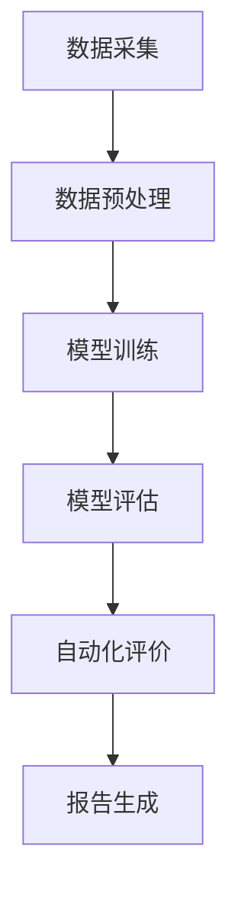

                 

### ChatGPT在自动化产品评价分析中的应用原理

#### 2.1 ChatGPT与自动化产品评价分析的关系

ChatGPT与自动化产品评价分析之间存在密切的关系。ChatGPT作为一款强大的预训练语言模型，可以通过自动化的方式处理和分析大量的用户评价数据，从而实现对产品的综合评价。这一关系主要体现在以下几个方面：

- **文本处理能力**：ChatGPT具备出色的文本处理能力，能够理解并生成语义丰富的文本内容，这使得它能够有效地处理用户评价中的语言信息，提取出关键信息，从而进行自动化评价。
- **多语言支持**：ChatGPT支持多种语言，这意味着它能够处理来自全球各地的用户评价，从而实现跨语言的自动化产品评价。
- **灵活性**：ChatGPT可以根据不同的应用场景进行适应性调整，这使得它能够灵活地应用于各种产品评价分析任务，满足不同的需求。

#### 2.2 ChatGPT在自动化产品评价分析中的具体应用

ChatGPT在自动化产品评价分析中的具体应用主要体现在以下几个方面：

- **用户评价分析**：通过分析用户评价，ChatGPT可以识别用户的情绪、态度和意见，从而评估产品的质量。例如，用户可能会使用积极的词汇来描述满意的产品特性，使用消极的词汇来表达不满意的地方。
- **趋势分析**：ChatGPT可以分析大量的用户评价数据，识别出用户关注的热点问题，从而帮助产品经理和开发团队针对性地进行产品改进。
- **自动生成报告**：基于用户评价分析的结果，ChatGPT可以自动生成详细的产品评价报告，为决策者提供有力支持。

#### 2.3 ChatGPT在自动化产品评价分析中的算法原理

ChatGPT在自动化产品评价分析中的算法原理主要基于深度学习技术，特别是预训练语言模型（如GPT系列）。以下是对其算法原理的详细阐述：

- **预训练阶段**：ChatGPT在预训练阶段通过在大量文本数据上训练，学习语言模式和结构，从而形成对文本的深入理解。这一阶段的主要任务是使模型具备语言理解能力。
- **微调阶段**：在特定任务（如自动化产品评价分析）上，对模型进行微调，使其能够适应具体的应用场景。微调过程包括对模型参数的调整，以优化其在特定任务上的性能。
- **文本生成**：在微调阶段，ChatGPT可以通过生成的文本来评估产品的质量。例如，它可以生成用户评价文本，并从中提取出关键信息，从而进行自动化评价。

#### 2.4 ChatGPT在自动化产品评价分析中的流程图

为了更好地理解ChatGPT在自动化产品评价分析中的应用原理，我们可以通过Mermaid流程图来展示其应用流程：



- **数据采集**：从各个渠道（如电商平台、社交媒体等）收集用户评价数据。
- **数据预处理**：对采集到的用户评价数据进行清洗、去噪，提取有用的信息。
- **模型训练**：使用预处理后的数据对ChatGPT模型进行训练，使其具备语言理解和生成能力。
- **模型评估**：对训练好的模型进行评估，确保其性能满足要求。
- **自动化评价**：使用训练好的模型对新的用户评价进行自动化分析，提取关键信息，生成评价报告。

#### 2.5 数学模型与公式

在自动化产品评价分析中，ChatGPT的算法原理涉及到一些数学模型和公式。以下是对这些模型和公式的详细阐述：

- **损失函数**：在模型训练过程中，损失函数用于衡量模型预测结果与真实结果之间的差距。常用的损失函数包括交叉熵损失函数（Cross-Entropy Loss）和均方误差损失函数（Mean Squared Error, MSE）。
- **梯度下降算法**：用于模型训练过程中参数的更新。梯度下降算法的基本思想是沿着损失函数的梯度方向进行参数更新，以最小化损失函数。
- **文本生成**：在生成文本的过程中，ChatGPT使用了一种基于变分自编码器（Variational Autoencoder, VAE）的生成模型。VAE通过编码器和解码器将输入文本映射到潜在空间，然后从潜在空间生成新的文本。

以下是一个简单的例子，展示如何使用Python代码实现上述算法原理：

```python
import tensorflow as tf
from tensorflow.keras.layers import Embedding, LSTM, Dense
from tensorflow.keras.models import Model

# 构建模型
input_layer = Embedding(input_dim=vocab_size, output_dim=embedding_size)
lstm_layer = LSTM(units=128, return_sequences=True)
output_layer = Dense(units=vocab_size, activation='softmax')

# 创建模型
model = Model(inputs=input_layer, outputs=output_layer)

# 编译模型
model.compile(optimizer='adam', loss='categorical_crossentropy', metrics=['accuracy'])

# 模型训练
model.fit(x_train, y_train, epochs=10, batch_size=64)
```

在这个例子中，我们使用了Keras库来构建和训练一个基于LSTM的文本生成模型。这个模型通过在预训练阶段学习文本数据，然后在微调阶段进行自动化产品评价分析。

通过上述步骤，我们可以看到ChatGPT在自动化产品评价分析中的应用原理。这种应用不仅提高了评价的效率和准确性，还为产品改进和用户满意度提升提供了有力支持。在接下来的章节中，我们将进一步探讨如何构建ChatGPT自动化产品评价系统，以及如何在实际项目中应用这些原理。继续阅读下文，让我们深入了解系统的具体实现过程。

