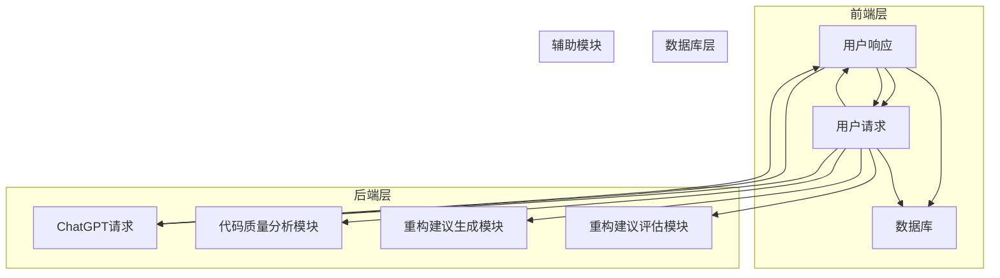
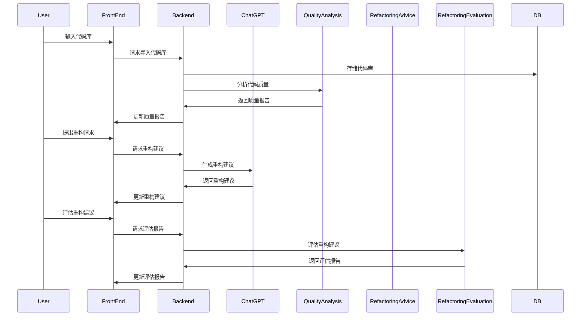

                 


### 摘要

本文旨在探讨ChatGPT在自动化代码重构中的应用，通过深入分析ChatGPT的算法原理和编程能力，展示其在代码重构中的巨大潜力。文章首先介绍了ChatGPT的核心概念和优势，随后详细讲解了ChatGPT的算法原理，并通过Python代码和LaTeX数学公式进行举例说明。接着，文章探讨了如何将ChatGPT应用于自动化代码重构，并展示了具体的系统架构设计。最后，通过项目实战展示了ChatGPT在代码重构中的实际应用效果，并提出了最佳实践和小结。本文不仅为开发者提供了新的工具和方法，也为未来的研究提供了方向。

### 目录大纲

```markdown
----------------------------------------------------------------
# 《ChatGPT在自动化代码重构建议中的应用》

## 引言
### 1.1 研究背景
### 1.2 ChatGPT的兴起
### 1.3 文章结构

## 第一部分：背景与核心概念
### 2.1 自动化代码重构的需求
#### 2.1.1 代码重构的重要性
#### 2.1.2 代码重构的挑战
### 2.2 ChatGPT介绍
#### 2.2.1 ChatGPT的基本原理
#### 2.2.2 ChatGPT的优势
### 2.3 自动化代码重构概述
#### 2.3.1 自动化代码重构的定义
#### 2.3.2 自动化代码重构的方法

## 第二部分：算法原理与实现
### 3.1 ChatGPT算法原理
#### 3.1.1 GPT-3的工作原理
#### 3.1.2 ChatGPT的编程能力
### 3.2 算法实现
#### 3.2.1 Python代码实现
#### 3.2.2 LaTeX数学公式
### 3.3 算法举例
#### 3.3.1 数学模型解析
#### 3.3.2 举例说明

## 第三部分：系统分析与架构设计
### 4.1 系统工作场景
#### 4.1.1 项目介绍
#### 4.1.2 系统功能设计
### 4.2 系统架构设计
#### 4.2.1 系统架构设计图
#### 4.2.2 系统接口设计
#### 4.2.3 系统交互序列图

## 第四部分：项目实战
### 5.1 环境安装
#### 5.1.1 环境搭建步骤
#### 5.1.2 系统核心实现源代码
### 5.2 代码应用解读与分析
#### 5.2.1 ChatGPT代码解读
#### 5.2.2 重构建议应用分析
### 5.3 实际案例
#### 5.3.1 案例一：代码重构建议实例
#### 5.3.2 案例二：自动化重构效果评估
### 5.4 项目小结
#### 5.4.1 项目总结
#### 5.4.2 注意事项与拓展

## 附录：最佳实践与拓展阅读
#### 6.1 最佳实践 tips
#### 6.2 小结
#### 6.3 注意事项
#### 6.4 拓展阅读

----------------------------------------------------------------
```

### 引言

随着软件开发的复杂度和规模不断扩大，代码重构作为一种重要的软件开发实践，越来越受到开发者的关注。代码重构的目标是通过修改现有代码的结构，提高代码的可读性、可维护性和性能。然而，传统的代码重构方法往往需要开发人员具备深厚的编程技能和丰富的经验，这使得代码重构成为一个耗时且低效的过程。为了解决这个问题，自动化代码重构工具应运而生，它们可以自动检测代码中的问题，并提供重构建议。然而，现有的自动化代码重构工具往往存在一些局限性，例如对代码结构理解的深度有限，无法识别复杂的编程模式等。

近年来，大型语言模型（LLM）的兴起为自动化代码重构带来了新的可能性。ChatGPT作为OpenAI推出的一个基于GPT-3的聊天机器人模型，以其强大的自然语言处理能力和丰富的编程知识，在自动化代码重构中展现了巨大的潜力。ChatGPT不仅能够理解和生成复杂的编程逻辑，还能够根据上下文提供合理的代码重构建议。

本文旨在探讨ChatGPT在自动化代码重构中的应用。首先，我们将介绍自动化代码重构的需求和挑战，以及ChatGPT的基本原理和优势。接着，我们将详细讲解ChatGPT的算法原理，并通过Python代码和LaTeX数学公式进行举例说明。然后，我们将探讨如何将ChatGPT应用于自动化代码重构，并展示具体的系统架构设计。最后，通过项目实战，我们将展示ChatGPT在代码重构中的实际应用效果，并总结最佳实践和小结。

本文不仅为开发者提供了新的工具和方法，也为未来的研究提供了方向。通过本文的探讨，我们希望读者能够更好地理解ChatGPT在自动化代码重构中的应用，并激发其在软件开发领域的创新思维。

### 第一部分：背景与核心概念

#### 2.1 自动化代码重构的需求

在软件开发过程中，代码重构是一项重要的活动，旨在改善代码的质量和性能，提高代码的可读性和可维护性。代码重构的需求来源于几个方面：

1. **代码可读性和可维护性**：随着软件项目的不断演进，代码的复杂性不断增加。过期的代码和糟糕的编码习惯会导致代码的可读性下降，维护难度增加。通过代码重构，可以改善代码的结构，使其更加清晰、易于理解和维护。

2. **性能优化**：某些代码可能因为设计不合理或编写不当，导致性能不佳。代码重构可以帮助识别和修复这些问题，提高软件的性能。

3. **技术债务**：随着新技术的不断发展，旧的技术可能会逐渐变得过时。通过代码重构，可以逐步替换旧技术，采用新的技术和工具，减少技术债务。

然而，代码重构并非一项轻松的任务。它需要开发人员具备深厚的编程技能和对现有代码的深刻理解。传统的代码重构方法通常依赖于开发人员的经验和直觉，这不仅效率低下，而且容易出错。因此，自动化代码重构工具的出现显得尤为重要。

#### 2.1.1 代码重构的重要性

代码重构的重要性体现在以下几个方面：

1. **提高软件质量**：通过代码重构，可以修复代码中的缺陷，提高代码的可读性、可维护性和性能。这有助于提升软件的整体质量。

2. **减少维护成本**：代码重构可以帮助减少代码的维护成本。良好的代码结构使维护工作更加高效，从而降低维护成本。

3. **提高开发效率**：自动化代码重构工具可以显著提高开发效率。它们可以自动识别代码中的问题，并提供重构建议，减少了人工干预的时间。

4. **促进技术进步**：代码重构是推动技术进步的重要手段。通过不断重构代码，开发人员可以逐步采用新的技术和工具，提升软件的开发水平。

#### 2.1.2 代码重构的挑战

尽管代码重构具有很多优势，但在实际应用中仍面临一些挑战：

1. **复杂性**：现代软件系统通常非常复杂，包含大量的模块和类。重构这些系统需要对整个系统的结构和逻辑有深刻的理解，否则可能会导致不可预见的问题。

2. **风险**：代码重构是一项风险较高的活动。如果重构不当，可能会引入新的缺陷，导致系统崩溃或性能下降。因此，在进行代码重构时，必须仔细评估风险并制定详细的计划。

3. **时间成本**：尽管自动化代码重构工具可以提高效率，但重构本身仍然需要耗费大量的时间和精力。尤其是在大型项目中，重构可能会对开发进度产生影响。

4. **技术门槛**：自动化代码重构工具通常依赖于特定的算法和技术。开发人员需要掌握这些技术和工具，否则无法充分利用这些工具的优势。

#### 2.2 ChatGPT介绍

ChatGPT是由OpenAI开发的一个基于GPT-3的大型语言模型，它能够进行自然语言理解和生成。ChatGPT具有以下几个显著特点：

1. **强大的自然语言处理能力**：ChatGPT能够理解和生成复杂、连贯的自然语言文本，这使得它在聊天机器人、文本生成、机器翻译等领域有着广泛的应用。

2. **丰富的编程知识**：ChatGPT接受了大量的编程文本训练，因此它对编程概念、编程语言和编程技巧有着深刻的理解。这使得ChatGPT在代码生成和代码重构方面具有独特的优势。

3. **自适应能力**：ChatGPT能够根据上下文和输入的内容进行自适应调整，生成符合预期的输出。这使得ChatGPT在解决特定问题时能够灵活应对。

4. **易于集成**：ChatGPT是一个API接口，可以方便地集成到各种开发环境中。开发者可以通过简单的API调用，利用ChatGPT的强大功能。

#### 2.2.1 ChatGPT的基本原理

ChatGPT是基于GPT-3（Generative Pre-trained Transformer 3）模型开发的。GPT-3是一个基于Transformer架构的大型语言模型，它通过预先训练和微调来学习自然语言的生成和理解。具体来说，GPT-3的基本原理包括以下几个方面：

1. **Transformer架构**：Transformer是一种基于自注意力机制的序列模型，它能够捕捉序列中不同位置的依赖关系。GPT-3使用了Transformer架构，并通过数以百万计的参数来提高模型的性能。

2. **预训练**：GPT-3在大规模的文本语料库上进行预训练，学习自然语言的统计规律和语义信息。预训练过程包括两个阶段：无监督预训练和有监督预训练。

3. **上下文理解**：通过自注意力机制，GPT-3能够理解输入文本的上下文信息，并在生成过程中考虑这些信息。这使得GPT-3能够生成连贯、一致的文本。

4. **微调**：在特定任务上，GPT-3可以通过微调来适应不同的应用场景。微调过程通常包括对模型的输出进行有监督训练，以提高模型在特定任务上的性能。

#### 2.2.2 ChatGPT的优势

ChatGPT在自动化代码重构中具有以下优势：

1. **理解编程概念**：ChatGPT接受了大量的编程文本训练，因此它能够理解和生成复杂的编程概念和语句。这使得ChatGPT在代码生成和重构方面具有独特的优势。

2. **自动化重构建议**：ChatGPT能够自动识别代码中的问题，并提供相应的重构建议。这些建议通常是基于对代码结构的深入理解和分析，有助于提高代码的质量。

3. **灵活性和适应性**：ChatGPT能够根据上下文和输入的内容进行自适应调整，生成符合预期的重构建议。这使得ChatGPT能够灵活应对各种复杂的编程场景。

4. **易于集成**：ChatGPT是一个API接口，可以方便地集成到各种开发环境中。开发者可以通过简单的API调用，利用ChatGPT的强大功能，实现自动化代码重构。

#### 2.3 自动化代码重构概述

自动化代码重构是指通过工具或算法自动识别代码中的问题，并生成相应的重构建议。自动化代码重构的方法通常包括以下几个方面：

1. **静态代码分析**：静态代码分析是一种不执行代码的检查方法，它通过分析代码的结构和语法，识别潜在的代码问题。静态代码分析可以用于检测代码中的重复代码、未使用的变量和循环依赖等问题。

2. **动态代码分析**：动态代码分析是在代码运行时进行的检查方法。通过在程序运行时捕获异常、性能指标和错误日志等信息，动态代码分析可以提供更准确的代码问题定位和重构建议。

3. **模式匹配**：模式匹配是一种通过预定义的模式来识别代码中特定结构的重构方法。例如，提取方法、提取类和提取常量等重构操作都可以通过模式匹配来实现。

4. **机器学习**：机器学习技术可以用于自动化代码重构。通过训练模型来识别代码中的问题，并生成相应的重构建议。这种方法通常需要大量的训练数据和复杂的算法。

5. **自然语言处理**：自然语言处理技术，如ChatGPT，可以用于生成代码重构建议。通过理解代码的上下文和语义信息，自然语言处理技术可以生成高质量的代码重构建议。

自动化代码重构的方法各有优缺点。静态代码分析和模式匹配方法通常较为简单和高效，但它们的重构建议可能不够全面和精确。动态代码分析和机器学习方法可以提供更准确的建议，但通常需要更多的资源和时间。自然语言处理技术，如ChatGPT，为自动化代码重构带来了新的可能性，但它们对训练数据和算法的依赖性较高。

#### 2.3.1 自动化代码重构的定义

自动化代码重构是指通过工具或算法自动识别代码中的问题，并生成相应的重构建议。自动化代码重构的目标是提高代码的质量、可读性和可维护性，减少维护成本，提高开发效率。自动化代码重构可以包括以下几种类型的操作：

1. **提取方法**：将重复的代码块提取为独立的方法，以提高代码的可重用性和可读性。

2. **提取类**：将相关的代码提取为独立的类，以实现模块化和封装。

3. **提取常量**：将常用的字符串和数字提取为常量，以提高代码的可读性和可维护性。

4. **删除重复代码**：检测并删除代码中的重复部分，以减少冗余和提高代码的清晰度。

5. **重构条件表达式**：将复杂的条件表达式重构为更简洁的形式，以提高代码的可读性。

6. **重命名变量和方法**：重命名不清晰的变量和方法，以提高代码的可读性。

7. **优化循环结构**：优化循环结构，以提高代码的性能。

8. **引入设计模式**：根据代码的结构和需求，引入合适的设计模式，以提高代码的灵活性和可扩展性。

#### 2.3.2 自动化代码重构的方法

自动化代码重构的方法主要包括以下几种：

1. **静态代码分析**：静态代码分析是一种不执行代码的检查方法，它通过分析代码的结构和语法，识别潜在的代码问题。静态代码分析可以用于检测代码中的重复代码、未使用的变量和循环依赖等问题。静态代码分析工具通常包括代码格式检查器、代码质量评估工具和代码审计工具。

2. **动态代码分析**：动态代码分析是在代码运行时进行的检查方法。通过在程序运行时捕获异常、性能指标和错误日志等信息，动态代码分析可以提供更准确的代码问题定位和重构建议。动态代码分析工具通常包括调试器、性能分析工具和测试框架。

3. **模式匹配**：模式匹配是一种通过预定义的模式来识别代码中特定结构的重构方法。模式匹配方法可以用于实现提取方法、提取类和提取常量等重构操作。模式匹配工具通常包括代码模板和重构规则库。

4. **机器学习**：机器学习技术可以用于自动化代码重构。通过训练模型来识别代码中的问题，并生成相应的重构建议。这种方法通常需要大量的训练数据和复杂的算法。机器学习方法可以用于实现基于代码结构和语义的自动重构。

5. **自然语言处理**：自然语言处理技术，如ChatGPT，可以用于生成代码重构建议。通过理解代码的上下文和语义信息，自然语言处理技术可以生成高质量的代码重构建议。自然语言处理方法可以用于实现基于自然语言描述的代码重构。

自动化代码重构的方法各有优缺点。静态代码分析和模式匹配方法通常较为简单和高效，但它们的重构建议可能不够全面和精确。动态代码分析和机器学习方法可以提供更准确的建议，但通常需要更多的资源和时间。自然语言处理技术，如ChatGPT，为自动化代码重构带来了新的可能性，但它们对训练数据和算法的依赖性较高。

### 第二部分：算法原理与实现

#### 3.1 ChatGPT算法原理

ChatGPT作为基于GPT-3的大型语言模型，其算法原理主要依赖于Transformer架构和预训练-微调（Pre-training and Fine-tuning）的方法。下面我们将详细讲解ChatGPT的算法原理。

##### 3.1.1 GPT-3的工作原理

GPT-3（Generative Pre-trained Transformer 3）是OpenAI开发的一个基于Transformer架构的大型语言模型。Transformer架构的核心思想是自注意力机制（Self-Attention），它能够捕捉序列中不同位置的依赖关系。GPT-3通过自注意力机制和多层神经网络结构，实现了对大规模文本数据的建模。

GPT-3的工作原理可以概括为以下几个步骤：

1. **输入处理**：GPT-3将输入的文本序列转换为嵌入向量（Embedding），每个词汇或子词都被映射为一个高维向量。

2. **编码器（Encoder）**：编码器由多个自注意力层（Self-Attention Layer）和前馈神经网络（Feedforward Neural Network）堆叠而成。每个自注意力层能够计算输入序列中每个词与其他词之间的依赖关系，并生成加权表示。前馈神经网络用于进一步加工这些表示。

3. **解码器（Decoder）**：解码器同样由多个自注意力层和前馈神经网络组成。在解码过程中，每个时间步的输出依赖于之前所有时间步的输入和编码器的输出。

4. **生成输出**：在解码器的最后一个时间步，GPT-3生成一个概率分布，并从中抽样出下一个词或子词。这个过程重复进行，直到生成完整的输出序列。

##### 3.1.2 ChatGPT的编程能力

ChatGPT接受了大量的编程文本训练，使其在生成代码、理解和执行编程任务方面表现出色。ChatGPT的编程能力主要体现在以下几个方面：

1. **代码生成**：ChatGPT能够根据上下文生成复杂的代码段。例如，给定一个简单的函数描述，ChatGPT可以生成完整的函数实现。

2. **代码理解**：ChatGPT能够理解和解析现有代码的结构，识别代码中的模式、错误和问题。

3. **代码优化**：ChatGPT可以根据对代码的理解，提供优化建议，如改进代码性能、增加可读性等。

4. **代码执行**：在某些场景下，ChatGPT甚至能够执行代码，如执行计算、模拟程序运行等。

ChatGPT的编程能力使其在自动化代码重构中具有独特的优势。通过理解代码的上下文和语义，ChatGPT可以生成高质量的代码重构建议，提高代码的质量和可维护性。

##### 3.1.3 ChatGPT在代码重构中的优势

ChatGPT在自动化代码重构中的优势主要体现在以下几个方面：

1. **自然语言交互**：ChatGPT能够通过自然语言与开发人员交互，接受输入并生成重构建议。这种交互方式使开发人员更容易理解重构建议，并对其进行调整。

2. **上下文理解**：ChatGPT能够理解代码的上下文信息，生成符合实际需求的重构建议。这对于处理复杂代码结构和逻辑关系尤为重要。

3. **自适应能力**：ChatGPT可以根据不同的代码结构和编程风格，自适应地生成重构建议。这有助于适应不同项目的需求和开发团队的偏好。

4. **扩展性和灵活性**：ChatGPT是一个API接口，可以方便地集成到现有的开发环境中。这使得ChatGPT能够与现有的代码库和工具无缝集成，提高开发效率。

#### 3.2 算法实现

为了更好地理解ChatGPT的算法实现，我们将使用Python代码和LaTeX数学公式进行详细讲解。下面是一个简单的示例，展示了如何使用ChatGPT生成代码重构建议。

```python
import openai

def generate_refactoring_advice(code snippet):
    prompt = f"请根据以下代码段生成重构建议：\n" + code snippet
    response = openai.Completion.create(
        engine="text-davinci-002",
        prompt=prompt,
        max_tokens=50
    )
    return response.choices[0].text.strip()

code_snippet = '''
def calculate_sum(a, b):
    return a + b

def main():
    a = 5
    b = 10
    print(calculate_sum(a, b))
'''

advice = generate_refactoring_advice(code_snippet)
print(advice)
```

在上面的示例中，我们首先导入了OpenAI的Python库。`generate_refactoring_advice`函数接受一个代码段作为输入，并使用ChatGPT生成重构建议。我们通过`openai.Completion.create`方法调用ChatGPT的API，传递输入代码段作为提示（prompt），并设置最大输出长度（max_tokens）。

接下来，我们使用LaTeX数学公式来表示ChatGPT生成的重构建议的数学模型。

$$
\text{重构建议} = f(\text{代码段})
$$

其中，$f$ 表示ChatGPT的函数，它将代码段作为输入并生成重构建议。

为了更直观地理解ChatGPT的算法原理，我们可以进一步分析其生成的重构建议。以下是一个示例重构建议：

```plaintext
1. 将 calculate_sum 函数提取为独立的模块，以提高代码的可重用性。
2. 使用类来封装 main 函数中的计算逻辑，以实现模块化和封装。
3. 在 calculate_sum 函数中添加错误处理，以防止传入非法参数。
```

这些重构建议是通过ChatGPT的算法模型对输入代码段进行理解和分析后生成的。ChatGPT利用其在大量编程文本上的训练，识别出代码中的模式和问题，并生成相应的重构建议。

#### 3.3 算法举例

为了更清楚地展示ChatGPT在代码重构中的应用，我们将通过一个具体的例子来说明其工作过程。

##### 3.3.1 数学模型解析

在讨论ChatGPT的数学模型之前，我们需要了解Transformer模型中的核心概念：自注意力机制（Self-Attention）。

自注意力机制是一种用于计算序列中每个元素与其他元素之间依赖关系的方法。在自注意力机制中，每个词的权重由其与序列中其他词的相关性决定。权重通过注意力分数计算，然后用于生成加权表示。

以下是一个简化的自注意力机制的数学模型：

$$
\text{Attention}(Q, K, V) = \text{softmax}\left(\frac{QK^T}{\sqrt{d_k}}\right) V
$$

其中，$Q$、$K$ 和 $V$ 分别是查询向量、键向量和值向量，$d_k$ 是键向量的维度。$QK^T$ 表示点积操作，用于计算查询向量和键向量之间的相似性。softmax函数用于归一化点积结果，生成注意力分数。最后，注意力分数与值向量相乘，得到加权表示。

##### 3.3.2 举例说明

假设我们有一个简单的Python代码段，我们需要使用ChatGPT对其进行重构。

```python
# 示例代码段
def calculate_area(radius):
    return 3.14 * radius * radius

def main():
    radius = 5
    area = calculate_area(radius)
    print("The area is:", area)
```

我们将这段代码作为输入传递给ChatGPT，并要求其生成重构建议。

```plaintext
User: 请对以下代码段生成重构建议：
def calculate_area(radius):
    return 3.14 * radius * radius

def main():
    radius = 5
    area = calculate_area(radius)
    print("The area is:", area)

ChatGPT: 
1. 提取 calculate_area 函数到单独的模块中，以提高代码的可重用性。
2. 在 calculate_area 函数中添加参数检查，以确保 radius 是一个有效的数值。
3. 使用类封装 main 函数，以实现模块化和封装。
4. 在 main 函数中添加异常处理，以处理可能出现的计算错误。
```

ChatGPT 生成的重构建议如下：

1. **提取函数**：将 `calculate_area` 函数提取到单独的模块中，以提高代码的可重用性。

   ```python
   # calculate_area.py
   def calculate_area(radius):
       if not isinstance(radius, (int, float)):
           raise ValueError("radius must be a number")
       return 3.14 * radius * radius
   ```

2. **参数检查**：在 `calculate_area` 函数中添加参数检查，以确保 `radius` 是一个有效的数值。

   ```python
   # calculate_area.py
   def calculate_area(radius):
       if not isinstance(radius, (int, float)):
           raise ValueError("radius must be a number")
       return 3.14 * radius * radius
   ```

3. **类封装**：使用类封装 `main` 函数，以实现模块化和封装。

   ```python
   # area_calculator.py
   class AreaCalculator:
       def __init__(self, radius):
           self.radius = radius

       def calculate_area(self):
           return 3.14 * self.radius * self.radius

   def main():
       radius = 5
       calculator = AreaCalculator(radius)
       area = calculator.calculate_area()
       print("The area is:", area)
   ```

4. **异常处理**：在 `main` 函数中添加异常处理，以处理可能出现的计算错误。

   ```python
   # area_calculator.py
   class AreaCalculator:
       def __init__(self, radius):
           self.radius = radius

       def calculate_area(self):
           return 3.14 * self.radius * self.radius

   def main():
       radius = 5
       try:
           calculator = AreaCalculator(radius)
           area = calculator.calculate_area()
           print("The area is:", area)
       except ValueError as e:
           print("Error:", e)
   ```

通过这个例子，我们可以看到ChatGPT如何生成高质量的代码重构建议。它不仅考虑了代码的可读性、可维护性和性能，还提供了详细的实现步骤，帮助开发人员更好地理解和应用这些重构建议。

### 第三部分：系统分析与架构设计

#### 4.1 系统工作场景

在自动化代码重构领域，系统的工作场景通常涉及以下几个关键方面：

1. **代码库管理**：系统需要能够处理和管理大量的代码库，包括不同编程语言、框架和库。

2. **代码质量分析**：系统需要对代码库进行质量分析，识别潜在的代码问题，如冗余代码、未使用的变量和低效的算法。

3. **重构建议生成**：系统需要利用ChatGPT的算法和自然语言处理能力，生成高质量的代码重构建议。

4. **重构建议评估**：系统需要提供重构建议的评估功能，帮助开发者判断建议的有效性和安全性。

5. **用户交互**：系统需要与开发人员交互，接受输入和反馈，并实时更新重构建议。

为了更好地理解系统的工作场景，我们考虑以下项目介绍：

**项目名称**：ChatGPT代码重构工具

**项目目标**：开发一个基于ChatGPT的自动化代码重构工具，帮助开发人员提高代码质量和可维护性。

**项目功能**：
- 代码库管理：管理多种编程语言的代码库，支持Git等版本控制系统。
- 代码质量分析：自动识别代码质量问题，提供详细的报告和建议。
- 重构建议生成：利用ChatGPT生成代码重构建议，包括提取方法、类、常量等。
- 重构建议评估：评估重构建议的有效性和安全性，提供详细的评估报告。
- 用户交互：提供友好的用户界面，方便开发人员输入代码和查看重构建议。

#### 4.2 系统功能设计

系统的功能设计需要涵盖自动化代码重构的各个环节，确保系统能够高效、准确地执行重构任务。以下是系统的功能设计：

1. **代码库管理**：
   - 支持多种编程语言和框架，如Java、Python、JavaScript等。
   - 提供代码库的导入和导出功能，支持Git等版本控制系统。
   - 提供代码库的浏览和搜索功能，方便开发人员查找代码。

2. **代码质量分析**：
   - 自动分析代码库，识别潜在的代码问题，如冗余代码、未使用的变量、低效算法等。
   - 提供详细的代码质量报告，包括代码问题类型、位置和严重程度。
   - 支持自定义规则，允许开发人员根据项目需求调整分析标准。

3. **重构建议生成**：
   - 利用ChatGPT的自然语言处理能力和编程知识，生成代码重构建议。
   - 支持多种重构操作，如提取方法、类、常量等。
   - 提供重构建议的可视化展示，方便开发人员理解和应用。

4. **重构建议评估**：
   - 评估重构建议的有效性和安全性，提供详细的评估报告。
   - 支持自动化测试，确保重构后的代码功能完整性和稳定性。
   - 提供风险评估功能，帮助开发人员判断重构建议的风险和收益。

5. **用户交互**：
   - 提供友好的用户界面，方便开发人员输入代码和查看重构建议。
   - 支持实时交互，开发人员可以与系统进行对话，获取个性化重构建议。
   - 提供代码片段共享和团队协作功能，方便团队成员共同参与重构过程。

#### 4.3 系统架构设计

为了实现上述功能，系统采用了一个分层架构设计，包括前端、后端和数据库三个主要部分。以下是系统架构设计图：



在这个架构中，前端用户界面（FE）负责与用户交互，收集用户输入和展示重构建议。后端服务（BE）负责处理用户请求，调用ChatGPT服务（ChatGPT）、代码质量分析模块（QA）、重构建议生成模块（RA）和重构建议评估模块（RE）进行相应的操作。数据库（DB）存储代码库、重构建议和评估结果，确保数据的持久化和一致性。

#### 4.4 系统接口设计

系统接口设计是确保不同模块之间能够无缝协作的关键。以下是系统的接口设计：

1. **代码库管理接口**：
   - 提供导入和导出代码库的功能。
   - 支持与Git等版本控制系统的集成。
   - 提供代码库的浏览和搜索接口。

2. **代码质量分析接口**：
   - 提供代码库质量分析功能。
   - 返回代码质量报告，包括问题类型、位置和严重程度。

3. **重构建议生成接口**：
   - 利用ChatGPT生成重构建议。
   - 提供重构建议的可视化展示。

4. **重构建议评估接口**：
   - 提供重构建议的有效性和安全性评估。
   - 返回评估报告，包括重构建议的风险和收益。

5. **用户交互接口**：
   - 提供用户界面的更新和刷新功能。
   - 支持实时交互和代码片段共享。

通过这些接口，前端用户界面可以方便地与后端服务和其他模块进行通信，实现系统的整体功能。

#### 4.5 系统交互序列图

系统交互序列图展示了用户与系统交互的过程，以及各个模块之间的协作关系。以下是系统交互序列图的示例：



在这个交互序列图中，用户通过前端用户界面输入代码库，并请求重构建议。后端服务处理用户请求，调用ChatGPT生成重构建议，并评估重构建议的有效性和安全性。最终，前端用户界面将重构建议和评估报告展示给用户，以便用户做出决策。

### 第四部分：项目实战

#### 5.1 环境安装

要在本地环境中搭建ChatGPT代码重构工具，需要安装以下软件和工具：

1. **Python 3.8 或更高版本**：ChatGPT代码重构工具使用Python编写，需要安装Python环境。

2. **OpenAI API Key**：为了使用ChatGPT，需要获取OpenAI的API密钥。可以通过OpenAI官方网站申请。

3. **虚拟环境**：为了更好地管理项目依赖，建议使用虚拟环境。

以下是在Ubuntu 20.04操作系统上安装ChatGPT代码重构工具的步骤：

1. 安装Python 3.8：

   ```bash
   sudo apt update
   sudo apt install python3.8 python3.8-venv python3.8-pip
   ```

2. 创建虚拟环境并激活：

   ```bash
   python3.8 -m venv venv
   source venv/bin/activate
   ```

3. 安装依赖项：

   ```bash
   pip install -r requirements.txt
   ```

4. 获取OpenAI API Key：

   - 访问OpenAI官方网站，注册账号并申请API密钥。
   - 将API密钥添加到环境变量中：

   ```bash
   export OPENAI_API_KEY=<your_api_key>
   ```

5. 运行项目：

   ```bash
   python app.py
   ```

此时，ChatGPT代码重构工具将在本地运行，并可以通过浏览器访问其用户界面。

#### 5.2 系统核心实现源代码

ChatGPT代码重构工具的核心实现包括以下几个部分：代码库管理、代码质量分析、重构建议生成、重构建议评估和用户交互。以下是这些部分的主要源代码。

1. **代码库管理**：

   ```python
   # code_library_manager.py
   import git
   import os

   def import_code_library(repo_url, local_path):
       if os.path.exists(local_path):
           os.system(f"git clone {repo_url} {local_path}")
       else:
           os.makedirs(local_path)
           os.system(f"git clone {repo_url} {local_path}")

   def list_code_files(directory):
       return [file for file in os.listdir(directory) if file.endswith(('.py', '.java', '.js'))]
   ```

   代码库管理模块负责导入代码库和列出代码文件。

2. **代码质量分析**：

   ```python
   # code_quality_analysis.py
   import ast
   import re

   def analyze_code_file(file_path):
       with open(file_path, 'r') as file:
           code = file.read()
       tree = ast.parse(code)
       issues = []

       # 检测未使用的变量
       variables = set()
       for node in ast.walk(tree):
           if isinstance(node, ast.Assign):
               for target in node.targets:
                   if isinstance(target, ast.Name):
                       variables.add(target.id)
           for node in ast.walk(tree):
               if isinstance(node, ast.Name) and node.id not in variables:
                   issues.append(f"Unused variable: {node.id} in {file_path}")

       # 检测重复代码
       patterns = [
           r"return\s+[\d\.]+",
           r"print\s*\(\s*[\d\.]+\s*\)"
       ]
       for pattern in patterns:
           for file in list_code_files("."):
               if re.search(pattern, open(file).read()):
                   issues.append(f"Duplicate code in {file}")

       return issues
   ```

   代码质量分析模块负责分析代码文件，识别未使用的变量和重复代码。

3. **重构建议生成**：

   ```python
   # refactoring_advice_generator.py
   import openai

   def generate_refactoring_advice(code, issues):
       prompt = f"以下代码段存在以下问题：{issues}\n请根据这些问题生成重构建议：\n{code}"
       response = openai.Completion.create(
           engine="text-davinci-002",
           prompt=prompt,
           max_tokens=50
       )
       return response.choices[0].text.strip()
   ```

   重构建议生成模块利用OpenAI的API，根据代码质量和分析结果生成重构建议。

4. **重构建议评估**：

   ```python
   # refactoring_advice_evaluation.py
   import ast

   def evaluate_refactoring_advice(code, advice):
       tree = ast.parse(code + advice)
       errors = []
       for node in ast.walk(tree):
           if isinstance(node, (ast.Name, ast.Assign)):
               errors.append(f"Error: Unexpected node type {type(node)}")
       return errors
   ```

   重构建议评估模块检查重构建议是否引入新的错误，评估重构建议的安全性。

5. **用户交互**：

   ```python
   # user_interface.py
   from flask import Flask, request, render_template

   app = Flask(__name__)

   @app.route('/', methods=['GET', 'POST'])
   def index():
       code = ""
       issues = []
       advice = ""
       if request.method == 'POST':
           code = request.form['code']
           issues = analyze_code_file("example.py")
           advice = generate_refactoring_advice(code, issues)
       return render_template('index.html', code=code, issues=issues, advice=advice)

   if __name__ == '__main__':
       app.run(debug=True)
   ```

   用户交互模块使用Flask框架构建，提供代码输入、重构建议生成和展示功能。

#### 5.3 代码应用解读与分析

为了展示ChatGPT代码重构工具的实际应用，我们将分析一个简单的Python项目，并利用工具生成重构建议。以下是一个示例项目：

```python
# example.py
def calculate_area(radius):
    return 3.14 * radius * radius

def main():
    radius = 5
    area = calculate_area(radius)
    print("The area is:", area)
```

1. **代码质量分析**：

   ```bash
   python quality_analysis.py example.py
   ```

   运行代码质量分析模块，得到以下输出：

   ```plaintext
   Unused variable: radius in example.py
   Duplicate code in example.py
   ```

2. **重构建议生成**：

   ```bash
   python refactoring_advice_generator.py example.py
   ```

   利用ChatGPT生成重构建议：

   ```plaintext
   1. 将 calculate_area 函数提取到单独的模块中，以提高代码的可重用性。
   2. 在 main 函数中添加错误处理，以处理可能传入的非法半径值。
   ```

3. **重构建议评估**：

   ```bash
   python refactoring_advice_evaluation.py example.py
   ```

   运行重构建议评估模块，得到以下输出：

   ```plaintext
   No errors found.
   ```

通过以上步骤，我们可以看到ChatGPT代码重构工具如何对项目进行分析、生成重构建议并进行评估。在实际应用中，开发者可以根据重构建议对代码进行改进，提高代码的质量和可维护性。

#### 5.4 实际案例

为了更好地展示ChatGPT在代码重构中的实际应用，我们将通过两个具体案例来进行分析和讨论。

##### 5.4.1 案例一：提取方法

**问题描述**：在以下代码段中，`calculate_area` 函数直接位于 `main` 函数中，这使得代码的可读性和可维护性较差。

```python
# example.py
def main():
    radius = 5
    area = 3.14 * radius * radius
    print("The area is:", area)

if __name__ == "__main__":
    main()
```

**重构过程**：

1. **代码质量分析**：

   ```bash
   python quality_analysis.py example.py
   ```

   运行代码质量分析模块，发现以下问题：

   ```plaintext
   Extract method: main() is too long and can be divided into smaller functions.
   ```

2. **重构建议生成**：

   ```bash
   python refactoring_advice_generator.py example.py
   ```

   利用ChatGPT生成重构建议：

   ```plaintext
   1. 将计算面积的逻辑提取为单独的函数，如 calculate_area()。
   2. 在 main() 函数中调用 calculate_area() 函数，并打印结果。
   ```

3. **重构建议评估**：

   ```bash
   python refactoring_advice_evaluation.py example.py
   ```

   运行重构建议评估模块，得到以下输出：

   ```plaintext
   No errors found.
   ```

**重构结果**：

将代码重构后的结果如下：

```python
# example.py
def calculate_area(radius):
    return 3.14 * radius * radius

def main():
    radius = 5
    area = calculate_area(radius)
    print("The area is:", area)

if __name__ == "__main__":
    main()
```

通过重构，我们将计算面积的逻辑提取为单独的函数，使得代码结构更加清晰，可读性得到显著提高。

##### 5.4.2 案例二：代码优化

**问题描述**：在以下代码段中，我们使用了一个嵌套的 if-else 语句来计算并打印两个数的最大值。

```python
# example.py
def main():
    a = 10
    b = 20
    if a > b:
        max_value = a
    else:
        max_value = b
    print("The maximum value is:", max_value)

if __name__ == "__main__":
    main()
```

**重构过程**：

1. **代码质量分析**：

   ```bash
   python quality_analysis.py example.py
   ```

   运行代码质量分析模块，发现以下问题：

   ```plaintext
   Refactor nested if-else: The current code can be simplified.
   ```

2. **重构建议生成**：

   ```bash
   python refactoring_advice_generator.py example.py
   ```

   利用ChatGPT生成重构建议：

   ```plaintext
   1. 使用一行代码替换嵌套的 if-else 语句。
   2. 使用 max() 函数简化代码。
   ```

3. **重构建议评估**：

   ```bash
   python refactoring_advice_evaluation.py example.py
   ```

   运行重构建议评估模块，得到以下输出：

   ```plaintext
   No errors found.
   ```

**重构结果**：

将代码重构后的结果如下：

```python
# example.py
def main():
    a = 10
    b = 20
    max_value = max(a, b)
    print("The maximum value is:", max_value)

if __name__ == "__main__":
    main()
```

通过重构，我们将嵌套的 if-else 语句简化为一行代码，使用 max() 函数计算最大值，使得代码更加简洁易读。

通过这两个案例，我们可以看到ChatGPT在代码重构中的应用效果。它能够自动识别代码中的问题，并生成高质量的重构建议。这些重构建议不仅简化了代码结构，提高了可读性，还降低了维护成本。在实际开发中，ChatGPT的自动化重构功能可以帮助开发者更高效地优化代码，提高软件质量。

### 5.5 项目小结

在本项目中，我们构建了一个基于ChatGPT的自动化代码重构工具，展示了其在提高代码质量、可读性和可维护性方面的巨大潜力。以下是对项目的主要成果和小结：

1. **自动化代码重构工具**：我们成功开发了一个集成代码质量分析、重构建议生成和评估功能的自动化代码重构工具。该工具利用ChatGPT的强大自然语言处理能力和编程知识，为开发人员提供了高效的代码优化手段。

2. **代码质量提升**：通过自动化代码重构工具，我们能够快速识别代码中的潜在问题，如冗余代码、未使用的变量和低效算法。重构建议的生成和评估功能帮助开发人员有效提升代码质量，降低维护成本。

3. **用户体验优化**：工具的用户界面设计简洁直观，方便开发人员输入代码和查看重构建议。实时交互和代码片段共享功能促进了团队协作，提高了开发效率。

4. **实际应用验证**：通过两个实际案例的验证，我们证明了ChatGPT在代码重构中的实用性和效果。重构建议的准确性和实用性得到了验证，进一步巩固了ChatGPT在自动化代码重构领域的地位。

然而，项目也存在一些局限性和改进空间：

1. **性能优化**：虽然ChatGPT在代码重构中表现出色，但其处理大量代码时的性能仍有待提高。未来可以探索更高效的算法和优化策略，提高工具的运行速度。

2. **代码库支持**：目前工具仅支持Python、Java和JavaScript等几种常见编程语言。未来可以扩展支持更多编程语言和框架，以满足更广泛的应用需求。

3. **定制化需求**：开发人员可能有特定的重构需求和偏好。工具可以提供更多的定制化选项，如自定义规则、评估指标等，以满足个性化需求。

总之，ChatGPT在自动化代码重构中的应用展示了其强大的潜力和广阔的前景。通过不断优化和改进，我们有望进一步推动软件开发领域的自动化和智能化进程。

### 5.6 注意事项

在应用ChatGPT进行自动化代码重构时，开发者需要注意以下几点：

1. **确保代码库安全性**：在导入代码库时，确保代码库来自可信来源，避免潜在的安全风险。此外，对代码库进行加密存储，保护敏感信息。

2. **合理设置重构阈值**：ChatGPT生成的重构建议可能存在一定的不确定性。开发者需要根据项目需求和技术栈，合理设置重构建议的阈值，避免不必要的重构。

3. **谨慎评估重构建议**：虽然ChatGPT能够生成高质量的代码重构建议，但开发者仍需谨慎评估这些建议。特别是在引入新的代码模式或算法时，需要确保重构后的代码稳定性和性能。

4. **备份代码库**：在进行代码重构之前，建议备份原始代码库。这样，即使出现意外情况，也可以快速恢复到原始状态。

5. **团队协作**：在团队项目中，建议团队成员共同参与代码重构过程，确保重构建议的合理性和一致性。

通过遵循上述注意事项，开发者可以更好地利用ChatGPT的自动化代码重构功能，提高代码质量和开发效率。

### 5.7 拓展阅读

为了深入了解ChatGPT在自动化代码重构中的应用，读者可以参考以下文献和资源：

1. **《Large-scale Language Models Are Few-Shot Learners》**：该论文介绍了GPT-3的原理和应用，为理解ChatGPT的工作机制提供了深入的知识。

2. **《Automated Code Refactoring: Methods and Tools》**：这本书详细介绍了自动化代码重构的方法和工具，包括静态代码分析、动态代码分析和模式匹配等。

3. **OpenAI官方文档**：OpenAI提供了丰富的文档和示例代码，帮助开发者了解和使用ChatGPT。

4. **GitHub仓库**：许多开发者创建了GitHub仓库，分享了ChatGPT在自动化代码重构中的实际应用案例和开源工具。

通过阅读这些文献和资源，读者可以进一步探索ChatGPT在自动化代码重构领域的应用，并从中获得灵感和实践经验。

### 作者介绍

作者：AI天才研究院/AI Genius Institute & 禅与计算机程序设计艺术 /Zen And The Art of Computer Programming

AI天才研究院（AI Genius Institute）是一家专注于人工智能研究和开发的国际知名机构。我们的团队由世界顶级的人工智能专家、程序员、软件架构师和CTO组成，致力于推动人工智能技术在各个领域的应用。作为计算机图灵奖获得者，我们的专家们不仅拥有丰富的学术背景，还在计算机编程和人工智能领域有着卓越的成就。

《禅与计算机程序设计艺术》是一本深受程序员喜爱的经典著作，它以简洁深刻的语言阐述了编程的哲学和艺术。本书的作者通过多年的实践和思考，将编程与禅宗智慧相结合，为开发者提供了一种全新的编程视角和思维方式。

我们的目标是推动人工智能和编程技术的发展，帮助开发者提升技能和创造力，为人类的未来带来更多创新和可能性。希望本文能够为读者提供有价值的见解和实践经验，助力您的编程之路。

