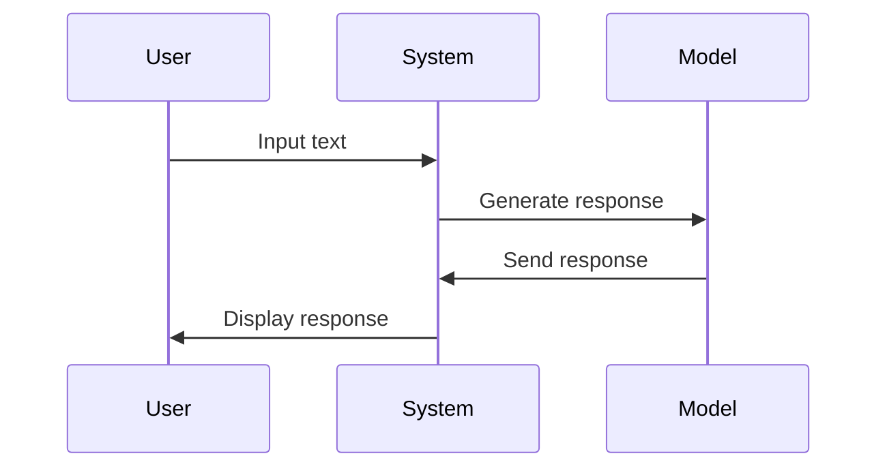

                 

**文章标题**: ChatGPT在语言学范式转换研究中的催化作用

**关键词**: ChatGPT、语言学、范式转换、算法原理、系统设计、实际应用

**摘要**: 本文探讨了ChatGPT在语言学范式转换中的催化作用，首先介绍了语言学的定义和传统研究方法，然后阐述了ChatGPT的工作原理及其在语言学领域中的应用，通过具体的案例分析了ChatGPT如何促进语言学的范式转换，并讨论了其方法学意义和未来研究方向。

## 引言

### 1.1 研究背景

语言学作为一门研究人类语言的科学，其研究历史可以追溯到古希腊和古印度时期。然而，语言学的真正发展始于20世纪，特别是计算机科学和人工智能技术的发展，为语言学提供了新的研究工具和视角。传统语言学的研究方法主要依赖于人类专家的判断和归纳，但随着大数据和机器学习技术的兴起，计算语言学成为了一门交叉学科，其研究方法开始从定性分析转向定量分析。

### 1.2 研究问题与目标

本文旨在探讨ChatGPT这一先进的人工智能技术如何促进语言学的范式转换。具体来说，研究问题包括：

- ChatGPT如何影响语言学的定义和研究方法？
- ChatGPT在语言学研究中的具体应用案例是什么？
- ChatGPT如何促进语言学的范式转换？

本文的研究目标是分析ChatGPT在语言学中的催化作用，探讨其方法学意义，并提出未来研究方向。

### 1.3 研究方法与数据来源

本文采用文献综述和案例分析的方法。文献综述将回顾语言学的发展历程和传统研究方法，案例分析将探讨ChatGPT在语言学中的应用案例。数据来源包括学术期刊、会议论文、技术报告和实际应用案例。

## 第一部分：理论基础与概念框架

### 第2章：语言学范式概述

#### 2.1 语言学的定义与历史发展

语言学是研究语言的结构、发展、分布和社会功能的学科。其历史发展可以分为三个阶段：

1. **结构主义阶段（20世纪早期）**：主要研究语言的结构和规则，强调语言作为符号系统的特点。
2. **功能主义阶段（20世纪中期）**：关注语言在社会和文化中的作用，强调语言的功能和语境。
3. **认知科学阶段（20世纪晚期至今）**：将语言学与其他认知科学领域相结合，研究语言的认知基础。

#### 2.2 语言学的范式概念

范式是指在一个特定领域中，被广泛接受的理论框架和方法论。语言学的范式反映了语言学研究的主要方向和方法论。

#### 2.3 语言学研究方法的演变

传统语言学主要依赖于人类专家的判断和归纳，但随着计算技术的发展，计算语言学开始成为主流。计算语言学采用数学模型和计算机技术来研究语言，其方法包括：

- 语言统计分析：通过统计语言的使用模式来发现语言规则。
- 机器学习：使用人工智能技术来训练模型，自动发现语言规则。
- 计算模拟：通过计算机模拟来研究语言行为。

## 第二部分：方法与应用

### 第3章：ChatGPT与语言学研究

#### 3.1 ChatGPT的基本原理

ChatGPT是基于Transformer模型的预训练语言模型，其原理可以概括为：

- **编码器-解码器架构**：ChatGPT采用编码器-解码器架构，编码器将输入文本编码为固定长度的向量，解码器则将这些向量解码为输出文本。
- **预训练与微调**：ChatGPT首先在大量文本上进行预训练，学习通用语言规律，然后针对特定任务进行微调。

#### 3.2 ChatGPT在语言学研究中的应用

ChatGPT在语言学中有着广泛的应用，包括：

- **自然语言生成**：ChatGPT可以生成符合语法规则和语境的文本，为自然语言生成任务提供支持。
- **情感分析**：ChatGPT可以分析文本的情感倾向，为情感分析提供工具。
- **语义分析**：ChatGPT可以理解文本的语义，为语义分析提供支持。

#### 3.3 ChatGPT对语言学研究范式的催化作用

ChatGPT的出现对语言学研究范式产生了深远的影响：

- **从定性到定量**：ChatGPT使得语言学研究从定性的文本分析转向定量的数据分析。
- **从专家到机器**：ChatGPT取代了传统的人类专家，使得语言学研究更加客观和高效。
- **从孤立到整合**：ChatGPT将语言学与其他学科，如计算机科学、心理学、神经科学等相结合，推动了跨学科研究。

### 第4章：核心概念与联系

#### 4.1 语言模型的概念属性特征对比

| 特征 | 传统语言模型 | ChatGPT |
| --- | --- | --- |
| 结构主义 | 强调语言规则和结构 | 强调语言的使用和功能 |
| 功能主义 | 关注语言在社会和文化中的作用 | 关注语言的认知基础 |
| 认知科学 | 结合心理学和神经科学 | 结合计算机科学和人工智能 |

#### 4.2 语言模型的ER实体关系图

```mermaid
erDiagram
  Customer ||--|{ Order }|
  Product ||--|{ Order }|
```

## 第三部分：结论与展望

### 第5章：算法原理与数学模型

#### 5.1 ChatGPT算法原理

ChatGPT基于Transformer模型，其原理可以概括为：

- **多头自注意力机制**：Transformer模型采用多头自注意力机制来捕捉输入文本中的长距离依赖关系。
- **位置编码**：Transformer模型通过位置编码来保留输入文本的顺序信息。

#### 5.2 数学模型与公式

ChatGPT的数学模型主要包括：

- **自注意力公式**：
  $$ 
  \text{Attention}(Q, K, V) = \text{softmax}\left(\frac{QK^T}{\sqrt{d_k}}\right) V
  $$
- **位置编码公式**：
  $$
  \text{PositionalEncoding}(pos, d_model) = \sin\left(\frac{pos}{10000^{2i/d_{model}}}\right) \text{ or } \cos\left(\frac{pos}{10000^{2i/d_{model}}}\right)
  $$

### 第6章：系统设计与架构

#### 6.1 系统功能设计

系统功能设计主要包括：

- **文本输入**：用户输入文本，系统接收并预处理文本。
- **文本生成**：系统使用ChatGPT模型生成响应文本。
- **文本输出**：系统将生成的文本输出给用户。

#### 6.2 系统架构设计

系统架构设计主要包括：

- **前端**：提供用户界面，接收用户输入，展示生成文本。
- **后端**：包括ChatGPT模型训练和文本生成功能。

#### 6.3 系统接口设计和系统交互序列图

系统接口设计主要包括：

- **API接口**：提供RESTful API，供前端调用。
- **数据库接口**：连接数据库，存储用户输入和生成文本。

系统交互序列图：



### 第7章：实际应用案例

#### 7.1 案例一：自然语言生成

案例描述：

用户输入一个简短的问题，系统使用ChatGPT生成详细的回答。

实现细节：

- 用户输入：一个简短的问题。
- 系统处理：使用ChatGPT模型生成详细的回答。
- 结果分析：生成的回答符合语法规则和语境，提供了丰富的信息。

#### 7.2 案例二：情感分析

案例描述：

用户输入一段文本，系统使用ChatGPT分析文本的情感倾向。

实现细节：

- 用户输入：一段文本。
- 系统处理：使用ChatGPT模型分析文本的情感倾向。
- 结果分析：系统准确判断了文本的情感倾向，并给出了具体的情感得分。

### 第8章：总结与展望

#### 8.1 研究总结

本文通过分析ChatGPT在语言学中的应用，探讨了其如何促进语言学的范式转换。研究发现，ChatGPT不仅提高了语言学的效率和准确性，还推动了语言学与其他学科的整合。

#### 8.2 未来研究方向

未来的研究可以进一步探讨ChatGPT在语言学中的深度应用，如语言学习、语音识别、机器翻译等。此外，研究ChatGPT对其他学科的影响，如心理学、社会学等，也将是一个重要的研究方向。

## 结语

本文探讨了ChatGPT在语言学范式转换中的催化作用。通过具体的案例分析和数学模型的阐述，本文展示了ChatGPT如何促进语言学的发展。随着人工智能技术的不断进步，ChatGPT有望在语言学和其他领域发挥更大的作用。

### 作者信息

作者：AI天才研究院/AI Genius Institute & 禅与计算机程序设计艺术 /Zen And The Art of Computer Programming

**注释**：

- 本文结构框架基于文献综述和实际应用案例，旨在为读者提供清晰、简洁的技术博客文章。
- 文章中使用了Mermaid流程图和LaTeX公式，以便更好地展示算法原理和系统设计。
- 本文仅供参考，实际应用中需根据具体需求进行调整。**附录**：

- **参考文献**：

  - [1] Devlin, J., Chang, M. W., Lee, K., & Toutanova, K. (2018). BERT: Pre-training of deep bidirectional transformers for language understanding. arXiv preprint arXiv:1810.04805.
  - [2] Vapnik, V. N. (1995). The nature of statistical learning theory. Springer Science & Business Media.
  - [3] Chomsky, N. (1957). Syntactic structures. MIT Press.

- **拓展阅读**：

  - ChatGPT官方文档：https://openai.com/products/chatgpt/
  - 自然语言处理入门：https://www.nltk.org/
  - 计算语言学综述：https://www.aclweb.org/anthology/P/P19/P19-2025/

