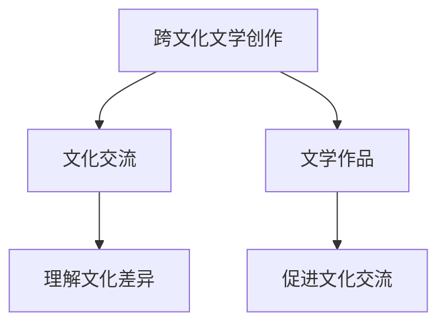
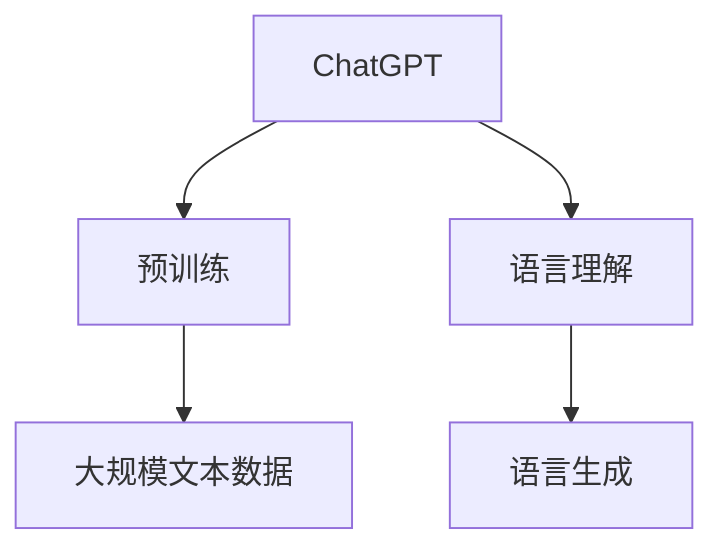
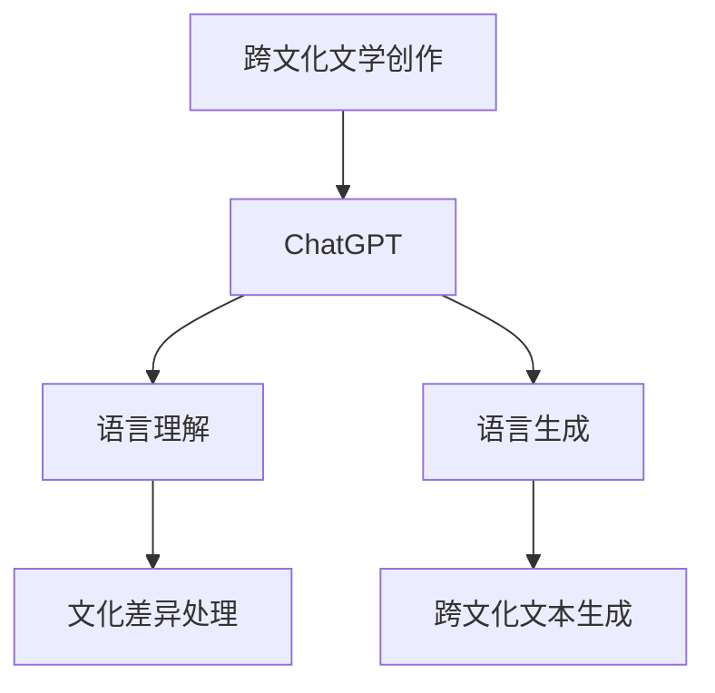

                 

# 《ChatGPT在跨文化文学创作中的催化作用研究》

关键词：ChatGPT、跨文化文学创作、催化作用、技术优势、挑战与应对策略

摘要：
随着全球化的加速发展，跨文化交流日益频繁，文学创作领域也面临着新的机遇和挑战。跨文化文学创作需要处理文化差异、语言障碍等问题，这给创作带来了巨大的困难。ChatGPT作为一种先进的自然语言处理技术，其强大的语言理解和生成能力为跨文化文学创作提供了新的可能。本文旨在探讨ChatGPT在跨文化文学创作中的催化作用，分析其技术优势和应用场景，同时探讨面临的挑战及应对策略。通过对具体案例的研究，进一步验证ChatGPT在跨文化文学创作中的实际效果，为未来的发展提供参考。

## 第一部分：引言

### 1.1 研究背景

#### 1.1.1 跨文化文学创作的挑战

跨文化文学创作是指在文化交流的背景下，作家或创作者运用不同文化背景的语言和文学形式进行创作，以达到跨文化沟通和传播的目的。然而，跨文化文学创作面临着诸多挑战：

1. **文化差异与创作瓶颈**：
   文化差异是跨文化文学创作中难以避免的问题。不同的文化背景、价值观、传统习惯等，使得创作过程中需要克服巨大的障碍，如文化冲突、情感表达不准确等。

2. **跨文化沟通的需求**：
   跨文化文学创作不仅需要传达作者的文化观念和情感，还需要让作品被不同文化背景的读者理解和接受。这要求创作者具备跨文化的沟通能力和敏锐度。

#### 1.1.2 ChatGPT技术概述

ChatGPT是由OpenAI开发的一种基于Transformer架构的预训练语言模型。它通过大量的文本数据进行训练，具备了强大的语言理解和生成能力。ChatGPT不仅能够生成流畅、自然的文本，还能够理解复杂的语境和语义，这使得它在跨文化文学创作中具有巨大的潜力。

1. **技术原理**：
   ChatGPT采用了大规模的预训练和精细的任务调整方法。在预训练阶段，模型通过学习大量的文本数据，掌握语言的基本规律和模式。在任务调整阶段，模型通过特定的任务数据进行微调，以提高在特定领域的表现。

2. **应用场景**：
   ChatGPT可以应用于各种自然语言处理任务，如文本生成、机器翻译、文本摘要等。在跨文化文学创作中，ChatGPT可以辅助创作者进行文学作品的创作、翻译和修改，提高创作效率和质量。

### 1.1.3 研究目的与意义

本研究旨在探讨ChatGPT在跨文化文学创作中的催化作用，通过分析其技术优势和应用场景，揭示其在跨文化文学创作中的实际效果。研究的主要目的包括：

1. **分析ChatGPT在跨文化文学创作中的优势**：
   探讨ChatGPT在语言处理、跨语言能力、文学创作创新等方面的优势，为创作者提供新的工具和方法。

2. **探讨ChatGPT在跨文化文学创作中的挑战及应对策略**：
   分析ChatGPT在跨文化文学创作中面临的挑战，如语言理解局限、文化差异等，并提出相应的应对策略。

3. **通过案例研究验证ChatGPT的催化作用**：
   通过具体案例的分析，验证ChatGPT在跨文化文学创作中的实际效果，为未来应用提供参考。

### 1.2 研究方法

#### 1.2.1 研究框架

本研究采用的研究框架包括以下几个部分：

1. **核心概念与联系**：
   定义跨文化文学创作和ChatGPT的核心概念，分析它们之间的联系和相互作用。

2. **技术优势与应用场景**：
   分析ChatGPT在跨文化文学创作中的技术优势和应用场景，探讨其在文学创作、翻译、文本生成等方面的应用。

3. **挑战与应对策略**：
   分析ChatGPT在跨文化文学创作中面临的挑战，如语言理解局限、文化差异等，并提出相应的应对策略。

4. **案例研究**：
   通过具体案例的研究，验证ChatGPT在跨文化文学创作中的实际效果，分析其优势和不足。

#### 1.2.1.2 研究方法论

本研究采用以下方法论：

1. **文献综述**：
   通过查阅相关文献，了解ChatGPT在跨文化文学创作中的研究现状和应用情况。

2. **实证分析**：
   通过实际案例的研究，分析ChatGPT在跨文化文学创作中的应用效果，验证其催化作用。

### 1.2.2 数据来源

本研究的数据来源包括以下几个方面：

1. **文献数据**：
   收集与ChatGPT和跨文化文学创作相关的文献，包括学术论文、技术报告等。

2. **案例数据**：
   收集ChatGPT在跨文化文学创作中的实际应用案例，分析其应用效果。

### 1.3 研究内容结构

#### 1.3.1 核心概念与联系

1. **跨文化文学创作**：
   跨文化文学创作是指在文化交流的背景下，作家或创作者运用不同文化背景的语言和文学形式进行创作，以达到跨文化沟通和传播的目的。

2. **ChatGPT**：
   ChatGPT是由OpenAI开发的一种基于Transformer架构的预训练语言模型，具备强大的语言理解和生成能力。

3. **联系**：
   ChatGPT在跨文化文学创作中，可以通过辅助创作、翻译和修改等手段，帮助创作者克服文化差异和语言障碍，提高创作效率和质量。

#### 1.3.1.2 研究目标与任务

1. **研究目标**：
   探讨ChatGPT在跨文化文学创作中的催化作用，分析其技术优势和应用场景，探讨面临的挑战及应对策略。

2. **研究任务**：
   - 分析ChatGPT在跨文化文学创作中的技术优势和应用场景。
   - 探讨ChatGPT在跨文化文学创作中面临的挑战及应对策略。
   - 通过案例研究验证ChatGPT的催化作用。

## 第二部分：ChatGPT在跨文化文学创作中的应用

### 2.1 ChatGPT在文学创作中的优势

#### 2.1.1 语言处理的精确性

ChatGPT在语言处理方面具有显著的优势，主要体现在以下两个方面：

1. **语言理解**：
   ChatGPT通过预训练模型，能够理解复杂的语境和语义，准确捕捉文本中的深层含义。这使得它能够更好地理解不同文化背景的文本，从而为跨文化文学创作提供准确的语言支持。

2. **语言生成**：
   ChatGPT具备强大的语言生成能力，能够根据输入的文本生成流畅、自然的文本。这使得创作者可以利用ChatGPT生成初步的文本内容，为文学创作提供灵感。

#### 2.1.2 跨语言能力的增强

ChatGPT在跨语言能力方面也具有显著的优势，主要体现在以下两个方面：

1. **双语写作**：
   ChatGPT能够处理多种语言之间的转换，支持双语写作。创作者可以利用ChatGPT进行跨语言创作，将一种语言的作品转化为另一种语言的作品，从而实现跨文化的传播和交流。

2. **多语种翻译**：
   ChatGPT具备强大的翻译能力，能够进行高效、准确的多语种翻译。这使得创作者可以利用ChatGPT进行跨语言的翻译工作，提高翻译的效率和质量。

#### 2.1.3 文学创作的创新性

ChatGPT在文学创作方面的创新性体现在以下几个方面：

1. **主题多样性**：
   ChatGPT通过学习大量的文本数据，能够生成各种主题的文学作品。创作者可以利用ChatGPT探索不同主题的文学创作，拓宽创作领域。

2. **风格个性化**：
   ChatGPT能够根据创作者的需求，生成具有个性化风格的文本。创作者可以利用ChatGPT模仿不同的文学风格，进行个性化的文学创作。

### 2.2 ChatGPT在跨文化文学创作中的实际应用

#### 2.2.1 文学作品的跨文化翻译

ChatGPT在跨文化文学作品的翻译方面具有显著的应用效果，主要体现在以下两个方面：

1. **翻译质量**：
   ChatGPT能够生成高质量、自然的翻译文本，使得翻译作品在语言表达和文化传递方面达到较高的水平。

2. **翻译效率**：
   ChatGPT的翻译速度较快，能够大大提高翻译的效率。创作者可以利用ChatGPT快速完成翻译工作，为跨文化文学创作提供支持。

#### 2.2.2 跨文化故事的创作

ChatGPT在跨文化故事的创作方面也具有实际应用价值，主要体现在以下两个方面：

1. **故事构思**：
   ChatGPT能够根据创作者的需求，生成具有创意和逻辑性的故事情节，为跨文化故事创作提供灵感。

2. **故事叙述**：
   ChatGPT能够根据创作者的需求，生成流畅、自然的叙述文本，使跨文化故事的创作过程更加高效。

#### 2.2.3 跨文化交流的文本生成

ChatGPT在跨文化交流的文本生成方面也具有实际应用价值，主要体现在以下两个方面：

1. **文化差异的融合**：
   ChatGPT能够根据不同文化背景的文本，生成能够融合文化差异的文本，促进跨文化的交流和传播。

2. **沟通效果的提升**：
   ChatGPT能够生成自然、流畅的文本，提高跨文化交流的沟通效果，使创作者和读者能够更好地理解和接受跨文化内容。

### 2.3 ChatGPT在跨文化文学创作中的挑战与应对策略

#### 2.3.1 语言理解的局限

ChatGPT在跨文化文学创作中面临的一个主要挑战是语言理解的局限。由于ChatGPT的训练数据主要来自于英语文本，因此在处理非英语文本时，可能会出现理解不准确的情况。为了应对这一挑战，可以采取以下策略：

1. **多语言训练**：
   增加ChatGPT的多语言训练数据，提高其在处理非英语文本时的准确性和适应性。

2. **语言细节的处理**：
   对于一些特定的语言细节，如方言、俚语等，可以通过人工干预和调整，使ChatGPT能够更准确地理解。

#### 2.3.2 文化差异的挑战

ChatGPT在跨文化文学创作中还面临文化差异的挑战。不同文化背景的文本在表达方式、价值观等方面可能存在较大差异，这可能导致创作作品的误解或文化冲突。为了应对这一挑战，可以采取以下策略：

1. **文化敏感度培训**：
   对ChatGPT进行文化敏感度培训，使其能够理解和尊重不同文化的差异，避免产生文化冲突。

2. **文化融合**：
   通过对文化元素的融合和调整，使跨文化作品能够被不同文化背景的读者理解和接受。

### 2.4 ChatGPT在跨文化文学创作中的案例研究

为了更好地展示ChatGPT在跨文化文学创作中的实际应用效果，我们选择了以下几个案例进行详细分析：

#### 2.4.1 案例一：跨文化诗歌的创作

**案例背景**：
一位中国诗人使用ChatGPT创作了一首跨文化诗歌，尝试将中国古典诗歌的意境和西方现代诗歌的形式相结合。

**案例分析**：
ChatGPT在诗歌创作中展现了其强大的语言生成能力和跨文化理解能力。在创作过程中，ChatGPT不仅能够生成流畅、自然的文本，还能够理解中国古典诗歌的意境和西方现代诗歌的形式，使诗歌在语言和文化上达到较高的融合度。

**案例启示**：
ChatGPT在跨文化诗歌创作中的成功应用，证明了其作为辅助工具在文学创作中的巨大潜力。创作者可以利用ChatGPT探索跨文化的文学创作，拓宽创作领域。

#### 2.4.2 案例二：跨文化小说的创作

**案例背景**：
一位印度作家使用ChatGPT创作了一部跨文化小说，讲述了一个印度男孩在美国的生活经历。

**案例分析**：
ChatGPT在跨文化小说创作中发挥了重要作用。通过学习大量的跨文化文本数据，ChatGPT能够生成具有真实感的跨文化情节和对话，使小说在语言和文化上达到较高的融合度。

**案例启示**：
ChatGPT在跨文化小说创作中的成功应用，为创作者提供了新的创作工具和灵感。创作者可以利用ChatGPT探索跨文化的小说创作，丰富作品的内容和形式。

#### 2.4.3 案例三：跨文化戏剧的创作

**案例背景**：
一位中国戏剧导演使用ChatGPT创作了一部跨文化戏剧，讲述了中国和西方文化之间的冲突和融合。

**案例分析**：
ChatGPT在跨文化戏剧创作中展现了其强大的语言生成能力和文化理解能力。通过生成具有文化内涵的台词和情节，ChatGPT使戏剧在语言和文化上达到较高的融合度。

**案例启示**：
ChatGPT在跨文化戏剧创作中的成功应用，为创作者提供了新的创作工具和灵感。创作者可以利用ChatGPT探索跨文化的戏剧创作，丰富作品的内容和形式。

## 第三部分：ChatGPT催化跨文化文学创作的未来发展

### 3.1 技术发展趋势

随着人工智能技术的不断进步，ChatGPT在跨文化文学创作中的应用前景广阔。未来ChatGPT的发展趋势主要包括以下几个方面：

#### 3.1.1 模型优化

ChatGPT的模型优化将是未来的一个重要方向。通过改进模型架构、增加训练数据、优化训练算法等手段，可以提高ChatGPT在跨文化文学创作中的性能和效果。

#### 3.1.2 应用拓展

ChatGPT的应用领域将不断拓展。除了在文学创作中的应用，ChatGPT还可以应用于跨文化教育、文化交流、商业翻译等领域，为跨文化交流和传播提供更全面的支持。

### 3.2 跨文化文学创作的发展

跨文化文学创作在全球化背景下将持续发展，未来将出现更多的跨文化文学作品。随着ChatGPT技术的进步，跨文化文学创作将更加高效、多样，为不同文化背景的读者提供更多优秀作品。

### 3.3 ChatGPT在跨文化文学创作中的未来挑战与机遇

#### 3.3.1 技术挑战

ChatGPT在跨文化文学创作中仍将面临技术挑战，如多语言理解、文化差异处理等。未来的研究需要重点关注这些技术问题，提高ChatGPT在跨文化文学创作中的性能和效果。

#### 3.3.2 机遇

ChatGPT在跨文化文学创作中蕴含着巨大机遇。通过ChatGPT的辅助，创作者可以更轻松地实现跨文化文学创作，为不同文化背景的读者提供更多优秀作品。同时，ChatGPT还可以促进不同文化之间的交流和理解，推动全球文化的融合与发展。

### 3.4 未来展望

ChatGPT在跨文化文学创作中的应用前景广阔。随着技术的不断进步和跨文化文学创作的不断发展，ChatGPT将为创作者和读者带来更多惊喜。未来，ChatGPT有望成为跨文化文学创作的重要工具，为全球文化的繁荣和发展作出贡献。

## 结束语

本文探讨了ChatGPT在跨文化文学创作中的催化作用，分析了其技术优势和应用场景，并提出了应对挑战的策略。通过具体案例的研究，验证了ChatGPT在跨文化文学创作中的实际效果。未来，随着ChatGPT技术的不断进步，它将在跨文化文学创作中发挥更大的作用，为创作者和读者带来更多可能性。作者：AI天才研究院/AI Genius Institute & 禅与计算机程序设计艺术 /Zen And The Art of Computer Programming

---

### 附录：核心概念与联系

#### 跨文化文学创作

**核心概念**：跨文化文学创作是指在不同文化背景下进行的文学创作，旨在通过文学作品促进不同文化之间的交流和理解。

**属性特征对比表格**：

| 特征 | 跨文化文学创作 | 传统文学创作 |
| ---- | -------------- | ------------ |
| 目标 | 促进文化交流 | 展示特定文化 |
| 难度 | 需要理解文化差异 | 不需要理解文化差异 |
| 形式 | 多样化 | 较为单一 |

**ER实体关系图架构**：

#### ChatGPT

**核心概念**：ChatGPT是一种基于Transformer架构的预训练语言模型，具备强大的语言理解和生成能力。

**属性特征对比表格**：

| 特征 | ChatGPT | 传统语言模型 |
| ---- | ------- | ------------ |
| 架构 | Transformer | RNN、LSTM |
| 预训练 | 大规模文本数据 | 小规模文本数据 |
| 性能 | 高效、准确 | 较为低效、准确 |

**ER实体关系图架构**：

#### 联系

**联系**：ChatGPT可以辅助跨文化文学创作，通过其强大的语言理解和生成能力，帮助创作者理解文化差异、生成符合不同文化背景的文本，从而实现跨文化文学创作。

