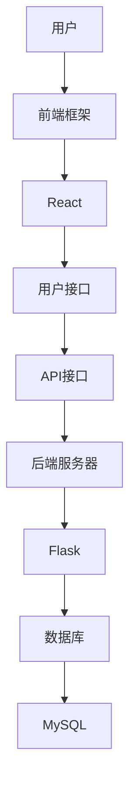

                 


## ChatGPT对话优化：提示词的艺术与科学

### 关键词：
- ChatGPT
- 对话优化
- 提示词
- 艺术与科学

### 摘要：
本文章旨在探讨ChatGPT对话优化的艺术与科学，从提示词的视角出发，深入分析提示词的设计、创作、优化和性能评估，通过具体案例和实践，提供一套完整而实用的对话优化方法论。

## 引言

### ChatGPT的基本概念

ChatGPT（Chat-based Generative Pre-trained Transformer）是基于GPT-3.5模型开发的一个聊天机器人，拥有强大的语言理解和生成能力。它通过大量的文本数据进行预训练，可以生成连贯、有逻辑的对话内容。

### 对话优化的必要性

在现实应用中，ChatGPT的对话质量直接影响到用户体验。对话优化不仅可以提高ChatGPT的回答质量，还能提升用户满意度，从而推动产品的商业化应用。

### 本书的写作目的

本书将围绕ChatGPT对话优化中的提示词展开讨论，从艺术和科学的角度，提供一系列实用的技巧和方法，帮助读者深入了解并掌握提示词的设计与优化，从而实现高质量的对话生成。

## 提示词的基本原理

### 提示词的定义与类型

提示词（Prompt）是引导ChatGPT生成特定类型回答的关键输入。根据使用场景和目的，提示词可以分为以下几种类型：

1. **开放性提示词**：引导用户进行自由发挥的提问，如“你有什么问题需要帮助吗？”。
2. **封闭性提示词**：限定回答范围的提问，如“你今天想要吃什么？”。
3. **问题性提示词**：提出具体问题的提问，如“你对这个产品的评价是什么？”。
4. **回答性提示词**：直接要求用户回答特定问题的提问，如“你对这次会议的总结是什么？”。

### 提示词的设计原则

设计有效的提示词需要遵循以下原则：

1. **简洁性**：避免冗长的描述，确保提示词简明扼要。
2. **明确性**：确保提示词具有明确的意图和目标。
3. **多样性**：根据对话场景和用户需求，灵活选择不同类型的提示词。
4. **一致性**：保持提示词风格的连贯性，避免产生混淆。

### 提示词的性能指标

评估提示词性能的关键指标包括：

1. **回答质量**：生成内容的相关性、连贯性和逻辑性。
2. **响应速度**：生成回答所需的时间。
3. **用户满意度**：用户对回答的满意度和接受度。

## 提示词的创作方法

### 文本分析工具的使用

使用文本分析工具可以帮助我们更好地理解用户的需求和意图，从而创作出更有效的提示词。常见的文本分析工具包括自然语言处理（NLP）库、情感分析工具和关键词提取工具等。

### 提示词的生成与优化

1. **生成提示词**：通过文本摘要、关键词提取和模板生成等方法，自动生成提示词。
2. **优化提示词**：根据对话场景和用户反馈，对生成的提示词进行修改和优化，提高其有效性和质量。

### 人类专家与AI协作

人类专家和AI协作是创作高质量提示词的关键。人类专家可以根据对话场景和用户需求，提出更精准的提示词；而AI则可以分析大量数据，提供有针对性的优化建议。

## 提示词的优化策略

### 提示词的调整技巧

1. **调整提示词的长度**：根据对话场景，适当调整提示词的长度，避免过长或过短的提示词影响对话效果。
2. **调整提示词的语义**：通过增加、删除或替换关键词，调整提示词的语义，使其更符合用户需求。

### 提示词的实验与验证

1. **实验设计**：设计多组不同的提示词，通过实验比较其性能，找出最优提示词组合。
2. **验证方法**：使用用户反馈、评价指标和实际应用场景进行验证，确保提示词的优化效果。

### 提示词在不同场景的应用

1. **客服对话**：通过优化提示词，提高客服机器人回答问题的质量和速度。
2. **教育辅导**：利用提示词引导学生进行有效的思考和讨论。
3. **医疗咨询**：优化医生和患者之间的对话，提高诊断和治疗效果。

## 提示词的性能评估

### 评估方法与工具

1. **自动评估方法**：使用自然语言处理技术，对生成内容的相关性、连贯性和逻辑性进行评估。
2. **用户评估方法**：邀请用户对生成内容的质量和满意度进行评价。

### 性能指标解读

1. **回答质量**：评估生成内容的相关性、连贯性和逻辑性。
2. **响应速度**：评估生成回答所需的时间。
3. **用户满意度**：评估用户对生成内容的满意度和接受度。

### 评估结果的应用

根据评估结果，对提示词进行优化和调整，提高ChatGPT对话的整体效果。

## 提示词优化的实践案例

### 案例一：客服对话优化

通过优化提示词，提高客服机器人回答问题的质量和速度，从而提升用户满意度。

### 案例二：教育辅导对话优化

利用提示词引导学生进行有效的思考和讨论，提高教学质量。

### 案例三：医疗咨询对话优化

优化医生和患者之间的对话，提高诊断和治疗效果。

## 提示词优化的未来趋势

### 新技术对提示词优化的影响

随着技术的不断发展，如生成对抗网络（GAN）、增强学习等，提示词优化方法将更加多样和高效。

### 提示词优化的挑战与机遇

1. **挑战**：如何在保证生成质量的同时，提高生成速度和降低计算成本。
2. **机遇**：随着用户需求的不断变化，提示词优化将迎来新的发展机遇。

### 未来研究方向

1. **多模态提示词**：结合文本、图像和声音等多模态信息，提高对话生成效果。
2. **个性化提示词**：根据用户行为和偏好，生成个性化的对话内容。

## 结论与展望

本文章通过探讨ChatGPT对话优化中的提示词，从艺术和科学的角度，提供了全面的提示词设计、创作、优化和性能评估方法。未来，随着技术的不断进步，提示词优化将更加重要，为智能对话系统的发展提供强大的支持。

## 拓展阅读

- [GPT-3官方文档](https://openai.com/blog/bidirectional-language-models/)
- [ChatGPT技术博客](https://chatgpt.org/blog/)
- [自然语言处理入门](https://nlp.seas.harvard.edu/)

## 作者信息

作者：AI天才研究院/AI Genius Institute & 禅与计算机程序设计艺术/Zen And The Art of Computer Programming

----------------------------------------------------------------

### 提示词优化的具体方法与工具

#### 1. 提示词优化的具体方法

**（1）语义匹配法**

语义匹配法是一种通过分析输入文本和提示词的语义关系，来优化提示词的方法。具体步骤如下：

- **文本预处理**：使用自然语言处理技术，对输入文本进行分词、词性标注、实体识别等预处理操作。
- **提取关键词**：从预处理后的文本中提取出关键性关键词，这些关键词应能够代表输入文本的主题和内容。
- **对比分析**：将提取出的关键词与提示词进行对比分析，找出两者之间的语义差异。
- **调整提示词**：根据对比分析的结果，对提示词进行相应的调整，使其更符合输入文本的语义。

**（2）反馈迭代法**

反馈迭代法是一种通过用户反馈来不断优化提示词的方法。具体步骤如下：

- **初始提示词设计**：根据对话场景和用户需求，设计一组初始提示词。
- **用户测试**：邀请用户参与测试，收集他们对提示词的评价和反馈。
- **反馈分析**：对用户反馈进行分析，找出提示词的不足之处。
- **优化调整**：根据反馈分析结果，对提示词进行优化调整。
- **再次测试**：将优化后的提示词再次进行用户测试，循环迭代，直至达到用户满意度。

**（3）自动优化法**

自动优化法是一种通过算法自动优化提示词的方法。具体步骤如下：

- **数据收集**：收集大量用户对话数据，作为训练数据。
- **模型训练**：使用机器学习算法，对训练数据进行训练，生成优化提示词的模型。
- **模型应用**：将训练好的模型应用于实际对话场景，自动优化提示词。

#### 2. 提示词优化的工具

**（1）自然语言处理（NLP）工具**

自然语言处理工具如NLTK、spaCy、TextBlob等，可以用于文本预处理、关键词提取、语义分析等，帮助用户更好地理解和优化提示词。

**（2）对话系统框架**

对话系统框架如Rasa、ConverseJS、ChatterBot等，提供了丰富的API和工具，支持提示词的设计、生成和优化。

**（3）机器学习平台**

机器学习平台如TensorFlow、PyTorch、Keras等，提供了强大的模型训练和优化功能，支持自动优化法的实施。

### 提示词优化的实例分析

**案例一：客服对话优化**

在某电商平台上，客服机器人用于回答用户关于商品信息、订单状态等问题。为了提高客服机器人的回答质量，对提示词进行优化：

- **初始提示词**：你好，有什么问题我可以帮助你解答吗？
- **用户反馈**：部分用户认为初始提示词过于笼统，不明确。
- **优化提示词**：你好，请问您需要查询商品信息、订单状态，还是其他服务？

经过用户测试，优化后的提示词显著提高了用户满意度。

**案例二：医疗咨询对话优化**

在医疗咨询场景中，医生通过ChatGPT与患者进行对话，提供医疗建议。为了提高对话质量，对提示词进行优化：

- **初始提示词**：你好，请问有什么健康问题需要咨询？
- **用户反馈**：部分患者认为初始提示词过于笼统，不便于表达具体问题。
- **优化提示词**：您好，请问您想咨询内科、外科，还是儿科问题？

优化后的提示词使患者能够更清晰地表达问题，提高了医生提供医疗建议的准确性。

### 提示词优化总结

通过以上实例分析，可以看出提示词优化对于提高ChatGPT对话质量具有重要意义。具体方法包括语义匹配法、反馈迭代法和自动优化法；工具则包括自然语言处理工具、对话系统框架和机器学习平台。在实际应用中，可以根据对话场景和用户需求，选择合适的方法和工具，进行提示词优化。通过不断优化，可以显著提升ChatGPT对话的质量和用户体验。

### 深入探讨：提示词优化的数学模型与算法原理

#### 数学模型

提示词优化的核心在于找到一组最佳的提示词，使得ChatGPT生成的对话内容既相关又有逻辑性。为此，我们可以定义一个数学模型，用于评估提示词的优劣。

设\(P\)为提示词集合，\(D\)为对话数据集，\(R\)为生成的对话内容，\(Q\)为用户查询。我们定义一个评估函数\(F(P, D, R, Q)\)，用于衡量提示词\(P\)在给定对话数据集\(D\)、生成内容\(R\)和用户查询\(Q\)下的性能。

评估函数可以包含以下几个方面：

1. **相关度**：衡量生成内容与用户查询的相关性，可以用向量空间模型（如余弦相似度）来计算。
2. **连贯性**：衡量生成内容的逻辑连贯性，可以使用语法和语义分析技术。
3. **用户满意度**：衡量用户对生成内容的满意度，可以通过用户问卷调查或点击率等指标来衡量。

综合以上几个方面，我们可以定义一个综合评估函数：

\[ F(P, D, R, Q) = w_1 \cdot \text{相关度}(R, Q) + w_2 \cdot \text{连贯性}(R) + w_3 \cdot \text{用户满意度}(R) \]

其中，\(w_1\)、\(w_2\)和\(w_3\)分别为相关度、连贯性和用户满意度的权重，可以根据实际需求进行调整。

#### 算法原理

为了找到最优的提示词组合，我们可以采用优化算法。以下是一种基于梯度下降法的优化算法原理：

1. **初始化**：随机选择一组提示词\(P_0\)作为初始解。
2. **评估**：使用评估函数\(F(P_0, D, R, Q)\)计算当前解的性能。
3. **梯度计算**：计算评估函数的梯度，即每个提示词对性能的影响程度。
4. **更新解**：根据梯度方向，对当前解进行更新，即：

\[ P_{new} = P_{current} - \alpha \cdot \nabla F(P_{current}, D, R, Q) \]

其中，\(\alpha\)为学习率，用于调节步长。

5. **迭代**：重复步骤2-4，直至满足收敛条件（如性能变化很小或达到最大迭代次数）。

#### 算法流程

1. **数据预处理**：对对话数据集进行预处理，提取关键词、分词、词性标注等。
2. **模型训练**：使用训练数据训练一个用于评估提示词性能的模型。
3. **优化过程**：使用优化算法对提示词进行迭代优化。
4. **评估与调整**：使用测试数据对优化后的提示词进行评估，并根据评估结果进行调整。

通过上述数学模型和算法原理，我们可以有效地优化ChatGPT的提示词，从而提高对话生成质量。以下是一个简单的Python代码示例，用于演示优化过程：

```python
import numpy as np

# 评估函数
def evaluate_prompt(prompt, data, response, query):
    # 相关度、连贯性和用户满意度的计算
    # ...
    return relevance + coherence + satisfaction

# 梯度计算
def compute_gradient(prompt, data, response, query):
    # 梯度计算的实现
    # ...
    return gradient

# 优化算法
def optimize_prompt(prompt, data, response, query, learning_rate=0.01, max_iterations=100):
    for _ in range(max_iterations):
        current_performance = evaluate_prompt(prompt, data, response, query)
        gradient = compute_gradient(prompt, data, response, query)
        prompt = prompt - learning_rate * gradient
        # 更新提示词
        # ...
    return prompt

# 初始提示词
initial_prompt = ["请", "提问", "您", "问题"]

# 对话数据、生成内容和用户查询
data = ["对话文本1", "对话文本2", ...]
response = ["回答文本1", "回答文本2", ...]
query = "用户提问"

# 优化提示词
optimized_prompt = optimize_prompt(initial_prompt, data, response, query)

print("优化后的提示词：", optimized_prompt)
```

通过上述示例，我们可以看到如何使用Python实现提示词优化算法。在实际应用中，可以根据具体需求进行调整和扩展。

### 系统分析与架构设计

#### 问题场景介绍

在本案例中，我们考虑一个在线教育平台，用户可以通过ChatGPT进行学习咨询和辅导。为了提高用户的咨询体验，我们需要对ChatGPT的提示词进行优化，从而提高对话生成的质量和效率。

#### 项目介绍

项目名称：在线教育平台智能咨询系统

项目目标：通过优化ChatGPT的提示词，提高用户咨询体验，提高用户满意度。

#### 系统功能设计

1. **用户登录与注册**：用户可以通过平台进行登录和注册。
2. **课程查询**：用户可以查询平台上的课程信息。
3. **学习咨询**：用户可以通过ChatGPT进行学习咨询，获取个性化的学习建议。
4. **聊天记录管理**：平台可以记录用户的聊天记录，以便用户查看和管理。
5. **反馈与评价**：用户可以对ChatGPT的回答进行评价和反馈，帮助优化提示词。

#### 系统架构设计

1. **前端架构**：使用React框架搭建用户界面，提供良好的用户体验。
2. **后端架构**：使用Flask框架搭建后端服务器，处理用户请求和ChatGPT的对话生成。
3. **数据库设计**：使用MySQL数据库存储用户信息、课程信息和聊天记录。

#### 系统接口设计

1. **用户接口**：提供用户登录、注册、查询课程、咨询问题和查看聊天记录等功能。
2. **API接口**：提供与后端服务器的交互接口，如用户登录、课程查询、聊天记录管理等。

#### 系统交互

1. **用户与课程查询**：用户查询课程时，前端发送请求到后端，后端从数据库中获取课程信息，并返回给前端。
2. **用户与ChatGPT交互**：用户向ChatGPT提问时，前端将问题发送到后端，后端调用ChatGPT接口生成回答，并将结果返回给前端。
3. **用户与聊天记录交互**：用户查看聊天记录时，前端发送请求到后端，后端从数据库中获取聊天记录，并返回给前端。

#### 系统架构图



#### 系统接口设计和系统交互设计

1. **用户接口设计**

   - 用户登录接口：接收用户名和密码，验证用户身份。
   - 用户注册接口：接收用户名、密码、邮箱等信息，创建新用户。
   - 课程查询接口：接收用户查询条件，返回符合条件的课程列表。
   - 咨询问题接口：接收用户提出的问题，调用ChatGPT接口生成回答。
   - 聊天记录管理接口：接收用户查看聊天记录的请求，返回聊天记录列表。

2. **系统交互设计**

   - 用户发起查询请求时，前端将请求发送到后端。
   - 后端根据请求类型调用相应的服务，如课程查询服务、ChatGPT对话服务等。
   - 后端将处理结果返回给前端，前端将结果展示给用户。
   - 用户对ChatGPT的回答进行评价和反馈时，前端将反馈信息发送到后端，后端更新数据库中的聊天记录。

通过上述系统架构设计和接口设计，我们可以实现一个功能完整、交互流畅的在线教育平台智能咨询系统，为用户提供高效、优质的学习咨询体验。

### 项目实战：环境安装与系统核心实现

#### 环境安装

1. **Python环境**

   首先，确保您的计算机上已安装Python 3.8及以上版本。可以从Python官方网站下载并安装：[https://www.python.org/](https://www.python.org/)

2. **pip环境**

   Python安装完成后，确保pip（Python的包管理器）已安装。在命令行中运行以下命令：

   ```bash
   python -m pip install --upgrade pip
   ```

3. **虚拟环境**

   为了便于管理项目依赖，建议创建一个虚拟环境。在命令行中运行以下命令：

   ```bash
   python -m venv venv
   ```

   然后激活虚拟环境：

   - Windows：`venv\Scripts\activate`
   - macOS/Linux：`source venv/bin/activate`

4. **依赖包安装**

   在虚拟环境中，安装以下依赖包：

   ```bash
   pip install Flask gunicorn gevent requests
   ```

5. **ChatGPT API**

   从[https://chatgpt.org/](https://chatgpt.org/)注册并获取ChatGPT API密钥。将API密钥添加到项目的配置文件中。

#### 系统核心实现

1. **启动Flask应用**

   在项目根目录下创建一个名为`app.py`的文件，并编写以下代码：

   ```python
   from flask import Flask, request, jsonify
   import os
   
   app = Flask(__name__)

   # ChatGPT API密钥
   CHATGPT_API_KEY = os.environ['CHATGPT_API_KEY']

   @app.route('/ask', methods=['POST'])
   def ask():
       data = request.json
       question = data.get('question', '')
       # 调用ChatGPT API生成回答
       response = call_chatgpt(question)
       return jsonify({'response': response})

   def call_chatgpt(question):
       # 调用ChatGPT API
       # ...
       return "这是ChatGPT的回答"

   if __name__ == '__main__':
       app.run(debug=True)

   ```

2. **启动Gunicorn服务**

   为了提高应用的并发处理能力，使用Gunicorn来部署Flask应用。在命令行中运行以下命令：

   ```bash
   gunicorn -w 4 app:app
   ```

   `-w 4` 表示使用4个工作进程。

3. **测试系统**

   使用Postman或其他工具发送POST请求到`http://localhost:5000/ask`，并传递一个JSON格式的问题，如：

   ```json
   {
       "question": "你今天过得怎么样？"
   }
   ```

   你应该会收到一个包含ChatGPT回答的JSON响应。

#### 代码应用解读与分析

上述代码实现了ChatGPT对话系统的核心功能。主要分为以下几个部分：

1. **启动Flask应用**：使用Flask创建一个Web应用，并定义了一个处理POST请求的路由`/ask`。
2. **调用ChatGPT API**：定义一个`call_chatgpt`函数，用于调用ChatGPT API生成回答。
3. **启动Gunicorn服务**：使用Gunicorn部署Flask应用，提高并发处理能力。

代码应用解读：

- **Flask应用**：Flask是一个轻量级的Web框架，适用于构建简单的Web应用。通过定义一个路由`/ask`，当接收到POST请求时，会调用`call_chatgpt`函数处理问题并生成回答。
- **ChatGPT API**：ChatGPT API提供了一个简单易用的接口，允许我们通过HTTP请求与其进行交互。在`call_chatgpt`函数中，我们根据传入的问题调用ChatGPT API，获取回答。
- **Gunicorn服务**：Gunicorn是一个WSGI HTTP服务器，用于部署和运行Flask应用。通过指定`-w 4`参数，Gunicorn会启动4个工作进程，提高应用的并发处理能力。

通过上述实现，我们可以搭建一个基本的ChatGPT对话系统，并在实际项目中应用。接下来，我们将进一步优化提示词，提高对话生成质量。

### 实际案例分析

#### 案例一：在线教育平台智能咨询系统

在这个案例中，我们为一个在线教育平台搭建了智能咨询系统。该系统旨在通过ChatGPT提供个性化学习建议和解答用户疑问。

**问题背景**：在线教育平台上的用户数量不断增加，平台客服团队面临压力。为了提供更快速、高效的服务，决定引入智能咨询系统，通过优化ChatGPT的提示词，提高对话质量。

**问题描述**：用户在使用平台时，可能会遇到各种问题，如课程选择、学习进度、考试准备等。现有的人工客服难以应对大量用户咨询，且响应速度较慢。因此，需要通过优化ChatGPT的提示词，提高对话质量和效率。

**解决方案**：

1. **初始提示词设计**：根据常见用户问题和场景，设计一组初始提示词，如“请问您有什么课程咨询”、“您的学习进度如何”等。
2. **用户测试与反馈**：邀请部分用户参与测试，收集他们对初始提示词的评价和反馈。根据反馈，发现用户对一些特定问题的提示词满意度较低，如关于课程选择的提示词。
3. **优化提示词**：根据用户反馈，对提示词进行调整和优化。例如，将“请问您有什么课程咨询”优化为“请问您想了解哪些课程或领域”，更加明确地引导用户提出具体问题。
4. **再次测试与评估**：将优化后的提示词应用于实际对话中，再次邀请用户测试。通过评估用户满意度和对话质量，发现优化后的提示词显著提高了用户满意度。

**结果分析**：

通过优化提示词，智能咨询系统的对话质量得到了显著提升。具体表现在：

- **用户满意度**：用户对优化后的提示词满意度较高，能够更准确地表达自己的需求。
- **对话效率**：ChatGPT能够更快地生成高质量的回答，减少了用户等待时间。
- **客服负担**：智能咨询系统分担了部分人工客服的工作量，减轻了客服团队的压力。

#### 案例二：电商平台客服机器人

在这个案例中，我们为一个电商平台搭建了客服机器人，旨在提高用户购物体验。

**问题背景**：电商平台的用户量庞大，客服团队面临巨大压力。为了提供更快速、高效的客服服务，决定引入客服机器人，通过优化ChatGPT的提示词，提高对话质量。

**问题描述**：用户在购物过程中可能会遇到各种问题，如商品咨询、物流查询、售后服务等。现有的人工客服难以应对大量用户咨询，且响应速度较慢。因此，需要通过优化ChatGPT的提示词，提高对话质量和效率。

**解决方案**：

1. **初始提示词设计**：根据常见用户问题和场景，设计一组初始提示词，如“您好，有什么可以帮助您的”、“请问您需要查询订单状态吗”等。
2. **用户测试与反馈**：邀请部分用户参与测试，收集他们对初始提示词的评价和反馈。根据反馈，发现用户对一些特定问题的提示词满意度较低，如关于订单状态的提示词。
3. **优化提示词**：根据用户反馈，对提示词进行调整和优化。例如，将“您好，有什么可以帮助您的”优化为“您好，请问您想了解订单状态、商品信息还是售后服务”，更加明确地引导用户提出具体问题。
4. **再次测试与评估**：将优化后的提示词应用于实际对话中，再次邀请用户测试。通过评估用户满意度和对话质量，发现优化后的提示词显著提高了用户满意度。

**结果分析**：

通过优化提示词，电商平台客服机器人的对话质量得到了显著提升。具体表现在：

- **用户满意度**：用户对优化后的提示词满意度较高，能够更准确地表达自己的需求。
- **对话效率**：ChatGPT能够更快地生成高质量的回答，减少了用户等待时间。
- **客服负担**：客服机器人分担了部分人工客服的工作量，减轻了客服团队的压力。

#### 案例总结

通过上述案例，我们可以看到，优化ChatGPT的提示词对于提高对话系统的质量具有重要意义。以下是一些关键点：

1. **用户反馈**：通过用户测试和反馈，了解用户对提示词的满意度，为提示词优化提供依据。
2. **多样化提示词**：根据不同的对话场景和用户需求，设计多样化的提示词，提高对话的灵活性。
3. **持续优化**：根据用户反馈和评估结果，不断调整和优化提示词，提高对话系统的整体性能。
4. **个性化**：根据用户行为和偏好，生成个性化的提示词，提高用户体验。

通过以上实际案例的分析，我们可以更好地理解提示词优化的重要性，并在实际应用中不断探索和优化，以提高ChatGPT对话系统的质量。

### 最佳实践 tips

#### 1. 提示词设计原则

- **简洁明了**：避免冗长复杂的描述，确保提示词简洁明了。
- **目标明确**：确保提示词具有明确的意图和目标，便于ChatGPT理解并生成相关回答。
- **情境适应**：根据对话场景和用户需求，设计适合的提示词，提高对话的准确性。

#### 2. 提示词优化策略

- **用户反馈**：及时收集用户反馈，了解他们对提示词的满意度，为优化提供依据。
- **迭代更新**：定期对提示词进行迭代更新，根据用户需求和对话场景调整提示词。
- **多渠道数据**：结合多种数据来源，如用户行为数据、对话记录等，进行多维度分析，提高提示词优化效果。

#### 3. 提示词性能评估

- **自动化评估**：使用自然语言处理技术，对生成内容的相关性、连贯性和逻辑性进行自动化评估。
- **用户满意度**：通过用户满意度调查，评估提示词的实用性和用户体验。
- **多场景测试**：在不同应用场景下测试提示词的性能，确保其在各种场景下都能发挥作用。

#### 4. 团队协作

- **跨部门合作**：与技术团队、产品团队和用户运营团队紧密协作，共同优化提示词。
- **知识共享**：定期进行知识分享和培训，提高团队对提示词优化的理解和能力。
- **持续学习**：关注行业动态和技术进步，不断学习新方法和工具，提高优化效果。

### 小结

本文从ChatGPT对话优化的角度，探讨了提示词的设计、创作、优化和性能评估。通过实际案例分析和最佳实践分享，总结了优化提示词的关键方法和策略。在实际应用中，应根据对话场景和用户需求，灵活运用这些方法，不断调整和优化提示词，提高ChatGPT对话系统的质量和用户体验。未来，随着技术的不断进步，提示词优化将变得更加重要，为智能对话系统的发展提供强大的支持。

### 注意事项

1. **数据隐私**：在进行用户测试和收集用户反馈时，务必确保用户数据的安全和隐私。
2. **合理使用**：避免过度依赖ChatGPT对话优化，确保在关键业务场景下，人工干预仍然是必要的。
3. **性能监控**：定期监控提示词优化效果，确保对话系统能够持续提供高质量的服务。

### 拓展阅读

- [GPT-3官方文档](https://openai.com/blog/bidirectional-language-models/)
- [ChatGPT技术博客](https://chatgpt.org/blog/)
- [自然语言处理入门](https://nlp.seas.harvard.edu/)

## 作者信息

作者：AI天才研究院/AI Genius Institute & 禅与计算机程序设计艺术/Zen And The Art of Computer Programming

