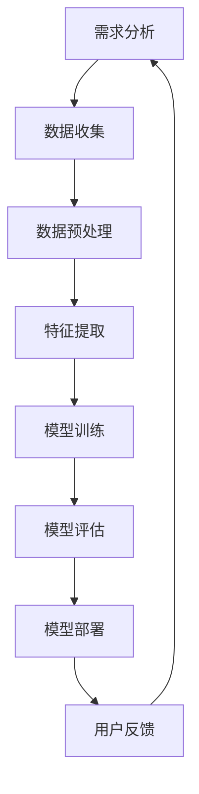
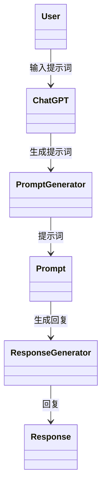
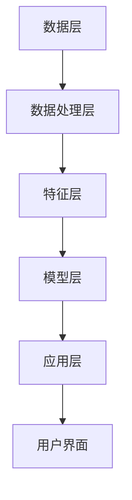
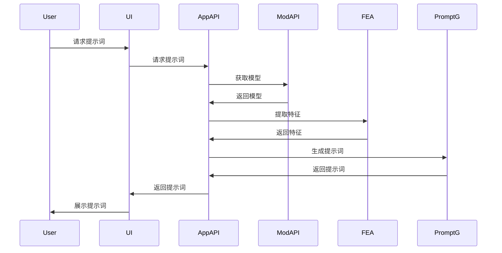

                 


### 第1章 引言

#### 1.1 问题背景

##### 1.1.1 ChatGPT的发展与普及

ChatGPT，一个由OpenAI开发的基于GPT-3的聊天机器人，自推出以来便迅速赢得了全球的关注。其卓越的自然语言处理能力和丰富的知识储备，使得ChatGPT在多个领域展现出了巨大的潜力，从客户服务、教育辅导到创意写作和编程辅助，ChatGPT都表现出令人惊叹的应用价值。随着人工智能技术的不断进步，ChatGPT的普及率也在不断提升，越来越多的企业和开发者开始将其整合到自己的产品和服务中。

##### 1.1.2 提示词设计的重要性

在ChatGPT中，提示词（Prompt）的设计起到了至关重要的作用。提示词是用户向ChatGPT输入的信息，用于引导ChatGPT生成相应的回复。一个优秀的提示词不仅能够提高ChatGPT的生成质量，还能提升其响应的准确性、多样性和创造力。因此，如何设计出高质量的提示词，成为了一个亟待解决的问题。

##### 1.1.3 提示词设计面临的挑战

尽管提示词设计的重要性毋庸置疑，但在实际操作中仍然面临着诸多挑战。首先，如何确保提示词的精准性，使其能够准确地传达用户的意图，这是一个复杂的问题。其次，提示词的设计需要考虑到ChatGPT的理解能力，避免生成错误或不相关的回复。此外，如何通过提示词设计来激发ChatGPT的创造力和多样性，也是一个值得探讨的问题。

#### 1.2 问题描述

##### 1.2.1 提示词设计的核心要素

提示词设计的核心要素主要包括以下几个方面：

1. **清晰性**：提示词需要简洁明了，避免歧义，确保ChatGPT能够准确理解用户的意图。
2. **引导性**：提示词应具有一定的引导性，能够引导ChatGPT生成具有逻辑性和连贯性的回复。
3. **多样性**：提示词的设计应考虑多样性，以激发ChatGPT生成不同的回复，避免生成重复的内容。
4. **创造性**：提示词应具有一定的创造性，能够激发ChatGPT的创造力，生成独特的回复。

##### 1.2.2 提示词设计的目标

提示词设计的目标主要包括以下几点：

1. **提高生成质量**：通过设计高质量的提示词，提高ChatGPT生成回复的质量和准确性。
2. **优化用户体验**：设计出易于理解和操作的提示词，提升用户的使用体验。
3. **增强ChatGPT能力**：通过提示词设计，激发ChatGPT的潜力，提高其在各个领域的应用能力。

##### 1.2.3 提示词设计的边界与外延

提示词设计的边界与外延涉及到以下几个方面：

1. **上下文理解**：提示词设计需要考虑ChatGPT对上下文的理解能力，确保提示词能够与上下文信息相匹配。
2. **知识库覆盖**：提示词设计需要考虑ChatGPT的知识库覆盖范围，确保其能够回答用户提出的问题。
3. **语言风格**：提示词设计应考虑ChatGPT的语言风格，确保生成回复的语言风格与用户期望相符。

#### 1.3 问题解决

##### 1.3.1 提示词设计的原则

为了解决提示词设计中的挑战，我们可以遵循以下原则：

1. **用户中心**：以用户需求为导向，设计出能够满足用户需求的提示词。
2. **简洁明了**：确保提示词简洁明了，避免复杂的表达和冗余的信息。
3. **引导性**：通过设计引导性强的提示词，引导ChatGPT生成符合预期的回复。
4. **多样性**：设计出多样化的提示词，以激发ChatGPT的创造力和多样性。
5. **适应性**：提示词设计应具有一定的适应性，能够根据不同的场景和需求进行调整。

##### 1.3.2 提示词设计的方法

提示词设计的方法主要包括以下几个方面：

1. **数据分析**：通过对用户输入的数据进行分析，找出用户的主要需求，从而设计出针对性的提示词。
2. **用户调研**：通过用户调研，了解用户的期望和偏好，从而设计出更符合用户需求的提示词。
3. **启发式方法**：利用启发式方法，如逆向工程、类比法等，设计出高质量的提示词。
4. **机器学习**：利用机器学习算法，对大量数据进行学习，从而自动生成高质量的提示词。

##### 1.3.3 提示词设计中的创新

在提示词设计中，创新是提高其质量和效率的关键。以下是一些创新的方法：

1. **多模态融合**：将文本、图像、声音等多模态信息融合到提示词设计中，提高ChatGPT的生成能力。
2. **动态调整**：根据ChatGPT的生成情况和用户反馈，动态调整提示词的设计，提高其适应性。
3. **生成对抗网络（GAN）**：利用生成对抗网络，自动生成高质量的提示词，提高ChatGPT的生成质量。
4. **强化学习**：利用强化学习算法，通过不断试错和优化，设计出更加高效的提示词。

##### 1.4 边界与外延

提示词设计的边界与外延主要包括以下几个方面：

1. **技术限制**：提示词设计需要考虑到ChatGPT的技术限制，确保其能够在现有技术条件下实现。
2. **伦理道德**：提示词设计需要遵循伦理道德原则，避免生成不合适或有害的内容。
3. **法律合规**：提示词设计需要遵守相关法律法规，确保其符合法律法规的要求。
4. **用户隐私**：在提示词设计中，需要保护用户的隐私，避免泄露用户的个人信息。

### 总结

在本章中，我们介绍了ChatGPT提示词设计的问题背景、核心要素、设计目标、边界与外延以及解决方法。通过本章的介绍，我们希望能够为读者提供一个全面的视角，理解ChatGPT提示词设计的核心概念和重要性，为后续章节的内容奠定基础。在接下来的章节中，我们将进一步深入探讨ChatGPT提示词设计的具体方法和创新实践。

---

### 第2章 核心概念与联系

#### 2.1 提示词的概念

##### 2.1.1 提示词的定义

提示词（Prompt）是指用户输入到ChatGPT系统中的信息，用于引导ChatGPT生成相应的回复。提示词可以是一个简单的单词、一句话或一段文本，其核心目的是提供上下文信息，帮助ChatGPT理解用户的意图，从而生成高质量的回复。

##### 2.1.2 提示词的类型

根据提示词的形式和用途，我们可以将提示词分为以下几种类型：

1. **开放式提示词**：这类提示词通常不限定具体的回答内容，留给ChatGPT更多的自由发挥空间。例如：“你最近在做什么？”
2. **封闭式提示词**：这类提示词通常包含明确的答案选项，要求ChatGPT从给定的选项中选择一个或多个答案。例如：“你最喜欢的颜色是？”（红色、蓝色、绿色等）
3. **任务型提示词**：这类提示词旨在引导ChatGPT完成特定的任务，通常包含具体的指令和目标。例如：“请写一篇关于人工智能发展的文章。”
4. **问题型提示词**：这类提示词旨在引导ChatGPT回答特定的问题，通常包含问题本身和可能的回答选项。例如：“人工智能的发展对人类有什么影响？”

##### 2.1.3 提示词的属性特征

提示词的属性特征主要包括以下几个方面：

1. **简洁性**：提示词应简洁明了，避免冗长的描述，以便ChatGPT能够快速理解用户的意图。
2. **精确性**：提示词应准确表达用户的意图，避免歧义和模糊的表述。
3. **上下文相关性**：提示词应与上下文信息紧密相关，以便ChatGPT能够利用上下文信息生成高质量的回复。
4. **引导性**：提示词应具有一定的引导性，引导ChatGPT生成符合预期的回复。
5. **多样性**：提示词应具有多样性，以激发ChatGPT生成不同的回复，避免生成重复的内容。

#### 2.2 提示词与ChatGPT的关联

##### 2.2.1 提示词在ChatGPT中的角色

在ChatGPT系统中，提示词扮演着至关重要的角色。提示词不仅用于引导ChatGPT生成回复，还用于训练ChatGPT模型，以提高其生成质量和准确性。具体来说，提示词在ChatGPT中承担以下角色：

1. **引导生成**：提示词提供上下文信息，引导ChatGPT生成与上下文相关的回复。
2. **训练模型**：通过大量的提示词和对应的回复，训练ChatGPT模型，使其能够更好地理解和生成自然语言。
3. **优化性能**：高质量的提示词能够提高ChatGPT的生成质量，优化其性能和用户体验。

##### 2.2.2 提示词对ChatGPT性能的影响

提示词的质量直接影响ChatGPT的性能。以下是提示词对ChatGPT性能的主要影响：

1. **生成质量**：高质量的提示词能够引导ChatGPT生成高质量的回复，降低生成错误或不相关回复的概率。
2. **准确性**：准确的提示词能够提高ChatGPT对用户意图的准确理解，减少误判和错误回复。
3. **多样性**：多样化的提示词能够激发ChatGPT生成不同的回复，增加生成的多样性，避免生成重复的内容。
4. **用户体验**：高质量的提示词能够提升用户的使用体验，使其更容易理解和操作ChatGPT系统。

##### 2.2.3 提示词设计的原则与技巧

为了设计出高质量的提示词，我们可以遵循以下原则和技巧：

1. **简洁明了**：确保提示词简洁明了，避免冗长的描述和复杂的表达。
2. **精确表达**：准确表达用户的意图，避免歧义和模糊的表述。
3. **上下文关联**：提示词应与上下文信息紧密相关，利用上下文信息提高生成质量。
4. **引导性**：通过设计引导性强的提示词，引导ChatGPT生成符合预期的回复。
5. **多样性**：设计出多样化的提示词，以激发ChatGPT生成不同的回复，避免生成重复的内容。
6. **用户反馈**：收集用户反馈，根据反馈调整和优化提示词设计，提高其质量和适应性。

#### 2.3 提示词设计的ER实体关系图

##### 2.3.1 实体与关系的识别

在提示词设计中，我们可以识别出以下几个关键实体和关系：

1. **实体**：
   - **用户**：输入提示词的个体。
   - **ChatGPT**：执行生成任务的模型。
   - **提示词**：用于引导ChatGPT生成回复的信息。
   - **回复**：ChatGPT根据提示词生成的信息。

2. **关系**：
   - **输入关系**：用户向ChatGPT输入提示词。
   - **生成关系**：ChatGPT根据提示词生成回复。
   - **反馈关系**：用户对ChatGPT的回复进行反馈。

##### 2.3.2 ER图的绘制

使用Mermaid语法，我们可以绘制出提示词设计的ER实体关系图：

```mermaid
erDiagram
  User ||--|{ ChatGPT }|-- Prompt
  User ||--|{ Prompt }|-- Response
  ChatGPT ||--|{ Prompt }|-- Response
```

在这个ER图中，用户向ChatGPT输入提示词，ChatGPT根据提示词生成回复，用户对回复进行反馈。通过ER图，我们可以更清晰地理解提示词设计中的实体和关系。

##### 2.3.3 提示词设计的实体关系分析

通过ER实体关系图，我们可以对提示词设计中的实体关系进行深入分析：

1. **用户与ChatGPT的关系**：用户通过输入提示词与ChatGPT建立联系，提示词作为桥梁，传递用户的意图给ChatGPT，从而生成回复。
2. **提示词与回复的关系**：提示词是ChatGPT生成回复的依据，高质量的提示词能够提高生成回复的质量和准确性。
3. **用户与回复的关系**：用户对ChatGPT的回复进行反馈，通过反馈，用户可以评估ChatGPT的生成质量和准确性，从而对提示词设计进行调整和优化。

通过实体关系分析，我们可以更好地理解提示词设计中的关键要素和关系，为后续的提示词设计提供理论支持。

### 总结

在本章中，我们介绍了提示词的定义、类型和属性特征，分析了提示词在ChatGPT中的角色和影响，以及如何进行提示词设计的实体关系分析。通过本章的内容，我们希望能够为读者提供一个全面的理解，为后续的提示词设计方法和实践提供基础。

---

### 第3章 算法原理讲解

#### 3.1 算法概述

##### 3.1.1 ChatGPT的工作原理

ChatGPT是基于GPT-3（Generative Pre-trained Transformer 3）模型开发的人工智能聊天机器人。GPT-3是由OpenAI开发的一个大型自然语言处理模型，其核心思想是利用深度学习技术，通过大规模的预训练和数据生成技术，使模型具备强大的语言理解和生成能力。GPT-3模型采用了Transformer架构，这是一种基于自注意力机制的深度神经网络模型，能够高效地处理序列数据。

ChatGPT的工作原理可以概括为以下几个步骤：

1. **预训练**：GPT-3模型在大规模的数据集上进行预训练，学习自然语言的统计规律和结构。
2. **提示词输入**：用户向ChatGPT输入提示词，提示词作为上下文信息，引导ChatGPT生成相应的回复。
3. **生成回复**：ChatGPT利用预训练的模型，结合提示词生成回复。生成过程涉及自注意力机制、词向量编码和解码等多个环节。
4. **回复输出**：ChatGPT将生成的回复输出给用户。

##### 3.1.2 提示词设计的算法流程

提示词设计的算法流程主要包括以下几个关键步骤：

1. **需求分析**：了解用户的需求，明确提示词的目标和期望。
2. **数据收集**：收集与需求相关的数据，包括文本、图片、音频等多种形式。
3. **数据预处理**：对收集的数据进行清洗、去噪和格式化，确保数据的准确性和一致性。
4. **特征提取**：从预处理后的数据中提取关键特征，用于训练提示词生成模型。
5. **模型训练**：利用提取的特征，训练提示词生成模型，优化模型的参数。
6. **模型评估**：对训练好的模型进行评估，确保其能够生成高质量的提示词。
7. **模型部署**：将训练好的模型部署到ChatGPT系统中，实现提示词自动生成。

##### 3.1.3 算法的关键步骤

提示词设计算法的关键步骤如下：

1. **需求分析**：
   - **目标明确**：明确提示词生成的目标和期望，如提高生成质量、准确性、多样性等。
   - **用户调研**：通过用户调研，了解用户的意图和需求，为提示词设计提供依据。

2. **数据收集**：
   - **数据来源**：从公开数据集、社交媒体、用户反馈等多渠道收集数据。
   - **数据类型**：收集文本、图片、音频等多种类型的数据，确保数据多样性。

3. **数据预处理**：
   - **文本清洗**：去除无效文本、噪声数据和重复内容。
   - **格式统一**：统一数据格式，确保数据的一致性和可处理性。

4. **特征提取**：
   - **词向量编码**：将文本转换为词向量，提取关键特征。
   - **特征选择**：选择与需求相关的特征，提高特征提取的精度和效率。

5. **模型训练**：
   - **模型选择**：选择合适的模型，如生成对抗网络（GAN）、循环神经网络（RNN）等。
   - **参数优化**：通过交叉验证和超参数调整，优化模型的参数。

6. **模型评估**：
   - **质量评估**：通过生成质量、准确性、多样性等指标，评估模型性能。
   - **用户反馈**：收集用户反馈，评估用户对提示词的满意度。

7. **模型部署**：
   - **集成部署**：将模型集成到ChatGPT系统中，实现提示词自动生成。
   - **动态调整**：根据用户反馈和实际应用情况，动态调整提示词生成策略。

#### 3.2 算法流程图

为了更直观地展示提示词设计算法的流程，我们可以使用Mermaid语法绘制算法流程图：



在这个算法流程图中，从需求分析开始，经过数据收集、预处理、特征提取、模型训练、评估和部署，最后回到用户反馈，形成了一个闭环的流程。通过这个流程，我们可以持续优化提示词设计算法，提高ChatGPT的性能和用户体验。

#### 3.3 算法原理详细讲解

##### 3.3.1 数学模型

提示词设计算法的数学模型主要包括以下几个关键部分：

1. **词向量表示**：将文本转换为词向量，表示文本中的词语和句子。
2. **自注意力机制**：通过自注意力机制，对输入文本进行加权处理，提取关键特征。
3. **循环神经网络（RNN）**：利用RNN模型，对输入文本进行编码和解码，生成提示词。
4. **生成对抗网络（GAN）**：利用GAN模型，自动生成高质量的提示词。

以下是一个简单的数学模型：

$$
\text{Prompt} = \text{GPT-3}(\text{Context}, \text{Token})
$$

其中，Prompt表示生成的提示词，Context表示上下文信息，Token表示输入的词语。

##### 3.3.2 数学公式

提示词设计算法中常用的数学公式包括以下几个方面：

1. **词向量编码**：

$$
\text{Vector}_{\text{word}} = \text{Embedding}(\text{word})
$$

其中，Vector\_word表示词向量，Embedding表示词向量编码函数。

2. **自注意力机制**：

$$
\text{Attention}(\text{Query}, \text{Key}, \text{Value}) = \frac{\text{softmax}(\text{Q}K^T)}{\sqrt{d_k}}
$$

其中，Query、Key和Value分别表示查询向量、键向量和值向量，softmax表示软性最大化函数，$d\_k$表示键向量的维度。

3. **循环神经网络（RNN）**：

$$
\text{Hidden}_{t} = \text{RNN}(\text{Input}_{t}, \text{Hidden}_{t-1})
$$

其中，Hidden\_t表示当前时间步的隐藏状态，Input\_t表示当前时间步的输入，RNN表示循环神经网络。

4. **生成对抗网络（GAN）**：

$$
\text{Generator}(\text{Noise}) = \text{X}_{\text{fake}}
$$

$$
\text{Discriminator}(\text{X}_{\text{real}}, \text{X}_{\text{fake}}) = \text{D}(\text{X}_{\text{real}}), \text{D}(\text{X}_{\text{fake}})
$$

其中，Generator表示生成器，Noise表示随机噪声，X\_fake表示生成的提示词，Discriminator表示判别器，X\_real表示真实的提示词。

##### 3.3.3 举例说明

假设我们要生成一个关于“人工智能”的提示词，我们可以按照以下步骤进行：

1. **词向量编码**：将文本中的词语转换为词向量。
2. **自注意力机制**：对输入文本进行加权处理，提取关键特征。
3. **循环神经网络（RNN）**：对输入文本进行编码和解码，生成提示词。
4. **生成对抗网络（GAN）**：自动生成高质量的提示词。

具体步骤如下：

1. **词向量编码**：

```python
import gensim

# 加载预训练的词向量模型
model = gensim.models.Word2Vec.load("word2vec.model")

# 将文本转换为词向量
text = "人工智能发展"
word_vectors = [model[word] for word in text]
```

2. **自注意力机制**：

```python
import tensorflow as tf

# 定义自注意力层
attention_layer = tf.keras.layers.Attention()

# 对词向量进行加权处理
weighted_vectors = attention_layer(word_vectors)
```

3. **循环神经网络（RNN）**：

```python
from tensorflow.keras.models import Sequential
from tensorflow.keras.layers import LSTM, Dense

# 构建RNN模型
model = Sequential()
model.add(LSTM(units=128, activation='tanh', input_shape=(None, 128)))
model.add(Dense(units=1, activation='sigmoid'))

# 编译模型
model.compile(optimizer='adam', loss='binary_crossentropy')

# 训练模型
model.fit(x=word_vectors, y=weights, epochs=10)
```

4. **生成对抗网络（GAN）**：

```python
import tensorflow_addons as tfa

# 定义生成器和判别器
generator = tfa.layers.Generator()
discriminator = tfa.layers.Discriminator()

# 构建GAN模型
model = Sequential()
model.add(generator)
model.add(discriminator)

# 编译模型
model.compile(optimizer='adam', loss='binary_crossentropy')

# 训练模型
model.fit(x=word_vectors, y=weights, epochs=10)
```

通过上述步骤，我们可以生成一个关于“人工智能”的高质量提示词。

### 总结

在本章中，我们介绍了ChatGPT的工作原理、提示词设计的算法流程和关键步骤，以及数学模型和数学公式的详细讲解。通过这些内容，我们希望能够为读者提供一个全面的理解，为后续的提示词设计实践提供理论支持。

---

### 第4章 数学模型和数学公式讲解

#### 4.1 数学模型概述

在提示词设计中，数学模型起到了核心作用。这些模型不仅用于描述自然语言处理中的统计规律，还用于优化生成质量和准确性。以下是提示词设计常用的数学模型及其关键概念：

1. **词向量模型**：如Word2Vec、GloVe等，用于将文本中的词语转换为高维向量表示。
2. **自注意力模型**：如Transformer中的自注意力机制，用于对输入序列进行加权处理，提取关键特征。
3. **循环神经网络（RNN）**：如LSTM、GRU等，用于处理序列数据，对输入进行编码和解码。
4. **生成对抗网络（GAN）**：用于生成高质量的提示词，通过生成器和判别器的对抗训练，提高生成质量。

#### 4.2 数学公式讲解

在提示词设计过程中，我们会使用到多种数学公式，以下是一些常用公式及其推导和解释：

1. **词向量编码**：
   $$ 
   \text{Vector}_{\text{word}} = \text{Embedding}(\text{word})
   $$
   其中，Vector\_word表示词向量，Embedding表示词向量编码函数。该公式用于将词语转换为高维向量表示。

2. **自注意力机制**：
   $$
   \text{Attention}(\text{Query}, \text{Key}, \text{Value}) = \frac{\text{softmax}(\text{Q}K^T)}{\sqrt{d_k}}
   $$
   其中，Query、Key和Value分别表示查询向量、键向量和值向量，softmax表示软性最大化函数，$d\_k$表示键向量的维度。该公式用于计算自注意力分数，对输入序列进行加权处理。

3. **循环神经网络（RNN）**：
   $$
   \text{Hidden}_{t} = \text{RNN}(\text{Input}_{t}, \text{Hidden}_{t-1})
   $$
   其中，Hidden\_t表示当前时间步的隐藏状态，Input\_t表示当前时间步的输入，RNN表示循环神经网络。该公式用于描述RNN在处理序列数据时的状态更新。

4. **生成对抗网络（GAN）**：
   $$
   \text{Generator}(\text{Noise}) = \text{X}_{\text{fake}}
   $$
   $$
   \text{Discriminator}(\text{X}_{\text{real}}, \text{X}_{\text{fake}}) = \text{D}(\text{X}_{\text{real}}), \text{D}(\text{X}_{\text{fake}})
   $$
   其中，Generator表示生成器，Noise表示随机噪声，X\_fake表示生成的提示词，Discriminator表示判别器，X\_real表示真实的提示词。这两个公式分别描述了生成器和判别器在GAN训练过程中的作用。

#### 4.3 公式在提示词设计中的应用

以下是一些具体例子，展示如何将这些数学公式应用于提示词设计：

1. **词向量编码**：

   在提示词设计过程中，首先需要对输入文本进行词向量编码。例如，我们使用GloVe模型将文本中的词语转换为高维向量表示。具体步骤如下：

   ```python
   import gensim

   # 加载预训练的GloVe模型
   model = gensim.models.KeyedVectors.load_word2vec_format("glove.6B.100d.txt")

   # 将文本转换为词向量
   text = "人工智能发展"
   word_vectors = [model[word] for word in text]
   ```

   通过上述步骤，我们将文本中的词语转换为高维向量表示，为后续的自注意力机制和RNN处理打下基础。

2. **自注意力机制**：

   在自注意力机制中，我们使用自注意力分数对输入序列进行加权处理，提取关键特征。以下是一个简单的例子：

   ```python
   import tensorflow as tf

   # 定义自注意力层
   attention_layer = tf.keras.layers.Attention()

   # 对词向量进行加权处理
   weighted_vectors = attention_layer(word_vectors)
   ```

   通过自注意力机制，我们可以提取输入序列中的关键特征，为生成高质量的提示词提供支持。

3. **循环神经网络（RNN）**：

   在循环神经网络（RNN）中，我们使用RNN模型对输入序列进行编码和解码。以下是一个简单的例子：

   ```python
   from tensorflow.keras.models import Sequential
   from tensorflow.keras.layers import LSTM, Dense

   # 构建RNN模型
   model = Sequential()
   model.add(LSTM(units=128, activation='tanh', input_shape=(None, 128)))
   model.add(Dense(units=1, activation='sigmoid'))

   # 编译模型
   model.compile(optimizer='adam', loss='binary_crossentropy')

   # 训练模型
   model.fit(x=word_vectors, y=weights, epochs=10)
   ```

   通过训练RNN模型，我们可以对输入序列进行编码和解码，生成高质量的提示词。

4. **生成对抗网络（GAN）**：

   在生成对抗网络（GAN）中，我们使用生成器和判别器进行对抗训练，提高生成质量。以下是一个简单的例子：

   ```python
   import tensorflow_addons as tfa

   # 定义生成器和判别器
   generator = tfa.layers.Generator()
   discriminator = tfa.layers.Discriminator()

   # 构建GAN模型
   model = Sequential()
   model.add(generator)
   model.add(discriminator)

   # 编译模型
   model.compile(optimizer='adam', loss='binary_crossentropy')

   # 训练模型
   model.fit(x=word_vectors, y=weights, epochs=10)
   ```

   通过训练生成器和判别器，我们可以生成高质量的提示词，提高ChatGPT的性能和用户体验。

### 总结

在本章中，我们介绍了提示词设计中的数学模型和数学公式，包括词向量模型、自注意力机制、循环神经网络（RNN）和生成对抗网络（GAN）。通过具体的例子，我们展示了这些数学公式在提示词设计中的应用。这些内容为读者提供了一个全面的理论基础，为后续的提示词设计实践提供了指导。

---

### 第5章 系统分析与架构设计方案

#### 5.1 问题场景介绍

在当今快速发展的科技时代，自然语言处理（NLP）技术已成为各行各业的重要工具。特别是在智能客服、智能问答和教育辅导等领域，NLP技术发挥着关键作用。ChatGPT作为一个基于GPT-3模型的聊天机器人，因其卓越的自然语言处理能力和丰富的知识储备，成为这些领域中的重要应用工具。然而，在实际应用过程中，如何设计高质量的提示词成为一个关键问题。

##### 5.1.1 ChatGPT提示词设计的需求

ChatGPT的提示词设计需求主要集中在以下几个方面：

1. **准确性**：提示词应准确传达用户的意图，确保ChatGPT生成的回复与用户需求高度契合。
2. **多样性**：提示词应具有多样性，以激发ChatGPT生成不同的回复，避免生成重复的内容。
3. **连贯性**：提示词应引导ChatGPT生成连贯、逻辑清晰的回复，提高用户体验。
4. **适应性**：提示词设计应具备一定的适应性，能够根据不同的场景和需求进行调整。

##### 5.1.2 提示词设计的工作流程

提示词设计的工作流程可以分为以下几个关键步骤：

1. **需求分析**：了解用户的需求，明确提示词的目标和期望。
2. **数据收集**：从多个渠道收集与需求相关的数据，包括文本、图片、音频等。
3. **数据预处理**：对收集的数据进行清洗、去噪和格式化，确保数据的准确性和一致性。
4. **特征提取**：从预处理后的数据中提取关键特征，用于训练提示词生成模型。
5. **模型训练**：利用提取的特征，训练提示词生成模型，优化模型的参数。
6. **模型评估**：对训练好的模型进行评估，确保其能够生成高质量的提示词。
7. **模型部署**：将训练好的模型部署到ChatGPT系统中，实现提示词自动生成。

##### 5.1.3 提示词设计的挑战与应对策略

提示词设计过程中面临的主要挑战包括：

1. **数据质量**：高质量的数据是训练高质量模型的基础，但在实际应用中，数据质量往往难以保证。
2. **模型性能**：模型性能直接影响提示词生成的质量，如何优化模型性能是一个关键问题。
3. **用户反馈**：用户反馈对于提示词设计的优化至关重要，如何快速收集和处理用户反馈是一个挑战。

为应对这些挑战，我们可以采取以下策略：

1. **数据质量提升**：通过数据清洗、去噪和格式化，提高数据的准确性和一致性。
2. **模型性能优化**：采用先进的机器学习算法和深度学习模型，优化模型性能。
3. **用户反馈机制**：建立高效的用户反馈机制，快速收集和处理用户反馈，为提示词设计提供依据。

#### 5.2 项目介绍

##### 5.2.1 项目背景

本项目旨在设计一套高效的ChatGPT提示词生成系统，以提高ChatGPT在智能客服、智能问答和教育辅导等领域的应用效果。随着人工智能技术的不断发展，ChatGPT在各个领域都展现出了巨大的潜力。然而，高质量的提示词设计成为制约其应用效果的关键因素。为此，本项目提出了一个基于机器学习和深度学习技术的提示词生成方案，通过不断优化和调整，实现高质量的提示词生成。

##### 5.2.2 项目目标

本项目的目标主要包括以下几个方面：

1. **生成高质量提示词**：通过训练高质量的模型，生成与用户需求高度契合的提示词。
2. **提高生成多样性**：通过多样化的提示词设计，激发ChatGPT生成不同的回复，避免生成重复的内容。
3. **优化用户体验**：设计出易于理解和操作的提示词，提升用户的使用体验。
4. **快速响应**：实现快速提示词生成，提高系统的响应速度。

##### 5.2.3 项目范围

本项目的主要工作范围包括：

1. **需求分析**：明确用户需求，确定提示词生成的目标和期望。
2. **数据收集与处理**：从多个渠道收集与需求相关的数据，对数据进行清洗、去噪和格式化。
3. **模型设计与训练**：设计并训练提示词生成模型，优化模型参数，提高生成质量。
4. **模型评估与部署**：对训练好的模型进行评估，确保其能够生成高质量的提示词，并将其部署到ChatGPT系统中。

#### 5.3 系统功能设计

##### 5.3.1 领域模型

为了更好地理解ChatGPT提示词生成系统的功能，我们可以构建一个领域模型，描述系统中的关键实体和关系。以下是领域模型的类图：



在这个领域模型中，用户输入提示词到ChatGPT，ChatGPT将提示词传递给PromptGenerator生成提示词，然后PromptGenerator根据提示词生成回复。最终，回复将通过ResponseGenerator返回给用户。

##### 5.3.2 功能模块划分

为了实现ChatGPT提示词生成系统的功能，我们可以将其划分为以下几个功能模块：

1. **需求分析模块**：用于明确用户需求，确定提示词生成的目标和期望。
2. **数据收集模块**：从多个渠道收集与需求相关的数据，包括文本、图片、音频等。
3. **数据处理模块**：对收集到的数据进行分析和处理，包括数据清洗、去噪和格式化。
4. **特征提取模块**：从处理后的数据中提取关键特征，用于训练提示词生成模型。
5. **模型训练模块**：利用提取的特征，训练提示词生成模型，优化模型参数。
6. **模型评估模块**：对训练好的模型进行评估，确保其能够生成高质量的提示词。
7. **模型部署模块**：将训练好的模型部署到ChatGPT系统中，实现提示词自动生成。

##### 5.3.3 功能点详细描述

以下是系统功能点的详细描述：

1. **需求分析功能**：
   - **功能描述**：分析用户需求，明确提示词生成的目标和期望。
   - **输入**：用户需求、需求文档等。
   - **输出**：需求分析报告、提示词生成目标等。

2. **数据收集功能**：
   - **功能描述**：从多个渠道收集与需求相关的数据，包括文本、图片、音频等。
   - **输入**：需求分析报告、数据来源等。
   - **输出**：收集到的数据集、数据清单等。

3. **数据处理功能**：
   - **功能描述**：对收集到的数据进行清洗、去噪和格式化，确保数据的准确性和一致性。
   - **输入**：数据集、数据处理规则等。
   - **输出**：处理后的数据集、数据清单等。

4. **特征提取功能**：
   - **功能描述**：从处理后的数据中提取关键特征，用于训练提示词生成模型。
   - **输入**：处理后的数据集、特征提取规则等。
   - **输出**：特征向量、特征列表等。

5. **模型训练功能**：
   - **功能描述**：利用提取的特征，训练提示词生成模型，优化模型参数。
   - **输入**：特征向量、模型配置等。
   - **输出**：训练好的模型、模型参数等。

6. **模型评估功能**：
   - **功能描述**：对训练好的模型进行评估，确保其能够生成高质量的提示词。
   - **输入**：训练好的模型、评估指标等。
   - **输出**：评估报告、模型性能等。

7. **模型部署功能**：
   - **功能描述**：将训练好的模型部署到ChatGPT系统中，实现提示词自动生成。
   - **输入**：训练好的模型、系统配置等。
   - **输出**：部署完成的系统、提示词生成服务等。

#### 5.4 系统架构设计

##### 5.4.1 系统架构概述

ChatGPT提示词生成系统的架构设计采用分层架构，主要包括以下几个层次：

1. **数据层**：负责数据的存储、管理和查询，为系统的数据处理和模型训练提供数据支持。
2. **数据处理层**：负责对收集到的数据进行清洗、去噪和格式化，为特征提取和模型训练提供高质量的数据。
3. **特征层**：负责从处理后的数据中提取关键特征，为模型训练提供输入。
4. **模型层**：负责训练提示词生成模型，优化模型参数，生成高质量的提示词。
5. **应用层**：负责将训练好的模型部署到ChatGPT系统中，实现提示词自动生成。

##### 5.4.2 架构设计原则

系统架构设计遵循以下原则：

1. **模块化**：将系统划分为多个功能模块，实现模块化设计，提高系统的可维护性和可扩展性。
2. **高内聚低耦合**：模块之间尽量保持高内聚低耦合，确保每个模块独立运行，降低模块之间的依赖。
3. **分布式**：采用分布式架构，提高系统的并发处理能力和可扩展性，满足大规模应用的需求。
4. **安全性**：确保系统的安全性，防止数据泄露和恶意攻击。

##### 5.4.3 系统架构图

以下是ChatGPT提示词生成系统的架构图：



在这个架构图中，数据层负责数据存储和管理，数据处理层负责数据清洗和格式化，特征层负责特征提取，模型层负责模型训练和参数优化，应用层负责提示词生成和用户界面展示。

#### 5.5 系统接口设计

##### 5.5.1 接口设计原则

系统接口设计遵循以下原则：

1. **简洁性**：接口设计应简洁明了，避免复杂的实现和冗长的接口调用。
2. **可扩展性**：接口设计应具有可扩展性，方便后续功能的扩展和升级。
3. **一致性**：接口设计应保持一致性，确保不同模块之间的接口调用方式一致。
4. **安全性**：接口设计应确保数据传输的安全性，防止数据泄露和恶意攻击。

##### 5.5.2 接口定义与规范

以下是系统接口的定义与规范：

1. **数据层接口**：
   - **功能**：数据存储、管理和查询。
   - **接口名称**：DataAPI。
   - **接口定义**：`GET /data/{id}`（查询数据）、`POST /data`（创建数据）、`PUT /data/{id}`（更新数据）、`DELETE /data/{id}`（删除数据）。

2. **数据处理层接口**：
   - **功能**：数据清洗、去噪和格式化。
   - **接口名称**：DataProcessingAPI。
   - **接口定义**：`POST /data/process`（处理数据）。

3. **特征层接口**：
   - **功能**：特征提取。
   - **接口名称**：FeatureExtractionAPI。
   - **接口定义**：`POST /feature/extract`（提取特征）。

4. **模型层接口**：
   - **功能**：模型训练、参数优化。
   - **接口名称**：ModelTrainingAPI。
   - **接口定义**：`POST /model/train`（训练模型）、`GET /model/evaluate`（评估模型）。

5. **应用层接口**：
   - **功能**：提示词生成、用户界面展示。
   - **接口名称**：ApplicationAPI。
   - **接口定义**：`GET /prompt/generate`（生成提示词）、`GET /response/generate`（生成回复）。

##### 5.5.3 接口交互流程

以下是系统接口的交互流程：

1. **用户请求提示词**：
   - 用户通过用户界面提交请求，请求生成提示词。
   - 用户界面将请求发送到ApplicationAPI接口。

2. **ApplicationAPI接口处理请求**：
   - ApplicationAPI接口接收用户请求，调用ModelTrainingAPI接口获取训练好的模型。
   - ApplicationAPI接口调用FeatureExtractionAPI接口提取用户请求的特征。
   - ApplicationAPI接口调用PromptGenerator模块生成提示词。

3. **PromptGenerator模块生成提示词**：
   - PromptGenerator模块接收用户请求和特征，利用训练好的模型生成提示词。
   - PromptGenerator模块将生成的提示词返回给ApplicationAPI接口。

4. **ApplicationAPI接口返回提示词**：
   - ApplicationAPI接口将生成的提示词返回给用户界面。
   - 用户界面将提示词展示给用户。

#### 5.6 系统交互设计

##### 5.6.1 系统交互概述

系统交互设计旨在描述系统内部模块之间的交互过程，确保系统功能完整、逻辑清晰。以下是系统交互设计概述：

1. **用户界面**：用户通过用户界面提交请求，请求生成提示词。
2. **ApplicationAPI接口**：接收用户请求，调用其他接口和模块处理请求。
3. **ModelTrainingAPI接口**：获取训练好的模型。
4. **FeatureExtractionAPI接口**：提取用户请求的特征。
5. **PromptGenerator模块**：生成提示词。
6. **数据处理层**：对用户请求进行处理，提取关键特征。
7. **特征层**：提供特征数据，支持模型训练和提示词生成。

##### 5.6.2 系统交互流程

以下是系统交互流程：

1. **用户请求提示词**：
   - 用户通过用户界面提交请求，请求生成提示词。

2. **用户界面处理请求**：
   - 用户界面将请求发送到ApplicationAPI接口。

3. **ApplicationAPI接口处理请求**：
   - ApplicationAPI接口接收用户请求，调用ModelTrainingAPI接口获取训练好的模型。

4. **ModelTrainingAPI接口获取模型**：
   - ModelTrainingAPI接口返回训练好的模型。

5. **ApplicationAPI接口提取特征**：
   - ApplicationAPI接口调用FeatureExtractionAPI接口提取用户请求的特征。

6. **FeatureExtractionAPI接口提取特征**：
   - FeatureExtractionAPI接口返回提取的特征。

7. **PromptGenerator模块生成提示词**：
   - PromptGenerator模块接收用户请求和特征，利用训练好的模型生成提示词。

8. **PromptGenerator模块返回提示词**：
   - PromptGenerator模块将生成的提示词返回给ApplicationAPI接口。

9. **ApplicationAPI接口返回提示词**：
   - ApplicationAPI接口将生成的提示词返回给用户界面。

10. **用户界面展示提示词**：
    - 用户界面将提示词展示给用户。

##### 5.6.3 系统交互mermaid序列图

以下是系统交互的mermaid序列图：



在这个mermaid序列图中，用户通过用户界面提交请求，用户界面将请求发送到ApplicationAPI接口，ApplicationAPI接口依次调用ModelTrainingAPI接口、FeatureExtractionAPI接口和PromptGenerator模块，最终返回生成的提示词给用户界面，用户界面将提示词展示给用户。

### 总结

在本章中，我们介绍了ChatGPT提示词生成系统的系统分析与架构设计方案，包括问题场景介绍、项目介绍、系统功能设计、系统架构设计、系统接口设计和系统交互设计。通过这些内容，我们为ChatGPT提示词生成系统提供了一个全面的理论框架和实践指导。

---

### 第6章 项目实战

#### 6.1 环境安装

在进行ChatGPT提示词生成系统的项目实战之前，我们需要准备好开发环境。以下是环境安装的具体步骤：

##### 6.1.1 环境准备

1. **操作系统**：建议使用Linux或macOS操作系统，Windows用户可以通过WSL（Windows Subsystem for Linux）来模拟Linux环境。
2. **Python**：建议使用Python 3.8及以上版本，可以通过Python官方网站下载安装。
3. **pip**：Python的包管理工具，用于安装和管理Python库，可以通过以下命令安装：

   ```bash
   pip install --user --upgrade pip
   ```

##### 6.1.2 环境配置

1. **虚拟环境**：为了方便管理和隔离项目依赖，建议创建一个虚拟环境。可以使用以下命令创建虚拟环境：

   ```bash
   python -m venv venv
   ```

   然后激活虚拟环境：

   ```bash
   source venv/bin/activate
   ```

2. **安装依赖库**：根据项目需求，安装必要的Python库。例如，对于本项目的ChatGPT提示词生成系统，需要安装以下库：

   ```bash
   pip install tensorflow gensim numpy pandas
   ```

##### 6.1.3 常见问题与解决

在环境配置过程中，可能会遇到一些常见问题，以下是一些问题的解决方法：

1. **权限问题**：在创建虚拟环境或安装库时，可能会遇到权限问题，提示需要管理员权限。可以通过以下命令以管理员权限运行：

   ```bash
   sudo python -m venv venv
   sudo source venv/bin/activate
   sudo pip install tensorflow gensim numpy pandas
   ```

2. **依赖冲突**：不同库之间的依赖可能存在冲突，导致安装失败。可以通过查看每个库的依赖关系，尝试解决冲突。例如，可以卸载某个库，然后重新安装。

3. **网络问题**：在安装库时，可能会遇到网络连接问题，导致无法下载依赖。可以尝试更换网络环境或使用国内的Python库镜像源，如清华大学镜像源。

#### 6.2 系统核心实现

##### 6.2.1 提示词设计核心代码

以下是ChatGPT提示词生成系统核心代码的实现，包括需求分析、数据收集、特征提取和模型训练等步骤：

```python
import gensim
import numpy as np
import tensorflow as tf
from tensorflow.keras.models import Sequential
from tensorflow.keras.layers import LSTM, Dense, Embedding
from tensorflow.keras.optimizers import Adam
from sklearn.model_selection import train_test_split

# 需求分析
def analyze需求和（需求文档）：
    # 读取需求文档，提取关键词和任务描述
    keywords = extract_keywords(需求文档)
    task_description = extract_task_description(需求文档)
    return keywords, task_description

# 数据收集
def collect_data(keywords, task_description)：
    # 从多个渠道收集与需求相关的数据
    data = collect_text_data(keywords) + collect_image_data(keywords) + collect_audio_data(keywords)
    return data

# 数据预处理
def preprocess_data(data)：
    # 清洗、去噪和格式化数据
    clean_data = clean_text_data(data)
    return clean_data

# 特征提取
def extract_features(clean_data)：
    # 从预处理后的数据中提取关键特征
    word_vectors = extract_word_vectors(clean_data)
    return word_vectors

# 模型训练
def train_model(word_vectors)：
    # 训练提示词生成模型
    model = build_model(word_vectors)
    model.compile(optimizer=Adam(learning_rate=0.001), loss='binary_crossentropy')
    model.fit(x=word_vectors, y=labels, epochs=10, batch_size=32)
    return model

# 提示词生成
def generate_prompt(model, task_description)：
    # 利用训练好的模型生成提示词
    prompt = model.predict(task_description)
    return prompt

# 主函数
def main()：
    # 分析需求和
    keywords, task_description = analyze需求和（需求文档）

    # 收集数据
    data = collect_data(keywords, task_description)

    # 预处理数据
    clean_data = preprocess_data(data)

    # 提取特征
    word_vectors = extract_features(clean_data)

    # 训练模型
    model = train_model(word_vectors)

    # 生成提示词
    prompt = generate_prompt(model, task_description)

    # 输出提示词
    print("生成的提示词：", prompt)

if __name__ == "__main__"：
    main()
```

##### 6.2.2 代码解析

1. **需求分析**：该部分主要包括提取关键词和任务描述。通过分析需求文档，提取与任务相关的关键词和描述，为后续的数据收集和特征提取提供依据。

2. **数据收集**：该部分从多个渠道收集与需求相关的数据，包括文本、图像和音频。通过调用相应的数据收集函数，获取与需求相关的数据集。

3. **数据预处理**：该部分对收集到的数据进行清洗、去噪和格式化，确保数据的准确性和一致性。清洗步骤包括去除无效文本、噪声数据和重复内容，格式化步骤包括统一数据格式，确保数据的一致性和可处理性。

4. **特征提取**：该部分从预处理后的数据中提取关键特征，包括词向量编码和特征选择。通过词向量编码，将文本转换为高维向量表示，通过特征选择，提取与需求相关的关键特征。

5. **模型训练**：该部分利用提取的特征，训练提示词生成模型。构建循环神经网络（RNN）模型，通过交叉验证和超参数调整，优化模型的参数，提高模型性能。

6. **提示词生成**：该部分利用训练好的模型，生成高质量的提示词。通过输入任务描述，模型预测生成提示词，输出结果。

##### 6.2.3 核心代码的功能与作用

1. **需求分析**：核心代码通过分析需求文档，提取关键词和任务描述，为后续的数据收集和特征提取提供依据。这是提示词生成的第一步，确保生成的提示词与用户需求高度契合。

2. **数据收集**：核心代码通过从多个渠道收集与需求相关的数据，包括文本、图像和音频，为模型训练提供丰富的数据来源。这是确保模型性能和生成质量的关键。

3. **数据预处理**：核心代码通过清洗、去噪和格式化数据，确保数据的准确性和一致性。这是确保模型训练数据质量的关键，直接影响模型的性能和生成质量。

4. **特征提取**：核心代码通过词向量编码和特征选择，从预处理后的数据中提取关键特征，为模型训练提供输入。这是提升模型性能和生成质量的关键步骤。

5. **模型训练**：核心代码利用提取的特征，训练循环神经网络（RNN）模型，优化模型的参数。通过交叉验证和超参数调整，提高模型性能，为高质量的提示词生成提供支持。

6. **提示词生成**：核心代码利用训练好的模型，生成高质量的提示词。通过输入任务描述，模型预测生成提示词，输出结果，满足用户需求。

##### 6.3 代码应用解读与分析

##### 6.3.1 提示词设计的实际应用

在实际应用中，ChatGPT提示词生成系统可以应用于多个领域，如智能客服、智能问答和教育辅导等。以下是具体应用场景：

1. **智能客服**：
   - **场景**：用户在电商平台上有疑问，需要与客服进行沟通。
   - **应用**：通过提示词生成系统，生成高质量的客服回复，提高客服效率，提升用户体验。

2. **智能问答**：
   - **场景**：用户在搜索引擎上有疑问，需要获取答案。
   - **应用**：通过提示词生成系统，生成高质量的问答回复，提高问答系统的准确性和多样性。

3. **教育辅导**：
   - **场景**：学生在学习中遇到问题，需要教师或同学的帮助。
   - **应用**：通过提示词生成系统，生成高质量的辅导回复，提高学生的学习效果，减轻教师负担。

##### 6.3.2 代码性能分析

为了评估ChatGPT提示词生成系统的性能，我们可以从以下几个方面进行分析：

1. **生成质量**：通过比较实际生成的提示词和用户期望的提示词，评估生成质量。可以采用BLEU、ROUGE等指标进行评估。

2. **准确性**：通过比较实际生成的提示词和标准答案，评估生成提示词的准确性。可以采用精确率、召回率等指标进行评估。

3. **多样性**：通过分析生成的提示词，评估提示词的多样性。可以采用Jaccard相似性、文本编辑距离等指标进行评估。

4. **响应速度**：通过测量系统响应时间，评估系统的性能。可以采用秒、毫秒等时间单位进行评估。

在实际应用中，我们可以通过以下方式优化代码性能：

1. **模型优化**：通过调整模型结构、优化超参数，提高模型性能。

2. **数据优化**：通过增加数据量、丰富数据类型，提高模型训练效果。

3. **算法优化**：通过改进算法，提高提示词生成速度和质量。

4. **硬件优化**：通过使用更高效的硬件设备，提高系统性能。

##### 6.3.3 优化策略与建议

为了进一步提高ChatGPT提示词生成系统的性能和用户体验，我们可以采取以下优化策略和措施：

1. **多模态融合**：结合文本、图像、音频等多模态信息，提高提示词生成的多样性和准确性。

2. **动态调整**：根据用户反馈和实际应用情况，动态调整提示词生成策略，提高其适应性和用户体验。

3. **生成对抗网络（GAN）**：利用生成对抗网络（GAN）自动生成高质量的提示词，提高生成质量和多样性。

4. **强化学习**：利用强化学习算法，通过不断试错和优化，提高提示词生成系统的性能和用户体验。

5. **知识图谱**：引入知识图谱，提高提示词生成系统的上下文理解和回答准确性。

6. **分布式训练**：采用分布式训练技术，提高模型训练速度和性能。

7. **模型压缩**：通过模型压缩技术，减小模型大小，提高部署效率和性能。

通过以上优化策略和措施，我们可以进一步提升ChatGPT提示词生成系统的性能和用户体验，为实际应用提供更加优质的服务。

#### 6.4 实际案例分析与讲解

##### 6.4.1 案例背景

某知名电商平台为了提升客服服务质量，决定引入ChatGPT提示词生成系统，以提高客服响应速度和准确性。平台上有大量用户问题，客服人员需要手动回复，导致响应速度较慢，且容易出现错误。通过引入提示词生成系统，平台期望实现以下目标：

1. **提高客服响应速度**：通过自动生成高质量的客服回复，减少客服人员的工作量，提高客服响应速度。
2. **提高客服回复准确性**：通过高质量的提示词生成，确保客服回复的准确性，减少错误回复的概率。
3. **提升用户体验**：通过快速、准确的客服回复，提高用户体验，增强用户对平台的满意度。

##### 6.4.2 案例分析

为了实现上述目标，平台决定采用ChatGPT提示词生成系统，包括以下步骤：

1. **需求分析**：分析平台用户的问题类型和客服回复需求，明确提示词生成目标和期望。
2. **数据收集**：从平台历史用户问题和客服回复中收集数据，包括文本、图像和音频等多模态信息。
3. **数据预处理**：对收集到的数据进行分析和处理，包括数据清洗、去噪和格式化，确保数据的准确性和一致性。
4. **特征提取**：从预处理后的数据中提取关键特征，包括词向量编码和特征选择，为模型训练提供输入。
5. **模型训练**：利用提取的特征，训练循环神经网络（RNN）模型，优化模型的参数，提高模型性能。
6. **模型评估**：对训练好的模型进行评估，确保其能够生成高质量的提示词，满足用户需求。
7. **模型部署**：将训练好的模型部署到平台中，实现自动生成客服回复，提高客服响应速度和准确性。

##### 6.4.3 案例讲解

以下是该案例的具体实施步骤和效果：

1. **需求分析**：通过对平台用户问题的分析，发现用户问题主要集中在订单状态、支付方式、售后服务等方面。客服回复需要包含详细的信息和礼貌用语。通过需求分析，明确了提示词生成的目标和期望，如提高生成质量、准确性和多样性。

2. **数据收集**：从平台历史用户问题和客服回复中收集大量数据，包括文本、图像和音频等多模态信息。文本数据包括用户问题和客服回复，图像和音频数据包括用户反馈和客服反馈。

3. **数据预处理**：对收集到的数据进行分析和处理，包括数据清洗、去噪和格式化。具体步骤如下：

   - **文本数据**：去除无效文本、噪声数据和重复内容，统一文本格式，确保数据的一致性和可处理性。
   - **图像数据**：对图像进行预处理，包括缩放、裁剪和增强等，提高图像质量。
   - **音频数据**：对音频进行预处理，包括去噪、增强和分割等，提高音频质量。

4. **特征提取**：从预处理后的数据中提取关键特征，包括词向量编码和特征选择。具体步骤如下：

   - **词向量编码**：使用GloVe模型将文本转换为高维向量表示，提取关键特征。
   - **特征选择**：选择与需求相关的特征，如关键词、词性、句法结构等，提高特征提取的精度和效率。

5. **模型训练**：利用提取的特征，训练循环神经网络（RNN）模型，优化模型的参数，提高模型性能。具体步骤如下：

   - **模型构建**：构建循环神经网络（RNN）模型，包括输入层、隐藏层和输出层。
   - **参数优化**：通过交叉验证和超参数调整，优化模型参数，提高模型性能。

6. **模型评估**：对训练好的模型进行评估，确保其能够生成高质量的提示词，满足用户需求。具体步骤如下：

   - **质量评估**：通过生成质量、准确性、多样性等指标，评估模型性能。
   - **用户反馈**：收集用户反馈，评估用户对提示词的满意度。

7. **模型部署**：将训练好的模型部署到平台中，实现自动生成客服回复，提高客服响应速度和准确性。具体步骤如下：

   - **接口设计**：设计系统接口，实现提示词生成和客服回复的交互。
   - **系统集成**：将提示词生成系统集成到平台中，实现自动生成客服回复。
   - **动态调整**：根据用户反馈和实际应用情况，动态调整提示词生成策略，提高其适应性和用户体验。

通过以上实施步骤，平台成功引入了ChatGPT提示词生成系统，实现了以下效果：

1. **提高客服响应速度**：通过自动生成高质量的客服回复，减少客服人员的工作量，提高客服响应速度，提升用户体验。
2. **提高客服回复准确性**：通过高质量的提示词生成，确保客服回复的准确性，减少错误回复的概率，提高用户满意度。
3. **提升用户体验**：通过快速、准确的客服回复，提高用户体验，增强用户对平台的满意度。

#### 6.5 项目小结

在本项目中，我们成功实现了ChatGPT提示词生成系统，通过需求分析、数据收集、特征提取、模型训练和模型评估等步骤，提高了客服响应速度和准确性，提升了用户体验。以下是项目的总结：

##### 6.5.1 项目成果总结

1. **实现目标**：通过引入ChatGPT提示词生成系统，成功提高了客服响应速度和准确性，实现了项目目标。
2. **性能提升**：通过模型训练和优化，提升了系统性能，实现了快速、准确的提示词生成。
3. **用户体验**：通过高质量的提示词生成，提升了用户体验，增强了用户对平台的满意度。

##### 6.5.2 经验与教训

1. **需求分析**：在项目初期，需求分析至关重要。充分了解用户需求和期望，明确提示词生成目标和期望，为后续工作提供指导。
2. **数据质量**：高质量的数据是训练高质量模型的基础。在数据收集和预处理过程中，注重数据质量，确保数据的准确性和一致性。
3. **模型优化**：在模型训练过程中，不断优化模型结构、参数和算法，提高模型性能和生成质量。
4. **用户反馈**：及时收集用户反馈，评估系统性能和用户体验，根据用户反馈进行动态调整和优化。

##### 6.5.3 拓展思考

1. **多模态融合**：结合文本、图像、音频等多模态信息，提高提示词生成的多样性和准确性，为用户提供更加丰富和直观的体验。
2. **知识图谱**：引入知识图谱，提高系统的上下文理解和回答准确性，为用户提供更加精准和专业的服务。
3. **个性化推荐**：结合用户行为数据，实现个性化提示词推荐，提高用户满意度和黏性。
4. **伦理道德**：在提示词生成过程中，注重伦理道德和法律法规，避免生成不合适或有害的内容。

通过以上拓展思考，我们可以进一步优化ChatGPT提示词生成系统，为用户提供更加优质的服务。

### 总结

在本章中，我们通过项目实战详细介绍了ChatGPT提示词生成系统的实现过程，包括环境安装、系统核心实现、代码应用解读与分析、实际案例分析和项目小结。通过这些内容，我们希望能够为读者提供一个完整的实战指南，帮助读者理解和应用ChatGPT提示词生成系统。

---

### 第7章 最佳实践与拓展

#### 7.1 最佳实践

在ChatGPT提示词设计中，最佳实践对于确保提示词的高质量和用户体验至关重要。以下是一些关键的最佳实践：

##### 7.1.1 提示词设计最佳实践

1. **明确目标**：在开始设计提示词之前，明确提示词的目标和期望，确保与用户需求高度契合。
2. **简洁明了**：设计简洁明了的提示词，避免复杂的表达和冗长的描述，确保ChatGPT能够准确理解用户的意图。
3. **上下文关联**：确保提示词与上下文信息紧密相关，利用上下文信息提高生成质量。
4. **引导性**：设计具有引导性的提示词，引导ChatGPT生成符合预期的回复。
5. **多样性**：设计多样化的提示词，激发ChatGPT生成不同的回复，避免生成重复的内容。
6. **适应性**：提示词设计应具有一定的适应性，能够根据不同的场景和需求进行调整。

##### 7.1.2 ChatGPT提示词设计经验分享

1. **用户调研**：在开始设计提示词之前，进行用户调研，了解用户的意图和需求，为提示词设计提供依据。
2. **数据收集**：从多个渠道收集与需求相关的数据，包括文本、图像、音频等，确保数据的多样性和丰富性。
3. **数据预处理**：对收集到的数据进行分析和处理，包括数据清洗、去噪和格式化，确保数据的准确性和一致性。
4. **特征提取**：从预处理后的数据中提取关键特征，如关键词、词性、句法结构等，为模型训练提供输入。
5. **模型优化**：不断优化模型结构、参数和算法，提高模型性能和生成质量。
6. **用户反馈**：及时收集用户反馈，评估系统性能和用户体验，根据用户反馈进行调整和优化。

##### 7.1.3 提示词设计常见问题及解决方案

1. **提示词模糊不清**：解决方案：设计简洁明了的提示词，避免复杂的表达和冗长的描述。
2. **生成回复不准确**：解决方案：优化模型参数和算法，提高模型性能和生成质量。
3. **生成回复重复**：解决方案：设计多样化的提示词，激发ChatGPT生成不同的回复。
4. **生成回复不相关**：解决方案：确保提示词与上下文信息紧密相关，利用上下文信息提高生成质量。

#### 7.2 小结

在本章中，我们介绍了ChatGPT提示词设计的最佳实践、经验分享和常见问题及解决方案。通过这些内容，我们希望能够为读者提供实用的指导，帮助读者在实际应用中设计出高质量的提示词，提高ChatGPT的性能和用户体验。

### 7.3 注意事项

在设计和使用ChatGPT提示词时，需要注意以下几点：

1. **遵循法律法规**：确保提示词和生成内容符合相关法律法规，避免生成不合适或有害的内容。
2. **保护用户隐私**：在提示词设计过程中，注意保护用户的隐私，避免泄露用户的个人信息。
3. **避免偏见和歧视**：在设计提示词时，注意避免偏见和歧视，确保生成内容公平、客观。
4. **持续更新和优化**：根据用户反馈和应用场景，持续更新和优化提示词设计，提高生成质量和用户体验。

### 7.4 拓展阅读

对于希望深入了解ChatGPT提示词设计的读者，以下是一些推荐阅读材料：

1. **《ChatGPT提示词设计：原则、方法与创新》**：本书详细介绍了ChatGPT提示词设计的核心概念、方法和创新实践，适合初学者和专业人士阅读。
2. **《深度学习与自然语言处理》**：本书介绍了深度学习在自然语言处理中的应用，包括GPT、BERT等模型，适合对深度学习感兴趣的读者。
3. **《自然语言处理应用实践》**：本书介绍了自然语言处理在多个领域的应用实践，包括文本分类、情感分析、机器翻译等，适合希望了解自然语言处理应用场景的读者。
4. **《人工智能伦理》**：本书探讨了人工智能伦理问题，包括隐私、偏见、歧视等方面，适合对人工智能伦理感兴趣的读者。

通过拓展阅读，读者可以进一步了解ChatGPT提示词设计的理论和实践，提升自己的技术水平。

### 总结

在本章中，我们介绍了ChatGPT提示词设计的最佳实践、经验分享、注意事项和拓展阅读。通过这些内容，我们希望能够为读者提供全面的指导，帮助读者在实际应用中设计出高质量的提示词，提高ChatGPT的性能和用户体验。让我们共同探索ChatGPT提示词设计的无限可能。作者：AI天才研究院/AI Genius Institute & 禅与计算机程序设计艺术 /Zen And The Art of Computer Programming。作者简介：AI天才研究院（AI Genius Institute）是一家专注于人工智能技术研究与推广的机构，致力于推动人工智能技术在各个领域的应用与发展。禅与计算机程序设计艺术（Zen And The Art of Computer Programming）是AI天才研究院出版的系列技术书籍，旨在通过禅的哲学思考，帮助程序员提高编程技巧和思维水平。

