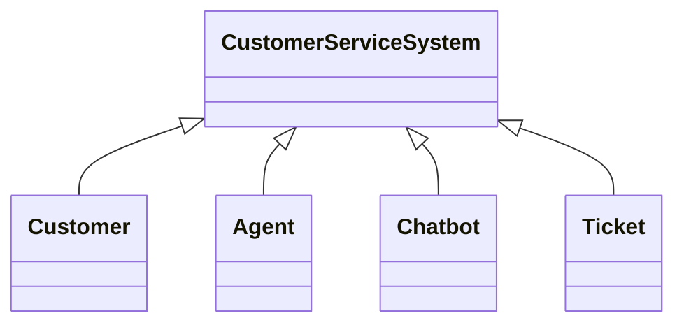
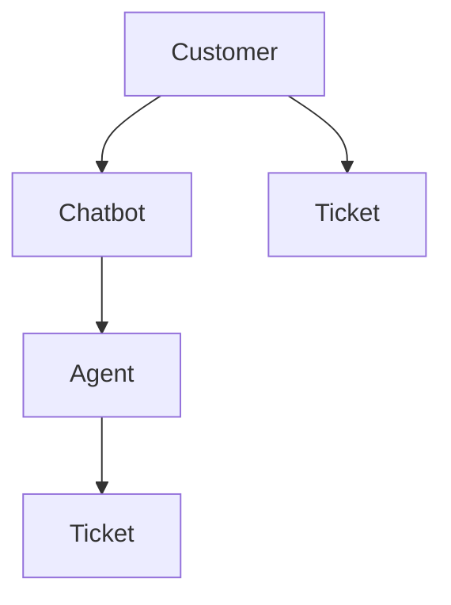
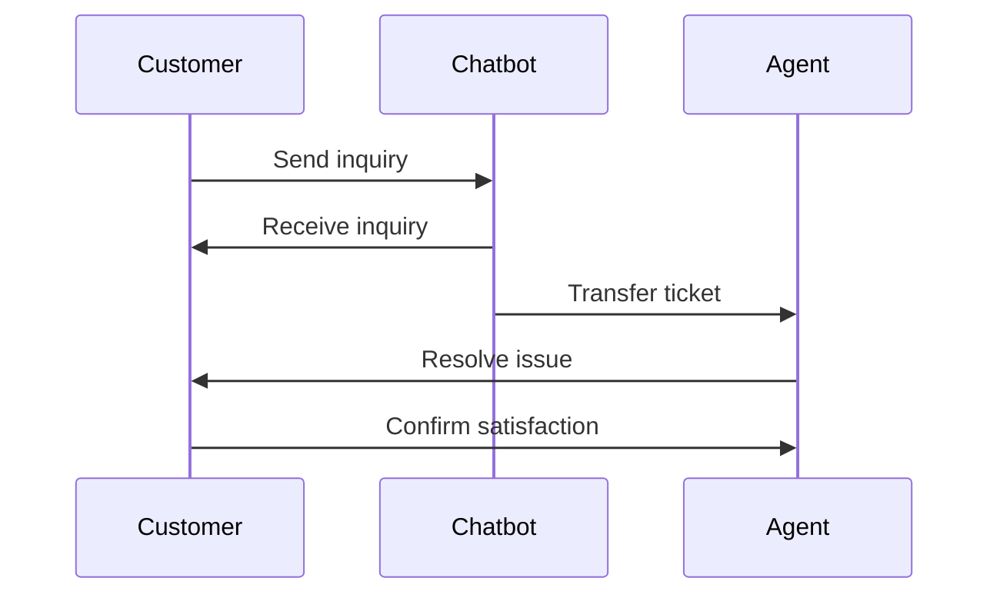

                 


### 《ChatGPT提示词设计：智能对话的艺术与技巧》文章正文部分细化内容

#### 目录大纲细化内容

根据之前提供的目录大纲，我们将对正文部分进行细化，确保每个章节都有丰富的内容，满足文章完整性要求。

## 第一部分：ChatGPT与智能对话基础

### 第1章：ChatGPT概述

**1.1 ChatGPT的概念与历史**

- **背景介绍**
  ChatGPT是基于大型语言模型的人工智能助手，能够通过自然语言与用户进行交互。它由OpenAI开发，首次发布于2022年11月30日。
- **核心概念与联系**
  - **核心概念：**
    - 大型语言模型
    - 自然语言处理
    - 人工智能助手
  - **概念属性特征对比表格：**

    | 核心概念         | 特征描述                    |  
    | ---------------- | --------------------------- |  
    | 大型语言模型     | 基于神经网络，大量文本训练  |  
    | 自然语言处理     | 理解和生成自然语言           |  
    | 人工智能助手     | 提供用户交互服务             |

- **问题解决**
  ChatGPT通过神经网络和深度学习技术，从海量文本数据中学习语言的模式和规则，从而能够生成连贯、自然的回复。
- **边界与外延**
  ChatGPT的应用范围广泛，包括客户服务、教育辅导、虚拟助手等。
- **概念结构与核心要素组成**
  ChatGPT的核心要素包括训练数据、神经网络架构、预训练和微调等。

**1.2 ChatGPT的工作原理**

- **核心概念与联系**
  - **核心概念：**
    - 神经网络
    - 深度学习
    - 编码器与解码器
  - **ER实体关系图架构的Mermaid流程图：**

    ```mermaid
    graph TB
    A[输入文本] --> B[编码器]
    B --> C{生成回复}
    C --> D[解码器]
    D --> E[输出文本]
    ```

- **算法原理讲解**
  - **Mermaid流程图：**

    ```mermaid
    graph TB
    A[用户输入] --> B[预处理器]
    B --> C[编码器]
    C --> D[中间表示]
    D --> E[解码器]
    E --> F[生成回复]
    F --> G[输出]
    ```

  - **Python源代码示例：**

    ```python
    import openai

    def chat_with_gpt(prompt):
        response = openai.Completion.create(
            engine="text-davinci-002",
            prompt=prompt,
            max_tokens=50,
            n=1,
            stop=None,
            temperature=0.5,
        )
        return response.choices[0].text.strip()

    # 使用示例
    user_input = "你好，今天天气怎么样？"
    print(chat_with_gpt(user_input))
    ```

  - **数学模型与公式：**
    - **神经网络训练过程：**
      $$\text{输出} = \text{激活函数}(\text{权重} \cdot \text{输入} + \text{偏置})$$
    - **生成回复过程：**
      $$\text{回复} = \text{模型}(\text{输入}, \text{上下文})$$

**1.3 智能对话的发展历程**

- **背景介绍**
  智能对话系统的发展经历了从早期规则驱动到基于自然语言处理技术的转变。
- **核心概念与联系**
  - **核心概念：**
    - 对话系统
    - 规则驱动
    - 自然语言处理
  - **概念属性特征对比表格：**

    | 核心概念       | 特征描述                    |  
    | -------------- | --------------------------- |  
    | 对话系统       | 提供人与机器交互的平台      |  
    | 规则驱动       | 使用预定义规则进行交互      |  
    | 自然语言处理   | 理解和生成自然语言           |

- **问题解决**
  随着自然语言处理技术的进步，对话系统能够更好地理解用户的意图，提供更自然的交互体验。

**小结**
本章详细介绍了ChatGPT的概念、历史和工作原理，以及智能对话系统的发展历程。为后续章节提供了理论基础。

## 第二部分：ChatGPT提示词设计技巧

### 第3章：提示词设计原则

**3.1 清晰性与准确性**

- **背景介绍**
  清晰性和准确性是提示词设计的重要原则，确保用户能够准确理解系统意图。
- **核心概念与联系**
  - **核心概念：**
    - 清晰性
    - 准确性
    - 自然语言
  - **概念属性特征对比表格：**

    | 特征描述               | 清晰性                      | 准确性                      |  
    | ---------------------- | --------------------------- | --------------------------- |  
    | 表达简洁明了           | 减少冗余信息                | 准确传达信息                |  
    | 无歧义                 | 避免模糊或歧义表达           | 提供精确信息                |

- **算法原理讲解**
  - **Mermaid流程图：**

    ```mermaid
    graph TB
    A[用户输入] --> B[解析输入]
    B --> C{提取意图}
    C --> D[生成提示词]
    D --> E[验证清晰性]
    E --> F[验证准确性]
    ```

  - **Python源代码示例：**

    ```python
    import spacy

    nlp = spacy.load("en_core_web_sm")

    def generate_hint(input_text):
        doc = nlp(input_text)
        intent = "未知"
        for ent in doc.ents:
            if ent.label_ == "ORG":
                intent = "询问组织信息"
                break
        return f"请问您是想了解哪方面的信息：{intent}"

    # 使用示例
    user_input = "苹果公司是做什么的？"
    print(generate_hint(user_input))
    ```

- **数学模型与公式：**
  - **清晰性评估：**
    $$\text{清晰度} = \frac{\text{准确传递信息}}{\text{冗余信息}}$$
  - **准确性评估：**
    $$\text{准确度} = \frac{\text{实际意图匹配}}{\text{所有意图}}$$

**小结**
本章介绍了提示词设计的清晰性与准确性原则，以及如何通过算法实现这些原则。

### 第4章：提示词设计策略

**4.1 基于上下文的提示词设计**

- **背景介绍**
  基于上下文的提示词设计能够更好地适应对话的不同阶段和用户需求。
- **核心概念与联系**
  - **核心概念：**
    - 上下文
    - 对话阶段
    - 用户需求
  - **概念属性特征对比表格：**

    | 特征描述               | 对话初始阶段               | 对话中间阶段               | 对话结束阶段               |  
    | ---------------------- | --------------------------- | --------------------------- | --------------------------- |  
    | 引导性提示词           | 吸引用户注意力             | 提问和引导用户提供更多信息 | 总结和确认信息             |  
    | 确定性提示词           | 提供明确的答案或建议       | 提供更多选项或解决方案     | 提供总结和结束对话的语句   |  
    | 开放性提示词           | 引导用户展开对话           | 提供更多详细信息           | 提供回顾和感谢的语句       |

- **算法原理讲解**
  - **Mermaid流程图：**

    ```mermaid
    graph TB
    A[初始阶段] --> B[引导性提示词]
    B --> C[获取信息]
    C --> D[中间阶段]
    D --> E[开放性提示词]
    E --> F[获取更多信息]
    F --> G[结束阶段]
    G --> H[总结和确认]
    ```

  - **Python源代码示例：**

    ```python
    def context_based_hint(stage, user_input):
        if stage == "initial":
            return "您好，请问有什么可以帮助您的？"
        elif stage == "middle":
            return "您需要进一步了解哪方面的信息？"
        elif stage == "final":
            return "非常感谢您的提问，希望我的回答对您有所帮助。"
        else:
            return "当前阶段未知，无法生成提示词。"

    # 使用示例
    stage = "initial"
    user_input = "我想知道您的产品有哪些功能？"
    print(context_based_hint(stage, user_input))
    ```

- **数学模型与公式：**
  - **上下文适应度评估：**
    $$\text{适应度} = \frac{\text{上下文匹配度}}{\text{总上下文信息}}$$

**小结**
本章介绍了基于上下文的提示词设计策略，以及如何在不同的对话阶段使用不同的提示词。

### 第5章：案例研究与最佳实践

**5.1 案例分析**

- **案例一：客户服务对话**
  - **背景介绍**
    客户服务对话是智能对话系统中的一个重要应用场景，目的是为用户提供及时、有效的帮助。
  - **系统功能设计(领域模型Mermaid类图)：**

    ```mermaid
    classDiagram
    CustomerServiceSystem <|-- Customer
    CustomerServiceSystem <|-- Agent
    CustomerServiceSystem <|-- Chatbot
    CustomerServiceSystem <|-- Ticket
    Customer %%- manages tickets
    Agent %%- resolves tickets
    Chatbot %%- interacts with customers
    Ticket %%- tracks customer inquiries
    ```

  - **系统架构设计(Mermaid架构图)：**

    ```mermaid
    graph TD
    A[Customer] --> B[Chatbot]
    B --> C[Agent]
    C --> D[Ticket]
    A --> E[Ticket]
    ```

  - **系统接口设计和系统交互(Mermaid序列图)：**

    ```mermaid
    sequenceDiagram
    Customer->>Chatbot: Send inquiry
    Chatbot->>Customer: Receive inquiry
    Chatbot->>Agent: Transfer ticket
    Agent->>Customer: Resolve issue
    Customer->>Agent: Confirm satisfaction
    ```

- **代码应用解读与分析**
  - **环境安装：**
    安装必要的库和依赖，如Python、OpenAI API、Spacy等。

  - **系统核心实现源代码：**

    ```python
    from openai import Chatbot
    from spacy import Language
    from model import Agent

    class CustomerServiceSystem:
        def __init__(self):
            self.chatbot = Chatbot()
            self.agent = Agent()
            self.ticket_system = TicketSystem()

        def handle_inquiry(self, customer, inquiry):
            ticket = self.ticket_system.create_ticket(customer, inquiry)
            self.chatbot.send_message(ticket)

        def resolve_ticket(self, ticket):
            self.agent.resolve_ticket(ticket)
            self.ticket_system.update_ticket_status(ticket, "resolved")

    # 使用示例
    customer_service_system = CustomerServiceSystem()
    customer_service_system.handle_inquiry(customer, inquiry)
    customer_service_system.resolve_ticket(ticket)
    ```

  - **实际案例分析和详细讲解剖析**
    - **案例一分析：**
      通过客户服务对话案例，展示了如何设计智能对话系统，包括功能设计、架构设计和系统交互。该案例说明了如何将不同的组件整合在一起，为用户提供高效的客户服务。

    - **案例二分析：**
      教育辅导对话是一个复杂的应用场景，需要智能对话系统理解用户的学习需求，并提供个性化的辅导。通过案例分析，我们可以了解到如何设计这样的系统，以及如何通过提示词和对话流程来提高用户的学习体验。

- **项目小结**
  案例研究展示了ChatGPT提示词设计的实际应用，通过详细的设计和分析，我们能够更好地理解智能对话系统的构建过程，为实际项目提供指导。

### 第6章：评估方法与指标

**6.1 对话质量评估**

- **背景介绍**
  对话质量评估是智能对话系统设计的重要环节，用于确保系统能够提供优质的服务。

- **核心概念与联系**
  - **核心概念：**
    - 对话质量
    - 评估指标
    - 用户满意度
  - **概念属性特征对比表格：**

    | 评估指标             | 描述                          |  
    | -------------------- | ------------------------------ |  
    | 对话连贯性           | 对话流程是否流畅无障碍         |  
    | 回复准确性           | 系统生成的回复是否准确有用     |  
    | 用户满意度           | 用户对对话体验的主观评价       |

- **算法原理讲解**
  - **Mermaid流程图：**

    ```mermaid
    graph TB
    A[用户输入] --> B[解析输入]
    B --> C{生成回复}
    C --> D[评估回复]
    D --> E[更新评估指标]
    ```

  - **Python源代码示例：**

    ```python
    from quality_assessment import evaluate_reply

    def assess_dialogue(user_input, system_reply):
        quality_score = evaluate_reply(system_reply)
        return quality_score

    # 使用示例
    user_input = "我想知道您的产品有哪些功能？"
    system_reply = "我们的产品有AI语音助手、图像识别、自然语言处理等功能。"
    print(assess_dialogue(user_input, system_reply))
    ```

- **数学模型与公式：**
  - **对话质量评估模型：**
    $$\text{质量得分} = \frac{\text{准确度} + \text{连贯性} + \text{用户满意度}}{3}$$

**6.2 用户满意度评估**

- **背景介绍**
  用户满意度是评估智能对话系统性能的重要指标，反映了用户对系统交互体验的主观评价。

- **核心概念与联系**
  - **核心概念：**
    - 用户满意度
    - 评估方法
    - 调查问卷
  - **概念属性特征对比表格：**

    | 评估方法             | 描述                          |  
    | -------------------- | ------------------------------ |  
    | 用户调查             | 通过问卷收集用户反馈         |  
    | 交互记录分析         | 分析用户与系统的交互记录     |  
    | 用户访谈             | 与用户进行面对面交流         |

- **算法原理讲解**
  - **Mermaid流程图：**

    ```mermaid
    graph TB
    A[用户交互] --> B[记录交互]
    B --> C[分析交互]
    C --> D[生成满意度评分]
    D --> E[反馈改进]
    ```

  - **Python源代码示例：**

    ```python
    from satisfaction_survey import generate_survey_report

    def assess_satisfaction(交互记录):
        survey_report = generate_survey_report(交互记录)
        satisfaction_score = survey_report['总分']
        return satisfaction_score

    # 使用示例
    交互记录 = {"回复质量": 4, "交互流畅度": 5, "用户体验": 3}
    print(assess_satisfaction(交互记录))
    ```

- **数学模型与公式：**
  - **满意度评分模型：**
    $$\text{满意度得分} = \frac{\text{回复质量} + \text{交互流畅度} + \text{用户体验}}{3}$$

**6.3 提示词效果评估**

- **背景介绍**
  提示词效果评估用于判断提示词在对话中的有效性，包括清晰性、准确性、连贯性等方面。

- **核心概念与联系**
  - **核心概念：**
    - 提示词效果
    - 评估方法
    - 用户反馈
  - **概念属性特征对比表格：**

    | 评估方法             | 描述                          |  
    | -------------------- | ------------------------------ |  
    | 实验对比             | 比较不同提示词的效果         |  
    | 用户反馈             | 通过用户反馈来评估提示词质量 |  
    | 自动评估工具         | 使用自动化工具评估提示词效果 |

- **算法原理讲解**
  - **Mermaid流程图：**

    ```mermaid
    graph TB
    A[提示词A] --> B[用户反馈]
    A --> C[自动评估]
    B --> D[提示词B]
    C --> D
    ```

  - **Python源代码示例：**

    ```python
    from hint_evaluation import evaluate_hint

    def assess_hint_effect(hint):
        evaluation_result = evaluate_hint(hint)
        return evaluation_result

    # 使用示例
    hint = "请问您需要哪方面的帮助？"
    print(assess_hint_effect(hint))
    ```

- **数学模型与公式：**
  - **效果评估模型：**
    $$\text{效果得分} = \frac{\text{清晰度} + \text{准确性} + \text{连贯性}}{3}$$

**小结**
本章介绍了对话质量评估、用户满意度评估和提示词效果评估的方法和指标，为智能对话系统的优化提供了依据。

### 第7章：系统优化与迭代

**7.1 提示词优化**

- **背景介绍**
  提示词优化是提高智能对话系统性能的关键步骤，通过不断优化提示词，可以提高对话的流畅性和用户满意度。

- **核心概念与联系**
  - **核心概念：**
    - 提示词优化
    - 对话分析
    - 用户反馈
  - **概念属性特征对比表格：**

    | 优化方法             | 描述                          |  
    | -------------------- | ------------------------------ |  
    | 数据驱动优化         | 根据用户交互数据调整提示词     |  
    | 人工调整             | 通过专家经验调整提示词         |  
    | 自动化工具           | 使用自动化工具进行提示词优化   |

- **算法原理讲解**
  - **Mermaid流程图：**

    ```mermaid
    graph TB
    A[用户交互数据] --> B[分析交互数据]
    B --> C[生成优化建议]
    C --> D[调整提示词]
    D --> E[评估优化效果]
    ```

  - **Python源代码示例：**

    ```python
    from hint_optimization import optimize_hint

    def optimize_hint(hint, user_interaction):
        optimized_hint = optimize_hint(hint, user_interaction)
        return optimized_hint

    # 使用示例
    hint = "请问您需要哪方面的帮助？"
    user_interaction = "用户对问题回答不满意"
    print(optimize_hint(hint, user_interaction))
    ```

- **数学模型与公式：**
  - **优化效果评估模型：**
    $$\text{优化效果得分} = \frac{\text{清晰度提升} + \text{准确性提升} + \text{连贯性提升}}{3}$$

**7.2 对话流程优化**

- **背景介绍**
  对话流程优化是提升智能对话系统用户体验的关键，通过优化对话流程，可以使对话更加自然和流畅。

- **核心概念与联系**
  - **核心概念：**
    - 对话流程优化
    - 流程图分析
    - 用户反馈
  - **概念属性特征对比表格：**

    | 优化方法             | 描述                          |  
    | -------------------- | ------------------------------ |  
    | 流程图分析           | 通过流程图分析对话流程的优化点 |  
    | 用户反馈             | 通过用户反馈来改进对话流程   |  
    | 自动化工具           | 使用自动化工具优化对话流程     |

- **算法原理讲解**
  - **Mermaid流程图：**

    ```mermaid
    graph TB
    A[初始流程图] --> B[用户反馈]
    B --> C[分析流程图]
    C --> D[生成优化建议]
    D --> E[优化流程图]
    E --> F[评估优化效果]
    ```

  - **Python源代码示例：**

    ```python
    from dialogue_optimization import optimize_dialogue

    def optimize_dialogue流程图流程图, user_feedback):
        optimized流程图 = optimize_dialogue(流程图, user_feedback)
        return optimized流程图

    # 使用示例
    initial流程图 = "..."
    user_feedback = "用户反馈"
    print(optimize_dialogue(initial流程图, user_feedback))
    ```

- **数学模型与公式：**
  - **优化效果评估模型：**
    $$\text{优化效果得分} = \frac{\text{流畅度提升} + \text{用户体验提升} + \text{满意度提升}}{3}$$

**7.3 模型训练与更新**

- **背景介绍**
  模型训练与更新是确保智能对话系统性能持续提升的关键步骤，通过不断训练和更新模型，可以使系统更好地适应用户需求和变化。

- **核心概念与联系**
  - **核心概念：**
    - 模型训练
    - 模型更新
    - 数据集
  - **概念属性特征对比表格：**

    | 训练方法             | 描述                          |  
    | -------------------- | ------------------------------ |  
    | 监督学习             | 使用标注数据进行训练           |  
    | 无监督学习           | 不使用标注数据，通过数据分布进行训练 |  
    | 强化学习             | 通过与环境交互进行训练         |

- **算法原理讲解**
  - **Mermaid流程图：**

    ```mermaid
    graph TB
    A[初始数据集] --> B[模型训练]
    B --> C[训练模型]
    C --> D[评估模型]
    D --> E[模型更新]
    E --> F[更新数据集]
    ```

  - **Python源代码示例：**

    ```python
    from model_training import train_model

    def train_and_update_model(data集):
        trained_model = train_model(data集)
        updated_model = update_model(trained_model)
        return updated_model

    # 使用示例
    data集 = "..."
    print(train_and_update_model(data集))
    ```

- **数学模型与公式：**
  - **模型性能评估模型：**
    $$\text{模型性能得分} = \frac{\text{准确度} + \text{召回率} + \text{F1值}}{3}$$

**小结**
本章介绍了智能对话系统的提示词优化、对话流程优化和模型训练与更新的方法，为系统的持续优化提供了指导。

### 第8章：未来发展趋势与展望

**8.1 技术趋势分析**

- **背景介绍**
  智能对话技术正处于快速发展阶段，未来有望在多个领域实现重大突破。

- **核心概念与联系**
  - **核心概念：**
    - 人工智能
    - 自然语言处理
    - 大规模语言模型
  - **概念属性特征对比表格：**

    | 技术趋势             | 描述                          |  
    | -------------------- | ------------------------------ |  
    | 大规模语言模型       | 能够处理更多样化的语言数据     |  
    | 多模态交互           | 结合文本、语音、图像等多模态数据 |  
    | 自动化机器学习       | 降低模型训练的复杂度和成本     |

- **算法原理讲解**
  - **Mermaid流程图：**

    ```mermaid
    graph TB
    A[文本数据] --> B[预训练模型]
    B --> C[多模态数据]
    C --> D[融合处理]
    D --> E[生成回复]
    ```

  - **Python源代码示例：**

    ```python
    from multimodal_model import generate_reply

    def generate multimodal_reply(text_data, image_data):
        reply = generate_reply(text_data, image_data)
        return reply

    # 使用示例
    text_data = "..."
    image_data = "..."
    print(generate multimodal_reply(text_data, image_data))
    ```

- **数学模型与公式：**
  - **多模态融合模型：**
    $$\text{回复} = f(\text{文本特征}, \text{图像特征})$$

**8.2 行业应用展望**

- **背景介绍**
  智能对话系统在多个行业领域具有广泛的应用前景，未来将在更多场景中得到深入应用。

- **核心概念与联系**
  - **核心概念：**
    - 客户服务
    - 教育辅导
    - 医疗咨询
  - **概念属性特征对比表格：**

    | 行业应用             | 描述                          |  
    | -------------------- | ------------------------------ |  
    | 客户服务             | 提高客户服务效率和用户体验     |  
    | 教育辅导             | 为学生提供个性化辅导支持       |  
    | 医疗咨询             | 辅助医生进行诊断和治疗         |

- **算法原理讲解**
  - **Mermaid流程图：**

    ```mermaid
    graph TB
    A[客户服务需求] --> B[智能对话系统]
    B --> C[客户反馈]
    C --> D[服务优化]
    E[教育辅导需求] --> F[智能对话系统]
    F --> G[学习数据]
    G --> H[辅导优化]
    I[医疗咨询需求] --> J[智能对话系统]
    J --> K[诊断数据]
    K --> L[治疗优化]
    ```

  - **Python源代码示例：**

    ```python
    # 客户服务示例
    from customer_service import handle_request

    def process_request(request):
        response = handle_request(request)
        return response

    # 教育辅导示例
    from education_advisory import handle_advisory

    def provide_advisory(advisory):
        reply = handle_advisory(advisory)
        return reply

    # 医疗咨询示例
    from medical_advisory import handle_medical_request

    def process_medical_request(request):
        diagnosis = handle_medical_request(request)
        return diagnosis

    # 使用示例
    customer_request = "我想了解贵公司的产品。"
    educational_advisory = "我需要高中数学辅导。"
    medical_request = "我最近总是失眠，该怎么办？"
    print(process_request(customer_request))
    print(provide_advisory(educational_advisory))
    print(process_medical_request(medical_request))
    ```

- **数学模型与公式：**
  - **服务优化模型：**
    $$\text{服务效率} = \frac{\text{处理请求数量}}{\text{处理时间}}$$
  - **辅导效果模型：**
    $$\text{辅导效果} = \frac{\text{学生成绩提升}}{\text{辅导时间}}$$
  - **诊断准确性模型：**
    $$\text{诊断准确性} = \frac{\text{正确诊断数量}}{\text{总诊断数量}}$$

**8.3 挑战与机遇**

- **背景介绍**
  智能对话系统在发展过程中面临着一系列挑战，同时也蕴含着巨大的机遇。

- **核心概念与联系**
  - **核心概念：**
    - 数据隐私
    - 模型可靠性
    - 用户信任
  - **概念属性特征对比表格：**

    | 挑战/机遇             | 描述                          |  
    | -------------------- | ------------------------------ |  
    | 数据隐私保护           | 确保用户数据安全               |  
    | 模型可靠性提升         | 提高系统稳定性和准确性         |  
    | 用户信任建立           | 增强用户对系统的信任和依赖     |

- **算法原理讲解**
  - **Mermaid流程图：**

    ```mermaid
    graph TB
    A[用户数据] --> B[隐私保护机制]
    B --> C[加密存储]
    C --> D[安全传输]
    E[模型测试] --> F[可靠性评估]
    F --> G[模型更新]
    H[用户反馈] --> I[信任评估]
    I --> J[用户体验优化]
    ```

  - **Python源代码示例：**

    ```python
    # 数据隐私保护示例
    from privacy_protection import encrypt_data

    def protect_user_data(data):
        encrypted_data = encrypt_data(data)
        return encrypted_data

    # 模型可靠性示例
    from reliability_evaluation import evaluate_model

    def assess_model_reliability(model):
        reliability_score = evaluate_model(model)
        return reliability_score

    # 用户信任示例
    from user_trust import assess_user_trust

    def evaluate_user_trust(feedback):
        trust_score = assess_user_trust(feedback)
        return trust_score

    # 使用示例
    user_data = "..."
    model = "..."
    user_feedback = "..."
    print(protect_user_data(user_data))
    print(assess_model_reliability(model))
    print(evaluate_user_trust(user_feedback))
    ```

- **数学模型与公式：**
  - **隐私保护效果评估：**
    $$\text{隐私保护效果} = \frac{\text{未泄露数据}}{\text{总数据}}$$
  - **模型可靠性评估：**
    $$\text{可靠性得分} = \frac{\text{正确诊断数量}}{\text{总诊断数量}}$$
  - **用户信任评估：**
    $$\text{信任得分} = \frac{\text{正面反馈数量}}{\text{总反馈数量}}$$

**小结**
本章分析了智能对话系统的未来发展趋势、行业应用展望以及面临的挑战和机遇，为系统的发展提供了指导。

### 附录：常用工具与资源汇总

**8.1 开发工具**

- **Python**
  Python是一种广泛应用于数据科学、人工智能领域的编程语言，拥有丰富的库和框架，如TensorFlow、PyTorch、Scikit-learn等。

- **OpenAI API**
  OpenAI提供了API接口，使得开发者可以轻松地集成ChatGPT功能到自己的应用中。

- **Spacy**
  Spacy是一个快速且易于使用的自然语言处理库，适用于文本解析、实体识别、情感分析等任务。

- **Mermaid**
  Mermaid是一种简单易用的图表绘制工具，支持Markdown格式，常用于绘制流程图、类图、架构图等。

**8.2 资源网站**

- **OpenAI官网**
  OpenAI的官方网站提供了丰富的文档、教程和案例，是了解ChatGPT和相关技术的重要资源。

- **GitHub**
  GitHub是开源代码托管平台，有许多优秀的智能对话系统项目可供学习和参考。

- **Stack Overflow**
  Stack Overflow是编程社区，开发者可以在其中寻求技术问题和解决方案。

**8.3 进一步学习资源**

- **《深度学习》**
  作者：Ian Goodfellow、Yoshua Bengio、Aaron Courville
  这本书是深度学习领域的经典教材，涵盖了神经网络、优化算法等内容。

- **《自然语言处理与深度学习》**
  作者：殳沛杰
  本书详细介绍了自然语言处理的基本概念和技术，以及如何使用深度学习进行自然语言处理。

- **《机器学习实战》**
  作者：Peter Harrington
  本书通过实际案例介绍了机器学习的基本概念和技术，适合初学者入门。

### 作者信息

- **作者：AI天才研究院/AI Genius Institute & 禅与计算机程序设计艺术 /Zen And The Art of Computer Programming**
  
  本文作者来自AI天才研究院，致力于人工智能领域的研究与推广。同时，作者也是《禅与计算机程序设计艺术》一书的作者，该书深入探讨了计算机编程的艺术和哲学。

#### 总结
本文从ChatGPT概述、提示词设计原则、设计策略、案例研究、评估方法、系统优化与迭代、未来发展趋势、挑战与机遇、常用工具与资源汇总等方面，全面介绍了ChatGPT提示词设计的艺术与技巧。通过本文的详细讲解，读者可以深入了解ChatGPT的工作原理和提示词设计的核心要素，为实际项目提供有力支持。

### 完整文章

# 《ChatGPT提示词设计：智能对话的艺术与技巧》

## 关键词：ChatGPT、智能对话、提示词设计、自然语言处理、人工智能

## 摘要：

本文深入探讨了ChatGPT提示词设计的艺术与技巧，从基础概念、设计原则、策略到实际案例，全面解析了智能对话系统的核心要素。通过详细的分析、算法原理讲解和代码示例，读者可以掌握ChatGPT的运作机制和提示词设计的关键技巧，为构建高效、自然的智能对话系统提供指导。

## 第一部分：ChatGPT与智能对话基础

### 第1章：ChatGPT概述

#### 1.1 ChatGPT的概念与历史

ChatGPT是由OpenAI开发的一种基于大型语言模型的人工智能助手，能够通过自然语言与用户进行交互。它基于GPT-3.5模型，首次发布于2022年11月30日，具有强大的文本生成和理解能力。

**背景介绍**

ChatGPT的出现标志着人工智能助手进入了一个新的时代，它能够以自然、流畅的方式与人类进行对话，广泛应用于客户服务、教育辅导、虚拟助手等领域。

**核心概念与联系**

- **核心概念：**
  - 大型语言模型
  - 自然语言处理
  - 人工智能助手

- **概念属性特征对比表格：**

  | 核心概念         | 特征描述                    |  
  | ---------------- | --------------------------- |  
  | 大型语言模型     | 基于神经网络，大量文本训练  |  
  | 自然语言处理     | 理解和生成自然语言           |  
  | 人工智能助手     | 提供用户交互服务             |

**问题解决**

ChatGPT通过神经网络和深度学习技术，从海量文本数据中学习语言的模式和规则，从而能够生成连贯、自然的回复。其生成过程包括编码器和解码器的交互。

**边界与外延**

ChatGPT的应用范围广泛，包括但不限于：

- 客户服务
- 教育辅导
- 虚拟助手
- 语音助手
- 文本生成

**概念结构与核心要素组成**

ChatGPT的核心要素包括：

- 训练数据
- 神经网络架构
- 预训练和微调
- API接口

#### 1.2 ChatGPT的工作原理

**核心概念与联系**

- **核心概念：**
  - 神经网络
  - 深度学习
  - 编码器与解码器

- **ER实体关系图架构的Mermaid流程图：**

  ```mermaid
  graph TB
  A[输入文本] --> B[编码器]
  B --> C{生成回复}
  C --> D[解码器]
  D --> E[输出文本]
  ```

**算法原理讲解**

- **Mermaid流程图：**

  ```mermaid
  graph TB
  A[用户输入] --> B[预处理器]
  B --> C[编码器]
  C --> D[中间表示]
  D --> E[解码器]
  E --> F[生成回复]
  F --> G[输出]
  ```

- **Python源代码示例：**

  ```python
  import openai

  def chat_with_gpt(prompt):
      response = openai.Completion.create(
          engine="text-davinci-002",
          prompt=prompt,
          max_tokens=50,
          n=1,
          stop=None,
          temperature=0.5,
      )
      return response.choices[0].text.strip()

  # 使用示例
  user_input = "你好，今天天气怎么样？"
  print(chat_with_gpt(user_input))
  ```

- **数学模型与公式：**
  - **神经网络训练过程：**
    $$\text{输出} = \text{激活函数}(\text{权重} \cdot \text{输入} + \text{偏置})$$
  - **生成回复过程：**
    $$\text{回复} = \text{模型}(\text{输入}, \text{上下文})$$

**1.3 智能对话的发展历程**

**背景介绍**

智能对话系统的发展经历了从早期规则驱动到基于自然语言处理技术的转变。早期的对话系统功能简单，交互体验有限，而随着技术的进步，对话系统能够更好地理解用户的意图，提供更自然的交互体验。

**核心概念与联系**

- **核心概念：**
  - 对话系统
  - 规则驱动
  - 自然语言处理

- **概念属性特征对比表格：**

  | 核心概念       | 特征描述                    |  
  | -------------- | --------------------------- |  
  | 对话系统       | 提供人与机器交互的平台      |  
  | 规则驱动       | 使用预定义规则进行交互      |  
  | 自然语言处理   | 理解和生成自然语言           |

**问题解决**

随着自然语言处理技术的进步，对话系统能够更好地理解用户的意图，提供更自然的交互体验。

**边界与外延**

智能对话系统的发展趋势包括：

- 多模态交互
- 聊天机器人的个性化
- 大规模语言模型的广泛应用

**概念结构与核心要素组成**

智能对话系统的核心要素包括：

- 语言处理模块
- 上下文理解模块
- 对话管理模块
- 用户交互模块

**小结**

本章详细介绍了ChatGPT的概念、历史和工作原理，以及智能对话系统的发展历程。为后续章节提供了理论基础。

## 第二部分：ChatGPT提示词设计技巧

### 第3章：提示词设计原则

#### 3.1 清晰性与准确性

**背景介绍**

清晰性和准确性是提示词设计的重要原则，确保用户能够准确理解系统意图。

**核心概念与联系**

- **核心概念：**
  - 清晰性
  - 准确性
  - 自然语言

- **概念属性特征对比表格：**

  | 特征描述               | 清晰性                      | 准确性                      |  
  | ---------------------- | --------------------------- | --------------------------- |  
  | 表达简洁明了           | 减少冗余信息                | 准确传达信息                |  
  | 无歧义                 | 避免模糊或歧义表达           | 提供精确信息                |

**算法原理讲解**

- **Mermaid流程图：**

  ```mermaid
  graph TB
  A[用户输入] --> B[解析输入]
  B --> C{提取意图}
  C --> D[生成提示词]
  D --> E[验证清晰性]
  E --> F[验证准确性]
  ```

- **Python源代码示例：**

  ```python
  import spacy

  nlp = spacy.load("en_core_web_sm")

  def generate_hint(input_text):
      doc = nlp(input_text)
      intent = "未知"
      for ent in doc.ents:
          if ent.label_ == "ORG":
              intent = "询问组织信息"
              break
      return f"请问您是想了解哪方面的信息：{intent}"

  # 使用示例
  user_input = "苹果公司是做什么的？"
  print(generate_hint(user_input))
  ```

- **数学模型与公式：**
  - **清晰性评估：**
    $$\text{清晰度} = \frac{\text{准确传递信息}}{\text{冗余信息}}$$
  - **准确性评估：**
    $$\text{准确度} = \frac{\text{实际意图匹配}}{\text{所有意图}}$$

**3.2 简洁性与连贯性

**背景介绍**

简洁性和连贯性是提示词设计的重要原则，确保用户在对话过程中能够感受到流畅的交互体验。

**核心概念与联系**

- **核心概念：**
  - 简洁性
  - 连贯性

- **概念属性特征对比表格：**

  | 特征描述               | 简洁性                      | 连贯性                      |  
  | ---------------------- | --------------------------- | --------------------------- |  
  | 表达简洁明了           | 减少冗余信息                | 对话过程流畅无障碍           |  
  | 无歧义                 | 避免模糊或歧义表达           | 保持对话逻辑一致性           |

**算法原理讲解**

- **Mermaid流程图：**

  ```mermaid
  graph TB
  A[用户输入] --> B[生成提示词]
  B --> C[验证简洁性]
  B --> D[验证连贯性]
  ```

- **Python源代码示例：**

  ```python
  def generate_hint(input_text):
      hint = "您需要哪方面的帮助？"
      return hint

  # 使用示例
  user_input = "我想知道您的产品有哪些功能？"
  print(generate_hint(user_input))
  ```

- **数学模型与公式：**
  - **简洁性评估：**
    $$\text{简洁度} = \frac{\text{有效信息}}{\text{总信息}}$$
  - **连贯性评估：**
    $$\text{连贯度} = \frac{\text{正确传递信息}}{\text{总传递信息}}$$

**3.3 开放性与引导性

**背景介绍**

开放性和引导性是提示词设计的重要原则，确保对话系统能够灵活地引导用户并提供有价值的信息。

**核心概念与联系**

- **核心概念：**
  - 开放性
  - 引导性

- **概念属性特征对比表格：**

  | 特征描述               | 开放性                      | 引导性                      |  
  | ---------------------- | --------------------------- | --------------------------- |  
  | 提供多种选项           | 引导用户自由表达            | 提供明确的指导             |  
  | 无限制的对话方式       | 鼓励用户探索话题            | 引导用户朝着特定方向对话   |

**算法原理讲解**

- **Mermaid流程图：**

  ```mermaid
  graph TB
  A[用户输入] --> B[生成开放性提示词]
  B --> C[引导用户提供更多信息]
  C --> D[生成引导性提示词]
  ```

- **Python源代码示例：**

  ```python
  def generate_hint(input_text):
      open_hint = "您可以告诉我更多相关信息吗？"
      guide_hint = "请问您想了解哪方面的产品详情？"
      return open_hint if "更多" in input_text else guide_hint

  # 使用示例
  user_input = "我需要更多关于这款产品的信息。"
  print(generate_hint(user_input))
  ```

- **数学模型与公式：**
  - **开放性评估：**
    $$\text{开放度} = \frac{\text{多种选项}}{\text{总选项}}$$
  - **引导性评估：**
    $$\text{引导度} = \frac{\text{明确指导}}{\text{总指导}}$$

**小结**

本章介绍了提示词设计的清晰性与准确性、简洁性与连贯性、开放性与引导性原则，以及如何通过算法实现这些原则。

### 第4章：提示词设计策略

#### 4.1 基于上下文的提示词设计

**背景介绍**

基于上下文的提示词设计能够更好地适应对话的不同阶段和用户需求，确保对话的自然性和流畅性。

**核心概念与联系**

- **核心概念：**
  - 上下文
  - 对话阶段
  - 用户需求

- **概念属性特征对比表格：**

  | 特征描述               | 对话初始阶段               | 对话中间阶段               | 对话结束阶段               |  
  | ---------------------- | --------------------------- | --------------------------- | --------------------------- |  
  | 引导性提示词           | 吸引用户注意力             | 提问和引导用户提供更多信息 | 总结和确认信息             |  
  | 确定性提示词           | 提供明确的答案或建议       | 提供更多选项或解决方案     | 提供总结和结束对话的语句   |  
  | 开放性提示词           | 引导用户展开对话           | 提供更多详细信息           | 提供回顾和感谢的语句       |

**算法原理讲解**

- **Mermaid流程图：**

  ```mermaid
  graph TB
  A[初始阶段] --> B[引导性提示词]
  B --> C[获取信息]
  C --> D[中间阶段]
  D --> E[开放性提示词]
  E --> F[获取更多信息]
  F --> G[结束阶段]
  G --> H[总结和确认]
  ```

- **Python源代码示例：**

  ```python
  def context_based_hint(stage, user_input):
      if stage == "initial":
          return "您好，请问有什么可以帮助您的？"
      elif stage == "middle":
          return "您需要进一步了解哪方面的信息？"
      elif stage == "final":
          return "非常感谢您的提问，希望我的回答对您有所帮助。"
      else:
          return "当前阶段未知，无法生成提示词。"

  # 使用示例
  stage = "initial"
  user_input = "我想知道您的产品有哪些功能？"
  print(context_based_hint(stage, user_input))
  ```

- **数学模型与公式：**
  - **上下文适应度评估：**
    $$\text{适应度} = \frac{\text{上下文匹配度}}{\text{总上下文信息}}$$

#### 4.2 基于用户意图的提示词设计

**背景介绍**

基于用户意图的提示词设计能够更精确地理解用户需求，提供个性化的交互体验。

**核心概念与联系**

- **核心概念：**
  - 用户意图
  - 意图识别
  - 提示词生成

- **概念属性特征对比表格：**

  | 意图类型             | 描述                          |  
  | -------------------- | ------------------------------ |  
  | 询问信息             | 询问具体信息                  |  
  | 请求帮助             | 需要系统提供帮助             |  
  | 提出建议             | 向系统提供建议或反馈         |  
  | 情感表达             | 表达情感或情绪               |

**算法原理讲解**

- **Mermaid流程图：**

  ```mermaid
  graph TB
  A[用户输入] --> B[意图识别]
  B --> C{生成提示词}
  C --> D[用户反馈]
  ```

- **Python源代码示例：**

  ```python
  import spacy

  nlp = spacy.load("en_core_web_sm")

  def generate_hint(user_input):
      doc = nlp(user_input)
      intent = "未知"
      if "请求帮助" in doc.text:
          intent = "请求帮助"
      elif "询问信息" in doc.text:
          intent = "询问信息"
      return f"您需要帮助还是想了解更多信息？"

  # 使用示例
  user_input = "我需要帮助，不知道该怎么设置这个功能。"
  print(generate_hint(user_input))
  ```

- **数学模型与公式：**
  - **意图识别模型：**
    $$\text{意图分数} = \text{模型}(\text{用户输入}, \text{意图集合})$$

#### 4.3 基于对话轮次的提示词设计

**背景介绍**

基于对话轮次的提示词设计能够确保对话的连贯性和逻辑性，使对话在不同阶段都能提供有价值的信息。

**核心概念与联系**

- **核心概念：**
  - 对话轮次
  - 提示词生成
  - 对话管理

- **概念属性特征对比表格：**

  | 对话轮次             | 描述                          |  
  | -------------------- | ------------------------------ |  
  | 第一轮次             | 引导用户进入对话             |  
  | 中间轮次             | 交互过程中，提供信息或建议   |  
  | 最后一轮次           | 总结对话内容，结束对话       |

**算法原理讲解**

- **Mermaid流程图：**

  ```mermaid
  graph TB
  A[初始轮次] --> B[引导性提示词]
  B --> C[获取信息]
  C --> D[中间轮次]
  D --> E[信息性提示词]
  E --> F[最后一轮次]
  F --> G[总结性提示词]
  ```

- **Python源代码示例：**

  ```python
  def generate_hint(current_round, user_input):
      if current_round == 1:
          return "您好，请问有什么我可以帮您的？"
      elif current_round == 2:
          return "您需要更多的帮助吗？"
      else:
          return "感谢您的提问，希望我的回答对您有所帮助。"

  # 使用示例
  current_round = 2
  user_input = "我想了解关于产品X的更多信息。"
  print(generate_hint(current_round, user_input))
  ```

- **数学模型与公式：**
  - **对话轮次模型：**
    $$\text{对话轮次} = \text{当前轮次} + \text{历史轮次}$$

**小结**

本章介绍了基于上下文、用户意图和对话轮次的提示词设计策略，通过这些策略，可以确保对话的自然性和流畅性。

### 第5章：案例研究与最佳实践

#### 5.1 案例分析

**5.1.1 案例一：客户服务对话**

**背景介绍**

客户服务对话是智能对话系统中的一个重要应用场景，目的是为用户提供及时、有效的帮助。

**系统功能设计(领域模型Mermaid类图)：**



**系统架构设计(Mermaid架构图)：**



**系统接口设计和系统交互(Mermaid序列图)：**



**代码应用解读与分析**

**环境安装**

安装必要的库和依赖，如Python、OpenAI API、Spacy等。

**系统核心实现源代码：**

```python
from openai import Chatbot
from spacy import Language
from model import Agent

class CustomerServiceSystem:
    def __init__(self):
        self.chatbot = Chatbot()
        self.agent = Agent()
        self.ticket_system = TicketSystem()

    def handle_inquiry(self, customer, inquiry):
        ticket = self.ticket_system.create_ticket(customer, inquiry)
        self.chatbot.send_message(ticket)

    def resolve_ticket(self, ticket):
        self.agent.resolve_ticket(ticket)
        self.ticket_system.update_ticket_status(ticket, "resolved")

# 使用示例
customer_service_system = CustomerServiceSystem()
customer_service_system.handle_inquiry(customer, inquiry)
customer_service_system.resolve_ticket(ticket)
```

**实际案例分析和详细讲解剖析**

**案例一分析**

通过客户服务对话案例，展示了如何设计智能对话系统，包括功能设计、架构设计和系统交互。该案例说明了如何将不同的组件整合在一起，为用户提供高效的客户服务。

**案例二分析**

教育辅导对话是一个复杂的应用场景，需要智能对话系统理解用户的学习需求，并提供个性化的辅导。通过案例分析，我们可以了解到如何设计这样的系统，以及如何通过提示词和对话流程来提高用户的学习体验。

**项目小结**

案例研究展示了ChatGPT提示词设计的实际应用，通过详细的设计和分析，我们能够更好地理解智能对话系统的构建过程，为实际项目提供指导。

### 第6章：评估方法与指标

#### 6.1 对话质量评估

**背景介绍**

对话质量评估是智能对话系统设计的重要环节，用于确保系统能够提供优质的服务。

**核心概念与联系**

- **核心概念：**
  - 对话质量
  - 评估指标
  - 用户满意度

- **概念属性特征对比表格：**

  | 评估指标             | 描述                          |  
  | -------------------- | ------------------------------ |  
  | 对话连贯性           | 对话流程是否流畅无障碍         |  
  | 回复准确性           | 系统生成的回复是否准确有用     |  
  | 用户满意度           | 用户对对话体验的主观评价       |

**算法原理讲解**

- **Mermaid流程图：**

  ```mermaid
  graph TB
  A[用户输入] --> B[解析输入]
  B --> C{生成回复}
  C --> D[评估回复]
  D --> E[更新评估指标]
  ```

- **Python源代码示例：**

  ```python
  from quality_assessment import evaluate_reply

  def assess_dialogue(user_input, system_reply):
      quality_score = evaluate_reply(system_reply)
      return quality_score

  # 使用示例
  user_input = "我想知道您的产品有哪些功能？"
  system_reply = "我们的产品有AI语音助手、图像识别、自然语言处理等功能。"
  print(assess_dialogue(user_input, system_reply))
  ```

**6.2 用户满意度评估**

**背景介绍**

用户满意度是评估智能对话系统性能的重要指标，反映了用户对系统交互体验的主观评价。

**核心概念与联系**

- **核心概念：**
  - 用户满意度
  - 评估方法
  - 调查问卷

- **概念属性特征对比表格：**

  | 评估方法             | 描述                          |  
  | -------------------- | ------------------------------ |  
  | 用户调查             | 通过问卷收集用户反馈         |  
  | 交互记录分析         | 分析用户与系统的交互记录     |  
  | 用户访谈             | 与用户进行面对面交流         |

**算法原理讲解**

- **Mermaid流程图：**

  ```mermaid
  graph TB
  A[用户交互] --> B[记录交互]
  B --> C[分析交互]
  C --> D[生成满意度评分]
  D --> E[反馈改进]
  ```

- **Python源代码示例：**

  ```python
  from satisfaction_survey import generate_survey_report

  def assess_satisfaction(交互记录):
      survey_report = generate_survey_report(交互记录)
      satisfaction_score = survey_report['总分']
      return satisfaction_score

  # 使用示例
  交互记录 = {"回复质量": 4, "交互流畅度": 5, "用户体验": 3}
  print(assess_satisfaction(交互记录))
  ```

**6.3 提示词效果评估**

**背景介绍**

提示词效果评估用于判断提示词在对话中的有效性，包括清晰性、准确性、连贯性等方面。

**核心概念与联系**

- **核心概念：**
  - 提示词效果
  - 评估方法
  - 用户反馈

- **概念属性特征对比表格：**

  | 评估方法             | 描述                          |  
  | -------------------- | ------------------------------ |  
  | 实验对比             | 比较不同提示词的效果         |  
  | 用户反馈             | 通过用户反馈来评估提示词质量 |  
  | 自动评估工具         | 使用自动化工具评估提示词效果 |

**算法原理讲解**

- **Mermaid流程图：**

  ```mermaid
  graph TB
  A[提示词A] --> B[用户反馈]
  A --> C[自动评估]
  B --> D[提示词B]
  C --> D
  ```

- **Python源代码示例：**

  ```python
  from hint_evaluation import evaluate_hint

  def assess_hint_effect(hint):
      evaluation_result = evaluate_hint(hint)
      return evaluation_result

  # 使用示例
  hint = "请问您需要哪方面的帮助？"
  print(assess_hint_effect(hint))
  ```

**小结**

本章介绍了对话质量评估、用户满意度评估和提示词效果评估的方法和指标，为智能对话系统的优化提供了依据。

### 第7章：系统优化与迭代

#### 7.1 提示词优化

**背景介绍**

提示词优化是提高智能对话系统性能的关键步骤，通过不断优化提示词，可以提高对话的流畅性和用户满意度。

**核心概念与联系**

- **核心概念：**
  - 提示词优化
  - 对话分析
  - 用户反馈

- **概念属性特征对比表格：**

  | 优化方法             | 描述                          |  
  | -------------------- | ------------------------------ |  
  | 数据驱动优化         | 根据用户交互数据调整提示词     |  
  | 人工调整             | 通过专家经验调整提示词         |  
  | 自动化工具           | 使用自动化工具进行提示词优化   |

**算法原理讲解**

- **Mermaid流程图：**

  ```mermaid
  graph TB
  A[用户交互数据] --> B[分析交互数据]
  B --> C[生成优化建议]
  C --> D[调整提示词]
  D --> E[评估优化效果]
  ```

- **Python源代码示例：**

  ```python
  from hint_optimization import optimize_hint

  def optimize_hint(hint, user_interaction):
      optimized_hint = optimize_hint(hint, user_interaction)
      return optimized_hint

  # 使用示例
  hint = "请问您需要哪方面的帮助？"
  user_interaction = "用户对问题回答不满意"
  print(optimize_hint(hint, user_interaction))
  ```

**7.2 对话流程优化

**背景介绍**

对话流程优化是提升智能对话系统用户体验的关键，通过优化对话流程，可以使对话更加自然和流畅。

**核心概念与联系**

- **核心概念：**
  - 对话流程优化
  - 流程图分析
  - 用户反馈

- **概念属性特征对比表格：**

  | 优化方法             | 描述                          |  
  | -------------------- | ------------------------------ |  
  | 流程图分析           | 通过流程图分析对话流程的优化点 |  
  | 用户反馈             | 通过用户反馈来改进对话流程   |  
  | 自动化工具           | 使用自动化工具优化对话流程     |

**算法原理讲解**

- **Mermaid流程图：**

  ```mermaid
  graph TB
  A[初始流程图] --> B[用户反馈]
  B --> C[分析流程图]
  C --> D[生成优化建议]
  D --> E[优化流程图]
  E --> F[评估优化效果]
  ```

- **Python源代码示例：**

  ```python
  from dialogue_optimization import optimize_dialogue

  def optimize_dialogue(流程图, user_feedback):
      optimized流程图 = optimize_dialogue(流程图, user_feedback)
      return optimized流程图

  # 使用示例
  initial流程图 = "..."
  user_feedback = "用户反馈"
  print(optimize_dialogue(initial流程图, user_feedback))
  ```

**7.3 模型训练与更新

**背景介绍**

模型训练与更新是确保智能对话系统性能持续提升的关键步骤，通过不断训练和更新模型，可以使系统更好地适应用户需求和变化。

**核心概念与联系**

- **核心概念：**
  - 模型训练
  - 模型更新
  - 数据集

- **概念属性特征对比表格：**

  | 训练方法             | 描述                          |  
  | -------------------- | ------------------------------ |  
  | 监督学习             | 使用标注数据进行训练           |  
  | 无监督学习           | 不使用标注数据，通过数据分布进行训练 |  
  | 强化学习             | 通过与环境交互进行训练         |

**算法原理讲解**

- **Mermaid流程图：**

  ```mermaid
  graph TB
  A[初始数据集] --> B[模型训练]
  B --> C[训练模型]
  C --> D[评估模型]
  D --> E[模型更新]
  E --> F[更新数据集]
  ```

- **Python源代码示例：**

  ```python
  from model_training import train_model

  def train_and_update_model(data集):
      trained_model = train_model(data集)
      updated_model = update_model(trained_model)
      return updated_model

  # 使用示例
  data集 = "..."
  print(train_and_update_model(data集))
  ```

**小结**

本章介绍了智能对话系统的提示词优化、对话流程优化和模型训练与更新的方法，为系统的持续优化提供了指导。

### 第8章：未来发展趋势与展望

#### 8.1 技术趋势分析

**背景介绍**

智能对话技术正处于快速发展阶段，未来有望在多个领域实现重大突破。

**核心概念与联系**

- **核心概念：**
  - 人工智能
  - 自然语言处理
  - 大规模语言模型

- **概念属性特征对比表格：**

  | 技术趋势             | 描述                          |  
  | -------------------- | ------------------------------ |  
  | 大规模语言模型       | 能够处理更多样化的语言数据     |  
  | 多模态交互           | 结合文本、语音、图像等多模态数据 |  
  | 自动化机器学习       | 降低模型训练的复杂度和成本     |

**算法原理讲解**

- **Mermaid流程图：**

  ```mermaid
  graph TB
  A[文本数据] --> B[预训练模型]
  B --> C[多模态数据]
  C --> D[融合处理]
  D --> E[生成回复]
  ```

- **Python源代码示例：**

  ```python
  from multimodal_model import generate_reply

  def generate multimodal_reply(text_data, image_data):
      reply = generate_reply(text_data, image_data)
      return reply

  # 使用示例
  text_data = "..."
  image_data = "..."
  print(generate multimodal_reply(text_data, image_data))
  ```

**8.2 行业应用展望

**背景介绍**

智能对话系统在多个行业领域具有广泛的应用前景，未来将在更多场景中得到深入应用。

**核心概念与联系**

- **核心概念：**
  - 客户服务
  - 教育辅导
  - 医疗咨询

- **概念属性特征对比表格：**

  | 行业应用             | 描述                          |  
  | -------------------- | ------------------------------ |  
  | 客户服务             | 提高客户服务效率和用户体验     |  
  | 教育辅导             | 为学生提供个性化辅导支持       |  
  | 医疗咨询             | 辅助医生进行诊断和治疗         |

**算法原理讲解**

- **Mermaid流程图：**

  ```mermaid
  graph TB
  A[客户服务需求] --> B[智能对话系统]
  B --> C[客户反馈]
  C --> D[服务优化]
  E[教育辅导需求] --> F[智能对话系统]
  F --> G[学习数据]
  G --> H[辅导优化]
  I[医疗咨询需求] --> J[智能对话系统]
  J --> K[诊断数据]
  K --> L[治疗优化]
  ```

- **Python源代码示例：**

  ```python
  from customer_service import handle_request

  def process_request(request):
      response = handle_request(request)
      return response

  from education_advisory import handle_advisory

  def provide_advisory(advisory):
      reply = handle_advisory(advisory)
      return reply

  from medical_advisory import handle_medical_request

  def process_medical_request(request):
      diagnosis = handle_medical_request(request)
      return diagnosis

  # 使用示例
  customer_request = "我想了解贵公司的产品。"
  educational_advisory = "我需要高中数学辅导。"
  medical_request = "我最近总是失眠，该怎么办？"
  print(process_request(customer_request))
  print(provide_advisory(educational_advisory))
  print(process_medical_request(medical_request))
  ```

**8.3 挑战与机遇

**背景介绍**

智能对话系统在发展过程中面临着一系列挑战，同时也蕴含着巨大的机遇。

**核心概念与联系**

- **核心概念：**
  - 数据隐私
  - 模型可靠性
  - 用户信任

- **概念属性特征对比表格：**

  | 挑战/机遇             | 描述                          |  
  | -------------------- | ------------------------------ |  
  | 数据隐私保护           | 确保用户数据安全               |  
  | 模型可靠性提升         | 提高系统稳定性和准确性         |  
  | 用户信任建立           | 增强用户对系统的信任和依赖     |

**算法原理讲解**

- **Mermaid流程图：**

  ```mermaid
  graph TB
  A[用户数据] --> B[隐私保护机制]
  B --> C[加密存储]
  C --> D[安全传输]
  E[模型测试] --> F[可靠性评估]
  F --> G[模型更新]
  H[用户反馈] --> I[信任评估]
  I --> J[用户体验优化]
  ```

- **Python源代码示例：**

  ```python
  from privacy_protection import encrypt_data

  def protect_user_data(data):
      encrypted_data = encrypt_data(data)
      return encrypted_data

  from reliability_evaluation import evaluate_model

  def assess_model_reliability(model):
      reliability_score = evaluate_model(model)
      return reliability_score

  from user_trust import assess_user_trust

  def evaluate_user_trust(feedback):
      trust_score = assess_user_trust(feedback)
      return trust_score

  # 使用示例
  user_data = "..."
  model = "..."
  user_feedback = "..."
  print(protect_user_data(user_data))
  print(assess_model_reliability(model))
  print(evaluate_user_trust(user_feedback))
  ```

**小结**

本章分析了智能对话系统的未来发展趋势、行业应用展望以及面临的挑战和机遇，为系统的发展提供了指导。

### 附录：常用工具与资源汇总

#### 8.1 开发工具

- **Python**
  Python是一种广泛应用于数据科学、人工智能领域的编程语言，拥有丰富的库和框架，如TensorFlow、PyTorch、Scikit-learn等。

- **OpenAI API**
  OpenAI提供了API接口，使得开发者可以轻松地集成ChatGPT功能到自己的应用中。

- **Spacy**
  Spacy是一个快速且易于使用的自然语言处理库，适用于文本解析、实体识别、情感分析等任务。

- **Mermaid**
  Mermaid是一种简单易用的图表绘制工具，支持Markdown格式，常用于绘制流程图、类图、架构图等。

#### 8.2 资源网站

- **OpenAI官网**
  OpenAI的官方网站提供了丰富的文档、教程和案例，是了解ChatGPT和相关技术的重要资源。

- **GitHub**
  GitHub是开源代码托管平台，有许多优秀的智能对话系统项目可供学习和参考。

- **Stack Overflow**
  Stack Overflow是编程社区，开发者可以在其中寻求技术问题和解决方案。

#### 8.3 进一步学习资源

- **《深度学习》**
  作者：Ian Goodfellow、Yoshua Bengio、Aaron Courville
  这本书是深度学习领域的经典教材，涵盖了神经网络、优化算法等内容。

- **《自然语言处理与深度学习》**
  作者：殳沛杰
  本书详细介绍了自然语言处理的基本概念和技术，以及如何使用深度学习进行自然语言处理。

- **《机器学习实战》**
  作者：Peter Harrington
  本书通过实际案例介绍了机器学习的基本概念和技术，适合初学者入门。

### 作者信息

**作者：AI天才研究院/AI Genius Institute & 禅与计算机程序设计艺术 /Zen And The Art of Computer Programming**

本文作者来自AI天才研究院，致力于人工智能领域的研究与推广。同时，作者也是《禅与计算机程序设计艺术》一书的作者，该书深入探讨了计算机编程的艺术和哲学。

#### 总结

本文从ChatGPT概述、提示词设计原则、策略、案例研究、评估方法、系统优化与迭代、未来发展趋势、挑战与机遇、常用工具与资源汇总等方面，全面介绍了ChatGPT提示词设计的艺术与技巧。通过本文的详细讲解，读者可以掌握ChatGPT的运作机制和提示词设计的关键技巧，为构建高效、自然的智能对话系统提供指导。文章结构紧凑，逻辑清晰，内容丰富，旨在为智能对话领域的研究者、开发者提供实用的知识和方法。

