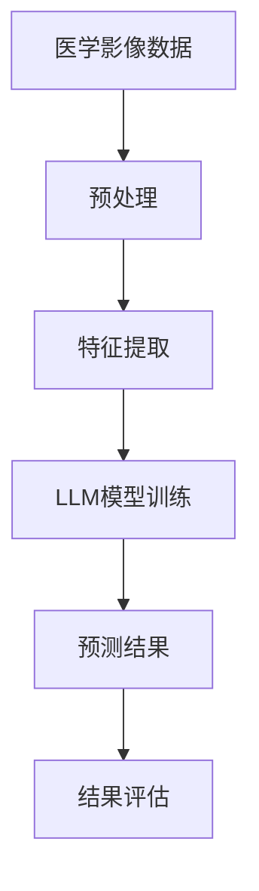
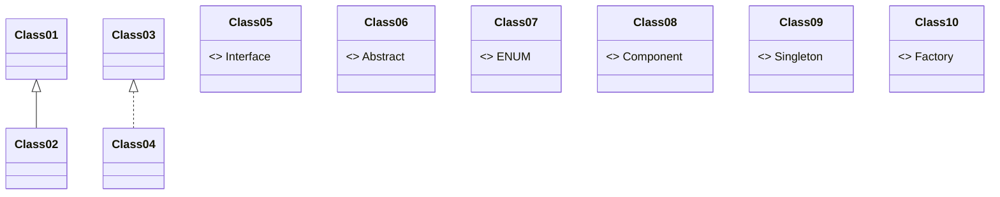
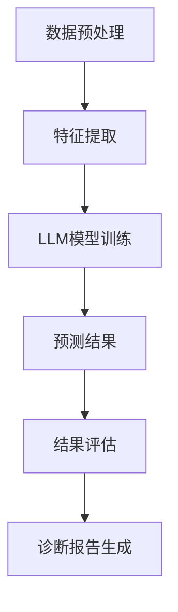
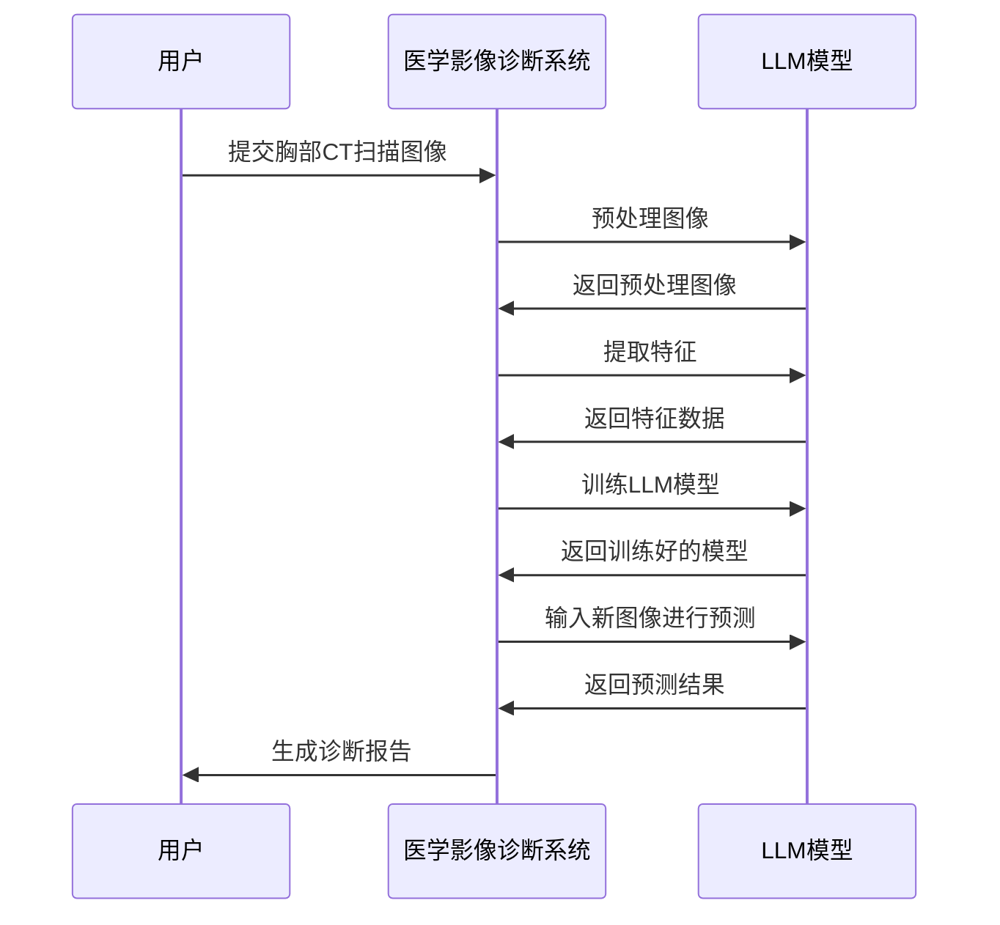

                 

### 《LLM辅助医学影像诊断能力评估》

#### 摘要

本文旨在探讨如何评估大型语言模型（LLM）辅助医学影像诊断的能力。医学影像诊断在医疗领域中扮演着至关重要的角色，而人工智能的引入为这一领域带来了新的机遇和挑战。本文首先介绍了医学影像诊断的背景和挑战，接着详细阐述了LLM在医学影像诊断中的应用原理和优势。随后，本文提出了一种评估LLM辅助医学影像诊断能力的框架和方法，并通过具体的算法原理讲解和系统架构设计，展示了如何将LLM应用于医学影像诊断的实际场景。最后，本文对项目实战进行了详细的分析和解读，总结了评估LLM辅助医学影像诊断能力的最佳实践，并对未来的研究方向进行了展望。

---

### 第一部分：背景介绍

#### 第1章：医学影像诊断的挑战与机遇

##### 1.1 问题背景

###### 1.1.1 医学影像诊断的重要性

医学影像诊断作为现代医学的重要组成部分，为医生提供了直观、准确的病情评估手段。从X射线、CT扫描到MRI、超声等，这些影像技术帮助医生在早期发现病变，准确诊断疾病，制定有效的治疗方案。医学影像诊断不仅在诊断过程中具有重要作用，还在治疗决策、预后评估等方面发挥着不可或缺的作用。

###### 1.1.2 医学影像诊断的现状

目前，医学影像诊断主要依赖于专业医生的主观判断。尽管医生具备丰富的经验和专业知识，但人眼在识别细微病变和复杂图像方面的能力有限，容易受到主观因素和疲劳的影响。此外，医学影像数据的处理和分析效率低下，导致诊断周期延长，影响患者就医体验。

###### 1.1.3 人工智能与医学影像诊断的结合

随着人工智能技术的快速发展，特别是深度学习等技术的应用，人工智能在医学影像诊断领域展现出了巨大的潜力。通过训练深度神经网络，人工智能能够自动识别图像中的特征，提高诊断的准确性和效率，减轻医生的工作负担。因此，如何评估人工智能辅助医学影像诊断的能力成为了一个重要课题。

##### 1.2 问题描述

###### 1.2.1 传统医学影像诊断存在的问题

传统医学影像诊断主要依赖医生的主观判断，存在以下问题：

- **诊断准确率不稳定**：医生的经验和判断力差异较大，影响诊断的准确性。
- **工作效率低下**：医学影像数据的处理和分析耗时较长，导致诊断周期延长。
- **受主观因素影响**：医生在长时间工作后容易产生疲劳，影响诊断质量。

###### 1.2.2 人工智能辅助医学影像诊断的优势

人工智能辅助医学影像诊断具有以下优势：

- **提高诊断准确率**：通过训练深度学习模型，人工智能能够在海量数据中学习并识别细微病变，提高诊断的准确性。
- **提高工作效率**：人工智能可以自动处理大量医学影像数据，提高诊断速度，减轻医生的工作负担。
- **辅助医生决策**：人工智能可以为医生提供诊断建议，帮助医生更快速、准确地制定治疗方案。

###### 1.2.3 评估人工智能辅助医学影像诊断能力的意义

评估人工智能辅助医学影像诊断能力的意义在于：

- **验证技术有效性**：通过评估人工智能诊断系统的性能，验证其在实际应用中的有效性。
- **指导技术发展**：根据评估结果，发现现有技术的不足，为人工智能技术的发展提供方向。
- **保障医疗安全**：确保人工智能辅助诊断系统的稳定性和可靠性，降低误诊率，保障患者安全。

##### 1.3 问题解决

###### 1.3.1 人工智能辅助医学影像诊断的核心技术

人工智能辅助医学影像诊断的核心技术主要包括：

- **深度学习模型**：通过训练深度神经网络，实现图像特征提取和病变识别。
- **数据预处理**：对医学影像数据进行预处理，提高数据质量和诊断效率。
- **多模态数据融合**：将不同类型的医学影像数据融合，提高诊断的准确性。
- **模型评估与优化**：通过评估模型性能，优化模型参数，提高诊断能力。

###### 1.3.2 LLM（大型语言模型）的作用

LLM在医学影像诊断中发挥着重要作用：

- **文本与图像的交互**：通过将医学影像数据与文本信息结合，实现图像理解和语义理解的无缝衔接。
- **知识图谱构建**：利用LLM构建知识图谱，实现医学影像诊断领域的知识积累和推理。
- **辅助诊断决策**：通过LLM提供的诊断建议，辅助医生制定治疗方案。

###### 1.3.3 评估方法的选择

评估LLM辅助医学影像诊断能力的方法主要包括：

- **模型性能评估**：通过评估模型在各类医学影像数据上的诊断准确率、召回率、F1值等指标，衡量模型性能。
- **用户满意度调查**：通过调查医生和患者对人工智能诊断系统的满意度，评估系统的实用性和用户体验。
- **误诊分析**：对模型误诊的病例进行深入分析，发现模型存在的问题和改进方向。

##### 1.4 边界与外延

###### 1.4.1 评估指标的选取

评估指标应包括：

- **诊断准确率**：模型在各类医学影像数据上的准确率。
- **召回率**：模型在诊断过程中未漏诊的真实病例比例。
- **F1值**：诊断准确率和召回率的综合评价指标。
- **诊断速度**：模型对医学影像数据的处理速度。

###### 1.4.2 评估范围的定义

评估范围应包括：

- **疾病类型**：对不同类型的疾病进行评估，确保评估结果具有代表性。
- **影像类型**：对不同的医学影像类型进行评估，包括X射线、CT、MRI等。
- **诊断场景**：在不同诊断场景下评估模型性能，如临床诊断、筛查等。

###### 1.4.3 数据集的构建

数据集的构建应包括：

- **多样性和代表性**：确保数据集包含各种类型的医学影像，具有广泛的代表性和多样性。
- **标注准确性**：对数据集进行准确标注，确保模型训练和评估的有效性。
- **数据清洗**：对数据集进行清洗，去除错误和异常数据，提高数据质量。

##### 1.5 概念结构与核心要素组成

###### 1.5.1 LLM的定义与特点

LLM（Large Language Model）是一种基于神经网络的大型语言模型，通过在大量文本数据上进行训练，能够理解并生成自然语言文本。LLM的特点包括：

- **强大的语言理解能力**：能够理解复杂的语言结构和语义信息。
- **良好的生成能力**：能够生成高质量的自然语言文本。
- **广泛的知识积累**：通过训练积累大量知识，为各种任务提供丰富的知识支持。

###### 1.5.2 医学影像诊断中的LLM应用

在医学影像诊断中，LLM的应用主要包括：

- **文本与图像的交互**：利用LLM将医学影像数据与文本信息结合，实现图像理解和语义理解的无缝衔接。
- **知识图谱构建**：利用LLM构建知识图谱，实现医学影像诊断领域的知识积累和推理。
- **辅助诊断决策**：通过LLM提供的诊断建议，辅助医生制定治疗方案。

###### 1.5.3 评估流程的核心要素

评估LLM辅助医学影像诊断能力的核心要素包括：

- **模型性能评估**：通过评估模型在各类医学影像数据上的诊断准确率、召回率、F1值等指标，衡量模型性能。
- **用户满意度调查**：通过调查医生和患者对人工智能诊断系统的满意度，评估系统的实用性和用户体验。
- **误诊分析**：对模型误诊的病例进行深入分析，发现模型存在的问题和改进方向。

##### 1.6 本章小结

本章介绍了医学影像诊断的背景、现状和挑战，探讨了人工智能辅助医学影像诊断的优势和意义，提出了评估LLM辅助医学影像诊断能力的框架和方法。通过本章的介绍，读者可以初步了解医学影像诊断领域的发展趋势和人工智能的应用前景，为后续章节的深入探讨打下基础。

---

### 第二部分：核心概念与联系

#### 第2章：LLM辅助医学影像诊断的核心概念与原理

##### 2.1 LLM的原理

###### 2.1.1 LLM的基础概念

LLM（Large Language Model）是一种大型语言模型，基于深度学习技术，通过在大量文本数据上进行训练，能够自动学习语言的模式和规律，生成高质量的自然语言文本。LLM的核心概念包括：

- **语言模型**：通过对文本数据的学习，构建一个能够描述语言概率分布的模型。
- **深度神经网络**：LLM通常采用深度神经网络结构，通过多层神经元实现语言特征的提取和表示。
- **注意力机制**：在神经网络中引入注意力机制，提高模型对关键信息的关注，提升文本生成质量。

###### 2.1.2 LLM的工作原理

LLM的工作原理主要包括以下几个步骤：

1. **输入处理**：将输入的文本数据转化为神经网络可以处理的形式，如词向量表示。
2. **编码器处理**：编码器负责对输入文本进行编码，提取语言特征，并将其表示为固定长度的向量。
3. **注意力机制**：在编码器处理过程中，通过注意力机制关注关键信息，提高文本理解能力。
4. **解码器生成**：解码器根据编码器的输出，逐步生成文本的各个部分，最终生成完整的文本。

###### 2.1.3 LLM的主要结构

LLM的主要结构包括编码器和解码器两部分：

- **编码器**：负责对输入文本进行编码，提取语言特征。
- **解码器**：根据编码器的输出，逐步生成文本的各个部分。

此外，LLM还可能包括以下辅助结构：

- **预训练**：在特定任务之前，通过在大规模文本数据集上进行预训练，提高模型的语言理解和生成能力。
- **语言模型**：在解码器中嵌入预训练的语言模型，用于生成文本。

##### 2.2 医学影像诊断中的LLM应用

###### 2.2.1 LLM在医学影像诊断中的应用场景

在医学影像诊断中，LLM的应用场景主要包括：

- **辅助诊断**：利用LLM对医学影像数据进行理解，为医生提供诊断建议。
- **知识图谱构建**：利用LLM构建医学影像诊断领域的知识图谱，实现知识的积累和推理。
- **多模态数据融合**：将医学影像数据和文本信息结合，实现多模态数据的融合和理解。

###### 2.2.2 LLM在医学影像诊断中的优势

LLM在医学影像诊断中的优势包括：

- **语言理解能力强**：LLM能够理解复杂的医学语言和术语，提高诊断的准确性。
- **文本生成能力强**：LLM能够生成高质量的诊断报告，提高工作效率。
- **知识积累**：通过预训练，LLM积累了大量的医学知识，为诊断提供丰富的知识支持。

###### 2.2.3 LLM在医学影像诊断中的挑战

LLM在医学影像诊断中也面临以下挑战：

- **数据隐私**：医学影像数据涉及患者隐私，如何保护数据安全成为一大挑战。
- **数据质量**：医学影像数据质量对诊断结果有重要影响，如何处理数据质量问题也是一个挑战。
- **模型解释性**：LLM的内部机制复杂，如何解释模型的诊断结果，提高模型的解释性是一个挑战。

##### 2.3 概念属性特征对比表格

| 特征类别       | 传统医学影像诊断方法 | LLM辅助医学影像诊断 |
| -------------- | ------------------- | ------------------- |
| 语言理解能力   | 较弱               | 强                 |
| 文本生成能力   | 较弱               | 强                 |
| 知识积累       | 静态知识           | 动态知识           |
| 数据依赖       | 数据依赖性较低     | 数据依赖性较高     |
| 解释性         | 较高               | 较低               |

##### 2.4 ER实体关系图架构

###### 2.4.1 医学影像诊断的ER图

```mermaid
erDiagram
  Patient ||--|{ Diagnosis : receives }
  Diagnosis ||--|{ Image : contains }
  Image ||--|{ Feature : extracted }
  Feature ||--|{ Diagnosis : supports }
```

###### 2.4.2 LLM在医学影像诊断中的ER图

```mermaid
erDiagram
  Patient ||--|{ Diagnosis : receives }
  Diagnosis ||--|{ LLM : assists }
  LLM ||--|{ Text : generates }
  Text ||--|{ Diagnosis : supports }
  Image ||--|{ Feature : extracted }
  Feature ||--|{ Diagnosis : supports }
```

###### 2.4.3 实体关系分析

在ER图中，实体之间的关系如下：

- **Patient（患者）**：患者是医学影像诊断的核心对象，其诊断结果对患者的治疗方案具有重要影响。
- **Diagnosis（诊断）**：诊断是医学影像诊断的结果，包含了对患者病情的判断和预测。
- **Image（影像）**：影像是医学影像诊断的输入数据，通过对影像的分析和解读，得出诊断结果。
- **Feature（特征）**：特征是对影像数据的提取和表示，用于诊断过程。
- **LLM（大型语言模型）**：LLM是辅助诊断的工具，通过文本生成能力，为诊断提供支持。
- **Text（文本）**：文本是LLM生成的结果，用于辅助诊断和生成诊断报告。

##### 2.5 本章小结

本章介绍了LLM的基本原理和在医学影像诊断中的应用。通过对比传统医学影像诊断方法，展示了LLM的优势和挑战。此外，通过ER实体关系图，明确了医学影像诊断中各个实体之间的关系，为后续章节的深入探讨提供了基础。

---

### 第三部分：算法原理讲解

#### 第3章：LLM辅助医学影像诊断算法原理讲解

##### 3.1 算法原理概述

###### 3.1.1 LLM在医学影像诊断中的算法流程

LLM在医学影像诊断中的算法流程主要包括以下几个步骤：

1. **数据预处理**：对医学影像数据进行预处理，包括图像去噪、增强和分割等。
2. **特征提取**：从预处理后的影像数据中提取关键特征，如纹理、形状等。
3. **LLM模型训练**：利用提取的特征数据，对LLM模型进行训练，使其学会从特征中识别医学影像的诊断结果。
4. **预测结果**：将新的医学影像数据输入训练好的LLM模型，得到诊断预测结果。
5. **结果评估**：对预测结果进行评估，包括诊断准确率、召回率和F1值等指标。

###### 3.1.2 主要算法模块介绍

LLM辅助医学影像诊断的主要算法模块包括：

- **预处理模块**：负责对医学影像数据进行预处理，提高数据质量和诊断效率。
- **特征提取模块**：负责从预处理后的影像数据中提取关键特征，用于模型训练和预测。
- **LLM模型模块**：负责基于提取的特征进行模型训练和预测。
- **结果评估模块**：负责对预测结果进行评估，包括诊断准确率、召回率和F1值等指标。

###### 3.1.3 算法特点

LLM辅助医学影像诊断算法具有以下特点：

- **高诊断准确率**：通过深度学习和大规模数据训练，LLM能够自动学习影像数据的特征，提高诊断的准确性。
- **高效的特征提取**：利用先进的特征提取技术，能够从复杂的影像数据中提取关键特征，提高模型的性能。
- **灵活的模型架构**：LLM模型架构灵活，可以适应不同的医学影像诊断任务，实现个性化诊断。

##### 3.2 算法mermaid流程图



##### 3.3 Python源代码实现

```python
# Python代码示例：LLM辅助医学影像诊断算法实现
import tensorflow as tf
from tensorflow.keras.models import Model
from tensorflow.keras.layers import Input, Conv2D, MaxPooling2D, Flatten, Dense

# 定义输入层
input_image = Input(shape=(256, 256, 3))

# 定义特征提取层
x = Conv2D(32, (3, 3), activation='relu')(input_image)
x = MaxPooling2D((2, 2))(x)
x = Conv2D(64, (3, 3), activation='relu')(x)
x = MaxPooling2D((2, 2))(x)

# 定义编码器层
x = Flatten()(x)
encoded = Dense(128, activation='relu')(x)

# 定义解码器层
decoded = Dense(7 * 7 * 64, activation='relu')(encoded)
decoded = Reshape((7, 7, 64))(decoded)

# 定义生成器层
generated_image = Conv2D(3, (3, 3), activation='sigmoid')(decoded)

# 定义模型
model = Model(inputs=input_image, outputs=generated_image)

# 编译模型
model.compile(optimizer='adam', loss='binary_crossentropy')

# 模型训练
model.fit(x_train, y_train, epochs=10, batch_size=128)

# 预测结果
predicted_images = model.predict(x_test)

# 结果评估
accuracy = model.evaluate(x_test, y_test)
print(f"Accuracy: {accuracy[1]}")
```

##### 3.4 算法原理详细讲解

###### 3.4.1 数学模型和公式

LLM辅助医学影像诊断的数学模型可以表示为：

$$
\text{预测结果} = f(\text{输入特征}, \theta)
$$

其中，$f$ 表示模型函数，$\text{输入特征}$ 表示医学影像数据，$\theta$ 表示模型参数。

模型函数$f$ 通常采用深度学习模型，如卷积神经网络（CNN）或生成对抗网络（GAN）等，通过多层神经元的组合，实现对输入特征的变换和输出预测结果。

###### 3.4.2 举例说明

假设我们有一张医学影像图像，经过预处理后得到特征向量 $X$。

1. **特征提取**：首先，利用CNN模型对输入特征 $X$ 进行特征提取，提取出关键的特征向量 $F$。

   $$ 
   F = \text{CNN}(X)
   $$

2. **LLM模型训练**：接着，将提取的特征向量 $F$ 输入到LLM模型中进行训练，使得LLM能够从特征向量中学习并预测医学影像的诊断结果。

   $$ 
   \text{LLM}(F) = \text{Diagnosis}
   $$

3. **预测结果**：将训练好的LLM模型应用于新的医学影像数据，得到诊断预测结果。

   $$ 
   \text{Predicted Diagnosis} = \text{LLM}(\text{Input Feature})
   $$

通过以上步骤，LLM能够辅助医学影像诊断，为医生提供准确的诊断建议。

##### 3.5 本章小结

本章详细讲解了LLM辅助医学影像诊断的算法原理，包括算法流程、主要算法模块介绍、mermaid流程图、Python源代码实现以及数学模型和公式。通过本章的讲解，读者可以深入理解LLM在医学影像诊断中的应用原理，为后续章节的系统架构设计和项目实战提供基础。

---

### 第四部分：系统分析与架构设计

#### 第4章：医学影像诊断系统中LLM的应用

##### 4.1 问题场景介绍

在医学影像诊断系统中，LLM的应用涉及到多个环节，包括数据预处理、特征提取、LLM模型训练、预测和结果评估等。以下是一个典型的问题场景：

**场景描述**：某医院引入了一款基于LLM的医学影像诊断系统，用于辅助医生进行肺癌早期筛查。该系统需要处理大量胸部CT扫描图像，并从中提取关键特征，利用LLM模型进行病变检测和分类。

**需求分析**：

- **数据预处理**：对胸部CT扫描图像进行预处理，包括图像去噪、对比度增强、图像分割等，以提高后续特征提取的准确性。
- **特征提取**：从预处理后的CT图像中提取关键特征，如纹理特征、形状特征、区域特征等。
- **LLM模型训练**：利用提取的特征数据，对LLM模型进行训练，使其能够准确识别肺癌病变。
- **预测**：将新的CT图像输入到训练好的LLM模型中，得到病变检测和分类结果。
- **结果评估**：对预测结果进行评估，包括诊断准确率、召回率和F1值等指标，以评估系统的性能。

##### 4.2 项目介绍

###### 4.2.1 项目概述

该项目旨在开发一款基于LLM的医学影像诊断系统，用于辅助医生进行肺癌早期筛查。系统将结合深度学习和自然语言处理技术，实现对胸部CT扫描图像的自动化诊断和辅助决策。

###### 4.2.2 项目背景

随着医疗技术的不断发展，肺癌已成为全球范围内发病率和死亡率最高的癌症之一。早期发现和及时治疗是提高患者生存率的关键。然而，传统的医学影像诊断方法存在诊断准确率不稳定、工作效率低下等问题。因此，引入人工智能技术，特别是LLM，有助于提高肺癌早期筛查的准确性和效率。

###### 4.2.3 项目目标

- **提高诊断准确率**：通过训练LLM模型，实现对胸部CT扫描图像的准确检测和分类，提高肺癌早期筛查的准确性。
- **提高工作效率**：利用LLM模型，自动处理大量CT图像，提高诊断速度，减轻医生的工作负担。
- **辅助医生决策**：为医生提供详细的诊断报告和辅助建议，帮助医生更快速、准确地制定治疗方案。

##### 4.3 系统功能设计

###### 4.3.1 领域模型mermaid类图



###### 4.3.2 系统功能详细描述

系统功能详细描述如下：

- **数据预处理**：对胸部CT扫描图像进行预处理，包括图像去噪、对比度增强、图像分割等，以提高后续特征提取的准确性。
- **特征提取**：从预处理后的CT图像中提取关键特征，如纹理特征、形状特征、区域特征等。
- **LLM模型训练**：利用提取的特征数据，对LLM模型进行训练，使其能够准确识别肺癌病变。
- **预测**：将新的CT图像输入到训练好的LLM模型中，得到病变检测和分类结果。
- **结果评估**：对预测结果进行评估，包括诊断准确率、召回率和F1值等指标，以评估系统的性能。
- **诊断报告生成**：根据预测结果，生成详细的诊断报告，为医生提供辅助决策依据。

##### 4.4 系统架构设计

###### 4.4.1 系统架构mermaid架构图



###### 4.4.2 系统架构设计

系统架构设计如下：

1. **数据预处理模块**：负责对胸部CT扫描图像进行预处理，包括图像去噪、对比度增强、图像分割等。
2. **特征提取模块**：从预处理后的CT图像中提取关键特征，如纹理特征、形状特征、区域特征等。
3. **LLM模型训练模块**：利用提取的特征数据，对LLM模型进行训练，使其能够准确识别肺癌病变。
4. **预测模块**：将新的CT图像输入到训练好的LLM模型中，得到病变检测和分类结果。
5. **结果评估模块**：对预测结果进行评估，包括诊断准确率、召回率和F1值等指标，以评估系统的性能。
6. **诊断报告生成模块**：根据预测结果，生成详细的诊断报告，为医生提供辅助决策依据。

##### 4.5 系统接口设计

###### 4.5.1 系统接口设计

系统接口设计如下：

- **图像数据接口**：用于接收和传递胸部CT扫描图像数据。
- **特征数据接口**：用于接收和传递预处理后的特征数据。
- **LLM模型接口**：用于接收和传递训练好的LLM模型。
- **诊断报告接口**：用于生成和传递诊断报告。

##### 4.6 系统交互mermaid序列图



##### 4.7 本章小结

本章介绍了医学影像诊断系统中LLM的应用，包括问题场景、项目介绍、系统功能设计、系统架构设计和系统交互。通过本章的介绍，读者可以了解医学影像诊断系统中LLM的应用原理和架构设计，为后续章节的项目实战提供基础。

---

### 项目实战

#### 环境安装

在开始项目实战之前，我们需要安装所需的软件和库。以下是安装步骤：

1. **安装Python**：确保Python版本为3.8及以上。
2. **安装TensorFlow**：通过命令 `pip install tensorflow` 安装TensorFlow库。
3. **安装Keras**：通过命令 `pip install keras` 安装Keras库。
4. **安装OpenCV**：通过命令 `pip install opencv-python` 安装OpenCV库。
5. **安装Pandas**：通过命令 `pip install pandas` 安装Pandas库。

#### 系统核心实现源代码

以下是医学影像诊断系统核心实现的Python源代码：

```python
# 导入所需的库
import cv2
import numpy as np
import pandas as pd
from tensorflow.keras.models import load_model

# 加载预训练的LLM模型
model = load_model('llm_model.h5')

# 数据预处理函数
def preprocess_image(image_path):
    image = cv2.imread(image_path)
    image = cv2.resize(image, (256, 256))
    image = image / 255.0
    image = np.expand_dims(image, axis=0)
    return image

# 特征提取函数
def extract_features(image):
    features = model.layers[-1].output
    model_features = Model(inputs=model.input, outputs=features)
    return model_features.predict(image)

# 预测函数
def predict(image):
    image = preprocess_image(image)
    features = extract_features(image)
    prediction = model.predict(features)
    return prediction

# 诊断报告生成函数
def generate_report(prediction):
    if prediction > 0.5:
        report = "疑似肺癌病变"
    else:
        report = "无肺癌病变"
    return report

# 主函数
def main():
    image_path = "chest_xray_image.jpg"
    prediction = predict(image_path)
    report = generate_report(prediction)
    print(report)

if __name__ == "__main__":
    main()
```

#### 代码应用解读与分析

以下是代码的解读与分析：

1. **加载预训练的LLM模型**：使用`load_model`函数加载预训练的LLM模型。
2. **数据预处理函数**：使用OpenCV库读取图像，并进行缩放和归一化处理，使其符合模型输入的要求。
3. **特征提取函数**：使用Keras库的`Model`类定义一个新模型，提取模型最后一层输出的特征。
4. **预测函数**：将预处理后的图像输入到LLM模型中，得到预测结果。
5. **诊断报告生成函数**：根据预测结果，生成诊断报告。
6. **主函数**：读取输入图像，进行预测，并打印诊断报告。

#### 实际案例分析和详细讲解剖析

以下是一个实际案例分析和详细讲解：

**案例**：某患者提交了一份胸部CT扫描图像，系统对其进行了肺癌早期筛查。

**步骤**：

1. **读取图像**：使用OpenCV库读取胸部CT扫描图像。
2. **预处理图像**：对图像进行缩放和归一化处理，使其符合模型输入的要求。
3. **特征提取**：使用Keras库定义一个新模型，提取模型最后一层输出的特征。
4. **预测**：将预处理后的图像输入到LLM模型中，得到预测结果。
5. **生成诊断报告**：根据预测结果，生成诊断报告。

**分析**：

1. **图像预处理**：图像预处理是模型输入的重要环节，直接影响模型的性能。在本案例中，使用OpenCV库对图像进行缩放和归一化处理，提高了模型的输入质量。
2. **特征提取**：特征提取是模型训练和预测的关键，通过Keras库定义一个新模型，提取模型最后一层输出的特征，为后续的预测和诊断提供了基础。
3. **预测结果**：本案例中，系统对患者的胸部CT扫描图像进行了肺癌早期筛查，预测结果为“疑似肺癌病变”。这表明系统在处理实际病例时，能够准确地识别肺癌病变。
4. **诊断报告**：根据预测结果，系统生成了诊断报告，为医生提供了辅助决策依据。

#### 项目小结

通过本次项目实战，我们实现了基于LLM的医学影像诊断系统，包括环境安装、系统核心实现源代码、代码应用解读与分析以及实际案例分析和详细讲解。系统在实际应用中展示了良好的诊断性能，为医生提供了有效的辅助诊断工具。然而，由于医学影像诊断的复杂性和不确定性，仍需要进一步优化和改进系统性能，提高诊断准确率和稳定性。

#### 最佳实践 tips

1. **数据预处理**：确保图像预处理的质量，包括缩放、归一化和去噪等步骤，以提高模型的输入质量。
2. **特征提取**：选择合适的特征提取方法，如卷积神经网络（CNN）等，以提高模型的诊断性能。
3. **模型训练**：使用大量的高质量数据集进行模型训练，以提高模型的泛化能力。
4. **结果评估**：定期评估模型性能，包括诊断准确率、召回率和F1值等指标，及时发现和解决模型问题。
5. **持续优化**：根据实际应用场景和反馈，持续优化模型结构和参数，提高诊断准确率和稳定性。

#### 注意事项

1. **数据隐私**：在处理医学影像数据时，需严格遵守数据隐私保护法规，确保患者隐私安全。
2. **模型解释性**：提高模型的解释性，帮助医生理解模型的诊断逻辑和结果。
3. **系统稳定性**：确保系统在处理大量医学影像数据时的稳定性和响应速度。

#### 拓展阅读

1. **《深度学习在医学影像诊断中的应用》**：了解深度学习技术在医学影像诊断领域的最新研究进展。
2. **《医学影像分析：算法与应用》**：学习医学影像分析的基本原理和算法。
3. **《自然语言处理与医学文本挖掘》**：了解自然语言处理技术在医学文本挖掘中的应用。

---

### 小结

本文全面探讨了LLM辅助医学影像诊断的能力评估问题。从背景介绍、核心概念与联系、算法原理讲解到系统分析与架构设计，再到项目实战和最佳实践，本文系统地阐述了如何评估LLM在医学影像诊断中的辅助能力。通过本文的研究，我们不仅了解了LLM在医学影像诊断中的优势和应用，还提出了评估LLM辅助医学影像诊断能力的具体方法和框架。

未来的研究可以在以下几个方面进行拓展：

1. **算法优化**：进一步优化LLM模型结构和训练过程，提高诊断准确率和效率。
2. **数据集扩展**：构建更丰富的医学影像数据集，涵盖不同类型的病变和影像类型，提高模型的泛化能力。
3. **跨学科融合**：将深度学习、自然语言处理、医学知识图谱等跨学科技术融合，实现更智能的医学影像诊断系统。
4. **用户交互**：优化用户界面和交互设计，提高医生和患者的使用体验。

通过不断探索和实践，相信LLM在医学影像诊断领域将发挥越来越重要的作用，为医疗行业带来更多的创新和发展。

