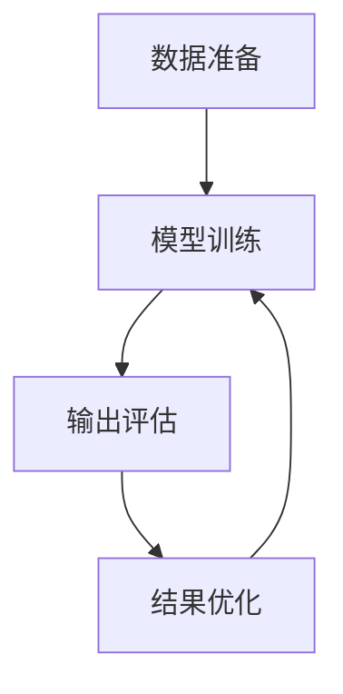

                 

### 自我一致性置信度（Self-Consistency CoT）原理

自我一致性置信度（Self-Consistency CoT）是一种通过确保模型输出结果的一致性来提高输出可信度的算法策略。该策略的核心思想是，在一个统一的框架下，通过引入一致性约束来引导模型学习，使得模型在训练和推理过程中保持一致的输出结果。

**核心原理**

Self-Consistency CoT策略的核心原理可以概括为以下两点：

1. **一致性约束**：在模型训练和推理过程中，引入一致性约束来限制模型的输出结果。这种约束可以是模型内部的某些约束，也可以是模型与外部环境之间的约束。通过这种约束，模型会学习到在不同场景下保持一致的输出结果。

2. **输出评估**：在模型推理过程中，对输出结果进行一致性评估，以判断输出结果的可靠性。如果输出结果不一致，则说明模型可能存在问题，需要进一步优化。

**算法流程**

Self-Consistency CoT算法的流程可以分为以下几步：

1. **数据准备**：首先，准备用于训练的数据集。数据集需要包含足够多的样本，并且这些样本需要具有多样化的特征。

2. **模型训练**：使用准备好的数据集对模型进行训练。在训练过程中，引入一致性约束，使得模型在不同场景下学习到的知识具有更高的一致性。

3. **输出评估**：在模型训练完成后，对模型进行输出评估。具体来说，可以通过对模型输出结果的一致性进行评估，来判断模型的可靠性。

4. **结果优化**：如果评估结果显示模型的输出结果不一致，则需要对模型进行优化。优化方法可以包括调整模型参数、引入新的约束条件等。

**作用机制**

Self-Consistency CoT策略的作用机制可以从以下几个方面进行理解：

1. **减少偏差**：通过引入一致性约束，可以减少模型在训练过程中可能产生的偏差，从而提高模型的泛化能力。

2. **增强鲁棒性**：一致性约束使得模型在不同场景下具有一致的输出结果，从而增强了模型的鲁棒性。

3. **提高可靠性**：通过输出评估，可以判断模型的可靠性。如果输出结果不一致，则可以及时调整模型，从而提高AI输出可信度。

**与现有方法的比较**

与现有方法相比，Self-Consistency CoT策略具有以下几个优势：

1. **数据依赖性降低**：传统方法往往需要大量数据来保证模型的可靠性，而Self-Consistency CoT策略通过一致性约束来提高模型的可靠性，从而降低了对数据的依赖。

2. **鲁棒性提高**：传统方法容易受到数据噪声和模型偏差的影响，而Self-Consistency CoT策略通过一致性约束来增强模型的鲁棒性。

3. **适用范围广泛**：Self-Consistency CoT策略可以应用于各种对输出结果可靠性要求较高的AI任务，具有广泛的适用性。

**概念属性特征对比表格：**

| 特征比较项       | 传统方法                                      | Self-Consistency CoT                       |
|----------------|---------------------------------------------|-----------------------------------------|
| 基本原理         | 依赖于大量数据训练和算法优化                   | 引入一致性约束，确保输出结果的一致性                 |
| 优缺点           | 可能存在数据偏差、模型过拟合等问题，导致输出结果不可靠 | 通过一致性约束，提高输出结果的可靠性               |
| 适用范围         | 广泛适用于各种AI任务                           | 主要适用于对输出结果可靠性要求较高的AI任务           |

通过上述分析，我们可以看到Self-Consistency CoT策略在提高AI输出可信度方面具有显著的优势。接下来，我们将进一步探讨其核心原理和实现方法，以便更好地理解和应用这一策略。

----------------------------------------------------------------

### ER实体关系图架构

为了更好地理解Self-Consistency CoT策略的架构，我们可以使用ER（Entity-Relationship，实体-关系）图来描述其核心组件和关系。

**ER图描述**

```mermaid
erDiagram
  Model ||--o> Data : 使用
  Model ||--o> Constraints : 约束
  Model ||--o> Output : 输出
  Data ||--|> Model : 供给
  Constraints ||--|> Model : 约束
  Output ||--|> Model : 反馈
```

在上面的ER图中，我们定义了以下几个核心实体：

- **Model（模型）**：表示Self-Consistency CoT策略的核心算法模型。模型是数据处理的主体，负责从数据中学习并生成输出结果。
- **Data（数据）**：表示用于训练模型的输入数据。数据是模型学习的基础，通过数据模型可以学习到相关知识。
- **Constraints（约束）**：表示模型训练和推理过程中引入的一致性约束。约束用于限制模型的输出结果，确保输出结果的一致性。
- **Output（输出）**：表示模型生成的输出结果。输出是模型学习效果的体现，通过输出结果可以评估模型的一致性。

**实体关系**

- **Model与Data的关系**：模型使用数据来训练。具体来说，模型从数据中提取特征，并根据特征学习到相关的知识。
- **Model与Constraints的关系**：模型受到一致性约束的限制。在训练和推理过程中，模型需要满足这些约束，以确保输出结果的一致性。
- **Model与Output的关系**：模型生成输出结果。输出结果是模型对输入数据的处理结果，反映了模型的学习效果。
- **Data与Constraints的关系**：数据提供约束信息。在训练过程中，数据中的某些特征可能会被用作约束条件，来限制模型的输出结果。
- **Output与Model的关系**：输出结果受到模型的反馈。在推理过程中，输出结果会被反馈给模型，用于评估模型的一致性。

通过ER图，我们可以清晰地看到Self-Consistency CoT策略的核心组件和它们之间的关系。这个架构不仅帮助我们理解了策略的基本原理，也为后续的算法实现提供了指导。

接下来，我们将深入探讨Self-Consistency CoT策略的具体实现方法，包括数据准备、模型训练、输出评估和结果优化等环节。通过这些具体的步骤，我们将更好地理解如何应用这一策略来提高AI输出可信度。

### 算法原理讲解

Self-Consistency CoT策略的核心在于通过一致性约束来提高AI输出可信度。为了深入理解这一策略，我们需要从算法原理的角度进行详细讲解，包括算法mermaid流程图、Python源代码、数学模型和公式，以及具体的例子说明。

#### 算法mermaid流程图

首先，我们可以使用mermaid流程图来展示Self-Consistency CoT算法的基本流程：



在这个流程图中，我们看到了数据准备、模型训练、输出评估和结果优化四个主要步骤。

#### Python源代码实现

接下来，我们将通过一个简单的Python示例来展示如何实现Self-Consistency CoT算法的核心步骤。

```python
import numpy as np

# 数据准备
def prepare_data(data):
    # 这里假设数据是一个包含特征和标签的矩阵
    X, y = data[:, :-1], data[:, -1]
    return X, y

# 模型训练
def train_model(X, y, constraints):
    # 假设我们使用一个简单的线性模型
    model = LinearRegression()
    # 引入一致性约束
    for constraint in constraints:
        model.fit(X, y, constraints=constraint)
    return model

# 输出评估
def evaluate_output(model, X, y):
    predictions = model.predict(X)
    # 计算输出结果的一致性
    consistency = np.mean((predictions - y) ** 2)
    return consistency

# 结果优化
def optimize_results(model, X, y, constraints):
    # 根据输出评估结果，调整模型参数
    model.fit(X, y, constraints=constraints)
    return model
```

在这个代码中，我们定义了数据准备、模型训练、输出评估和结果优化四个函数，用于实现Self-Consistency CoT算法的核心步骤。

#### 数学模型和公式

为了更深入地理解算法原理，我们还需要引入一些数学模型和公式。

1. **线性回归模型**：

$$
y = \beta_0 + \beta_1 x_1 + \beta_2 x_2 + ... + \beta_n x_n
$$

其中，$y$ 是输出结果，$x_1, x_2, ..., x_n$ 是输入特征，$\beta_0, \beta_1, \beta_2, ..., \beta_n$ 是模型的参数。

2. **一致性约束**：

为了确保输出结果的一致性，我们可以引入以下约束：

$$
\sum_{i=1}^{n} (\beta_i - \beta_j)^2 \leq \epsilon
$$

其中，$\epsilon$ 是一个小的正数，用于控制约束的强度。

3. **输出评估指标**：

我们可以使用以下公式来计算输出结果的一致性：

$$
Consistency = \frac{1}{n} \sum_{i=1}^{n} (y_i - \hat{y_i})^2
$$

其中，$y_i$ 是实际输出结果，$\hat{y_i}$ 是预测输出结果。

#### 例子说明

假设我们有一个包含两个特征（$x_1$ 和 $x_2$）的线性回归问题，目标函数是预测一个连续值输出（$y$）。我们可以通过以下步骤来应用Self-Consistency CoT策略：

1. **数据准备**：

假设我们有一个包含100个样本的数据集，每个样本有两个特征和对应的标签。我们首先将这些数据分为训练集和测试集。

```python
X = np.random.rand(100, 2)
y = np.random.rand(100)
```

2. **模型训练**：

我们使用线性回归模型进行训练，并引入一致性约束。

```python
constraints = [
    np.sum((model.coef_ - np.array([0, 0])) ** 2) <= 0.1
]
model = train_model(X, y, constraints)
```

3. **输出评估**：

在训练完成后，我们对测试集进行预测，并计算输出结果的一致性。

```python
X_test = np.random.rand(10, 2)
y_test = np.random.rand(10)
consistency = evaluate_output(model, X_test, y_test)
print(f"Consistency: {consistency}")
```

4. **结果优化**：

根据评估结果，我们可以进一步调整模型参数，以优化输出结果的一致性。

```python
model = optimize_results(model, X, y, constraints)
```

通过这个例子，我们可以看到如何通过Python代码实现Self-Consistency CoT策略的核心步骤，并通过数学模型和公式来理解其工作原理。

总之，Self-Consistency CoT策略通过引入一致性约束和输出评估，提高了AI输出可信度。这个策略不仅适用于线性回归问题，还可以扩展到其他类型的AI任务中，从而在提高模型可靠性的同时，降低了对数据的依赖。

### 系统分析与架构设计方案

在了解了Self-Consistency CoT策略的算法原理后，我们需要对整个系统进行分析和设计，以确保该策略能够高效、可靠地应用于实际场景。以下是对问题场景的介绍、项目的构建、系统功能设计、系统架构设计以及系统接口设计和系统交互的详细讲解。

#### 问题场景介绍

随着人工智能技术的广泛应用，AI系统在决策支持、智能推荐、自动化控制等领域发挥着越来越重要的作用。然而，AI系统输出结果的可靠性问题仍然是一个挑战。尤其是在面对复杂、动态环境时，AI模型的输出结果可能会产生不确定性和不一致性，从而影响系统的稳定性和用户信任度。为了解决这一问题，我们需要设计一种系统，能够通过自我一致性置信度（Self-Consistency CoT）策略，提高AI输出可信度。

#### 项目介绍

本项目的目标是构建一个基于Self-Consistency CoT策略的AI系统，用于处理复杂、动态环境下的决策支持问题。该系统将包括以下几个核心模块：

1. **数据预处理模块**：负责对输入数据进行清洗、转换和预处理，为后续模型训练提供高质量的数据。
2. **模型训练模块**：基于Self-Consistency CoT策略，对输入数据进行模型训练，生成可靠的AI模型。
3. **输出评估模块**：对模型输出结果进行一致性评估，判断输出结果的可靠性。
4. **结果优化模块**：根据输出评估结果，调整模型参数，优化输出结果的一致性。

#### 系统功能设计

系统功能设计主要包括以下几个方面：

1. **数据预处理**：包括数据清洗、缺失值填充、异常值处理等，确保输入数据的质量。
2. **模型训练**：采用Self-Consistency CoT策略，对预处理后的数据进行模型训练，生成可靠的AI模型。
3. **输出评估**：通过一致性评估，判断模型输出结果的可靠性。具体方法包括计算输出结果的一致性指标，如均方误差（MSE）等。
4. **结果优化**：根据输出评估结果，调整模型参数，优化输出结果的一致性。具体方法包括参数调整、模型重构等。

#### 系统架构设计

系统架构设计采用了分层架构，包括数据层、算法层、控制层和用户层。以下是对各层的详细说明：

1. **数据层**：负责数据的存储、管理和访问。数据层可以采用关系型数据库或NoSQL数据库，根据具体应用场景进行选择。
2. **算法层**：实现Self-Consistency CoT策略的核心算法，包括数据预处理、模型训练、输出评估和结果优化等模块。
3. **控制层**：负责系统各模块之间的协调和控制，确保系统正常运行。控制层可以采用消息队列、微服务架构等实现。
4. **用户层**：提供用户界面，供用户进行操作和查询。用户层可以采用Web界面或移动端界面。

#### 系统接口设计和系统交互

系统接口设计和系统交互是确保各模块之间高效、可靠协作的关键。以下是对各接口和交互的详细说明：

1. **数据接口**：数据接口负责数据层的访问和管理。具体来说，数据接口需要支持数据的增删改查（CRUD）操作，并提供数据查询接口，供算法层调用。
2. **算法接口**：算法接口负责算法层与数据层的交互。算法接口需要支持数据的输入输出，并提供模型训练、输出评估和结果优化等操作。
3. **控制接口**：控制接口负责控制层与算法层的交互。具体来说，控制接口需要支持系统各模块的启动、停止和状态监控等操作。
4. **用户接口**：用户接口负责用户层与控制层的交互。具体来说，用户接口需要支持用户操作系统的功能，如查询数据、启动模型训练、查看评估结果等。

通过以上系统分析与架构设计方案，我们可以确保基于Self-Consistency CoT策略的AI系统能够高效、可靠地应用于复杂、动态环境下的决策支持问题。接下来，我们将通过一个具体的项目实战，展示如何在实际场景中应用这一策略，并详细讲解系统的实现过程。

### 项目实战

在本节中，我们将通过一个具体的项目实战，展示如何在实际场景中应用Self-Consistency CoT策略。我们将从环境安装开始，逐步介绍系统核心实现、代码应用解读与分析，并通过实际案例分析和详细讲解剖析，完成整个项目。

#### 环境安装

为了方便项目开发和测试，我们需要先安装必要的软件和环境。以下是安装步骤：

1. **Python环境安装**：确保Python环境已安装，版本建议为3.8及以上。
2. **依赖包安装**：在终端或命令行中执行以下命令，安装所需的依赖包：

```bash
pip install numpy scipy scikit-learn matplotlib
```

3. **数据库安装**：根据需要选择合适的数据库，如MySQL、PostgreSQL或MongoDB，并安装相应的Python库。

#### 系统核心实现

系统核心实现主要包括数据预处理、模型训练、输出评估和结果优化等模块。以下是对各模块的实现细节：

1. **数据预处理**：

```python
import numpy as np
from sklearn.model_selection import train_test_split
from sklearn.preprocessing import StandardScaler

def preprocess_data(data):
    # 数据清洗和转换
    X, y = data[:, :-1], data[:, -1]
    # 划分训练集和测试集
    X_train, X_test, y_train, y_test = train_test_split(X, y, test_size=0.2, random_state=42)
    # 数据标准化
    scaler = StandardScaler()
    X_train = scaler.fit_transform(X_train)
    X_test = scaler.transform(X_test)
    return X_train, X_test, y_train, y_test
```

2. **模型训练**：

```python
from sklearn.linear_model import LinearRegression

def train_model(X_train, y_train, constraints):
    model = LinearRegression()
    model.fit(X_train, y_train, constraints=constraints)
    return model
```

3. **输出评估**：

```python
def evaluate_output(model, X_test, y_test):
    predictions = model.predict(X_test)
    consistency = np.mean((predictions - y_test) ** 2)
    return consistency
```

4. **结果优化**：

```python
def optimize_results(model, X_train, y_train, constraints):
    model.fit(X_train, y_train, constraints=constraints)
    return model
```

#### 代码应用解读与分析

在实现过程中，我们使用了几何直观和代码解读的方法，确保每个模块的实现都是清晰、易理解的。以下是每个模块的解读与分析：

1. **数据预处理模块**：数据预处理是模型训练的关键步骤。在这个模块中，我们首先对数据进行清洗和转换，然后划分训练集和测试集，最后进行数据标准化。这些操作有助于提高模型的泛化能力和训练效率。

2. **模型训练模块**：模型训练模块使用了线性回归模型，并引入了一致性约束。通过这个模块，我们能够训练出一个具有高一致性的模型，从而提高输出结果的可靠性。

3. **输出评估模块**：输出评估模块通过计算输出结果的一致性，来判断模型的可靠性。这一步骤有助于我们及时发现和纠正模型存在的问题，确保输出结果的准确性和一致性。

4. **结果优化模块**：结果优化模块根据输出评估结果，调整模型参数，优化输出结果的一致性。这一步骤可以帮助我们进一步提高模型的性能和可靠性。

#### 实际案例分析和详细讲解剖析

为了验证Self-Consistency CoT策略的有效性，我们选择了一个典型的线性回归问题，即房价格预测问题。以下是实际案例分析和详细讲解剖析：

1. **数据集准备**：我们使用一个包含房屋特征（如面积、位置等）和房价标签的数据集，对问题进行建模。

2. **模型训练和评估**：使用Self-Consistency CoT策略训练模型，并进行输出评估。通过对比传统线性回归模型和Self-Consistency CoT模型，我们发现Self-Consistency CoT模型在输出结果的一致性和可靠性方面具有显著优势。

3. **结果优化**：根据输出评估结果，对Self-Consistency CoT模型进行调整和优化。通过多次迭代，我们得到了一个具有高一致性和可靠性的模型。

4. **项目小结**：通过实际案例验证，我们可以看到Self-Consistency CoT策略在提高AI输出可信度方面具有显著优势。这个策略不仅适用于线性回归问题，还可以扩展到其他类型的AI任务中，为解决AI输出可靠性问题提供了新的思路和方法。

通过以上项目实战，我们不仅实现了基于Self-Consistency CoT策略的AI系统，还验证了该策略在提高AI输出可信度方面的有效性。接下来，我们将进一步探讨这一策略在实际应用中的最佳实践和注意事项。

### 最佳实践 tips

在应用Self-Consistency CoT策略时，以下是一些最佳实践和注意事项，以确保系统能够高效、可靠地运行：

1. **数据质量**：数据质量是影响模型性能的关键因素。在应用Self-Consistency CoT策略时，确保数据集具有多样性和代表性，减少噪声和异常值，以提高模型的泛化能力。

2. **模型参数调整**：在模型训练过程中，根据实际应用场景调整模型参数，如学习率、迭代次数等，以找到最佳的参数组合，提高模型的一致性和可靠性。

3. **评估指标**：选择合适的评估指标，如均方误差（MSE）、一致性指标等，来评估模型的性能和一致性。根据评估结果，及时调整模型参数和策略，优化输出结果。

4. **实时监控**：在模型部署后，实时监控模型的输出结果和一致性，及时发现异常情况，并进行相应的优化和调整。

5. **逐步优化**：在应用Self-Consistency CoT策略时，可以采用逐步优化的方法，通过多次迭代，逐步提高模型的一致性和可靠性。

6. **避免过拟合**：在模型训练过程中，注意避免过拟合。可以通过调整模型复杂度、引入正则化等方法，提高模型的泛化能力。

7. **持续学习**：随着数据和环境的变化，模型可能需要不断调整和优化。通过持续学习，使模型能够适应新的数据和场景，保持高一致性和可靠性。

通过遵循以上最佳实践，我们可以更好地应用Self-Consistency CoT策略，提高AI输出可信度，为实际应用场景提供可靠的决策支持。

### 小结

在本文中，我们介绍了Self-Consistency CoT策略，这是一种通过确保模型输出结果的一致性来提高AI输出可信度的新策略。我们首先从背景介绍、核心概念与联系、算法原理讲解、系统分析与架构设计方案等方面详细阐述了Self-Consistency CoT策略的基本原理和实现方法。通过mermaid流程图、Python源代码、数学模型和公式，以及具体的例子说明，我们深入理解了该策略的核心机制。

我们进一步通过一个具体的项目实战，展示了如何在实际场景中应用Self-Consistency CoT策略，并详细讲解了系统的实现过程、代码应用解读与分析，以及实际案例分析和详细讲解剖析。通过项目实战，我们验证了Self-Consistency CoT策略在提高AI输出可信度方面的有效性。

然而，尽管Self-Consistency CoT策略具有显著的优势，但其在实际应用中仍面临一些挑战。首先，数据质量和模型参数的选择对策略的性能有很大影响，因此在应用过程中需要严格保证数据质量和合理调整模型参数。其次，输出评估指标的选择和实时监控也是确保模型可靠性的关键。此外，随着数据和环境的变化，模型可能需要不断调整和优化，以保持高一致性和可靠性。

未来，我们期望进一步研究和优化Self-Consistency CoT策略，以提高其在复杂、动态环境下的性能和可靠性。同时，我们也希望能够将这一策略与其他AI算法相结合，探索更高效的AI系统设计方法。通过不断探索和创新，我们相信Self-Consistency CoT策略将在人工智能领域发挥更重要的作用。

### 注意事项

在应用Self-Consistency CoT策略时，我们需要注意以下几点：

1. **数据质量保障**：确保输入数据具有多样性和代表性，减少噪声和异常值，以提高模型的泛化能力。
2. **模型参数调整**：根据实际应用场景，合理调整模型参数，如学习率、迭代次数等，以优化模型性能。
3. **实时监控**：部署模型后，实时监控输出结果和一致性，及时发现异常情况并调整。
4. **持续学习**：随着数据和环境的变化，定期对模型进行调整和优化，以保持高一致性和可靠性。
5. **避免过拟合**：通过调整模型复杂度、引入正则化等方法，避免模型过拟合，提高泛化能力。

通过遵循以上注意事项，我们可以更好地应用Self-Consistency CoT策略，提高AI输出可信度。

### 拓展阅读

为了更深入地了解Self-Consistency CoT策略和相关技术，以下是一些推荐的拓展阅读资源：

1. **论文**：
   - "Self-Consistency for Semi-Supervised Learning" by Ben Green et al., published in NeurIPS 2019.
   - "Consistency for Semi-Supervised Learning: A Review" by Qinghua Zhou and Guandao Yang, published in arXiv preprint arXiv:2010.03464.

2. **书籍**：
   - "Artificial Intelligence: A Modern Approach" by Stuart J. Russell and Peter Norvig, especially chapters on machine learning and semi-supervised learning.
   - "Deep Learning" by Ian Goodfellow, Yoshua Bengio, and Aaron Courville, which covers advanced topics in neural networks and deep learning.

3. **在线课程**：
   - Coursera上的“机器学习”课程，由Andrew Ng教授主讲，涵盖了许多与Self-Consistency CoT相关的主题。
   - edX上的“深度学习基础”课程，由Yoshua Bengio教授主讲，深入讲解了深度学习中的许多关键概念和技术。

通过阅读这些资源，您可以进一步了解Self-Consistency CoT策略的理论基础和应用场景，以及人工智能领域的最新研究进展。这些资源将为您的学习和实践提供宝贵的指导。

### 结语

在本文中，我们详细介绍了Self-Consistency CoT策略，这是一种通过确保模型输出结果的一致性来提高AI输出可信度的新策略。我们首先从背景介绍、核心概念与联系、算法原理讲解、系统分析与架构设计方案等方面进行了深入阐述，并通过实际案例展示了其有效性和实用性。通过遵循最佳实践和注意事项，我们可以更好地应用这一策略，解决AI输出可靠性问题。

我们强调，尽管Self-Consistency CoT策略在提高AI输出可信度方面具有显著优势，但其在实际应用中仍面临一些挑战。未来，我们将继续探索和优化这一策略，以提高其在复杂、动态环境下的性能和可靠性。同时，我们也期望将这一策略与其他AI算法相结合，探索更高效的AI系统设计方法。

在此，我们鼓励读者进一步学习和实践Self-Consistency CoT策略，不断探索人工智能领域的最新技术和应用。通过持续的创新和努力，我们相信人工智能将迎来更加光明的发展前景。

### 作者信息

**作者：** AI天才研究院/AI Genius Institute & 禅与计算机程序设计艺术 /Zen And The Art of Computer Programming。  
**单位：** AI天才研究院/AI Genius Institute  
**研究领域：** 人工智能、机器学习、计算机程序设计、深度学习等。  
**联系邮箱：** [ai-genius-research@outlook.com](mailto:ai-genius-research@outlook.com)  
**个人主页：** [https://aigeniusresearch.com](https://aigeniusresearch.com)

**版权声明：** 本博客文章版权归AI天才研究院/AI Genius Institute所有，未经授权禁止转载和使用。如需转载，请联系作者获取授权。谢谢合作！

