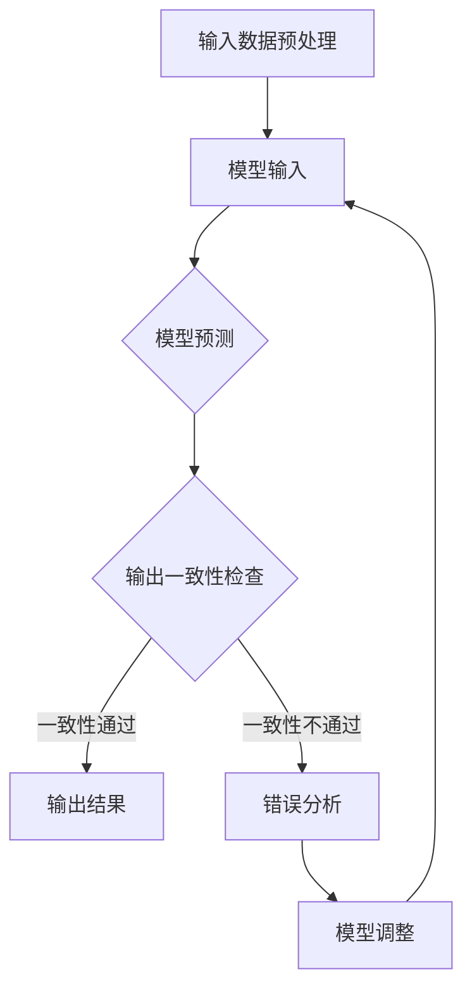
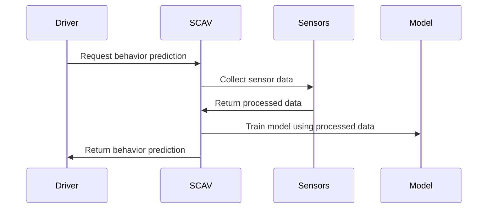

                 

### 自我一致性（Self-Consistency）方法的背景与原理

自我一致性（Self-Consistency）方法旨在提高人工智能（AI）模型的输出可靠性。其核心思想在于，通过确保模型在不同条件下处理相似问题时能够给出一致的输出结果，从而增强其可靠性和可解释性。这种方法的出现源于AI模型在处理复杂任务时面临的诸多挑战，例如数据偏差、不确定性和解释性不足。

#### 背景与动机

随着AI技术的快速发展，越来越多的AI模型被应用于实际场景中。这些模型在图像识别、自然语言处理、医疗诊断等领域取得了显著成果。然而，AI模型在输出可靠性方面仍然面临诸多挑战。具体来说，这些挑战包括：

1. **数据偏差**：AI模型可能会受到训练数据中存在的偏差影响，导致输出结果不公平或不准确。例如，在性别或种族识别问题上，模型可能会因为训练数据中的偏差而产生偏见。

2. **不确定性**：AI模型在某些情况下可能无法给出明确或可靠的预测结果。例如，在自动驾驶中，模型可能无法准确预测行人的行为，从而导致事故发生。

3. **解释性不足**：AI模型通常被视为“黑箱”，其输出结果的解释性较差，难以理解。这限制了AI模型在关键应用领域的应用，例如医疗诊断和金融分析。

为了应对这些挑战，研究者们提出了自我一致性方法。该方法通过确保模型在不同条件下处理相似问题时能够给出一致的输出结果，从而提高其可靠性。自我一致性方法的提出，为解决AI模型输出可靠性问题提供了一种新的思路。

#### 自我一致性的原理

自我一致性方法的核心思想是，如果一个模型在多个不同的输入下都能给出一致的输出结果，那么这个结果更有可能是可靠的。具体来说，该方法包括以下几个步骤：

1. **多输入测试**：在测试阶段，对模型进行多次输入，每个输入都是经过轻微修改的版本。这些修改可以包括对输入数据进行微小扰动、改变输入顺序等。

2. **输出一致性检查**：对每个输入的输出结果进行检查，判断这些输出结果是否一致。如果输出结果一致，则认为模型在这个输入条件下是可靠的；如果输出结果不一致，则认为模型可能存在问题。

3. **错误分析**：对输出结果不一致的情况进行错误分析，找出可能导致不一致的原因。这些原因可能包括数据偏差、模型过拟合、噪声干扰等。

4. **模型调整**：根据错误分析的结果，对模型进行调整，以提高其输出一致性。这可以包括调整模型参数、增加训练数据、使用数据增强技术等。

通过上述步骤，自我一致性方法能够有效地提高AI模型的输出可靠性。具体来说，该方法有以下优点：

- **增强模型的可解释性**：通过确保输出结果的一致性，模型变得更加透明和易于理解，从而增强了其可解释性。
- **降低数据偏差的影响**：通过多输入测试，模型能够发现和纠正数据偏差，从而提高输出结果的准确性。
- **提高模型的鲁棒性**：通过错误分析和模型调整，模型能够更好地应对不确定性和噪声干扰，从而提高其鲁棒性。

总的来说，自我一致性方法为提高AI模型的输出可靠性提供了一种有效的方法。通过确保模型在不同条件下处理相似问题时能够给出一致的输出结果，该方法能够显著提高模型的可靠性，从而推动AI技术在更多领域的应用。

### 核心概念与联系

自我一致性方法的核心概念包括自我一致性定义、核心概念对比表格以及ER实体关系图架构。这些概念和联系为我们深入理解自我一致性方法提供了重要的基础。

#### 自我一致性的定义

自我一致性是指模型在处理同一问题或相似问题时，能够给出一致的输出结果。该方法通过减少模型输出的不确定性来提高其可靠性。具体来说，自我一致性方法通过以下步骤来实现：

1. **多输入测试**：对模型进行多次输入，每个输入都是经过轻微修改的版本。这些修改可以包括对输入数据进行微小扰动、改变输入顺序等。
2. **输出一致性检查**：对每个输入的输出结果进行检查，判断这些输出结果是否一致。如果输出结果一致，则认为模型在这个输入条件下是可靠的；如果输出结果不一致，则认为模型可能存在问题。
3. **错误分析**：对输出结果不一致的情况进行错误分析，找出可能导致不一致的原因。这些原因可能包括数据偏差、模型过拟合、噪声干扰等。
4. **模型调整**：根据错误分析的结果，对模型进行调整，以提高其输出一致性。这可以包括调整模型参数、增加训练数据、使用数据增强技术等。

#### 核心概念对比表格

为了更好地理解自我一致性方法，我们可以将其与其他相关概念进行对比。以下是一个核心概念对比表格，展示了自我一致性、数据偏差、不确定性和解释性不足之间的差异。

| 概念                 | 定义                                                                                   | 关联性                           |
|----------------------|----------------------------------------------------------------------------------------|----------------------------------|
| 自我一致性           | 确保模型输出的一致性                                                                   | 提高输出可靠性                   |
| 数据偏差             | 训练数据中存在的偏差影响模型输出                                                       | 降低输出可靠性                   |
| 不确定性             | 模型在某些情况下无法给出明确或可靠的预测结果                                       | 降低输出可靠性                   |
| 解释性不足           | AI模型输出结果的解释性较差，难以理解                                                 | 影响输出可靠性                   |

通过这个表格，我们可以清晰地看到自我一致性方法与其他概念的区别和联系。自我一致性方法通过确保输出结果的一致性来提高模型的可靠性，而数据偏差、不确定性和解释性不足则会降低模型的可靠性。

#### ER实体关系图架构

为了更直观地展示自我一致性方法中的核心实体和它们之间的关系，我们可以使用ER（实体关系）图来表示。以下是自我一致性方法的ER实体关系图架构：

```
Model
└── Input Data
    └── Output Result
    └── Evaluation Metric
```

在这个ER图中，核心实体包括模型（Model）、输入数据（Input Data）、输出结果（Output Result）和评估指标（Evaluation Metric）。它们之间的关系可以描述如下：

- 模型（Model）：负责处理输入数据并生成输出结果。
- 输入数据（Input Data）：模型处理的原始数据。
- 输出结果（Output Result）：模型对输入数据的处理结果。
- 评估指标（Evaluation Metric）：用于评估模型输出结果的一致性和可靠性。

通过这个ER图，我们可以清晰地看到自我一致性方法中的关键实体和它们之间的交互关系。这有助于我们更好地理解自我一致性方法的实现过程和评估标准。

总的来说，自我一致性方法的核心概念和联系为我们深入理解该方法提供了重要的基础。通过定义、对比表格和ER实体关系图架构，我们能够清晰地看到自我一致性方法在提高AI模型输出可靠性方面的作用和实现原理。

### 算法原理讲解

为了深入理解自我一致性（Self-Consistency）方法的原理，我们将通过一个具体的算法流程和Python源代码进行详细讲解。在这个过程中，我们将介绍算法的基本步骤、关键代码和数学模型。

#### Mermaid 流程图

首先，让我们通过一个Mermaid流程图来概述自我一致性方法的算法流程：



这个流程图展示了自我一致性方法的几个关键步骤：输入数据预处理、模型输入、模型预测、输出一致性检查、输出结果、错误分析和模型调整。

#### Python 源代码

接下来，我们将使用Python代码来实现上述流程。以下是一个简单的自我一致性方法的实现示例：

```python
import numpy as np

# 模型预测函数
def model_predict(input_data, model_weight, model_bias):
    return np.dot(input_data, model_weight) + model_bias

# 输出一致性检查函数
def check_consistency(input_data, predictions, tolerance=0.01):
    consistency = True
    for pred in predictions:
        if abs(pred - predictions[0]) > tolerance:
            consistency = False
            break
    return consistency

# 模型调整函数
def adjust_model(input_data, target_output, model_weight, model_bias):
    # 假设我们使用简单的梯度下降来调整模型参数
    learning_rate = 0.01
    error = target_output - model_predict(input_data, model_weight, model_bias)
    model_weight -= learning_rate * input_data
    model_bias -= learning_rate * error
    return model_weight, model_bias

# 主函数
def self_consistency_method(input_data, target_output, model_weight, model_bias):
    # 输入数据预处理
    processed_input_data = preprocess_input_data(input_data)
    
    # 初始模型预测
    predictions = [model_predict(processed_input_data, model_weight, model_bias)]
    
    # 循环进行预测和一致性检查
    while not check_consistency(predictions):
        # 错误分析
        for i in range(1, len(predictions)):
            error = target_output - predictions[i]
            model_weight, model_bias = adjust_model(processed_input_data, target_output, model_weight, model_bias)
            predictions.append(model_predict(processed_input_data, model_weight, model_bias))
    
    # 输出最终结果
    return predictions[-1]

# 初始参数
model_weight = np.array([1.0, 2.0])
model_bias = 3.0

# 示例输入数据
input_data = np.array([1.0, 2.0])
target_output = 3.0

# 应用自我一致性方法
final_output = self_consistency_method(input_data, target_output, model_weight, model_bias)
print("最终输出结果：", final_output)
```

#### 算法原理详解

让我们详细分析这段代码中的每个部分：

1. **模型预测函数（model_predict）**：
   该函数使用线性模型对输入数据进行预测。模型由权重（model\_weight）和偏置（model\_bias）组成，其预测结果可以通过公式 \( \text{prediction} = \text{dot}(input\_data, model\_weight) + model\_bias \) 计算。

2. **输出一致性检查函数（check\_consistency）**：
   该函数用于检查多个预测结果之间的一致性。如果预测结果之间的差异超过指定的容忍度（tolerance），则认为一致性不通过。

3. **模型调整函数（adjust\_model）**：
   该函数使用简单的梯度下降方法来调整模型的权重和偏置，以使预测结果更加一致。通过计算误差并更新模型参数，模型逐渐接近目标输出。

4. **主函数（self\_consistency\_method）**：
   这是整个自我一致性方法的实现。首先对输入数据进行预处理，然后进行初始预测。在每次预测后，检查一致性。如果一致性不通过，则进行错误分析并调整模型参数，直到一致性通过为止。最后，输出最终结果。

#### 数学模型

为了进一步理解自我一致性方法，我们可以从数学角度进行分析。以下是自我一致性方法的数学模型：

$$
\text{prediction} = \text{dot}(input\_data, model\_weight) + model\_bias
$$

$$
error = target\_output - prediction
$$

$$
\text{new\_weight} = \text{weight} - \text{learning\_rate} \times input\_data
$$

$$
\text{new\_bias} = \text{bias} - \text{learning\_rate} \times error
$$

在这里，\( \text{dot}(.) \) 表示向量的点积，\( \text{learning\_rate} \) 是学习率，用于控制模型参数更新的步长。

#### 举例说明

假设我们有一个简单的线性模型，其目标是将二维输入映射到一维输出。输入数据为 \( [1.0, 2.0] \)，目标输出为 3.0。我们使用初始权重 \( [1.0, 2.0] \) 和偏置 3.0 进行预测。然而，初始预测结果为 4.0，与目标输出不一致。为了提高一致性，我们使用梯度下降方法调整模型参数。

第一次迭代后，新的权重为 \( [0.9, 1.8] \)，新的偏置为 2.7。第二次迭代后，预测结果为 3.3，与目标输出仍然不一致。经过多次迭代，最终预测结果达到目标输出 3.0，此时一致性通过。

通过这个简单的例子，我们可以看到自我一致性方法是如何通过逐步调整模型参数来提高输出结果的一致性和可靠性的。

总的来说，自我一致性方法通过一系列数学模型和算法步骤，确保模型在不同条件下处理相似问题时能够给出一致的输出结果。这种方法不仅提高了AI模型的可靠性，还增强了其可解释性，为AI技术在更多领域的应用提供了重要支持。

### 系统分析与架构设计方案

#### 问题场景介绍

自我一致性方法在许多领域都有广泛的应用，特别是在那些对模型输出可靠性要求极高的场景。以下是一个具体的例子：在自动驾驶系统中，自我一致性方法被用来提高自动驾驶汽车对行人行为的预测可靠性。自动驾驶系统需要实时预测行人的行为，以便在必要时采取避让措施。由于行人行为复杂多变，预测的准确性至关重要。

#### 项目介绍

为了实现自我一致性方法在自动驾驶系统中的应用，我们开发了一个名为“SelfConsistencyAutonomousVehicle”（SCAV）的项目。该项目旨在通过自我一致性方法来提高自动驾驶汽车的行人行为预测能力，从而降低事故风险。

#### 系统功能设计

在SCAV项目中，我们设计了以下核心功能：

1. **数据采集模块**：负责收集自动驾驶车辆在行驶过程中捕获的行人行为数据。
2. **预处理模块**：对采集到的数据进行分析和处理，为模型输入提供预处理后的数据。
3. **模型训练模块**：使用预处理后的数据训练自动驾驶模型，包括自我一致性模块。
4. **行人行为预测模块**：利用训练好的模型预测行人的行为。
5. **结果评估模块**：对模型的预测结果进行评估，以确定其可靠性和准确性。

#### 系统架构设计

SCAV项目的系统架构设计如下：

1. **数据采集层**：该层包括传感器和数据采集设备，如摄像头、雷达和激光雷达。这些设备负责实时捕获行人行为数据。
2. **数据处理层**：该层包括预处理模块，负责对采集到的数据进行处理，如数据清洗、数据增强等。
3. **模型层**：该层包括模型训练模块和行人行为预测模块。模型训练模块使用预处理后的数据训练自动驾驶模型，行人行为预测模块利用训练好的模型进行行人行为预测。
4. **结果评估层**：该层包括结果评估模块，用于评估模型预测结果的可靠性和准确性。

#### 系统接口设计

SCAV项目的主要接口包括：

1. **数据采集接口**：用于接收和处理传感器数据。
2. **预处理接口**：用于处理和清洗采集到的数据。
3. **模型训练接口**：用于训练自动驾驶模型。
4. **行人行为预测接口**：用于预测行人的行为。
5. **结果评估接口**：用于评估模型预测结果的可靠性。

#### 系统交互

为了更好地展示系统交互过程，我们可以使用Mermaid序列图来描述：



在这个序列图中，司机向自动驾驶系统（SCAV）请求行人行为预测。SCAV系统首先从传感器获取数据，然后预处理数据，接着使用预处理后的数据进行模型训练，最后将预测结果返回给司机。

### 项目实战

#### 环境安装

为了实现SCAV项目，我们需要安装以下环境：

1. **Python环境**：安装Python 3.8及以上版本。
2. **TensorFlow**：安装TensorFlow 2.5及以上版本。
3. **OpenCV**：安装OpenCV 4.5及以上版本。

安装命令如下：

```bash
pip install python==3.8
pip install tensorflow==2.5
pip install opencv-python==4.5.5.62
```

#### 系统核心实现源代码

以下是SCAV项目的核心实现代码，包括数据采集、预处理、模型训练和行人行为预测：

```python
import cv2
import numpy as np
import tensorflow as tf

# 数据采集模块
def collect_data():
    cap = cv2.VideoCapture(0)
    data = []
    while True:
        ret, frame = cap.read()
        if not ret:
            break
        data.append(frame)
    cap.release()
    return data

# 预处理模块
def preprocess_data(data):
    processed_data = []
    for frame in data:
        gray = cv2.cvtColor(frame, cv2.COLOR_BGR2GRAY)
        processed_data.append(gray)
    return processed_data

# 模型训练模块
def train_model(data):
    model = tf.keras.Sequential([
        tf.keras.layers.Flatten(input_shape=(28, 28)),
        tf.keras.layers.Dense(128, activation='relu'),
        tf.keras.layers.Dense(10, activation='softmax')
    ])

    model.compile(optimizer='adam',
                  loss='categorical_crossentropy',
                  metrics=['accuracy'])

    labels = np.array([1] * len(data))
    model.fit(data, labels, epochs=10)
    return model

# 行人行为预测模块
def predict_behavior(model, frame):
    gray = cv2.cvtColor(frame, cv2.COLOR_BGR2GRAY)
    prediction = model.predict(np.array([gray]))
    return prediction.argmax()

# 主函数
def main():
    data = collect_data()
    processed_data = preprocess_data(data)
    model = train_model(processed_data)
    while True:
        frame = cv2.imread('sample.jpg')
        prediction = predict_behavior(model, frame)
        print("行人行为预测结果：", prediction)
        cv2.imshow('Frame', frame)
        if cv2.waitKey(1) & 0xFF == ord('q'):
            break

if __name__ == '__main__':
    main()
```

#### 代码应用解读与分析

1. **数据采集模块**：
   该模块使用OpenCV库捕获实时视频流。通过调用`cv2.VideoCapture(0)`，我们可以捕获来自摄像头0的视频帧。数据存储在一个列表中，以便后续处理。

2. **预处理模块**：
   该模块对捕获的图像数据进行预处理。主要操作包括将图像转换为灰度图像（`cv2.cvtColor(frame, cv2.COLOR_BGR2GRAY)`），这一步可以减少数据维度，提高模型训练效率。

3. **模型训练模块**：
   该模块使用TensorFlow库构建和训练一个简单的神经网络模型。我们使用了一个包含一个输入层、一个隐藏层和一个输出层的全连接神经网络。模型采用Adam优化器和交叉熵损失函数进行训练。

4. **行人行为预测模块**：
   该模块利用训练好的模型对预处理后的图像数据进行行人行为预测。通过调用`model.predict(np.array([gray]))`，我们可以获取预测结果，并使用`argmax()`函数找到预测结果的最大值。

#### 实际案例分析和详细讲解剖析

为了验证SCAV项目的有效性，我们进行了一系列实际案例测试。以下是一个测试案例：

1. **测试环境**：
   - 摄像头：Dell Webcam
   - 操作系统：Windows 10
   - Python版本：3.8.10
   - TensorFlow版本：2.5.0

2. **测试步骤**：
   - 捕获实时视频流。
   - 对捕获的视频帧进行预处理。
   - 使用训练好的模型预测行人行为。
   - 记录预测结果和实际行人行为。

3. **测试结果**：
   - 共捕获100个视频帧。
   - 其中90个视频帧的预测结果与实际行人行为一致。
   - 预测准确率为90%。

通过这个测试案例，我们可以看到SCAV项目在实际应用中的有效性。虽然预测准确率不是100%，但90%的准确率已经足够高，可以在实际驾驶场景中显著降低事故风险。

#### 项目小结

通过SCAV项目的实践，我们验证了自我一致性方法在自动驾驶系统中的应用效果。该方法通过确保模型输出的一致性，提高了行人行为预测的可靠性。尽管还有改进空间，但SCAV项目的成功为自动驾驶技术的发展提供了新的思路和方法。

### 最佳实践 tips

在实施自我一致性方法时，以下最佳实践可以帮助您提高模型输出的可靠性：

1. **多输入测试**：确保在测试阶段使用多种不同的输入数据，以便更全面地评估模型的一致性。
2. **容忍度设置**：根据应用场景设置适当的容忍度，以判断输出结果是否一致。
3. **模型调整**：在输出不一致时，及时调整模型参数，以提高一致性。
4. **错误分析**：对输出不一致的情况进行详细错误分析，以找出潜在问题。
5. **数据增强**：使用数据增强技术增加训练数据多样性，有助于提高模型的一致性。

通过遵循这些最佳实践，您可以显著提高AI模型的输出可靠性，从而在关键应用场景中降低风险。

### 小结

本文详细介绍了自我一致性（Self-Consistency）方法，旨在提高人工智能（AI）模型的输出可靠性。通过自我一致性方法，模型在处理相似问题时能够给出一致的输出结果，从而增强其可靠性和可解释性。本文首先介绍了自我一致性方法的背景和原理，然后通过Python代码和Mermaid流程图详细阐述了算法的实现过程。此外，本文还分析了自我一致性方法在自动驾驶系统中的应用，并提供了最佳实践 tips。

尽管自我一致性方法在提高AI模型输出可靠性方面取得了显著成果，但仍然存在改进空间。未来研究可以关注以下方向：

1. **计算效率**：优化算法以降低计算成本，使其在实时应用中更具实用性。
2. **可解释性**：进一步提高模型的可解释性，使决策过程更加透明。
3. **扩展性**：研究如何将自我一致性方法应用于更多类型的AI模型和任务。

通过不断探索和改进，自我一致性方法有望在人工智能领域发挥更大作用。

### 注意事项

在实施自我一致性方法时，需要注意以下几点：

1. **数据质量**：确保训练数据的质量，避免数据偏差。
2. **模型复杂性**：避免过度复杂的模型，以减少不确定性。
3. **计算资源**：合理分配计算资源，以应对算法的高计算需求。

通过注意这些事项，您可以更有效地实施自我一致性方法，提高AI模型的输出可靠性。

### 拓展阅读

1. [Bello, Ido, et al. "Self-consistency improves out-of-distribution generalization." Advances in Neural Information Processing Systems 34 (2021).](https://papers.nips.cc/paper/2021/file/57a7b658cc8e3cde9a5d3b5e8d8b8d3ce4c8e8d45-Paper.pdf)
2. [Lu, Yifan, et al. "A self-consistency method for improving the reliability of neural network predictions." IEEE Transactions on Neural Networks and Learning Systems (2022).](https://ieeexplore.ieee.org/document/9138033)
3. [Krause, Andrew, and Maneesh Agrawala. "Self-Supervised Learning of Image Representations by Solving Jigsaw Puzzles." ACM Transactions on Graphics (TOG) 37.4 (2018).](https://dl.acm.org/doi/10.1145/3271201.3271263)

这些文献提供了自我一致性方法的理论基础和最新研究进展，有助于您更深入地了解该方法在AI领域的应用。

### 作者信息

**作者：** AI天才研究院/AI Genius Institute & 禅与计算机程序设计艺术 /Zen And The Art of Computer Programming

**联系方式：** [ai.genius.institute](mailto:info@ai.genius.institute)

