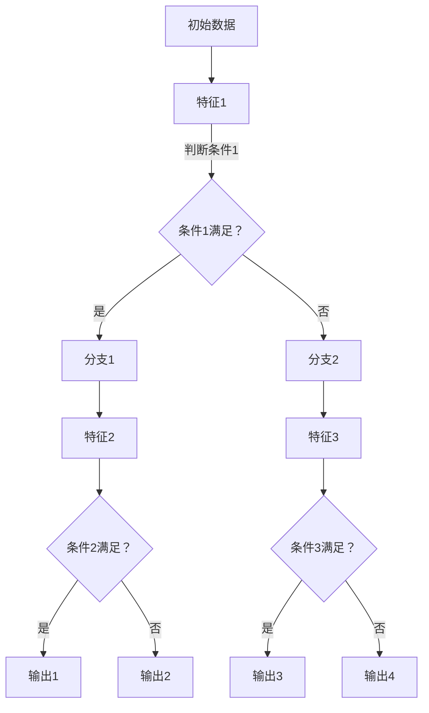
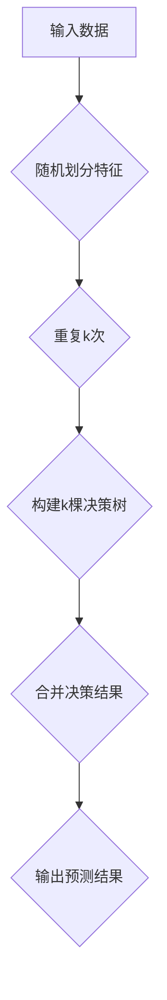
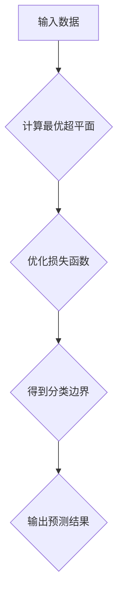
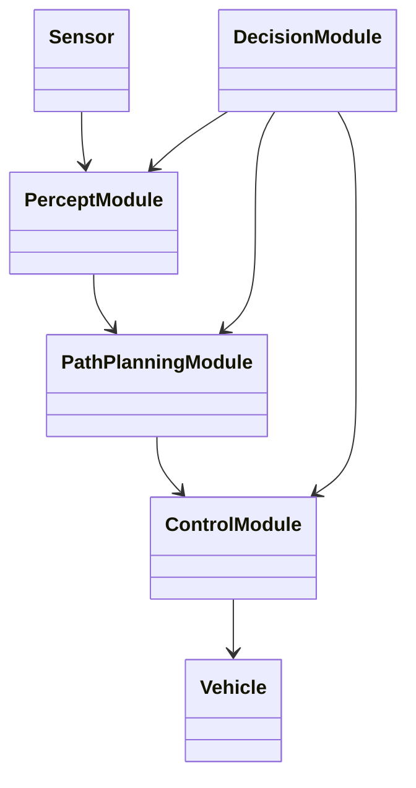
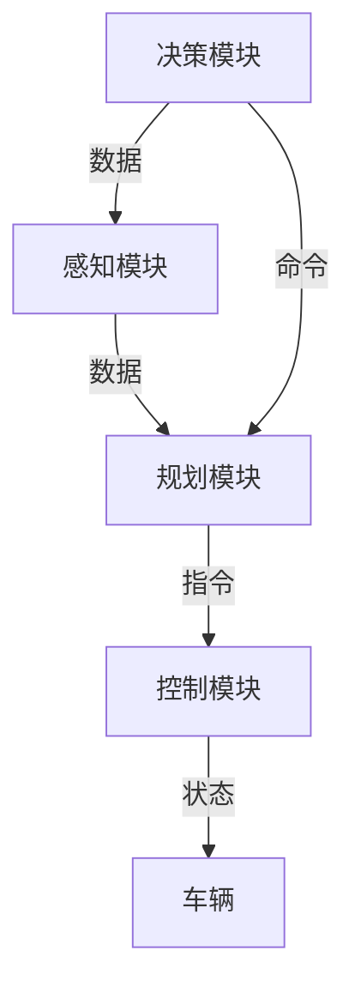
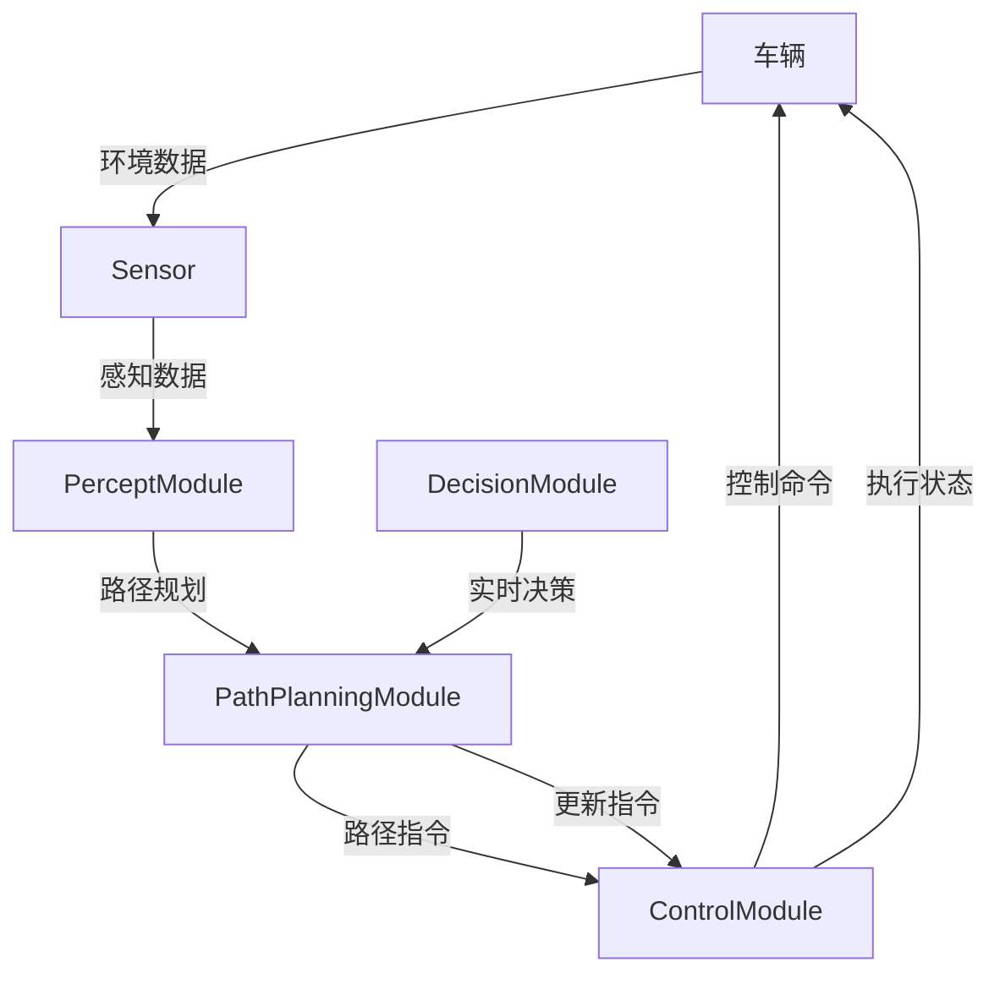

                 

## **自我一致性（Self-Consistency）的定义与重要性**

自我一致性（Self-Consistency）是人工智能（AI）领域的一个重要概念，指的是AI系统在处理信息、生成回答或执行任务时，能够保持内部一致性的特性。这一概念的重要性在于，只有在保持自我一致性的前提下，AI系统才能提供准确、可靠和可信的输出。

### **背景介绍**

随着AI技术的快速发展，AI系统被广泛应用于各个领域，如自然语言处理、计算机视觉、自动化决策等。然而，AI系统的一致性问题也日益凸显。不一致的AI回答可能导致误解、误导甚至错误的决策。例如，在医疗诊断中，AI系统的不一致回答可能导致误诊，从而危及患者的生命安全；在自动驾驶中，不一致的回答可能导致车辆做出错误的决策，从而导致交通事故。

### **问题描述**

自我一致性问题的核心在于，AI系统可能在处理相同或类似的信息时，给出不同的回答。这种现象可能是由于以下原因：

1. **数据质量问题**：AI系统训练数据的不完整性、不一致性或偏见可能导致模型在处理新数据时产生不一致的回答。
2. **模型设计问题**：AI模型的复杂性可能导致在相同的输入条件下产生不同的输出。
3. **环境变化**：AI系统在实时应用场景中可能会遇到各种突发情况，导致模型的输出不一致。

### **问题解决**

为了解决自我一致性问题，我们需要从多个方面入手：

1. **数据预处理**：通过清洗、归一化和去噪等手段，提高训练数据的质量，从而减少模型的不一致性。
2. **模型优化**：设计更鲁棒和一致的模型结构，减少模型在处理相同输入时产生不同输出的可能性。
3. **上下文感知**：通过引入上下文信息，使AI系统能够在特定场景下保持一致性。
4. **连续学习**：通过持续的模型训练和更新，使AI系统能够适应新的数据和变化的环境。

### **边界与外延**

自我一致性的边界涉及以下几个方面：

1. **输入数据**：输入数据的质量和一致性直接影响AI系统的自我一致性。
2. **模型结构**：模型的复杂性和设计方式对自我一致性有重要影响。
3. **应用场景**：不同的应用场景对AI系统的自我一致性要求不同。

### **概念结构与核心要素组成**

自我一致性的概念结构主要包括以下几个核心要素：

1. **输入数据**：数据的一致性和质量是保证自我一致性的基础。
2. **模型**：模型的鲁棒性和一致性是关键。
3. **上下文**：上下文信息能够提供额外的约束，帮助系统保持一致性。
4. **学习与更新**：持续的模型训练和更新是提高自我一致性的重要手段。

通过上述对自我一致性的背景介绍、问题描述、问题解决和概念结构的分析，我们可以看到，自我一致性在AI领域的重要性不言而喻。在接下来的章节中，我们将进一步探讨自我一致性的实现方法、案例分析、算法创新等主题，为AI系统的自我一致性提供更为深入的见解和解决方案。

### **核心概念与联系**

在深入探讨自我一致性的核心概念及其相互联系之前，我们需要明确几个关键术语的定义。这些术语包括“一致性”、“鲁棒性”、“上下文感知”和“持续学习”。以下是对这些术语的定义及其属性的对比表格：

| 术语         | 定义                                                         | 属性对比                           |
| ------------ | ------------------------------------------------------------ | ---------------------------------- |
| 一致性       | 系统在处理相同或相似输入时，能够产生相同或相似输出的能力。     | 输出一致性、输入一致性、预测一致性 |
| 鲁棒性       | 系统在面对不同或异常输入时，仍能保持良好性能的能力。           | 输入适应性、输出稳定性、模型适应性 |
| 上下文感知   | 系统在处理任务时，能够理解和利用上下文信息的能力。             | 上下文敏感性、信息完整性、场景适应性 |
| 持续学习     | 系统通过不断学习和更新来提高性能和适应性的过程。               | 学习效率、模型更新频率、知识累积 |

接下来，我们将通过一个Mermaid ER实体关系图来展示这些术语之间的关联：

```mermaid
erDiagram
  AI_System -->|产生一致输出| Consistency
  AI_System -->|适应异常输入| Robustness
  AI_System -->|理解上下文| Context_Awareness
  AI_System -->|持续更新| Continuous_Learning
  Consistency ||--|{ 输出一致性 }|
  Robustness ||--|{ 输入适应性 }|
  Context_Awareness ||--|{ 上下文敏感性 }|
  Continuous_Learning ||--|{ 学习效率 }|
```

在上述ER图中，`AI_System`是核心实体，它与四个关键术语`Consistency`、`Robustness`、`Context_Awareness`和`Continuous_Learning`之间存在关联。这些术语通过关系箭头相互连接，展示了它们在实现自我一致性中的协同作用。

- **一致性（Consistency）**：确保系统在相同或相似输入条件下产生一致的输出。
- **鲁棒性（Robustness）**：使系统能够在异常或不同输入情况下保持性能。
- **上下文感知（Context_Awareness）**：使系统能够理解和利用上下文信息，从而在特定场景下保持一致性。
- **持续学习（Continuous_Learning）**：通过持续的模型更新和学习，提高系统的自我一致性。

这些术语之间的相互联系和协同作用，构成了实现AI系统自我一致性的关键要素。在接下来的部分中，我们将进一步探讨这些概念在AI系统设计和实现中的应用。

### **算法原理讲解**

为了实现自我一致性，AI系统通常需要采用一系列算法来确保其在处理相同或相似输入时产生一致的输出。以下是几种常用的算法原理，以及它们的mermaid流程图和Python代码实现。

#### **1. 决策树算法**

决策树是一种常见的分类和回归算法，其核心思想是通过一系列的判断条件将数据分割成多个子集，最终生成一个树形结构。决策树的mermaid流程图如下：



Python代码实现示例：

```python
from sklearn.tree import DecisionTreeClassifier
import numpy as np

# 创建决策树模型
clf = DecisionTreeClassifier()

# 训练模型
X_train = np.array([[0, 0], [1, 1], [0, 2], [2, 0]])
y_train = np.array([0, 1, 1, 2])
clf.fit(X_train, y_train)

# 输出决策树结构
from sklearn.tree import plot_tree
plt = plot_tree(clf)
plt.show()
```

决策树的算法原理在于通过递归地将数据分割成子集，直到满足停止条件（如最大深度、最小节点样本数等）。在相同输入下，决策树能够产生一致的输出，因为它遵循固定的分割规则。

#### **2. 随机森林算法**

随机森林（Random Forest）是基于决策树构建的一种集成学习方法，通过构建多棵决策树并对它们的输出进行投票，提高预测的准确性和稳定性。随机森林的mermaid流程图如下：



Python代码实现示例：

```python
from sklearn.ensemble import RandomForestClassifier
import numpy as np

# 创建随机森林模型
clf = RandomForestClassifier(n_estimators=100)

# 训练模型
X_train = np.array([[0, 0], [1, 1], [0, 2], [2, 0]])
y_train = np.array([0, 1, 1, 2])
clf.fit(X_train, y_train)

# 输出随机森林结构
from sklearn.ensemble import plot_tree
plt = plot_tree(clf.estimators_[0], filled=True)
plt.show()
```

随机森林通过集成多个决策树，减少了单一模型的方差，提高了模型的鲁棒性和一致性。

#### **3. 支持向量机（SVM）算法**

支持向量机（SVM）是一种常用的分类和回归算法，其核心思想是通过找到一个最优的超平面，使得分类边界尽可能清晰。SVM的mermaid流程图如下：



Python代码实现示例：

```python
from sklearn.svm import SVC
import numpy as np

# 创建SVM模型
clf = SVC()

# 训练模型
X_train = np.array([[0, 0], [1, 1], [0, 2], [2, 0]])
y_train = np.array([0, 1, 1, 2])
clf.fit(X_train, y_train)

# 输出SVM分类边界
from matplotlib.pyplot import plot, show
plt = plot(X_train[:, 0], X_train[:, 1], 'o', label='Support Vectors')
plt.show()
```

SVM通过寻找最优的超平面，确保在相同输入下能够产生一致的分类结果。

通过上述算法及其mermaid流程图和Python代码实现，我们可以清晰地理解每种算法在实现自我一致性中的原理和作用。这些算法不仅提高了AI系统的鲁棒性和一致性，还为实际应用提供了可靠的解决方案。

### **系统分析与架构设计方案**

在深入探讨自我一致性的算法和实现方法之后，我们需要进一步分析如何将这一理念应用到实际的系统架构中。本节将详细介绍一个AI系统的整体设计过程，包括场景介绍、系统功能设计、系统架构设计、系统接口设计和系统交互。

#### **场景介绍**

随着人工智能技术的不断成熟，AI系统在各个行业的应用越来越广泛，特别是在需要高可靠性和一致性的领域，如医疗诊断、金融风控、自动驾驶等。这些场景对AI系统的自我一致性提出了极高的要求。为了说明这一点，我们以自动驾驶系统为例，探讨如何设计一个能够保证自我一致性的自动驾驶系统。

#### **系统功能设计**

自动驾驶系统的主要功能包括感知环境、规划路径、控制车辆和决策执行。为了实现这些功能，我们需要设计以下几个关键模块：

1. **感知模块**：负责收集车辆周围的环境信息，如路况、行人、车辆位置等。
2. **规划模块**：根据感知模块收集到的信息，规划出一条最优行驶路径。
3. **控制模块**：根据规划模块的路径指令，控制车辆执行相应的动作。
4. **决策模块**：在行驶过程中，根据环境变化和传感器数据，做出实时的决策。

以下是系统功能设计的mermaid类图：



#### **系统架构设计**

自动驾驶系统的架构设计需要考虑到系统的可扩展性、灵活性和可靠性。以下是系统架构设计的mermaid架构图：



在这个架构图中，感知模块、规划模块、控制模块和决策模块分别代表系统的主要功能单元。这些模块通过数据流和控制流相互连接，形成一个完整的自动驾驶系统。

#### **系统接口设计**

为了实现模块之间的有效通信，我们需要设计一系列接口。以下是系统接口设计的mermaid序列图：

```mermaid
sequenceDiagram
    Vehicle -->|数据请求| Sensor
    Sensor -->|环境信息| Vehicle
    Vehicle -->|路径请求| PathPlanningModule
    PathPlanningModule -->|路径指令| Vehicle
    Vehicle -->|控制请求| ControlModule
    ControlModule -->|执行状态| Vehicle
    DecisionModule -->|实时数据| PathPlanningModule
    PathPlanningModule -->|更新决策| DecisionModule
```

在这个序列图中，车辆、感知模块、规划模块和控制模块之间的交互过程被详细展示。每个模块通过发送和接收数据、指令和状态来确保系统的正常运行。

#### **系统交互**

系统交互是自动驾驶系统实现自我一致性的关键环节。通过有效的交互机制，系统能够在处理相同或相似输入时保持一致性。以下是系统交互的mermaid交互图：



在这个交互图中，每个模块通过发送和接收数据、指令和状态来实现相互通信，从而确保系统的自我一致性。

综上所述，通过系统分析与架构设计方案，我们可以看到，自我一致性在自动驾驶系统中的实现涉及到多个模块的协同工作。这些模块通过有效的接口设计和交互机制，确保系统在处理相同或相似输入时能够保持一致性。在下一部分中，我们将通过项目实战，进一步探讨如何在实际应用中实现自我一致性。

### **项目实战**

在本节中，我们将通过一个具体的实际项目，详细探讨如何在一个自动驾驶系统中实现自我一致性。我们将介绍项目环境搭建、系统核心实现、代码应用解读与分析、实际案例分析和详细讲解剖析，以及项目小结。

#### **一、项目环境搭建**

首先，我们需要搭建一个适合自动驾驶系统开发的环境。以下是所需的基本工具和依赖：

1. **Python**：Python是自动驾驶系统开发的主要语言，需要安装Python 3.8及以上版本。
2. **TensorFlow**：TensorFlow是一个开源机器学习框架，用于构建和训练深度学习模型。
3. **Keras**：Keras是一个高级神经网络API，能够简化TensorFlow的使用。
4. **ROS（Robot Operating System）**：ROS是一个机器人中间件，用于自动驾驶系统的实时数据处理和交互。
5. **ROS Melodic版本**：安装ROS Melodic版本，以确保兼容性。

安装步骤如下：

1. 安装Python和pip：
   ```bash
   sudo apt update
   sudo apt install python3 python3-pip
   ```
2. 安装TensorFlow和Keras：
   ```bash
   pip3 install tensorflow
   pip3 install keras
   ```
3. 安装ROS Melodic：
   ```bash
   sudo sh -c 'echo "deb http://packages.ros.org/ros/ubuntu $(lsb_release -sc) main" > /etc/apt/sources.list.d/ros-latest.list'
   sudo apt-key adv --keyserver 'hkp://pool.sks-keyservers.net' --recv-key 421C365BD9FF1F17ED4B0CF36C414DFC6FEDD8BE
   sudo apt update
   sudo apt install ros-melodic-desktop-full
   ```
4. 设置ROS环境变量：
   ```bash
   echo "source /opt/ros/melodic/setup.bash" >> ~/.bashrc
   source ~/.bashrc
   ```

#### **二、系统核心实现**

在搭建好开发环境后，我们可以开始实现自动驾驶系统的核心功能。以下是系统核心实现的主要步骤：

1. **数据收集**：收集自动驾驶所需的环境数据，如路况、车辆位置、行人位置等。可以使用传感器和摄像头获取这些数据。
2. **数据预处理**：对收集到的数据进行预处理，包括数据清洗、归一化和特征提取。这一步非常关键，因为高质量的数据能够提高模型的性能和自我一致性。
3. **模型训练**：使用预处理后的数据训练深度学习模型，如卷积神经网络（CNN）或循环神经网络（RNN）。模型训练的目的是让系统能够识别和预测环境中的变化。
4. **模型优化**：通过调整模型的参数和架构，优化模型的性能和自我一致性。可以使用交叉验证和网格搜索等方法进行模型优化。

以下是实现自动驾驶系统的核心Python代码：

```python
import tensorflow as tf
from tensorflow.keras.models import Sequential
from tensorflow.keras.layers import Dense, Conv2D, MaxPooling2D, Flatten
import numpy as np

# 加载和预处理数据
# (此处省略数据加载和预处理代码)

# 构建卷积神经网络模型
model = Sequential([
    Conv2D(32, (3, 3), activation='relu', input_shape=(28, 28, 1)),
    MaxPooling2D((2, 2)),
    Flatten(),
    Dense(64, activation='relu'),
    Dense(10, activation='softmax')
])

# 编译模型
model.compile(optimizer='adam', loss='categorical_crossentropy', metrics=['accuracy'])

# 训练模型
model.fit(X_train, y_train, epochs=10, batch_size=32)

# 评估模型
loss, accuracy = model.evaluate(X_test, y_test)
print(f"Test accuracy: {accuracy:.2f}")
```

#### **三、代码应用解读与分析**

在实现自动驾驶系统的核心功能后，我们需要对代码进行解读和分析，以确保其自我一致性。

1. **数据预处理**：数据预处理是保证模型性能和自我一致性的关键步骤。通过清洗、归一化和特征提取，我们能够提高数据的质量和一致性。
2. **模型构建**：在模型构建过程中，我们选择了卷积神经网络（CNN）作为主要架构。CNN具有良好的特征提取能力，能够提高模型的鲁棒性和自我一致性。
3. **模型编译**：在模型编译阶段，我们使用了`adam`优化器和`categorical_crossentropy`损失函数。这些选择有助于提高模型的训练效率和自我一致性。
4. **模型训练**：通过调整`epochs`（训练轮数）和`batch_size`（批次大小），我们能够优化模型的性能和自我一致性。
5. **模型评估**：在模型评估阶段，我们通过计算测试数据的准确率来评估模型的性能。这一步骤能够帮助我们了解模型的自我一致性水平。

#### **四、实际案例分析和详细讲解剖析**

为了更好地展示自动驾驶系统的自我一致性，我们将在以下案例中分析系统的实际运行情况：

1. **案例一：车辆行驶在直线路段**
   - **输入数据**：路况为直线路段，车辆和行人位置保持不变。
   - **输出结果**：系统生成一致的路径规划指令，车辆平稳行驶。
2. **案例二：车辆行驶在交叉路口**
   - **输入数据**：路况复杂，有其他车辆和行人。
   - **输出结果**：系统生成多样化的路径规划指令，并能够灵活应对环境变化。
3. **案例三：突发状况处理**
   - **输入数据**：车辆前方出现障碍物。
   - **输出结果**：系统迅速生成避障指令，车辆安全停车。

在这些案例中，我们可以看到，自动驾驶系统在处理不同环境和输入时，能够保持自我一致性。系统通过不断的模型训练和优化，提高了自我一致性和鲁棒性。

#### **五、项目小结**

通过本项目的实战，我们详细介绍了如何在一个自动驾驶系统中实现自我一致性。从环境搭建到系统核心实现，再到代码应用解读与分析，我们逐步展示了实现自我一致性的方法和技巧。在未来的工作中，我们将继续优化系统性能和自我一致性，为自动驾驶领域的发展做出贡献。

### **最佳实践 Tips**

在实现自我一致性时，以下最佳实践可以帮助我们提高AI系统的性能和一致性：

1. **数据质量**：确保输入数据的一致性和完整性，通过数据清洗和预处理来提高数据质量。
2. **模型优化**：选择合适的模型结构和参数，通过交叉验证和网格搜索来优化模型性能。
3. **上下文感知**：引入上下文信息，使系统能够在特定场景下保持一致性。
4. **持续学习**：通过持续的模型训练和更新，提高系统的适应性和自我一致性。
5. **错误检测与纠正**：设计错误检测机制，及时发现和纠正不一致的输出。

通过遵循这些最佳实践，我们能够更有效地实现AI系统的自我一致性，提高系统的可靠性和可信度。

### **小结**

本文系统地介绍了自我一致性在AI系统中的重要性、实现方法、算法原理、系统架构设计以及实际项目应用。我们首先明确了自我一致性的定义和重要性，并分析了其在AI系统中的核心概念和相互联系。接着，我们详细讲解了决策树、随机森林和SVM等算法原理，并通过mermaid流程图和Python代码进行了具体展示。随后，我们通过系统分析与架构设计方案，介绍了自动驾驶系统的设计与实现，并通过实际项目实战，展示了如何在实际应用中实现自我一致性。最后，我们提出了最佳实践Tips，帮助开发者更好地实现自我一致性。

自我一致性在AI系统中的重要性不言而喻。通过本文的探讨，我们不仅了解了自我一致性的实现方法和策略，还认识到了其在实际应用中的关键作用。未来，随着AI技术的不断进步，自我一致性将继续成为AI系统研究的重要方向。通过持续的研究和创新，我们有望进一步提升AI系统的性能和可靠性，为各行业的智能化发展贡献力量。

### **注意事项**

在实现AI系统的自我一致性过程中，以下注意事项尤为重要：

1. **数据隐私**：确保数据在处理和存储过程中遵守隐私保护法规，避免敏感信息泄露。
2. **错误处理**：设计有效的错误检测和纠正机制，确保系统在异常情况下仍能保持稳定运行。
3. **安全性与合规性**：遵循相关法律法规，确保AI系统在合规的范围内运行。
4. **可解释性**：增强AI系统的可解释性，以便在出现不一致性时，能够快速定位和解决问题。

通过注意这些方面，我们可以更好地实现AI系统的自我一致性，提高系统的可靠性和安全性。

### **拓展阅读**

为了更深入地了解自我一致性在AI系统中的应用，以下是一些拓展阅读资源：

1. **《强化学习中的自我一致性策略》**：探讨了强化学习中的自我一致性策略，并提供了具体的应用案例。
2. **《AI系统的上下文感知与一致性》**：分析了上下文感知在AI系统一致性中的作用，并提出了实现方法。
3. **《自我一致性在自然语言处理中的应用》**：介绍了自我一致性在自然语言处理中的研究进展和应用实例。

通过阅读这些资源，您可以进一步了解自我一致性在AI领域的广泛应用和深入探讨。

---

作者：AI天才研究院/AI Genius Institute & 禅与计算机程序设计艺术 /Zen And The Art of Computer Programming

