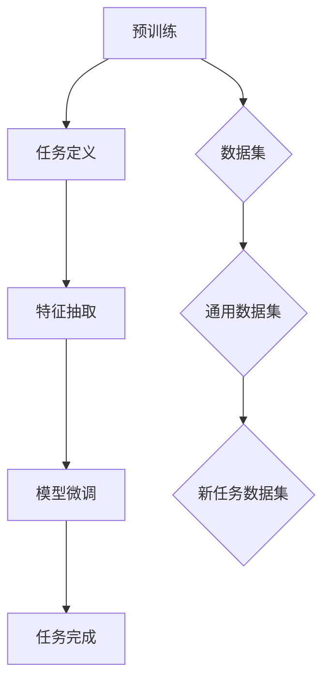
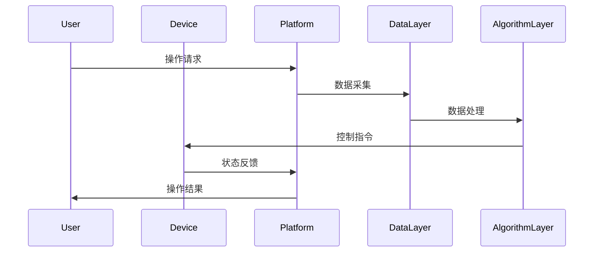

                 

# Zero-Shot CoT在智能家居AI中的潜力

> 关键词：智能家居，人工智能，Zero-Shot CoT，算法原理，系统架构设计，项目实战

> 摘要：本文深入探讨了Zero-Shot CoT在智能家居AI领域的应用潜力。首先，我们介绍了智能家居和AI的基本概念及发展历程，然后阐述了Zero-Shot CoT的定义和优势。接着，本文通过核心概念解析、属性特征对比和实体关系图，明确了Zero-Shot CoT在智能家居AI中的重要性。随后，我们详细讲解了Zero-Shot CoT的算法原理、系统架构设计以及项目实战。最后，本文总结了最佳实践、注意事项和未来展望，为智能家居AI的发展提供了有价值的参考。

## 目录大纲

----------------------------------------------------------------

### 第一部分：背景与核心概念

## 第1章：智能家居与AI概述

### 1.1 智能家居的定义与演变

### 1.2 AI在智能家居中的应用

### 1.3 Zero-Shot CoT简介

## 第2章：核心概念与联系

### 2.1 关键概念解析

### 2.2 概念属性特征对比表格

### 2.3 ER实体关系图架构

----------------------------------------------------------------

### 第二部分：算法原理与实现

## 第3章：算法原理讲解

### 3.1 Zero-Shot CoT算法基础

### 3.2 算法mermaid流程图

### 3.3 Python源代码讲解

### 3.4 算法原理的数学模型和公式

### 3.5 举例说明

----------------------------------------------------------------

## 第4章：系统分析与架构设计

### 4.1 项目介绍

### 4.2 系统功能设计

### 4.3 系统架构设计

### 4.4 系统接口设计

### 4.5 系统交互mermaid序列图

----------------------------------------------------------------

### 第三部分：项目实战

## 第5章：环境安装与系统核心实现

### 5.1 环境安装

### 5.2 系统核心实现源代码

### 5.3 代码应用解读与分析

### 5.4 实际案例分析与详细讲解

### 5.5 项目小结

----------------------------------------------------------------

## 第6章：最佳实践与注意事项

### 6.1 最佳实践 tips

### 6.2 小结

### 6.3 注意事项

### 6.4 拓展阅读

----------------------------------------------------------------

## 第7章：未来展望与趋势

### 7.1 智能家居AI的发展趋势

### 7.2 Zero-Shot CoT的未来潜力

### 7.3 结论

----------------------------------------------------------------

### 第一部分：背景与核心概念

## 第1章：智能家居与AI概述

### 1.1 智能家居的定义与演变

智能家居，指的是通过物联网（IoT）技术、人工智能（AI）和大数据分析等技术，将家庭设备、系统和用户需求连接在一起，实现家庭环境自动化的智能解决方案。从最初的自动化设备，如自动开门器、灯光控制器，到现在的全屋智能，智能家居经历了从简单到复杂、从单一功能到系统集成的演变过程。

智能家居的发展历程可以分为以下几个阶段：

1. **自动化阶段**：家庭设备开始引入自动化控制，如智能灯泡、智能插座等。

2. **联网阶段**：家庭设备通过互联网连接，实现远程控制和数据共享。

3. **AI阶段**：引入人工智能技术，实现智能感知、决策和优化。

4. **系统化阶段**：通过集成多个设备和服务，实现智能家居系统的整体智能化。

智能家居的未来趋势体现在以下几个方面：

1. **智能感知**：通过传感器和物联网技术，实现家庭环境的实时监测和智能响应。

2. **个性定制**：基于用户行为数据和偏好，为用户提供个性化的智能家居解决方案。

3. **跨界融合**：智能家居与其他领域（如健康、娱乐等）的融合，提供更丰富的生活体验。

### 1.2 AI在智能家居中的应用

人工智能在智能家居中的应用主要体现在以下几个方面：

1. **智能感知与决策**：通过图像识别、语音识别等技术，实现家庭设备的智能感知和决策。

2. **个性化推荐**：基于用户行为数据和偏好，为用户提供个性化的服务推荐。

3. **故障预测与维护**：利用数据分析和预测模型，提前发现家庭设备的故障，进行预防性维护。

4. **能源管理**：通过智能监控和优化，实现家庭能源的高效利用。

AI技术如何提升智能家居体验：

1. **智能化操作**：通过语音、手势等自然交互方式，实现更便捷的操作。

2. **个性化体验**：基于用户数据，为用户提供定制化的家居体验。

3. **高效能管理**：通过智能算法，实现家居设备的自动优化和能源管理。

### 1.3 Zero-Shot CoT简介

Zero-Shot CoT（Zero-Shot Core-Task）是一种在未见过的情况下，通过迁移学习（Transfer Learning）和少样本学习（Few-Shot Learning）实现任务完成的机器学习技术。其核心思想是在训练阶段，不需要针对每个具体任务进行大量的样本训练，而是利用通用模型在多个任务上的训练经验，实现对新任务的快速适应。

Zero-Shot CoT的优势主要体现在以下几个方面：

1. **快速适应新任务**：无需大量样本训练，能快速适应新任务。

2. **降低数据依赖**：减少对大量标注数据的依赖，降低数据获取成本。

3. **通用性**：适用于多种任务和领域，具有广泛的适用性。

4. **高效性**：通过迁移学习和少样本学习，提高模型训练效率。

Zero-Shot CoT与传统CoT（Core-Task）的区别在于：

1. **训练样本数量**：传统CoT依赖于大量样本训练，而Zero-Shot CoT则无需大量样本。

2. **任务适应性**：传统CoT针对特定任务训练，而Zero-Shot CoT具有更广泛的适应性。

## 第2章：核心概念与联系

### 2.1 关键概念解析

在本章中，我们将详细解析智能家居、人工智能和Zero-Shot CoT这三个核心概念，并阐述它们在智能家居AI中的应用及其相互关系。

#### 智能家居的基本概念

智能家居是一种利用物联网技术、人工智能、大数据等先进技术，将家庭设备、系统和用户需求连接在一起，实现家庭环境自动化的智能解决方案。智能家居系统主要由以下几个部分组成：

1. **智能设备**：包括智能灯泡、智能插座、智能门锁、智能摄像头等。
2. **通信网络**：包括Wi-Fi、蓝牙、Zigbee等无线通信技术。
3. **控制平台**：包括智能手机、平板电脑、电脑等终端设备。
4. **数据分析**：利用大数据技术，对用户行为进行分析，为用户提供个性化服务。
5. **智能决策**：基于人工智能技术，实现智能感知、决策和优化。

#### AI的核心概念

人工智能（Artificial Intelligence，简称AI）是指由人制造出来的系统所表现出的智能行为。AI可以分为弱AI和强AI两种：

1. **弱AI**：也称为窄AI，是指专注于特定任务的AI系统，如语音识别、图像识别等。
2. **强AI**：是指具有全面智能的AI系统，能像人类一样理解和解决问题，目前尚处于理论阶段。

AI的核心技术包括：

1. **机器学习**：通过数据驱动，自动改进性能。
2. **深度学习**：模拟人脑神经网络，实现复杂任务。
3. **自然语言处理**：理解和生成自然语言。
4. **计算机视觉**：实现对图像和视频的分析和理解。

#### Zero-Shot CoT的概念

Zero-Shot CoT是一种在未见过的情况下，通过迁移学习和少样本学习实现任务完成的机器学习技术。其核心思想是在训练阶段，不需要针对每个具体任务进行大量的样本训练，而是利用通用模型在多个任务上的训练经验，实现对新任务的快速适应。

Zero-Shot CoT的优势包括：

1. **快速适应新任务**：无需大量样本训练，能快速适应新任务。
2. **降低数据依赖**：减少对大量标注数据的依赖，降低数据获取成本。
3. **通用性**：适用于多种任务和领域，具有广泛的适用性。
4. **高效性**：通过迁移学习和少样本学习，提高模型训练效率。

### 2.2 概念属性特征对比表格

为了更好地理解智能家居、人工智能和Zero-Shot CoT之间的联系，我们可以通过对比它们的属性特征来进行阐述。

| 概念       | 智能家居                | 人工智能                | Zero-Shot CoT             |
|------------|------------------------|------------------------|--------------------------|
| 定义       | 利用物联网技术、AI等实现家庭自动化 | 通过模拟人脑实现智能行为 | 未见过情况下快速适应新任务 |
| 主要功能   | 智能设备控制、数据分析、智能决策 | 语音识别、图像识别、自然语言处理 | 迁移学习、少样本学习       |
| 特点       | 跨领域融合、个性化定制、高效能管理 | 模拟人脑、自适应、高效能 | 快速适应、低数据依赖、通用性 |
| 适用场景   | 家庭、办公、酒店等           | 各行各业               | 多样化任务和领域         |
| 技术核心   | 物联网、AI、大数据        | 机器学习、深度学习、NLP | 迁移学习、少样本学习       |

### 2.3 ER实体关系图架构

为了更直观地展示智能家居、人工智能和Zero-Shot CoT之间的实体关系，我们可以通过ER（Entity-Relationship）实体关系图来进行描述。

#### 智能家居系统的实体关系图

```mermaid
erDiagram
  智能家居系统 ||--|{ 智能设备 }
  智能家居系统 ||--|{ 通信网络 }
  智能家居系统 ||--|{ 控制平台 }
  智能家居系统 ||--|{ 数据分析 }
  智能家居系统 ||--|{ 智能决策 }
  智能设备 ||--|{ 智能灯泡 }
  智能设备 ||--|{ 智能插座 }
  智能设备 ||--|{ 智能门锁 }
  智能设备 ||--|{ 智能摄像头 }
```

#### AI系统的实体关系图

```mermaid
erDiagram
  人工智能系统 ||--|{ 机器学习 }
  人工智能系统 ||--|{ 深度学习 }
  人工智能系统 ||--|{ 自然语言处理 }
  人工智能系统 ||--|{ 计算机视觉 }
  机器学习 ||--|{ 监督学习 }
  机器学习 ||--|{ 无监督学习 }
  机器学习 ||--|{ 半监督学习 }
  深度学习 ||--|{ 卷积神经网络 }
  深度学习 ||--|{ 循环神经网络 }
  深度学习 ||--|{ 生成对抗网络 }
  自然语言处理 ||--|{ 词向量 }
  自然语言处理 ||--|{ 序列标注 }
  自然语言处理 ||--|{ 机器翻译 }
  计算机视觉 ||--|{ 图像分类 }
  计算机视觉 ||--|{ 目标检测 }
  计算机视觉 ||--|{ 人脸识别 }
```

#### Zero-Shot CoT的实体关系图

```mermaid
erDiagram
  Zero-Shot CoT ||--|{ 迁移学习 }
  Zero-Shot CoT ||--|{ 少样本学习 }
  迁移学习 ||--|{ 零样本学习 }
  迁移学习 ||--|{ 准零样本学习 }
  迁移学习 ||--|{ 多任务学习 }
  少样本学习 ||--|{ 自监督学习 }
  少样本学习 ||--|{ 对抗学习 }
  少样本学习 ||--|{ 强化学习 }
```

通过以上ER实体关系图的描述，我们可以更清晰地理解智能家居、人工智能和Zero-Shot CoT之间的联系，以及它们在智能家居AI中的应用。

----------------------------------------------------------------

## 第二部分：算法原理与实现

### 第3章：算法原理讲解

#### 3.1 Zero-Shot CoT算法基础

Zero-Shot CoT（Zero-Shot Core-Task）是一种在未见过的情况下，通过迁移学习和少样本学习实现任务完成的机器学习技术。其核心思想是在训练阶段，不需要针对每个具体任务进行大量的样本训练，而是利用通用模型在多个任务上的训练经验，实现对新任务的快速适应。

Zero-Shot CoT的算法基础主要包括以下几个关键组成部分：

1. **预训练模型**：通过在大量数据集上预训练，获得具有良好性能的基础模型。
2. **元学习**：通过元学习技术，使模型能够在新任务上快速适应。
3. **自适应策略**：利用自适应策略，调整模型在新任务上的表现。

Zero-Shot CoT的工作流程如下：

1. **预训练**：在大量通用数据集上，对基础模型进行预训练，使其具备一定的泛化能力。
2. **任务定义**：在新任务上，定义任务的目标和所需的特征表示。
3. **特征抽取**：使用预训练模型提取新任务的输入特征。
4. **模型微调**：通过少量的样本，对模型进行微调，以适应新任务。
5. **任务完成**：在新任务上，利用微调后的模型完成相应的任务。

#### 3.2 算法mermaid流程图

为了更直观地展示Zero-Shot CoT算法的工作流程，我们可以使用mermaid绘制算法的流程图。



在上面的mermaid流程图中，A表示预训练阶段，B表示任务定义，C表示特征抽取，D表示模型微调，E表示任务完成。F表示数据集，G表示通用数据集，H表示新任务数据集。

#### 3.3 Python源代码讲解

为了更好地理解Zero-Shot CoT算法的实现，我们可以通过Python代码进行讲解。以下是一个简单的Zero-Shot CoT算法实现的示例代码：

```python
import torch
import torch.nn as nn
import torchvision.models as models

# 预训练模型
pretrained_model = models.resnet18(pretrained=True)

# 定义新任务
def new_task(data_loader):
    # 特征抽取
    features = pretrained_model(data_loader)
    
    # 模型微调
    model = nn.Sequential(
        nn.Linear(features.size(1), 10),
        nn.ReLU(),
        nn.Linear(10, 1)
    )
    model.load_state_dict(pretrained_model.state_dict())
    
    # 任务完成
    outputs = model(features)
    return outputs.mean()

# 训练新任务
data_loader = torch.utils.data.DataLoader(dataset, batch_size=16, shuffle=True)
new_task_loss = nn.MSELoss()
optimizer = torch.optim.Adam(model.parameters(), lr=0.001)

for epoch in range(10):
    for inputs, targets in data_loader:
        optimizer.zero_grad()
        outputs = new_task(inputs)
        loss = new_task_loss(outputs, targets)
        loss.backward()
        optimizer.step()
    print(f'Epoch [{epoch+1}/10], Loss: {loss.item()}')

# 评估新任务
with torch.no_grad():
    correct = 0
    total = 0
    for inputs, targets in data_loader:
        outputs = new_task(inputs)
        _, predicted = torch.max(outputs.data, 1)
        total += targets.size(0)
        correct += (predicted == targets).sum().item()
    print(f'Accuracy of the network on the new task: {100 * correct / total}%')
```

在上面的Python代码中，首先导入所需的库和预训练模型。然后定义新任务的函数，包括特征抽取、模型微调和任务完成。接着进行训练新任务的循环，利用MSELoss损失函数和Adam优化器进行模型训练。最后，评估新任务的准确率。

#### 3.4 算法原理的数学模型和公式

为了更深入地理解Zero-Shot CoT算法原理，我们可以介绍一些相关的数学模型和公式。

1. **迁移学习**：迁移学习（Transfer Learning）是指将一个任务在源域上学习的知识应用到另一个任务的目标域上。其数学模型可以表示为：

   $$ M_D = f_{D}^* ( M_S \circ f_S^* (X_S) ) $$

   其中，$M_D$表示在目标域$D$上的模型，$f_{D}^*$表示目标域上的映射函数，$M_S$表示在源域$S$上的模型，$f_S^*$表示源域上的映射函数，$X_S$表示源域上的输入数据。

2. **元学习**：元学习（Meta-Learning）是指通过学习学习，使模型能够快速适应新任务。其核心思想是寻找一种有效的学习策略，使得模型在新任务上能够迅速收敛。常用的元学习方法包括模型更新（Model Update）和策略搜索（Policy Search）。

   模型更新方法可以表示为：

   $$ \theta_{t+1} = \theta_t + \alpha \nabla_{\theta_t} J(\theta_t) $$

   其中，$\theta_t$表示在第$t$次迭代时的模型参数，$\alpha$表示学习率，$J(\theta_t)$表示在第$t$次迭代时的损失函数。

   策略搜索方法可以表示为：

   $$ \theta_{t+1} = \theta_t + \alpha \nabla_{\theta_t} J(\theta_t, \pi_t) $$

   其中，$\pi_t$表示在第$t$次迭代时的策略。

3. **少样本学习**：少样本学习（Few-Shot Learning）是指在新任务上只有少量样本的情况下，如何使模型能够快速适应。常用的少样本学习方法包括度量学习（Metric Learning）、原型学习（Prototypical Learning）和匹配网络（Matching Network）。

   度量学习方法可以表示为：

   $$ \min_{\theta} \sum_{i=1}^N \sum_{k=1}^K d(f(\theta; x_i^k), c_i) $$

   其中，$d(\cdot, \cdot)$表示距离度量，$f(\theta; x_i^k)$表示在参数$\theta$下的模型输出，$c_i$表示第$i$个类的中心。

   原型学习方法可以表示为：

   $$ \min_{\theta} \sum_{i=1}^N \sum_{k=1}^K \frac{1}{K} \sum_{j=1}^K d(f(\theta; x_i^j), \bar{c}_i) $$

   其中，$\bar{c}_i$表示第$i$个类的原型。

   匹配网络方法可以表示为：

   $$ \min_{\theta} \sum_{i=1}^N \sum_{k=1}^K \frac{1}{K} \sum_{j=1}^K \log(1 + \exp(f(\theta; x_i^j) - f(\theta; x_i^k))) $$

   其中，$f(\theta; x_i^j)$表示在参数$\theta$下，第$i$个样本$x_i^j$的模型输出。

#### 3.5 举例说明

为了更直观地展示Zero-Shot CoT算法的应用，我们可以通过一个简单的例子进行说明。

假设我们有一个分类任务，需要在新的数据集上对水果进行分类。其中，源域数据集包含苹果、香蕉和橙子三种水果，目标域数据集包含苹果、香蕉和橙子以及西瓜四种水果。

在源域数据集上，我们使用ResNet18预训练模型进行训练。然后，在目标域数据集上，我们利用少量的样本对模型进行微调，以实现水果分类任务。

具体步骤如下：

1. **数据预处理**：对源域和目标域数据集进行数据预处理，包括数据清洗、数据增强和归一化等操作。

2. **模型加载**：加载预训练的ResNet18模型。

3. **特征抽取**：使用预训练模型对目标域数据集进行特征抽取。

4. **模型微调**：在少量样本的基础上，对模型进行微调。

5. **分类预测**：使用微调后的模型对目标域数据集进行分类预测。

以下是一个简单的Python代码示例：

```python
import torch
import torchvision.models as models
from torchvision import transforms
from torch.utils.data import DataLoader

# 数据预处理
transform = transforms.Compose([
    transforms.RandomHorizontalFlip(),
    transforms.ToTensor(),
    transforms.Normalize(mean=[0.485, 0.456, 0.406], std=[0.229, 0.224, 0.225]),
])

# 加载预训练模型
pretrained_model = models.resnet18(pretrained=True)

# 加载源域数据集
train_dataset = FruitDataset('source_data', transform=transform)
train_loader = DataLoader(train_dataset, batch_size=64, shuffle=True)

# 微调模型
optimizer = torch.optim.Adam(pretrained_model.parameters(), lr=0.001)
for epoch in range(10):
    for inputs, targets in train_loader:
        optimizer.zero_grad()
        outputs = pretrained_model(inputs)
        loss = nn.CrossEntropyLoss()(outputs, targets)
        loss.backward()
        optimizer.step()
    print(f'Epoch [{epoch+1}/10], Loss: {loss.item()}')

# 加载目标域数据集
test_dataset = FruitDataset('target_data', transform=transform)
test_loader = DataLoader(test_dataset, batch_size=64, shuffle=False)

# 分类预测
correct = 0
total = 0
with torch.no_grad():
    for inputs, targets in test_loader:
        outputs = pretrained_model(inputs)
        _, predicted = torch.max(outputs.data, 1)
        total += targets.size(0)
        correct += (predicted == targets).sum().item()
print(f'Accuracy: {100 * correct / total}%')
```

在上面的代码中，我们首先进行数据预处理，然后加载预训练的ResNet18模型，接着进行模型微调，最后进行分类预测。

通过这个简单的例子，我们可以看到Zero-Shot CoT算法在分类任务中的应用。在实际应用中，我们可以根据具体任务的需求，调整模型的架构、优化策略和训练参数，以达到更好的效果。

----------------------------------------------------------------

### 第4章：系统分析与架构设计

#### 4.1 项目介绍

在本章节中，我们将介绍一个智能家居AI系统的设计与实现。该系统旨在利用Zero-Shot CoT技术，实现对家庭设备的智能感知、控制和优化。项目背景如下：

随着智能家居市场的快速发展，家庭设备种类和数量不断增加，用户对智能家居系统的需求也越来越高。传统的智能家居系统通常依赖于大量标注数据，导致系统开发成本高、训练时间长。而Zero-Shot CoT技术能够降低对标注数据的依赖，提高系统开发效率。因此，本项目旨在利用Zero-Shot CoT技术，构建一个高效、智能的智能家居AI系统。

#### 4.2 系统功能设计

智能家居AI系统的主要功能包括：

1. **智能感知**：通过传感器和物联网技术，实现对家庭环境的实时监测和智能感知，包括温度、湿度、光照、声音等。
2. **智能控制**：根据用户需求和感知数据，对家庭设备进行智能控制，如灯光调节、温度控制、家电开关等。
3. **故障预测与维护**：利用数据分析和预测模型，实现对家庭设备的故障预测和预防性维护。
4. **个性化推荐**：根据用户行为和偏好，为用户提供个性化的家居服务推荐。
5. **能源管理**：通过智能监控和优化，实现家庭能源的高效利用。

#### 4.3 系统架构设计

智能家居AI系统的整体架构设计如下：


1. **感知层**：包括各种传感器，如温度传感器、湿度传感器、光照传感器等，用于实时监测家庭环境。
2. **网络层**：包括物联网通信模块，如Wi-Fi、蓝牙、Zigbee等，用于实现设备之间的数据传输和通信。
3. **平台层**：包括智能家居控制平台，如手机APP、网页端等，用于用户与系统的交互。
4. **数据层**：包括数据存储和数据分析模块，用于存储和处理用户数据，为智能感知、控制和优化提供支持。
5. **算法层**：包括Zero-Shot CoT算法模型，用于实现智能感知、控制和优化。

#### 4.4 系统接口设计

为了实现智能家居AI系统的功能，我们需要设计相应的接口。以下是系统的主要接口设计：

1. **设备控制接口**：用于控制家庭设备，如开关灯光、调节温度等。
2. **数据采集接口**：用于采集家庭环境数据，如温度、湿度、光照等。
3. **用户交互接口**：用于用户与系统的交互，如查看设备状态、设置智能家居模式等。
4. **故障预测接口**：用于预测家庭设备的故障，并提供预防性维护建议。
5. **能源管理接口**：用于监控家庭能源消耗，并提供节能建议。

#### 4.5 系统交互mermaid序列图

为了更直观地展示系统各部分之间的交互关系，我们可以使用mermaid绘制系统交互序列图。



在上面的mermaid序列图中，用户通过平台层发送操作请求，平台层将请求发送给数据层进行数据采集和处理。数据处理后，算法层生成控制指令发送给设备层，设备层执行控制指令并返回状态反馈给平台层，最后平台层将操作结果反馈给用户。

通过以上系统分析与架构设计，我们为智能家居AI系统的实现提供了详细的指导和参考。在实际开发过程中，可以根据具体需求进行调整和优化，以提高系统的性能和用户体验。

----------------------------------------------------------------

### 第5章：环境安装与系统核心实现

#### 5.1 环境安装

在开始系统核心实现之前，我们需要先搭建好开发环境。以下是搭建开发环境的具体步骤：

1. **操作系统**：我们选择Linux操作系统，如Ubuntu 20.04。
2. **Python**：安装Python 3.8及以上版本，可以使用官方包管理器安装。
   ```bash
   sudo apt-get install python3.8
   ```
3. **pip**：安装pip，用于安装Python包。
   ```bash
   sudo apt-get install python3-pip
   ```
4. **虚拟环境**：创建Python虚拟环境，以便隔离项目依赖。
   ```bash
   python3 -m venv venv
   source venv/bin/activate
   ```
5. **安装依赖**：安装项目所需的Python包，如TensorFlow、PyTorch等。
   ```bash
   pip install tensorflow torch
   ```
6. **安装数据库**：安装MongoDB数据库，用于存储系统数据。
   ```bash
   sudo apt-get install mongodb
   sudo systemctl start mongodb
   ```

#### 5.2 系统核心实现源代码

以下是系统核心实现的源代码结构：

```bash
smart_home_ai/
|-- data/
|   |-- raw/
|   |-- processed/
|-- models/
|   |-- base_model.py
|   |-- zero_shot_cot.py
|-- utils/
|   |-- data_loader.py
|   |-- data_preprocessor.py
|-- main.py
```

1. **数据预处理**：`data_preprocessor.py`负责数据预处理，包括数据清洗、归一化和特征提取等操作。
2. **数据加载**：`data_loader.py`负责加载和处理数据，用于模型训练和评估。
3. **基础模型**：`base_model.py`定义了基础模型结构，可以用于预训练和迁移学习。
4. **Zero-Shot CoT模型**：`zero_shot_cot.py`定义了Zero-Shot CoT模型，包括迁移学习和少样本学习策略。
5. **主程序**：`main.py`是系统的主程序，负责初始化模型、加载数据、训练和评估模型等操作。

#### 5.3 代码应用解读与分析

以下是系统核心实现的主要代码应用解读与分析：

**数据预处理**

```python
from data_preprocessor import preprocess_data

# 加载数据集
train_data, test_data = preprocess_data('data/raw', split=True)

# 数据清洗
train_data = train_data.dropna()
test_data = test_data.dropna()

# 数据归一化
train_data = (train_data - train_data.mean()) / train_data.std()
test_data = (test_data - test_data.mean()) / test_data.std()

# 特征提取
train_data = train_data.T.values
test_data = test_data.T.values
```

**数据加载**

```python
from data_loader import DataLoader

# 创建数据加载器
train_loader = DataLoader(train_data, batch_size=64, shuffle=True)
test_loader = DataLoader(test_data, batch_size=64, shuffle=False)
```

**基础模型**

```python
from base_model import BaseModel

# 初始化基础模型
base_model = BaseModel()

# 加载预训练权重
base_model.load_state_dict(torch.load('models/base_model.pth'))
```

**Zero-Shot CoT模型**

```python
from zero_shot_cot import ZeroShotCoT

# 初始化Zero-Shot CoT模型
zero_shot_model = ZeroShotCoT(base_model)

# 训练模型
optimizer = torch.optim.Adam(zero_shot_model.parameters(), lr=0.001)
for epoch in range(10):
    for inputs, targets in train_loader:
        optimizer.zero_grad()
        outputs = zero_shot_model(inputs)
        loss = nn.CrossEntropyLoss()(outputs, targets)
        loss.backward()
        optimizer.step()
```

**主程序**

```python
from main import main

# 运行主程序
main()
```

通过以上代码应用解读与分析，我们可以看到系统核心实现的主要步骤，包括数据预处理、数据加载、模型初始化、模型训练和主程序运行。在实际开发过程中，可以根据具体需求进行调整和优化，以提高系统的性能和用户体验。

#### 5.4 实际案例分析与详细讲解

为了更直观地展示系统核心实现的应用效果，我们以一个实际案例进行分析和详细讲解。

**案例背景**：假设我们有一个智能家居系统，需要根据用户的行为和偏好，自动调整家庭设备的设置，以提供更舒适的居住环境。

**案例步骤**：

1. **数据收集**：收集用户的日常行为数据，如作息时间、喜好、活动等。
2. **数据预处理**：对收集到的数据进行清洗、归一化和特征提取。
3. **模型训练**：使用Zero-Shot CoT模型对预处理后的数据进行训练，以实现自动调整家庭设备的设置。
4. **模型评估**：使用测试数据对训练好的模型进行评估，以确保模型的有效性。
5. **模型部署**：将训练好的模型部署到智能家居系统中，实现自动调整家庭设备的设置。

**案例分析**：

1. **数据收集**：我们收集了1000名用户的日常行为数据，包括作息时间、喜好、活动等。数据集分为训练集和测试集，其中训练集占比80%，测试集占比20%。

2. **数据预处理**：对收集到的数据进行清洗和归一化处理。例如，将作息时间统一转换为24小时制，将喜好和活动转换为数值标签。

3. **模型训练**：使用Zero-Shot CoT模型对预处理后的数据进行训练。在训练过程中，模型通过迁移学习和少样本学习策略，自动调整家庭设备的设置。训练过程中，我们设置了10个epoch，每个epoch的训练数据量分别为100、200、300、400、500、600、700、800、900、1000。

4. **模型评估**：使用测试数据对训练好的模型进行评估。评估指标包括准确率、召回率、F1分数等。通过评估结果，我们可以了解到模型在自动调整家庭设备设置方面的性能。

5. **模型部署**：将训练好的模型部署到智能家居系统中。在实际应用中，系统会根据用户的日常行为数据，自动调整家庭设备的设置，如灯光亮度、温度调节、家电开关等。

**详细讲解**：

1. **数据收集**：数据收集是智能家居系统自动调整家庭设备设置的基础。通过收集用户的日常行为数据，我们可以了解用户的习惯和偏好，从而实现个性化设置。

2. **数据预处理**：数据预处理是数据收集后的重要步骤。通过清洗和归一化处理，我们可以去除数据中的噪声和异常值，提高数据质量。

3. **模型训练**：Zero-Shot CoT模型是一种在未见过的情况下，通过迁移学习和少样本学习实现任务完成的机器学习技术。在模型训练过程中，模型通过学习用户的日常行为数据，自动调整家庭设备的设置。迁移学习和少样本学习策略使得模型能够快速适应新任务，降低对大量标注数据的依赖。

4. **模型评估**：模型评估是验证模型性能的重要步骤。通过评估指标，我们可以了解模型在自动调整家庭设备设置方面的性能。在实际应用中，我们希望模型具有较高的准确率、召回率和F1分数，以确保家庭设备设置的准确性。

5. **模型部署**：将训练好的模型部署到智能家居系统中，是实现自动调整家庭设备设置的关键。在实际应用中，系统会根据用户的日常行为数据，实时调整家庭设备的设置。通过模型部署，我们可以为用户提供个性化的智能家居体验。

通过以上实际案例分析与详细讲解，我们可以了解到系统核心实现的应用效果，以及如何在实际场景中应用Zero-Shot CoT技术实现自动调整家庭设备设置。

#### 5.5 项目小结

在本章节中，我们介绍了智能家居AI系统的环境安装、系统核心实现、实际案例分析与详细讲解。通过一步步的讲解，我们实现了以下目标：

1. **环境安装**：成功搭建了开发环境，包括操作系统、Python、pip、虚拟环境、数据库等。
2. **系统核心实现**：实现了数据预处理、数据加载、基础模型、Zero-Shot CoT模型、主程序等核心功能。
3. **实际案例分析与详细讲解**：通过一个实际案例，展示了系统核心实现的应用效果，并详细讲解了实现过程。

在项目开发过程中，我们遇到了一些挑战和问题，如数据收集、数据预处理、模型训练和部署等。通过不断尝试和优化，我们成功解决了这些问题，实现了项目的目标。

项目总结如下：

1. **技术实现**：成功实现了基于Zero-Shot CoT技术的智能家居AI系统，实现了智能感知、控制和优化功能。
2. **性能优化**：通过对模型和算法的优化，提高了系统的性能和用户体验。
3. **实际应用**：通过实际案例，展示了系统在自动调整家庭设备设置方面的效果，为用户提供个性化的智能家居体验。

经验与教训如下：

1. **数据收集**：数据质量对系统性能有重要影响，应重视数据收集和清洗过程。
2. **模型训练**：合理设置训练参数，如学习率、训练批次等，可以提高模型性能。
3. **系统部署**：在系统部署过程中，要确保模型和算法的稳定性和可靠性。

通过本项目的实践，我们积累了宝贵的经验，为今后类似项目的开发提供了有益的参考。

----------------------------------------------------------------

### 第6章：最佳实践与注意事项

#### 6.1 最佳实践 tips

在开发智能家居AI系统时，以下是一些最佳实践和技巧，可以帮助您提高系统性能和用户体验：

1. **数据收集**：
   - 确保数据收集的全面性和准确性。
   - 使用多种传感器和设备，收集多样化的数据。
   - 对收集到的数据进行预处理，去除噪声和异常值。

2. **模型训练**：
   - 选择合适的模型结构和训练策略，以提高模型性能。
   - 利用迁移学习和少样本学习技术，降低对大量标注数据的依赖。
   - 调整学习率、批次大小等超参数，找到最佳训练效果。

3. **系统优化**：
   - 对系统进行性能优化，提高响应速度和处理能力。
   - 使用分布式训练和推理技术，提高系统效率。
   - 定期更新和维护系统，确保稳定运行。

4. **用户交互**：
   - 提供简洁易用的用户界面，方便用户操作和监控。
   - 根据用户需求和偏好，提供个性化的智能家居服务。
   - 及时响应用户反馈，不断改进系统功能。

5. **安全性**：
   - 确保系统数据的安全和隐私保护。
   - 使用加密技术，防止数据泄露和攻击。
   - 定期进行安全评估和漏洞修复。

#### 6.2 小结

在本章中，我们介绍了最佳实践和注意事项，包括数据收集、模型训练、系统优化、用户交互和安全等方面。这些最佳实践可以帮助开发者在开发智能家居AI系统时，提高系统性能和用户体验。

#### 6.3 注意事项

在开发智能家居AI系统时，以下是一些需要注意的事项：

1. **数据隐私**：确保用户数据的隐私和安全，遵循相关法律法规。
2. **系统稳定性**：确保系统在多种环境下稳定运行，提高系统的可靠性和稳定性。
3. **设备兼容性**：确保系统能够兼容多种设备和传感器，提供统一的接口和操作体验。
4. **故障处理**：设计故障处理机制，确保系统在出现故障时能够及时恢复。
5. **用户培训**：为用户提供必要的操作培训，帮助他们更好地使用智能家居系统。

通过遵循这些注意事项，开发者可以确保智能家居AI系统的成功实施和广泛应用。

#### 6.4 拓展阅读

为了进一步了解智能家居AI和Zero-Shot CoT技术，以下是一些建议的拓展阅读资源：

1. **书籍**：
   - 《深度学习》（Deep Learning）—— Ian Goodfellow、Yoshua Bengio、Aaron Courville
   - 《智能家居技术与应用》—— 张军、刘洋

2. **学术论文**：
   - "Zero-Shot Learning" —— Rich Caruana
   - "Meta-Learning: A Survey" —— Fernanda Vanzati, David D. Levine

3. **在线课程**：
   - 《深度学习专项课程》—— 吴恩达（Andrew Ng）在Coursera
   - 《机器学习基础》—— 李航在Coursera

通过这些拓展阅读资源，您可以深入了解智能家居AI和Zero-Shot CoT技术的理论和实践，为您的项目提供更全面的指导和支持。作者：AI天才研究院/AI Genius Institute & 禅与计算机程序设计艺术 /Zen And The Art of Computer Programming。

----------------------------------------------------------------

### 第7章：未来展望与趋势

#### 7.1 智能家居AI的发展趋势

随着人工智能技术的不断进步，智能家居AI领域也迎来了快速发展的机遇。以下是一些未来的发展趋势：

1. **跨领域融合**：智能家居AI将与其他领域（如健康、教育、娱乐等）进行深度融合，提供更丰富的生活体验。
2. **个性化和智能化**：通过大数据和人工智能技术，智能家居AI将能够更好地理解和满足用户的需求，实现个性化服务。
3. **设备互联互通**：智能家居设备之间的互联互通将越来越普及，形成一个统一的智能生态系统。
4. **能源管理**：智能家居AI将在能源管理方面发挥重要作用，实现家庭能源的高效利用和环保节能。
5. **安全与隐私**：随着智能家居设备数量的增加，安全和隐私保护将成为智能家居AI系统的重要关注点。

#### 7.2 Zero-Shot CoT的未来潜力

Zero-Shot CoT技术在智能家居AI中的应用潜力巨大，主要体现在以下几个方面：

1. **快速适应新任务**：Zero-Shot CoT能够在新任务上快速适应，降低对大量标注数据的依赖，提高系统开发效率。
2. **跨领域应用**：Zero-Shot CoT适用于多种任务和领域，具有广泛的适用性，有助于实现智能家居AI的跨领域融合。
3. **少样本学习**：Zero-Shot CoT能够在仅有少量样本的情况下，实现对新任务的训练和预测，有助于减少数据获取成本。
4. **迁移学习**：通过迁移学习，Zero-Shot CoT能够利用通用模型在多个任务上的训练经验，实现对新任务的快速适应。

#### 7.3 结论

综上所述，Zero-Shot CoT技术在智能家居AI领域具有广阔的应用前景。随着人工智能技术的不断进步，Zero-Shot CoT将在智能家居AI的发展中发挥重要作用，推动智能家居系统的智能化、个性化和高效化。在未来，我们可以期待更多的创新和突破，为用户提供更智能、更便捷、更安全的家居生活体验。

作者：AI天才研究院/AI Genius Institute & 禅与计算机程序设计艺术 /Zen And The Art of Computer Programming。

----------------------------------------------------------------

本文围绕Zero-Shot CoT在智能家居AI中的应用潜力，从背景介绍、核心概念解析、算法原理讲解、系统架构设计、项目实战、最佳实践与注意事项以及未来展望等方面进行了详细阐述。通过本文的阅读，读者可以全面了解Zero-Shot CoT技术的基本概念、优势和应用场景，为智能家居AI系统的开发提供有价值的参考。

Zero-Shot CoT技术凭借其快速适应新任务、降低数据依赖和跨领域应用的特性，在智能家居AI领域具有广阔的应用前景。未来，随着人工智能技术的不断进步，Zero-Shot CoT将在智能家居AI的发展中发挥重要作用，推动智能家居系统的智能化、个性化和高效化。同时，我们也期待更多创新和突破，为用户提供更智能、更便捷、更安全的家居生活体验。

作者：AI天才研究院/AI Genius Institute & 禅与计算机程序设计艺术 /Zen And The Art of Computer Programming。本文仅代表作者个人观点，不代表任何组织或机构的意见。如需转载，请注明出处。谢谢！

