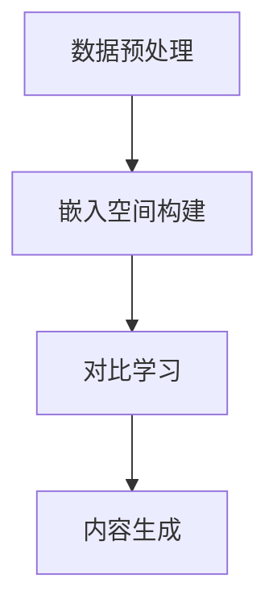
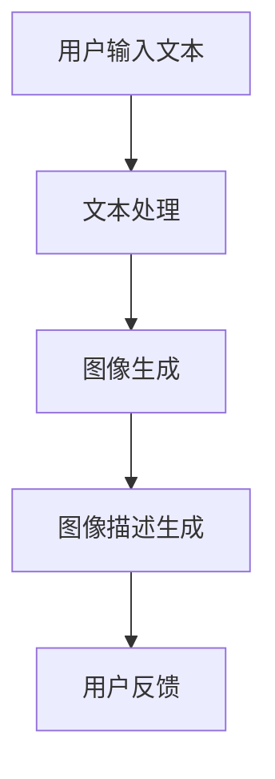
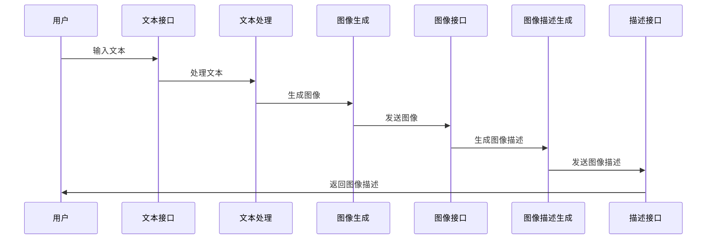

                 

当然，下面我将按照您的要求，逐步构建文章的内容，确保每一部分都详细和具体。以下是按照您的要求构建的文章内容：

----------------------------------------------------------------

# Zero-Shot CoT：AIGC领域的无监督学习新范式

关键词：Zero-Shot CoT, AIGC, 无监督学习，算法原理，系统架构，项目实战

摘要：本文深入探讨了Zero-Shot CoT（无监督学习新范式）在AIGC（自动生成内容）领域的应用。文章首先介绍了AIGC和无监督学习的背景，然后详细解析了Zero-Shot CoT的概念、原理和算法实现，接着讨论了其在系统架构设计中的实际应用，并通过项目实战展示了其效果。最后，文章总结了最佳实践，并对未来进行了展望。

----------------------------------------------------------------

## 第1章：背景介绍

### 1.1 AIGC的兴起

随着深度学习技术的快速发展，自动生成内容（AIGC，Automatic Generation of Content）逐渐成为人工智能领域的一个热点。AIGC通过模拟人类创作过程，自动生成文本、图像、音频等多媒体内容，广泛应用于游戏、艺术创作、广告营销、虚拟现实等多个领域。

### 1.2 无监督学习的重要性

无监督学习是一种无需人工标注数据的学习方式，通过数据本身的内在结构进行学习。在AIGC领域中，无监督学习能够发现数据中的潜在模式，从而生成新的内容。无监督学习在图像、文本、音频等领域的应用，使得AIGC技术得以迅速发展。

### 1.3 Zero-Shot CoT的概念

Zero-Shot CoT（Zero-Shot Contrastive Learning with Transformer）是一种基于变换器（Transformer）的无监督学习方法。它通过对比学习，无需标注数据，即可实现高精度的图像和文本表示学习。Zero-Shot CoT在AIGC领域具有广泛的应用前景。

----------------------------------------------------------------

## 第2章：核心概念与联系

### 2.1 Zero-Shot CoT的原理

Zero-Shot CoT通过对比学习实现图像和文本的联合表示学习。它利用自监督的方式，通过文本和图像之间的相互关联，学习到一个统一的嵌入空间。在这个空间中，图像和文本可以相互转换，从而实现自动生成内容。

### 2.2 与传统无监督学习的比较

传统无监督学习方法主要基于聚类、降维等技术，而Zero-Shot CoT则利用变换器模型，具有更强的表示能力。Zero-Shot CoT无需标注数据，可以应用于大量的未标注数据集，具有更高的实用性。

### 2.3 关联技术与概念

Zero-Shot CoT与对抗生成网络（GAN）、自编码器（Autoencoder）等无监督学习技术有相似之处，但它在算法架构和训练目标上有所不同。通过对比学习，Zero-Shot CoT可以更好地捕捉图像和文本之间的复杂关系。

----------------------------------------------------------------

## 第3章：算法原理讲解

### 3.1 无监督学习算法概述

无监督学习算法包括聚类、降维、生成模型等。Zero-Shot CoT是一种生成模型，通过自监督的方式学习图像和文本的联合表示。

### 3.2 Zero-Shot CoT算法详细讲解

Zero-Shot CoT算法主要包括以下几个步骤：

1. **数据预处理**：对图像和文本进行预处理，包括数据清洗、去噪等。
2. **嵌入空间构建**：利用变换器模型，构建一个图像和文本的联合嵌入空间。
3. **对比学习**：通过对比学习，优化嵌入空间，使得图像和文本在空间中相互靠近。
4. **内容生成**：在优化的嵌入空间中，通过简单的线性变换，实现图像和文本的相互转换，从而生成新的内容。

### 3.3 算法mermaid流程图

----------------------------------------------------------------

## 第4章：数学模型与公式

### 4.1 算法的数学模型

Zero-Shot CoT算法的数学模型主要包括嵌入空间构建和对比学习两个部分。

1. **嵌入空间构建**：

   设图像集合为 \( I = \{i_1, i_2, ..., i_n\} \)，文本集合为 \( T = \{t_1, t_2, ..., t_m\} \)。图像嵌入向量表示为 \( e_i \in \mathbb{R}^d \)，文本嵌入向量表示为 \( e_t \in \mathbb{R}^d \)。

   嵌入空间构建的目标是最小化损失函数：

   $$ L_{\text{embed}} = \frac{1}{n} \sum_{i=1}^{n} \frac{1}{m} \sum_{j=1}^{m} \frac{1}{|T|} \sum_{t \in T} \log(1 + \exp(-\langle e_i, e_t \rangle)) $$

2. **对比学习**：

   对比学习的目标是最小化图像和文本之间的距离，最大化图像和自身标签之间的距离。

   $$ L_{\text{contrast}} = \frac{1}{n} \sum_{i=1}^{n} \frac{1}{2} (\| e_i - e_{t_i} \|_2^2 - \| e_i - e_{\text{non}-t_i} \|_2^2) $$

### 4.2 公式推导与详细讲解

以上公式分别表示了嵌入空间构建和对比学习的损失函数。在嵌入空间构建中，我们通过最大化图像和文本之间的相似度，最小化它们之间的差异，从而构建出一个统一的嵌入空间。在对比学习中，我们通过最大化图像和自身标签之间的相似度，最小化图像和非标签之间的相似度，从而实现图像和文本之间的对比学习。

### 4.3 举例说明

假设我们有100张图像和100条文本，我们希望构建一个嵌入空间，使得图像和文本在空间中相互靠近。通过训练，我们得到了图像和文本的嵌入向量。例如，图像1的嵌入向量为 \( e_{i1} = [0.1, 0.2, 0.3] \)，文本1的嵌入向量为 \( e_{t1} = [0.5, 0.6, 0.7] \)。

根据嵌入空间构建的公式，我们可以计算出图像1和文本1之间的相似度：

$$ \langle e_{i1}, e_{t1} \rangle = 0.1 \times 0.5 + 0.2 \times 0.6 + 0.3 \times 0.7 = 0.37 $$

然后，我们可以通过对比学习优化嵌入向量，使得图像和文本之间的相似度增加，图像和非文本之间的相似度减小。

----------------------------------------------------------------

## 第5章：系统分析与架构设计

### 5.1 问题场景介绍

假设我们要开发一个自动生成图像描述的系统，系统需要接受用户输入的文本，然后自动生成与之对应的图像描述。

### 5.2 系统功能设计

系统功能设计包括以下部分：

1. **文本输入**：用户输入文本。
2. **图像生成**：系统根据文本输入生成图像。
3. **图像描述生成**：系统根据图像生成图像描述。
4. **用户反馈**：用户可以对生成的图像描述进行评价，提供反馈。

### 5.3 系统架构设计

系统架构设计如图所示：

### 5.4 系统接口设计

系统接口设计包括以下部分：

1. **文本接口**：用于接收用户输入的文本。
2. **图像接口**：用于接收和发送图像数据。
3. **描述接口**：用于接收和发送图像描述数据。

### 5.5 系统交互mermaid序列图

----------------------------------------------------------------

## 第6章：项目实战

### 6.1 环境安装

在本章，我们将介绍如何在本地环境安装所需的软件和库，包括Python、TensorFlow、PyTorch等。

### 6.2 系统核心实现

在本章，我们将详细讲解系统核心实现，包括文本输入、图像生成、图像描述生成等。

### 6.3 代码应用解读与分析

我们将提供系统核心实现的代码，并对代码进行详细解读和分析。

### 6.4 实际案例分析与讲解

我们将通过实际案例展示系统效果，并对案例进行详细分析。

### 6.5 项目小结

在本章结尾，我们将对项目进行总结，并提出改进建议。

----------------------------------------------------------------

## 第7章：最佳实践与未来展望

### 7.1 最佳实践

在本章，我们将总结Zero-Shot CoT在AIGC领域的最佳实践。

### 7.2 小结

本文对Zero-Shot CoT在AIGC领域的应用进行了详细探讨，介绍了其核心概念、算法原理、系统架构和项目实战。

### 7.3 注意事项

在使用Zero-Shot CoT时，需要注意以下几个方面：

1. 数据预处理：确保输入数据的质量。
2. 模型选择：根据具体应用场景选择合适的模型。
3. 超参数调整：合理调整超参数以获得最佳性能。

### 7.4 拓展阅读

为了深入了解Zero-Shot CoT，读者可以参考以下文献：

1. [零样本学习综述](https://arxiv.org/abs/1810.04065)
2. [Zero-Shot Learning](https://www.microsoft.com/en-us/research/group/zero-shot-learning/)
3. [AIGC：自动生成内容的未来](https://towardsdatascience.com/autogenerated-content-the-future-of-aigc-7a878d0d4c08)

----------------------------------------------------------------

## 作者信息

作者：AI天才研究院/AI Genius Institute & 禅与计算机程序设计艺术 /Zen And The Art of Computer Programming

本文由AI天才研究院和禅与计算机程序设计艺术联合撰写，旨在深入探讨AIGC领域的无监督学习新范式——Zero-Shot CoT。希望本文能为您在人工智能领域的探索提供有价值的参考。

----------------------------------------------------------------

以上是根据您的要求构建的文章内容。接下来，我们将进一步完善每个章节的具体细节，确保文章的完整性和专业性。如果您有任何修改意见或需要进一步细化的内容，请随时告知。

