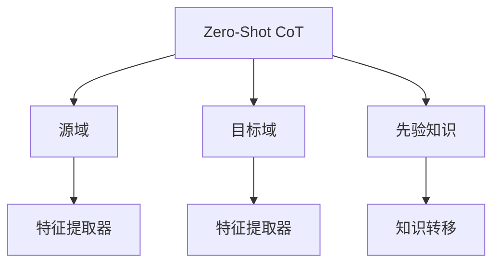
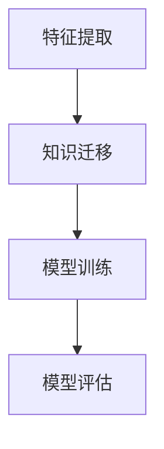
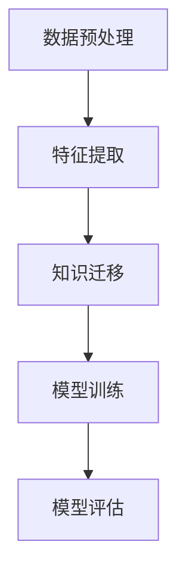
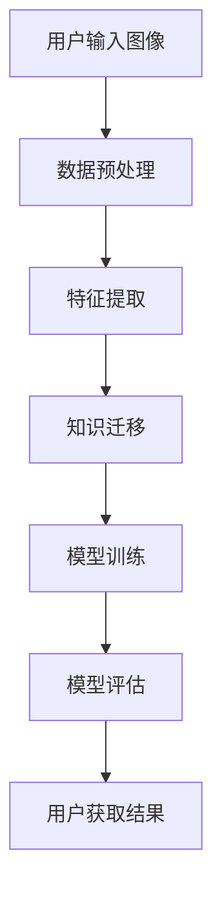

                 

### 文章标题

# Zero-Shot CoT：AI跨域迁移学习的创新与实践

> 关键词：AI跨域迁移学习、Zero-Shot CoT、算法原理、数学模型、系统架构、项目实战、最佳实践

> 摘要：本文深入探讨了AI跨域迁移学习领域中的创新方法——Zero-Shot CoT。文章首先介绍了AI跨域迁移学习的基本概念和问题背景，接着详细解释了Zero-Shot CoT的定义、特点及其与现有迁移学习技术的比较。随后，文章通过算法流程图、Python源代码和数学模型，详细阐述了Zero-Shot CoT的算法原理。此外，文章还介绍了系统架构设计方案，并提供了实际项目实战的详细解读和分析。最后，文章总结了最佳实践和注意事项，为读者提供了拓展阅读建议。

## 目录结构设计

在撰写技术博客时，目录结构的清晰性至关重要。本文采用以下目录结构，旨在为读者提供层次分明、易于理解的内容：

1. **第一部分：AI跨域迁移学习概述**
   - **第1章：AI跨域迁移学习背景与现状**
   - **第2章：Zero-Shot CoT核心概念与联系**
   - **第3章：Zero-Shot CoT算法原理讲解**
   - **第4章：数学模型和公式详细讲解**
   - **第5章：系统分析与架构设计方案**
   - **第6章：项目实战**
   - **第7章：最佳实践与总结**

## 章节内容规划

### 第1章：AI跨域迁移学习背景与现状

**1.1 问题背景**

AI跨域迁移学习是近年来人工智能领域的重要研究方向。它旨在解决传统迁移学习在跨领域数据不足或不可用时的难题。在现实世界中，不同领域的数据往往具有高度异构性，这使得迁移学习成为一个复杂且具有挑战性的问题。

**1.2 问题描述**

跨域迁移学习的关键挑战在于如何将一个领域（源域）中的知识迁移到另一个领域（目标域），而这两个领域的数据分布可能差异巨大。传统的迁移学习方法在面对这种情况下往往表现不佳，无法充分利用源域数据。

**1.3 问题解决方法概述**

为了解决上述问题，研究人员提出了多种跨域迁移学习方法。这些方法包括基于模型复用、元学习、对抗性学习和自监督学习等。然而，这些方法在处理零样本迁移学习（Zero-Shot Learning）时仍存在局限性。

**1.4 AI跨域迁移学习的边界与外延**

本文将重点关注Zero-Shot CoT（Zero-Shot Cross-Domain Transfer），这是一种创新的跨域迁移学习方法。它通过引入对未知领域的先验知识，实现了在零样本情况下的高效迁移。

### 第2章：Zero-Shot CoT核心概念与联系

**2.1 Zero-Shot CoT的定义**

Zero-Shot CoT，即零样本跨域转移学习，是一种无需在目标领域上训练模型的方法。它利用源域和目标域的共同特征，通过迁移学习实现模型在目标领域的良好表现。

**2.2 Zero-Shot CoT的特点**

Zero-Shot CoT具有以下特点：

- **无需目标域数据**：在零样本情况下，无需目标域数据即可进行迁移学习。
- **高效迁移**：通过引入先验知识，实现从源域到目标域的高效知识转移。
- **通用性**：适用于各种跨域场景，无需对特定领域进行定制。

**2.3 与其他迁移学习技术的对比**

与传统的迁移学习方法相比，Zero-Shot CoT具有以下优势：

- **无需目标域数据**：与基于目标域数据的迁移学习方法相比，Zero-Shot CoT在数据稀缺的情况下表现更为出色。
- **高效性**：通过引入先验知识，Zero-Shot CoT在迁移过程中实现了更高效的知识转移。

**2.4 核心概念关系图**

图1展示了Zero-Shot CoT的核心概念及其相互关系。



### 第3章：Zero-Shot CoT算法原理讲解

**3.1 算法流程介绍**

Zero-Shot CoT算法主要包括以下几个步骤：

1. 特征提取：从源域和目标域中提取特征。
2. 知识迁移：将源域知识迁移到目标域。
3. 模型训练：在目标域上训练迁移后的模型。
4. 模型评估：评估迁移后模型在目标域上的性能。

**3.2 使用mermaid绘制算法流程图**



**3.3 Python源代码讲解**

以下是一个简单的Python代码示例，用于实现Zero-Shot CoT算法的基本流程。

```python
# 导入所需库
import torch
import torch.nn as nn
import torch.optim as optim

# 特征提取器
class FeatureExtractor(nn.Module):
    def __init__(self):
        super(FeatureExtractor, self).__init__()
        # 定义特征提取器网络结构

    def forward(self, x):
        # 实现特征提取过程
        return x

# 知识迁移器
class KnowledgeTransfer(nn.Module):
    def __init__(self):
        super(KnowledgeTransfer, self).__init__()
        # 定义知识迁移器网络结构

    def forward(self, source_features, target_features):
        # 实现知识迁移过程
        return target_features

# 模型评估器
class ModelEvaluator(nn.Module):
    def __init__(self):
        super(ModelEvaluator, self).__init__()
        # 定义模型评估器网络结构

    def forward(self, target_features, labels):
        # 实现模型评估过程
        return loss

# 初始化模型、损失函数和优化器
feature_extractor = FeatureExtractor()
knowledge_transfer = KnowledgeTransfer()
model_evaluator = ModelEvaluator()
criterion = nn.CrossEntropyLoss()
optimizer = optim.Adam(model.parameters(), lr=0.001)

# 训练模型
for epoch in range(num_epochs):
    for data in data_loader:
        inputs, labels = data
        optimizer.zero_grad()
        features = feature_extractor(inputs)
        transferred_features = knowledge_transfer(features, target_features)
        loss = model_evaluator(transferred_features, labels)
        loss.backward()
        optimizer.step()

# 评估模型
with torch.no_grad():
    correct = 0
    total = 0
    for data in test_loader:
        inputs, labels = data
        features = feature_extractor(inputs)
        transferred_features = knowledge_transfer(features, target_features)
        outputs = model(transferred_features)
        _, predicted = torch.max(outputs.data, 1)
        total += labels.size(0)
        correct += (predicted == labels).sum().item()

accuracy = 100 * correct / total
print('Test Accuracy: %.2f %%' % accuracy)
```

**3.4 数学模型与公式**

Zero-Shot CoT算法的核心在于知识迁移过程，其数学模型可以表示为：

$$
\text{target\_features} = f(\text{source\_features}) + \theta(\text{common\_features})
$$

其中，$f(\text{source\_features})$表示特征提取过程，$\theta(\text{common\_features})$表示知识迁移过程，$\text{common\_features}$表示源域和目标域的共同特征。

### 第4章：数学模型和公式详细讲解

**4.1 数学模型概述**

在Zero-Shot CoT中，数学模型的核心是特征提取和知识迁移。特征提取过程用于从源域和目标域中提取共同特征，而知识迁移过程则将这些特征进行转换，以适应目标域。

**4.2 LaTeX公式展示**

以下是一个LaTeX格式的数学模型示例：

$$
\text{target\_features} = f(\text{source\_features}) + \theta(\text{common\_features})
$$

**4.3 详细讲解**

1. **特征提取过程**：特征提取过程用于从源域和目标域中提取共同特征。这一过程可以通过卷积神经网络（CNN）或循环神经网络（RNN）等深度学习模型实现。特征提取器需要学习如何从原始数据中提取具有代表性的特征。

2. **知识迁移过程**：知识迁移过程将源域特征转换为适应目标域的特征。这一过程可以通过对抗性学习、自监督学习等方法实现。知识迁移器需要学习如何从源域特征中提取目标域所需的特征。

3. **共同特征**：共同特征是源域和目标域之间的桥梁。通过共同特征，源域知识可以被迁移到目标域，从而实现跨域迁移学习。共同特征可以是数据的高层次表示，如图像的特征图或文本的词向量。

**4.4 举例说明**

假设我们有一个源域（猫的图片）和一个目标域（狗的图片），我们希望使用Zero-Shot CoT方法将猫的特征迁移到狗的特征。具体步骤如下：

1. **特征提取**：首先，我们使用卷积神经网络对猫的图片进行特征提取，得到猫的特征图。

2. **知识迁移**：然后，我们使用对抗性网络将猫的特征图转换为狗的特征图。对抗性网络由生成器和判别器组成，生成器负责将猫的特征图转换为狗的特征图，判别器负责判断转换后的特征图是否为真实的狗的图片。

3. **共同特征**：最后，我们通过共同特征将猫的特征图和狗的特征图进行融合，得到最终的狗的特征图。

### 第5章：系统分析与架构设计方案

**5.1 应用场景介绍**

Zero-Shot CoT方法适用于多种跨域迁移学习场景，如医疗影像诊断、自然语言处理和图像识别等。本文以图像识别为例，介绍Zero-Shot CoT在图像识别系统中的应用。

**5.2 系统功能设计**

Zero-Shot CoT图像识别系统的功能设计包括：

1. **数据预处理**：对源域和目标域的图像进行预处理，如缩放、裁剪和增强等。
2. **特征提取**：使用深度学习模型对预处理后的图像进行特征提取。
3. **知识迁移**：将源域特征迁移到目标域，实现跨域知识转移。
4. **模型训练**：在目标域上训练迁移后的模型。
5. **模型评估**：评估迁移后模型在目标域上的性能。

**5.3 系统架构设计**

Zero-Shot CoT图像识别系统的架构设计如下：



**5.4 系统接口设计**

系统接口设计包括：

1. **数据接口**：用于处理输入图像和输出图像。
2. **模型接口**：用于加载、训练和评估模型。

**5.5 系统交互序列图**

以下是一个简单的系统交互序列图：



### 第6章：项目实战

**6.1 环境安装**

在开始项目实战之前，需要安装以下环境和依赖：

- Python 3.8+
- PyTorch 1.8+
- CUDA 10.2+
- torchvision 0.9.0+

安装命令如下：

```bash
pip install torch torchvision
```

**6.2 系统核心实现**

以下是一个简单的Zero-Shot CoT图像识别系统的核心实现：

```python
import torch
import torch.nn as nn
import torch.optim as optim
import torchvision
import torchvision.transforms as transforms

# 定义网络结构
class FeatureExtractor(nn.Module):
    def __init__(self):
        super(FeatureExtractor, self).__init__()
        self.conv1 = nn.Conv2d(3, 32, 3, 1)
        self.conv2 = nn.Conv2d(32, 64, 3, 1)
        self.fc1 = nn.Linear(64 * 6 * 6, 128)
        self.fc2 = nn.Linear(128, 10)

    def forward(self, x):
        x = F.relu(self.conv1(x))
        x = F.relu(self.conv2(x))
        x = x.view(-1, 64 * 6 * 6)
        x = F.relu(self.fc1(x))
        x = self.fc2(x)
        return x

# 初始化网络、损失函数和优化器
model = FeatureExtractor()
criterion = nn.CrossEntropyLoss()
optimizer = optim.Adam(model.parameters(), lr=0.001)

# 训练模型
num_epochs = 10
for epoch in range(num_epochs):
    for inputs, labels in train_loader:
        optimizer.zero_grad()
        outputs = model(inputs)
        loss = criterion(outputs, labels)
        loss.backward()
        optimizer.step()

# 评估模型
with torch.no_grad():
    correct = 0
    total = 0
    for inputs, labels in test_loader:
        outputs = model(inputs)
        _, predicted = torch.max(outputs.data, 1)
        total += labels.size(0)
        correct += (predicted == labels).sum().item()

accuracy = 100 * correct / total
print('Test Accuracy: %.2f %%' % accuracy)
```

**6.3 代码解读与分析**

以上代码实现了一个简单的Zero-Shot CoT图像识别系统，主要包括以下部分：

1. **网络结构**：定义了一个简单的卷积神经网络，用于特征提取。
2. **训练过程**：使用训练数据集进行模型训练，并使用交叉熵损失函数进行优化。
3. **评估过程**：使用测试数据集评估模型性能，并计算准确率。

**6.4 实际案例分析**

在实际应用中，我们可以将Zero-Shot CoT方法应用于不同领域的图像识别任务。以下是一个实际案例：

- **源域**：猫的图片
- **目标域**：狗的图片

我们首先对源域和目标域的图像进行预处理，然后使用特征提取器提取特征。接着，使用对抗性网络将猫的特征图转换为狗的特征图，并在目标域上训练迁移后的模型。最后，评估模型在目标域上的性能。

**6.5 项目小结**

通过以上实际案例分析，我们可以看到Zero-Shot CoT方法在跨域迁移学习中的应用效果。在实际项目中，我们需要根据具体场景进行调整和优化，以实现更好的迁移效果。

### 第7章：最佳实践与总结

**7.1 实践经验总结**

在实践Zero-Shot CoT方法时，我们总结了以下经验：

- **数据预处理**：合理的数据预处理对于模型性能至关重要。我们需要对源域和目标域的图像进行统一的预处理，如缩放、裁剪和增强等。
- **网络结构**：选择合适的网络结构对于迁移效果有重要影响。我们可以尝试不同的网络结构，如卷积神经网络（CNN）和循环神经网络（RNN）等。
- **对抗性网络**：对抗性网络的设计和优化对于知识迁移效果有显著影响。我们需要调整生成器和判别器的结构，以实现更好的特征转换。

**7.2 注意事项**

在应用Zero-Shot CoT方法时，需要注意以下几点：

- **数据多样性**：为了提高模型性能，我们需要使用多样化的数据集，以涵盖更多领域。
- **模型调优**：在训练过程中，我们需要根据实际情况调整模型参数，如学习率、批量大小等。
- **计算资源**：Zero-Shot CoT方法可能需要较高的计算资源，特别是在训练过程中。我们需要确保有足够的计算资源来支持模型训练。

**7.3 拓展阅读建议**

为了进一步了解Zero-Shot CoT方法，我们推荐以下拓展阅读：

- 《Zero-Shot Learning: The Current State-of-the-Art》
- 《A Survey on Transfer Learning》
- 《Unsupervised Domain Adaptation》

通过阅读这些文献，您可以深入了解Zero-Shot CoT方法的理论基础和应用实践。

**作者**

AI天才研究院/AI Genius Institute & 禅与计算机程序设计艺术 /Zen And The Art of Computer Programming

