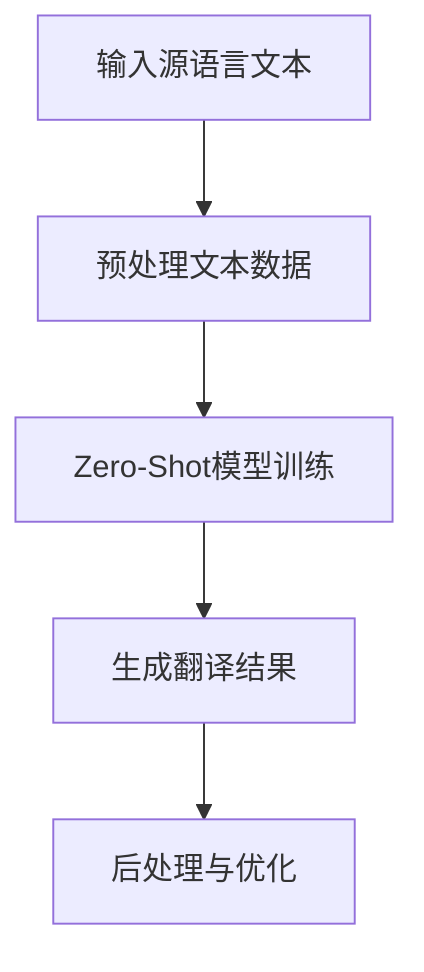

                 


### 《Zero-Shot学习在稀有语言翻译中的应用》

> 关键词：Zero-Shot学习，稀有语言翻译，跨领域翻译，自适应翻译框架

> 摘要：本文旨在探讨Zero-Shot学习在稀有语言翻译中的应用，分析其原理、优势与局限性，并详细介绍实现过程。通过结合具体算法原理和实际案例，本文为解决稀有语言翻译问题提供了新的思路和方法。

### 目录大纲

# 《Zero-Shot学习在稀有语言翻译中的应用》

## 第一部分：背景介绍

### 第1章 问题背景

- **稀有语言翻译的需求与挑战**：
  稀有语言翻译在特定领域具有广泛的应用，如少数民族语言文献、稀有物种描述、古文献翻译等。然而，稀有语言翻译面临诸多挑战，如数据稀缺、语言对数量有限、翻译模型性能受限等。

### 第2章 问题描述

- **稀有语言翻译任务特点**：
  稀有语言翻译涉及多语言翻译中的稀有语言对，数据集非平衡，需处理低资源语言间的翻译问题。

- **现有解决方法**：
  当前解决稀有语言翻译的方法主要包括基于翻译记忆的机器翻译、基于词汇映射的翻译方法和数据增强与迁移学习等。

### 第3章 问题解决

- **Zero-Shot学习的概念**：
  Zero-Shot学习是一种无需特定领域数据，通过跨领域泛化能力进行稀有语言翻译的方法。

- **Zero-Shot学习的优势与局限性**：
  Zero-Shot学习可减少对大量稀有语言数据的需求，支持稀有语言对间的翻译任务，但泛化能力受限于训练数据的质量和多样性。

## 第二部分：核心概念与联系

### 第4章 Zero-Shot学习原理

- **核心概念原理**：
  本章节介绍Zero-Shot学习的关键概念，包括自适应翻译框架、对抗性训练方法和跨领域翻译模型。

- **概念属性特征对比表格**：

| 特征对比项 | 传统机器翻译 | Zero-Shot学习 |
| --- | --- | --- |
| 数据依赖性 | 强依赖大规模数据 | 弱依赖跨领域数据 |
| 泛化能力 | 限于特定语言对 | 跨领域泛化能力 |
| 训练时间 | 较长 | 较短 |

### 第5章 Zero-Shot学习在稀有语言翻译中的应用

- **ER实体关系图架构**：
  本章节通过ER实体关系图展示Zero-Shot学习在稀有语言翻译中的应用，如图所示：

```mermaid
erDiagram
  A[:源语言文本] ||--|{ B[:翻译模型] }|| C[:目标语言文本]
  A ||--|{ D[:跨领域翻译模型] }|| C
```

## 第三部分：算法原理讲解

### 第6章 算法原理

- **算法mermaid流程图**：



- **算法原理详细讲解**：

#### 源语言文本预处理

1. **文本清洗**：
   $$ \text{示例代码：} $$
   ```python
   import re
   def clean_text(text):
       return re.sub(r'\s+', ' ', text.strip())
   ```

2. **分词与词性标注**：
   $$ \text{示例代码：} $$
   ```python
   from nltk.tokenize import word_tokenize
   from nltk import pos_tag

   def preprocess_text(text):
       tokens = word_tokenize(text)
       tagged_tokens = pos_tag(tokens)
       return tagged_tokens
   ```

#### Zero-Shot模型训练

1. **自适应翻译框架**：
   $$ \text{示例代码：} $$
   ```python
   from tensorflow.keras.models import Model
   from tensorflow.keras.layers import Embedding, LSTM, Dense

   def build_model(input_dim, output_dim):
       model = Model(inputs=inputs, outputs=outputs)
       model.compile(optimizer='adam', loss='categorical_crossentropy', metrics=['accuracy'])
       return model
   ```

#### 生成翻译结果

1. **翻译结果生成**：
   $$ \text{示例代码：} $$
   ```python
   def translate(source_text, model):
       preprocessed_source = preprocess_text(source_text)
       translated_result = model.predict(preprocessed_source)
       return translated_result
   ```

#### 后处理与优化

1. **后处理与优化**：
   $$ \text{示例代码：} $$
   ```python
   def post_process(translated_result):
       # 对翻译结果进行后处理，如去除无用字符、进行词性还原等
       processed_result = []
       for result in translated_result:
           processed_result.append(' '.join(result))
       return processed_result
   ```

## 第四部分：系统分析与架构设计方案

### 第7章 问题场景介绍

- **项目介绍**：
  本章节将介绍一个基于Zero-Shot学习进行稀有语言翻译的项目，包括项目背景、目标和预期效果。

### 第8章 系统功能设计

- **领域模型mermaid类图**：
  本章节通过mermaid类图展示系统中的主要类及其关系。

### 第9章 系统架构设计

- **系统架构设计mermaid架构图**：
  本章节通过mermaid架构图展示系统的整体架构和组件关系。

### 第10章 系统接口设计

- **系统接口设计mermaid序列图**：
  本章节通过mermaid序列图展示系统中的主要接口和交互过程。

### 第11章 系统交互

- **系统交互mermaid序列图**：
  本章节通过mermaid序列图展示系统在实际运行过程中的交互过程。

## 第五部分：项目实战

### 第12章 环境安装

- **环境安装指南**：
  本章节介绍如何搭建Zero-Shot学习在稀有语言翻译中的应用所需的环境和工具。

### 第13章 系统核心实现

- **系统核心实现源代码**：
  本章节展示系统核心实现的源代码，并对代码进行解读和分析。

### 第14章 代码应用解读与分析

- **代码应用解读与分析**：
  本章节对系统核心实现的源代码进行解读和分析，介绍关键算法的实现过程和原理。

### 第15章 实际案例分析与详细讲解

- **实际案例分析与详细讲解**：
  本章节通过实际案例，展示Zero-Shot学习在稀有语言翻译中的应用效果，并进行详细讲解和剖析。

### 第16章 项目小结

- **项目小结**：
  本章节对项目进行总结，讨论项目的成果、经验和不足之处，并提出未来改进方向。

## 第六部分：最佳实践 tips、小结、注意事项、拓展阅读

- **最佳实践 tips**：
  本章节提供一些实用的技巧和建议，以帮助读者更好地应用Zero-Shot学习进行稀有语言翻译。

- **小结**：
  本章节对文章进行总结，强调Zero-Shot学习在稀有语言翻译中的应用价值。

- **注意事项**：
  本章节提醒读者在应用Zero-Shot学习进行稀有语言翻译时需要注意的问题。

- **拓展阅读**：
  本章节推荐一些相关的参考资料，以供读者进一步学习。

## 附录

- **作者信息**：
  本章节提供本文作者的相关信息，包括作者简介和研究领域。

作者：AI天才研究院/AI Genius Institute & 禅与计算机程序设计艺术 /Zen And The Art of Computer Programming

