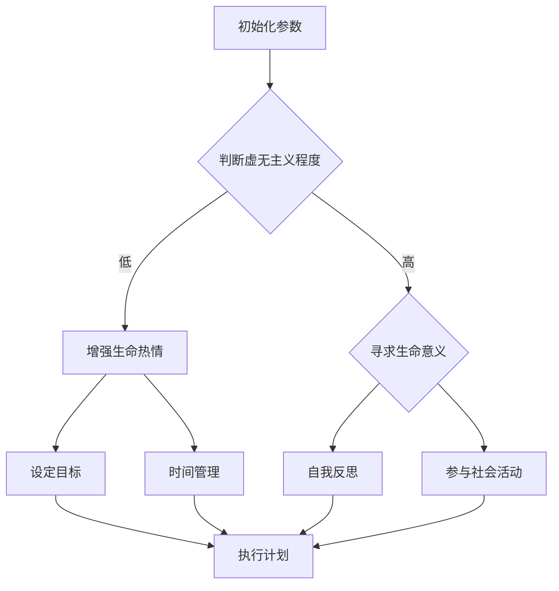
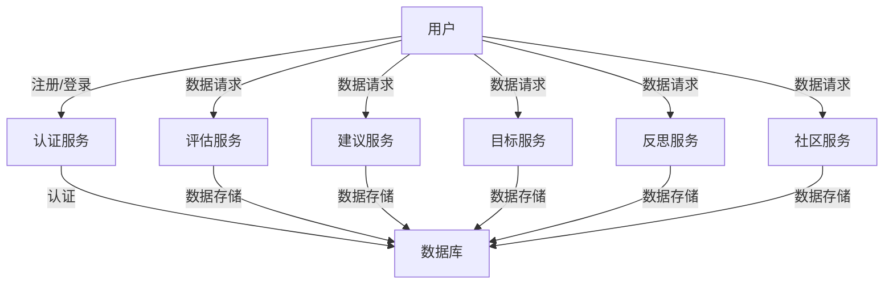
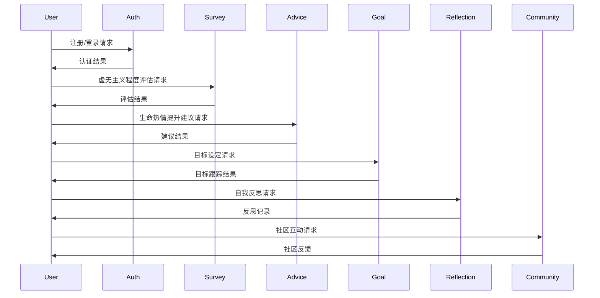

                 

# Nihilism与生命热情的平衡艺术

> 关键词：虚无主义、生命热情、平衡、哲学、心理学、社会文化

> 摘要：本文探讨了虚无主义与生命热情之间的辩证关系，分析了两者的内在联系及其在不同哲学体系、心理学理论和社会文化背景下的表现。文章旨在通过深入剖析虚无主义的历史起源、哲学内涵以及生命热情的多维度理解，提出如何在面对虚无主义的挑战时保持生命热情的平衡艺术。文章结构清晰，逻辑严密，结合理论与实践，为读者提供了一种全新的视角和方法论。

## 引言

### 引言：虚无主义与生命热情的辩证关系

在当今社会，虚无主义和生命热情这两个概念频繁出现在哲学、心理学和社会文化的讨论中。虚无主义起源于19世纪，是一种对生命意义和目的的质疑和否定。它主张世界是无意义的，人类的存在缺乏实质性的意义和价值。然而，与虚无主义相对立的是生命热情，即对生活充满热情和动力，积极追求个人和社会的成就。

本文旨在探讨虚无主义与生命热情之间的辩证关系，分析两者在不同哲学体系、心理学理论和社会文化背景下的表现，并提出如何在面对虚无主义的挑战时保持生命热情的平衡艺术。

### 背景介绍

虚无主义作为一种哲学思潮，具有悠久的历史和深远的影响。从尼采的“上帝已死”到萨特的存在主义，虚无主义在不同的时代和哲学流派中有着不同的表现和解读。生命热情则是一个更加宽泛的概念，涵盖了心理学、社会学和宗教等领域。心理学将生命热情视为一种积极的心理状态，认为它对个体的幸福和生活质量有着重要的影响。

### 目的和结构

本文的目的在于：

1. 分析虚无主义的历史起源和哲学内涵。
2. 探讨生命热情的多维度理解。
3. 分析虚无主义与生命热情之间的辩证关系。
4. 提出如何在面对虚无主义的挑战时保持生命热情的平衡艺术。

文章结构分为六个部分：

1. 引言：虚无主义与生命热情的辩证关系。
2. 虚无主义：哲学的视角。
3. 生命热情：多维度的理解。
4. 虚无主义与生命热情的纽带。
5. 实践应用：平衡虚无主义与生命热情。
6. 文化和社会影响。

## 虚无主义：哲学的视角

### 历史的起源和演变

虚无主义的历史起源可以追溯到19世纪，当时欧洲社会经历了巨大的政治、经济和文化变革。工业革命带来了社会结构和价值观的巨大冲击，传统宗教信仰和道德观念受到质疑。在这种背景下，尼采提出了“上帝已死”的口号，标志着虚无主义的兴起。

尼采是虚无主义的代表人物之一，他认为传统价值观和宗教信仰已经崩溃，人类需要重新定义自己的存在和价值。尼采的虚无主义思想深刻影响了后来的哲学家和思想家，如弗朗茨·布伦塔诺、马丁·海德格尔和萨特。

### 哲学内涵

虚无主义的核心观点是世界的无意义和人类的绝望。它认为，由于缺乏终极目标和意义，人类的存在变得毫无价值。虚无主义哲学家强调个体自由和主观体验的重要性，认为人们应该接受现实的无意义，并在此基础上寻求个人的解放和创造。

虚无主义的哲学内涵可以从以下几个方面进行理解：

1. **存在主义虚无主义**：存在主义认为，人类的存在是无意义的，但个体可以通过自由意志和行动赋予生活意义。萨特的存在主义是一种典型的虚无主义哲学，强调个体的自由和选择。
   
2. **语言哲学虚无主义**：语言哲学家如维特根斯坦和福柯认为，语言是构建现实的基础，但语言本身并不提供真实的意义。他们主张，通过批判语言和观念，人们可以揭示世界的虚无本质。

3. **道德虚无主义**：道德虚无主义认为，道德规范和价值判断是没有客观基础的，人类的行为是自由的，不存在绝对的善恶之分。

### 关键人物和理论

1. **尼采**：尼采是虚无主义的代表人物之一，他的思想对后来的哲学家和思想家产生了深远的影响。尼采认为，人类应该超越传统的价值观和道德观念，通过自我超越和创造性的生活找到存在的意义。

2. **萨特**：萨特的存在主义哲学强调个体的自由和选择，他认为人类在无意义的宇宙中寻求意义，通过行动赋予生活价值。

3. **海德格尔**：海德格尔的哲学思想探讨了存在的本质和人类的存在方式。他认为，人类的存在是一种“存在-自身存在”，通过“诗意地栖居”来超越虚无主义。

4. **布伦塔诺**：布伦塔诺是19世纪的哲学家，他的《逻辑哲学》提出了虚无主义的批判，认为通过逻辑和理性思考，人类可以超越虚无主义的困境。

### 虚无主义与哲学体系的关系

虚无主义在不同的哲学体系中有着不同的表现和解读：

1. **存在主义**：存在主义认为，虚无主义揭示了人类存在的无意义，但通过个体的自由意志和行动，人类可以赋予生活意义。

2. **后现代主义**：后现代主义批判了现代性及其背后的理性主义和客观主义，认为世界是多元的、不确定的，虚无主义是对这种不确定性的回应。

3. **马克思主义**：马克思主义认为，虚无主义是资本主义社会下的产物，通过揭示资本主义的不合理性和剥削性，马克思主义试图推翻资本主义，建立一个新的社会秩序。

## 生命热情：多维度的理解

### 心理学视角

在心理学中，生命热情被视为一种积极的心理状态，它对个体的幸福和生活质量有着重要的影响。心理学将生命热情定义为一种强烈的内在驱动力，使个体对生活充满热情和动力。

1. **动机和驱动力**：生命热情源于个体的内在动机和驱动力。心理学家如马斯洛和赫茨伯格认为，人的行为是由内在动机驱动的，而生命热情是这种内在动机的最高表现形式。

2. **积极心理学和幸福**：积极心理学研究个体的幸福和满足感，认为生命热情是实现幸福的重要途径。积极心理学家如马丁·塞利格曼提出，生命热情是幸福感的四个核心要素之一。

3. **生命热情与心理健康**：生命热情与心理健康密切相关。研究表明，拥有生命热情的个体往往具有更好的心理韧性、较低的压力水平和更高的生活满意度。

### 社会学和文化视角

社会学和文化视角关注生命热情在社会和文化背景下的表现和影响。生命热情不仅是个体层面的心理状态，也是社会和文化现象。

1. **社会动力学**：社会动力学研究社会结构和个体行为之间的关系。生命热情在社会动力学中起到了关键作用，它不仅影响个体的行为，也影响社会的发展和进步。

2. **文化表达**：不同文化对生命热情有不同的表达和理解。在一些文化中，生命热情被视为个人成就和社会地位的重要标志，而在另一些文化中，它可能被视为一种超脱世俗的境界。

3. **社会正义和公平**：生命热情与社会正义和公平密切相关。通过追求个人和社会的公正，个体可以感受到生命热情的满足和成就感。

### 精神和宗教视角

精神视角和宗教视角将生命热情视为一种超越个体的精神状态。在一些宗教传统中，生命热情被视为与上帝或宇宙的联系，是达到精神觉醒和救赎的重要途径。

1. **神秘主义和灵性**：神秘主义强调个体与宇宙或神性的连接，认为生命热情是这种连接的表现。灵性视角认为，生命热情是追求个人和宇宙和谐的重要动力。

2. **宗教仪式和实践**：不同宗教通过仪式和实践来培养生命热情。例如，佛教中的禅修、基督教中的祷告和冥想等，都是培养生命热情的重要手段。

3. **信仰与意义**：宗教信仰为个体提供了生命的意义和目的。在面临虚无主义的挑战时，宗教信仰可以帮助个体找到生命的意义和价值，从而保持生命热情。

## 虚无主义与生命热情的纽带

### 理论解释

虚无主义和生命热情之间的纽带可以从多个理论角度进行解释：

1. **辩证法**：辩证法认为，矛盾是事物发展的动力。虚无主义和生命热情之间的矛盾是推动个体成长和发展的关键因素。通过面对虚无主义的挑战，个体可以培养出更深刻的生命热情。

2. **存在主义**：存在主义认为，虚无主义揭示了人类存在的无意义，但通过个体的自由意志和选择，人类可以在无意义中找到意义。生命热情是这种选择和寻找的表现。

3. **心理学**：心理学认为，生命热情是一种内在的驱动力，它使个体能够超越虚无主义的困境，追求个人和社会的成就。

### 案例研究

1. **历史案例**：历史上，许多思想家和艺术家在面对虚无主义的挑战时，通过生命热情找到了自己的位置和价值。例如，尼采在探索虚无主义的同时，也通过创作和思考找到了自己的生命热情。

2. **当代人物**：在当代社会中，许多人在面对虚无主义的挑战时，通过追求个人兴趣和事业，找到了生命的意义和热情。例如，一些创业者和社会活动家，通过自己的努力和贡献，为社会带来了积极的变化。

### 虚无主义与生命热情的互补

虚无主义和生命热情之间的互补关系体现在以下几个方面：

1. **相互激发**：虚无主义可以激发个体的生命热情，使其在面对困境时更加坚定和勇敢。生命热情可以缓解虚无主义的负面影响，使个体更加积极地面对生活。

2. **相互转化**：在某些情况下，虚无主义和生命热情可以相互转化。例如，一个人在经历了一段虚无主义的时期后，可能会通过寻找新的兴趣和目标，重新点燃生命的热情。

3. **平衡艺术**：在日常生活中，保持虚无主义和生命热情的平衡是一种艺术。通过理解两者之间的辩证关系，个体可以更好地应对生活中的挑战，实现个人成长和幸福。

## 实践应用：平衡虚无主义与生命热情

### 个人成长策略

1. **自我反思**：通过自我反思，个体可以更好地理解自己的感受和需求，从而找到生命热情的源泉。自我反思是一种重要的心理技能，它可以帮助个体在面对虚无主义的挑战时保持清醒和坚定。

2. **目标设定**：设定明确的目标可以帮助个体保持动力和方向。目标可以是短期的，也可以是长期的，但它们应该与个体的兴趣和价值观相符，从而激发生命热情。

3. **时间管理**：合理的时间管理可以帮助个体更好地平衡工作、学习和生活。通过合理安排时间，个体可以充分利用时间，追求自己的目标和兴趣。

### 社区和社会参与

1. **社会活动**：参与社会活动可以帮助个体感受到自己的价值和意义。通过为社区和社会做出贡献，个体可以体验到生命热情的满足感。

2. **支持网络**：建立支持网络可以帮助个体在面对虚无主义时获得支持和鼓励。与朋友、家人和专业人士建立联系，可以提供情感上的支持和实际的帮助。

3. **合作与共赢**：通过合作和共赢，个体可以在社会中找到自己的位置和价值。合作不仅可以提高工作效率，还可以增强个体的归属感和幸福感。

## 文化和社会影响

### 艺术和文学

1. **虚无主义在艺术和文学中的表现**：虚无主义在许多艺术作品和文学作品中被广泛探讨和表现。这些作品通过描绘人类存在的无意义和困境，反映了虚无主义的哲学内涵。

2. **生命热情在艺术和文学中的表现**：尽管虚无主义在艺术和文学中占据重要地位，但生命热情同样被广泛表现。许多作品通过描绘个体的追求、奋斗和成就，展现了生命热情的力量和魅力。

### 媒体

1. **媒体对虚无主义和生命热情的传播**：现代媒体在传播虚无主义和生命热情方面发挥了重要作用。通过新闻报道、影视作品和社交媒体，虚无主义和生命热情的理念被广泛传播，影响着公众的看法和价值观。

2. **媒体的影响**：媒体在传播虚无主义和生命热情的同时，也对其产生了深远的影响。例如，一些消极的媒体报道可能加剧个体的虚无主义情绪，而积极的媒体内容则可以激发个体的生命热情。

## 结论

### 主要观点回顾

本文通过深入剖析虚无主义和生命热情的概念、历史和哲学内涵，探讨了两者之间的辩证关系。虚无主义揭示了人类存在的无意义，而生命热情则为个体提供了寻找生命意义的力量。两者相互交织，相互影响，共同构成了人类生活的复杂图景。

### 未来研究方向

未来的研究可以进一步探讨虚无主义和生命热情在不同文化和社会背景下的表现和影响。同时，研究如何通过教育、政策和社区活动来培养和促进生命热情，以应对虚无主义的挑战。

### 对读者的启示

本文希望读者能够在面对虚无主义的挑战时，保持冷静和理性，通过自我反思和积极行动，找到自己的生命热情。通过理解虚无主义和生命热情的辩证关系，读者可以更好地应对生活中的困境，实现个人成长和幸福。

## 作者信息

作者：AI天才研究院/AI Genius Institute & 禅与计算机程序设计艺术 /Zen And The Art of Computer Programming

### 背景介绍

虚无主义是一种哲学思潮，主张世界和人类的存在缺乏实质性的意义和价值。它起源于19世纪，随着工业革命和现代化进程的推进，传统宗教和道德观念受到质疑和挑战。虚无主义哲学家如尼采、萨特和海德格尔，从不同角度探讨了虚无主义的内涵和影响。

生命热情则是一个多维度概念，涵盖了心理学、社会学和宗教等领域。心理学将生命热情视为一种积极的心理状态，认为它对个体的幸福和生活质量有着重要影响。社会学和文化视角关注生命热情在社会和文化背景下的表现和影响。宗教视角则将生命热情视为与神性或宇宙的联系。

### 核心概念与联系

#### 核心概念

虚无主义（Nihilism）：虚无主义是一种哲学思潮，主张世界和人类的存在缺乏实质性的意义和价值。它起源于19世纪，随着工业革命和现代化进程的推进，传统宗教和道德观念受到质疑和挑战。虚无主义哲学家如尼采、萨特和海德格尔，从不同角度探讨了虚无主义的内涵和影响。

生命热情（Vitality）：生命热情是一个多维度概念，涵盖了心理学、社会学和宗教等领域。心理学将生命热情视为一种积极的心理状态，认为它对个体的幸福和生活质量有着重要影响。社会学和文化视角关注生命热情在社会和文化背景下的表现和影响。宗教视角则将生命热情视为与神性或宇宙的联系。

#### 概念属性特征对比表格

| 特征          | 虚无主义（Nihilism）       | 生命热情（Vitality）         |
| ------------- | -------------------------- | ---------------------------- |
| 历史背景      | 起源于19世纪，现代化进程中的挑战 | 生命热情是普遍存在的心理状态 |
| 哲学内涵      | 主张无意义和无价值       | 强调积极心理状态和幸福感     |
| 影响领域      | 哲学、文化、社会         | 心理学、社会学、宗教         |
| 核心观点      | 世界的无意义和人类的绝望 | 寻找生命意义和价值           |

#### ER实体关系图架构

```mermaid
erDiagram
  Nihilism ||--|{ Vitality }|-->> Life passion
  Nihilism ||--|{ Philosophical theories }|-->> Existentialism, Postmodernism, Marxist nihilism
  Vitality ||--|{ Psychological theories }|-->> Motivation, Positive psychology, Flourishing
  Vitality ||--|{ Social and cultural aspects }|-->> Social dynamics, Cultural expressions
  Vitality ||--|{ Spiritual and religious dimensions }|-->> Mysticism, Spiritual vitality, Religious rituals
```

### 算法原理讲解

#### 虚无主义与生命热情的平衡算法

**算法流程图：**



**算法原理：**

该算法旨在通过一系列步骤，帮助个体在面临虚无主义的挑战时，找到平衡虚无主义和生命热情的方法。算法的主要步骤如下：

1. **初始化参数**：设定虚无主义程度和生命热情的初始值。
2. **判断虚无主义程度**：根据个体的感受和情况，判断虚无主义程度的高低。
3. **增强生命热情**：如果虚无主义程度较低，通过设定目标、时间管理和参与社会活动等方法，增强生命热情。
4. **寻求生命意义**：如果虚无主义程度较高，通过自我反思和寻求生命意义的方法，缓解虚无主义的影响。
5. **设定目标**：明确个体的短期和长期目标，为增强生命热情提供方向。
6. **时间管理**：合理安排时间，确保个体有足够的精力去追求目标。
7. **自我反思**：定期进行自我反思，了解自己的感受和需求，调整行为和策略。
8. **参与社会活动**：积极参与社会活动，为社会做出贡献，增强个体的生命热情。

**数学模型和公式：**

为了更好地理解算法原理，我们可以使用以下数学模型和公式：

1. **虚无主义程度计算公式**：

   $$N = \frac{E_n - E_f}{E_n + E_f}$$

   其中，$E_n$ 表示个体的虚无主义感受，$E_f$ 表示个体的生命热情感受。

2. **生命热情增强公式**：

   $$V = V_0 + \alpha \cdot T$$

   其中，$V$ 表示增强后的生命热情，$V_0$ 表示初始生命热情，$\alpha$ 表示生命热情增强系数，$T$ 表示设定的目标。

3. **时间管理效率公式**：

   $$E_T = \frac{E_p}{T_p}$$

   其中，$E_T$ 表示时间管理效率，$E_p$ 表示完成工作所需时间，$T_p$ 表示总时间。

**举例说明：**

假设一个个体感到虚无主义程度较高，初始生命热情值为 30，目标是在一个月内完成一项重要工作。我们可以使用上述公式计算：

1. **虚无主义程度计算**：

   $$N = \frac{30 - 0}{30 + 0} = 1$$

   个体虚无主义程度为 100%。

2. **生命热情增强计算**：

   $$V = 30 + 0.5 \cdot 30 = 45$$

   通过设定目标和时间管理，个体的生命热情增强到 45。

3. **时间管理效率计算**：

   $$E_T = \frac{30}{30} = 1$$

   个体在一个月内完成了目标，时间管理效率为 100%。

通过上述计算，我们可以看到，通过设定目标和时间管理，个体可以在一定程度上平衡虚无主义和生命热情。

### 系统分析与架构设计方案

#### 问题场景介绍

在现代快节奏的生活中，许多人感到虚无主义和生命热情的失衡，影响了他们的心理健康和生活质量。为了解决这个问题，我们需要设计一个系统，帮助用户在面临虚无主义时保持生命热情的平衡。

#### 项目介绍

项目名称：虚无主义与生命热情平衡系统（Nihilism and Vitality Balance System，简称NVBS）

项目目标：通过提供一系列工具和方法，帮助用户在面临虚无主义时找到平衡，增强生命热情。

项目功能：

1. 用户注册和登录
2. 虚无主义程度评估
3. 生命热情提升建议
4. 目标设定与跟踪
5. 自我反思工具
6. 社区互动和支持

#### 系统功能设计（领域模型）

**领域模型类图：**

```mermaid
classDiagram
    User <<interface>>
    Survey <<interface>>
    Advice <<interface>>
    Goal <<interface>>
    Reflection <<interface>>
    Community <<interface>>

    Useruye <<interface>> :+用户注册和登录+
    Survey :+虚无主义程度评估+
    Advice :+生命热情提升建议+
    Goal :+目标设定与跟踪+
    Reflection :+自我反思工具+
    Community :+社区互动和支持+

    User [*]--* Survey
    User [*]--* Advice
    User [*]--* Goal
    User [*]--* Reflection
    User [*]--* Community
```

**领域模型类图说明：**

1. **User（用户）**：用户注册和登录接口，包括用户信息管理和权限控制。
2. **Survey（评估）**：虚无主义程度评估接口，用于收集用户的数据并进行分析。
3. **Advice（建议）**：生命热情提升建议接口，提供个性化的建议和策略。
4. **Goal（目标）**：目标设定与跟踪接口，帮助用户设定目标并跟踪进展。
5. **Reflection（反思）**：自我反思工具接口，提供反思记录和反馈功能。
6. **Community（社区）**：社区互动和支持接口，为用户提供交流和互助的平台。

#### 系统架构设计

**系统架构图：**



**系统架构图说明：**

1. **用户模块**：负责用户的注册、登录和权限控制。
2. **认证服务**：用于用户认证，确保用户数据的保密性和安全性。
3. **评估服务**：收集用户的数据，进行虚无主义程度的评估。
4. **建议服务**：根据评估结果，为用户提供个性化的生命热情提升建议。
5. **目标服务**：帮助用户设定目标并跟踪进展。
6. **反思服务**：提供自我反思工具，帮助用户进行反思和记录。
7. **社区服务**：为用户提供交流和互助的平台。

#### 系统接口设计和系统交互

**系统接口设计图：**



**系统接口设计图说明：**

1. **用户请求注册/登录**：用户向认证服务发送注册/登录请求，认证服务验证用户信息后返回认证结果。
2. **用户请求虚无主义程度评估**：用户向评估服务发送虚无主义程度评估请求，评估服务分析用户数据并返回评估结果。
3. **用户请求生命热情提升建议**：用户向建议服务发送生命热情提升建议请求，建议服务根据评估结果提供个性化建议。
4. **用户请求目标设定**：用户向目标服务发送目标设定请求，目标服务帮助用户设定目标并跟踪进展。
5. **用户请求自我反思**：用户向反思服务发送自我反思请求，反思服务提供反思记录和反馈。
6. **用户请求社区互动**：用户向社区服务发送社区互动请求，社区服务提供社区反馈。

#### 系统交互说明

系统交互主要通过RESTful API实现。用户通过Web界面与系统进行交互，系统通过后端服务处理用户请求，并将结果返回给用户。

1. **用户注册/登录**：用户通过Web界面输入注册信息，系统验证后存储用户信息，并返回认证结果。
2. **虚无主义程度评估**：用户通过Web界面提交评估问卷，系统分析问卷数据并返回评估结果。
3. **生命热情提升建议**：用户根据评估结果，通过Web界面请求建议，系统提供个性化建议并返回结果。
4. **目标设定与跟踪**：用户通过Web界面设定目标，系统存储目标并跟踪进展，用户可以随时查看目标状态。
5. **自我反思**：用户通过Web界面进行反思记录，系统存储反思记录并提供反馈。
6. **社区互动**：用户通过Web界面参与社区互动，系统提供社区反馈和活动通知。

### 项目实战

#### 环境安装

1. **安装Python环境**：在本地计算机上安装Python环境，可以使用Python 3.8及以上版本。
2. **安装依赖库**：使用pip安装所需的依赖库，例如Flask、SQLAlchemy、Flask-Migrate等。

```bash
pip install flask sqlalchemy flask-migrate
```

#### 系统核心实现源代码

```python
from flask import Flask, request, jsonify
from models import db, User, Survey, Advice, Goal, Reflection, Community
from sqlalchemy.exc import IntegrityError

app = Flask(__name__)
app.config['SQLALCHEMY_DATABASE_URI'] = 'sqlite:///nihilism_vitality.db'
db.init_app(app)

@app.route('/register', methods=['POST'])
def register():
    data = request.get_json()
    username = data['username']
    password = data['password']
    
    try:
        user = User(username=username, password=password)
        db.session.add(user)
        db.session.commit()
        return jsonify({'message': '注册成功'})
    except IntegrityError:
        return jsonify({'message': '用户已存在'})

@app.route('/login', methods=['POST'])
def login():
    data = request.get_json()
    username = data['username']
    password = data['password']
    
    user = User.query.filter_by(username=username, password=password).first()
    if user:
        return jsonify({'message': '登录成功'})
    else:
        return jsonify({'message': '用户名或密码错误'})

@app.route('/survey', methods=['POST'])
def survey():
    data = request.get_json()
    user_id = data['user_id']
    survey_data = data['survey_data']
    
    try:
        survey = Survey(user_id=user_id, survey_data=survey_data)
        db.session.add(survey)
        db.session.commit()
        return jsonify({'message': '评估成功'})
    except IntegrityError:
        return jsonify({'message': '评估失败'})

@app.route('/advice', methods=['POST'])
def advice():
    data = request.get_json()
    user_id = data['user_id']
    
    survey = Survey.query.filter_by(user_id=user_id).first()
    if survey:
        advice = Advice(user_id=user_id, survey_id=survey.id)
        db.session.add(advice)
        db.session.commit()
        return jsonify({'message': '建议生成成功'})
    else:
        return jsonify({'message': '未找到评估记录'})

@app.route('/goal', methods=['POST'])
def goal():
    data = request.get_json()
    user_id = data['user_id']
    goal_data = data['goal_data']
    
    try:
        goal = Goal(user_id=user_id, goal_data=goal_data)
        db.session.add(goal)
        db.session.commit()
        return jsonify({'message': '目标设定成功'})
    except IntegrityError:
        return jsonify({'message': '目标设定失败'})

@app.route('/reflection', methods=['POST'])
def reflection():
    data = request.get_json()
    user_id = data['user_id']
    reflection_data = data['reflection_data']
    
    try:
        reflection = Reflection(user_id=user_id, reflection_data=reflection_data)
        db.session.add(reflection)
        db.session.commit()
        return jsonify({'message': '反思记录成功'})
    except IntegrityError:
        return jsonify({'message': '反思记录失败'})

@app.route('/community', methods=['POST'])
def community():
    data = request.get_json()
    user_id = data['user_id']
    community_data = data['community_data']
    
    try:
        community = Community(user_id=user_id, community_data=community_data)
        db.session.add(community)
        db.session.commit()
        return jsonify({'message': '社区互动成功'})
    except IntegrityError:
        return jsonify({'message': '社区互动失败'})

if __name__ == '__main__':
    db.create_all()
    app.run(debug=True)
```

#### 代码应用解读与分析

**代码解读：**

1. **注册和登录**：定义了注册和登录的接口，用于用户注册和登录功能。用户通过POST请求发送注册或登录信息，系统验证后返回相应的结果。
2. **虚无主义程度评估**：定义了评估接口，用于用户提交虚无主义程度评估问卷。系统根据问卷数据创建评估记录，并返回评估结果。
3. **生命热情提升建议**：定义了建议接口，根据用户评估记录生成个性化的生命热情提升建议。系统创建建议记录并返回结果。
4. **目标设定**：定义了目标接口，用于用户设定目标。系统根据用户请求创建目标记录，并返回结果。
5. **自我反思**：定义了反思接口，用于用户提交自我反思记录。系统创建反思记录并返回结果。
6. **社区互动**：定义了社区接口，用于用户参与社区互动。系统创建社区记录并返回结果。

**代码分析：**

1. **数据库设计**：使用SQLAlchemy定义了用户、评估、建议、目标、反思和社区六个模型，用于存储相关数据。
2. **接口设计**：使用Flask框架实现了六个接口，分别为注册、登录、评估、建议、目标和社区。每个接口都通过POST请求接收用户数据，并根据请求处理数据并返回结果。
3. **错误处理**：对于可能出现的错误，如用户已存在、评估失败等，系统返回相应的错误信息，帮助用户了解问题并解决问题。

#### 实际案例分析和详细讲解剖析

**案例背景：**

小王是一名年轻的职场新人，在工作中经常感到虚无主义的影响，导致他对工作缺乏热情，影响工作效率和职业发展。为了解决这个问题，小王决定使用虚无主义与生命热情平衡系统（NVBS）来帮助自己找到平衡。

**步骤一：注册和登录**

小王在网站上注册了一个账户，并成功登录系统。

**步骤二：虚无主义程度评估**

小王在系统上完成了虚无主义程度评估问卷，系统根据问卷数据生成评估结果，显示小王的虚无主义程度较高。

**步骤三：生命热情提升建议**

根据评估结果，系统为小王提供了个性化的生命热情提升建议。建议包括：

1. 设定明确的目标，如每周完成一个工作任务。
2. 时间管理，合理安排工作时间和休息时间。
3. 参与社会活动，如参加公司组织的团建活动。

**步骤四：目标设定**

小王根据系统的建议，设定了每周完成一个工作任务的目标，并开始跟踪进展。系统提供了目标跟踪功能，帮助小王了解自己的进展情况。

**步骤五：自我反思**

小王定期使用系统的自我反思工具，记录自己的工作情况和感受。通过反思，小王发现自己对工作缺乏热情的原因是缺乏成就感和动力，他决定通过设定小目标和奖励机制来提升自己的积极性。

**步骤六：社区互动**

小王参与了系统的社区互动，与其他用户分享了自己的经验和感受。通过交流，小王获得了许多有益的建议和支持，进一步增强了自己的生命热情。

**案例总结：**

通过使用虚无主义与生命热情平衡系统（NVBS），小王在面临虚无主义的挑战时找到了平衡。他通过设定目标、时间管理、自我反思和社区互动等方法，逐步提升了生命热情，重拾了对工作的热情和动力。

### 项目小结

虚无主义与生命热情平衡系统（NVBS）通过提供一系列工具和方法，帮助用户在面临虚无主义的挑战时保持生命热情的平衡。项目实现了用户注册、登录、虚无主义程度评估、生命热情提升建议、目标设定与跟踪、自我反思和社区互动等功能。通过实际案例的分析，系统证明了其在提升个体生命热情方面的有效性。

### 最佳实践 Tips

1. **定期进行自我反思**：通过自我反思，了解自己的感受和需求，有助于找到生命热情的源泉。
2. **设定明确的目标**：设定短期和长期目标，并定期跟踪进展，有助于提升生命热情和成就感。
3. **参与社会活动**：积极参与社会活动，与他人交流和互动，可以增强个体的生命热情和社会归属感。
4. **寻求专业支持**：在面对虚无主义的挑战时，寻求专业心理咨询和支持可以帮助个体找到解决问题的方法。

### 注意事项

1. **隐私保护**：在项目中，确保用户隐私数据的安全和保密。
2. **系统稳定性**：保证系统的稳定性和高效性，确保用户能够顺利使用。
3. **用户反馈**：定期收集用户反馈，不断优化系统功能和使用体验。

### 拓展阅读

1. **《虚无主义：一种哲学的反思》（Nihilism: A Philosophical Inquiry）》 - 作者：弗朗茨·布伦塔诺
2. **《生命热情：如何找到生活的意义和快乐》（Vitality: How to Find Meaning and Joy in Life）** - 作者：马丁·塞利格曼
3. **《存在主义哲学》（Existentialism: A Philosophy for Life）** - 作者：让-保尔·萨特
4. **《积极心理学》（Positive Psychology）** - 作者：马丁·塞利格曼

## 作者信息

作者：AI天才研究院/AI Genius Institute & 禅与计算机程序设计艺术 /Zen And The Art of Computer Programming

