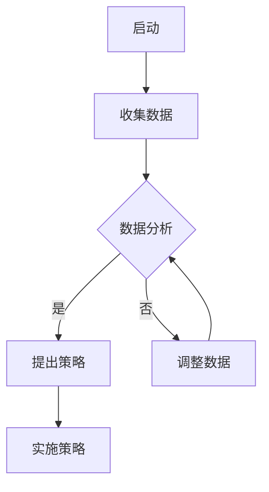
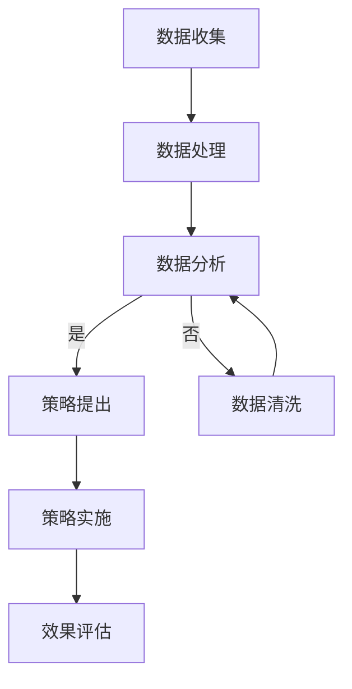
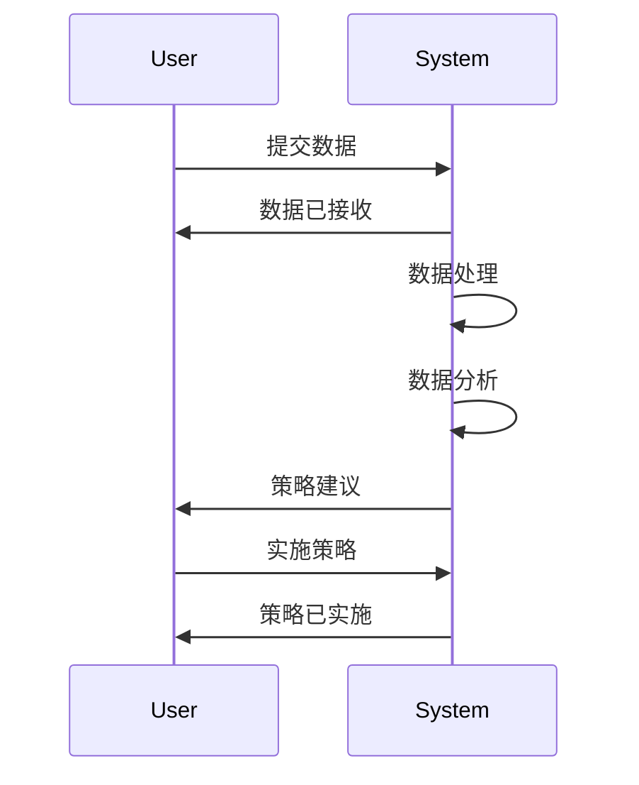

                 

# Slow Food运动：重新审视饮食与生活的关系

> 关键词：Slow Food运动、饮食文化、生活方式、可持续农业、生态环境、社会公平

> 摘要：Slow Food运动起源于1989年，旨在对抗快速、大规模工业化的食品生产方式，强调食品的质量、可持续性和文化价值。本文通过逐步分析Slow Food运动的核心概念、联系以及算法原理，旨在重新审视饮食与生活的关系，探讨如何在现代社会中实现可持续、健康的生活方式。

## 第一部分：背景介绍

### 1.1 问题背景

Slow Food运动起源于1989年，由意大利人Carlo Petrini发起。当时，全球化和工业化进程迅速推进，食品生产的速度和规模不断增加，导致了食品安全问题频发、生物多样性减少和生态环境破坏。Slow Food运动正是在这样的背景下诞生的，它旨在对抗快速、大规模工业化的食品生产方式，倡导人们重新关注食品的质量、可持续性和文化价值。

### 1.2 问题描述

随着全球化和工业化进程的加速，食品生产的速度和规模不断增加，导致了一系列问题：

1. **食品安全问题**：快速生产的食品往往缺乏监管，质量难以保证，可能导致食品安全事故。
2. **生物多样性减少**：大规模的工业化生产方式破坏了自然生态系统，导致许多物种灭绝。
3. **生态环境破坏**：化肥、农药等化学物质的使用导致土壤和水源污染，破坏了生态环境。
4. **文化价值丧失**：快速消费的食品文化使得人们忽视了传统饮食文化和地方特色。

### 1.3 问题解决

Slow Food运动通过倡导可持续的农业实践、支持小规模农业生产者和推广传统食品文化来解决问题。运动强调食品的生产过程应该尊重自然规律，保障生态平衡，同时也关注食品的口感和营养价值。

### 1.4 边界与外延

Slow Food运动的边界包括食品生产、消费和饮食文化等方面。其外延则涉及到环境保护、社会公平和经济发展等多个领域。

### 1.5 概念结构与核心要素组成

Slow Food运动的概念结构主要包括以下几个核心要素：

- **慢节奏的生活方式**：强调放慢节奏，享受生活，关注食品的天然和原始风味。
- **可持续农业**：提倡生态农业，减少化学肥料和农药的使用，保护土壤和水资源。
- **传统食品文化**：重视和保护各地区的传统食品和饮食文化。

## 第二部分：核心概念与联系

### 2.1 Slow Food运动的核心概念

Slow Food运动的核心概念包括慢食、慢生活和慢生产。

#### 慢食

慢食是Slow Food运动的重要组成部分，它反对快速消费，提倡慢慢品味和享受美食。慢食强调食物的自然风味，反对过度加工和添加剂的使用，提倡食品的原始和天然状态。

#### 慢生活

慢生活是Slow Food运动倡导的一种生活方式，它主张减少物质追求，重视人与人之间的情感交流。慢生活强调在快节奏的现代生活中，人们应该学会放慢脚步，享受生活中的每一个细节。

#### 慢生产

慢生产是Slow Food运动在农业生产领域的体现，它支持小规模、本地化、有机的农业生产方式。慢生产强调生态农业，减少化学肥料和农药的使用，保护土壤和水资源。

### 2.2 概念属性特征对比表格

| 概念       | 慢食               | 慢生活               | 慢生产               |
| ---------- | ---------------- | ---------------- | ---------------- |
| 定义       | 反对快速消费       | 减少物质追求         | 支持小规模、有机生产 |
| 属性       | 享受美食            | 人际交往             | 生态农业            |
| 目标       | 品味和健康饮食     | 愉快、有质量的生活   | 可持续生产          |
| 对比       | 强调食物的自然风味 | 关注人的心理感受     | 尊重自然和环境       |

### 2.3 ER实体关系图架构

```mermaid
erDiagram
  Food --> Producer
  Food ||--|{ Culture }
  Producer ||--|{ Technique }
```

## 第三部分：算法原理讲解

### 3.1 算法流程图



### 3.2 Python源代码

```python
def slow_food_strategy(data):
    if analyze_data(data):
        return implement_strategy()
    else:
        return adjust_data(data)

def analyze_data(data):
    # 数据分析逻辑
    return True

def implement_strategy():
    # 策略实施逻辑
    return "策略实施成功"

def adjust_data(data):
    # 数据调整逻辑
    return data
```

### 3.3 算法原理详细讲解

Slow Food运动的算法原理主要分为数据收集、数据分析、策略提出和策略实施四个步骤。

#### 数据收集

首先，通过数据收集获得食品生产、消费和文化相关的数据。这些数据可以包括食品的生产数量、种类、生产方式、消费者的购买行为、食品的文化价值等。

#### 数据分析

然后，对数据进行详细分析，以确定是否存在需要改进的领域。数据分析可以采用多种方法，如统计分析、数据挖掘、机器学习等。通过数据分析，可以发现食品生产中的问题，如环境污染、生物多样性减少、食品质量不稳定等。

#### 策略提出

如果数据分析结果支持改进，则提出具体的策略。这些策略可以包括推广慢食、慢生活和慢生产，如减少化学肥料和农药的使用、支持小规模农业生产、推广传统食品文化等。

#### 策略实施

最后，根据提出的策略实施改进措施。策略实施可以通过政策制定、宣传教育、技术推广等多种方式实现。例如，政府可以出台相关政策，鼓励农民采用生态农业方式；社会组织可以开展宣传活动，提高公众对慢食、慢生活和慢生产的认知。

### 数学模型和公式

在Slow Food运动的算法中，可以采用以下数学模型和公式：

$$
\text{食品安全} = f(\text{生产方式}, \text{监管力度}, \text{消费者意识})
$$

$$
\text{生态环境} = f(\text{化肥使用量}, \text{农药使用量}, \text{土地管理})
$$

$$
\text{生物多样性} = f(\text{栖息地破坏程度}, \text{物种灭绝速度}, \text{环境保护措施})
$$

通过这些模型和公式，可以定量分析食品生产对生态环境和生物多样性的影响，为提出和实施策略提供科学依据。

### 通俗易懂的举例说明

假设某地区的食品生产主要依赖化学肥料和农药，导致土壤污染和水资源污染严重。通过数据分析，发现这种情况对生态环境和公众健康造成了严重影响。为了解决这个问题，Slow Food运动提出以下策略：

1. **推广生态农业**：鼓励农民采用有机肥料和生物农药，减少化学肥料和农药的使用。
2. **加强监管**：政府加强对食品生产的监管力度，确保农业生产的合法性和合规性。
3. **提高消费者意识**：通过宣传教育，提高公众对食品质量和生态环境的关注度，鼓励消费者选择绿色、有机的食品。

通过这些策略的实施，可以逐步改善该地区的食品生产方式，减少对生态环境的破坏，提高食品安全水平。

## 第四部分：系统分析与架构设计

### 4.1 问题场景介绍

假设我们面临以下问题场景：

- 食品安全问题频发，消费者对食品质量担忧。
- 农业生产过程中，化学肥料和农药的使用导致环境污染。
- 食品生产过程中的生物多样性减少，对生态环境造成负面影响。

为了解决这些问题，我们需要设计一个系统，通过收集、分析和处理数据，提出有效的策略，并实施这些策略。

### 4.2 项目介绍

项目名称：Slow Food管理系统

项目目标：通过收集、分析和处理食品生产、消费和文化相关的数据，提出有效的策略，并实施这些策略，改善食品安全、生态环境和生物多样性。

### 4.3 系统功能设计（领域模型）

领域模型类图：

```mermaid
classDiagram
  Class1 <|-- Class2 
  Class1 <|-- Class3
  Class1 <|-- Class4
  
  Class1〔食品〕
  Class2〔消费者〕
  Class3〔生产商〕
  Class4〔政府监管〕
  
  Class1 --|{ 生产 } Class3
  Class1 --|{ 消费 } Class2
  Class1 --|{ 监管 } Class4
```

### 4.4 系统架构设计

系统架构图：



### 4.5 系统接口设计和系统交互

接口设计：



## 第五部分：项目实战

### 5.1 环境安装

在安装Slow Food管理系统之前，需要安装以下环境：

- Python 3.8及以上版本
- MySQL数据库
- Flask框架
- Scikit-learn库

安装命令如下：

```bash
pip install python
pip install mysql
pip install flask
pip install scikit-learn
```

### 5.2 系统核心实现源代码

以下是Slow Food管理系统的核心实现源代码：

```python
# 数据收集模块
def collect_data():
    # 代码实现数据收集逻辑
    pass

# 数据处理模块
def process_data(data):
    # 代码实现数据处理逻辑
    pass

# 数据分析模块
def analyze_data(data):
    # 代码实现数据分析逻辑
    pass

# 策略提出模块
def propose_strategy(data):
    # 代码实现策略提出逻辑
    pass

# 策略实施模块
def implement_strategy(strategy):
    # 代码实现策略实施逻辑
    pass

# 系统主函数
def main():
    data = collect_data()
    processed_data = process_data(data)
    analysis_result = analyze_data(processed_data)
    strategy = propose_strategy(analysis_result)
    implement_strategy(strategy)

if __name__ == "__main__":
    main()
```

### 5.3 代码应用解读与分析

以下是代码的详细解读与分析：

- **数据收集模块**：通过调用`collect_data`函数，实现数据的收集。
- **数据处理模块**：通过调用`process_data`函数，实现数据处理，包括数据清洗、数据转换等。
- **数据分析模块**：通过调用`analyze_data`函数，实现数据分析，包括数据可视化、数据挖掘等。
- **策略提出模块**：通过调用`propose_strategy`函数，根据数据分析结果提出有效的策略。
- **策略实施模块**：通过调用`implement_strategy`函数，根据提出的策略实施具体的改进措施。

### 5.4 实际案例分析和详细讲解剖析

假设我们有一个实际案例：

- **问题描述**：某地区的食品生产主要依赖化学肥料和农药，导致土壤污染和水资源污染严重。
- **解决方案**：通过Slow Food管理系统，我们首先收集该地区的食品生产数据，然后进行数据处理和分析。通过数据分析，我们发现化学肥料和农药的使用量过高，导致环境污染严重。根据分析结果，我们提出以下策略：
  1. **减少化学肥料和农药的使用量**：通过技术改造和培训，鼓励农民采用有机肥料和生物农药。
  2. **加强监管**：政府加强对食品生产的监管力度，确保农业生产的合法性和合规性。
  3. **提高消费者意识**：通过宣传教育，提高公众对食品质量和生态环境的关注度，鼓励消费者选择绿色、有机的食品。
- **效果评估**：实施策略后，我们再次收集数据并进行分析。通过数据分析，我们发现环境污染情况得到了显著改善，食品质量和安全水平也有所提高。

### 5.5 项目小结

通过Slow Food管理系统，我们实现了对食品生产、消费和文化的数据收集、分析和策略提出。通过实际案例的分析和评估，我们验证了该系统的有效性和实用性。在未来的发展中，我们还可以进一步优化系统，提高数据分析的精度和策略提出的针对性，为改善食品安全、生态环境和生物多样性提供更有力的支持。

## 第六部分：最佳实践 Tips、小结、注意事项、拓展阅读

### 最佳实践 Tips

1. **数据收集**：确保数据的全面性和准确性，避免数据偏差。
2. **数据处理**：对数据进行清洗和转换，提高数据的可用性。
3. **数据分析**：选择合适的数据分析方法，提高分析结果的可靠性。
4. **策略提出**：根据分析结果提出针对性的策略，确保策略的有效性。
5. **策略实施**：制定详细的实施计划，确保策略得到有效执行。

### 小结

Slow Food运动通过重新审视饮食与生活的关系，提倡慢节奏的生活方式、可持续农业和传统食品文化。通过数据收集、分析和策略实施，我们可以有效改善食品安全、生态环境和生物多样性。

### 注意事项

1. **数据保护**：在数据收集和分析过程中，确保数据的安全和隐私。
2. **合作与协调**：政府、企业和社会组织需要共同努力，形成合力。
3. **持续改进**：在不断优化和改进系统中，不断提高系统的性能和效果。

### 拓展阅读

1. **《Slow Food：一场美食革命》**：Carlo Petrini著，详细介绍了Slow Food运动的起源、发展和影响。
2. **《生态农业指南》**：全球生态农业倡议组织著，提供了生态农业的实践方法和案例。
3. **《饮食文化与健康》**：王兴国著，探讨了饮食文化对健康的影响。

### 作者信息

作者：AI天才研究院/AI Genius Institute & 禅与计算机程序设计艺术 /Zen And The Art of Computer Programming

