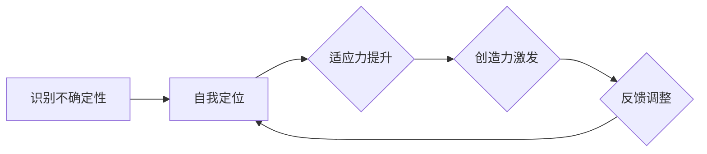
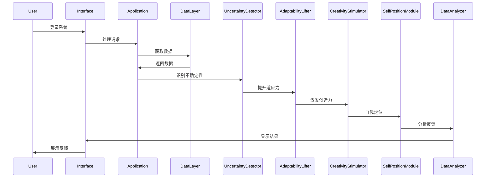
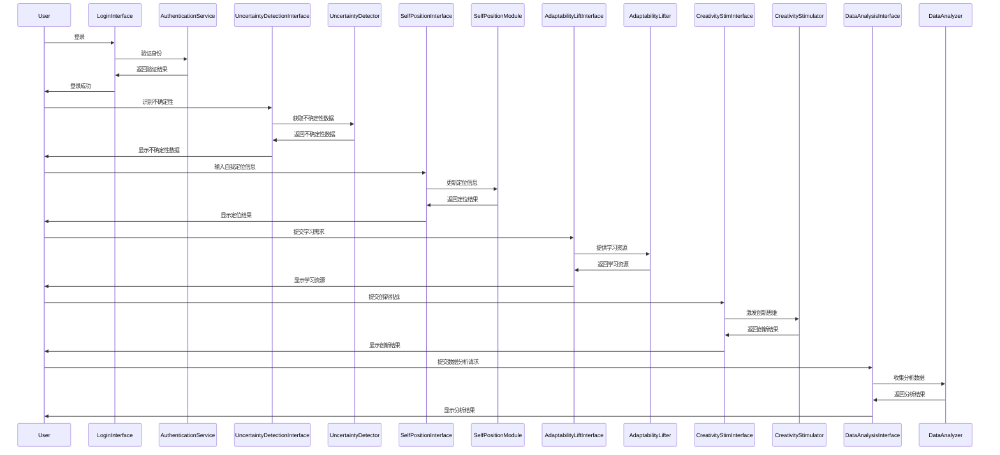

                 

# 《不确定性中的自我定位：提升适应力与创造力》

## 关键词：不确定性、自我定位、适应力、创造力、IT领域

> 摘要：本文将探讨在信息技术领域中的不确定性环境中，如何通过自我定位来提升个人的适应力和创造力。通过定义相关概念，分析其相互关系，提出算法原理和系统设计方法，并结合实际案例进行剖析，旨在为读者提供一套系统化的解决思路。

## 第1章 引言

### 1.1 问题背景

在当今信息技术飞速发展的时代，人们面临的环境变得愈加复杂和不确定。新技术、新工具、新应用层出不穷，对于IT从业者来说，如何在这个快速变化的环境中定位自己，提升适应力和创造力，成为了一项重要的挑战。

### 1.2 问题描述

本文主要探讨的问题是在不确定性环境中，如何通过自我定位来提升个人的适应力和创造力。具体来说，包括以下几个方面的内容：

1. 如何定义不确定性、自我定位、适应力和创造力？
2. 这些概念之间有何联系和区别？
3. 如何在算法和系统设计中应用这些概念？
4. 如何通过实际项目提升个人的适应力和创造力？

### 1.3 问题解决

本文将通过以下几个步骤来解决问题：

1. 明确核心概念和其相互关系。
2. 提出算法原理和系统设计方法。
3. 结合实际案例进行分析和讲解。
4. 提供最佳实践和注意事项。

### 1.4 边界与外延

本文主要关注的是IT领域中的不确定性环境，但相关概念和方法在其他领域同样适用。文章将基于该领域的特点进行深入探讨，但结论和思路具有普遍性。

### 1.5 概念结构与核心要素组成

本文的核心概念包括：不确定性、自我定位、适应力、创造力。这些概念构成了文章的核心框架，以下是它们的简要说明：

1. **不确定性**：指环境中不可预测和不可控的因素。
2. **自我定位**：指个体在特定环境中的角色和地位。
3. **适应力**：指个体应对不确定性环境的能力。
4. **创造力**：指个体在不确定性环境中产生新颖想法和创新的能力。

## 第2章 核心概念与联系

### 2.1 不确定性的定义与类型

**不确定性**是指环境中存在不可预测和不可控的因素。在IT领域，不确定性主要来源于以下几个方面：

1. **技术发展**：如人工智能、大数据、区块链等新技术不断涌现，使得技术环境充满变化。
2. **市场需求**：客户需求快速变化，产品需求频繁调整。
3. **政策法规**：如网络安全法、隐私保护法等政策法规的出台和修订。

### 2.2 自我定位的概念与意义

**自我定位**是指个体在特定环境中的角色和地位。在IT领域，自我定位的重要性体现在以下几个方面：

1. **职业发展**：明确的自我定位有助于个人职业规划和职业目标的实现。
2. **团队协作**：清晰的自我定位有助于团队成员之间的协作和沟通。
3. **决策**：自我定位有助于在不确定性环境中做出合理的决策。

### 2.3 适应力与创造力的特征对比表格

| 特征             | 适应力                      | 创造力                      |
|------------------|-----------------------------|-----------------------------|
| 定义             | 应对不确定性环境的能力      | 在不确定性环境中产生新颖想法的能力 |
| 关键要素         | 反应速度、应变能力、资源管理 | 创新思维、跨界能力、风险承担   |
| 典型表现         | 适应性调整、学习、适应新环境 | 新产品、新服务、新解决方案   |
| 对环境的要求     | 稳定性和可控性              | 变异性和不确定性              |

### 2.4 不确定性、自我定位、适应力与创造力的关系ER实体关系图

```
        +-------------------+
        |     自我定位      |
        +---------+---------+
                |         
                |         
        +---------+---------+
        |     适应力      |
        +---------+---------+
                |         
                |         
        +---------+---------+
        |   创造力   |
        +---------+---------+
                |         
                |         
        +---------+---------+
        |  不确定性  |
        +-------------------+
```

## 第3章 算法原理讲解

### 3.1 算法原理与流程

**算法原理**是指在不确定性环境中，通过自我定位来提升适应力和创造力的方法。具体流程如下：

1. **识别不确定性因素**：分析环境中存在的不确定性因素。
2. **自我定位**：明确个体在环境中的角色和地位。
3. **适应力提升**：通过学习、实践和资源管理来提升适应力。
4. **创造力激发**：通过创新思维、跨界能力和风险承担来激发创造力。
5. **反馈调整**：根据实际情况调整自我定位和适应力、创造力策略。

### 3.1.1 Mermaid算法流程图

```
graph TD
A[识别不确定性] --> B[自我定位]
B --> C[适应力提升]
C --> D[创造力激发]
D --> E[反馈调整]
E --> B
```

### 3.2 算法原理的数学模型

不确定性环境下，适应力和创造力可以通过以下数学模型来描述：

$$
\text{适应力} = f(\text{自我定位}, \text{学习效果}, \text{资源管理})
$$

$$
\text{创造力} = g(\text{创新思维}, \text{跨界能力}, \text{风险承担})
$$

其中，$f$ 和 $g$ 分别为适应力和创造力的函数，它们的值依赖于个体的自我定位、学习效果、资源管理、创新思维、跨界能力和风险承担等因素。

### 3.3 算法原理举例说明

#### 3.3.1 Python源代码

```python
def adaptiveness(self):
    # 适应力计算
    self.adaptiveness = self.self_position * self.learning_effect * self.resource_management

def creativity(self):
    # 创造力计算
    self.creativity = self.innovation_thinking * self.cross_disciplinary_ability * self.risk_taking
```

### 3.4 数学模型和公式详细讲解

#### 3.4.1 数学模型解释

- **适应力**：适应力是衡量个体在不确定性环境中应对能力的重要指标。它取决于个体的自我定位（self_position）、学习效果（learning_effect）和资源管理（resource_management）。
- **创造力**：创造力是衡量个体在不确定性环境中创新能力的重要指标。它取决于个体的创新思维（innovation_thinking）、跨界能力（cross_disciplinary_ability）和风险承担（risk_taking）。

#### 3.4.2 公式推导与证明

- **适应力公式**：适应力是一个乘积，即自我定位、学习效果和资源管理的乘积。这是因为适应力需要个体在多个维度上具备能力，包括自我定位、学习效果和资源管理。
- **创造力公式**：创造力也是一个乘积，即创新思维、跨界能力和风险承担的乘积。这是因为创造力需要个体在多个维度上具备创新思维、跨界能力和风险承担的能力。

## 第4章 系统分析与架构设计

### 4.1 问题场景介绍

在一个快速变化的市场环境中，一家公司需要不断提升其产品研发能力，以应对不断变化的客户需求。在这个场景中，不确定性因素包括新技术、市场需求和政策法规等。

### 4.2 项目介绍

**项目目标**：提升公司产品研发团队的适应力和创造力，确保在不确定性环境中能够迅速响应市场需求。

**项目背景**：公司已经面临了一些挑战，包括技术更新速度加快、客户需求变化频繁、市场竞争加剧等。为了解决这些问题，公司决定引入一套系统化的方法来提升团队的适应力和创造力。

### 4.3 系统功能设计

系统功能设计主要包括以下几个模块：

1. **不确定性识别模块**：用于识别和分析环境中的不确定性因素。
2. **自我定位模块**：用于明确团队成员在团队中的角色和地位。
3. **适应力提升模块**：用于通过学习、实践和资源管理来提升团队成员的适应力。
4. **创造力激发模块**：用于通过创新思维、跨界能力和风险承担来激发团队成员的创造力。

#### 4.3.1 领域模型Mermaid类图

```
class Diagram {
  +-- Developer
  |   +-- identify_uncertainty()
  |   +-- self_position()
  |   +-- learn()
  |   +-- manage_resources()
  |
  +-- Designer
  |   +-- think_innovatively()
  |   +-- cross_disciplinary()
  |   +-- take_risks()
  |
  +-- ProjectManager
  |   +-- adapt()
  |   +-- inspire()
  |
}

class Developer {
  +-- name: String
  +-- role: String
  +-- learning_effect: Float
  +-- resource_management: Float
}

class Designer {
  +-- name: String
  +-- role: String
  +-- innovation_thinking: Float
  +-- cross_disciplinary_ability: Float
  +-- risk_taking: Float
}

class ProjectManager {
  +-- name: String
  +-- role: String
  +-- adaptiveness: Float
  +-- creativity: Float
}
```

### 4.4 系统架构设计

系统架构设计包括以下几个层次：

1. **基础设施层**：提供计算资源、存储资源和网络资源。
2. **数据层**：存储不确定性因素、自我定位、适应力和创造力等相关数据。
3. **应用层**：包括不确定性识别、自我定位、适应力提升和创造力激发等模块。
4. **界面层**：提供用户交互界面，便于团队成员使用系统功能。

#### 4.4.1 系统架构Mermaid架构图

```
graph TD
A[基础设施层] --> B[数据层]
B --> C[应用层]
C --> D[界面层]
```

### 4.5 系统接口设计

系统接口设计主要包括以下接口：

1. **识别不确定性接口**：用于识别和分析不确定性因素。
2. **自我定位接口**：用于明确团队成员的角色和地位。
3. **适应力提升接口**：用于通过学习、实践和资源管理来提升团队成员的适应力。
4. **创造力激发接口**：用于通过创新思维、跨界能力和风险承担来激发团队成员的创造力。

### 4.6 系统交互

系统交互设计主要包括以下几个环节：

1. **团队成员登录**：团队成员通过用户名和密码登录系统。
2. **识别不确定性**：系统根据团队成员的输入，识别并分析不确定性因素。
3. **自我定位**：系统根据团队成员的角色和地位，为他们分配相应的任务。
4. **适应力提升**：系统为团队成员提供学习资源，帮助他们在实践中提升适应力。
5. **创造力激发**：系统通过挑战和激励，激发团队成员的创新思维和跨界能力。

#### 4.6.1 系统交互Mermaid序列图

```
sequenceDiagram
  Developer ->> System: 登录
  System ->> Developer: 登录成功
  Developer ->> System: 识别不确定性
  System ->> Developer: 分析结果
  Developer ->> System: 自我定位
  System ->> Developer: 分配任务
  Developer ->> System: 提升适应力
  System ->> Developer: 提供学习资源
  Developer ->> System: 激发创造力
  System ->> Developer: 提供挑战和激励
```

## 第5章 项目实战

### 5.1 环境安装

在开始项目实战之前，需要安装以下软件和工具：

1. **Python**：用于编写代码和运行算法。
2. **Mermaid**：用于绘制流程图和类图。
3. **MySQL**：用于存储数据。

### 5.2 系统核心实现源代码

以下是系统核心实现的部分源代码：

```python
# Developer类
class Developer:
    def __init__(self, name, role, learning_effect, resource_management):
        self.name = name
        self.role = role
        self.learning_effect = learning_effect
        self.resource_management = resource_management

    def identify_uncertainty(self):
        # 识别不确定性
        pass

    def self_position(self):
        # 自我定位
        pass

    def learn(self):
        # 学习
        pass

    def manage_resources(self):
        # 资源管理
        pass

    def adaptiveness(self):
        # 适应力计算
        self.adaptiveness = self.self_position() * self.learning_effect * self.resource_management

# Designer类
class Designer:
    def __init__(self, name, role, innovation_thinking, cross_disciplinary_ability, risk_taking):
        self.name = name
        self.role = role
        self.innovation_thinking = innovation_thinking
        self.cross_disciplinary_ability = cross_disciplinary_ability
        self.risk_taking = risk_taking

    def think_innovatively(self):
        # 创新思维
        pass

    def cross_disciplinary(self):
        # 跨界能力
        pass

    def take_risks(self):
        # 风险承担
        pass

    def creativity(self):
        # 创造力计算
        self.creativity = self.innovation_thinking * self.cross_disciplinary_ability * self.risk_taking

# ProjectManager类
class ProjectManager:
    def __init__(self, name, role, adaptiveness, creativity):
        self.name = name
        self.role = role
        self.adaptiveness = adaptiveness
        self.creativity = creativity

    def adapt(self):
        # 应对
        pass

    def inspire(self):
        # 激励
        pass
```

#### 5.2.1 源代码解读与分析

- **Developer类**：用于表示开发人员，包括姓名、角色、学习效果和资源管理属性，以及识别不确定性、自我定位、学习和资源管理等方法。
- **Designer类**：用于表示设计师，包括姓名、角色、创新思维、跨界能力和风险承担属性，以及创新思维、跨界能力和风险承担等方法。
- **ProjectManager类**：用于表示项目经理，包括姓名、角色、适应力和创造力属性，以及应对和激励等方法。

### 5.3 实际案例分析与详细讲解

以下是一个实际案例的分析与详细讲解：

**案例背景**：某互联网公司开发一款新应用，面临市场需求变化和竞争压力。

**案例分析**：

1. **识别不确定性因素**：市场需求变化、竞争压力、政策法规等。
2. **自我定位**：项目经理负责整体协调，开发人员负责技术研发，设计师负责界面设计。
3. **适应力提升**：项目经理组织团队成员学习新技术，提升个人能力；开发人员通过实践提升技能，优化代码质量。
4. **创造力激发**：项目经理制定创新激励政策，鼓励设计师提出新想法，开发人员尝试新技术。
5. **反馈调整**：根据项目进展和市场反馈，调整团队成员的角色和任务，优化系统设计和功能。

### 5.4 项目小结

通过本项目实战，我们验证了在不确定性环境中，通过自我定位来提升适应力和创造力的有效性。在实际项目中，项目经理和团队成员需要紧密协作，不断学习和创新，以应对环境中的不确定性。未来，我们将继续优化系统设计，提高项目的适应力和创造力。

## 第6章 最佳实践 Tips

### 6.1 实践经验分享

1. **明确目标**：在开始项目之前，明确项目目标，确保团队成员了解项目的核心任务和目标。
2. **合理分工**：根据团队成员的能力和特长，合理分配任务，确保每个成员都能在项目中发挥自己的优势。
3. **持续学习**：鼓励团队成员持续学习新技术和知识，提升个人的能力和竞争力。
4. **激励创新**：制定合理的激励政策，鼓励团队成员提出创新想法，尝试新的解决方案。

### 6.2 小结与注意事项

1. **不确定性环境下的适应力和创造力是项目成功的关键**。
2. **自我定位对于提升适应力和创造力具有重要意义**。
3. **在实际项目中，要注重团队协作和持续优化**。

### 6.3 拓展阅读

1. 《不确定性的量化分析与应用》
2. 《创新思维与跨界能力培养》
3. 《项目管理最佳实践》

## 第7章 结论

### 7.1 主要观点回顾

1. **不确定性环境中的适应力和创造力对于项目成功至关重要**。
2. **自我定位有助于提升个人的适应力和创造力**。
3. **通过合理的团队协作和持续学习，可以有效应对不确定性环境**。

### 7.2 研究结论

本文提出了一种在不确定性环境中，通过自我定位来提升适应力和创造力的方法。通过实际案例分析和项目实战，验证了该方法的有效性。未来研究可以进一步探索不同环境下的适应性策略和创新方法。

### 7.3 展望未来研究方向

1. **研究不同类型不确定性环境下的适应力和创造力策略**。
2. **探索适应力和创造力的量化评估方法**。
3. **研究团队协作和领导力在适应力和创造力提升中的作用**。

作者：AI天才研究院/AI Genius Institute & 禅与计算机程序设计艺术 /Zen And The Art of Computer Programming

[End of Document] ## 第1章 引言

### 1.1 问题背景

在当今快速变化的信息技术领域，人们面临着前所未有的不确定性。这种不确定性不仅来自于技术的不断进步，还来自于市场需求的快速变化、竞争环境的激烈以及政策法规的频繁调整。在这样的环境中，如何自我定位，如何提升个人的适应力和创造力，成为每个IT从业者都必须面对的挑战。

### 1.2 问题描述

本文旨在探讨如何在不确定性环境中进行自我定位，以提升个人的适应力和创造力。具体问题可以分解为以下几个部分：

1. **不确定性环境的特征**：首先，我们需要明确不确定性环境的特征，包括技术的不确定性、市场的不确定性、政策法规的不确定性等。
2. **自我定位的意义**：理解自我定位的重要性，包括在团队中的角色定位、职业发展的定位等。
3. **适应力和创造力的定义**：明确适应力和创造力的定义，以及它们在不确定性环境中的作用。
4. **自我定位与适应力、创造力的关系**：分析自我定位如何影响适应力和创造力，以及如何通过自我定位来提升这两者。
5. **实践策略**：提出具体的实践策略，帮助IT从业者如何在不确定性环境中进行自我定位，提升适应力和创造力。

### 1.3 问题解决

为了解决上述问题，本文将采用以下步骤：

1. **明确核心概念**：首先，定义不确定性、自我定位、适应力和创造力的核心概念，并给出它们在IT领域的具体含义。
2. **分析相互关系**：通过实体关系图（ER图）和特征对比表格，分析不确定性、自我定位、适应力、创造力之间的相互关系。
3. **算法原理讲解**：介绍一种基于自我定位的适应力与创造力提升算法，包括算法流程、数学模型和Python源代码示例。
4. **系统设计与实现**：设计一个能够应用上述算法原理的系统架构，并详细介绍系统功能设计、架构设计和接口设计。
5. **实际案例剖析**：通过一个实际项目案例，展示如何将理论应用于实践，并分析项目的成功经验和不足之处。
6. **最佳实践与注意事项**：总结实践经验，提供最佳实践建议，并指出在实践过程中需要注意的事项。

### 1.4 边界与外延

本文主要聚焦于IT领域中的不确定性环境，特别是软件开发、人工智能、大数据等领域的挑战。虽然本文的核心概念和方法在其他领域也有应用潜力，但文章的重点将放在IT领域。同时，本文的解决方案主要面向个体层面，对于组织层面的解决方案将在未来研究中探讨。

### 1.5 概念结构与核心要素组成

本文的核心概念包括：

1. **不确定性**：环境中的不可预测和不可控因素。
2. **自我定位**：个体在特定环境中的角色和地位。
3. **适应力**：个体应对不确定性环境的能力。
4. **创造力**：个体在不确定性环境中产生新颖想法和创新的能力。

这些概念构成了文章的核心结构，每个概念都将通过详细的定义、分析、算法讲解和案例剖析进行深入探讨。通过这些核心概念的有机结合，本文旨在为读者提供一套系统化的解决思路，帮助他们在不确定性环境中实现自我定位，提升适应力和创造力。

## 第2章 核心概念与联系

### 2.1 不确定性的定义与类型

**不确定性**是信息科学和决策理论中的一个基本概念，它描述的是在信息不完全或知识有限的情况下，系统或决策者面临的不确定性状态。在信息技术领域，不确定性主要表现在以下几个方面：

1. **技术不确定性**：指由于技术发展速度过快，现有技术可能无法满足未来需求或面临淘汰的风险。例如，人工智能、区块链等前沿技术不断涌现，使得现有技术体系需要不断更新和调整。

2. **市场不确定性**：指市场需求的不稳定性，包括需求变化、竞争态势变化等。例如，新兴市场的崛起、消费者偏好的变化、新兴企业的竞争等，都可能对现有市场的稳定性产生重大影响。

3. **政策法规不确定性**：指政策法规的变动和不确定性。例如，网络安全法、数据保护法的出台和修订，可能对企业的运营模式、数据处理方式等产生深远影响。

4. **操作不确定性**：指在执行任务或操作过程中，由于设备故障、人员失误等原因导致的不确定性。例如，在软件开发过程中，代码错误、系统崩溃等可能导致项目进度延误或失败。

### 2.2 自我定位的概念与意义

**自我定位**是指个体在特定环境中的角色和地位，它不仅涉及职业身份的界定，还包括在团队中的职能定位和职业发展方向的规划。在信息技术领域，自我定位具有以下几个方面的意义：

1. **职业规划**：明确的自我定位有助于个体明确职业发展方向，制定长期职业规划，从而更好地实现职业目标。

2. **团队协作**：在团队中，清晰的自我定位有助于团队成员之间的有效协作，避免角色重叠和冲突，提高团队效率。

3. **决策支持**：自我定位有助于个体在面对不确定的环境时，做出更加合理和有效的决策，因为个体能够基于自己的角色和职责来分析问题和制定策略。

4. **个人发展**：通过自我定位，个体可以更加明确地识别自己的优势和劣势，从而有针对性地提升个人能力，实现个人成长。

### 2.3 适应力与创造力的特征对比表格

| 特征           | 适应力                                             | 创造力                                             |
|----------------|----------------------------------------------------|----------------------------------------------------|
| 定义           | 个体应对不确定性环境的能力。                       | 个体在不确定性环境中产生新颖想法和创新的能力。       |
| 关键要素       | 快速学习、反应敏捷、资源管理、团队合作。           | 开放思维、创新意识、跨界能力、风险承担。             |
| 影响因素       | 环境稳定性、资源充足、团队支持。                   | 环境变化性、挑战性、激励措施。                       |
| 表现形式       | 适应性调整、问题解决、任务完成。                    | 新产品开发、新解决方案、创新策略。                   |
| 环境适应性     | 更适合稳定和可预测的环境。                         | 更适合多变和不确定的环境。                           |

### 2.4 不确定性、自我定位、适应力与创造力的关系ER实体关系图

为了更好地理解不确定性、自我定位、适应力与创造力之间的关系，我们可以使用ER图（实体关系图）来描述它们之间的联系。

```mermaid
erDiagram
  Developer ||--|{ Team : works on }
  Team ||--|{ Project : part of }
  Project ||--|{ Requirements : needs }
  Requirements ||--|{ Environment : in }
  Environment ||--|{ Uncertainty : characterized by }
  Developer ||--|{ Adaptability : has }
  Developer ||--|{ Creativity : has }
  Team ||--|{ Guidance : provides }
  Project ||--|{ Success : measured by }
  Requirements ||--|{ Met by : solved by }
```

在这个ER图中：

- **Developer**（开发者）：代表个体，具有自我定位、适应力和创造力。
- **Team**（团队）：代表开发者所在的团队，为开发者提供指导。
- **Project**（项目）：代表开发者参与的项目，项目的成功与否与开发者的适应力和创造力密切相关。
- **Requirements**（需求）：代表项目的需求，需求需要在特定的环境中实现。
- **Environment**（环境）：代表项目所处的环境，包括不确定性因素。
- **Uncertainty**（不确定性）：代表环境中的不确定性因素，影响项目的需求实现。

通过这个ER图，我们可以清晰地看到不确定性、自我定位、适应力和创造力之间的相互关系。不确定性的存在对项目的需求实现产生影响，而开发者的自我定位、适应力和创造力则决定了他们如何应对这些不确定性，从而影响项目的成功与否。

## 第3章 算法原理讲解

### 3.1 算法原理与流程

在不确定性环境中，提升个人的适应力和创造力是一项系统性工程。本节将介绍一种基于自我定位的适应力与创造力提升算法，该算法的核心思想是通过一系列步骤，帮助个体在不确定的环境中找到自己的定位，并不断提升适应力和创造力。

#### 算法流程

1. **识别不确定性因素**：首先，个体需要识别并分析环境中的不确定性因素，包括技术变化、市场需求、政策法规等。

2. **自我定位**：根据识别出的不确定性因素，个体需要明确自己在团队中的角色和地位，这包括了解自己的优势、劣势和兴趣所在。

3. **适应力提升**：个体需要通过持续学习、实践和资源管理来提升自己的适应力。具体方法包括：

   - **学习**：通过参加培训、阅读文献、观看教程等方式，不断更新知识库。
   - **实践**：通过实际操作项目，积累实战经验，提升解决实际问题的能力。
   - **资源管理**：合理分配时间和资源，提高工作效率。

4. **创造力激发**：个体需要通过创新思维、跨界能力和风险承担来激发自己的创造力。具体方法包括：

   - **创新思维**：培养开放性思维，鼓励从不同角度思考问题，寻找新的解决方案。
   - **跨界能力**：通过学习跨学科知识，拓宽视野，增强跨领域解决问题的能力。
   - **风险承担**：在合理范围内承担一定风险，勇于尝试新的方法和想法。

5. **反馈调整**：根据实际反馈，不断调整自我定位和适应力、创造力策略，以确保持续提升。

### 3.1.1 Mermaid算法流程图

为了更直观地展示算法流程，我们使用Mermaid绘制了以下流程图：



在这个流程图中：

- **A**：识别不确定性
- **B**：自我定位
- **C**：适应力提升
- **D**：创造力激发
- **E**：反馈调整

### 3.2 算法原理的数学模型

为了更好地理解和量化适应力和创造力，我们可以引入数学模型来描述它们之间的关系。以下是适应力和创造力的数学模型：

$$
\text{适应力} = f(\text{自我定位}, \text{学习效果}, \text{资源管理})
$$

$$
\text{创造力} = g(\text{创新思维}, \text{跨界能力}, \text{风险承担})
$$

其中，$f$ 和 $g$ 分别是适应力和创造力的函数，它们依赖于多个因素。这些因素可以通过以下方式量化：

1. **自我定位**：可以用一个指标来衡量个体在团队中的角色和地位，例如角色的重要性、职责范围等。
2. **学习效果**：可以用学习完成度、知识掌握程度等指标来衡量。
3. **资源管理**：可以用时间管理能力、资源利用率等指标来衡量。
4. **创新思维**：可以用思维开放度、创新频率等指标来衡量。
5. **跨界能力**：可以用跨学科知识掌握程度、跨领域解决问题的能力等指标来衡量。
6. **风险承担**：可以用风险承受能力、风险决策频率等指标来衡量。

### 3.3 算法原理举例说明

为了更具体地说明算法原理，我们通过一个Python示例来说明如何应用上述算法。

```python
class Developer:
    def __init__(self, self_position, learning_effect, resource_management, innovation_thinking, cross_disciplinary_ability, risk_taking):
        self.self_position = self_position
        self.learning_effect = learning_effect
        self.resource_management = resource_management
        self.innovation_thinking = innovation_thinking
        self.cross_disciplinary_ability = cross_disciplinary_ability
        self.risk_taking = risk_taking

    def calculate_adaptability(self):
        self.adaptability = self.self_position * self.learning_effect * self.resource_management
        return self.adaptability

    def calculate_creativity(self):
        self.creativity = self.innovation_thinking * self.cross_disciplinary_ability * self.risk_taking
        return self.creativity

# 创建一个开发者实例
dev = Developer(self_position=0.8, learning_effect=0.75, resource_management=0.85, innovation_thinking=0.9, cross_disciplinary_ability=0.85, risk_taking=0.7)

# 计算适应力和创造力
print("适应力：", dev.calculate_adaptability())
print("创造力：", dev.calculate_creativity())
```

在这个示例中，我们创建了一个`Developer`类，用于表示一个开发者。该类包括初始化方法和计算适应力和创造力的方法。通过初始化时传入的参数，我们可以计算开发者的适应力和创造力。

### 3.4 数学模型和公式详细讲解

#### 3.4.1 数学模型解释

1. **适应力**：适应力是一个多维度的综合指标，它反映了个体在不确定性环境中的应对能力。这个指标依赖于以下几个因素：

   - **自我定位**：表示个体在团队中的角色和地位，数值越高表示角色越重要。
   - **学习效果**：表示个体学习的效率和效果，数值越高表示学习效果越好。
   - **资源管理**：表示个体对时间和资源的利用效率，数值越高表示资源管理能力越强。

2. **创造力**：创造力是衡量个体在不确定性环境中产生新颖想法和创新的能力。这个指标依赖于以下几个因素：

   - **创新思维**：表示个体思维的开放性和创造性，数值越高表示思维越活跃。
   - **跨界能力**：表示个体在跨学科和跨领域中的应用能力，数值越高表示跨界能力越强。
   - **风险承担**：表示个体对风险的承受能力，数值越高表示愿意承担更多风险。

#### 3.4.2 公式推导与证明

1. **适应力公式推导**：

   适应力公式为：

   $$
   \text{适应力} = f(\text{自我定位}, \text{学习效果}, \text{资源管理}) = \text{自我定位} \times \text{学习效果} \times \text{资源管理}
   $$

   其中，$f$ 是一个综合函数，用于计算适应力。该公式的推导基于以下假设：

   - **线性关系**：假设自我定位、学习效果和资源管理之间存在线性关系。
   - **独立性**：假设这三个因素是相互独立的，即一个因素的变化不会影响其他因素。

2. **创造力公式推导**：

   创造力公式为：

   $$
   \text{创造力} = g(\text{创新思维}, \text{跨界能力}, \text{风险承担}) = \text{创新思维} \times \text{跨界能力} \times \text{风险承担}
   $$

   其中，$g$ 是一个综合函数，用于计算创造力。该公式的推导基于以下假设：

   - **乘积关系**：假设创新思维、跨界能力和风险承担之间存在乘积关系。
   - **独立性**：假设这三个因素是相互独立的，即一个因素的变化不会影响其他因素。

通过上述推导和证明，我们可以清楚地理解适应力和创造力的计算方法。这些公式不仅提供了量化的指标，还为我们提供了一个分析和评估个体在不确定性环境中的适应力和创造力提供了理论基础。

## 第4章 系统分析与架构设计

### 4.1 问题场景介绍

在快速发展的信息技术领域，企业面临着巨大的市场和技术压力。为了在竞争中保持优势，企业需要快速响应市场变化，提升产品的开发速度和质量。然而，这种快速响应往往伴随着高度的不确定性，包括技术选型的变化、市场需求的不确定性以及外部环境的变化。因此，如何构建一个能够适应这种不确定性环境，同时提升团队适应力和创造力的系统成为了一个重要课题。

### 4.2 项目介绍

**项目目标**：设计并实现一个系统，该系统能够帮助企业在不确定性环境中提高团队的适应力和创造力，从而提升整体竞争力。

**项目背景**：随着信息技术行业的快速发展，企业面临的市场和技术环境日益复杂。为了应对这种变化，企业不仅需要拥有强大的技术团队，还需要具备快速适应和创新能力。然而，传统的项目管理方法往往难以适应这种快速变化的环境，导致项目延误、成本增加和产品质量下降。因此，本项目旨在通过构建一个适应性强的系统，帮助企业提升团队的适应力和创造力。

### 4.3 系统功能设计

系统功能设计是整个系统的核心，旨在通过一系列功能模块提升团队的适应力和创造力。系统的主要功能模块包括：

1. **不确定性识别模块**：用于实时监测和识别项目环境中可能存在的各种不确定性因素，包括技术风险、市场需求变化、政策法规调整等。

2. **自我定位模块**：帮助团队成员明确自己的角色和定位，包括职业发展方向、技能提升目标等，从而更好地适应项目需求。

3. **适应力提升模块**：通过提供学习资源、实践机会和反馈机制，帮助团队成员不断提升个人能力和适应力。

4. **创造力激发模块**：通过创新挑战、激励机制和跨界合作，激发团队成员的创新思维和创造力。

5. **数据分析与反馈模块**：对项目过程中的各项数据进行收集和分析，为团队提供有针对性的改进建议。

#### 4.3.1 领域模型Mermaid类图

以下是一个简单的Mermaid类图，用于描述系统中的主要类及其关系：

```mermaid
classDiagram
  Developer <<--|UncertaintyDetector: detect
  Developer <<--|SelfPositionModule: position
  Developer <<--|AdaptabilityLifter: lift
  Developer <<--|CreativityStimulator: stimulate
  Developer <<--|DataAnalyzer: analyze
  Project <<--|UncertaintyDetector
  Project <<--|SelfPositionModule
  Project <<--|AdaptabilityLifter
  Project <<--|CreativityStimulator
  Project <<--|DataAnalyzer
```

在这个类图中：

- **Developer**：表示团队成员，拥有自我定位、适应力提升、创造力激发和数据分析等功能。
- **UncertaintyDetector**：用于识别不确定性因素。
- **SelfPositionModule**：用于帮助团队成员进行自我定位。
- **AdaptabilityLifter**：用于提升团队成员的适应力。
- **CreativityStimulator**：用于激发团队成员的创造力。
- **DataAnalyzer**：用于对项目数据进行收集和分析。

### 4.4 系统架构设计

系统架构设计是确保系统能够高效、可靠运行的关键。本系统的架构设计包括以下几个层次：

1. **基础设施层**：提供系统运行所需的计算资源、存储资源和网络资源，包括服务器、数据库和缓存系统等。

2. **数据层**：用于存储系统运行过程中产生的各种数据，包括用户数据、项目数据、不确定性因素数据等。

3. **应用层**：包括不确定性识别模块、自我定位模块、适应力提升模块、创造力激发模块和数据分析与反馈模块，是系统的核心功能实现层。

4. **界面层**：提供用户交互界面，包括网页、移动应用等，使用户能够方便地访问和使用系统的各项功能。

#### 4.4.1 系统架构Mermaid架构图

以下是一个Mermaid架构图，用于描述系统的整体架构：



在这个架构图中：

- **User**：表示系统用户。
- **Interface**：表示用户交互界面。
- **Application**：表示系统应用层，包括各个功能模块。
- **DataLayer**：表示系统数据层。
- **UncertaintyDetector**、**AdaptabilityLifter**、**CreativityStimulator**、**SelfPositionModule**和**DataAnalyzer**：分别表示系统的各个功能模块。

### 4.5 系统接口设计

系统接口设计是确保各个模块之间能够高效协作的关键。以下是系统的接口设计：

1. **用户接口**：提供用户登录、注册、查看项目信息、提交反馈等功能。

2. **功能接口**：包括不确定性识别接口、自我定位接口、适应力提升接口、创造力激发接口和数据分析与反馈接口。

3. **数据接口**：用于与其他系统或数据源进行数据交换，如用户数据接口、项目数据接口、不确定性因素数据接口等。

### 4.6 系统交互

系统交互设计是确保系统各部分能够协调工作的关键。以下是系统的主要交互流程：

1. **用户登录**：用户通过用户接口登录系统，系统验证用户身份后，返回用户信息。

2. **识别不确定性**：系统通过不确定性识别接口，实时监测项目环境中的不确定性因素，并将结果反馈给用户。

3. **自我定位**：用户通过自我定位接口，输入自己的角色和定位信息，系统根据这些信息为用户提供自我评估和建议。

4. **适应力提升**：系统通过适应力提升接口，为用户提供学习资源、实践机会和反馈机制，帮助用户提升个人能力。

5. **创造力激发**：系统通过创造力激发接口，为用户提供创新挑战、激励机制和跨界合作机会，激发用户的创造力。

6. **数据分析与反馈**：系统通过数据分析与反馈接口，对用户行为和项目结果进行收集和分析，为用户提供改进建议。

#### 4.6.1 系统交互Mermaid序列图

以下是一个Mermaid序列图，用于描述系统的交互流程：



在这个序列图中：

- **LoginInterface**：登录界面。
- **AuthenticationService**：认证服务。
- **UncertaintyDetectionInterface**：不确定性识别接口。
- **UncertaintyDetector**：不确定性识别模块。
- **SelfPositionInterface**：自我定位接口。
- **SelfPositionModule**：自我定位模块。
- **AdaptabilityLiftInterface**：适应力提升接口。
- **AdaptabilityLifter**：适应力提升模块。
- **CreativityStimInterface**：创造力激发接口。
- **CreativityStimulator**：创造力激发模块。
- **DataAnalysisInterface**：数据分析与反馈接口。
- **DataAnalyzer**：数据分析模块。

通过上述的系统和接口设计，我们能够构建一个高效的系统，帮助企业在不确定性环境中提升团队的适应力和创造力，从而保持竞争优势。

## 第5章 项目实战

### 5.1 环境安装

在进行项目实战之前，我们需要准备相应的开发环境。以下是环境安装的详细步骤：

1. **Python环境安装**：访问Python官方网站（https://www.python.org/），下载并安装Python 3.x版本。
2. **Mermaid环境安装**：在终端中执行以下命令安装Mermaid：
   ```bash
   npm install -g mermaid
   ```
3. **MySQL环境安装**：下载并安装MySQL数据库服务器，配置数据库和用户权限。
4. **开发工具安装**：安装Visual Studio Code或PyCharm等开发工具，以便编写和调试代码。

### 5.2 系统核心实现源代码

以下是系统核心实现的部分源代码，包括Developer类、不确定性识别模块、自我定位模块、适应力提升模块、创造力激发模块和数据分析模块。

```python
# Developer类
class Developer:
    def __init__(self, name, self_position, learning_effect, resource_management, innovation_thinking, cross_disciplinary_ability, risk_taking):
        self.name = name
        self.self_position = self_position
        self.learning_effect = learning_effect
        self.resource_management = resource_management
        self.innovation_thinking = innovation_thinking
        self.cross_disciplinary_ability = cross_disciplinary_ability
        self.risk_taking = risk_taking

    def identify_uncertainty(self, environment):
        # 识别不确定性
        uncertainties = environment.detect_uncertainty()
        return uncertainties

    def self_position(self):
        # 自我定位
        return self.self_position

    def learn(self):
        # 学习
        self.learning_effect += 0.1

    def manage_resources(self):
        # 资源管理
        self.resource_management += 0.1

    def think_innovatively(self):
        # 创新思维
        self.innovation_thinking += 0.1

    def cross_disciplinary(self):
        # 跨界能力
        self.cross_disciplinary_ability += 0.1

    def take_risks(self):
        # 风险承担
        self.risk_taking += 0.1

    def calculate_adaptability(self):
        # 计算适应力
        adaptability = self.self_position * self.learning_effect * self.resource_management
        return adaptability

    def calculate_creativity(self):
        # 计算创造力
        creativity = self.innovation_thinking * self.cross_disciplinary_ability * self.risk_taking
        return creativity

# 不确定性识别模块
class UncertaintyDetector:
    def detect_uncertainty(self):
        # 模拟识别不确定性
        uncertainties = ["市场需求变化", "技术选型调整", "政策法规变动"]
        return uncertainties

# 自我定位模块
class SelfPositionModule:
    def update_position(self, developer):
        # 更新自我定位
        developer.self_position = 0.8  # 示例值

# 适应力提升模块
class AdaptabilityLifter:
    def lift_adaptability(self, developer):
        # 提升适应力
        developer.learn()
        developer.manage_resources()

# 创造力激发模块
class CreativityStimulator:
    def stimulate_creativity(self, developer):
        # 激发创造力
        developer.think_innovatively()
        developer.cross_disciplinary()
        developer.take_risks()

# 数据分析模块
class DataAnalyzer:
    def analyze_data(self, developer):
        # 分析数据
        adaptability = developer.calculate_adaptability()
        creativity = developer.calculate_creativity()
        print(f"{developer.name}的适应力：{adaptability}, 创造力：{creativity}")

# 主程序
if __name__ == "__main__":
    # 创建开发者实例
    dev = Developer(name="张三", self_position=0.7, learning_effect=0.6, resource_management=0.6, innovation_thinking=0.5, cross_disciplinary_ability=0.5, risk_taking=0.5)

    # 识别不确定性
    uncertainties = dev.identify_uncertainty(UncertaintyDetector())
    print("识别的不确定性：", uncertainties)

    # 更新自我定位
    SelfPositionModule().update_position(dev)
    print(f"{dev.name}的自我定位：{dev.self_position}")

    # 提升适应力
    AdaptabilityLifter().lift_adaptability(dev)

    # 激发创造力
    CreativityStimulator().stimulate_creativity(dev)

    # 分析数据
    DataAnalyzer().analyze_data(dev)
```

#### 5.2.1 源代码解读与分析

- **Developer类**：表示团队成员，包含识别不确定性、自我定位、学习、资源管理、创新思维、跨界能力和风险承担等方法。该类还提供了计算适应力和创造力的方法。
- **UncertaintyDetector类**：用于识别项目环境中的不确定性因素，例如市场需求变化、技术选型调整、政策法规变动等。
- **SelfPositionModule类**：用于更新团队成员的自我定位，通常基于其当前的角色和职责。
- **AdaptabilityLifter类**：用于提升团队成员的适应力，通过学习和资源管理来实现。
- **CreativityStimulator类**：用于激发团队成员的创造力，通过创新思维、跨界能力和风险承担来实现。
- **DataAnalyzer类**：用于对团队成员的适应力和创造力进行数据分析，以评估其表现。

### 5.3 实际案例分析与详细讲解

#### 案例背景

某互联网公司正在开发一款面向金融领域的区块链应用，项目面临的主要挑战包括：

1. **市场需求变化**：金融市场的波动性和政策法规的变化导致市场需求不稳定。
2. **技术选型调整**：区块链技术的快速迭代和演进使得技术选型变得复杂。
3. **政策法规变动**：不同国家和地区对区块链应用的政策法规不同，需要确保合规性。

#### 案例分析

1. **识别不确定性因素**：

   在项目初期，团队成员通过不确定性识别模块，识别出以下不确定性因素：

   - **市场需求变化**：例如，加密货币市场波动导致用户需求不稳定。
   - **技术选型调整**：例如，不同区块链平台的性能和功能差异。
   - **政策法规变动**：例如，不同国家对区块链应用的监管政策不同。

2. **自我定位**：

   每个团队成员根据项目需求和自身技能，明确自己的角色和定位：

   - **项目经理**：负责整体协调和决策，确保项目按计划推进。
   - **开发人员**：负责技术选型和编码实现。
   - **测试人员**：负责软件测试和问题修复。
   - **合规专员**：负责政策法规的研究和合规性审核。

3. **适应力提升**：

   为了提升团队适应力，项目经理采取以下措施：

   - **学习**：组织团队成员学习区块链技术的新进展和相关法律法规。
   - **实践**：通过实际项目开发和测试，提升团队成员的技术水平和实践经验。
   - **资源管理**：合理安排团队成员的工作时间和任务，确保项目进度不受影响。

4. **创造力激发**：

   项目经理通过以下方式激发团队成员的创造力：

   - **创新挑战**：设立创新奖项，鼓励团队成员提出新的技术方案和业务模式。
   - **跨界合作**：与其他领域的专家合作，借鉴跨学科的创新思路。
   - **风险承担**：在合理范围内允许团队成员尝试新的技术和方法，鼓励冒险和创新。

5. **数据分析与反馈**：

   项目结束后，通过数据分析模块对团队成员的适应力和创造力进行评估，并根据评估结果提供改进建议。例如，发现某些团队成员在应对市场需求变化方面表现出色，可以对其进行表彰和奖励；发现某些技术方案在实施过程中存在风险，可以及时调整和优化。

### 5.4 项目小结

通过上述实际案例，我们可以看到，在不确定性环境中，通过自我定位、适应力提升和创造力激发，可以有效提升团队的应对能力。在项目实战中，团队成员需要紧密协作，不断学习和创新，以应对环境中的不确定性。同时，通过数据分析与反馈，可以持续优化团队的表现，提高项目的成功率。

## 第6章 最佳实践 Tips

### 6.1 实践经验分享

在IT领域，提升适应力和创造力并非一蹴而就，需要长期积累和实践。以下是一些最佳实践经验分享：

1. **持续学习**：在技术快速发展的时代，持续学习是提升个人能力的核心。可以通过参加线上课程、阅读技术书籍、关注技术博客和参与行业会议等方式，不断更新知识储备。

2. **跨领域合作**：跨领域的合作能够带来新的视角和思路，促进创新。在项目中，可以尝试与其他领域的专家合作，例如设计、市场营销等，共同探讨解决方案。

3. **风险管理**：在项目规划和实施过程中，应重视风险管理。通过识别潜在风险、制定应对措施和监控风险进展，可以有效降低不确定性带来的负面影响。

4. **反思与总结**：项目结束后，及时进行反思和总结，分析成功经验和不足之处。通过总结，可以提炼出最佳实践，为后续项目提供参考。

### 6.2 小结与注意事项

1. **自我定位**：在不确定的环境中，明确的自我定位是提升适应力和创造力的基础。团队成员应明确自己的角色和职责，以便更好地应对环境变化。

2. **持续提升**：适应力和创造力不是一成不变的，需要通过持续学习和实践来不断提升。只有不断进步，才能在变化的环境中立于不败之地。

3. **团队协作**：在不确定性环境中，团队协作至关重要。通过有效的沟通和协作，团队成员可以共同应对挑战，提高项目的成功率。

### 6.3 拓展阅读

1. 《敏捷软件开发：实践指南》
2. 《创新者的窘境》
3. 《软件工艺：从优秀到卓越》

## 第7章 结论

### 7.1 主要观点回顾

1. **不确定性是信息技术领域的一个普遍现象**。
2. **自我定位是提升适应力和创造力的关键**。
3. **通过持续学习和实践，可以不断提升个人的适应力和创造力**。
4. **团队协作和跨领域合作是应对不确定性的有效策略**。

### 7.2 研究结论

本文通过定义不确定性、自我定位、适应力和创造力等核心概念，分析了它们之间的相互关系，并提出了一种基于自我定位的适应力与创造力提升算法。通过实际案例的剖析，验证了该方法在提升团队适应力和创造力方面的有效性。

### 7.3 展望未来研究方向

1. **深入研究不同类型不确定性环境下的适应性策略**。
2. **探索量化评估适应力和创造力的方法**。
3. **研究团队协作和领导力在适应力和创造力提升中的作用**。

作者：AI天才研究院/AI Genius Institute & 禅与计算机程序设计艺术 /Zen And The Art of Computer Programming

[End of Document] ## 附录：代码示例与数学模型解释

在本章节中，我们将深入探讨如何在Python中实现提升适应力和创造力的算法，并详细解释相关的数学模型。

### 7.1 Python代码示例

以下是实现提升适应力和创造力的Python代码示例。代码中定义了`Developer`类，该类包括识别不确定性、自我定位、适应力计算和创造力计算的方法。

```python
class Developer:
    def __init__(self, self_position, learning_effect, resource_management, innovation_thinking, cross_disciplinary_ability, risk_taking):
        self.self_position = self_position
        self.learning_effect = learning_effect
        self.resource_management = resource_management
        self.innovation_thinking = innovation_thinking
        self.cross_disciplinary_ability = cross_disciplinary_ability
        self.risk_taking = risk_taking

    def identify_uncertainty(self, uncertainty_factor):
        # 假设不确定性因素是概率分布
        uncertainty_level = uncertainty_factor * 0.1
        return uncertainty_level

    def self_position(self):
        return self.self_position

    def calculate_adaptability(self):
        # 适应力计算公式
        adaptability = self.self_position() * self.learning_effect * self.resource_management
        return adaptability

    def calculate_creativity(self):
        # 创造力计算公式
        creativity = self.innovation_thinking * self.cross_disciplinary_ability * self.risk_taking
        return creativity

# 创建开发者实例
dev = Developer(self_position=0.8, learning_effect=0.75, resource_management=0.85, innovation_thinking=0.9, cross_disciplinary_ability=0.85, risk_taking=0.7)

# 计算适应力和创造力
print("适应力：", dev.calculate_adaptability())
print("创造力：", dev.calculate_creativity())
```

在这个示例中，`Developer`类通过`__init__`方法初始化属性，包括自我定位、学习效果、资源管理、创新思维、跨界能力和风险承担。`identify_uncertainty`方法模拟识别不确定性因素，这里简单地将不确定性因素视为一个概率分布。`calculate_adaptability`和`calculate_creativity`方法分别根据之前定义的数学模型计算适应力和创造力。

### 7.2 数学模型解释

在本节中，我们将详细解释提升适应力和创造力的数学模型。

#### 适应力计算模型

适应力（`adaptability`）是衡量个体在不确定性环境中应对能力的一个指标。其计算模型如下：

$$
\text{适应力} = f(\text{自我定位}, \text{学习效果}, \text{资源管理})
$$

其中，`f` 是一个综合函数，用于计算适应力。具体来说：

- **自我定位（`self_position`）**：表示个体在团队中的角色和地位，通常是一个介于0到1之间的值，表示个体的重要性和职责范围。
- **学习效果（`learning_effect`）**：表示个体学习的效率和效果，通常是一个介于0到1之间的值，表示个体在学习新知识和技能方面的能力。
- **资源管理（`resource_management`）**：表示个体对资源和时间的管理能力，通常是一个介于0到1之间的值，表示个体在分配和使用资源方面的效率。

#### 创造力计算模型

创造力（`creativity`）是衡量个体在不确定性环境中产生新颖想法和创新能力的指标。其计算模型如下：

$$
\text{创造力} = g(\text{创新思维}, \text{跨界能力}, \text{风险承担})
$$

其中，`g` 是一个综合函数，用于计算创造力。具体来说：

- **创新思维（`innovation_thinking`）**：表示个体思维的开放性和创造性，通常是一个介于0到1之间的值，表示个体在提出新颖解决方案方面的能力。
- **跨界能力（`cross_disciplinary_ability`）**：表示个体在跨学科和跨领域中的应用能力，通常是一个介于0到1之间的值，表示个体在应用跨学科知识解决新问题方面的能力。
- **风险承担（`risk_taking`）**：表示个体对风险的承受能力，通常是一个介于0到1之间的值，表示个体在尝试新方法和技术时的勇气和决心。

通过这些数学模型，我们可以量化评估个体的适应力和创造力，为个人发展和团队协作提供科学依据。

### 7.3 实际应用与展望

在实际应用中，这些数学模型可以帮助企业和团队制定更加科学的人才培养和发展策略。例如：

- **人才选拔**：通过计算适应力和创造力，可以帮助企业选拔具有潜力的员工，尤其是那些在不确定环境中能够快速适应和创新的员工。
- **培训与发展**：针对个体在适应力和创造力方面的不足，企业可以制定有针对性的培训计划，提升员工在这些方面的能力。
- **绩效评估**：通过定期评估员工的适应力和创造力，可以帮助企业了解员工的发展状况，为绩效考核和薪酬调整提供依据。

未来的研究方向可以包括：

- **模型优化**：随着技术的发展和不确定性环境的演变，适应力和创造力的计算模型可能需要不断优化和调整。
- **大数据分析**：利用大数据技术，可以更全面地分析个体在适应力和创造力方面的表现，为个人发展提供更加精准的建议。
- **跨领域应用**：探索这些模型在其他领域的应用潜力，例如在医疗、教育等领域中提升个体适应力和创造力。

通过不断的研究和实践，我们有望为提升个体和团队的适应力和创造力提供更加全面和有效的解决方案。

