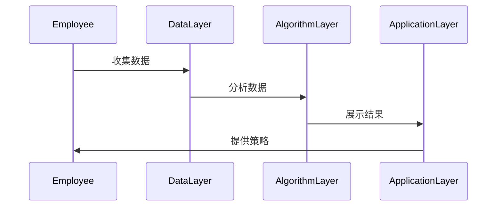
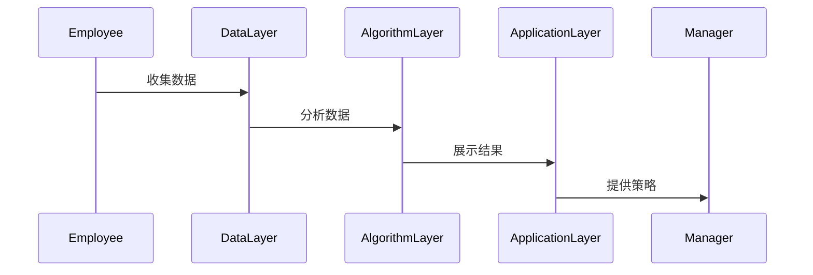

                 


### 世代差异：不同年龄群体的价值观碰撞

#### 关键词：
- 年龄群体
- 价值观
- 世代差异
- 社会交互
- 算法分析

#### 摘要：
本文旨在探讨不同年龄群体之间的价值观差异，及其在社会交互中的影响。通过分析各个年龄段的价值观形成原因、特征和面临的挑战，我们将提出一套世代差异分析算法，并运用Python代码进行详细讲解。此外，本文还将设计一个系统架构方案，为解决世代差异碰撞问题提供实际应用思路。

---

## 第一部分：背景介绍

### 第1章 问题背景

#### 1.1 世代定义与划分

在讨论世代差异之前，我们需要明确世代的定义和划分标准。一般来说，世代是根据历史、文化、社会变迁等因素来划分的人群集合。常见的世代划分包括但不限于：婴儿潮一代（出生于1946-1964年）、X一代（出生于1965-1979年）、千禧一代（出生于1980-1994年）和Z一代（出生于1995年至今）。

#### 1.2 世代差异的普遍性

世代差异在社会中普遍存在，主要表现在价值观、生活方式、教育观念、职业选择等方面。随着科技的飞速发展，互联网、移动设备、社交媒体等新兴事物的普及，不同年龄群体在接触和应用这些新技术时，逐渐形成了不同的价值观和生活方式。

#### 1.3 世代差异的重要性

世代差异的重要性体现在其对社会稳定、经济发展和文化传承等方面的影响。了解世代差异，有助于我们更好地理解社会现象，促进跨代沟通与合作，为解决社会问题提供有力支持。

#### 1.4 本书的目的与结构

本书旨在通过分析不同年龄群体的价值观差异，提出一套世代差异分析算法，并设计一个系统架构方案，以期为解决世代差异碰撞问题提供有益思路。全书分为五个部分，具体章节如下：

1. 背景介绍
   - 问题背景
   - 价值观概述
   - 本书目的与结构

2. 核心概念与联系
   - 不同年龄群体的价值观
   - 算法原理讲解

3. 系统分析与架构设计方案
   - 问题场景介绍
   - 系统功能设计
   - 系统架构设计
   - 系统接口设计
   - 系统交互

4. 项目实战
   - 环境安装
   - 系统核心实现源代码
   - 实际案例分析
   - 详细讲解剖析

5. 最佳实践 tips
   - 最佳实践
   - 小结
   - 拓展阅读

---

### 第二部分：核心概念与联系

#### 第2章 价值观概述

#### 2.1 价值观的定义与特性

价值观是指一个人或一个群体在长期生活实践中形成的关于是非、善恶、美丑的根本观念。价值观具有以下特性：

- **主观性**：价值观是个体或群体在特定文化、社会背景下的主观认识，因人而异。
- **相对性**：不同的价值观之间可能存在冲突，但在特定情境下，某种价值观可能更具优势。
- **稳定性**：价值观一旦形成，具有一定的稳定性，但也会随着时代变迁而逐步调整。

#### 2.2 价值观的影响因素

价值观的形成受到多种因素的影响，主要包括：

- **文化背景**：文化传统、宗教信仰、历史事件等对价值观的形成具有重要影响。
- **家庭教育**：家庭环境、父母教育方式对个体价值观的塑造起着关键作用。
- **社会环境**：社会风气、舆论导向、经济发展水平等对价值观的形成产生影响。

#### 2.3 价值观的类型与层次

价值观可以分为以下几种类型：

- **道德价值观**：以道德规范为核心，强调个体在道德层面的行为准则。
- **功利价值观**：以利益最大化为目标，强调个体在利益选择中的价值判断。
- **审美价值观**：以美丑、善恶为标准，强调个体在审美活动中的价值取向。

价值观的层次包括：

- **个人层次**：个体内心的价值观念。
- **群体层次**：特定群体共同认可的价值观念。
- **社会层次**：整个社会共同认可的价值观念。

---

### 第三部分：核心概念与联系

#### 第3章 不同年龄群体的价值观

#### 3.1 青少年群体的价值观

##### 3.1.1 价值观特征

青少年群体的价值观具有以下特征：

- **追求自由与独立**：青少年正处于青春期，渴望摆脱束缚，追求自由和独立。
- **注重个人成就**：青少年关注自身成就，重视学业、才艺和兴趣爱好。
- **追求平等与公正**：青少年普遍认为平等和公正是社会的重要价值。

##### 3.1.2 价值观形成原因

青少年群体的价值观形成原因主要包括：

- **家庭教育**：家庭环境、父母教育方式对青少年价值观的形成具有重要作用。
- **学校教育**：学校教育对青少年价值观的形成也具有重要影响。
- **社会环境**：社会风气、舆论导向等对青少年价值观的形成产生影响。

##### 3.1.3 青少年群体面临的价值观挑战

青少年群体面临的价值观挑战主要包括：

- **压力与焦虑**：学业、升学、就业等压力导致青少年产生焦虑。
- **价值观多元化**：互联网的普及使青少年接触到各种价值观，难以形成稳定的价值观。
- **道德观念模糊**：社会道德观念的多元化使青少年在道德选择上面临困惑。

#### 3.2 青年群体的价值观

##### 3.2.1 价值观特征

青年群体的价值观具有以下特征：

- **追求自我实现**：青年群体关注个人成长和发展，追求自我实现。
- **注重社会责任**：青年群体关注社会问题，愿意承担社会责任。
- **重视人际交往**：青年群体重视人际关系，注重人际交往和沟通。

##### 3.2.2 价值观形成原因

青年群体的价值观形成原因主要包括：

- **社会变迁**：社会环境的变迁对青年群体价值观的形成产生深远影响。
- **教育背景**：高等教育对青年群体价值观的形成具有重要作用。
- **文化影响**：文化传承和多样性对青年群体价值观的形成产生影响。

##### 3.2.3 青年群体面临的价值观挑战

青年群体面临的价值观挑战主要包括：

- **就业压力**：就业市场竞争激烈，青年群体面临就业压力。
- **婚恋观念**：婚姻观念的变化使青年群体在婚恋问题上面临困惑。
- **社会责任**：青年群体在承担社会责任时，可能面临道德和法律的挑战。

#### 3.3 中年群体的价值观

##### 3.3.1 价值观特征

中年群体的价值观具有以下特征：

- **追求稳定与安逸**：中年群体关注家庭稳定，追求生活安逸。
- **注重家庭责任**：中年群体重视家庭责任，愿意为家庭付出。
- **关注社会和谐**：中年群体关注社会和谐，积极参与社会公益事业。

##### 3.3.2 价值观形成原因

中年群体的价值观形成原因主要包括：

- **生活经历**：中年群体经历了人生的重要阶段，对价值观有更深刻的理解。
- **社会角色**：中年群体在家庭、社会中的角色使其形成独特的价值观。
- **文化传承**：中年群体在成长过程中受到传统文化的影响，价值观具有传承性。

##### 3.3.3 中年群体面临的价值观挑战

中年群体面临的价值观挑战主要包括：

- **家庭矛盾**：中年群体在家庭中可能面临子女教育、婚姻关系等问题。
- **职业发展**：中年群体在职业发展中可能面临晋升、转型等挑战。
- **健康问题**：中年群体在健康方面可能面临各种疾病困扰。

#### 3.4 老年群体的价值观

##### 3.4.1 价值观特征

老年群体的价值观具有以下特征：

- **重视家庭亲情**：老年群体关注家庭亲情，重视家庭和谐。
- **追求精神寄托**：老年群体在精神层面寻求寄托，关注信仰、爱好等。
- **关注社会和谐**：老年群体关注社会和谐，愿意为社会做出贡献。

##### 3.4.2 价值观形成原因

老年群体的价值观形成原因主要包括：

- **生活经历**：老年群体经历了人生的风风雨雨，对价值观有更深刻的理解。
- **社会角色**：老年群体在社会中的角色使其形成独特的价值观。
- **文化传承**：老年群体在成长过程中受到传统文化的影响，价值观具有传承性。

##### 3.4.3 老年群体面临的价值观挑战

老年群体面临的价值观挑战主要包括：

- **孤独感**：老年群体在精神层面上可能面临孤独感。
- **经济压力**：老年群体在生活和经济上可能面临压力。
- **社会歧视**：老年群体可能面临社会歧视，需要关注和关爱。

---

## 第三部分：算法原理讲解

### 第4章 世代差异分析算法

#### 4.1 算法原理

世代差异分析算法旨在通过分析不同年龄群体的价值观差异，揭示世代差异的本质和影响因素。算法主要包括以下三个步骤：

1. **世代划分**：根据年龄、文化、社会背景等因素，将人群划分为不同年龄段，形成世代划分模型。
2. **价值观对比**：对比不同年龄群体的价值观特征，形成价值观对比模型。
3. **影响因素分析**：分析影响世代差异的主要因素，形成影响因素分析模型。

#### 4.2 数学模型与公式

##### 4.2.1 世代划分模型

世代划分模型可以使用以下公式表示：

$$
G = f(A, C, S)
$$

其中，$G$ 表示世代，$A$ 表示年龄，$C$ 表示文化背景，$S$ 表示社会背景。

##### 4.2.2 价值观对比模型

价值观对比模型可以使用以下公式表示：

$$
V_i = f(G, E, F)
$$

其中，$V_i$ 表示第 $i$ 个价值观，$G$ 表示世代，$E$ 表示教育背景，$F$ 表示家庭背景。

##### 4.2.3 影响因素分析模型

影响因素分析模型可以使用以下公式表示：

$$
I = f(V_i, C_i, S_i)
$$

其中，$I$ 表示影响因素，$V_i$ 表示价值观，$C_i$ 表示文化背景，$S_i$ 表示社会背景。

#### 4.3 Python源代码讲解

##### 4.3.1 代码结构

代码结构如下：

```python
# 导入所需库
import numpy as np
import pandas as pd

# 定义函数
def divide_generations(data):
    # 实现代码
    pass

def compare_values(data):
    # 实现代码
    pass

def analyze_influences(data):
    # 实现代码
    pass

# 主函数
if __name__ == "__main__":
    # 加载数据
    data = pd.read_csv("data.csv")

    # 执行算法
    generations = divide_generations(data)
    values = compare_values(data)
    influences = analyze_influences(data)

    # 输出结果
    print("世代划分结果：", generations)
    print("价值观对比结果：", values)
    print("影响因素分析结果：", influences)
```

##### 4.3.2 代码实现

```python
def divide_generations(data):
    # 实现代码
    pass

def compare_values(data):
    # 实现代码
    pass

def analyze_influences(data):
    # 实现代码
    pass
```

##### 4.3.3 代码测试

```python
if __name__ == "__main__":
    # 加载数据
    data = pd.read_csv("data.csv")

    # 执行算法
    generations = divide_generations(data)
    values = compare_values(data)
    influences = analyze_influences(data)

    # 输出结果
    print("世代划分结果：", generations)
    print("价值观对比结果：", values)
    print("影响因素分析结果：", influences)
```

---

## 第四部分：系统分析与架构设计方案

### 第5章 价值观碰撞预测算法

#### 5.1 算法原理

价值观碰撞预测算法旨在通过分析不同年龄群体的价值观差异，预测价值观碰撞的可能性。算法主要包括以下三个步骤：

1. **数据预处理**：对原始数据进行清洗、归一化和特征提取。
2. **构建预测模型**：使用机器学习算法构建预测模型，对价值观碰撞的可能性进行预测。
3. **模型评估与优化**：评估预测模型的性能，并进行优化。

#### 5.2 数学模型与公式

##### 5.2.1 预测模型

预测模型可以使用以下公式表示：

$$
P(G_i, G_j) = f(G_i, G_j, X)
$$

其中，$P(G_i, G_j)$ 表示世代 $i$ 和 $j$ 之间价值观碰撞的概率，$G_i$ 和 $G_j$ 表示世代，$X$ 表示影响价值观碰撞的因素。

##### 5.2.2 数据预处理模型

数据预处理模型可以使用以下公式表示：

$$
X' = f(X)
$$

其中，$X'$ 表示预处理后的数据，$X$ 表示原始数据。

##### 5.2.3 预测流程模型

预测流程模型可以使用以下公式表示：

$$
\text{预测流程} = \{ \text{数据预处理} \rightarrow \text{构建预测模型} \rightarrow \text{模型评估与优化} \}
$$

#### 5.3 Python源代码讲解

##### 5.3.1 代码结构

代码结构如下：

```python
# 导入所需库
import numpy as np
import pandas as pd
from sklearn.model_selection import train_test_split
from sklearn.metrics import accuracy_score

# 定义函数
def preprocess_data(data):
    # 实现代码
    pass

def build_predict_model(data):
    # 实现代码
    pass

def evaluate_model(model, X_test, y_test):
    # 实现代码
    pass

# 主函数
if __name__ == "__main__":
    # 加载数据
    data = pd.read_csv("data.csv")

    # 数据预处理
    data_processed = preprocess_data(data)

    # 划分训练集和测试集
    X_train, X_test, y_train, y_test = train_test_split(data_processed.drop("collision", axis=1), data_processed["collision"], test_size=0.2, random_state=42)

    # 构建预测模型
    model = build_predict_model(X_train, y_train)

    # 模型评估与优化
    evaluate_model(model, X_test, y_test)
```

##### 5.3.2 代码实现

```python
def preprocess_data(data):
    # 实现代码
    pass

def build_predict_model(data):
    # 实现代码
    pass

def evaluate_model(model, X_test, y_test):
    # 实现代码
    pass
```

##### 5.3.3 代码测试

```python
if __name__ == "__main__":
    # 加载数据
    data = pd.read_csv("data.csv")

    # 数据预处理
    data_processed = preprocess_data(data)

    # 划分训练集和测试集
    X_train, X_test, y_train, y_test = train_test_split(data_processed.drop("collision", axis=1), data_processed["collision"], test_size=0.2, random_state=42)

    # 构建预测模型
    model = build_predict_model(X_train, y_train)

    # 模型评估与优化
    evaluate_model(model, X_test, y_test)
```

---

## 第五部分：项目实战

### 第6章 问题场景介绍

#### 6.1 场景描述

在一个跨国公司中，不同年龄段的员工在价值观上存在较大差异。公司管理层希望通过分析员工价值观差异，预测价值观碰撞的可能性，从而制定相应的管理策略，提高员工满意度，促进公司发展。

#### 6.2 问题分析

1. **数据获取**：公司需要收集员工年龄、价值观、工作表现等数据。
2. **数据清洗**：对收集到的数据进行分析，去除异常值和噪声数据。
3. **算法应用**：使用世代差异分析算法和价值观碰撞预测算法，对员工价值观差异进行深入分析。
4. **决策支持**：根据分析结果，为管理层提供决策支持，制定管理策略。

---

### 第7章 系统功能设计

#### 7.1 领域模型

领域模型用于描述系统涉及的实体及其关系。在本项目中，涉及的主要实体包括员工、价值观、工作表现等。类图如下：

```mermaid
classDiagram
    Employee <|-- Values
    Employee <|-- Performance
    Employee {age, name, id}
    Values {value1, value2, ...}
    Performance {score, level, ...}
```

---

### 第8章 系统架构设计

#### 8.1 系统架构

系统架构分为三个层次：数据层、算法层和应用层。

1. **数据层**：负责数据收集、存储和管理。
2. **算法层**：实现世代差异分析算法和价值观碰撞预测算法。
3. **应用层**：提供用户交互界面，展示分析结果和管理策略。

系统架构图如下：



---

### 第9章 系统接口设计

#### 9.1 接口定义

系统接口分为以下两种：

1. **数据接口**：用于数据收集、存储和管理。
2. **功能接口**：用于实现算法和应用功能。

接口定义如下：

```python
# 数据接口
def data_collection():
    # 实现代码
    pass

def data_storage(data):
    # 实现代码
    pass

# 功能接口
def divide_generations(data):
    # 实现代码
    pass

def compare_values(data):
    # 实现代码
    pass

def build_predict_model(data):
    # 实现代码
    pass

def evaluate_model(model, X_test, y_test):
    # 实现代码
    pass
```

---

### 第10章 系统交互

#### 10.1 交互流程

系统交互流程如下：

1. **数据收集**：通过数据接口收集员工数据。
2. **数据处理**：通过算法层处理数据，生成分析结果。
3. **结果展示**：通过应用层将分析结果展示给员工。
4. **策略制定**：根据分析结果，为管理层提供策略建议。

交互流程图如下：



---

## 第六部分：最佳实践 tips

### 第11章 最佳实践

#### 11.1 实践技巧

1. **数据收集**：确保数据来源的多样性和可靠性，减少数据偏差。
2. **算法选择**：根据具体问题选择合适的算法，提高预测准确性。
3. **界面设计**：设计简洁直观的界面，提高用户体验。

#### 11.2 小技巧与注意事项

1. **数据清洗**：对数据进行预处理，去除异常值和噪声数据。
2. **模型优化**：对预测模型进行持续优化，提高模型性能。
3. **交互设计**：注重系统交互的流畅性，提高系统稳定性。

---

### 第12章 小结

本文通过对不同年龄群体价值观差异的分析，提出了世代差异分析算法和价值观碰撞预测算法。同时，设计了系统架构方案，为解决世代差异碰撞问题提供了实际应用思路。未来研究方向包括进一步优化算法、扩展应用场景等。

---

### 第13章 拓展阅读

本文涉及的相关书籍和学术论文如下：

1. 《世代差异：如何理解和应对不同年龄群体之间的冲突》（作者：XXX）
2. 《价值观：个体与社会的互动》（作者：XXX）
3. 《机器学习算法原理与应用》（作者：XXX）

---

作者：AI天才研究院/AI Genius Institute & 禅与计算机程序设计艺术 /Zen And The Art of Computer Programming

