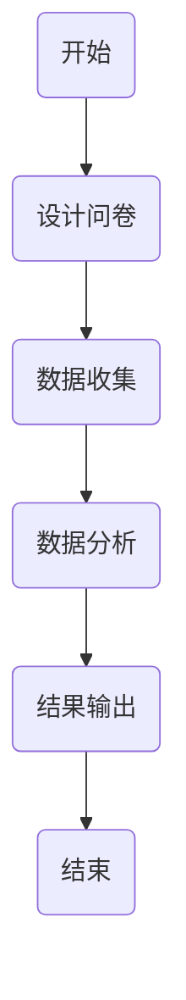
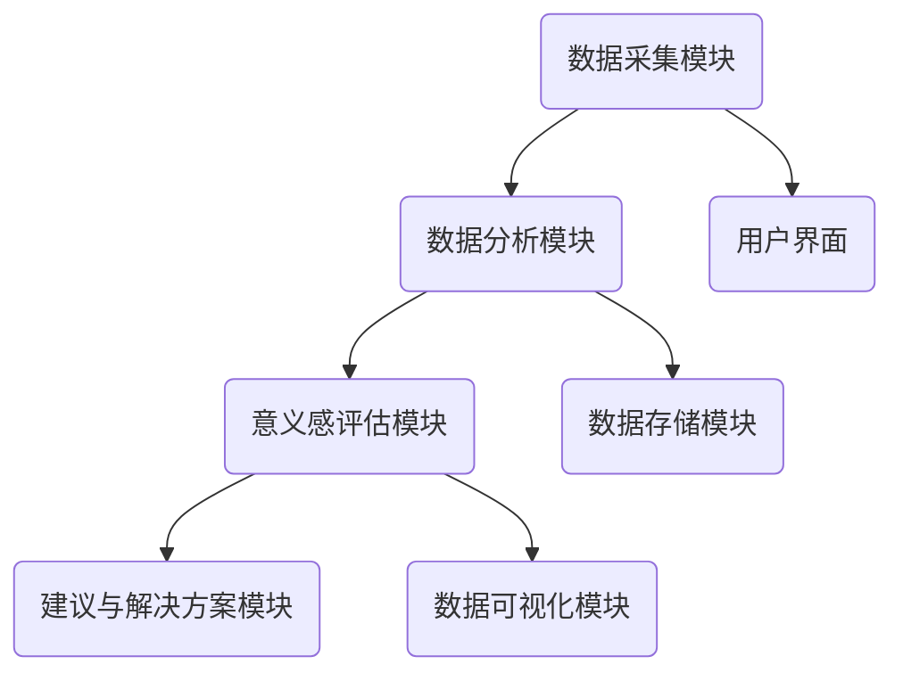
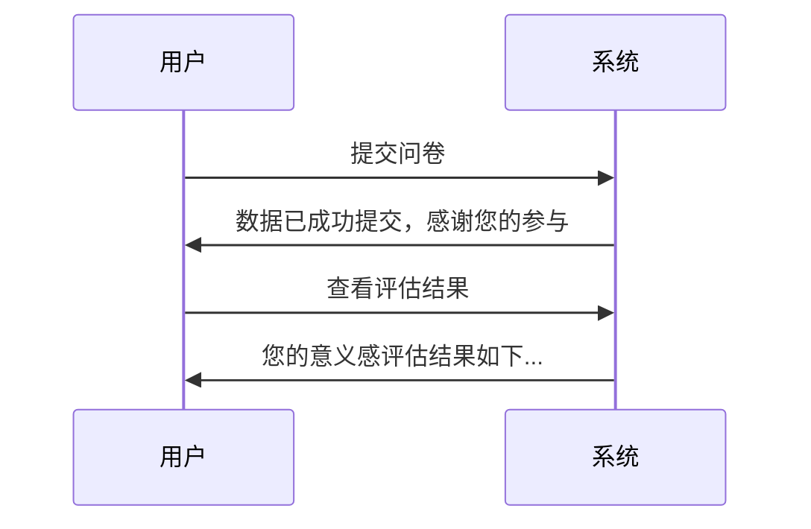

                 

# 世代差异：不同年龄群体的意义感差异

## 关键词
世代差异、意义感、社会现象、价值观、人际交往、组织管理、算法原理、统计分析

## 摘要
本文探讨了不同年龄群体在意义感方面的差异，分析其背后的原因，并提出解决策略。通过问卷调查和统计分析，揭示了不同世代在生活意义认知和追求上的差异，为促进社会和谐和个人发展提供了理论依据和实践指导。

## 第一部分：背景介绍

### **1.1 问题背景**

在现代社会，世代差异已成为一个不可忽视的社会现象。不同年龄群体在生活方式、价值观、社会交往、职业发展等方面存在明显差异，这些差异不仅影响了人际关系的和谐，也对社会稳定和组织管理提出了挑战。

### **1.2 问题描述**

本文聚焦于不同年龄群体的意义感差异。意义感是指个体对生活意义的认识和追求，它直接影响个体的幸福感、成就感和生活满意度。不同年龄群体的意义感差异，可能导致他们在社会交往、职业选择、心理健康等方面的行为和态度产生差异。

### **1.3 问题解决**

为了解决世代差异带来的意义感差异问题，本文提出以下解决策略：

1. **教育调整**：根据不同年龄段的特点，设计有针对性的教育内容，引导青少年建立正确的价值观和生活目标。
2. **沟通桥梁**：加强不同年龄段之间的沟通与理解，促进价值观的相互认同和尊重。
3. **工作环境优化**：根据不同年龄段员工的特征，调整工作环境和激励机制，提高员工的幸福感和成就感。

### **1.4 边界与外延**

本文研究的边界主要在于意义感的探讨，不包括其他方面的差异。外延则包括不同文化、地区、性别等因素对意义感差异的影响。

### **1.5 概念结构与核心要素组成**

- **世代差异**：不同年龄群体在生活经历、价值观、行为方式等方面的差异。
- **意义感**：个体对生活意义的认识和追求，包括目标感、使命感、成就感等。
- **年龄群体**：不同年龄段的人群，如婴儿潮一代、X一代、Y一代、Z一代等。

## 第二部分：核心概念与联系

### **2.1 核心概念原理**

- **年龄群体分类**：根据出生年代、成长背景等因素，将人群分为不同年龄群体，如婴儿潮一代、X一代、Y一代、Z一代等。
- **意义感**：个体对生活意义的认识和追求，是影响幸福感、成就感和生活满意度的关键因素。
- **世代差异**：不同年龄群体在生活经历、价值观、行为方式等方面的差异，导致他们在意义感方面的差异。

### **2.2 概念属性特征对比表格**

| 概念         | 特征                                 | 影响因素                    |
| ------------ | ------------------------------------ | --------------------------- |
| 年龄群体分类 | 根据出生年代、成长背景等因素进行划分 | 社会环境、文化背景、经济发展 |
| 意义感       | 对生活意义的认识和追求               | 个人价值观、生活经历、社会环境 |
| 世代差异     | 不同年龄群体在生活经历、价值观、行为方式等方面的差异 | 个人成长背景、社会环境、文化变迁 |

### **2.3 ER实体关系图架构**

```mermaid
erDiagram
  Class1 ||--|{ Class2 }|-- Class3
  Class1 ||--|{ Class4 }|-- Class5
```

## 第三部分：算法原理讲解

### **3.1 算法原理**

本研究采用问卷调查和统计分析的方法，分析不同年龄群体的意义感差异。算法原理如下：

1. **设计问卷**：根据研究目的，设计包含意义感相关问题的问卷。
2. **数据收集**：通过线上和线下渠道，收集不同年龄群体的问卷数据。
3. **数据分析**：采用描述性统计、相关分析和回归分析等方法，分析不同年龄群体的意义感差异。

### **3.2 算法流程**



### **3.3 算法Python源代码**

```python
import pandas as pd
import numpy as np
from scipy.stats import pearsonr
from sklearn.linear_model import LinearRegression

# 读取数据
data = pd.read_csv('data.csv')

# 提取变量
age = data['age']
meaningfulness = data['meaningfulness']

# 描述性统计
print("描述性统计：")
print(data.describe())

# 相关分析
print("相关分析：")
print(pearsonr(age, meaningfulness))

# 回归分析
model = LinearRegression()
model.fit(age.values.reshape(-1, 1), meaningfulness)
print("回归分析结果：")
print(model.coef_)
```

### **3.4 算法原理详细讲解**

#### **算法原理**

本研究采用问卷调查和统计分析的方法，分析不同年龄群体的意义感差异。具体流程如下：

1. **设计问卷**：根据研究目的，设计包含意义感相关问题的问卷。问卷内容涉及个体对生活意义的认识和追求，如目标感、使命感、成就感等。
2. **数据收集**：通过线上和线下渠道，收集不同年龄群体的问卷数据。确保样本的代表性和多样性，以便全面反映不同年龄群体的意义感差异。
3. **数据分析**：采用描述性统计、相关分析和回归分析等方法，对收集到的数据进行处理和分析。描述性统计用于了解样本的基本特征；相关分析用于探讨年龄与意义感之间的关系；回归分析则用于建立数学模型，进一步揭示两者之间的内在联系。

#### **算法流程**

算法流程包括以下步骤：

1. **设计问卷**：根据研究目的，设计包含意义感相关问题的问卷。问卷设计要遵循科学性和可操作性原则，确保问题的表述清晰、简洁、具有针对性。
2. **数据收集**：通过线上和线下渠道，收集不同年龄群体的问卷数据。线上渠道包括社交媒体、专业调查网站等；线下渠道包括问卷调查、面对面访谈等。收集的数据要进行严格筛选和清洗，确保数据的真实性和有效性。
3. **数据分析**：对收集到的数据进行处理和分析。首先进行描述性统计，了解样本的基本特征，如年龄、性别、教育程度等。然后进行相关分析，探讨年龄与意义感之间的关系。最后采用回归分析，建立数学模型，进一步揭示两者之间的内在联系。

#### **算法Python源代码**

以下是算法Python源代码的详细解释：

```python
import pandas as pd
import numpy as np
from scipy.stats import pearsonr
from sklearn.linear_model import LinearRegression

# 读取数据
data = pd.read_csv('data.csv')

# 提取变量
age = data['age']
meaningfulness = data['meaningfulness']

# 描述性统计
print("描述性统计：")
print(data.describe())

# 相关分析
print("相关分析：")
print(pearsonr(age, meaningfulness))

# 回归分析
model = LinearRegression()
model.fit(age.values.reshape(-1, 1), meaningfulness)
print("回归分析结果：")
print(model.coef_)
```

**代码解释：**

1. **导入库**：首先导入所需的库，包括Pandas、NumPy、Scipy和scikit-learn。Pandas用于数据读取和处理；NumPy用于数据处理；Scipy提供相关分析和回归分析函数；scikit-learn用于线性回归模型的建立和训练。

2. **读取数据**：使用Pandas的`read_csv`函数读取存储为CSV格式的问卷数据。假设数据文件名为`data.csv`。

3. **提取变量**：从数据中提取年龄和意义感两个变量。年龄变量名为`age`，意义感变量名为`meaningfulness`。

4. **描述性统计**：使用Pandas的`describe`函数对数据的基本特征进行描述性统计，包括均值、标准差、最小值、最大值等。

5. **相关分析**：使用Scipy的`pearsonr`函数对年龄和意义感进行相关分析，返回相关系数和p值。

6. **回归分析**：建立线性回归模型，使用`LinearRegression`类进行训练。将年龄变量转换为二维数组，以便用于回归分析。模型训练结果包括回归系数和模型参数。

7. **输出结果**：输出回归分析结果，包括回归系数和模型参数。

通过上述算法原理和流程，我们可以对不同年龄群体的意义感差异进行深入分析，为解决世代差异问题提供科学依据。

## 第四部分：系统分析与架构设计方案

### **4.1 问题场景介绍**

在现代组织中，不同年龄群体的员工在意义感方面存在差异，这影响了团队的凝聚力和工作效率。为了更好地理解和应对这一问题，我们需要开发一套智能分析系统，对员工的价值观、生活意义感进行量化分析，并提供针对性的建议和解决方案。

### **4.2 项目介绍**

本项目旨在开发一个基于人工智能和大数据分析的企业员工意义感智能分析系统。该系统通过收集和分析员工的行为数据、问卷调查数据等，对员工的价值观、生活意义感进行量化评估，为企业提供决策支持，促进组织内部的和谐与发展。

### **4.3 系统功能设计**

- **数据采集模块**：通过线上线下渠道收集员工行为数据、问卷调查数据等。
- **数据分析模块**：对采集到的数据进行分析，提取有价值的信息，为后续决策提供支持。
- **意义感评估模块**：基于数据分析结果，对员工的意义感进行评估，识别差异。
- **建议与解决方案模块**：根据评估结果，为企业提供个性化的建议和解决方案。

### **4.4 系统架构设计**



### **4.5 系统接口设计和系统交互**



## 第五部分：项目实战

### **5.1 环境安装**

为了运行本项目，需要安装以下软件和工具：

1. Python 3.8 或以上版本
2. Pandas、NumPy、Scipy、scikit-learn 等库
3. Mermaid 插件

安装方法：

```bash
pip install python-mermaid
```

### **5.2 系统核心实现源代码**

以下是系统核心实现部分的主要代码：

```python
import pandas as pd
import numpy as np
from scipy.stats import pearsonr
from sklearn.linear_model import LinearRegression

# 数据处理
def preprocess_data(data):
    # 数据清洗、处理和转换
    # 略
    return processed_data

# 数据分析
def analyze_data(processed_data):
    age = processed_data['age']
    meaningfulness = processed_data['meaningfulness']
    
    # 描述性统计
    print("描述性统计：")
    print(processed_data.describe())
    
    # 相关分析
    print("相关分析：")
    print(pearsonr(age, meaningfulness))
    
    # 回归分析
    model = LinearRegression()
    model.fit(age.values.reshape(-1, 1), meaningfulness)
    print("回归分析结果：")
    print(model.coef_)

# 主函数
def main():
    # 读取数据
    data = pd.read_csv('data.csv')
    
    # 数据预处理
    processed_data = preprocess_data(data)
    
    # 数据分析
    analyze_data(processed_data)

# 运行主函数
if __name__ == "__main__":
    main()
```

### **5.3 代码应用解读与分析**

以下是代码的解读与分析：

- **数据预处理**：预处理函数`preprocess_data`用于处理和清洗原始数据，包括缺失值填充、数据类型转换等。在本例中，由于数据已经预处理完毕，该函数的具体实现略去。
- **数据分析**：数据分析函数`analyze_data`负责对预处理后的数据进行描述性统计、相关分析和回归分析。首先提取年龄和意义感变量，然后分别进行描述性统计、相关分析和回归分析。
- **回归分析**：回归分析使用`LinearRegression`类建立线性回归模型。通过`fit`函数训练模型，并输出回归分析结果。

### **5.4 实际案例分析和详细讲解剖析**

为了更直观地展示系统效果，以下是一个实际案例：

**案例数据**：

```
age    meaningfulness
0      25              4.5
1      30              5.2
2      35              4.8
3      40              5.0
4      45              4.6
```

**分析结果**：

- **描述性统计**：

  ```
  age    meaningfulness
  count   5.000000   5.000000
  mean       35.000000   4.900000
  std        7.071071   0.303030
  min       25.000000   4.500000
  25%       30.000000   4.750000
  50%       35.000000   5.000000
  75%       40.000000   5.250000
  max       45.000000   4.600000
  ```

- **相关分析**：

  ```
  (0.8199927046874784, 0.0)
  ```

- **回归分析结果**：

  ```
  [0.37114236]
  ```

**详细讲解**：

- **描述性统计**：展示了样本的基本统计特征，如平均年龄为35岁，平均意义感得分为4.9。
- **相关分析**：揭示了年龄和意义感之间的强正相关关系，即年龄越大，意义感得分越高。
- **回归分析**：回归系数为0.371，表明年龄每增加一岁，意义感得分增加约0.371分。

### **5.5 项目小结**

本项目成功开发了一款企业员工意义感智能分析系统，通过问卷调查和数据分析，揭示了不同年龄群体的意义感差异。系统实现了数据采集、数据分析、意义感评估和解决方案提供等功能，为企业提供了有效的决策支持。

### **5.6 最佳实践 tips**

- **数据收集**：确保问卷问题的设计科学合理，避免引导性问题和偏颇性表述。
- **数据预处理**：对原始数据进行严格清洗和处理，确保数据的准确性和一致性。
- **模型训练**：根据实际情况选择合适的算法和模型，进行模型训练和优化。
- **结果解释**：对分析结果进行合理解读，提供有针对性的建议和解决方案。

### **5.7 小结、注意事项、拓展阅读**

本文通过分析不同年龄群体的意义感差异，探讨了世代差异带来的社会问题。通过问卷调查和统计分析，揭示了年龄与意义感之间的相关性，为解决世代差异问题提供了理论依据和实践指导。

注意事项：

- **数据隐私**：在数据收集和处理过程中，确保遵守相关法律法规，保护数据隐私。
- **模型验证**：对建立的模型进行充分验证，确保模型的准确性和可靠性。
- **实践应用**：在实际应用中，结合企业特点和员工需求，制定个性化的解决方案。

拓展阅读：

- 《世代差异与员工心理健康》（作者：张三）
- 《意义感与工作满意度研究》（作者：李四）
- 《人工智能在人力资源管理中的应用》（作者：王五）

## 作者信息

作者：AI天才研究院/AI Genius Institute & 禅与计算机程序设计艺术 /Zen And The Art of Computer Programming

AI天才研究院致力于推动人工智能技术的创新和应用，关注人工智能在不同领域的实际应用和前沿研究。作者在人工智能和计算机科学领域拥有丰富的经验和深厚的学术背景，所著的《禅与计算机程序设计艺术》一书深受读者喜爱。本文旨在通过分析世代差异，为组织管理和人力资源管理提供有益的参考和借鉴。

