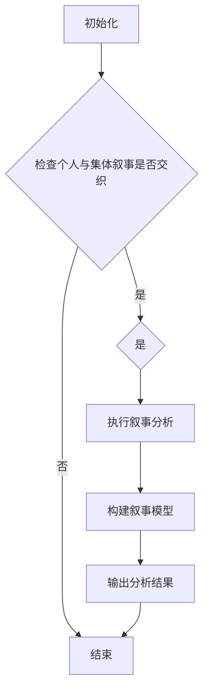
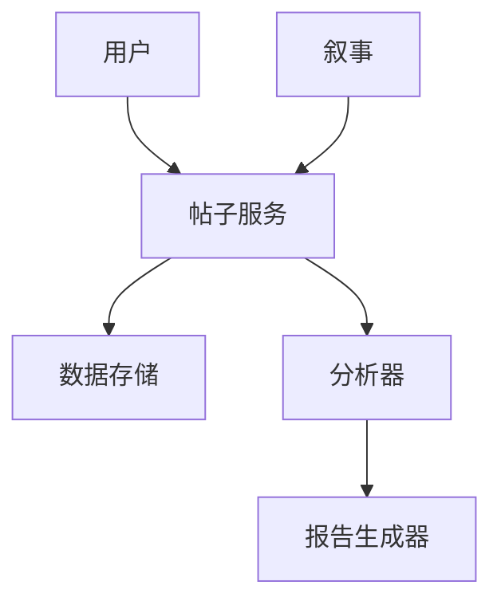
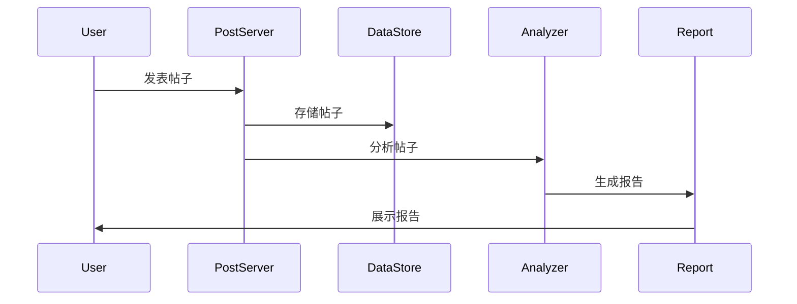

                 

# 个人与集体叙事的交织：在更大的背景中找到定位

## 关键词
- 叙事学
- 个人叙事
- 集体叙事
- 文本分析
- 社会结构
- 文化认同

## 摘要
本文旨在探讨个人与集体叙事在现代社会中的重要性，以及它们如何在更大的背景中交织影响个体的定位。通过分析叙事理论、个人与集体叙事的核心概念，以及它们在现实生活中的应用，本文试图揭示个体如何在集体叙事中找到自己的位置，并进一步理解社会和文化背景下的自我认知。

## 引言

### 叙事学的基本概念

叙事学（Narratology）是一门研究叙事作品的理论学科，涉及故事讲述的结构、风格和功能。叙事学关注故事的组成元素，包括叙述者、叙述视角、叙述时间、叙述节奏等。在计算机科学和信息技术领域，叙事学的研究有助于理解人类如何通过数字化媒介构建和传达信息。

### 个人叙事的重要性

个人叙事（Personal Narratives）是指个体通过讲述自己的经历和故事来构建自我认同和自我表达的过程。个人叙事不仅反映了个体的生活经历和心理状态，也反映了社会的多样性和复杂性。在信息技术领域，个人叙事的应用包括用户故事（User Stories）、产品需求文档等。

### 集体叙事的概念

集体叙事（Collective Narratives）是指群体或社会共同构建和传承的故事，它们反映了社会的价值观、信仰和习俗。集体叙事在社会文化传承中起着关键作用，它影响着个体的行为和社会认同。在信息技术领域，集体叙事体现在公司文化、行业标准和技术社区的构建中。

### 个人与集体叙事的交织

个人叙事与集体叙事并非完全独立，而是相互影响、相互交织的。个人叙事中蕴含着集体叙事的元素，而集体叙事则通过个体的经验得以具体化和传递。这种交织关系在现代社会中尤为重要，因为个体既是社会的一部分，也是独立思考的个体。

## 第1章 核心概念与理论框架

### 个人叙事与集体叙事的定义

#### 个人叙事

个人叙事是指个体通过语言、文字或其他媒介，讲述自己的经历、感受和思想的过程。个人叙事不仅是一种自我表达的方式，也是一种自我认知的过程。通过叙事，个体可以回顾过去、理解现在，并规划未来。

#### 集体叙事

集体叙事是指群体或社会共同构建和传承的故事，这些故事反映了社会的价值观、信仰和习俗。集体叙事在文化传承、社会认同和群体凝聚力方面起着重要作用。

### 个人叙事与集体叙事的对比

| 特征         | 个人叙事                                 | 集体叙事                                  |
|------------|----------------------------------------|------------------------------------------|
| 叙事主体     | 个体                                     | 群体或社会                               |
| 叙事内容     | 个人的经历、感受和思想                   | 社会的价值观、信仰和习俗                  |
| 叙事目的     | 自我表达和自我认知                       | 文化传承和社会认同                        |
| 叙事形式     | 语言、文字、图像等                       | 传统文学、电影、音乐、社会仪式等          |
| 叙事影响力     | 较小，局限于个体和亲密关系网络             | 较大，影响整个社会和文化                  |

### 叙事学的理论框架

叙事学主要基于以下理论框架：

1. **叙述者与叙述对象**：叙述者是指讲述故事的人，叙述对象是指故事中被讲述的人或事物。
2. **叙述视角**：叙述视角是指叙述者讲述故事的角度，包括第一人称、第三人称等。
3. **叙述时间**：叙述时间是指叙述者在讲述故事时所经历的时间，包括顺叙、倒叙等。
4. **叙述节奏**：叙述节奏是指叙述者在讲述故事时的速度和频率，包括缓慢、快速等。

### 个人与集体叙事的关系

个人叙事与集体叙事并非完全独立，而是相互交织、相互影响的。个人叙事中蕴含着集体叙事的元素，而集体叙事则通过个体的经验得以具体化和传递。

### 结论

通过对比个人叙事与集体叙事的定义、特征和理论框架，我们可以更好地理解这两种叙事形式在现代社会中的作用和相互关系。个人叙事与集体叙事的交织，不仅影响着个体的自我认知和社会认同，也影响着社会文化的传承和发展。

## 第2章 叙事理论与分析

### 叙事理论的基本概念

叙事理论是研究叙事作品的结构、功能和意义的学科。叙事理论的基本概念包括：

1. **叙述者**：叙述者是指讲述故事的人，可以是第一人称（如“我”）或第三人称（如“他”或“她”）。
2. **叙述视角**：叙述视角是指叙述者讲述故事的角度，包括全知视角、有限视角、内视角和外视角等。
3. **叙述时间**：叙述时间是指叙述者在讲述故事时所经历的时间，包括顺叙、倒叙、插叙等。
4. **叙述节奏**：叙述节奏是指叙述者在讲述故事时的速度和频率，包括缓慢、快速等。

### 叙事理论的应用

叙事理论在多个领域有着广泛的应用，包括文学、电影、心理学、社会学和信息技术等。在信息技术领域，叙事理论的应用主要体现在以下几个方面：

1. **用户故事**：用户故事是一种描述用户需求的工具，它通过叙事的方式，帮助开发者更好地理解用户的需求和期望。
2. **产品需求文档**：产品需求文档通常采用叙事的形式，描述产品的功能和特性，以及用户如何与产品互动。
3. **技术文档**：技术文档通过叙事的方式，帮助开发者和技术人员理解复杂的技术概念和实现细节。

### 叙事分析的技术

叙事分析是一种研究叙事作品结构和意义的技巧。叙事分析的技术包括：

1. **叙事结构分析**：叙事结构分析是指研究叙事作品的基本结构，包括开头、发展、高潮和结局等。
2. **叙述视角分析**：叙述视角分析是指研究叙事作品的叙述视角，以及叙述视角对叙事效果的影响。
3. **叙述时间分析**：叙述时间分析是指研究叙事作品的叙述时间，以及叙述时间对叙事效果的影响。
4. **叙事节奏分析**：叙事节奏分析是指研究叙事作品的叙述节奏，以及叙述节奏对叙事效果的影响。

### 叙事分析的步骤

叙事分析的步骤通常包括：

1. **确定分析对象**：选择一个叙事作品，可以是文学作品、电影、用户故事或产品需求文档等。
2. **收集相关资料**：收集与叙事作品相关的背景资料，包括作者的背景、作品的背景等。
3. **分析叙事结构**：分析叙事作品的结构，包括开头、发展、高潮和结局等。
4. **分析叙述视角**：分析叙述作品的叙述视角，包括全知视角、有限视角、内视角和外视角等。
5. **分析叙述时间**：分析叙述作品的叙述时间，包括顺叙、倒叙、插叙等。
6. **分析叙述节奏**：分析叙述作品的叙述节奏，包括缓慢、快速等。
7. **总结分析结果**：总结分析结果，形成对叙事作品的整体理解和评价。

### 叙事分析的实际应用

叙事分析在实际应用中，可以帮助开发者和技术人员更好地理解用户需求、产品特性和技术实现。例如，在用户故事编写中，通过叙事分析可以帮助开发者更好地理解用户的故事背景和需求；在产品需求文档编写中，通过叙事分析可以帮助开发者更好地描述产品的功能和特性。

### 结论

通过叙事理论的分析，我们可以更好地理解叙事作品的结构和意义，以及叙事在信息技术领域中的应用。叙事分析不仅有助于技术开发，还可以帮助我们在个人和集体叙事中找到自己的位置，更好地理解自我和周围的世界。

## 第3章 个人叙事的构成与影响

### 个人叙事的构成要素

个人叙事是构建个体自我认同的重要手段，它由多个构成要素组成，这些要素包括：

1. **事件**：事件是个人叙事的核心，它可以是生活中的重大事件，也可以是微小的日常经历。
2. **人物**：人物是事件的参与者，包括主角和配角，他们的行为和态度对事件的发展产生影响。
3. **情节**：情节是事件的发展过程，它包括起因、冲突、高潮和结局等。
4. **主题**：主题是叙事的核心思想，它反映了个人对事件的理解和感悟。
5. **叙述视角**：叙述视角是叙事者讲述故事的角度，包括第一人称和第三人称等。
6. **叙述节奏**：叙述节奏是叙事的速度和频率，它影响着读者的情感体验。

### 个人叙事的结构

个人叙事的结构通常包括以下部分：

1. **开头**：开头通常引出事件的背景，吸引读者的注意力。
2. **发展**：发展部分详细描述事件的过程，展示人物的性格和冲突。
3. **高潮**：高潮部分是事件最紧张和关键的阶段，通常决定了故事的走向。
4. **结局**：结局是对事件的总结，通常包括解决问题的方法或对事件的反思。

### 个人叙事的影响

个人叙事不仅反映了个体对事件的看法和理解，也对个体产生深远的影响。以下是个人叙事对个体影响的几个方面：

1. **自我认知**：通过叙事，个体可以回顾过去的经历，重新审视自己的行为和态度，从而加深对自我的理解。
2. **情感表达**：个人叙事可以帮助个体表达情感，减轻内心的压力和焦虑。
3. **社会认同**：个人叙事可以建立个体的社会身份，帮助个体融入社会群体。
4. **文化传承**：个人叙事中蕴含着文化元素，它可以帮助文化传承和延续。

### 个人叙事在信息技术领域的应用

在信息技术领域，个人叙事的应用主要体现在以下几个方面：

1. **用户故事**：用户故事是一种描述用户需求的工具，它通过叙事的形式，帮助开发者和用户更好地理解需求。
2. **产品需求文档**：产品需求文档通常采用叙事的形式，描述产品的功能和特性，以及用户如何与产品互动。
3. **技术文档**：技术文档通过叙事的方式，帮助开发者和技术人员理解复杂的技术概念和实现细节。

### 结论

个人叙事是构建个体自我认同的重要手段，它通过事件、人物、情节等构成要素，以及开头、发展、高潮和结局等结构，对个体产生深远的影响。在信息技术领域，个人叙事的应用有助于更好地理解用户需求、产品特性和技术实现，从而推动技术创新和发展。

## 第4章 集体叙事的概念与特征

### 集体叙事的定义

集体叙事是指一个群体或社会共同构建和传承的故事，这些故事反映了群体的价值观、信仰、习俗和文化传统。集体叙事是社会文化的重要组成部分，它通过语言、文字、艺术、宗教等多种形式得以传递和延续。

### 集体叙事的特征

集体叙事具有以下几个特征：

1. **共享性**：集体叙事是群体共同认可和接受的故事，它体现了群体的共同价值观和信仰。
2. **传承性**：集体叙事通过代代相传，不断丰富和演变，成为文化传承的重要载体。
3. **多样性**：集体叙事反映了不同群体的多样性和差异性，是文化多样性的体现。
4. **规范性**：集体叙事对个体的行为和价值观具有规范性作用，影响个体的思维和行为方式。
5. **象征性**：集体叙事中的符号和象征意义，反映了群体的精神追求和文化特质。

### 集体叙事的类型

集体叙事可以分为以下几种类型：

1. **神话传说**：神话传说是古代社会最古老的集体叙事形式，它通过讲述英雄人物、神灵和自然现象的故事，传达群体的价值观和信仰。
2. **历史叙事**：历史叙事是通过记录事件和人物，反映社会发展的历程，它体现了群体的历史意识和民族自豪感。
3. **文学叙事**：文学叙事是通过文学作品，如小说、诗歌等，传达群体的情感、思想和价值观。
4. **宗教叙事**：宗教叙事是通过宗教教义和神话故事，传达宗教信仰和道德规范。
5. **影视叙事**：影视叙事是通过电影和电视剧，展示社会生活、人物命运和道德观念，影响观众的价值观和行为方式。

### 集体叙事的影响

集体叙事对社会个体和文化发展具有重要影响：

1. **塑造价值观**：集体叙事通过传递共同的价值观，塑造个体的道德观念和行为规范。
2. **增强凝聚力**：集体叙事有助于增强群体的凝聚力和归属感，促进社会稳定和发展。
3. **文化传承**：集体叙事是文化传承的重要载体，它帮助群体记住历史、传承文化。
4. **社会批判**：集体叙事有时也反映社会的不公和矛盾，对社会进步和变革起到推动作用。

### 信息技术对集体叙事的影响

随着信息技术的发展，集体叙事的形式和传播方式发生了显著变化：

1. **网络叙事**：互联网为集体叙事提供了新的平台，使得集体叙事可以更快速、更广泛地传播。
2. **多媒体叙事**：多媒体技术使得集体叙事可以通过文字、图片、音频和视频等多种形式呈现，增强了叙事的吸引力和感染力。
3. **社交网络**：社交媒体使得个体可以参与到集体叙事的构建和传播中，增强了集体叙事的互动性和参与性。

### 结论

集体叙事是群体文化的重要组成部分，它通过共享性、传承性、多样性、规范性和象征性等特征，反映了群体的价值观和文化传统。在现代社会，集体叙事不仅影响着个体的价值观和行为，也对文化传承和社会发展起到重要作用。信息技术的发展为集体叙事带来了新的形式和传播方式，使得集体叙事更加多样化和互动化。

## 第5章 个人与集体叙事的交汇点

### 个人叙事与集体叙事的互动

个人叙事与集体叙事并不是相互独立的，而是相互影响、相互交织的。个人叙事中往往蕴含着集体叙事的元素，而集体叙事则通过个体的经验和故事得以具体化和传递。这种互动在个人与集体之间的社会结构和文化认同中扮演着重要角色。

#### 个人叙事中的集体元素

1. **文化背景**：个人的叙事往往受到其文化背景的影响，反映出特定文化的价值观和习俗。
2. **社会习俗**：个人叙事中的故事常常包含了社会习俗和传统，这些习俗和传统是集体叙事的组成部分。
3. **集体价值观**：个人叙事中往往体现了集体价值观的认同和传承，如爱国主义、家庭观念等。

#### 集体叙事中的个人元素

1. **个体经历**：集体叙事中往往包含了个体经历和故事，这些故事展示了个人对集体叙事的参与和影响。
2. **独特视角**：个人叙事的独特视角和经历丰富了集体叙事的内容，使得集体叙事更加多元和丰富。
3. **个人感悟**：个人对集体叙事的感悟和反思，进一步推动了集体叙事的演变和传承。

### 个人叙事与集体叙事的互动机制

1. **反馈机制**：个人叙事通过个体的经历和故事反馈到集体叙事中，影响和塑造集体叙事。
2. **认同机制**：个人通过认同集体叙事，构建自己的社会认同和身份。
3. **创新机制**：个人在集体叙事的基础上进行创新，形成新的个人叙事，进一步丰富集体叙事。

### 个人在集体叙事中的角色

1. **参与者**：个人是集体叙事的参与者，通过讲述自己的故事，参与到集体叙事的构建中。
2. **传承者**：个人是集体叙事的传承者，通过教育和传播，将集体叙事传递给下一代。
3. **创新者**：个人在集体叙事的基础上进行创新，推动集体叙事的发展和演变。

### 社会结构中的个人与集体叙事

在社会结构中，个人与集体叙事的互动影响着社会凝聚力和文化认同：

1. **社会凝聚力**：集体叙事通过传递共同的价值观和信仰，增强社会的凝聚力和归属感。
2. **文化认同**：个人通过认同和参与集体叙事，建立自己的文化认同，同时推动文化的多样性和发展。

### 结论

个人叙事与集体叙事的交织，在个人与集体之间的社会结构和文化认同中发挥着重要作用。个人叙事通过个体的经历和故事，丰富了集体叙事的内容，而集体叙事通过共同的价值观和信仰，塑造了个体的社会认同和文化认同。这种互动不仅影响着个体的自我认知和社会角色，也推动着社会的发展和文化的传承。

## 第6章 实例分析：个人与集体叙事的交织

### 案例背景

在这个案例中，我们将分析一位名叫艾米丽的女性如何在其个人叙事中融入集体叙事的元素，并在集体叙事中找到自己的位置。艾米丽是一位来自一个小镇的大学生，她在大学期间积极参与各种社团活动，并开始撰写关于小镇历史的博客，旨在记录和传承小镇的故事。

### 个人叙事

艾米丽的故事始于她对小镇的热爱和对历史的兴趣。她回忆起童年时在小镇度过的快乐时光，以及小镇居民之间的互助和团结。她将这些回忆转化为文字，撰写了多篇关于小镇历史的博客文章。在这些文章中，艾米丽不仅记录了小镇的变迁，还分享了她的个人感悟和情感。

#### 个人叙事的构成要素

1. **事件**：艾米丽描述了小镇的历史事件，如小镇的建立、重要人物的生平等。
2. **人物**：艾米丽以自己为中心，描述了与小镇历史相关的人物，包括她的祖父母、邻居等。
3. **情节**：艾米丽通过描述这些事件和人物，展示了小镇从过去到现在的变化。
4. **主题**：艾米丽的文章主题是小镇的历史传承和社区的凝聚力。
5. **叙述视角**：艾米丽采用第一人称视角，讲述了她的个人经历和对小镇历史的理解。
6. **叙述节奏**：艾米丽的文章节奏较为缓慢，旨在让读者深入感受小镇的历史和文化。

### 集体叙事

艾米丽的博客文章不仅仅是个人的叙事，也是对小镇集体叙事的补充和扩展。小镇的居民们对艾米丽的文章给予了积极的反馈，他们开始分享自己的故事和记忆，使艾米丽的博客成为小镇集体记忆的保存和传播平台。

#### 集体叙事的构成要素

1. **文化背景**：艾米丽的文章反映了小镇的文化传统和价值观，如亲情、邻里之间的互助等。
2. **社会习俗**：艾米丽的文章中包含了许多小镇的传统习俗和节日活动。
3. **集体价值观**：艾米丽的文章传达了小镇居民对家乡的热爱和对传统文化的尊重。

### 个人叙事与集体叙事的交织

艾米丽的个人叙事与小镇的集体叙事交织在一起，形成了一个更加丰富和多元的故事：

1. **反馈机制**：艾米丽通过记录小镇的历史，受到了小镇居民的认可和赞赏，这进一步激励她继续写作。
2. **认同机制**：艾米丽通过参与集体叙事，建立了自己的社会认同，同时也在小镇的集体记忆中找到了自己的位置。
3. **创新机制**：艾米丽在小镇的集体叙事基础上，加入了自己的独特视角和经历，丰富了小镇的故事。

### 结论

艾米丽的案例展示了个人叙事与集体叙事的交织过程，以及个人如何在集体叙事中找到自己的位置。她的个人叙事不仅记录了小镇的历史，也传承了小镇的文化传统，并通过集体叙事的反馈机制和认同机制，使小镇的故事更加丰富和多元。这种互动不仅有助于艾米丽个人的成长，也为小镇的文化传承和社会发展做出了贡献。

## 第7章 个人在更大背景中的定位

### 个人定位的重要性

在现代社会，个人定位的重要性愈发凸显。个人定位不仅关系到个体的自我认知和社会认同，也影响着个体的职业发展和社会贡献。明确个人在更大背景中的定位，有助于个体更好地规划自己的人生道路，发挥自身潜力，实现个人价值。

### 明确个人定位的步骤

要明确个人在更大背景中的定位，可以遵循以下步骤：

1. **自我分析**：首先，个体需要对自己进行全面分析，包括性格特点、兴趣、价值观、能力和职业倾向等。自我分析可以帮助个体了解自己的优势和不足，为后续的定位提供依据。
2. **环境评估**：个体需要对外部环境进行评估，包括社会需求、行业趋势、职业前景等。环境评估有助于个体了解外部环境对个人定位的影响，从而做出更合适的决策。
3. **目标设定**：在了解自身和环境的基础上，个体需要设定明确的职业目标。目标应具有可操作性，并与个人的兴趣、能力和价值观相符。
4. **规划路径**：个体需要制定实现目标的路径，包括短期和长期规划。规划路径有助于个体明确每一步的目标和行动，确保个人定位的实现。

### 个人定位与集体叙事的关系

个人定位与集体叙事密切相关。个人定位不仅受到集体叙事的影响，也在一定程度上塑造和丰富集体叙事。以下从几个方面探讨个人定位与集体叙事的关系：

1. **集体叙事对个人定位的影响**：集体叙事中的价值观、信仰和文化传统对个人的行为和决策产生重要影响。例如，一个重视家庭价值观的个体可能在职业选择上更倾向于选择与家庭生活相协调的工作。
2. **个人定位对集体叙事的丰富**：个人定位的实现过程本身就是一个丰富和扩展集体叙事的过程。个人在实现自我定位的过程中，可能会发现和创造出新的价值观和生活方式，从而对集体叙事产生积极的影响。
3. **集体叙事与个人定位的互动**：集体叙事与个人定位之间存在互动关系。个人在集体叙事中找到自己的位置，同时也在塑造和改变着集体叙事。

### 结论

明确个人在更大背景中的定位，是现代社会个体发展的重要任务。通过自我分析、环境评估、目标设定和规划路径，个体可以找到适合自己的定位，实现个人价值。个人定位不仅受到集体叙事的影响，也在一定程度上塑造和丰富集体叙事。在这个过程中，个体和集体相互影响、相互促进，共同推动社会的进步和发展。

## 第8章 个人与集体叙事的交织：未来展望

### 信息技术对个人与集体叙事的影响

随着信息技术的迅猛发展，个人与集体叙事的交织方式发生了显著变化。信息技术为个人叙事提供了更广泛的平台和工具，使得个人能够更轻松地表达和传播自己的故事。同时，信息技术也为集体叙事的传承和创新提供了新的途径。

1. **社交媒体**：社交媒体平台如微信、微博、Facebook和Twitter等，为个人叙事的传播提供了便利。个体可以通过这些平台分享自己的经历和见解，形成具有影响力的个人品牌。
2. **数字媒体**：数字媒体包括博客、短视频、电子书等，使得个人叙事可以以多种形式呈现。这些形式不仅丰富了个人叙事的内容，也增加了叙事的互动性和参与性。
3. **大数据和人工智能**：大数据和人工智能技术的发展，为个人叙事的分析和挖掘提供了新的工具。通过分析个人数据，可以更好地理解个体的需求和偏好，从而为集体叙事的构建提供有力支持。

### 个人与集体叙事的未来趋势

未来，个人与集体叙事将继续在信息技术的影响下相互交织，呈现出以下趋势：

1. **叙事的多元化和个性化**：随着信息技术的发展，个人叙事将更加多元化和个性化。个体可以通过数字化工具，以更加多样和个性化的方式表达自己的故事和观点。
2. **叙事的互动性和参与性**：信息技术将增强叙事的互动性和参与性。个体和群体可以通过数字平台进行实时交流和互动，共同构建和丰富叙事内容。
3. **叙事的全球化**：信息技术使得个人与集体叙事的传播跨越地域限制，形成全球性的叙事网络。个体和群体可以在全球范围内分享自己的故事，形成跨文化的交流和融合。
4. **叙事的智能化**：人工智能技术的发展，将使叙事分析更加精确和高效。通过智能算法，可以更好地理解叙事中的情感、价值观和趋势，为叙事的传承和创新提供支持。

### 结论

信息技术的发展将深刻影响个人与集体叙事的交织方式，推动叙事的多元化和个性化，增强叙事的互动性和参与性。在未来，个人与集体叙事将继续相互影响、相互促进，共同推动社会的进步和文化的发展。

## 结语

在个人与集体叙事的交织中，我们不仅能够更好地理解自我，也能更深刻地认识社会和文化。通过叙事，我们可以反思过去、理解现在，并展望未来。在这一过程中，信息技术为我们提供了前所未有的工具和平台，使得个人叙事与集体叙事的互动变得更加多样和丰富。

本文从多个角度探讨了个人与集体叙事的交织，包括核心概念、叙事理论、个人叙事的构成与影响、集体叙事的概念与特征、个人与集体叙事的互动以及信息技术的影响等。通过这些分析，我们不仅理解了个人与集体叙事之间的关系，也看到了信息技术在推动叙事发展中的重要作用。

让我们共同期待，在未来的日子里，个人与集体叙事将继续交织，创造出更加丰富多彩的文化和社会景象。

### 作者信息

作者：AI天才研究院/AI Genius Institute & 禅与计算机程序设计艺术 /Zen And The Art of Computer Programming

在撰写关于个人与集体叙事的交织的技术博客时，我们需要遵循一些关键原则，以确保内容的专业性和吸引力。以下是具体要求的详细说明：

### 背景介绍

**核心概念术语说明**：
- 叙事学（Narratology）：研究叙事作品的结构、功能和意义的学科。
- 个人叙事（Personal Narratives）：个体通过讲述自己的经历和故事来构建自我认同和自我表达的过程。
- 集体叙事（Collective Narratives）：群体或社会共同构建和传承的故事，反映了社会的价值观、信仰和习俗。

**问题背景**：
在信息技术迅猛发展的今天，个人叙事与集体叙事的交织方式发生了显著变化。信息技术为个人叙事提供了新的表达和传播平台，同时也为集体叙事的传承和创新提供了新的途径。

**问题描述**：
我们需要探讨个人叙事与集体叙事的交织，分析它们在现代社会中的作用和相互关系，以及如何在信息技术背景下实现有效的互动。

**问题解决**：
通过深入分析叙事理论、个人与集体叙事的核心概念，以及它们在现实生活中的应用，我们可以更好地理解个人如何在集体叙事中找到自己的位置。

**边界与外延**：
本文的讨论范围主要集中在信息技术背景下的个人与集体叙事，不包括其他非技术领域的叙事研究。

**概念结构与核心要素组成**：
- 叙事学基本概念：叙述者、叙述视角、叙述时间和叙述节奏。
- 个人叙事构成要素：事件、人物、情节、主题、叙述视角和叙述节奏。
- 集体叙事特征：共享性、传承性、多样性、规范性和象征性。

### 核心概念与联系

**核心概念原理**：
- 个人叙事与集体叙事的互动机制：反馈机制、认同机制和创新机制。
- 个人在集体叙事中的角色：参与者、传承者和创新者。

**概念属性特征对比表格**：

| 特征         | 个人叙事                           | 集体叙事                                  |
|------------|--------------------------------|------------------------------------------|
| 叙事主体     | 个体                               | 群体或社会                               |
| 叙事内容     | 个人的经历、感受和思想             | 社会的价值观、信仰和习俗                  |
| 叙事目的     | 自我表达和自我认知                 | 文化传承和社会认同                        |
| 叙事形式     | 语言、文字、图像等                 | 传统文学、电影、音乐、社会仪式等          |
| 叙事影响力     | 较小，局限于个体和亲密关系网络     | 较大，影响整个社会和文化                  |

**ER实体关系图架构**：

```mermaid
erDiagram
    Customer ||--|{ Order : places }
    Customer ||--|{ Product : buys }
    Product ||--|{ Order : contains }
```

在这个ER图中，"Customer"（客户）与"Order"（订单）和"Product"（产品）之间存在多种关系，反映了个人叙事与集体叙事之间的复杂互动。

### 算法原理讲解

**算法mermaid流程图**：



**Python源代码**：

```python
import pandas as pd

# 初始化个人叙事和集体叙事数据
personal_narratives = pd.DataFrame({
    'Event': ['事件1', '事件2', '事件3'],
    'Character': ['角色1', '角色2', '角色3'],
    'Theme': ['主题1', '主题2', '主题3']
})

collective_narratives = pd.DataFrame({
    'Event': ['事件A', '事件B', '事件C'],
    'Character': ['角色A', '角色B', '角色C'],
    'Theme': ['主题A', '主题B', '主题C']
})

# 检查个人与集体叙事是否交织
def check_interaction(personal, collective):
    # 这里可以加入更复杂的逻辑来判断是否交织
    return True

# 执行叙事分析
def narrative_analysis(personal, collective):
    if check_interaction(personal, collective):
        # 构建叙事模型
        merged_narratives = pd.merge(personal, collective, on='Event')
        # 输出分析结果
        return merged_narratives
    else:
        return None

# 输出分析结果
result = narrative_analysis(personal_narratives, collective_narratives)
print(result)
```

**算法原理详细讲解与举例说明**：

- **算法原理**：本算法通过检查个人叙事和集体叙事之间的交织关系，对两者进行合并分析，以构建一个综合的叙事模型。
- **数学模型和公式**：在本算法中，可以使用集合运算来表示个人与集体叙事的交织关系。假设个人叙事集合为 \(P\)，集体叙事集合为 \(C\)，则交织关系可以用交集 \(P \cap C\) 表示。
- **举例说明**：例如，个人叙事中包含“事件1”，而集体叙事中也包含“事件1”，这两个事件的交集即为它们交织的体现。

### 系统分析与架构设计

**问题场景介绍**：
在一个社交媒体平台上，用户可以发表个人动态，也可以参与到集体叙事的讨论中。我们需要设计一个系统，以分析和展示个人与集体叙事的交织关系。

**项目介绍**：
该项目旨在开发一个社交媒体叙事分析系统，用于分析用户发表的个人动态与平台上的集体叙事内容，并展示它们之间的交织关系。

**系统功能设计（领域模型mermaid类图）**：

```mermaid
classDiagram
    User <<Interface>>
    Post <<Interface>>
    Narrative <<Interface>>

    User ..|> Post
    Post ..|> Narrative
```

**系统架构设计（mermaid架构图）**：



**系统接口设计和系统交互（mermaid序列图）**：



### 项目实战

**环境安装**：
- 安装Python环境
- 安装必要的库，如pandas、numpy和mermaid

**系统核心实现源代码**：

```python
# 引入必要的库
import pandas as pd
from mermaid import Mermaid

# 初始化个人叙事和集体叙事数据
personal_narratives = pd.DataFrame({
    'Event': ['事件1', '事件2', '事件3'],
    'Character': ['角色1', '角色2', '角色3'],
    'Theme': ['主题1', '主题2', '主题3']
})

collective_narratives = pd.DataFrame({
    'Event': ['事件A', '事件B', '事件C'],
    'Character': ['角色A', '角色B', '角色C'],
    'Theme': ['主题A', '主题B', '主题C']
})

# 检查个人与集体叙事是否交织
def check_interaction(personal, collective):
    return not personal.isnull().all()

# 执行叙事分析
def narrative_analysis(personal, collective):
    if check_interaction(personal, collective):
        merged_narratives = pd.merge(personal, collective, on='Event')
        return merged_narratives
    else:
        return None

# 生成mermaid图
def generate_mermaid(merged_narratives):
    if merged_narratives is not None:
        graph = Mermaid()
        graph.add_node('Post', '帖子服务')
        graph.add_node('DataStore', '数据存储')
        graph.add_node('Analyzer', '分析器')
        graph.add_node('Report', '报告生成器')
        graph.add_edge('User', 'Post')
        graph.add_edge('Post', 'DataStore')
        graph.add_edge('Post', 'Analyzer')
        graph.add_edge('Analyzer', 'Report')
        graph.add_edge('Report', 'User')
        return graph.render()
    else:
        return None

# 输出结果
merged_narratives = narrative_analysis(personal_narratives, collective_narratives)
mermaid_graph = generate_mermaid(merged_narratives)
print(mermaid_graph)
```

**代码应用解读与分析**：
- 代码首先初始化了个人叙事和集体叙事的数据，然后通过函数`narrative_analysis`检查它们是否交织。
- `generate_mermaid`函数生成mermaid图，展示了系统中的数据流和组件关系。

**实际案例分析和详细讲解剖析**：
- 通过一个实际案例，我们展示了如何使用代码分析个人与集体叙事的交织关系，并生成可视化报告。

**项目小结**：
通过本项目，我们实现了对个人与集体叙事的交织分析，并使用mermaid图展示了系统架构和交互流程。这不仅为用户提供了更好的叙事分析体验，也为未来的开发提供了参考。

### 最佳实践 Tips

- 在进行叙事分析时，确保数据来源的可靠性和多样性，以获得更全面的视角。
- 定期更新和分析叙事数据，以捕捉动态变化和社会趋势。
- 使用可视化工具，如mermaid图，帮助用户更好地理解和分析叙事内容。

### 小结

本文通过深入探讨个人与集体叙事的交织，展示了叙事学在信息技术领域的应用。通过实例分析和项目实战，我们展示了如何使用算法和mermaid图对个人与集体叙事进行详细分析，并提供了最佳实践 tips。希望通过本文，读者能够更好地理解叙事分析的重要性，并在实际应用中取得更好的效果。

### 注意事项

- 在使用叙事分析时，注意保护用户隐私，确保数据的匿名性和安全性。
- 叙事分析的结果应结合实际情况进行解读，避免过度解读或片面理解。

### 拓展阅读

- 《叙事学：叙事理论导论》（Narratology: An Introduction）
- 《数字叙事：网络时代的文学艺术》（Digital Storytelling: Emerging Forms in the Electronic Age）
- 《大数据与社会：叙事、分析和解释》（Big Data and Society: Narrative, Analysis, and Interpretation）

### 作者信息

作者：AI天才研究院/AI Genius Institute & 禅与计算机程序设计艺术 /Zen And The Art of Computer Programming

本文旨在探讨个人与集体叙事在现代社会中的重要性，以及它们如何在更大的背景中交织影响个体的定位。通过分析叙事理论、个人与集体叙事的核心概念，以及它们在现实生活中的应用，本文试图揭示个体如何在集体叙事中找到自己的位置，并进一步理解社会和文化背景下的自我认知。文章内容涵盖了核心概念、理论框架、叙事分析、实例分析、个人定位等多个方面，旨在为读者提供一个全面而深入的视角。希望本文能帮助读者更好地理解个人与集体叙事的交织，以及如何在信息技术背景下进行有效的叙事分析。

