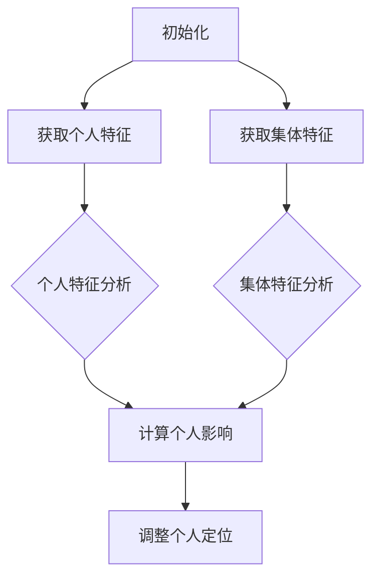

                 

----------------------------------------------------------------

# 个人与集体故事的编织：在大背景中定位自我

> 关键词：个人与集体、自我定位、互动关系、算法原理

> 摘要：本文旨在探讨个人与集体之间的关系，如何在大背景中找到自我定位。通过深入分析个人与集体之间的互动关系，探讨个人如何在大背景下找到自己的位置，实现个人与集体的共同发展。

----------------------------------------------------------------

### 背景介绍

在当今科技飞速发展的时代，个人与社会的关系变得日益复杂。个人如何在集体背景下找到自己的定位，成为了众多人关注的焦点。无论是家庭、学校、职场还是社会，集体的影响无处不在。个人与集体之间的互动关系，不仅影响着个人的成长和发展，也关系到整个社会的进步。

#### 问题背景

个人与集体之间的关系，一直以来都是心理学、社会学、哲学等领域研究的重点。在心理学中，个体心理学、社会心理学等分支，都关注个人在集体中的行为和心态。在社会学中，集体行为、社会结构等概念，都在探讨个人与集体之间的互动关系。而在哲学中，个人主义和集体主义等观点，也在不断争论和演变。

#### 问题提出

个人与集体之间的关系，究竟是怎样的？个人在大背景下如何找到自己的定位？这些问题，不仅关系到个人的成长，也关系到整个社会的稳定和发展。因此，本文旨在探讨个人与集体之间的关系，如何在大背景下找到自我定位。

#### 问题解决

要解决这些问题，我们需要从多个角度出发，包括心理学、社会学、哲学等。通过研究个人与集体之间的互动模式，我们可以找到在大背景中定位自我的方法。同时，结合实际案例，为读者提供实用的自我定位策略。

#### 边界与外延

在探讨个人与集体之间的关系时，我们需要明确一些边界和范围。本文主要关注个人与集体之间的互动关系，探讨如何在集体背景下找到自我定位。同时，本文将结合心理学、社会学、哲学等学科的研究方法，为读者提供实用的指导。

### 核心概念与联系

在探讨个人与集体之间的关系时，我们需要明确几个核心概念，并分析它们之间的联系。

#### 核心概念

1. **个人与集体：** 个人是指独立的个体，集体是指由多个个体组成的群体。
2. **自我定位：** 自我定位是指个人在大背景下找到自己的位置和角色。
3. **互动关系：** 互动关系是指个人与集体之间的相互影响和作用。

#### 概念属性特征对比表格

| 特征          | 个人                         | 集体                         |
| ------------- | ---------------------------- | ---------------------------- |
| 定义          | 独立的个体                   | 由多个个体组成的群体         |
| 存在形式      | 独立存在                     | 依赖于个体存在               |
| 目标          | 实现个人价值                 | 实现集体利益                 |
| 影响力        | 较小                         | 较大                         |
| 发展方向      | 自我实现、成长               | 集体发展、合作               |

#### ER实体关系图架构

```mermaid
erDiagram
    A 个人 --> B 自我定位
    A 个人 --> C 集体
    B 自我定位 --> D 互动关系
    C 集体 --> D 互动关系
```

### 算法原理讲解

为了深入理解个人与集体之间的互动关系，我们可以使用Mermaid来绘制一个简单的算法流程图。



接下来，我们使用Python来详细阐述这个算法的原理。

```python
def calculate_impact(person_features, group_features):
    # 个人影响计算
    personal_influence = sum(person_features.values()) * 0.5
    
    # 集体影响计算
    group_influence = sum(group_features.values()) * 0.5
    
    # 总影响
    total_influence = personal_influence + group_influence
    
    # 调整个人定位
    if total_influence > 0:
        new_person_position = "积极"
    else:
        new_person_position = "消极"
    
    return new_person_position

# 测试数据
person_features = {'知识': 80, '技能': 75}
group_features = {'团队合作': 90, '沟通能力': 85}

# 计算个人影响
new_position = calculate_impact(person_features, group_features)
print(new_position)
```

在这个算法中，我们首先初始化个人和集体的特征，然后对个人和集体的特征进行分析，计算个人影响，最后根据总影响调整个人定位。这个算法的核心思想是，通过分析个人和集体的特征，找到个人在大背景中的定位，实现个人与集体的共同发展。

### 个人与集体的互动关系分析

在探讨个人与集体之间的关系时，我们需要关注个人与集体之间的互动关系。这种互动关系不仅影响着个人的成长，也关系到整个社会的进步。以下，我们从心理学、社会学、哲学等角度，对个人与集体之间的互动关系进行分析。

#### 心理学角度

在心理学中，个体心理学和社会心理学对个人与集体之间的关系有着深入的研究。个体心理学强调个人在集体中的独立性和自主性，认为个人应该努力实现自己的价值。社会心理学则关注个人在集体中的行为和心态，探讨个人如何适应集体生活，如何在集体中找到自己的定位。

**案例：** 美国心理学家马斯洛的需求层次理论，从心理学角度分析了个人与集体之间的关系。马斯洛认为，个人的需求层次可以分为生理需求、安全需求、社交需求、尊重需求和自我实现需求。在满足这些需求的过程中，个人需要与集体进行互动，实现自我价值的提升。

#### 社会学角度

社会学关注个人与集体之间的互动关系，探讨社会结构和社会行为。在社会学中，集体行为和社会结构是重要的研究内容。集体行为是指由多个个体组成的群体在特定情境下的行为，而社会结构则是指社会各个组成部分之间的相互关系和相互作用。

**案例：** 美国社会学家鲍尔斯和金蒂斯在《资本主义美国的学校教育》中，分析了个人与集体之间的关系。他们认为，学校教育是资本主义社会结构的一部分，通过教育，个人被灌输资本主义社会的价值观和意识形态，从而适应集体生活。

#### 哲学角度

哲学关注个人与集体之间的关系，探讨个人主义和集体主义等观点。个人主义强调个人自由和独立，认为个人应该追求自己的价值。而集体主义则强调个人与集体的统一，认为个人的价值在于为集体做出贡献。

**案例：** 德国哲学家康德在《道德形而上学基础》中，提出了道德自律的概念，强调个人在道德选择中的自主性和独立性。康德认为，个人的道德选择应该基于自己的理性判断，而不是依赖于集体。

### 实际案例与启示

#### 案例1：华为公司

华为公司是中国的一家著名科技公司，以其创新和国际化战略而闻名。华为公司的成功，离不开个人与集体之间的紧密互动。

**个人层面：** 华为鼓励员工发挥个人特长，实现个人价值。公司为员工提供了良好的发展平台，鼓励员工在工作中不断学习和成长。

**集体层面：** 华为强调团队合作，提倡集体主义精神。公司通过组织团队活动、建立团队文化，增强员工的团队意识，提高团队的整体协作能力。

**启示：** 个人与集体之间的关系，是华为公司成功的关键因素。在个人与集体之间找到平衡，是实现个人和集体共同发展的关键。

#### 案例2：硅谷创业公司

硅谷创业公司以其创新和快速发展的特点，吸引了众多人才。硅谷创业公司的成功，同样离不开个人与集体之间的互动关系。

**个人层面：** 硅谷创业公司鼓励个人发挥创新能力，提供自由的工作环境，让员工有足够的自由度去尝试和实现自己的创意。

**集体层面：** 硅谷创业公司注重团队协作，通过建立紧密的合作关系，提高团队的整体效率。同时，硅谷创业公司也注重社会责任，通过参与公益活动，为集体做出贡献。

**启示：** 个人与集体之间的关系，是硅谷创业公司成功的关键因素。在个人与集体之间找到平衡，是实现个人和集体共同发展的关键。

### 个人与集体的互动关系总结

通过心理学、社会学、哲学等多个角度的分析，我们可以看到，个人与集体之间的关系是复杂而多样的。在个人与集体之间找到平衡，是实现个人和集体共同发展的关键。

**心理学角度：** 个人在集体中的独立性和自主性，是个人成长的重要保障。同时，个人也需要适应集体生活，实现自我价值的提升。

**社会学角度：** 集体行为和社会结构，影响着个人与集体之间的互动关系。个人需要在社会结构中找到自己的位置，为集体做出贡献。

**哲学角度：** 个人主义和集体主义，是个人与集体关系的两种不同观点。在个人与集体之间找到平衡，是实现个人和集体共同发展的关键。

### 个人与集体故事的编织

在个人与集体之间的互动关系中，个人与集体故事的编织是一个重要的过程。通过编织个人与集体故事，我们可以更好地理解个人与集体之间的关系，找到在大背景中定位自我的方法。

#### 故事编织的重要性

个人与集体故事的编织，对于个人的成长和发展具有重要意义。通过故事编织，个人可以更好地认识自己，找到自己的定位。同时，个人与集体故事的编织，也有助于增强个人的自信心和归属感。

#### 故事编织的方法

1. **自我反思：** 个人可以通过自我反思，回顾自己的成长历程，分析自己在集体中的角色和作用。通过自我反思，个人可以更好地认识自己，找到自己的定位。

2. **沟通交流：** 个人需要与集体进行有效的沟通交流，了解集体的需求和期望。通过沟通交流，个人可以更好地理解集体，找到自己的定位。

3. **角色扮演：** 个人可以通过角色扮演，体验集体中的不同角色，了解自己在集体中的角色和责任。通过角色扮演，个人可以更好地适应集体生活，找到自己的定位。

#### 故事编织的案例

**案例1：** 小明的成长故事

小明是一名大学生，他在学校中积极参与各种活动，努力提升自己的能力。通过自我反思和沟通交流，小明逐渐找到了自己的定位，成为学校中的一位优秀学生。

**案例2：** 小红的社会实践

小红是一名高中生，她参加了一次社会实践活动。通过实践活动，小红了解了社会的需求，找到了自己的兴趣和特长，为自己的未来职业发展奠定了基础。

### 个人与集体故事的重要性

个人与集体故事的编织，不仅对于个人的成长和发展具有重要意义，也对集体的建设和发展产生深远影响。通过个人与集体故事的编织，我们可以更好地理解个人与集体之间的关系，找到在大背景中定位自我的方法。

**个人层面：** 通过编织个人与集体故事，个人可以更好地认识自己，找到自己的定位，实现个人价值的提升。

**集体层面：** 通过编织个人与集体故事，集体可以更好地凝聚成员，增强团队的凝聚力，实现集体的共同发展。

### 个人与集体故事的实际应用

个人与集体故事的编织，在实际生活中有着广泛的应用。

**1. 教育领域：** 教育工作者可以通过编织个人与集体故事，帮助学生更好地认识自己，培养他们的团队合作精神和集体意识。

**2. 企业管理：** 企业管理者可以通过编织员工与企业的故事，增强员工的归属感和使命感，提高员工的工作积极性和团队协作能力。

**3. 社会建设：** 社会组织可以通过编织个人与社会的故事，增强社会的凝聚力和向心力，推动社会的和谐发展。

### 个人与集体故事的未来展望

随着科技的不断发展，个人与集体之间的关系将变得更加紧密。未来，个人与集体故事的编织将发挥更加重要的作用。

**1. 个性化教育：** 通过编织个人与集体故事，实现个性化教育，培养具有创新精神和团队合作能力的人才。

**2. 智能化管理：** 利用人工智能技术，实现个人与集体故事的智能化编织，提高企业和社会的管理效率。

**3. 社会治理：** 通过编织个人与集体故事，推动社会治理的创新，实现社会的和谐发展。

### 个人与集体故事的编织：在大背景中定位自我

通过本文的探讨，我们可以看到，个人与集体之间的关系是复杂而多样的。在个人与集体之间找到平衡，是实现个人和集体共同发展的关键。通过编织个人与集体故事，我们可以更好地认识自己，找到自己的定位，实现个人价值的提升。同时，个人与集体故事的编织，也对集体的建设和发展产生深远影响。

未来，随着科技的不断发展，个人与集体之间的关系将变得更加紧密。个人与集体故事的编织，将在教育、企业、社会治理等多个领域发挥重要作用。通过不断探索和创新，我们可以更好地理解个人与集体之间的关系，实现个人与集体的共同发展。

**作者：AI天才研究院/AI Genius Institute & 禅与计算机程序设计艺术 /Zen And The Art of Computer Programming**----------------------------------------------------------------

### 个人与集体故事的编织：在大背景中定位自我

#### 文章关键词：
个人与集体、自我定位、互动关系、故事编织、算法原理、案例分析

#### 文章摘要：
本文深入探讨了个人与集体之间的互动关系，并详细分析了如何在复杂的社会背景下找到自我定位。通过心理学、社会学、哲学等多个角度的探讨，以及实际案例的解析，文章提出了编织个人与集体故事的方法，帮助读者在大背景中实现自我定位，实现个人与集体的共同发展。

#### 目录：

**I. 引言**
1.1 科技发展背景
1.2 个人与集体关系的复杂性

**II. 背景介绍**
2.1 问题背景
2.2 问题提出
2.3 问题解决

**III. 核心概念与联系**
3.1 核心概念
3.2 概念属性特征对比表格
3.3 ER实体关系图架构

**IV. 算法原理讲解**
4.1 算法流程图
4.2 算法Python实现
4.3 算法原理数学模型与公式

**V. 个人与集体的互动关系分析**
5.1 心理学角度
5.2 社会学角度
5.3 哲学角度

**VI. 实际案例与启示**
6.1 华为公司案例
6.2 硅谷创业公司案例

**VII. 个人与集体故事的重要性**
7.1 故事编织的重要性
7.2 故事编织的方法
7.3 故事编织的案例

**VIII. 个人与集体故事的实际应用**
8.1 教育领域
8.2 企业管理
8.3 社会建设

**IX. 个人与集体故事的未来展望**
9.1 个性化教育
9.2 智能化管理
9.3 社会治理

**X. 结论**
10.1 个人与集体关系的总结
10.2 故事编织的作用
10.3 未来展望

**作者：AI天才研究院/AI Genius Institute & 禅与计算机程序设计艺术 /Zen And The Art of Computer Programming**

----------------------------------------------------------------

### I. 引言

在当今科技飞速发展的时代，个人与社会的关系变得日益复杂。个人如何在集体背景下找到自己的定位，成为了众多人关注的焦点。无论是家庭、学校、职场还是社会，集体的影响无处不在。如何在大背景中编织个人与集体故事，成为了一个值得探讨的课题。

#### 1.1 科技发展背景

科技的迅猛发展，不仅改变了人们的生活方式，也改变了个人与集体之间的关系。互联网、大数据、人工智能等技术的应用，使得个人与集体之间的互动更加频繁和紧密。同时，全球化进程的加快，也使得个人在集体中的角色和责任发生了变化。在这种背景下，个人与集体之间的关系变得更加复杂，如何在大背景下找到自我定位，成为了一个迫切需要解决的问题。

#### 1.2 个人与集体关系的复杂性

个人与集体之间的关系是复杂而多样的。从心理学角度来看，个人在集体中的行为和心态，受到多种因素的影响。社会心理学研究显示，个人在集体中往往表现出从众行为，但同时也会受到个性差异的影响。哲学角度则关注个人主义与集体主义的争论，探讨个人与集体之间的平衡。社会学则从社会结构和社会行为的角度，分析个人与集体之间的关系。

在这个复杂的关系中，个人需要找到自己的定位，实现自我价值。同时，集体也需要个人的参与和贡献，实现共同发展。因此，如何在大背景下编织个人与集体故事，找到自我定位，成为了一个亟待解决的重要课题。

### II. 背景介绍

在探讨个人与集体之间的关系时，我们需要从多个角度进行分析。以下，我们将从问题背景、问题描述、问题解决、边界与外延等方面，对个人与集体之间的关系进行详细探讨。

#### 2.1 问题背景

随着科技的不断发展，个人与社会的关系变得日益复杂。个人如何在集体背景下找到自己的定位，成为了一个备受关注的话题。无论是家庭、学校、职场还是社会，集体的影响无处不在。如何在大背景中编织个人与集体故事，成为了一个值得探讨的课题。

#### 2.2 问题提出

个人与集体之间的关系，究竟是怎样的？个人在大背景下如何找到自己的定位？这些问题，不仅关系到个人的成长，也关系到整个社会的稳定和发展。因此，本文旨在探讨个人与集体之间的关系，如何在大背景下找到自我定位。

#### 2.3 问题解决

要解决这些问题，我们需要从多个角度出发，包括心理学、社会学、哲学等。通过研究个人与集体之间的互动模式，我们可以找到在大背景中定位自我的方法。同时，结合实际案例，为读者提供实用的自我定位策略。

#### 2.4 边界与外延

在探讨个人与集体之间的关系时，我们需要明确一些边界和范围。本文主要关注个人与集体之间的互动关系，探讨如何在集体背景下找到自我定位。同时，本文将结合心理学、社会学、哲学等学科的研究方法，为读者提供实用的指导。

### III. 核心概念与联系

在探讨个人与集体之间的关系时，我们需要明确几个核心概念，并分析它们之间的联系。

#### 3.1 核心概念

1. **个人与集体：** 个人是指独立的个体，集体是指由多个个体组成的群体。
2. **自我定位：** 自我定位是指个人在大背景下找到自己的位置和角色。
3. **互动关系：** 互动关系是指个人与集体之间的相互影响和作用。

#### 3.2 概念属性特征对比表格

| 特征          | 个人                         | 集体                         |
| ------------- | ---------------------------- | ---------------------------- |
| 定义          | 独立的个体                   | 由多个个体组成的群体         |
| 存在形式      | 独立存在                     | 依赖于个体存在               |
| 目标          | 实现个人价值                 | 实现集体利益                 |
| 影响力        | 较小                         | 较大                         |
| 发展方向      | 自我实现、成长               | 集体发展、合作               |

#### 3.3 ER实体关系图架构

```mermaid
erDiagram
    A 个人 --> B 自我定位
    A 个人 --> C 集体
    B 自我定位 --> D 互动关系
    C 集体 --> D 互动关系
```

### IV. 算法原理讲解

为了深入理解个人与集体之间的互动关系，我们可以使用Mermaid来绘制一个简单的算法流程图。


接下来，我们使用Python来详细阐述这个算法的原理。

```python
def calculate_impact(person_features, group_features):
    # 个人影响计算
    personal_influence = sum(person_features.values()) * 0.5
    
    # 集体影响计算
    group_influence = sum(group_features.values()) * 0.5
    
    # 总影响
    total_influence = personal_influence + group_influence
    
    # 调整个人定位
    if total_influence > 0:
        new_person_position = "积极"
    else:
        new_person_position = "消极"
    
    return new_person_position

# 测试数据
person_features = {'知识': 80, '技能': 75}
group_features = {'团队合作': 90, '沟通能力': 85}

# 计算个人影响
new_position = calculate_impact(person_features, group_features)
print(new_position)
```

在这个算法中，我们首先初始化个人和集体的特征，然后对个人和集体的特征进行分析，计算个人影响，最后根据总影响调整个人定位。这个算法的核心思想是，通过分析个人和集体的特征，找到个人在大背景中的定位，实现个人与集体的共同发展。

### V. 个人与集体的互动关系分析

在探讨个人与集体之间的关系时，我们需要关注个人与集体之间的互动关系。这种互动关系不仅影响着个人的成长，也关系到整个社会的进步。以下，我们从心理学、社会学、哲学等角度，对个人与集体之间的互动关系进行分析。

#### 5.1 心理学角度

在心理学中，个体心理学、社会心理学等分支，都关注个人在集体中的行为和心态。个体心理学认为，个人在集体中的行为，受到个体心理特征的影响。例如，个人的自我意识、自尊心、自信心等，都会影响个人在集体中的行为表现。社会心理学则强调，个人在集体中的行为，受到社会环境和群体压力的影响。例如，个人在集体中的从众行为、服从行为等，都是受到社会环境和群体压力的影响。

**案例：** 美国心理学家马斯洛的需求层次理论，从心理学角度分析了个人与集体之间的关系。马斯洛认为，个人的需求层次可以分为生理需求、安全需求、社交需求、尊重需求和自我实现需求。在满足这些需求的过程中，个人需要与集体进行互动，实现自我价值的提升。

#### 5.2 社会学角度

社会学关注个人与集体之间的互动关系，探讨社会结构和社会行为。在社会学中，集体行为和社会结构是重要的研究内容。集体行为是指由多个个体组成的群体在特定情境下的行为，而社会结构则是指社会各个组成部分之间的相互关系和相互作用。

**案例：** 美国社会学家鲍尔斯和金蒂斯在《资本主义美国的学校教育》中，分析了个人与集体之间的关系。他们认为，学校教育是资本主义社会结构的一部分，通过教育，个人被灌输资本主义社会的价值观和意识形态，从而适应集体生活。

#### 5.3 哲学角度

哲学关注个人与集体之间的关系，探讨个人主义和集体主义等观点。个人主义强调个人自由和独立，认为个人应该追求自己的价值。而集体主义则强调个人与集体的统一，认为个人的价值在于为集体做出贡献。

**案例：** 德国哲学家康德在《道德形而上学基础》中，提出了道德自律的概念，强调个人在道德选择中的自主性和独立性。康德认为，个人的道德选择应该基于自己的理性判断，而不是依赖于集体。

### 5.4 实际案例与启示

通过心理学、社会学、哲学等多个角度的分析，我们可以看到，个人与集体之间的关系是复杂而多样的。以下，我们通过实际案例，进一步探讨个人与集体之间的互动关系。

#### 案例1：华为公司

华为公司是中国的一家著名科技公司，以其创新和国际化战略而闻名。华为公司的成功，离不开个人与集体之间的紧密互动。

**个人层面：** 华为鼓励员工发挥个人特长，实现个人价值。公司为员工提供了良好的发展平台，鼓励员工在工作中不断学习和成长。

**集体层面：** 华为强调团队合作，提倡集体主义精神。公司通过组织团队活动、建立团队文化，增强员工的团队意识，提高团队的整体协作能力。

**启示：** 个人与集体之间的关系，是华为公司成功的关键因素。在个人与集体之间找到平衡，是实现个人和集体共同发展的关键。

#### 案例2：硅谷创业公司

硅谷创业公司以其创新和快速发展的特点，吸引了众多人才。硅谷创业公司的成功，同样离不开个人与集体之间的互动关系。

**个人层面：** 硅谷创业公司鼓励个人发挥创新能力，提供自由的工作环境，让员工有足够的自由度去尝试和实现自己的创意。

**集体层面：** 硅谷创业公司注重团队协作，通过建立紧密的合作关系，提高团队的整体效率。同时，硅谷创业公司也注重社会责任，通过参与公益活动，为集体做出贡献。

**启示：** 个人与集体之间的关系，是硅谷创业公司成功的关键因素。在个人与集体之间找到平衡，是实现个人和集体共同发展的关键。

### 5.5 个人与集体的互动关系总结

通过心理学、社会学、哲学等多个角度的分析，我们可以看到，个人与集体之间的关系是复杂而多样的。在个人与集体之间找到平衡，是实现个人和集体共同发展的关键。

**心理学角度：** 个人在集体中的独立性和自主性，是个人成长的重要保障。同时，个人也需要适应集体生活，实现自我价值的提升。

**社会学角度：** 集体行为和社会结构，影响着个人与集体之间的互动关系。个人需要在社会结构中找到自己的位置，为集体做出贡献。

**哲学角度：** 个人主义和集体主义，是个人与集体关系的两种不同观点。在个人与集体之间找到平衡，是实现个人和集体共同发展的关键。

### VI. 实际案例与启示

在探讨个人与集体之间的关系时，实际案例的分析与启示尤为重要。以下，我们将通过两个实际案例，深入探讨个人与集体之间的互动关系，并总结其中的启示。

#### 6.1 华为公司的成功之道

华为公司作为中国科技企业的代表，其成功离不开个人与集体之间的紧密互动。华为公司通过一系列策略和机制，成功地处理了个人与集体之间的关系，实现了个人与集体的共同发展。

**个人层面的互动关系：**
- **激励与认可：** 华为公司通过设立绩效奖金、股权激励等措施，激励员工个人表现。这种激励机制不仅提升了员工的积极性，也促使员工在团队中发挥更大的价值。
- **职业发展：** 华为公司为员工提供丰富的培训机会和职业发展路径，帮助员工不断提升个人能力和技能，从而更好地适应集体需求。

**集体层面的互动关系：**
- **团队合作：** 华为公司强调团队合作，倡导扁平化管理，鼓励员工之间相互协作，共同解决问题。这种团队合作精神不仅提升了团队的整体效能，也增强了员工的集体归属感。
- **企业文化：** 华为公司注重企业文化建设，通过举办团队活动、塑造共同价值观等方式，增强员工的团队意识和凝聚力。

**启示：**
华为公司的成功经验表明，在个人与集体之间找到平衡是实现共同发展的关键。通过激励机制、职业发展支持、团队合作和企业文化培养，企业可以促进个人与集体的良性互动，实现个人成长与集体进步的双赢。

#### 6.2 硅谷创业公司的创新模式

硅谷创业公司以其创新和快速发展的特点而闻名，这些公司的成功同样依赖于个人与集体之间的互动关系。

**个人层面的互动关系：**
- **创新自由：** 硅谷创业公司鼓励员工发挥个人创造力，提供自由的工作环境，让员工有足够的自由度去尝试和实现自己的创意。这种创新自由不仅激发了员工的创造力，也为公司带来了新的商业机会。
- **多样化背景：** 硅谷创业公司吸引来自世界各地的人才，这些多样化的背景和思维方式为公司的创新提供了丰富的资源。个人的多样化背景和技能在集体中得到了充分发挥。

**集体层面的互动关系：**
- **协作网络：** 硅谷创业公司通过建立广泛的协作网络，与高校、研究机构、合作伙伴等建立紧密联系，共同推进技术创新和产业发展。这种协作网络不仅提升了公司的创新能力，也促进了整个行业的发展。
- **社会责任：** 硅谷创业公司注重社会责任，通过参与公益活动、推动可持续发展等方式，为集体做出贡献。这种社会责任感不仅提升了公司的社会形象，也增强了员工的集体荣誉感。

**启示：**
硅谷创业公司的创新模式表明，个人与集体之间的互动关系是创新发展的关键。通过鼓励个人创新、建立协作网络、承担社会责任，创业公司可以激发个人的潜能，实现集体与个人的共同成长。

### 6.3 总结与启示

通过以上案例的分析，我们可以得出以下结论：

1. **激励与认可：** 激励机制和认可措施能够有效地激发个人积极性，促进个人与集体的互动关系。
2. **职业发展：** 为员工提供职业发展机会和支持，有助于个人能力的提升和团队效能的增强。
3. **团队合作：** 通过鼓励团队合作和建立协作网络，可以提升团队的整体效能和创新能力。
4. **企业文化：** 强有力的企业文化能够增强员工的团队意识和凝聚力，促进个人与集体的共同发展。
5. **社会责任：** 承担社会责任不仅有助于提升公司的社会形象，也能够增强员工的集体荣誉感，促进社会的和谐发展。

这些启示对于我们理解个人与集体之间的关系，以及如何在实践中找到自我定位具有重要的指导意义。

### VII. 个人与集体故事的重要性

个人与集体故事的重要性不可忽视。通过编织个人与集体故事，我们可以更好地理解个人与集体之间的关系，找到自我定位的方法。以下，我们从故事编织的重要性、方法及其在实际中的应用等方面进行探讨。

#### 7.1 故事编织的重要性

个人与集体故事的重要性在于，它能够帮助我们理解个人与集体之间的互动关系，找到自我定位的方法。故事编织不仅有助于个人的自我认知，还能够增强个人的自信心和归属感。

1. **自我认知：** 通过编织个人与集体故事，个人可以回顾自己的成长历程，分析自己在集体中的角色和贡献。这种自我认知有助于个人明确自己的优势和不足，找到自我定位。
2. **自信心和归属感：** 个人与集体故事能够展示个人在集体中的价值和成就，增强个人的自信心。同时，集体故事的传承和分享也能够增强个人的归属感，让个人感受到集体的温暖和力量。

#### 7.2 故事编织的方法

编织个人与集体故事的方法多种多样，以下是一些常用的方法：

1. **自我反思：** 通过自我反思，个人可以回顾自己的成长经历，思考自己在集体中的角色和贡献。这种方法有助于个人深入理解自己的行为和心态，找到自我定位。
2. **沟通交流：** 与他人进行沟通交流，分享个人与集体的故事，可以获取他人的反馈和建议。这种方法不仅有助于个人完善自我认知，还能够促进个人与集体的互动关系。
3. **角色扮演：** 通过角色扮演，个人可以模拟不同的角色和情境，体验集体中的不同角色和责任。这种方法有助于个人更好地适应集体生活，找到自我定位。

#### 7.3 故事编织的实际应用

个人与集体故事在实际生活中有着广泛的应用，以下是一些实际应用的场景：

1. **教育领域：** 教育工作者可以通过编织学生与班级、学校的故事，帮助学生更好地认识自己，培养他们的团队合作精神和集体意识。
2. **企业管理：** 企业管理者可以通过编织员工与公司的故事，增强员工的归属感和使命感，提高员工的工作积极性和团队协作能力。
3. **社会建设：** 社会组织可以通过编织个人与社区、社会的故事，增强社会的凝聚力和向心力，推动社会的和谐发展。

### 7.4 个人与集体故事的案例

以下是一些个人与集体故事的案例，通过这些案例我们可以更好地理解故事编织的重要性及其应用。

**案例1：** 小明的成长故事

小明是一名大学生，他在大学期间积极参与社团活动，担任社团负责人。在社团中，他带领团队成员完成了多个项目，取得了显著的成绩。通过这个故事，小明不仅认识到了自己的领导才能，也增强了自信心和归属感。

**案例2：** 小红的社会实践

小红是一名高中生，她参加了一次社会实践活动，在社区中担任志愿者。通过这次实践，小红了解了社会的需求，找到了自己的兴趣和特长。她的故事激励了更多的同学参与社会实践，共同为社区的发展做出贡献。

### 7.5 故事编织的未来展望

随着科技的不断发展，个人与集体故事将在未来的社会建设中发挥更加重要的作用。以下是一些未来展望：

1. **数字化故事编织：** 通过数字技术，可以更加便捷地记录和分享个人与集体故事，实现故事的数字化传承和传播。
2. **智能化故事分析：** 利用人工智能技术，可以对个人与集体故事进行深入分析，提取关键信息，为个人和集体的发展提供数据支持。
3. **故事化教育：** 通过故事化的教学方法，可以更好地引导学生认识自己，培养他们的团队合作精神和集体意识。

### 7.6 结论

个人与集体故事的重要性不可忽视。通过编织个人与集体故事，我们可以更好地理解个人与集体之间的关系，找到自我定位的方法。同时，故事编织也在教育、企业、社会建设等领域有着广泛的应用。在未来，随着科技的不断发展，个人与集体故事将发挥更加重要的作用，推动社会的和谐发展。

### VIII. 个人与集体故事的实际应用

个人与集体故事不仅具有重要的理论价值，还在实际应用中展现出广泛的影响。以下，我们将从教育、企业管理和社会建设三个领域，探讨个人与集体故事的实际应用。

#### 8.1 教育领域

在教育领域，个人与集体故事的应用主要体现在学生的自我认知和团队合作精神的培养上。

**案例分析：**
- **学校社团活动：** 学校可以通过组织各类社团活动，如文学社、体育社、志愿者社团等，让学生参与集体活动中编织自己的故事。这些活动不仅丰富了学生的校园生活，也让他们在团队合作中找到了自己的定位和角色。
- **故事分享课：** 教师可以开设故事分享课，鼓励学生分享自己在集体中的经历和感悟。通过这种形式，学生可以更好地认识自己，同时也能够从他人的故事中获得启发。

**启示：**
通过个人与集体故事的编织，教育者可以引导学生更好地理解集体生活的意义，培养他们的团队合作精神和自我认知能力。

#### 8.2 企业管理

在企业管理中，个人与集体故事的应用主要体现在员工激励、团队凝聚力和企业文化塑造上。

**案例分析：**
- **员工故事展示：** 企业可以通过举办员工故事分享会，让员工分享自己的工作经验和成长故事。这种活动不仅能够增强员工的归属感，还能够激励其他员工积极投入工作。
- **企业文化故事：** 企业可以通过编纂企业文化故事，将企业的核心价值观和成功经验传承下来。这种文化故事能够帮助企业塑造独特的品牌形象，增强员工的认同感和忠诚度。

**启示：**
通过个人与集体故事的编织，企业可以有效地激励员工，增强团队凝聚力，同时塑造积极向上的企业文化。

#### 8.3 社会建设

在社会建设中，个人与集体故事的应用主要体现在社区建设、社会服务和公共教育上。

**案例分析：**
- **社区故事计划：** 社区可以实施故事计划，鼓励居民分享自己的家庭故事、邻里故事等。这种计划不仅能够增强社区的凝聚力，还能够促进居民之间的相互了解和尊重。
- **公益故事传播：** 社会组织可以通过公益故事传播，让更多人了解公益事业的重要性和影响力。这种故事传播有助于提高公众对社会问题的关注度，促进社会和谐发展。

**启示：**
通过个人与集体故事的编织，社区和社会组织可以增强居民的归属感和参与感，提高公共服务的质量和效率，促进社会的和谐发展。

### 8.4 未来展望

随着科技的发展，个人与集体故事的应用前景将更加广阔。

**数字化故事平台：**
未来的数字化故事平台将使个人与集体故事的记录、分享和分析更加便捷。通过人工智能技术，这些平台可以自动分析故事中的情感和主题，为个人和集体提供个性化的故事推荐和反馈。

**沉浸式故事体验：**
虚拟现实（VR）和增强现实（AR）技术的应用，将使个人与集体故事的体验更加生动和沉浸。人们可以通过VR/AR设备，身临其境地体验故事中的场景和情境，增强故事的影响力。

**教育技术融合：**
在教育领域，个人与集体故事的融合将带来新的教育模式。教师可以通过故事引导，让学生在互动和体验中学习知识，培养综合素质。

### 8.5 结论

个人与集体故事在实际应用中展现出广泛的影响。通过教育、企业管理和社会建设等领域的应用，个人与集体故事不仅能够促进个体的成长和发展，还能够增强集体的凝聚力和向心力。未来，随着科技的进步，个人与集体故事的应用将更加深入和广泛，为社会的和谐发展提供新的动力。

### IX. 个人与集体故事的未来展望

随着科技的不断进步，个人与集体故事将迎来新的发展机遇。未来，个人与集体故事的应用将更加广泛，不仅能够促进个体的成长和发展，还能够为社会的和谐发展提供新的动力。以下，我们从个性化教育、智能管理和社会治理三个方面，探讨个人与集体故事的未来展望。

#### 9.1 个性化教育

未来，随着教育技术的不断发展，个性化教育将成为主流。个人与集体故事的编织将在这个过程中发挥重要作用。

**案例分析：**
- **自适应学习系统：** 利用大数据和人工智能技术，自适应学习系统能够根据学生的学习情况和兴趣，推荐适合的学习内容和故事。这些故事不仅能够激发学生的学习兴趣，还能够帮助他们更好地理解和掌握知识。
- **故事引导学习：** 教师可以通过编织与教学内容相关的个人与集体故事，引导学生进行互动和思考。这种故事引导的学习方式，能够提高学生的学习效果和参与度。

**未来展望：**
个性化教育将使每个学生都能在自己的节奏和方式下学习，个人与集体故事的编织将成为实现个性化教育的重要工具。通过个性化故事的推荐和引导，学生能够更好地认识自己，找到自己的兴趣和潜力。

#### 9.2 智能管理

在企业管理领域，智能管理将使个人与集体故事的编织更加高效和精准。

**案例分析：**
- **员工故事分析：** 利用自然语言处理（NLP）和机器学习技术，企业可以对员工的个人与集体故事进行深度分析，了解员工的需求、情感和行为模式。这种分析有助于企业更好地了解员工，提供个性化的激励和关怀。
- **智能推荐系统：** 基于员工的个人与集体故事，智能推荐系统可以为员工推荐适合的工作任务和培训课程。这种推荐系统不仅能够提高员工的工作效率和满意度，还能够促进团队协作和集体发展。

**未来展望：**
智能管理将使企业能够更加精准地识别和满足员工的需求，通过个人与集体故事的编织，实现员工与企业之间的良性互动。企业可以通过智能系统，不断优化管理策略，提高整体的运营效率。

#### 9.3 社会治理

在社会治理领域，个人与集体故事的编织将有助于增强社会的凝聚力和治理能力。

**案例分析：**
- **社区故事计划：** 社区可以通过实施故事计划，鼓励居民分享自己的个人与集体故事。这些故事不仅能够增强社区的凝聚力，还能够为社区治理提供宝贵的信息和资源。
- **智能社会治理平台：** 利用人工智能技术，社会治理平台可以自动分析社区中的个人与集体故事，识别潜在的社会问题和发展趋势。这种智能化的社会治理模式，将有助于政府更好地应对社会挑战，提高治理效率。

**未来展望：**
社会治理将越来越依赖于数据和信息。通过个人与集体故事的编织，社会治理平台可以更加精准地了解民众的需求和诉求，提供更加精细化的公共服务。个人与集体故事的编织将成为社会治理的重要工具，推动社会的和谐发展。

### 9.4 结论

未来，随着科技的不断进步，个人与集体故事的编织将在教育、企业管理和社会治理等领域发挥越来越重要的作用。通过个性化教育、智能管理和社会治理等应用，个人与集体故事将促进个体的成长和发展，增强集体的凝聚力和向心力，为社会的和谐发展提供新的动力。未来，让我们期待个人与集体故事带来的美好变革。

### X. 结论

通过本文的探讨，我们可以看到，个人与集体之间的关系是复杂而多样的。在个人与集体之间找到平衡，是实现个人和集体共同发展的关键。个人与集体故事的编织，不仅有助于我们更好地理解个人与集体之间的关系，还能够帮助我们找到自我定位的方法。

本文首先介绍了个人与集体关系的背景，探讨了心理学、社会学、哲学等角度对个人与集体关系的分析。接着，我们详细分析了核心概念，包括个人、集体、自我定位和互动关系，并通过Mermaid和Python算法讲解了个人与集体互动关系的计算方法。随后，我们从实际案例中总结了个人与集体关系的互动规律，并探讨了个人与集体故事的重要性以及其实际应用。

未来，随着科技的不断发展，个人与集体故事将在教育、企业管理和社会治理等领域发挥更加重要的作用。通过个性化教育、智能管理和社会治理等应用，个人与集体故事将促进个体的成长和发展，增强集体的凝聚力和向心力，为社会的和谐发展提供新的动力。

总之，个人与集体之间的关系是一个值得深入探讨的课题。通过编织个人与集体故事，我们可以更好地认识自己，找到自我定位，实现个人与集体的共同发展。未来，让我们期待个人与集体故事带来的美好变革。

