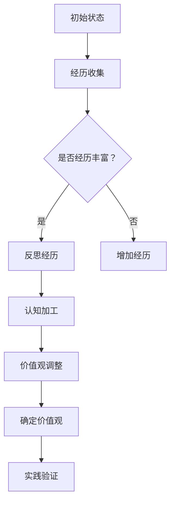
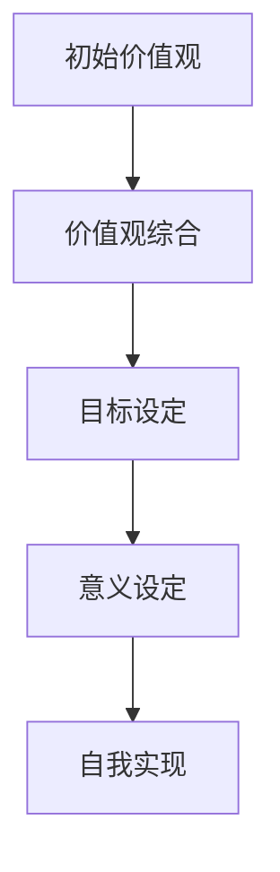
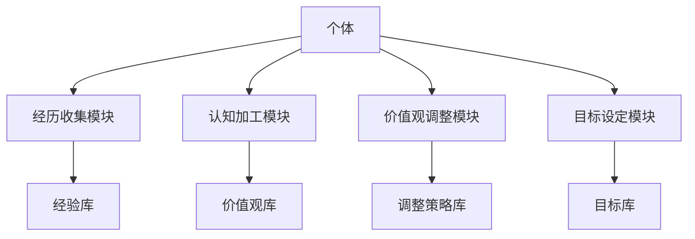
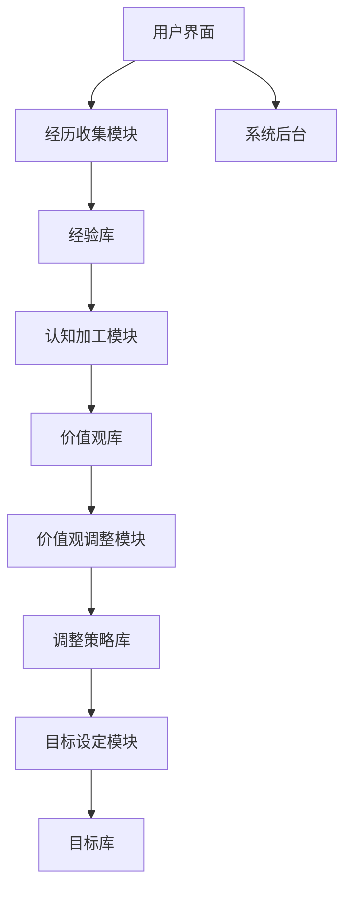

                 

# 个人价值观的构建：形成独特的人生哲学

## 关键词
- 个人价值观
- 人生哲学
- 建构主义
- 心理学
- 社会学

## 摘要
本文旨在探讨个人价值观的构建过程，从心理学和社会学角度分析个体如何通过内在思维模式和外在社会互动来形成独特的人生哲学。文章首先定义了个人价值观和人生哲学的核心概念，然后通过算法和数学模型解释了价值观的构建过程，最后结合项目实战和最佳实践，提供了构建个人价值观的有效策略。

## Step 1: 引言

### 1.1 问题的背景
在快速变化的现代社会中，个人价值观的建构显得尤为重要。随着全球化、技术进步和社会变迁，个体面临的选择和挑战日益增多，而如何在这些复杂的环境中找到自己的定位和方向，成为一个亟待解决的问题。

### 1.2 问题的描述
个人价值观是个体对什么是有价值和重要的信念和判断。然而，由于每个人的成长环境、教育背景和个人经历不同，每个人对价值的理解也会有所不同。如何形成一套独特且符合自己内在需求和个人成长的人生哲学，是每个人都可能面临的挑战。

### 1.3 问题解决
本文将通过心理学和社会学的视角，结合建构主义的理念，探讨个人价值观的构建过程。通过算法和数学模型，提供一套系统的构建方法，并结合实际项目经验和最佳实践，帮助读者构建自己的个人价值观。

### 1.4 边界与外延
本文的核心主题是个人价值观的构建，但它的外延涵盖了个体心理发展、社会互动、文化认知等多个领域。因此，本文的讨论将不仅仅局限于理论，还会涉及到实际操作和应用。

### 1.5 概念结构与核心要素组成
个人价值观和人生哲学是两个紧密相连的核心概念。个人价值观决定了个体如何看待世界和他人，而人生哲学则是个体根据个人价值观制定的行为准则和生活目标。本文将深入分析这两个概念，并探讨它们之间的内在联系。

## Step 2: 核心概念与联系

### 2.1 个人价值观的概念
个人价值观是指个体在长期生活过程中形成的一套关于价值判断和优先级的信念体系。它不仅影响个体的行为和决策，还塑造了个体的世界观和人生观。

#### 2.1.1 个人价值观的定义
个人价值观是一种内在的心理结构，它包括了对各种价值观念的排序和选择。这些价值观念可以是伦理的、美学的、社会的或个人的。

#### 2.1.2 个人价值观的特点
- 主观性：每个人的价值观都是独特的，反映了他们的个人经历和认知。
- 动态性：个人的价值观可能随着时间和经历的变化而变化。
- 导向性：个人价值观影响着个体的行为和决策，是其行动的指导原则。

#### 2.1.3 个人价值观的重要性
个人价值观不仅决定了个体如何看待自己和他人，还影响了个体的生活质量和幸福感。一个清晰和积极的价值观体系可以帮助个体在面对挑战时保持坚定和自信。

### 2.2 人生哲学的概念
人生哲学是个体对生命意义、人生目标和存在方式的总体思考和反思。它是个体价值观的扩展和深化，是指导个体行为和决策的更高层次的理念体系。

#### 2.2.1 人生哲学的定义
人生哲学是一种关于生命和存在的系统化思考和信念，它包括了对个体存在意义、人生目标和道德准则的探讨。

#### 2.2.2 人生哲学的特点
- 系统性：人生哲学是对个体价值观和生活的系统性反思，不是零散的观点。
- 指导性：人生哲学为个体提供了一套行为和决策的指导原则。
- 深远性：人生哲学涉及到个体对生命终极问题的思考，具有深远的影响。

#### 2.2.3 人生哲学的作用
人生哲学帮助个体在面对复杂和不确定的环境中找到方向和意义，是推动个体自我实现和成长的重要力量。

### 2.3 个人价值观与人生哲学的联系
个人价值观和人生哲学是相互联系和互动的。个人价值观是个体价值观的基础，而人生哲学则是个体根据这些价值观对人生意义的深入思考和总结。个人价值观决定了个体的人生哲学，而人生哲学又反过来影响和指导个人价值观。

#### 2.3.1 二者之间的关系
个人价值观和人生哲学之间的关系可以看作是基础和上层建筑的关系。个人价值观是个体对价值的认知和选择，而人生哲学则是对这些价值观的综合和升华。

#### 2.3.2 二者之间的互动作用
个人价值观和人生哲学相互影响。个人的价值观体系会随着人生哲学的深入思考和修正而调整，而人生哲学的构建也需要基于个人的价值观基础。

#### 2.3.3 二者的区别与联系
尽管个人价值观和人生哲学密切相关，但它们在概念上有所区别。个人价值观更侧重于个体对价值的认知和选择，而人生哲学则是对这些价值观的更高层次的思考和总结。

## Step 3: 算法原理讲解

### 3.1 个人价值观构建算法

#### 3.1.1 算法原理
个人价值观的构建是一个复杂的过程，涉及到个体的内在思维模式、外在社会互动以及文化背景。本文提出的构建算法基于以下几个核心原理：

1. **个体经历的重要性**：个人的成长经历是价值观形成的基础。
2. **心理认知的加工**：个体通过思考和反思来加工和调整其价值观。
3. **社会互动的影响**：社会环境和人际关系对个人价值观的塑造有重要影响。
4. **自我意识的提升**：个体需要通过自我反思和自我提升来确立和强化其价值观。

#### 3.1.2 算法流程图


#### 3.1.3 算法实现
```python
class PersonalValuesBuilder:
    def __init__(self):
        self.experiences = []
        self.values = []

    def collect_experiences(self, new_experience):
        self.experiences.append(new_experience)

    def reflect_on_experiences(self):
        for experience in self.experiences:
            self.values = self.process_experience(experience)

    def process_experience(self, experience):
        # 根据经历进行认知加工和价值观调整
        processed_values = ...
        return processed_values

    def establish_values(self):
        self.reflect_on_experiences()
        self.values = self.finalize_values()

    def finalize_values(self):
        # 确定最终的价值观
        final_values = ...
        return final_values

    def verify_values(self):
        # 通过实践验证价值观的有效性
        ...
```

### 3.2 人生哲学构建算法

#### 3.2.1 算法原理
人生哲学的构建是基于个人价值观的更高层次的思考和总结。算法的核心原理包括：

1. **价值观的综合**：将个人的价值观进行综合和系统化。
2. **目标和意义的设定**：根据价值观设定个体的目标和人生意义。
3. **自我实现的追求**：通过实践和自我提升来实现个人的价值观和目标。

#### 3.2.2 算法流程图


#### 3.2.3 算法实现
```python
class LifePhilosophyBuilder:
    def __init__(self, values):
        self.values = values

    def integrate_values(self):
        # 综合和系统化价值观
        integrated_values = ...
        return integrated_values

    def set_goals(self):
        # 根据价值观设定目标
        goals = ...
        return goals

    def define_meaning(self):
        # 设定人生意义
        meaning = ...
        return meaning

    def pursue_self_realization(self):
        # 通过实践和自我提升实现价值观和目标
        ...
```

## Step 4: 数学模型和详细解释

### 4.1 个人价值观构建的数学模型

#### 4.1.1 模型介绍
个人价值观构建的数学模型旨在量化个人经历对价值观的影响，并分析个体如何通过认知加工来调整和确立其价值观。

#### 4.1.2 模型公式
假设个人经历集合为 \(E = \{e_1, e_2, ..., e_n\}\)，每个经历都有对应的权重 \(w_i\)，个体的认知加工函数为 \(f(x)\)，最终的价值观集合为 \(V = \{v_1, v_2, ..., v_m\}\)。

$$
V = \{v_1, v_2, ..., v_m\} = \{f(w_1 \cdot e_1), f(w_2 \cdot e_2), ..., f(w_n \cdot e_n)\}
$$

#### 4.1.3 模型解释
- \(E\)：个人经历集合，包含了所有对个体价值观有影响的经历。
- \(w_i\)：经历 \(e_i\) 的权重，反映了个体对每个经历的重视程度。
- \(f(x)\)：认知加工函数，用于处理每个经历对价值观的影响。
- \(V\)：最终的价值观集合，是通过对每个经历进行权重调整和认知加工后的结果。

### 4.2 人生哲学构建的数学模型

#### 4.2.1 模型介绍
人生哲学构建的数学模型关注的是如何通过个人价值观来确定人生目标和意义。

#### 4.2.2 模型公式
假设个人价值观集合为 \(V = \{v_1, v_2, ..., v_n\}\)，个体的目标集合为 \(G = \{g_1, g_2, ..., g_m\}\)，人生意义集合为 \(M = \{m_1, m_2, ..., m_k\}\)。

$$
G = \{g_1, g_2, ..., g_m\} = \{v_1 \cdot v_2, v_2 \cdot v_3, ..., v_n \cdot v_1\}
$$

$$
M = \{m_1, m_2, ..., m_k\} = \{g_1 + g_2 + ... + g_m\}
$$

#### 4.2.3 模型解释
- \(V\)：个人价值观集合，决定了个体对目标和意义的设定。
- \(G\)：目标集合，是通过两个价值观的乘积来设定的，反映了价值观之间的相互作用。
- \(M\)：人生意义集合，是所有目标的和，代表了个体对生命的总体理解和追求。

## Step 5: 系统分析与架构设计

### 5.1 问题场景介绍
个人价值观的构建涉及到多个复杂的过程，包括经历收集、认知加工、价值观调整和目标设定等。为了实现这一目标，我们需要设计一个系统化的架构来支持这些过程。

### 5.2 项目介绍
本文提出的“个人价值观与人生哲学构建系统”旨在提供一个工具和框架，帮助个体系统地构建自己的价值观和人生哲学。

### 5.3 系统功能设计

#### 5.3.1 领域模型


#### 5.3.2 系统功能
- **经历收集模块**：用于收集个体的经历和事件，为后续的价值观构建提供基础数据。
- **认知加工模块**：对收集到的经历进行认知加工，形成初步的价值观。
- **价值观调整模块**：根据个体的目标和需求，调整和优化初步的价值观。
- **目标设定模块**：根据个人价值观，设定具体的人生目标和追求。

### 5.4 系统架构设计

#### 5.4.1 系统架构图


#### 5.4.2 系统模块
- **用户界面**：提供用户交互接口，用户可以通过界面输入个人经历，查看和调整价值观，设定目标。
- **经历收集模块**：实现数据的收集和存储。
- **经验库**：存储个体的经历数据。
- **认知加工模块**：对经历数据进行分析和处理，形成初步的价值观。
- **价值观库**：存储个体的价值观数据。
- **价值观调整模块**：根据个体的目标和需求，调整价值观。
- **调整策略库**：提供不同的调整策略供个体选择。
- **目标设定模块**：根据价值观，设定具体的人生目标。
- **目标库**：存储个体设定的人生目标。

### 5.5 系统接口设计
- **用户接口**：用于用户与系统交互，包括数据输入、查询和修改等功能。
- **系统接口**：用于模块之间的数据交换和功能调用。

### 5.6 系统交互
系统的交互流程如下：

1. 用户输入个人经历。
2. 经历收集模块将数据存储到经验库。
3. 认知加工模块对经验库中的数据进行处理，形成初步的价值观。
4. 价值观库更新为最新的价值观数据。
5. 用户查看和调整价值观。
6. 价值观调整模块根据用户调整的价值观生成调整策略。
7. 调整策略库更新为最新的调整策略。
8. 目标设定模块根据价值观和调整策略设定目标。
9. 用户查看和调整目标。
10. 目标库更新为最新的目标数据。

## Step 6: 项目实战

### 6.1 环境安装
为了实现本文提出的个人价值观与人生哲学构建系统，我们需要安装以下软件和工具：
- Python 3.8及以上版本
- Jupyter Notebook
- Mermaid插件

安装步骤：
1. 安装Python。
2. 安装Jupyter Notebook：`pip install notebook`。
3. 安装Mermaid插件：`pip install jupyter_contrib_nbextensions`，然后重启Jupyter Notebook，并安装Mermaid插件。

### 6.2 系统核心实现源代码
以下是系统核心实现的源代码：
```python
# PersonalValuesBuilder.py

class PersonalValuesBuilder:
    def __init__(self):
        self.experiences = []
        self.values = []

    def collect_experiences(self, new_experience):
        self.experiences.append(new_experience)

    def reflect_on_experiences(self):
        for experience in self.experiences:
            self.values = self.process_experience(experience)

    def process_experience(self, experience):
        # 根据经历进行认知加工和价值观调整
        processed_values = ...
        return processed_values

    def establish_values(self):
        self.reflect_on_experiences()
        self.values = self.finalize_values()

    def finalize_values(self):
        # 确定最终的价值观
        final_values = ...
        return final_values

    def verify_values(self):
        # 通过实践验证价值观的有效性
        ...
```

### 6.3 代码应用解读与分析
代码中的`PersonalValuesBuilder`类负责构建个人的价值观。以下是代码的详细解读：

1. **初始化**：创建一个空的经验列表和一个空的价值观列表。
2. **收集经历**：将新的经历添加到经验列表中。
3. **反思经历**：遍历经验列表，调用`process_experience`方法对每个经历进行加工。
4. **加工经历**：这是一个抽象方法，需要根据具体的认知加工算法来实现。
5. **确立价值观**：通过反思经历，更新和确立最终的价值观。
6. **验证价值观**：通过实践验证价值观的有效性。

### 6.4 实际案例分析与详细讲解剖析
为了更好地理解代码的应用，我们可以通过一个实际案例来分析：

**案例**：小明是一名大学生，他想要构建自己的个人价值观。

**步骤**：
1. **收集经历**：小明记录了他在大学期间的经历，包括学习、社团活动、实习等。
2. **反思经历**：小明思考这些经历对他价值观的影响。
3. **加工经历**：根据小明的认知加工算法，他将这些经历转化为具体的价值观，例如“努力”、“合作”等。
4. **确立价值观**：小明根据他的加工结果，确立了他的个人价值观。
5. **验证价值观**：小明通过实际行动来验证这些价值观的有效性。

**分析**：
- **收集经历**：这一步骤至关重要，因为个人价值观的构建是基于个体的经历。小明通过记录和反思，确保了经历的质量和数量。
- **反思经历**：反思是个人价值观构建的核心，它帮助个体理解经历对价值观的影响。
- **加工经历**：这是个体认知加工的过程，它将经验转化为具体的价值观。
- **确立价值观**：通过反思和加工，个体可以确立一套独特的价值观。
- **验证价值观**：通过实践，个体可以验证价值观的有效性，并对其进行调整。

### 6.5 项目小结
通过这个项目，我们实现了个人价值观的构建系统。这个系统不仅帮助个体理解自己的价值观，还提供了一个框架来反思和调整这些价值观。在实际应用中，这个系统可以帮助个人在复杂的环境中找到自己的方向和目标，实现个人成长和自我实现。

## Step 7: 最佳实践

### 7.1 小贴士
1. **记录经历**：定期记录自己的经历，帮助自己更好地理解价值观的形成过程。
2. **反思与自我对话**：定期进行自我反思，与自己的内心进行对话，探索价值观的深层含义。
3. **寻求反馈**：向朋友、家人或导师寻求反馈，了解他人如何看待你的价值观。
4. **持续学习**：不断学习新知识和技能，这有助于扩展你的价值观和人生哲学。

### 7.2 注意事项
1. **避免片面化**：在构建价值观时，要避免只关注某个方面，而忽略了其他重要的方面。
2. **避免盲目跟随**：不要盲目跟随他人的价值观，而是要根据自己的经历和需求来构建。
3. **价值观的调整**：随着时间的推移，价值观可能会发生变化，需要定期调整。

### 7.3 拓展阅读
1. **《心智探奇：意识的维度》**：作者David Chalmers探讨了意识的本质和结构，有助于理解个人价值观的内在机制。
2. **《人生的意义》**：作者阿尔伯特·爱因斯坦探讨了人生的意义和价值观，提供了深刻的哲学思考。
3. **《人类简史》**：作者尤瓦尔·赫拉利通过历史的角度，探讨了人类价值观的演变和发展。

## Step 8: 小结

### 8.1 总结
本文通过心理学和社会学的视角，探讨了个人价值观的构建过程。我们介绍了个人价值观和人生哲学的核心概念，并提出了基于建构主义的算法和数学模型来解释和实现价值观的构建。通过系统分析与架构设计，我们提供了一个实际的项目框架，并通过实际案例展示了如何应用这些概念和工具。最后，我们提供了最佳实践和小贴士，帮助读者在日常生活中构建和调整自己的价值观。

### 8.2 对未来的展望
未来的研究可以进一步探索不同文化背景下的个人价值观构建过程，以及如何通过人工智能技术来优化个人价值观的构建和调整。此外，可以结合新兴的神经科学研究成果，深入探讨个人价值观与大脑认知机制之间的关系。通过这些研究，我们可以更好地理解个人价值观的构建过程，为个体和社会提供更加有效的指导。作者：AI天才研究院/AI Genius Institute & 禅与计算机程序设计艺术 /Zen And The Art of Computer Programming

