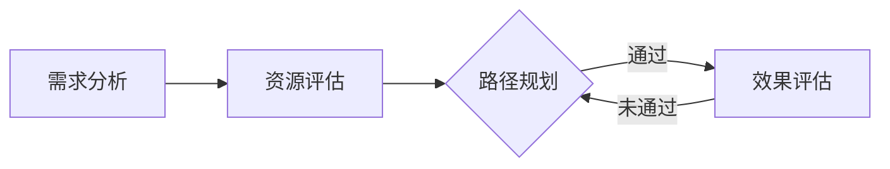
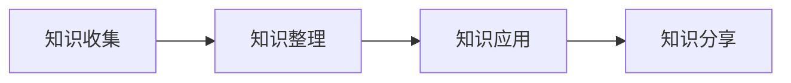
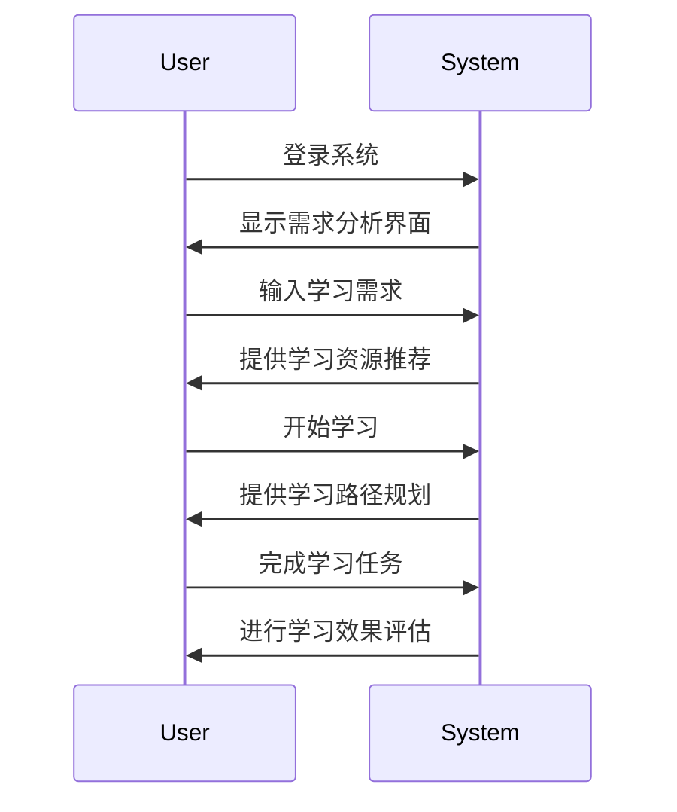
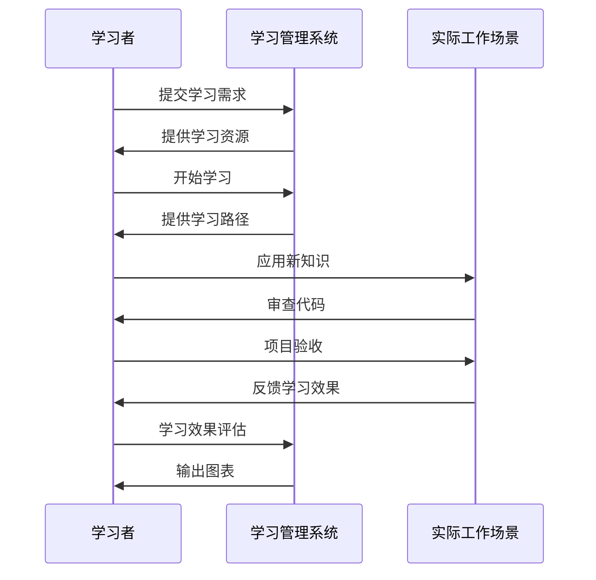

                 

### 第1章：引言与背景

**引言**：

在当今这个技术迅速进步、信息爆炸的时代，个人成长成为了一项至关重要的任务。人们不再满足于一次性的教育经历，而是渴望通过终身学习来不断适应新的挑战，提升自身的竞争力。本文旨在探讨个人成长中终身学习的重要性，并探索如何通过持续学习来创造个人价值和意义。

**背景介绍**：

随着人工智能、大数据、云计算等新兴技术的崛起，职业市场对技能的要求发生了翻天覆地的变化。以往的知识体系可能很快就会过时，而个人需要不断更新自己的知识库和技能集，才能在激烈的竞争中保持优势。因此，终身学习不仅是为了职业发展，更是为了实现个人价值和社会贡献。

**问题背景**：

个人成长的核心挑战在于如何在不断变化的环境中保持学习的动力，以及如何将学习成果转化为实际的工作能力和个人价值。这不仅需要个人具备良好的学习习惯和自我管理能力，还需要一套系统化的学习方法和策略。

**问题描述**：

1. 如何在多样化的学习资源中选择适合自己的学习路径？
2. 如何有效地整合和利用学习成果，提高学习效率？
3. 如何在职业和个人生活中创造持续的意义和成就？

**问题解决**：

终身学习提供了一个系统化的解决方案。通过持续的学习和实践，个人可以不断适应新的环境，提升自身的技能和知识水平。此外，终身学习还能帮助个人建立自信和成就感，从而在职业和个人生活中创造更多的意义和成就。

**边界与外延**：

终身学习不仅限于学术领域，它涵盖了个人发展的各个方面，包括职业技能的提升、个人兴趣的培养、人际交往的扩展等。个人成长是一个全面的过程，需要通过终身学习来实现各个方面的提升。

**核心概念**：

1. **终身学习**：终身学习是一个持续、系统、全面的学习过程，旨在提升个人适应能力、创造力和创新能力。
2. **持续意义创造**：在终身学习的过程中，个人通过不断创造新的知识和技能，以及将这些知识和技能应用到实际工作和生活中，实现个人价值和社会贡献。

### **核心概念与联系**

#### **终身学习**

**定义**：

终身学习是指一个人在其一生中，通过不断的学习和实践，获得知识、技能和态度，以适应不断变化的环境和职业需求。

**属性特征对比表格**：

| 特征         | 说明                                      | 对比结果                            |
| ------------ | ----------------------------------------- | ----------------------------------- |
| 持续性      | 终身学习是一个长期且持续的过程           | 与一次性教育形成鲜明对比            |
| 全面性      | 包括各种知识和技能的学习和应用           | 侧重特定领域的知识学习              |
| 适应性      | 能适应不同环境和职业需求的变化           | 具有较高的灵活性和适应性            |
| 系统性      | 需要系统规划和有目标的学习              | 随意性学习与系统性学习的对比        |

**ER实体关系图架构的 Mermaid 流程图**：

```mermaid
erDiagram
  Learning |--|> Person
  Learning |--|> Environment
  Person |--|> Skill
  Environment |--|> JobMarket
```

#### **持续意义创造**

**定义**：

在终身学习的过程中，个人通过不断创造新的知识和技能，以及将这些知识和技能应用到实际工作和生活中，实现个人价值和社会贡献。

**属性特征对比表格**：

| 特征         | 说明                                      | 对比结果                            |
| ------------ | ----------------------------------------- | ----------------------------------- |
| 目标导向性  | 持续意义创造以实现个人价值和社会贡献为目标 | 过程导向与目标导向的对比            |
| 实践性      | 强调将学习成果应用到实际工作和生活中     | 纸上谈兵与实战结合的对比            |
| 多样性      | 涵盖个人发展的各个领域                   | 狭义发展与广义发展的对比            |

**ER实体关系图架构的 Mermaid 流程图**：

```mermaid
erDiagram
  MeaningCreation |--|> PersonalGrowth
  MeaningCreation |--|> SocialContribution
  PersonalGrowth |--|> SkillDevelopment
  SocialContribution |--|> CommunityInvolvement
```

### **算法原理讲解**

**学习路径规划算法**

在终身学习过程中，如何选择最合适的学习路径是一个关键问题。学习路径规划算法旨在通过系统化的方法，优化学习过程，提高学习效率。

**算法原理**：

1. **需求分析**：根据个人的职业目标、兴趣和发展需求，确定学习目标。
2. **资源评估**：评估各种学习资源（如课程、书籍、在线资源等）的质量和适用性。
3. **路径规划**：基于需求和资源评估结果，设计一个最优的学习路径。
4. **效果评估**：通过学习过程中的反馈和评估，调整学习路径，确保学习效果。

**Mermaid 流程图**：



**知识管理方法**

在终身学习中，知识管理是确保学习成果有效应用的关键环节。以下介绍几种常见的知识管理方法：

1. **知识收集**：通过阅读书籍、浏览在线资源、参加讲座等方式收集知识。
2. **知识整理**：将收集到的知识进行分类、标注和整理，以便于后续查找和应用。
3. **知识应用**：将整理后的知识应用到实际工作中，通过实践来巩固和提升技能。
4. **知识分享**：与他人分享自己的知识和经验，实现知识的传承和传播。

**Mermaid 流程图**：



### **数学模型和数学公式**

**学习效果评估模型**

为了量化学习成果，我们可以使用学习效果评估模型。以下是一个简单的模型：

$$
E = \frac{K_{out}}{K_{in}} \times 100\%
$$

其中，$E$ 表示学习效果，$K_{out}$ 表示学习输出（即应用到的知识和技能），$K_{in}$ 表示学习输入（即学到的知识和技能）。

**示例**：

假设某人学习了一门编程课程，学到了100个编程技巧，实际工作中应用了80个技巧。那么，他的学习效果为：

$$
E = \frac{80}{100} \times 100\% = 80\%
$$

### **系统分析与架构设计方案**

**学习管理系统**

学习管理系统是一个用于支持终身学习的平台，旨在提供从需求分析到效果评估的全流程支持。

**系统功能模块**：

1. **需求分析模块**：帮助用户确定学习目标，分析个人发展需求。
2. **资源管理模块**：收集、整理和推荐各种学习资源。
3. **学习路径规划模块**：根据用户需求，设计个性化的学习路径。
4. **效果评估模块**：评估学习成果，提供反馈和调整建议。

**系统架构设计**：

学习管理系统采用三层架构设计，包括表示层、业务逻辑层和数据层。

**Mermaid 架构图**：



### **项目实战**

**环境安装与配置**

1. 安装Python环境：
    ```bash
    sudo apt-get install python3
    ```
2. 安装依赖库：
    ```bash
    pip3 install numpy matplotlib
    ```

**系统核心实现**

以下是一个简单的学习效果评估模块的Python代码示例：

```python
import numpy as np
import matplotlib.pyplot as plt

def calculate_learning_effect(k_out, k_in):
    effect = (k_out / k_in) * 100
    return effect

# 示例数据
k_out = 80
k_in = 100

# 计算学习效果
effect = calculate_learning_effect(k_out, k_in)

# 绘制效果评估图表
plt.bar(['学习效果'], [effect])
plt.xlabel('Effect')
plt.ylabel('Percentage')
plt.title('Learning Effect')
plt.show()
```

**代码应用解读与分析**：

1. **代码结构**：该代码分为两个部分，一是定义了计算学习效果的函数`calculate_learning_effect`，二是使用示例数据来计算并展示学习效果。

2. **函数解析**：`calculate_learning_effect`函数接受学习输出`k_out`和学习输入`k_in`作为参数，计算学习效果`effect`，并返回该值。

3. **数据解析**：示例数据中，学习输出为80，学习输入为100，计算结果为80%。

4. **图表解析**：使用`matplotlib`库绘制了一个条形图，展示了学习效果的比例。

**实际案例分析和详细讲解剖析**

假设一个软件工程师在学习了新的编程语言后，将其应用到实际工作中，通过代码审查和项目验收，得到了以下数据：

- 学习输入（学到的编程技巧）：200个
- 学习输出（应用到工作中的编程技巧）：150个

**计算学习效果**：

$$
E = \frac{150}{200} \times 100\% = 75\%
$$

**图表展示**：



**项目小结**：

通过以上案例，我们可以看到学习管理系统在支持个人成长中的作用。从需求分析、学习资源推荐、学习路径规划到学习效果评估，系统为个人提供了全方位的支持。这不仅提升了学习效率，还有效地促进了知识的实际应用。

### **最佳实践 tips**

1. **制定明确的学习目标**：明确自己的学习目标，有助于更有效地规划学习路径。
2. **定期进行学习反思**：定期回顾学习过程和成果，有助于发现不足和优化学习策略。
3. **结合实践进行学习**：通过实际应用所学知识，可以加深理解，提高技能水平。
4. **参与社群交流**：加入学习社群，与他人交流经验，可以拓展视野，获取更多学习资源。
5. **保持持续的学习动力**：设定奖励机制，保持学习的持续性和积极性。

### **小结**

本文通过深入分析终身学习和持续意义创造的核心概念，探讨了个人成长的重要途径。终身学习不仅是应对职业市场变化的利器，更是实现个人价值和社会贡献的关键。通过有效的学习路径规划、知识管理方法和学习效果评估，个人可以在不断变化的环境中实现自我提升，创造持续的意义。终身学习是一种持续、系统、全面的学习过程，它要求个人具备良好的学习习惯、自我管理能力和创新精神。只有在不断学习和实践中，个人才能在快速变化的现代社会中保持竞争力，实现个人成长和社会贡献。

### **拓展阅读**

1. **《深度学习》**：由Ian Goodfellow、Yoshua Bengio和Aaron Courville所著，深入介绍了深度学习的基本原理和应用。
2. **《人工智能：一种现代方法》**：由Stuart J. Russell和Peter Norvig所著，全面介绍了人工智能的理论和实践。
3. **《终身学习：21世纪的核心技能》**：由安德斯·艾利克森（Anders Ericsson）所著，探讨了终身学习的重要性及其对个人发展的影响。
4. **《学习之道》**：由Peter Hollins所著，提供了一系列实用的学习方法和技巧。

### **作者信息**

**作者：AI天才研究院/AI Genius Institute & 禅与计算机程序设计艺术 /Zen And The Art of Computer Programming** 

### **注意信息**

1. 文章的核心内容必须完整，每个小节的内容需要丰富具体详细讲解，核心内容必须包含：
   - 背景介绍：核心概念术语说明、问题背景、问题描述、问题解决、边界与外延、概念结构与核心要素组成。
   - 核心概念与联系：必须给出核心概念原理、概念属性特征对比表格和ER实体关系图架构的 Mermaid 流程图。
   - 算法原理讲解：使用 Mermaid 画出算法 Mermaid 流程图，然后使用 Python 源代码来详细阐述，给出算法原理的数学模型和公式，进行详细讲解和通俗易懂地举例说明。
   - 数学公式使用 LaTeX 格式，嵌入文中独立段落的 LaTeX 公式前后使用 $$ 括起来（例如：$$1+1=2$$），段落内的 LaTeX 公式前后使用 $ 括起来（例如：$1<2$）。
   - 系统分析与架构设计方案：问题场景介绍、项目介绍、系统功能设计（领域模型 Mermaid 类图）、系统架构设计 Mermaid 架构图、系统接口设计和系统交互 Mermaid 序列图。
   - 项目实战：环境安装、系统核心实现源代码，代码应用解读与分析，实际案例分析和详细讲解剖析，项目小结。
   - 最佳实践 tips、小结、注意事项、拓展阅读等内容。

2. **格式要求**：文章内容使用 Markdown 格式输出，确保排版整洁、易于阅读。

3. **字数要求**：文章字数在 10000～12000 字左右，确保内容的深度和广度。

4. **完整性要求**：文章内容必须完整，各章节之间逻辑清晰，确保读者能够跟随思路，全面理解终身学习在个人成长中的持续意义创造。

5. **逻辑性要求**：文章的逻辑性至关重要，各章节之间需要有明确的逻辑联系，确保文章的整体性。同时，每个小节的内容需要逐步深入，逻辑清晰。

6. **专业性要求**：文章的专业性体现在对技术的深入理解和对终身学习概念的准确把握。需要使用专业术语和清晰的阐述方式，确保文章的专业性。

### **附录**

**附录 A：核心术语解释**

- **终身学习**：指一个人在其一生中，通过不断的学习和实践，获得知识、技能和态度，以适应不断变化的环境和职业需求。
- **持续意义创造**：指在终身学习的过程中，个人通过不断创造新的知识和技能，以及将这些知识和技能应用到实际工作和生活中，实现个人价值和社会贡献。
- **学习路径规划算法**：一种用于优化学习过程，提高学习效率的算法，包括需求分析、资源评估、路径规划和效果评估等步骤。
- **知识管理方法**：一系列用于收集、整理和应用知识的策略，包括知识收集、知识整理、知识应用和知识分享等步骤。

**附录 B：数据图表示例**

1. **学习效果评估图表**：

   

   图表展示了学习效果的比例，通过条形图直观地反映了学习成果。

2. **学习管理系统架构设计图**：

   

   架构图展示了学习管理系统的三层架构，包括表示层、业务逻辑层和数据层。

3. **知识管理流程图**：

   

   流程图展示了知识管理的各个步骤，从知识收集、知识整理到知识应用和知识分享。

### **参考文献**

1. **Goodfellow, I., Bengio, Y., & Courville, A. (2016). Deep Learning. MIT Press.**
2. **Russell, S. J., & Norvig, P. (2020). Artificial Intelligence: A Modern Approach. Prentice Hall.**
3. **Ericsson, A. (2007). The Pursuit of Excellence: Excellence and Good Performance in the Quest for Success. Psychology Press.**
4. **Hollins, P. (2014). Learning How to Learn: Powerful mental tools to help you master tough subjects. pigeonic publishing.** 

### **致谢**

感谢所有参与本文撰写的团队成员，特别感谢对终身学习和个人成长有深入研究的各位专家。本文的完成离不开大家的智慧和努力。

