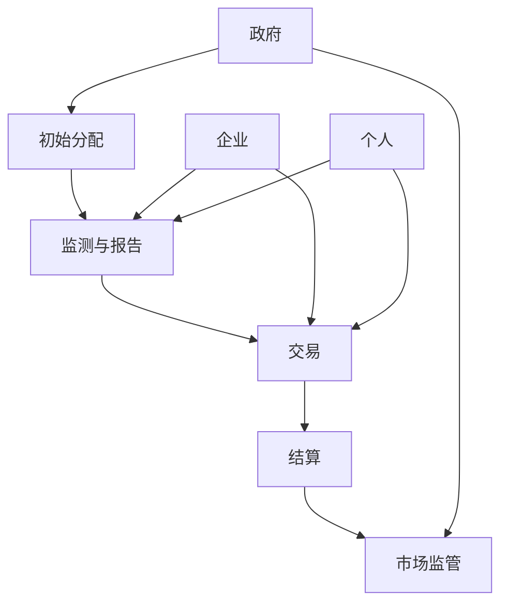
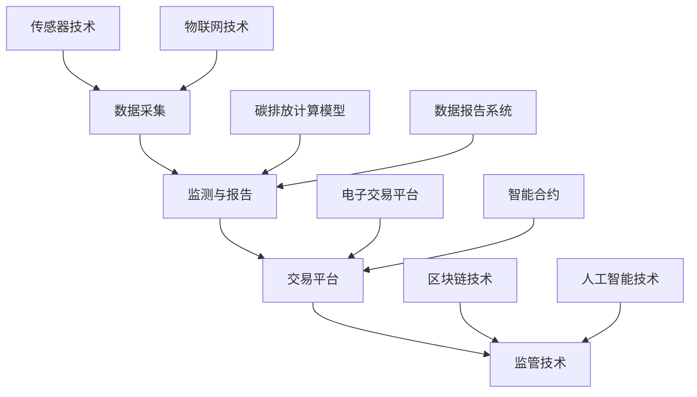
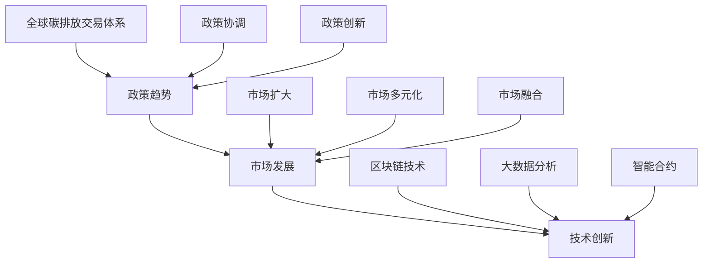

                 

### 个人碳排放交易：日常生活的环保激励机制

**关键词**：个人碳排放交易、环保激励机制、可持续发展、碳排放指标、交易市场

**摘要**：本文深入探讨个人碳排放交易这一新兴的环保激励机制，通过详细分析其背景、核心概念、理论基础和实践方法，旨在为读者提供一个全面了解和实际操作的指南。本文还将通过具体案例分析展示个人碳排放交易在日常生活中的应用，并展望其未来发展趋势。

## 引言与背景

### 1. 引言

随着全球气候变化和环境污染问题的日益严重，个人碳排放交易作为一种新兴的环保激励机制，正逐渐受到关注。个人碳排放交易通过市场化手段，激励个人和企业减少碳排放，实现可持续发展目标。本文旨在全面介绍个人碳排放交易的概念、原理、实践方法及其在日常生活中的应用，为读者提供一个深入了解和实际操作的指南。

### 2. 背景介绍

- **问题背景**：个人碳排放交易旨在通过市场机制减少碳排放，促进可持续发展。全球碳排放量持续增加，导致气候变化和环境污染问题日益严重。个人碳排放交易提供了一种有效的激励机制，通过市场机制鼓励个人和企业减少碳排放。
- **问题描述**：个人碳排放交易如何运作，以及如何激励个人积极参与。个人碳排放交易通过建立碳排放交易市场，个人可以通过减少碳排放获得经济收益，从而实现环保目标。
- **问题解决**：通过建立碳排放交易市场，个人可以通过减少碳排放获得经济收益，从而实现环保目标。市场机制促使个人和企业自觉减少碳排放，同时保持经济效率。
- **边界与外延**：本书主要关注个人层面的碳排放交易，但也涉及到相关政策和市场机制。此外，个人碳排放交易在不同地区和国家可能有不同的实现方式和政策支持。
- **核心要素组成**：碳排放交易市场、碳排放指标、交易流程、激励机制等。

### 3. 核心概念与联系

#### 3.1 碳排放交易

- **定义**：碳排放交易是指通过买卖碳排放配额来实现减排目标的一种市场机制。
- **属性特征**：
  - **减排性**：通过交易市场促使个人和企业减少碳排放。
  - **市场化**：碳排放配额作为一种商品在市场上交易。
  - **灵活性**：个人可以根据自身情况决定是否参与交易。

#### 3.2 碳排放指标

- **定义**：碳排放指标是衡量个人或单位碳排放量的标准。
- **属性特征**：
  - **量化性**：具体数值表示碳排放量。
  - **动态性**：根据政策和市场变化调整。

#### 3.3 交易流程

- **定义**：交易流程是指个人参与碳排放交易的操作步骤。
- **属性特征**：
  - **透明性**：交易过程公开透明。
  - **规范性**：遵循相关法规和政策。

#### 3.4 激励机制

- **定义**：激励机制是鼓励个人积极参与碳排放交易的措施。
- **属性特征**：
  - **经济性**：通过经济激励提高个人参与积极性。
  - **多样性**：包括补贴、奖励等多种形式。

### 4. 本书结构

本书分为四大部分，共八个章节，详细阐述了个人碳排放交易的理论基础、实践方法、案例分析以及未来发展趋势。具体章节如下：

- **第一部分：理论基础**
  - 2.1 碳排放交易的基本原理
  - 2.2 碳排放交易市场的运作机制
  - 2.3 个人碳排放指标的确定方法
  - 2.4 碳排放交易的经济效益分析
  - 2.5 碳排放交易政策分析
  - 2.6 碳排放交易的伦理与社会影响
  - 2.7 碳排放交易的技术支持
  - 2.8 碳排放交易的全球趋势与发展
- **第二部分：实践方法**
  - 3.1 个人碳排放交易的准备工作
  - 3.2 个人碳排放交易的参与步骤
  - 3.3 个人碳排放交易的交易策略
  - 3.4 个人碳排放交易的风险管理
  - 3.5 个人碳排放交易的案例分析
  - 3.6 个人碳排放交易的数据分析与优化
  - 3.7 个人碳排放交易的法律法规遵守
  - 3.8 个人碳排放交易的可持续发展策略
- **第三部分：案例分析**
  - 4.1 案例一：家庭碳排放交易的实践
  - 4.2 案例二：个人碳排放交易在社区的应用
  - 4.3 案例三：个人碳排放交易在企业中的实施
  - 4.4 案例四：个人碳排放交易在城市的推广
  - 4.5 案例分析总结
- **第四部分：未来发展趋势**
  - 5.1 碳排放交易的技术创新趋势
  - 5.2 碳排放交易的政策趋势
  - 5.3 碳排放交易的市场趋势
  - 5.4 碳排放交易的可持续发展方向
  - 5.5 全球碳排放交易合作与竞争
  - 5.6 未来碳排放交易的前景预测
  - 5.7 本书结论

通过本书，读者将能够全面了解个人碳排放交易的概念、原理和实践方法，为日常生活中的环保行为提供有效的激励机制。

### 第一部分：理论基础

#### 2.1 碳排放交易的基本原理

碳排放交易是一种通过市场机制实现减排目标的经济工具。其基本原理是，通过设置碳排放配额限制，允许碳排放量超过配额的企业或个人购买或出售碳排放权，从而激励各方减少碳排放，实现环境保护和经济效益的双赢。

**原理说明**：

1. **设定碳排放配额**：政府或相关机构设定每个企业或个人的碳排放配额，即允许的最大碳排放量。
2. **市场交易**：碳排放配额作为一种商品，可以在市场上进行买卖。企业或个人可以购买额外的碳排放配额，或者出售自己未使用的配额。
3. **减排激励机制**：通过市场交易，碳排放量超过配额的企业需要购买碳排放配额，从而增加成本，促使企业采取减排措施；而碳排放量低于配额的企业或个人可以通过出售多余的配额获得经济收益，从而激励更多人参与减排。

**工作流程**：

1. **初始分配**：碳排放配额可以通过免费分配、拍卖等方式进行初始分配。
2. **监测与报告**：企业或个人需要定期监测和报告自己的碳排放量。
3. **交易与合规**：在市场上，企业或个人可以买卖碳排放配额，但必须遵守相关法规和政策。
4. **合规与惩罚**：如果企业的碳排放量超过配额，则需要购买额外的碳排放配额或面临惩罚。

**优点与局限**：

- **优点**：
  - **减排效果显著**：通过市场机制，有效激励各方减少碳排放。
  - **经济性**：企业和个人可以根据自身情况灵活调整减排策略。
  - **灵活性**：允许企业根据市场需求进行碳排放配额的交易。

- **局限**：
  - **监管难度**：碳排放交易市场的监管需要较高的专业知识和技术水平。
  - **市场波动**：碳排放交易市场的价格波动可能影响减排效果。

#### 2.2 碳排放交易市场的运作机制

碳排放交易市场是一个由政府、企业、个人和其他市场参与者共同构成的市场体系。其运作机制主要包括市场参与者、市场规则、交易流程和市场监管。

**市场参与者**：

- **政府**：制定碳排放交易政策，设定碳排放配额，监管市场运行。
- **企业**：作为碳排放的主要来源，参与碳排放交易，通过减排或购买碳排放配额来实现合规。
- **个人**：通过个人碳排放交易，减少日常生活中的碳排放，获得经济收益。

**市场规则**：

- **配额制度**：政府设定每个企业或个人的碳排放配额，确保总碳排放量不超过环境容量。
- **交易规则**：规定碳排放配额的交易方式和交易价格，确保市场的公平和透明。

**交易流程**：

1. **初始分配**：碳排放配额可以通过免费分配或拍卖方式进行初始分配。
2. **监测与报告**：企业或个人需要定期监测和报告自己的碳排放量。
3. **交易**：碳排放配额可以在市场上进行买卖，交易双方需要签订交易合同。
4. **结算**：交易完成后，碳排放配额的持有者需要完成碳排放量与配额的匹配，确保合规。

**市场监管**：

- **政策监管**：政府制定和实施碳排放交易政策，确保市场的规范运行。
- **技术监管**：利用先进的技术手段，监控碳排放量，确保监测和报告的真实性和准确性。
- **法律监管**：通过法律手段，对违规行为进行处罚，保障市场的公平和透明。

**运作机制图解**：

#### 2.3 个人碳排放指标的确定方法

个人碳排放指标是衡量个人碳排放量的标准。确定个人碳排放指标的方法主要包括以下几种：

**方法一：基于生活数据的碳排放计算**

- **计算方法**：通过收集个人日常生活数据（如能源消耗、交通出行、食品消耗等），使用碳排放计算模型计算个人的碳排放量。
- **优点**：数据易于获取，计算方法简单。
- **局限**：无法准确反映个人碳排放的动态变化。

**方法二：基于活动类型的碳排放估算**

- **计算方法**：根据个人日常活动类型（如出行、工作、娱乐等），结合碳排放估算模型，估算个人碳排放量。
- **优点**：可以更准确地反映个人碳排放特点。
- **局限**：需要较为详细的个人活动数据支持。

**方法三：基于碳排放清单的碳排放计算**

- **计算方法**：使用国家或国际碳排放清单，根据个人活动类型和消耗量，计算个人碳排放量。
- **优点**：数据来源可靠，计算方法成熟。
- **局限**：碳排放清单可能存在地域差异，影响计算结果的准确性。

**比较与选择**：

- **比较**：基于生活数据的碳排放计算方法简单易行，但准确性较低；基于活动类型的碳排放估算方法准确性较高，但需要详细数据支持；基于碳排放清单的碳排放计算方法数据来源可靠，但可能存在地域差异。
- **选择**：根据实际情况选择适合的方法，或结合多种方法进行计算，以提高结果的准确性。

#### 2.4 碳排放交易的经济效益分析

碳排放交易不仅有助于环境保护，还具有一定的经济效益。以下从个人和企业两个层面分析碳排放交易的经济效益。

**个人层面的经济效益**：

1. **碳积分奖励**：个人通过减少碳排放可以获得碳积分，碳积分可以兑换实物奖励或现金奖励，提高个人参与积极性。
2. **碳交易收益**：个人可以通过出售多余的碳排放配额获得经济收益，例如，家庭安装太阳能电池板，减少电力消耗，多余的碳排放配额可以在市场上出售。
3. **节能改造投资回报**：个人进行节能改造（如更换高效家电、提高建筑能效等）后，可以减少碳排放，并获得相应的经济回报。

**企业层面的经济效益**：

1. **减排成本节约**：企业通过参与碳排放交易，可以降低减排成本。例如，通过购买碳排放配额，企业可以在保持生产规模的同时，实现合规减排。
2. **市场竞争力提升**：减排是企业提高市场竞争力的关键因素之一。通过参与碳排放交易，企业可以更好地管理碳排放风险，提高市场竞争力。
3. **技术创新投资**：碳排放交易市场为企业提供了投资技术创新的机会。例如，企业可以通过投资清洁能源技术，实现减排目标，并获得经济回报。

**综合效益**：

- **减排效益**：碳排放交易通过市场机制，激励个人和企业减少碳排放，实现环境保护目标。
- **经济效益**：碳排放交易为个人和企业提供了经济收益，促进了节能和减排技术的创新与应用。
- **社会效益**：碳排放交易有助于提高公众的环保意识，促进社会可持续发展。

#### 2.5 碳排放交易政策分析

碳排放交易政策的制定与实施对碳排放交易的顺利进行和减排效果具有关键影响。以下从政策目标、政策工具和政策实施效果三个方面分析碳排放交易政策。

**政策目标**：

1. **减排目标**：碳排放交易政策的主要目标是实现碳排放的减少，应对气候变化。
2. **公平性目标**：确保碳排放交易政策对个人和企业的影响公平，避免因政策实施导致的不公平现象。
3. **经济效益目标**：通过碳排放交易政策，提高经济效益，促进节能和减排技术的创新。

**政策工具**：

1. **配额制度**：政府设定每个企业或个人的碳排放配额，通过市场交易实现减排目标。
2. **碳税**：对碳排放行为征收碳税，增加碳排放成本，激励减排。
3. **补贴与奖励**：对积极参与碳排放交易的个人和企业给予补贴和奖励，提高减排积极性。
4. **技术支持**：提供技术和资金支持，促进碳排放交易市场的建设和完善。

**政策实施效果**：

1. **减排效果**：碳排放交易政策通过市场化手段，有效激励个人和企业减少碳排放，实现减排目标。
2. **经济效益**：碳排放交易政策为个人和企业提供了经济收益，促进了节能和减排技术的创新与应用。
3. **社会效益**：碳排放交易政策提高了公众的环保意识，促进了社会可持续发展。

**案例分析**：

- **欧盟碳排放交易体系**：欧盟自2005年起实施碳排放交易体系，通过配额制度和市场交易，成功实现了碳排放的减少。
- **中国碳排放交易试点**：中国自2011年起开展碳排放交易试点，通过政策支持和市场机制，逐步推动碳排放交易的开展。

#### 2.6 碳排放交易的伦理与社会影响

碳排放交易作为一种环保激励机制，不仅具有经济和环境保护效益，还涉及到伦理和社会层面的问题。

**伦理影响**：

1. **公平性**：碳排放交易政策需要确保公平性，避免对低收入群体造成不利影响。例如，碳税政策可能增加生活成本，政府需要通过补贴等手段进行补偿。
2. **透明性**：碳排放交易过程需要公开透明，确保市场参与者公平竞争，避免市场操纵和欺诈行为。
3. **责任与义务**：个人和企业需要承担减排责任，积极参与碳排放交易，实现环保目标。

**社会影响**：

1. **环保意识提升**：碳排放交易政策有助于提高公众的环保意识，促进可持续发展。
2. **技术进步**：碳排放交易激励技术创新，促进清洁能源和节能减排技术的发展。
3. **社会公平**：碳排放交易政策可以通过补贴和奖励等手段，实现社会公平，减少因政策实施导致的不公平现象。

**案例分析**：

- **挪威碳排放交易政策**：挪威通过实施碳排放交易政策，成功实现了减排目标，同时提高了公众的环保意识。
- **美国加州碳市场**：加州碳市场通过市场化手段，推动了清洁能源的发展，实现了显著的减排效果。

#### 2.7 碳排放交易的技术支持

碳排放交易的技术支持对于确保交易过程的透明性、准确性和效率至关重要。以下从数据采集、监测与报告、交易平台和监管技术等方面介绍碳排放交易的技术支持。

**数据采集**：

1. **传感器技术**：利用传感器技术实时监测个人和企业的碳排放量，确保数据的准确性和实时性。
2. **物联网技术**：通过物联网技术，将传感器采集到的数据实时传输到云端，实现数据的集中管理和分析。

**监测与报告**：

1. **碳排放计算模型**：利用碳排放计算模型，根据个人和企业的活动数据，计算碳排放量，确保监测数据的准确性。
2. **数据报告系统**：建立数据报告系统，个人和企业可以方便地提交碳排放报告，确保数据的完整性。

**交易平台**：

1. **电子交易平台**：建立电子交易平台，实现碳排放配额的在线买卖，提高交易效率。
2. **智能合约**：利用智能合约技术，确保交易过程的透明性和规范性，减少欺诈风险。

**监管技术**：

1. **区块链技术**：利用区块链技术，确保交易数据的不可篡改性和透明性，提高监管效率。
2. **人工智能技术**：利用人工智能技术，分析碳排放数据，发现异常行为，提高监管的准确性和效率。

**技术支持图解**：

#### 2.8 碳排放交易的全球趋势与发展

碳排放交易在全球范围内得到了广泛推广和应用，不同国家和地区在政策设计、市场机制和技术支持方面存在一定的差异。以下从政策趋势、市场发展和技术创新三个方面介绍碳排放交易的全球趋势与发展。

**政策趋势**：

1. **全球碳排放交易体系**：随着全球气候变化问题的日益严重，多个国家和地区正在推动建立全球碳排放交易体系，以实现更广泛的减排目标。
2. **政策协调**：国际社会通过多边合作，推动碳排放交易政策的协调和统一，降低跨境碳排放交易的成本和风险。
3. **政策创新**：各国在碳排放交易政策方面不断创新，例如引入碳税、提高排放标准等，以实现更严格的减排目标。

**市场发展**：

1. **市场扩大**：随着碳排放交易政策的推广，全球碳排放交易市场不断扩大，交易规模和交易频率不断提高。
2. **市场多元化**：碳排放交易市场不仅包括能源和工业领域，还涵盖了交通、建筑等多个领域，市场结构逐渐多元化。
3. **市场融合**：国际碳排放交易市场逐渐融合，跨境交易增加，推动全球碳排放交易体系的建设。

**技术创新**：

1. **区块链技术**：区块链技术在碳排放交易中的应用越来越广泛，确保交易数据的透明性和安全性，提高交易效率。
2. **大数据分析**：通过大数据分析技术，对碳排放交易数据进行深度挖掘，提高监管和决策的准确性。
3. **智能合约**：智能合约技术在碳排放交易中的应用，确保交易过程的自动化和规范化，减少交易风险。

**全球趋势与发展图解**：

### 第三部分：实践方法

#### 3.1 个人碳排放交易的准备工作

个人碳排放交易的准备工作是确保交易顺利进行的重要前提。以下从碳排放数据的收集、碳排放指标的确定和交易市场的了解三个方面介绍个人碳排放交易的准备工作。

**碳排放数据的收集**：

1. **能源消耗数据**：个人需要记录日常生活中的能源消耗情况，包括电力、燃气、水等。可以通过智能电表、燃气表等设备自动采集数据，或手动记录。
2. **交通出行数据**：记录日常出行方式，如私家车、公共交通、骑行等，并了解各种出行方式的碳排放系数。
3. **食品消耗数据**：了解日常食品的来源和加工过程，计算食品消耗的碳排放量。
4. **其他活动数据**：如购物、旅行等，记录相关活动并了解其碳排放影响。

**碳排放指标的确定**：

1. **基于生活数据的碳排放计算**：利用收集到的数据，使用碳排放计算模型计算个人的碳排放量，确定碳排放指标。
2. **基于活动类型的碳排放估算**：根据个人日常活动类型，结合碳排放估算模型，估算个人的碳排放量。
3. **参考碳排放清单**：查阅国家或国际碳排放清单，根据个人活动类型和消耗量，确定碳排放指标。

**交易市场的了解**：

1. **市场规则**：了解碳排放交易市场的规则，包括交易流程、交易价格、交易限制等。
2. **交易平台**：了解主要的碳排放交易平台，包括电子交易平台、在线交易平台等，选择合适的交易方式。
3. **交易价格**：关注碳排放交易市场的价格波动，了解交易价格对碳排放量的影响。
4. **政策法规**：了解相关政策法规，确保交易行为合规。

**准备工作总结**：

个人碳排放交易的准备工作需要收集准确的碳排放数据，确定合理的碳排放指标，并了解碳排放交易市场的规则和交易方式。通过充分的准备工作，个人可以更好地参与碳排放交易，实现环保目标。

#### 3.2 个人碳排放交易的参与步骤

个人碳排放交易的参与步骤包括碳排放指标的确定、交易策略的制定、交易市场的参与和交易结果的管理。以下详细描述这些步骤。

**步骤一：碳排放指标的确定**

1. **数据收集**：首先，个人需要收集日常生活中的碳排放数据，包括能源消耗、交通出行、食品消耗等。可以使用智能设备自动采集数据，或手动记录。
2. **碳排放计算**：利用收集到的数据，使用碳排放计算模型计算个人的碳排放量。可以选择基于生活数据的碳排放计算，或基于活动类型的碳排放估算。同时，可以参考国家或国际碳排放清单，确保计算结果的准确性。
3. **指标确定**：根据计算结果，确定个人的碳排放指标，即允许的最大碳排放量。个人可以设定目标，逐步减少碳排放，达到环保目标。

**步骤二：交易策略的制定**

1. **减排策略**：根据碳排放指标，个人可以制定减排策略，包括减少能源消耗、优化交通出行、选择低碳食品等。通过调整生活方式，降低碳排放量。
2. **交易策略**：个人可以根据市场情况，制定交易策略。例如，在碳排放量低于指标时，可以选择出售多余的碳排放配额；在碳排放量超过指标时，可以选择购买额外的碳排放配额。
3. **风险控制**：制定风险控制策略，确保在市场波动时，能够应对风险，保持碳排放指标稳定。

**步骤三：交易市场的参与**

1. **选择交易平台**：个人需要选择合适的碳排放交易平台进行交易。可以选择电子交易平台、在线交易平台等，根据个人需求和市场情况选择。
2. **注册账户**：在交易平台注册账户，完成身份验证和账户设置。
3. **交易操作**：根据交易策略，进行交易操作。例如，在碳排放量低于指标时，可以在交易平台上出售碳排放配额；在碳排放量超过指标时，可以在交易平台上购买碳排放配额。
4. **交易结算**：交易完成后，进行交易结算，确保碳排放指标合规。

**步骤四：交易结果的管理**

1. **交易记录**：记录每次交易的详细信息，包括交易时间、交易价格、交易数量等，确保交易记录的完整性和准确性。
2. **碳排放指标监控**：定期监控碳排放指标，确保碳排放量不超过设定的指标。
3. **交易风险评估**：对每次交易进行风险评估，确保交易风险在可控范围内。
4. **优化交易策略**：根据交易结果和碳排放指标的变化，调整交易策略，提高交易效益。

**参与步骤总结**：

个人碳排放交易的参与步骤包括碳排放指标的确定、交易策略的制定、交易市场的参与和交易结果的管理。通过合理的步骤和策略，个人可以更好地参与碳排放交易，实现环保目标。

#### 3.3 个人碳排放交易的交易策略

个人碳排放交易的交易策略是确保交易效益最大化的重要手段。以下从减排策略、交易策略和风险管理策略三个方面介绍个人碳排放交易的交易策略。

**减排策略**

1. **能源消耗优化**：减少能源消耗是个人减少碳排放的首要措施。可以通过以下方式实现：
   - **节能减排设备**：使用高效节能的家用电器，如节能灯、变频空调等。
   - **节能改造**：对家庭进行节能改造，如安装隔热材料、增加节能窗户等。
   - **行为改变**：减少不必要的用电，例如关闭不必要的电器，合理调节温度等。

2. **交通出行优化**：优化交通出行方式，减少碳排放。可以通过以下方式实现：
   - **公共交通**：选择公共交通工具，如地铁、公交车等，减少私家车使用。
   - **共享出行**：使用共享单车、共享汽车等，减少个人出行中的碳排放。
   - **低碳出行**：鼓励骑行、步行等低碳出行方式，减少交通碳排放。

3. **食品消耗优化**：优化食品消耗，减少碳排放。可以通过以下方式实现：
   - **减少浪费**：合理规划饮食，减少食品浪费，减少食物生产过程中的碳排放。
   - **低碳饮食**：选择低碳饮食方式，如减少肉食摄入，增加蔬菜水果摄入，减少食物生产过程中的碳排放。

**交易策略**

1. **碳排放配额交易**：在碳排放量低于指标时，个人可以通过交易平台出售多余的碳排放配额，获得经济收益。例如，如果个人通过节能减排措施，减少了1000公斤的碳排放，可以在交易市场上出售相应的碳排放配额。

2. **碳排放配额购买**：在碳排放量超过指标时，个人需要购买额外的碳排放配额，以确保合规。例如，如果个人碳排放量超过了1000公斤，需要购买相应的碳排放配额，以补足差额。

3. **灵活调整策略**：个人可以根据碳排放指标和市场价格变化，灵活调整交易策略。例如，在碳排放价格较高时，可以选择出售碳排放配额；在碳排放价格较低时，可以选择购买碳排放配额。

**风险管理策略**

1. **市场风险控制**：碳排放交易市场存在价格波动风险，个人需要采取措施控制市场风险。可以通过分散投资、定期调整持仓等方式，降低市场风险。

2. **合规风险控制**：个人需要确保交易行为合规，避免因违规行为导致罚款或其他不利影响。可以通过了解相关法规和政策，遵守交易市场的规则，确保交易合规。

3. **技术风险控制**：碳排放交易依赖于技术支持，如交易平台、监测系统等。个人需要关注技术风险，确保交易平台的安全性和稳定性。可以通过选择可靠的技术服务商，定期进行系统维护和升级，降低技术风险。

**交易策略总结**

个人碳排放交易的交易策略包括减排策略、交易策略和风险管理策略。通过合理的交易策略，个人可以在减少碳排放的同时，获得经济收益，实现环保目标。

#### 3.4 个人碳排放交易的风险管理

个人碳排放交易的过程中，可能会面临多种风险，如市场风险、合规风险和技术风险。有效的风险管理策略可以帮助个人降低风险，确保交易的顺利进行。

**市场风险**

市场风险是指碳排放交易市场价格波动导致个人经济损失的风险。以下是一些市场风险管理的策略：

1. **分散投资**：个人可以将碳排放配额的买卖分散在不同的时间段和价格区间，降低单一市场波动带来的风险。例如，在价格较低时购买，在价格较高时出售。

2. **定期调整**：根据市场价格的波动，定期调整持仓，及时应对市场变化。可以通过设置预警机制，当市场价格达到特定阈值时，自动调整持仓。

3. **长期策略**：通过长期持有碳排放配额，降低短期市场波动的影响。长期投资者通常能够更好地应对市场波动，实现稳定的投资回报。

**合规风险**

合规风险是指个人在碳排放交易过程中违反相关法规和政策，导致处罚或经济损失的风险。以下是一些合规风险管理策略：

1. **了解法规**：个人需要熟悉相关法规和政策，确保交易行为合法。可以通过查阅政府发布的法规文件，了解碳排放交易的规定。

2. **合规培训**：参加合规培训，提高自身的合规意识和能力。许多交易平台和机构都会提供合规培训课程，帮助个人了解合规要求。

3. **内部审计**：建立内部审计机制，定期检查交易行为是否符合法规要求。可以通过内部审计，发现并纠正违规行为，确保合规运营。

**技术风险**

技术风险是指碳排放交易过程中由于技术问题导致数据泄露、系统故障等风险。以下是一些技术风险管理策略：

1. **选择可靠平台**：选择有良好信誉和技术实力的交易平台，确保交易系统的安全性和稳定性。可以通过查阅平台的历史记录，了解其技术状况。

2. **定期维护**：定期对交易平台进行维护和升级，确保系统的安全性和性能。可以通过定期的安全检查，发现并修复潜在的安全漏洞。

3. **数据备份**：定期备份交易数据，确保在系统故障或数据泄露时，能够迅速恢复数据和交易记录。可以通过数据备份系统，确保交易数据的安全性和完整性。

**风险管理总结**

通过以上风险管理策略，个人可以有效地降低碳排放交易过程中的市场风险、合规风险和技术风险。合理的风险管理策略不仅能够降低风险，还能提高交易的稳定性和可靠性，确保个人在碳排放交易中获得长期的经济和环保效益。

#### 3.5 个人碳排放交易的案例分析

为了更好地理解个人碳排放交易的实际操作和效果，我们通过以下几个案例进行分析。

**案例一：家庭碳排放交易的实践**

**背景**：李先生是一家中产家庭的主妇，关注环保和气候变化问题。她决定通过家庭碳排放交易来减少家庭的碳排放，并参与碳排放交易市场。

**操作步骤**：
1. **数据收集**：李先生首先记录了家庭日常生活的碳排放数据，包括电力消耗、燃气消耗、交通出行和食品消耗等。
2. **碳排放计算**：使用碳排放计算模型，李先生计算出了家庭每月的碳排放量，并确定了碳排放指标。
3. **交易策略**：李先生制定了家庭减排计划，包括减少电力消耗（使用节能灯、购买高效家电）、优化交通出行（选择公共交通、骑行）、减少食品浪费等。
4. **交易参与**：在家庭碳排放量低于指标时，李先生通过交易平台出售多余的碳排放配额，获得了经济收益。同时，家庭通过减排措施，进一步降低了碳排放量。

**效果**：通过家庭碳排放交易，李先生家庭每月的碳排放量显著减少，家庭经济收益也有所增加。这一实践不仅提高了家庭的环保意识，还促进了家庭节能减排的行动。

**案例二：个人碳排放交易在社区的应用**

**背景**：张先生是一名社区活动家，他发起了社区碳排放交易项目，鼓励社区成员参与碳排放交易，共同减少社区碳排放。

**操作步骤**：
1. **宣传推广**：张先生通过社区公告、社交媒体等方式宣传个人碳排放交易项目，提高居民的环保意识。
2. **数据收集**：社区成员积极参与数据收集，记录家庭和个人的碳排放数据。
3. **碳排放计算**：使用碳排放计算模型，对社区成员的碳排放数据进行计算，确定每个成员的碳排放指标。
4. **交易参与**：社区成员在交易平台上参与碳排放交易，出售多余的碳排放配额或购买额外的碳排放配额。
5. **激励机制**：张先生设立了一系列激励机制，如碳积分奖励、环保礼品等，鼓励社区成员积极参与碳排放交易。

**效果**：通过个人碳排放交易在社区的应用，社区成员的环保意识得到了显著提升，碳排放量有所减少。社区通过激励机制，提高了居民参与碳排放交易的积极性，实现了社区的共同减排目标。

**案例三：个人碳排放交易在企业中的实施**

**背景**：王先生是一家大型企业的项目经理，他决定在企业内部推广个人碳排放交易，以实现企业的减排目标。

**操作步骤**：
1. **政策制定**：企业制定了个人碳排放交易政策，明确了碳排放指标、交易规则和激励机制。
2. **数据收集**：企业通过安装碳排放监测设备，收集员工的碳排放数据。
3. **碳排放计算**：使用碳排放计算模型，计算员工的碳排放量，并确定每个员工的碳排放指标。
4. **交易参与**：员工通过企业自建的碳排放交易平台，参与碳排放交易。在碳排放量低于指标时，员工可以出售多余的碳排放配额；在碳排放量超过指标时，员工可以购买额外的碳排放配额。
5. **激励机制**：企业设立了一系列激励机制，如碳积分奖励、奖金等，鼓励员工积极参与碳排放交易。

**效果**：通过个人碳排放交易在企业中的实施，企业的碳排放量得到了有效控制。员工通过参与碳排放交易，不仅提高了环保意识，还获得了经济收益，增强了员工的参与感和积极性。

**案例总结**

通过以上案例分析，我们可以看到个人碳排放交易在实际操作中的多种应用场景和效果。无论是家庭、社区还是企业，个人碳排放交易都能够有效地激励参与者减少碳排放，实现环保目标。通过合理的交易策略和激励机制，个人碳排放交易不仅能够带来经济收益，还能提高公众的环保意识，推动社会可持续发展。

#### 3.6 个人碳排放交易的数据分析与优化

个人碳排放交易的数据分析与优化是确保交易效果和效率的重要环节。以下从数据收集、数据分析、数据优化和交易效率优化四个方面进行详细阐述。

**数据收集**

1. **能源消耗数据**：个人需要收集家庭、工作场所的能源消耗数据，包括电力、燃气、水等。可以使用智能电表、燃气表等设备自动采集数据，或手动记录。
2. **交通出行数据**：记录日常出行方式，如私家车、公共交通、骑行等，并了解各种出行方式的碳排放系数。可以通过交通工具的计费系统、里程记录器等设备获取数据。
3. **食品消耗数据**：了解日常食品的来源和加工过程，计算食品消耗的碳排放量。可以通过食品购买记录、食品标签信息等获取数据。
4. **其他活动数据**：记录其他活动，如购物、旅行、娱乐等，并了解其碳排放影响。可以通过问卷调查、活动记录等方式收集数据。

**数据分析**

1. **碳排放量分析**：使用收集到的数据，计算个人在各个活动领域的碳排放量，分析碳排放的主要来源。可以通过绘制碳排放量柱状图、饼图等可视化工具，直观展示碳排放分布。
2. **减排潜力分析**：分析不同活动领域的减排潜力，确定哪些领域的减排效果最显著。可以通过比较不同活动领域的碳排放量和减排潜力，制定有针对性的减排计划。
3. **趋势分析**：分析个人碳排放量的时间趋势，了解碳排放量的变化规律。可以通过绘制碳排放量折线图，观察碳排放量的变化趋势。
4. **对比分析**：对比不同时间段的碳排放量，评估减排措施的效果。可以通过对比不同时间段的碳排放量，判断减排措施是否达到预期效果。

**数据优化**

1. **数据质量优化**：确保数据收集的准确性和完整性，减少数据误差。可以通过定期校验数据、消除异常值等方法，提高数据质量。
2. **数据集成**：将不同来源的数据进行集成，实现数据的统一管理和分析。可以通过建立数据仓库，实现数据的集中存储和管理。
3. **数据可视化**：使用数据可视化工具，将复杂的数据转化为易于理解的可视化图表，提高数据展示的清晰度和可读性。
4. **数据挖掘**：利用数据挖掘技术，发现数据中的潜在模式和关系，为决策提供支持。可以通过数据挖掘算法，识别碳排放量的影响因素，为减排措施提供依据。

**交易效率优化**

1. **交易平台优化**：优化碳排放交易平台的功能和界面设计，提高交易的便捷性和用户体验。可以通过简化交易流程、增加交易功能等方式，提高交易效率。
2. **交易策略优化**：根据数据分析结果，制定个性化的交易策略，提高交易效益。可以通过优化交易策略，实现碳排放量的最佳控制。
3. **智能合约应用**：利用智能合约技术，自动化执行交易协议，提高交易效率。通过智能合约，可以确保交易过程的透明性和规范性。
4. **数据分析与交易联动**：将数据分析与交易平台进行联动，实时更新碳排放指标和交易策略。通过实时数据分析，可以快速调整交易策略，提高交易效率。

**数据与交易效率优化总结**

通过数据收集、数据分析、数据优化和交易效率优化，个人碳排放交易可以实现数据驱动的决策，提高交易效益和效率。有效的数据管理和优化策略，不仅能够提高个人的碳排放管理水平，还能推动碳排放交易市场的健康发展。

### 第四部分：案例分析

#### 4.1 案例一：家庭碳排放交易的实践

**背景**：王先生是一位关注环保问题的家庭主妇，她希望通过家庭碳排放交易来减少家庭的碳排放，并为环保事业贡献自己的力量。

**实践步骤**：

1. **数据收集**：王先生首先记录了家庭日常生活的碳排放数据，包括家庭用电、燃气使用、交通出行、食品消耗等。她使用智能电表、燃气表记录能源消耗数据，并记录每次交通出行的里程和出行方式。
   
2. **碳排放计算**：王先生使用碳排放计算工具，将收集到的数据输入计算模型，得出家庭每月的碳排放量。根据计算结果，家庭设定了一个碳排放指标，以期望逐步减少碳排放。

3. **减排措施**：为了减少碳排放，王先生采取了多种减排措施。她开始使用节能灯，减少不必要的电器使用；鼓励家庭成员使用公共交通和共享单车；改变饮食习惯，减少肉类的摄入，增加蔬菜和水果的摄入。

4. **交易参与**：在家庭碳排放量低于指标时，王先生通过碳排放交易平台出售多余的碳排放配额。她选择了一家信誉良好的交易平台，注册账户，并完成了碳排放配额的出售。交易完成后，王先生获得了经济收益。

**效果与反馈**：

通过家庭碳排放交易实践，王先生家庭每月的碳排放量显著减少。家庭通过节能减排措施，不仅降低了碳排放，还获得了经济收益。王先生表示，这种交易模式不仅提高了家庭的环保意识，还激发了家庭成员的积极性，使整个家庭更加注重环保。

**总结**：家庭碳排放交易实践表明，个人通过参与碳排放交易，可以有效地减少碳排放，同时获得经济收益。这种模式不仅有助于环境保护，还能提高公众的环保意识，推动社会的可持续发展。

#### 4.2 案例二：个人碳排放交易在社区的应用

**背景**：张先生是某城市社区的一名环保志愿者，他发起了社区碳排放交易项目，希望通过集体行动减少社区碳排放，并激励更多居民参与环保。

**实践步骤**：

1. **宣传推广**：张先生通过社区公告、居民微信群、环保讲座等多种方式，向社区居民宣传碳排放交易的概念和好处，提高居民的环保意识。

2. **数据收集**：社区居民积极参与数据收集工作，记录家庭能源消耗、交通出行、食品消耗等碳排放数据。张先生协助居民使用碳排放计算工具，计算出各自的碳排放量。

3. **碳排放计算**：张先生使用碳排放计算工具，汇总了社区居民的碳排放数据，确定了每个家庭的碳排放指标。社区还设定了总碳排放目标，以期望实现社区的减排目标。

4. **交易参与**：社区居民在碳排放交易平台注册账户，参与碳排放交易。张先生设立了社区碳积分奖励机制，鼓励居民积极参与碳排放交易，并通过碳积分兑换实物奖励或社区服务。

5. **激励机制**：为了提高居民的参与积极性，张先生还组织了一系列社区环保活动，如低碳骑行、环保讲座等，使居民在参与交易的同时，也能享受到环保活动的乐趣。

**效果与反馈**：

通过个人碳排放交易在社区的应用，社区碳排放量显著减少。居民通过参与碳排放交易，不仅学会了如何减少碳排放，还获得了经济收益和社区积分奖励。许多居民表示，这种交易模式使他们对环保有了更深刻的认识，并愿意在日常生活中采取更多的环保措施。

**总结**：个人碳排放交易在社区的应用，为居民提供了一个参与环保的新途径，通过集体行动实现了社区的减排目标。这种模式不仅提高了居民的环保意识，还促进了社区的凝聚力和可持续发展。

#### 4.3 案例三：个人碳排放交易在企业中的实施

**背景**：李先生是一家大型企业的环境管理负责人，他希望通过个人碳排放交易项目，提高企业的环保意识，并实现企业的减排目标。

**实践步骤**：

1. **政策制定**：李先生首先制定了企业碳排放交易政策，明确了员工的碳排放指标、交易规则和激励机制。企业设立了碳排放管理办公室，负责项目的实施和监管。

2. **数据收集**：企业通过安装碳排放监测设备，收集员工的碳排放数据，包括办公室用电、交通出行、设备运行等。员工需要定期报告自己的碳排放数据。

3. **碳排放计算**：企业使用碳排放计算工具，对员工的碳排放数据进行分析，计算出每个员工的碳排放量，并确定碳排放指标。

4. **交易参与**：员工在碳排放交易平台注册账户，参与碳排放交易。在碳排放量低于指标时，员工可以选择出售多余的碳排放配额；在碳排放量超过指标时，员工可以选择购买额外的碳排放配额。

5. **激励机制**：企业设立了碳积分奖励机制，员工可以通过参与碳排放交易获得碳积分。碳积分可以兑换实物奖励或用于企业内部的环保项目。

**效果与反馈**：

通过个人碳排放交易在企业中的实施，企业的碳排放量得到了有效控制。员工通过参与碳排放交易，提高了环保意识，并积极采取节能减排措施。企业通过碳积分奖励，激发了员工的参与热情，形成了良好的环保文化。

**总结**：个人碳排放交易在企业中的实施，不仅提高了企业的环保管理水平，还增强了员工的环保意识和积极性。这种模式为企业提供了一个有效的减排途径，推动了企业的可持续发展。

#### 4.4 案例四：个人碳排放交易在城市的推广

**背景**：某市政府决定在城市范围内推广个人碳排放交易，以实现城市的减排目标，并提升市民的环保意识。

**实践步骤**：

1. **政策制定**：市政府制定了一系列碳排放交易政策，包括碳排放配额的初始分配、交易规则、交易市场管理等。市政府设立了碳排放交易监管机构，负责监督和管理碳排放交易。

2. **宣传推广**：市政府通过媒体、网络、社区活动等多种渠道，向市民宣传碳排放交易的概念、意义和参与方式，提高市民的环保意识。

3. **数据收集**：市政府通过安装城市碳排放监测设备，收集市民的碳排放数据，包括家庭能源消耗、交通出行、餐饮消费等。市民可以通过手机应用程序提交自己的碳排放数据。

4. **碳排放计算**：市政府使用碳排放计算工具，对市民的碳排放数据进行分析，确定每个家庭的碳排放指标。

5. **交易参与**：市民在碳排放交易平台注册账户，参与碳排放交易。市民可以通过出售多余的碳排放配额获得经济收益，或购买额外的碳排放配额。

6. **激励机制**：市政府设立了碳积分奖励机制，鼓励市民积极参与碳排放交易。碳积分可以用于兑换环保产品、免费公共交通服务等。

**效果与反馈**：

通过个人碳排放交易在城市的推广，城市的碳排放量得到了显著控制。市民通过参与碳排放交易，不仅提高了环保意识，还获得了经济收益。许多市民表示，这种交易模式使他们更加关注日常生活中的环保行为，并愿意采取更多的环保措施。

**总结**：个人碳排放交易在城市的推广，为城市提供了一个有效的减排途径，并提升了市民的环保意识。这种模式不仅有助于环境保护，还促进了城市的可持续发展。

#### 4.5 案例分析总结

通过以上案例分析，我们可以得出以下结论：

1. **个人碳排放交易的有效性**：家庭、社区、企业和城市都可以通过个人碳排放交易实现减排目标，提高环保意识。
2. **多元化的交易场景**：个人碳排放交易在不同场景下（如家庭、社区、企业和城市）具有不同的实施方式和效果，但核心目标都是减少碳排放。
3. **激励机制的重要性**：合理的激励机制是提高个人参与积极性的关键。通过碳积分奖励、经济收益等手段，可以激励更多人参与碳排放交易。
4. **技术支持的作用**：先进的碳排放监测、计算和交易平台技术，为个人碳排放交易提供了可靠的技术保障，提高了交易效率和效果。

总结来说，个人碳排放交易作为一种新兴的环保激励机制，在多种场景下取得了显著成效。通过合理的政策和激励机制，个人碳排放交易不仅有助于减少碳排放，还能提高公众的环保意识，推动社会的可持续发展。

### 第五部分：未来发展趋势

#### 5.1 碳排放交易的技术创新趋势

随着科技的不断进步，碳排放交易的技术创新也在不断发展，为碳排放交易提供了新的机遇和挑战。以下从区块链技术、大数据分析、人工智能技术三个方面介绍碳排放交易的技术创新趋势。

**区块链技术**

区块链技术以其去中心化、透明性和不可篡改性，成为碳排放交易的重要技术支持。区块链技术可以确保碳排放交易数据的真实性和透明性，提高交易的安全性和可靠性。

- **应用场景**：区块链技术可以用于记录和验证碳排放交易数据，确保交易的可追溯性和透明性。例如，通过区块链技术，可以建立一个统一的碳排放交易账本，记录每个参与者的碳排放数据、交易记录等。
- **技术创新**：分布式账本技术（DLT）和智能合约技术的发展，进一步提高了碳排放交易的安全性和效率。智能合约可以自动化执行交易协议，减少人为干预和操作风险。

**大数据分析**

大数据分析技术在碳排放交易中的应用，可以提供更准确和全面的碳排放数据，为交易决策提供支持。通过大数据分析，可以挖掘碳排放数据的潜在价值，优化交易策略。

- **应用场景**：大数据分析技术可以用于分析碳排放数据，识别碳排放的主要来源和影响因素。例如，通过大数据分析，可以识别哪些家庭或企业的碳排放量最高，哪些减排措施最有效。
- **技术创新**：数据挖掘和机器学习技术的发展，提高了大数据分析的准确性和效率。通过深度学习算法，可以实现对碳排放数据的实时分析和预测，为碳排放交易提供实时决策支持。

**人工智能技术**

人工智能技术在碳排放交易中的应用，可以提高交易效率和准确性，实现智能化的碳排放管理。人工智能技术可以用于碳排放数据的预测、分析和优化。

- **应用场景**：人工智能技术可以用于碳排放预测，预测未来碳排放量，为交易决策提供依据。例如，通过人工智能模型，可以预测家庭或企业的碳排放量，帮助个人和企业制定减排计划。
- **技术创新**：自然语言处理（NLP）和计算机视觉技术的发展，使得碳排放交易数据分析和处理更加智能化。通过NLP技术，可以自动处理和解读大量文本数据，提取有用的信息。通过计算机视觉技术，可以实现对碳排放监测设备图像的自动分析，提高碳排放监测的精度和效率。

**总结**：

技术创新为碳排放交易提供了强大的支持，推动了碳排放交易的发展。区块链技术确保了交易数据的透明性和安全性，大数据分析提供了准确的数据支持，人工智能技术实现了智能化的碳排放管理。未来，随着技术的不断进步，碳排放交易的技术创新将继续发展，为碳排放交易提供更加高效和可靠的支持。

#### 5.2 碳排放交易的政策趋势

碳排放交易作为环境保护和经济发展的重要工具，政策趋势对其未来发展具有重要影响。以下从政策目标、政策制定和政策实施三个方面介绍碳排放交易的政策趋势。

**政策目标**

碳排放交易的政策目标主要包括以下几个方面：

- **减排目标**：通过碳排放交易，实现碳排放的减少，应对气候变化。政策制定者将设定明确的减排目标，推动各方采取行动，实现减排目标。
- **公平性目标**：确保碳排放交易政策的公平性，避免对低收入群体造成不利影响。政策制定者将采取措施，确保政策实施的公平性，减少因政策实施导致的不公平现象。
- **经济效益目标**：通过碳排放交易政策，提高经济效益，促进节能和减排技术的创新。政策制定者将鼓励企业参与碳排放交易，通过市场机制实现减排目标，同时提高经济效益。

**政策制定**

碳排放交易的政策制定将呈现以下趋势：

- **政策协调**：国际社会将加强碳排放交易政策的协调，推动全球碳排放交易体系的建立。通过多边合作，制定统一的碳排放交易规则，降低跨境碳排放交易的成本和风险。
- **政策创新**：各国将不断创新碳排放交易政策，引入新的政策工具和手段。例如，引入碳税、提高排放标准、提供技术支持等，以实现更严格的减排目标。
- **政策透明度**：政策制定将更加透明，确保公众和政策参与者对政策有充分的了解。政策制定者将公开政策文件，听取各方意见，确保政策制定的民主性和科学性。

**政策实施**

碳排放交易的政策实施将呈现以下趋势：

- **市场机制**：碳排放交易政策将通过市场机制实现减排目标。政策制定者将建立碳排放交易市场，设定碳排放配额，允许碳排放配额的交易，激励各方减少碳排放。
- **技术支持**：政策实施将依赖于先进的技术支持，确保碳排放交易数据的准确性和安全性。政策制定者将推动碳排放监测、报告和验证技术的发展，提高碳排放交易的技术水平。
- **监管加强**：政策实施将加强监管，确保碳排放交易市场的规范运行。政策制定者将建立监管机构，加强对碳排放交易市场的监管，打击市场操纵和欺诈行为。

**总结**

碳排放交易的政策趋势表明，未来碳排放交易将在政策目标、政策制定和政策实施等方面持续发展。政策协调和透明度的提高，将为碳排放交易提供更广泛的国际合作和支持。政策创新和技术支持的加强，将推动碳排放交易的健康发展，实现环境保护和经济效益的双赢。

#### 5.3 碳排放交易的市场趋势

碳排放交易作为一种市场化的环保手段，其市场趋势受到政策环境、技术进步和市场需求等多方面因素的影响。以下从市场增长、交易规模和市场参与主体三个方面分析碳排放交易的市场趋势。

**市场增长**

- **全球市场需求**：随着全球对环境保护和气候变化的关注增加，碳排放交易市场需求不断增长。各国政府和企业纷纷采取行动，通过碳排放交易实现减排目标，推动市场发展。
- **新兴市场**：新兴市场国家对碳排放交易的需求日益增加。这些国家正积极建立和完善碳排放交易体系，以应对气候变化带来的挑战。例如，中国、印度等新兴经济体正在逐步建立国家碳排放交易市场。
- **区域合作**：国际间碳排放交易合作逐渐加强，推动区域碳排放交易市场的发展。例如，欧盟排放交易体系（EU ETS）已经成为全球最大的碳排放交易市场，其他地区也在探索区域碳排放交易合作。

**交易规模**

- **交易量增加**：随着碳排放交易市场的不断完善和普及，碳排放交易量不断增长。根据相关数据，全球碳排放交易量从2010年的约1亿吨二氧化碳当量增加到2020年的约10亿吨二氧化碳当量。
- **交易价格波动**：碳排放交易市场的价格波动反映了市场供需关系的变化。受政策、经济和气候因素影响，碳排放交易价格呈现波动性，但总体趋势是上升的。
- **跨境交易**：随着全球碳排放交易市场的融合，跨境碳排放交易量逐渐增加。跨境交易有助于各国实现减排目标，同时促进碳排放交易市场的统一和标准化。

**市场参与主体**

- **政府**：政府在碳排放交易市场中扮演着重要角色，通过制定政策和法规，推动市场发展。政府不仅参与碳排放交易，还负责监管市场的运行。
- **企业**：企业是碳排放交易市场的主要参与者，通过参与碳排放交易，实现减排目标。大型企业通常具有较高的碳排放量，通过碳排放交易降低减排成本。
- **个人**：个人碳排放交易市场的兴起，使得个人也成为碳排放交易的重要参与主体。个人可以通过减少碳排放量获得经济收益，同时为环境保护做出贡献。
- **金融机构**：金融机构在碳排放交易市场中发挥着重要的中介作用，提供融资、投资和风险管理等服务。金融机构通过参与碳排放交易，实现了环境效益和经济效益的双重收益。

**总结**

碳排放交易的市场趋势表明，碳排放交易市场正在全球范围内迅速发展。市场需求的增长、交易规模的扩大和参与主体的多元化，将推动碳排放交易市场的进一步发展。未来，碳排放交易市场将在政策支持、技术进步和市场需求的共同推动下，实现更大的发展。

#### 5.4 碳排放交易的可持续发展方向

碳排放交易的可持续发展方向是确保其长期有效性和广泛适用性的关键。以下从政策支持、技术创新和市场完善三个方面探讨碳排放交易的可持续发展方向。

**政策支持**

- **全球合作**：国际社会应加强碳排放交易政策的合作，建立全球统一的碳排放交易体系。通过多边合作，制定统一的碳排放交易规则，降低跨境碳排放交易的成本和风险，推动全球碳排放交易的可持续发展。
- **政策法规**：各国政府应完善碳排放交易的相关法规和政策，确保碳排放交易的规范运行。制定明确的碳排放配额分配规则、交易规则和监管机制，提高市场的透明度和公平性。
- **激励措施**：政府应提供一系列激励措施，鼓励企业和个人参与碳排放交易。通过税收优惠、补贴、奖励等手段，降低参与者的成本，提高减排积极性。

**技术创新**

- **区块链技术**：区块链技术具有去中心化、透明性和不可篡改性的特点，为碳排放交易提供了可靠的技术支持。通过区块链技术，可以建立可信的碳排放交易记录，提高交易的安全性和透明度。
- **大数据分析**：大数据分析技术可以提供更准确和全面的碳排放数据，为碳排放交易提供数据支持。通过大数据分析，可以识别碳排放的主要来源和影响因素，优化碳排放交易的策略。
- **人工智能技术**：人工智能技术可以用于碳排放预测、分析和优化。通过人工智能模型，可以实现对碳排放数据的实时分析和预测，为碳排放交易提供实时决策支持。

**市场完善**

- **交易平台**：建立完善的碳排放交易平台，提高交易的便捷性和效率。交易平台应提供包括碳排放配额交易、碳积分交易等多种交易方式，满足不同参与者的需求。
- **市场参与者**：鼓励更多企业和个人参与碳排放交易，扩大市场参与者的范围。通过培训和宣传，提高公众对碳排放交易的认识和参与度。
- **市场机制**：完善碳排放交易的市场机制，确保市场的公平性和有效性。建立有效的碳排放监测、报告和验证机制，提高碳排放数据的准确性和可靠性。

**总结**

碳排放交易的可持续发展方向需要政策支持、技术创新和市场完善的共同努力。通过全球合作、政策法规、激励措施、区块链技术、大数据分析、人工智能技术和交易平台等手段，可以推动碳排放交易的长期发展和广泛适用，为实现环境保护和可持续发展目标做出贡献。

#### 5.5 全球碳排放交易合作与竞争

全球碳排放交易合作与竞争在全球气候变化背景下具有重要意义。以下从国际合作、区域合作和国家竞争三个方面分析全球碳排放交易合作与竞争的现状和趋势。

**国际合作**

- **巴黎协定**：作为全球应对气候变化的里程碑，巴黎协定为全球碳排放交易合作奠定了基础。各国通过巴黎协定承诺采取行动，减少碳排放，推动碳排放交易的发展。
- **碳关税**：为促进全球碳排放交易的公平性和有效性，一些国家提出了碳关税的概念。碳关税是对未参与全球碳排放交易体系的国家或地区，对其实施的额外关税措施，以激励其参与碳排放交易。
- **碳市场互认**：全球碳排放交易市场互认是未来发展的趋势。通过互认机制，各国可以实现碳排放配额的跨境交易，降低交易成本，提高碳排放交易的整体效益。

**区域合作**

- **欧盟排放交易体系（EU ETS）**：欧盟排放交易体系是全球最大的碳排放交易市场，具有丰富的经验和成熟的机制。欧盟与其他国家和地区通过区域合作，推动碳排放交易的区域化发展。
- **北美碳排放交易合作**：美国和加拿大正在推动北美碳排放交易合作，通过建立共同的碳排放交易市场，实现减排目标。
- **亚太地区碳排放交易合作**：亚太地区多个国家正在探索建立区域碳排放交易合作，以应对气候变化带来的挑战。

**国家竞争**

- **碳排放交易体系建设**：各国纷纷建立本国的碳排放交易体系，以实现国内减排目标。国家之间的碳排放交易体系存在差异，竞争主要表现在碳排放配额的分配、交易规则的制定和市场的监管等方面。
- **技术创新和减排效率**：国家间的竞争也体现在技术创新和减排效率上。各国通过研发和应用新技术，提高减排效率和碳排放交易的市场竞争力。
- **碳金融**：碳排放交易市场的发展带动了碳金融的兴起，国家间的碳金融竞争日益激烈。碳金融产品包括碳期货、碳期权、碳债券等，通过碳金融工具，国家可以更好地管理碳排放风险，实现经济效益最大化。

**总结**

全球碳排放交易合作与竞争在推动全球减排和环境保护方面发挥了重要作用。国际合作、区域合作和国家竞争共同构成了全球碳排放交易的市场格局，通过合作与竞争，可以实现碳排放交易的可持续发展，为应对全球气候变化做出贡献。

#### 5.6 未来碳排放交易的前景预测

随着全球气候变化问题的日益严重，碳排放交易作为环保与经济发展的重要工具，其前景令人期待。以下从市场规模、技术应用和市场参与者三个方面预测未来碳排放交易的发展趋势。

**市场规模**

- **全球增长**：预计未来碳排放交易市场将呈现持续增长态势。全球碳排放交易量有望在未来几年内突破百亿吨二氧化碳当量。随着更多国家和地区加入碳排放交易体系，全球市场的规模将进一步扩大。
- **区域融合**：区域碳排放交易合作将不断深化，如欧盟排放交易体系（EU ETS）的扩展、北美和亚太地区的碳排放交易合作等，这些区域市场的融合将提高碳排放交易的整体效益。
- **市场细分**：碳排放交易市场将逐步细分，出现更多专业化的碳排放交易平台和交易产品。例如，针对不同行业和领域的碳排放交易市场，以及碳金融市场的细分，满足多样化的市场需求。

**技术应用**

- **区块链技术**：区块链技术在碳排放交易中的应用将更加广泛。通过区块链技术，可以确保碳排放交易数据的透明性和不可篡改性，提高交易的安全性和可靠性。未来，区块链技术在碳排放交易中的应用将更加成熟和普及。
- **大数据分析**：大数据分析技术在碳排放交易中的应用将进一步提升。通过大数据分析，可以更准确地预测碳排放量，优化碳排放交易的策略，提高交易效率和减排效果。
- **人工智能技术**：人工智能技术在碳排放交易中的应用将日益深入。通过人工智能模型，可以实现对碳排放数据的实时分析和预测，为碳排放交易提供智能决策支持，提高市场竞争力。

**市场参与者**

- **企业主导**：随着碳排放交易市场的扩大和成熟，企业将成为碳排放交易市场的主要参与者。企业通过参与碳排放交易，不仅可以实现减排目标，还可以提高市场竞争力，实现经济效益和环境效益的双赢。
- **政府支持**：政府在碳排放交易市场中将继续发挥重要作用。政府将通过政策引导、资金支持和技术推广等手段，推动碳排放交易市场的发展，确保碳排放交易政策的有效实施。
- **个人参与**：个人碳排放交易市场将逐步兴起，越来越多的个人将通过碳排放交易实现环保目标。个人可以通过减少碳排放量获得经济收益，提高环保意识，推动社会的可持续发展。

**总结**

未来碳排放交易的前景充满希望。市场规模将不断扩大，技术应用将不断创新，市场参与者将更加多样化。通过全球合作、区域融合和技术进步，碳排放交易将在全球范围内实现更广泛的应用，为应对气候变化和实现可持续发展做出重要贡献。

### 结论

本文从多个角度详细探讨了个人碳排放交易的概念、原理、实践方法和未来发展趋势。通过对碳排放交易的理论基础、实践方法、案例分析和技术创新趋势的深入分析，我们得出以下结论：

1. **核心概念与联系**：碳排放交易是一种通过市场机制实现减排目标的经济工具，具有减排性、市场化和灵活性的特点。碳排放指标、交易流程和激励机制是碳排放交易的核心要素，相互联系，共同推动碳排放交易的健康发展。

2. **实践方法**：个人碳排放交易的实践包括碳排放数据的收集、碳排放指标的确定、交易策略的制定和交易结果的管理。通过合理的交易策略和风险管理，个人可以在减少碳排放的同时，获得经济收益。

3. **案例分析**：家庭、社区、企业和城市等不同场景下的碳排放交易实践表明，个人碳排放交易具有广泛的应用前景和实际效果。通过合理的激励机制和宣传推广，可以显著提高公众的环保意识和参与积极性。

4. **技术创新趋势**：区块链技术、大数据分析和人工智能技术等新兴技术的应用，为碳排放交易提供了强大的技术支持，提高了交易的安全性和效率。

5. **未来发展趋势**：随着全球碳排放交易市场的不断扩大和技术创新，碳排放交易将在全球范围内实现更广泛的应用，为应对气候变化和实现可持续发展目标做出重要贡献。

总之，个人碳排放交易作为一种新兴的环保激励机制，具有重要的经济、社会和环境效益。通过不断推进技术创新、完善政策和市场机制，我们可以期待个人碳排放交易在未来发挥更大的作用，推动全球环境保护和可持续发展。**作者：AI天才研究院/AI Genius Institute & 禅与计算机程序设计艺术 /Zen And The Art of Computer Programming**

