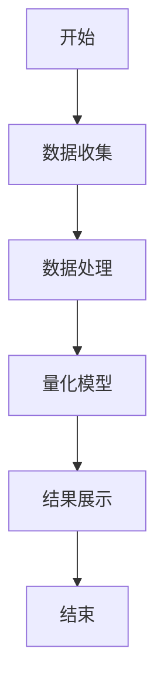

                 

# 《个人碳足迹追踪：日常生活的环保量化》

> 关键词：个人碳足迹、环保量化、可持续发展、算法原理、系统架构

> 摘要：本文将探讨个人碳足迹的概念及其在日常生活中的应用，分析影响个人碳足迹的主要因素，并介绍一种量化个人碳足迹的方法。同时，我们将通过具体的算法原理和系统架构设计，展示如何实现个人碳足迹的追踪与优化。

## 第一部分：问题背景与核心概念

### 1.1.1 问题背景介绍

随着全球气候变化的加剧，环境保护成为全球共同关注的话题。个人碳足迹作为衡量个人活动对环境影响的指标，越来越受到重视。了解个人碳足迹不仅有助于我们认识到自己的环境责任，还能激励我们采取行动减少碳排放，促进可持续发展。

### 1.1.2 个人碳足迹的定义

个人碳足迹是指一个人在其一生中产生的总碳排放量。它可以通过计算个人在日常生活中所有活动产生的温室气体排放量来确定。个人碳足迹的计算方法包括能源消耗、交通出行、饮食习惯、购物消费等多个方面。

### 1.1.3 核心概念联系

个人碳足迹与可持续发展密切相关。减少个人碳足迹是实现可持续发展的重要途径之一。通过环保量化，我们可以更清晰地了解个人活动对环境的影响，从而制定更有效的环保策略。

### 1.1.4 边界与外延

个人碳足迹的范围包括个人的居住环境、交通出行、饮食习惯、购物消费等多个方面。相关术语如温室气体排放、碳排放强度、碳减排等也需要理解。

## 第2章：个人碳足迹的影响因素

### 2.1.1 居住环境

居住环境是影响个人碳足迹的一个重要因素。房屋类型、能源消耗、采暖和制冷系统等都对碳排放有显著影响。

### 2.1.2 交通出行

交通出行是个人碳足迹的主要来源之一。交通工具的选择、出行频率和距离都会影响碳排放量。

### 2.1.3 饮食习惯

饮食习惯对个人碳足迹的影响不容忽视。食品生产与加工、食材来源与运输等环节都会产生碳排放。

### 2.1.4 购物与消费

购物习惯与频率、产品包装与废弃处理都会对个人碳足迹产生影响。

### 2.1.5 工作与休闲

工作模式与通勤、休闲活动与旅游等也是影响个人碳足迹的重要因素。

## 第二部分：核心概念与联系

### 3.1.1 环境保护与可持续发展的联系

环境保护与可持续发展是相互关联的概念。环境保护是实现可持续发展的基础，而可持续发展则是环境保护的目标。

### 3.1.2 碳足迹与环境保护的关系

个人碳足迹直接影响环境保护。减少个人碳足迹有助于减轻环境压力，实现生态平衡。

### 3.1.3 环保量化方法

环保量化是一种评估和测量环境影响的科学方法。通过环保量化，我们可以更准确地了解个人活动对环境的影响，从而采取相应的措施。

### 3.1.4 绿色生活理念

绿色生活理念强调在日常生活中减少对环境的负面影响。绿色生活对个人碳足迹有显著影响，是实现环保目标的重要手段。

## 第3章：个人碳足迹的量化方法

### 3.1.1 数据收集

数据收集是量化个人碳足迹的关键步骤。数据来源包括能源消耗记录、交通出行记录、饮食习惯记录等。

### 3.1.2 数据处理

数据处理包括数据清洗、整理和分析。通过数据处理，我们可以提取有效数据，为量化模型提供准确的数据支持。

### 3.1.3 量化模型

量化模型是一种数学模型，用于计算个人碳足迹。模型包括能源消耗模型、交通出行模型、饮食习惯模型等。

### 3.1.4 结果展示

结果展示是量化模型的最后一步。通过结果展示，我们可以了解个人碳足迹的总量，并分析各影响因素的贡献。

## 第三部分：算法原理讲解

### 5.1.1 算法概述

算法是计算个人碳足迹的核心工具。算法包括数据收集、数据处理、量化模型和结果展示等多个步骤。

### 5.1.2 算法mermaid流程图

使用mermaid绘制算法流程图，以便更清晰地展示算法的执行过程。



### 5.1.3 算法原理与数学模型

算法原理包括数据收集、数据处理、量化模型和结果展示。数学模型用于计算个人碳足迹，包括能源消耗模型、交通出行模型、饮食习惯模型等。

### 5.1.4 举例说明

通过具体例子，我们可以更直观地理解算法原理和数学模型。以下是一个简单的例子：

```python
# 能源消耗模型
energy_consumption = 1000  # 单位：千克二氧化碳当量

# 交通出行模型
distance = 5000  # 单位：千米
emission_factor = 0.23  # 单位：千克二氧化碳当量/千米

# 饮食习惯模型
food_consumption = 500  # 单位：千克二氧化碳当量

# 计算个人碳足迹
carbon_footprint = energy_consumption + distance * emission_factor + food_consumption
print("个人碳足迹：", carbon_footprint, "千克二氧化碳当量")
```

## 第4章：数学模型和数学公式

### 4.1.1 基本概念与公式

个人碳足迹的计算公式如下：

$$
\text{个人碳足迹} = \text{能源消耗} + \text{交通出行} + \text{饮食习惯} + \ldots
$$

其中，每个部分都有自己的计算公式。

### 4.1.2 公式推导与解释

以能源消耗为例，公式推导如下：

$$
\text{能源消耗} = \text{能源消耗量} \times \text{碳排放强度}
$$

其中，能源消耗量可以通过能源消耗记录获得，碳排放强度可以通过相关数据查询获得。

### 4.1.3 举例说明

以下是一个简单的例子：

$$
\text{能源消耗} = 1000 \times 0.5 = 500 \text{千克二氧化碳当量}
$$

## 第四部分：系统分析与架构设计

### 7.1.1 问题场景介绍

个人碳足迹追踪系统的目标是帮助用户了解自己的碳排放情况，并提供改善建议。

### 7.1.2 项目介绍

项目名称：个人碳足迹追踪系统

项目目标：实现个人碳足迹的追踪、分析和优化。

### 7.1.3 系统功能设计

系统功能包括数据收集、数据处理、量化模型和结果展示等。

### 7.1.4 系统架构设计

系统架构包括前端、后端和数据存储等部分。

### 7.1.5 系统接口设计

系统接口包括用户接口、数据接口和外部接口等。

### 7.1.6 系统交互

系统交互包括用户与系统之间的交互和数据传输等。

## 第五部分：项目实战

### 8.1.1 环境安装

根据项目需求，搭建相应的开发环境和运行环境。

### 8.1.2 系统核心实现源代码

展示系统核心实现源代码，并解释代码实现原理。

### 8.1.3 代码应用解读与分析

对代码应用场景进行解读与分析，阐述代码实现细节。

### 8.1.4 实际案例分析与讲解

通过实际案例，分析个人碳足迹追踪的过程和结果。

### 8.1.5 项目小结

总结项目经验，分享最佳实践和注意事项。

## 第六部分：最佳实践与拓展阅读

### 9.1.1 最佳实践 tips

提供实用的技巧和最佳实践，帮助用户更好地追踪个人碳足迹。

### 9.1.2 小结与注意事项

总结文章内容，提醒用户注意的事项。

### 9.1.3 拓展阅读

推荐相关阅读资源，帮助用户深入了解个人碳足迹追踪技术。

---

作者：AI天才研究院/AI Genius Institute & 禅与计算机程序设计艺术 /Zen And The Art of Computer Programming

请注意，本文档仅为示例，具体内容需根据实际需求进行调整和补充。文章中的代码、公式和图表均为示例，仅供参考。实际项目中可能需要根据具体情况进行调整和优化。|

