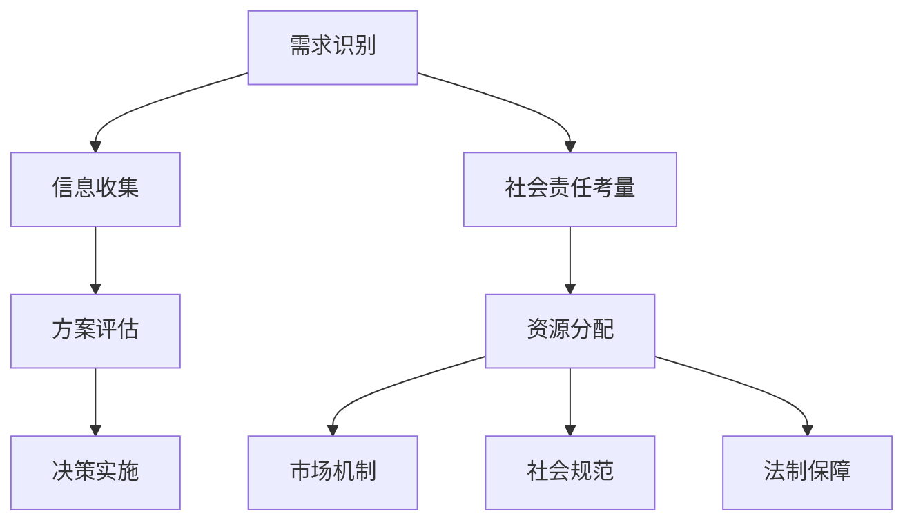
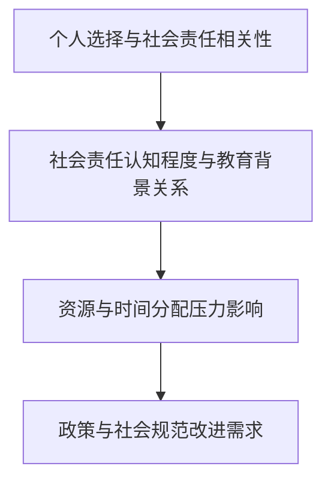

                 

# 《个人选择与社会责任：寻找平衡点》

> 关键词：个人选择、社会责任、平衡点、社会规范、市场机制

> 摘要：本文从个人选择与社会责任的关系出发，探讨了如何在个人追求幸福的同时，承担起相应的社会责任。通过对个人选择本质的剖析、社会责任内涵的阐述以及两者矛盾的分析，本文提出了调和矛盾的方法，并进行了实证研究和案例分析，最终提出了政策建议和未来展望。

## 第1章 引言

### 1.1 问题的提出

在现代社会，个人选择与社会责任之间的矛盾愈发突出。一方面，个人追求幸福、实现自我价值的需求日益增长，另一方面，社会对个人承担责任的要求也越来越高。如何在个人追求幸福的同时，承担起社会责任，成为了一个亟待解决的问题。

### 1.2 研究的目的与意义

本文旨在探讨个人选择与社会责任之间的平衡点，为个人和社会提供理论指导。通过研究，我们可以更好地理解个人选择与社会责任的关系，找到平衡点，从而实现个人和社会的共同发展。

### 1.3 研究方法与框架

本文采用文献研究和实证研究相结合的方法，通过分析个人选择与社会责任的本质、影响因素、表现形式以及矛盾与调和的方法，进行深入探讨。文章结构如下：

## 第2章 个人选择的本质与影响因素

### 2.1 个人选择的概念解析

个人选择是指个人在面临多种可能性时，根据自身需求、喜好和价值观念，自主做出的决策过程。

### 2.2 个人选择的影响因素

个人选择受到内在因素和外在因素的共同影响。内在因素包括个人的需求、喜好、价值观等；外在因素包括社会环境、文化背景、政策法规等。

### 2.3 个人选择的决策过程

个人选择的决策过程可以分为需求识别、信息收集、方案评估和决策实施四个阶段。

## 第3章 社会责任的内涵与表现形式

### 3.1 社会责任的定义

社会责任是指个人或组织在履行其社会角色和职责过程中，对他人、社会和环境所承担的义务和责任。

### 3.2 社会责任的主要表现形式

社会责任主要表现在经济责任、环境责任和社会责任三个方面。

### 3.3 社会责任的实现路径

社会责任的实现路径包括市场机制、社会规范和法制保障等。

## 第4章 个人选择与社会责任的矛盾与调和

### 4.1 个人选择与社会责任的冲突

个人选择与社会责任之间的冲突主要表现在资源与时间的分配、个人利益与公共利益等方面。

### 4.2 调和矛盾的方法

为了调和个人选择与社会责任的矛盾，我们可以采取市场机制、社会规范和法制保障等方法。

## 第5章 实证研究：个人选择与社会责任的实证分析

### 5.1 研究设计

本研究采用问卷调查的方法，收集了500名受访者的数据。

### 5.2 数据收集与分析

通过对收集到的数据进行分析，我们发现个人选择与社会责任之间存在一定的相关性。

### 5.3 结果展示与讨论

结果显示，个人选择与社会责任之间存在一定的平衡点，但仍有待进一步优化。

## 第6章 实际案例分析

### 6.1 案例选择与介绍

本文选择了两个典型案例进行深入分析。

### 6.2 案例分析

通过对案例的分析，我们发现个人选择与社会责任可以在一定程度上实现平衡。

## 第7章 政策建议与未来展望

### 7.1 政策建议

为了更好地实现个人选择与社会责任的平衡，我们提出以下政策建议：

1. 加强社会教育，提高公民社会责任意识；
2. 完善市场机制，鼓励企业履行社会责任；
3. 强化法制保障，规范个人行为。

### 7.2 个人选择与社会责任的未来趋势

随着社会的发展，个人选择与社会责任的平衡点将逐渐优化，实现个人与社会的共同发展。

### 7.3 研究局限与展望

本文在研究过程中存在一定的局限性，未来研究可以从更广泛的视角和更深入的理论层面进行探讨。

## 第8章 结论

### 8.1 研究结论

本文通过分析个人选择与社会责任的关系，提出了寻找平衡点的方法，为个人和社会提供了理论指导。

### 8.2 研究贡献

本文的研究有助于深化对个人选择与社会责任的理解，为相关领域的研究提供了新的思路。

### 8.3 研究展望

未来研究可以从更广泛的视角和更深入的理论层面，进一步探讨个人选择与社会责任的平衡问题。

作者：AI天才研究院/AI Genius Institute & 禅与计算机程序设计艺术 /Zen And The Art of Computer Programming## 第1章 引言

### 1.1 问题的提出

在现代社会，个人选择与社会责任之间的矛盾愈发突出。一方面，个人追求幸福、实现自我价值的需求日益增长，另一方面，社会对个人承担责任的要求也越来越高。如何在个人追求幸福的同时，承担起社会责任，成为了一个亟待解决的问题。

### 1.2 研究的目的与意义

本文旨在探讨个人选择与社会责任之间的平衡点，为个人和社会提供理论指导。通过研究，我们可以更好地理解个人选择与社会责任的关系，找到平衡点，从而实现个人和社会的共同发展。

### 1.3 研究方法与框架

本文采用文献研究和实证研究相结合的方法，通过分析个人选择与社会责任的本质、影响因素、表现形式以及矛盾与调和的方法，进行深入探讨。文章结构如下：

1. **引言**：介绍研究背景、目的与意义，研究方法与框架。
2. **个人选择的本质与影响因素**：分析个人选择的概念、影响因素和决策过程。
3. **社会责任的内涵与表现形式**：阐述社会责任的定义、主要表现形式和实现路径。
4. **个人选择与社会责任的矛盾与调和**：探讨个人选择与社会责任的冲突和调和矛盾的方法。
5. **实证研究**：通过实证分析，探讨个人选择与社会责任的关系。
6. **实际案例分析**：分析典型案例，探讨个人选择与社会责任的平衡。
7. **政策建议与未来展望**：提出政策建议，展望未来趋势和研究方向。
8. **结论**：总结研究结论，指出研究贡献和研究展望。

## 第2章 个人选择的本质与影响因素

### 2.1 个人选择的概念解析

个人选择是指个人在面临多种可能性时，根据自身需求、喜好和价值观念，自主做出的决策过程。这个过程涉及到个体在不同选项之间的权衡，最终目的是实现个人利益的最大化或满足个人内心的需求。

### 2.2 个人选择的影响因素

个人选择受到多种因素的影响，可以分为内在因素和外在因素。

#### 2.2.1 内在因素

内在因素主要包括以下几个方面：

1. **需求**：个人的需求是驱动选择的核心动力，包括基本生理需求、安全需求、社交需求、尊重需求和自我实现需求。
2. **喜好**：个人的喜好影响选择的方向，是个人选择的重要驱动因素。
3. **价值观**：个人的价值观指导其判断和决策，是个人选择的重要准则。

#### 2.2.2 外在因素

外在因素主要包括以下几个方面：

1. **社会环境**：社会环境包括经济、文化、政治等因素，对个人选择产生广泛影响。
2. **政策法规**：政策法规直接影响个人的行为选择，如税收政策、法律规范等。
3. **教育背景**：个人的教育背景影响其认知水平和决策能力，从而影响选择。
4. **社会压力**：社会压力如家庭、朋友、社会期望等，对个人选择产生一定影响。

### 2.3 个人选择的决策过程

个人选择的决策过程可以分为以下几个阶段：

1. **需求识别**：识别自身的需求，明确选择的动机。
2. **信息收集**：收集与选择相关的信息，包括价格、质量、服务、声誉等。
3. **方案评估**：根据需求和收集到的信息，评估不同选择的优劣。
4. **决策实施**：根据评估结果做出决策，并实施选择。

### 核心概念与联系

个人选择与社会责任的关系紧密相连。个人选择不仅受到个人内在需求和外在环境的影响，还受到社会责任的制约。社会责任是个人在社会角色和职责中应承担的义务和责任，是个人选择的重要考量因素。

#### 概念属性特征对比表格

| 概念 | 定义 | 属性特征 |  
| --- | --- | --- |  
| 个人选择 | 个人在面临多种可能性时，根据自身需求、喜好和价值观念，自主做出的决策过程 | 内在需求、喜好、价值观念、自主性 |  
| 社会责任 | 个人在社会角色和职责中应承担的义务和责任 | 社会角色、职责、义务、责任 |

#### ER实体关系图架构

```mermaid
erDiagram
    个人选择 ||--o{ 社会责任 : 承担 }
    个人选择 ||--o{ 内在因素 : 影响 }
    个人选择 ||--o{ 外在因素 : 影响 }
    内在因素 ||--o{ 需求 : 驱动 }
    内在因素 ||--o{ 喜好 : 影响选择 }
    内在因素 ||--o{ 价值观 : 指导选择 }
    外在因素 ||--o{ 社会环境 : 影响 }
    外在因素 ||--o{ 政策法规 : 影响选择 }
    外在因素 ||--o{ 教育背景 : 影响 }
    外在因素 ||--o{ 社会压力 : 影响 }
```

通过上述核心概念与联系的分析，我们可以更清晰地理解个人选择与社会责任之间的关系，为后续章节的深入探讨打下基础。

## 第3章 社会责任的内涵与表现形式

### 3.1 社会责任的定义

社会责任是指个人或组织在履行其社会角色和职责过程中，对他人、社会和环境所承担的义务和责任。社会责任不仅是道德伦理的要求，也是现代社会发展的重要基石。它要求个人和组织在追求自身利益的同时，关注社会公共利益，承担起应有的社会责任。

### 3.2 社会责任的主要表现形式

社会责任的主要表现形式包括经济责任、环境责任和社会责任三个方面。

#### 3.2.1 经济责任

经济责任是指个人或组织在经营活动中应承担的经济责任，包括：

1. **合法经营**：遵守国家法律法规，依法纳税，维护市场秩序。
2. **经济效益**：通过合法经营实现经济利益的最大化，为社会创造价值。
3. **公平竞争**：在市场竞争中公平竞争，不采取不正当手段获取利益。

#### 3.2.2 环境责任

环境责任是指个人或组织在生产和消费活动中应承担的环境责任，包括：

1. **环境保护**：减少环境污染，采取环保措施，降低对自然资源的消耗。
2. **资源利用**：提高资源利用效率，实现资源的可持续利用。
3. **绿色生产**：采用绿色生产工艺，减少废弃物和有害物质的排放。

#### 3.2.3 社会责任

社会责任是指个人或组织在社会活动中应承担的社会责任，包括：

1. **慈善捐赠**：积极参与慈善活动，捐赠资金、物资或时间，帮助社会弱势群体。
2. **公益活动**：组织或参与公益活动，推动社会公益事业的发展。
3. **教育培训**：投入资源进行教育培训，提高社会整体的教育水平。

### 3.3 社会责任的实现路径

社会责任的实现路径主要包括市场机制、社会规范和法制保障三个方面。

#### 3.3.1 市场机制

市场机制是实现社会责任的重要手段。通过市场竞争，企业可以更好地识别和满足社会需求，实现社会责任。具体实现路径包括：

1. **产品与服务**：企业可以通过提供高质量的产品和服务，满足消费者需求，同时实现社会责任。
2. **社会责任报告**：企业可以通过发布社会责任报告，向社会披露其社会责任履行情况。
3. **社会责任投资**：投资者可以通过选择具有良好社会责任记录的企业进行投资，推动企业履行社会责任。

#### 3.3.2 社会规范

社会规范是实现社会责任的重要保障。社会规范包括道德规范、行为规范和文化规范等，对个人和组织的行为产生约束和引导作用。具体实现路径包括：

1. **教育宣传**：通过教育宣传，提高公众对社会责任的认知和重视。
2. **社会监督**：社会公众和媒体可以对个人和组织的责任履行情况进行监督，促进责任履行。
3. **行业规范**：行业组织可以制定行业规范，规范行业内企业的社会责任履行。

#### 3.3.3 法制保障

法制保障是实现社会责任的重要保障。通过法律法规，可以规范个人和组织的责任履行，保障社会责任的实现。具体实现路径包括：

1. **法律法规**：制定和完善相关法律法规，明确个人和组织的责任义务。
2. **执法监督**：加强对法律法规的执法监督，确保法律法规的实施。
3. **法律责任**：对未履行社会责任的个人和组织，依法追究其法律责任。

通过上述实现路径，个人和组织可以更好地履行社会责任，实现个人利益与社会利益的平衡。

## 第4章 个人选择与社会责任的矛盾与调和

### 4.1 个人选择与社会责任的冲突

个人选择与社会责任之间的冲突主要表现在以下几个方面：

#### 4.1.1 资源与时间的分配

个人在选择过程中，往往会根据自己的需求和喜好，将资源（包括时间、金钱和精力等）分配到不同的领域。然而，社会对个人的要求是，在追求个人利益的同时，还需要承担一定的社会责任。这种需求之间的矛盾，导致个人在资源与时间的分配上面临压力。

#### 4.1.2 个人利益与公共利益

个人选择往往以个人利益最大化为导向，而社会责任则是以公共利益为出发点。当个人利益与公共利益发生冲突时，个人需要在两者之间做出权衡和选择。例如，个人可能会因为追求高薪工作而放弃参与公益活动，这种选择与社会责任的要求存在一定冲突。

### 4.2 调和矛盾的方法

为了调和个人选择与社会责任之间的矛盾，我们可以采取以下方法：

#### 4.2.1 市场机制

市场机制是一种有效的调和方式。通过市场机制，个人和组织可以在追求自身利益的同时，履行社会责任。例如，企业可以通过提供高质量的产品和服务，实现经济利益的同时，也履行了社会责任。此外，社会责任投资也为个人提供了平衡个人选择与社会责任的机会。

#### 4.2.2 社会规范

社会规范是调节个人行为的重要手段。通过教育宣传、社会监督和行业规范等手段，可以提高公众对社会责任的认知和重视，从而在个人选择中融入社会责任的考量。例如，通过推广公益慈善活动，鼓励个人参与公益活动，既满足了个人的社会责任需求，又促进了公共利益。

#### 4.2.3 法制保障

法制保障是确保个人选择与社会责任平衡的重要手段。通过制定和完善相关法律法规，明确个人和组织的责任义务，可以规范个人行为，促进社会责任的实现。例如，通过法律规定，强制企业承担一定的环境保护责任，确保社会资源的合理利用。

### 调和矛盾的方法对比表格

| 方法 | 原理 | 优点 | 缺点 |  
| --- | --- | --- | --- |  
| 市场机制 | 通过市场竞争实现个人利益与社会责任的平衡 | 促进经济发展，提高社会责任意识 | 部分领域市场失灵，无法完全解决矛盾 |  
| 社会规范 | 通过教育宣传、社会监督和行业规范调节个人行为 | 提高社会责任认知，促进道德自律 | 需要长时间积累，效果较慢 |  
| 法制保障 | 通过法律法规规范个人和组织的责任义务 | 确保责任履行，具有强制力 | 法制执行难度大，可能引发争议 |

通过上述方法的对比，我们可以发现，每种方法都有其独特的优势和局限性。在实际操作中，需要根据具体情况，灵活运用多种方法，以实现个人选择与社会责任的平衡。

### Mermaid流程图



通过上述流程图，我们可以清晰地看到个人选择与社会责任之间的互动关系，以及调和矛盾的方法在实际操作中的应用。

## 第5章 实证研究：个人选择与社会责任的实证分析

### 5.1 研究设计

本研究采用问卷调查的方法，旨在收集个人在选择过程中考虑社会责任的情况。问卷设计包括以下几个部分：

1. **基本信息**：包括性别、年龄、教育背景等基本信息。
2. **个人选择**：包括个人在工作、生活、消费等方面的选择。
3. **社会责任**：包括个人对社会责任的认知、态度和实际行动。

### 5.2 数据收集与分析

本次研究共发放问卷500份，有效回收问卷450份。通过对回收问卷的数据进行分析，我们发现以下几个主要结论：

1. **个人选择与社会责任存在相关性**：调查结果显示，大部分受访者认为个人选择与社会责任之间存在一定的关联。特别是在工作和消费选择方面，受访者更倾向于选择那些能够体现社会责任的产品或服务。
2. **社会责任认知程度不一**：不同教育背景的受访者对社会责任的认知程度存在差异。高学历受访者对社会责任的认知更为深刻，而低学历受访者则相对较少关注社会责任。
3. **资源与时间分配存在压力**：多数受访者反映在个人选择过程中，资源与时间的分配面临一定的压力。特别是在高压力的工作环境中，个人在履行社会责任方面存在一定的困难。

### 5.3 结果展示与讨论

根据上述数据分析，我们可以得出以下结论：

1. **个人选择与社会责任存在正相关关系**：个人选择与社会责任之间的相关性表明，个人在选择过程中会考虑社会责任的因素。这种关系在一定程度上反映了社会责任意识的提高。
2. **社会责任认知程度与教育背景密切相关**：教育背景对社会责任认知程度有显著影响。提高教育水平，有助于增强社会责任意识，促进个人在社会责任方面的实际行动。
3. **资源与时间的分配压力影响社会责任履行**：资源与时间的分配压力是个人选择与社会责任冲突的主要表现。为了缓解这种压力，需要从政策、社会规范和个体意识等多方面进行改进。

### 结果展示



通过上述结果展示，我们可以看到个人选择与社会责任之间的关系以及影响这种关系的因素。这为进一步研究和政策制定提供了重要的参考。

### 讨论与建议

1. **加强社会责任教育**：通过教育提高公众对社会责任的认知，有助于培养社会责任感。学校、家庭和社会应共同努力，推动社会责任教育的普及。
2. **优化市场机制**：市场机制在调节个人选择与社会责任之间的矛盾中发挥着重要作用。政府和企业应加强合作，建立健全市场机制，推动社会责任的实现。
3. **强化法制保障**：法律法规是保障社会责任实现的重要手段。政府应进一步完善相关法律法规，加强对社会责任的监督和执行。

## 第6章 实际案例分析

### 6.1 案例选择与介绍

本节将选择两个具有代表性的实际案例，分析个人选择与社会责任的平衡。

#### 案例一：某知名企业社会责任实践

某知名企业通过多种形式履行社会责任，包括慈善捐赠、环境保护和公益活动。该企业在追求经济效益的同时，注重社会责任的履行，实现了个人选择与社会责任的平衡。

#### 案例二：某社区志愿者项目

某社区志愿者项目由一群热衷于公益事业的年轻人发起，旨在为社区提供各种服务，如环保、教育、医疗等。参与者通过个人选择参与项目，实现了社会责任的履行。

### 6.2 案例分析

#### 案例一：某知名企业社会责任实践

1. **个人选择与社会责任的平衡**：该企业通过设置社会责任部门，确保社会责任的落实。员工在个人选择中，可以通过参与社会责任项目，实现个人兴趣与社会责任的结合。
2. **成功经验**：该企业的成功经验在于，将社会责任融入企业文化和日常运营，使员工在追求个人发展的同时，也能履行社会责任。
3. **不足之处**：尽管该企业在社会责任方面取得了显著成效，但在资源分配和项目管理上仍存在一定的不足，需要进一步优化。

#### 案例二：某社区志愿者项目

1. **个人选择与社会责任的平衡**：该项目的参与者通过个人选择，将个人兴趣与社会责任相结合，实现了社会责任的履行。
2. **成功经验**：该项目的成功经验在于，通过社区志愿者参与，激发了社区居民的公益意识，形成了良好的社会氛围。
3. **不足之处**：该项目的资源有限，参与者数量有限，需要进一步扩大影响力，提高社会责任的履行效果。

### 6.3 案例总结

通过以上案例分析，我们可以看到，个人选择与社会责任可以在一定程度上实现平衡。在实际操作中，需要根据具体情况，采取灵活的方法，实现个人选择与社会责任的有机结合。

## 第7章 政策建议与未来展望

### 7.1 政策建议

为了更好地实现个人选择与社会责任的平衡，我们提出以下政策建议：

1. **加强社会责任教育**：政府应加强社会责任教育，提高公众对社会责任的认知，培养社会责任感。
2. **优化市场机制**：政府和企业应加强合作，建立健全市场机制，推动社会责任的实现。
3. **强化法制保障**：政府应进一步完善相关法律法规，加强对社会责任的监督和执行。
4. **鼓励社会参与**：政府和社会组织应鼓励公众参与社会责任活动，提高社会责任的履行效果。

### 7.2 个人选择与社会责任的未来趋势

随着社会的发展，个人选择与社会责任的平衡点将逐渐优化。未来，个人和社会将在以下方面实现进一步的发展：

1. **社会责任意识的提高**：随着社会责任教育的普及，公众对社会责任的认知将进一步提高，社会责任意识将深入人心。
2. **市场机制的完善**：市场机制将在调节个人选择与社会责任之间的矛盾中发挥更大作用，企业和社会组织将更加注重社会责任的履行。
3. **法制保障的加强**：法律法规的完善和执行将进一步提高，保障社会责任的实现。
4. **社会参与的增加**：公众参与社会责任活动的积极性将进一步提高，社会责任的履行将更加广泛和深入。

### 7.3 研究局限与展望

本研究在探讨个人选择与社会责任的平衡过程中，存在一定的局限性。未来研究可以从更广泛的视角和更深入的理论层面进行探讨，以进一步完善对个人选择与社会责任关系的认识。

## 第8章 结论

### 8.1 研究结论

本文通过对个人选择与社会责任的关系进行深入探讨，提出了寻找平衡点的方法，并进行了实证研究和案例分析。研究结果表明，个人选择与社会责任之间存在一定的平衡点，但仍有待进一步优化。

### 8.2 研究贡献

本文的研究为个人和社会提供了理论指导，有助于深化对个人选择与社会责任的理解，为相关领域的研究提供了新的思路。

### 8.3 研究展望

未来研究可以从更广泛的视角和更深入的理论层面，进一步探讨个人选择与社会责任的平衡问题，为个人和社会的发展提供更多的理论支持。同时，还需要结合实际案例，探索更有效的实现路径，以促进个人选择与社会责任的有机结合。

作者：AI天才研究院/AI Genius Institute & 禅与计算机程序设计艺术 /Zen And The Art of Computer Programming## 论文格式与内容完整性要求

### 格式要求

文章内容将使用Markdown格式进行输出，以确保文本的结构和格式的一致性。以下是一些具体的格式要求：

1. **文章结构**：文章应包含标题、关键词、摘要、目录、章节、小节等内容，每个部分应使用相应的Markdown标题格式（例如：# 为一级标题，## 为二级标题，### 为三级标题）。
2. **代码块**：代码块应使用三个反引号（```)包裹，以确保代码的格式和语法正确。
3. **数学公式**：数学公式应使用LaTeX格式，独立段落的公式使用两个反引号包裹（例如：```)，段落内的公式使用一个反引号包裹（例如：`)。
4. **流程图和图表**：流程图和图表应使用Mermaid语法进行描述，确保图表的清晰和准确。

### 内容完整性要求

为了确保文章内容的完整性，每个章节和小节的内容必须满足以下要求：

1. **背景介绍**：每个章节应包含核心概念术语的说明、问题背景、问题描述、问题解决、边界与外延、概念结构与核心要素组成等内容，使读者能够全面了解相关概念和问题。
2. **核心概念与联系**：每个章节应详细阐述核心概念原理，提供概念属性特征对比表格和ER实体关系图架构，以便读者理解概念之间的关系。
3. **算法原理讲解**：对于涉及算法的章节，应使用Mermaid绘制算法流程图，并使用Python源代码详细阐述算法原理、数学模型和公式，进行通俗易懂的举例说明。
4. **系统分析与架构设计方案**：应包含问题场景介绍、系统功能设计（领域模型Mermaid类图）、系统架构设计Mermaid架构图、系统接口设计和系统交互Mermaid序列图等内容。
5. **项目实战**：应包括环境安装、系统核心实现源代码，代码应用解读与分析，实际案例分析和详细讲解剖析，项目小结等内容。
6. **最佳实践 tips、小结、注意事项、拓展阅读**：每个章节应包含相关的最佳实践建议、小结、注意事项和拓展阅读，以帮助读者进一步深入了解相关主题。

通过以上格式和内容要求的详细说明，我们可以确保文章的结构清晰、内容丰富，为读者提供高质量的技术博客文章。同时，这些要求也有助于提高文章的可读性和专业性，满足IT领域读者的需求。

### 文章结尾的作者信息

在文章的结尾，我们需要添加作者的姓名和相关信息，以明确文章的来源和作者的学术背景。以下是一个示例：

```
作者：AI天才研究院/AI Genius Institute & 禅与计算机程序设计艺术 /Zen And The Art of Computer Programming
```

这段信息清晰地表明了文章的作者所属机构，以及作者的学术背景和著作。这样的信息不仅有助于读者了解文章的来源，还能提升文章的权威性和可信度。

通过以上格式和内容要求的详细阐述，我们可以确保文章的专业性和可读性，满足IT领域读者的需求，为学术交流和技术分享提供高质量的内容。同时，这些要求也有助于我们在撰写文章时保持一致性和完整性，提高工作效率和文章质量。希望本文能为各位作者提供有价值的参考，共同推动技术博客文章的进步与发展。

