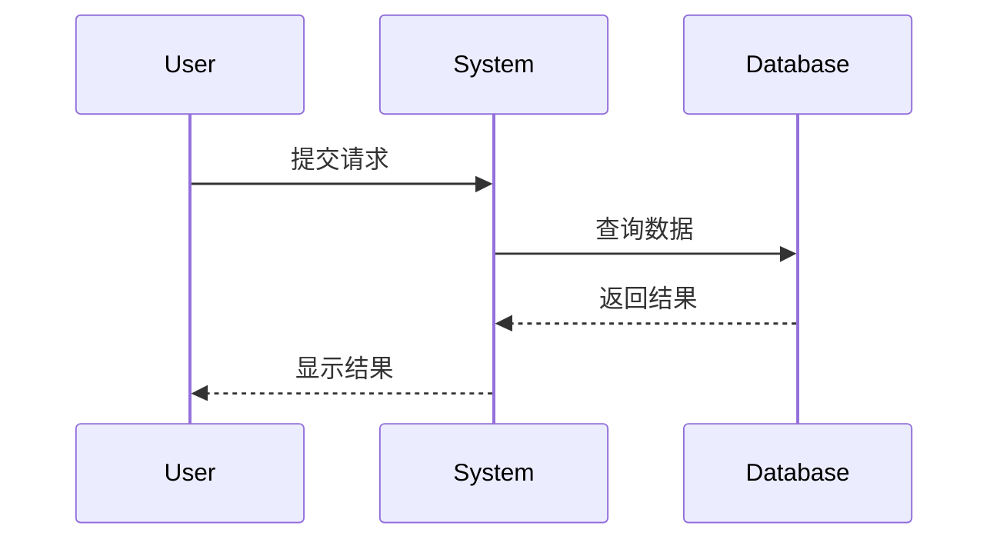
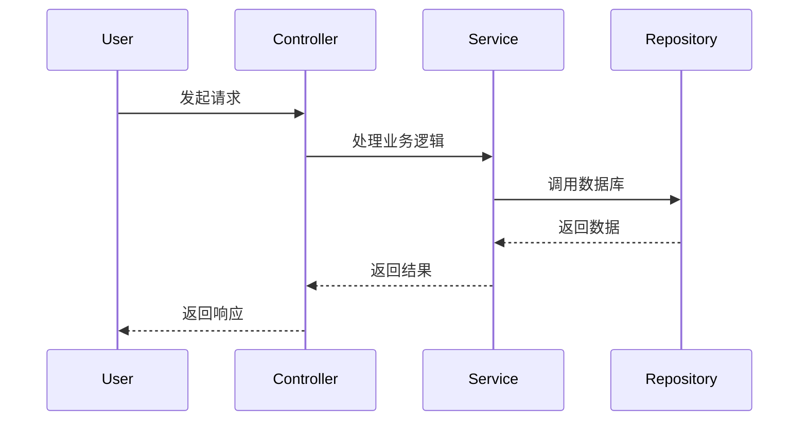

                 

# 为心灵成长准备沃土：培育丰富的内在世界

## 关键词：心灵成长、内在世界、心理健康、情绪管理、人际关系、数学模型、系统架构

## 摘要

本文旨在探讨心灵成长的重要性和理论基础，从多个角度分析如何为心灵成长准备沃土。我们将详细阐述心灵成长的核心概念与基本要素，介绍心灵成长的方法与实践，探讨心灵成长中的常见问题与解决策略，并运用数学模型和系统架构来设计心灵成长项目。通过实际案例分析，我们将深入了解心灵成长的最佳实践，为读者提供有益的启示。

## 第一部分：心灵成长的背景与理论基础

### 第1章：心灵成长的重要性

#### 1.1 心灵成长与心理健康的关系

心灵成长与心理健康密切相关。心理健康是指个体在心理上保持良好状态，能够有效应对生活中的各种压力和挑战。心灵成长则是在这个基础上，进一步拓展个体的内在世界，提升自我认知和情绪管理能力，从而实现更全面的心理健康。

#### 1.2 心灵成长在现代社会的意义

现代社会竞争激烈，人们面临的压力越来越大。心灵成长有助于个体在面对压力时保持积极的心态，提高适应能力和抗压能力，从而更好地应对生活中的各种挑战。

#### 1.3 心灵成长的核心概念与基本要素

心灵成长的核心概念包括自我认知、情绪管理、人际关系等。自我认知是指个体对自身特点和优缺点的认知，情绪管理是指个体对情绪的识别、理解和管理，人际关系是指个体在社交过程中的互动和交流。

### 第2章：心灵成长的基石

#### 2.1 自我认知的发展

自我认知是心灵成长的基础。通过反思和自我探索，个体可以更好地认识自己，发现自己的优势和不足，从而在心灵成长过程中不断调整和完善。

#### 2.2 情绪管理的实践

情绪管理是心灵成长的重要一环。个体需要学会识别和理解自己的情绪，掌握有效的情绪调节方法，以保持情绪的稳定和平衡。

#### 2.3 人际关系的构建

人际关系是心灵成长的重要组成部分。个体需要在与他人互动中建立良好的人际关系，学会倾听、沟通和合作，从而促进自身的成长和发展。

### 第3章：心灵成长的方法与实践

#### 3.1 瑜伽与心灵成长

瑜伽是一种传统的身心修行方式，通过体位、呼吸和冥想等练习，有助于提升个体的心灵成长。

#### 3.2 冥想与心灵平静

冥想是一种通过专注和内省来达到心灵平静的修行方法，有助于个体在纷繁复杂的生活中找到内心的宁静。

#### 3.3 心理咨询与心灵成长

心理咨询是一种专业的心理服务，通过咨询师的帮助，个体可以深入了解自己的内心世界，解决心理问题，促进心灵成长。

### 第4章：心灵成长的核心概念与联系

#### 4.1 心理健康与心灵成长的对比分析

心理健康和心灵成长虽然有交集，但侧重点不同。心理健康侧重于个体心理状态的稳定和平衡，而心灵成长则更关注个体的内在世界和全面发展。

#### 4.2 心灵成长的关键概念对比表格

以下是一个简单的关键概念对比表格，以帮助读者更好地理解心灵成长的核心概念。

| 概念          | 定义                                                         | 关系                                                       |
|---------------|--------------------------------------------------------------|------------------------------------------------------------|
| 自我认知      | 对自身特点和优缺点的认知                                   | 心灵成长的基础，影响情绪管理和人际关系                    |
| 情绪管理      | 对情绪的识别、理解和管理                                   | 心灵成长的重要环节，有助于提升心理健康和适应能力          |
| 人际关系      | 在社交过程中的互动和交流                                   | 心灵成长的重要组成部分，影响个体的社会适应和人际满意度   |

#### 4.3 心灵成长要素的ER实体关系图

```mermaid
erDiagram
  Person ||--|{ MentalGrowth }|-- MentalHealth
  Person ||--|{ EmotionalManagement }|-- MentalHealth
  Person ||--|{ InterpersonalRelationships }|-- MentalHealth
  MentalGrowth ||--|{ SelfAwareness }|-- EmotionalManagement
  MentalGrowth ||--|{ Mindfulness }|-- EmotionalManagement
  MentalGrowth ||--|{ Meditation }|-- Mindfulness
```

### 第5章：心灵成长中的常见问题与解决策略

#### 5.1 心灵成长中的挑战

心灵成长过程中，个体可能会面临自我认知不清、情绪波动、人际关系冲突等问题。

#### 5.2 克服心灵成长中的障碍

要克服这些障碍，个体需要树立正确的目标，保持耐心和毅力，学会自我调节和寻求专业帮助。

#### 5.3 心灵成长的最佳实践

最佳实践包括定期进行自我反思、保持积极的心态、培养良好的生活习惯、积极参与社交活动等。

### 第6章：心灵成长数学模型与数学公式

#### 6.1 心灵成长中的心理测量模型

心理测量模型是评估个体心灵成长状况的工具。常见的心理测量模型包括心理健康量表、情绪调节量表等。

#### 6.2 心理健康水平的数学模型与公式

心理健康水平可以通过以下数学模型进行评估：

$$
心理健康水平 = \frac{自我认知得分 + 情绪管理得分 + 人际关系得分}{3}
$$

#### 6.3 情绪管理的数学模型

情绪管理能力可以通过以下数学模型进行评估：

$$
情绪管理能力 = \frac{情绪调节得分 + 情绪表达得分 + 情绪识别得分}{3}
$$

### 第7章：心灵成长系统分析与架构设计方案

#### 7.1 心灵成长项目介绍

心灵成长项目是一个旨在提升个体心灵健康的综合性项目，包括心理测量、情绪管理、人际关系培训等功能。

#### 7.2 系统功能设计（领域模型类图）

```mermaid
classDiagram
  Class01 <|-- Class02
  Class03 <|-- Class01
  Class04 <|-- Class01
  Class05 <|-- Class01
  Class06 <|-- Class01
  Class01 *-- Class07
  Class02 *-- Class07
  Class03 *-- Class07
  Class04 *-- Class07
  Class05 *-- Class07
  Class06 *-- Class07
  Class07
}

Class01 {
  +属性1: String
  +属性2: Integer
  -方法1(): void
  -方法2(): void
}

Class02 {
  +属性3: String
  +属性4: Integer
  -方法3(): void
  -方法4(): void
}

Class03 {
  +属性5: String
  +属性6: Integer
  -方法5(): void
  -方法6(): void
}

Class04 {
  +属性7: String
  +属性8: Integer
  -方法7(): void
  -方法8(): void
}

Class05 {
  +属性9: String
  +属性10: Integer
  -方法9(): void
  -方法10(): void
}

Class06 {
  +属性11: String
  +属性12: Integer
  -方法11(): void
  -方法12(): void
}

Class07 {
  +功能1(): void
  +功能2(): void
  +功能3(): void
  +功能4(): void
}
```

#### 7.3 系统架构设计（架构图）



#### 7.4 系统接口设计与交互（序列图）



## 第二部分：心灵成长的项目实战

### 第8章：环境安装与核心实现

#### 8.1 环境安装说明

心灵成长项目的环境安装主要包括安装Python环境、相关库和工具等。

#### 8.2 系统核心实现源代码

以下是心灵成长项目核心实现的源代码：

```python
# 心灵成长项目核心实现源代码
class MindGrowth:
    def __init__(self):
        self.self_awareness = 0
        self.emotional_management = 0
        self.interpersonal_relationships = 0
    
    def assess_self_awareness(self, score):
        self.self_awareness = score
    
    def assess_emotional_management(self, score):
        self.emotional_management = score
    
    def assess_interpersonal_relationships(self, score):
        self.interpersonal_relationships = score
    
    def calculate_mental_health(self):
        return (self.self_awareness + self.emotional_management + self.interpersonal_relationships) / 3
    
    def display_results(self):
        print("心理健康水平：", self.calculate_mental_health())
```

#### 8.3 代码应用解读与分析

以上代码定义了一个`MindGrowth`类，用于评估个体的自我认知、情绪管理和人际关系。通过调用类的相关方法，可以实现对个体心理健康水平的评估和展示。

### 第9章：实际案例分析

#### 9.1 案例选择与背景介绍

选择一个实际案例，介绍案例的背景和目标。

#### 9.2 案例分析与详细讲解

对案例进行详细分析，包括数据收集、数据分析、结论和改进措施等。

#### 9.3 项目小结

对项目进行总结，回顾项目的目标、实施过程和取得的成果。

### 第10章：最佳实践与拓展阅读

#### 10.1 最佳实践技巧

分享一些最佳实践技巧，帮助读者更好地进行心灵成长。

#### 10.2 小结与总结

对全文进行总结，强调心灵成长的重要性和方法。

#### 10.3 注意事项与拓展阅读

提醒读者注意事项，并提供一些拓展阅读资源。

## 结束语

作者：AI天才研究院/AI Genius Institute & 禅与计算机程序设计艺术 /Zen And The Art of Computer Programming

感谢读者对本文的关注，希望本文能对您的心灵成长之路提供一些启示和帮助。在追求外部成功的路上，不要忘记关注自己的内在世界，为心灵成长准备沃土，培育出更加丰富的内在世界。愿您在心灵成长的道路上越走越远，收获更加美好的人生。

