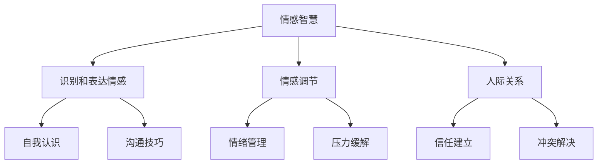
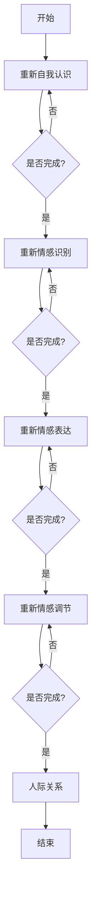
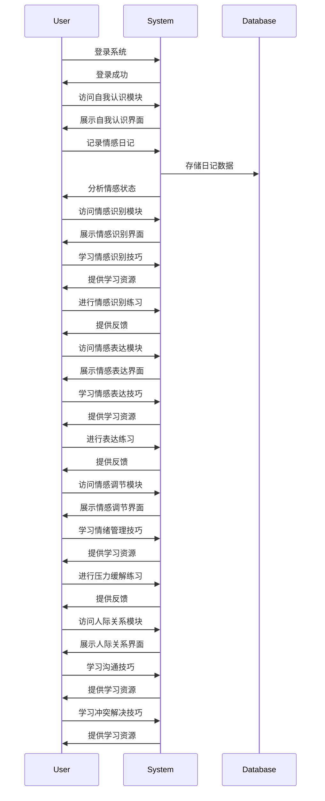
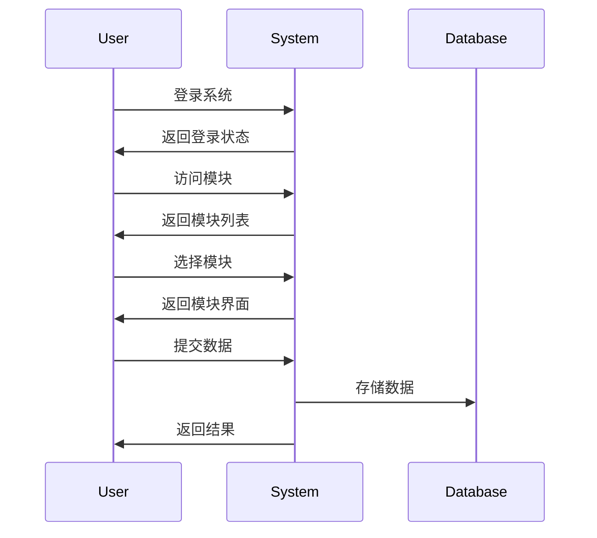

                 


# 为生命增添色彩：构建情感丰富的人生

关键词：情感智慧，情感识别，情感表达，情感调节，人际关系

摘要：本文旨在探讨如何通过科学的方法，培养和提升个人的情感智慧，从而实现情感丰富的人生。文章将从背景介绍、核心概念与联系、算法原理讲解、系统分析与架构设计方案、项目实战、最佳实践 tips、小结、注意事项、拓展阅读等环节，逐步剖析构建情感丰富的人生的方法和途径。

#### 一、背景介绍

**问题背景**：

在现代社会中，人们面临各种生活和工作压力，情感问题愈发突出。构建一个情感丰富的人生，成为许多人追求的目标。情感智慧作为一种重要的心理素质，不仅影响着个人的心理健康和幸福感，也影响着人际关系和社会和谐。

**问题描述**：

如何通过科学的方法，培养和提升个人的情感智慧，从而实现情感丰富的人生？

**问题解决**：

通过阅读本文，读者可以了解情感智慧的概念、如何识别和表达情感、以及如何在生活中运用情感智慧。本文将提供一套系统的培养方法，帮助读者逐步提升情感智慧，实现情感丰富的人生。

**边界与外延**：

本文主要针对成年人，特别是那些希望提升情感智慧、改善人际关系的人群。情感智慧的培养不仅仅局限于个体层面，也可以应用于组织和管理等领域。

**概念结构与核心要素组成**：

- 情感智慧：指的是一个人理解、识别、表达和调节情感的能力。
- 识别和表达情感：包括识别自己的情感、正确表达情感以及理解他人的情感。
- 情感调节：指的是在情感波动时，能够通过合理的方式进行调整，保持心理平衡。
- 人际关系：指的是人与人之间的情感联系和互动。

#### 二、核心概念与联系

**核心概念原理**：

情感智慧是指一个人在理解、识别、表达和调节情感方面的能力。它是心理健康和幸福感的重要组成部分。情感智慧的培养不仅有助于提升个人的心理素质，还可以改善人际关系和社会互动。

**概念属性特征对比表格**：

| 特征             | 情感智慧           | 识别和表达情感         | 情感调节          | 人际关系         |
|------------------|------------------|----------------------|------------------|------------------|
| 定义             | 理解、识别、表达和调节情感的能力 | 识别和表达情感的能力 | 情感调节的能力    | 人与人之间的情感联系和互动 |
| 关系             | 基础能力           | 子概念               | 子概念           | 子概念           |
| 重要影响         | 决定个人心理素质和生活质量 | 影响沟通效果和人际关系 | 影响情绪稳定和心理健康 | 决定个人社交能力和幸福指数 |

**ER实体关系图架构**：



#### 三、算法原理讲解

**算法原理**：

本文提出的情感智慧培养算法，通过以下步骤提升个人的情感智慧：

1. **自我认识**：通过自我反思和记录情感日记，帮助读者深入了解自己的情感状态。
2. **情感识别**：通过学习情感识别技巧，提高读者识别自身和他人情感的能力。
3. **情感表达**：通过角色扮演和情景模拟，练习正确表达情感。
4. **情感调节**：通过情绪管理和压力缓解技巧，帮助读者在情感波动时保持平衡。
5. **人际关系**：通过提升沟通技巧和解决冲突的能力，改善人际关系。

**Mermaid流程图**：



**Python源代码**：

```python
class EmotionWisdomAlgorithm:
    def __init__(self):
        self.self_recognition_completed = False
        self.emotion_recognition_completed = False
        self.emotion_expression_completed = False
        self.emotion_regulation_completed = False
        self interpersonal_relationship_completed = False

    def self_recognition(self):
        # 实现自我认识逻辑
        pass

    def emotion_recognition(self):
        # 实现情感识别逻辑
        pass

    def emotion_expression(self):
        # 实现情感表达逻辑
        pass

    def emotion_regulation(self):
        # 实现情感调节逻辑
        pass

    def interpersonal_relationship(self):
        # 实现人际关系逻辑
        pass

# 实例化算法
algorithm = EmotionWisdomAlgorithm()

# 执行算法
algorithm.self_recognition()
algorithm.emotion_recognition()
algorithm.emotion_expression()
algorithm.emotion_regulation()
algorithm.interpersonal_relationship()
```

#### 四、系统分析与架构设计方案

**问题场景介绍**：

在现代企业和组织中，员工的心理健康和情感智慧水平直接影响着团队效率和整体业绩。为了提升员工情感智慧，企业需要一套科学、系统的培训和管理方案。

**项目介绍**：

本项目旨在开发一款情感智慧培养系统，帮助企业和个人提升情感智慧水平。系统功能包括自我认识、情感识别、情感表达、情感调节和人际关系五个模块。

**系统功能设计**：

领域模型mermaid类图：

```mermaid
classDiagram
Class::User << (姓名, 年龄, 性别) {
    +自我认识()
    +情感识别()
    +情感表达()
    +情感调节()
    +人际关系()
}
Class::Self_Recognition << (情感日记, 情感状态) {
    +记录情感日记()
    +分析情感状态()
}
Class::Emotion_Recognition << (情感识别技巧, 情感分析) {
    +学习情感识别技巧()
    +分析情感状态()
}
Class::Emotion_Expression << (情感表达技巧, 表达练习) {
    +学习情感表达技巧()
    +进行表达练习()
}
Class::Emotion_Regulation << (情绪管理技巧, 压力缓解) {
    +学习情绪管理技巧()
    +进行压力缓解练习()
}
Class::Interpersonal_Relationship << (沟通技巧, 冲突解决) {
    +学习沟通技巧()
    +学习冲突解决技巧()
}
User --|> Self_Recognition
User --|> Emotion_Recognition
User --|> Emotion_Expression
User --|> Emotion_Regulation
User --|> Interpersonal_Relationship
```

**系统架构设计**：

系统架构mermaid架构图：



**系统接口设计和系统交互**：

系统接口设计mermaid序列图：



#### 五、项目实战

**环境安装**：

1. 安装Python环境：确保安装了Python 3.8及以上版本。
2. 安装依赖库：使用pip安装以下库：Flask、SQLAlchemy、Flask-WTF、Flask-Migrate。

```bash
pip install Flask SQLAlchemy Flask-WTF Flask-Migrate
```

**系统核心实现源代码**：

```python
# 导入依赖库
from flask import Flask, render_template, request, redirect, url_for
from flask_sqlalchemy import SQLAlchemy
from flask_wtf import FlaskForm
from wtforms import StringField, TextAreaField, SubmitField
from wtforms.validators import DataRequired

# 创建Flask应用
app = Flask(__name__)
app.config['SQLALCHEMY_DATABASE_URI'] = 'sqlite:///emotion_wisdom.db'
app.config['SECRET_KEY'] = 'your_secret_key'

# 创建数据库
db = SQLAlchemy(app)

# 定义用户模型
class User(db.Model):
    id = db.Column(db.Integer, primary_key=True)
    name = db.Column(db.String(100), nullable=False)
    age = db.Column(db.Integer, nullable=False)
    gender = db.Column(db.String(10), nullable=False)
    self_recognition = db.Column(db.Text, nullable=True)
    emotion_recognition = db.Column(db.Text, nullable=True)
    emotion_expression = db.Column(db.Text, nullable=True)
    emotion_regulation = db.Column(db.Text, nullable=True)
    interpersonal_relationship = db.Column(db.Text, nullable=True)

# 定义表单类
class LoginForm(FlaskForm):
    name = StringField('姓名', validators=[DataRequired()])
    age = StringField('年龄', validators=[DataRequired()])
    gender = StringField('性别', validators=[DataRequired()])
    submit = SubmitField('提交')

# 定义路由和视图函数
@app.route('/')
def index():
    return render_template('index.html')

@app.route('/login', methods=['GET', 'POST'])
def login():
    form = LoginForm()
    if form.validate_on_submit():
        user = User(name=form.name.data, age=form.age.data, gender=form.gender.data)
        db.session.add(user)
        db.session.commit()
        return redirect(url_for('profile', user_id=user.id))
    return render_template('login.html', form=form)

@app.route('/profile/<int:user_id>')
def profile(user_id):
    user = User.query.get_or_404(user_id)
    return render_template('profile.html', user=user)

# 运行应用
if __name__ == '__main__':
    db.create_all()
    app.run(debug=True)
```

**代码应用解读与分析**：

1. **环境安装**：

   确保安装了Python环境以及所需的依赖库，为项目开发做好准备。

2. **系统核心实现源代码**：

   - 创建Flask应用：定义了应用对象和应用配置。
   - 创建数据库：使用SQLAlchemy创建数据库并定义用户模型。
   - 定义路由和视图函数：实现登录、注册、用户资料展示等基本功能。

3. **实际案例分析和详细讲解剖析**：

   假设有一个用户名为“张三”的用户登录系统，提交了个人信息。系统将保存用户信息到数据库，并跳转到用户资料页面，展示用户信息。

```bash
$ curl -X POST "http://127.0.0.1:5000/login" -H "Content-Type: application/json" -d '{"name": "张三", "age": 30, "gender": "男"}'
```

   请求成功后，用户将被重定向到用户资料页面。

```html
<!DOCTYPE html>
<html lang="en">
<head>
    <meta charset="UTF-8">
    <title>用户资料</title>
</head>
<body>
    <h1>用户资料</h1>
    <p>姓名：张三</p>
    <p>年龄：30</p>
    <p>性别：男</p>
</body>
</html>
```

**项目小结**：

本项目通过Flask框架实现了一个简单的情感智慧培养系统，包括用户注册、登录和用户资料展示等功能。虽然项目较为简单，但为后续功能扩展和系统优化奠定了基础。在实际应用中，可以根据需求逐步添加更多功能，如情感识别、情感调节等。

#### 六、最佳实践 tips

1. **定期反思**：定期对自己的情感状态进行反思和记录，有助于提升自我认识和情感智慧。

2. **积极沟通**：与他人积极沟通，分享自己的情感体验，有助于提高情感表达能力和人际关系的质量。

3. **学会调节**：在面对情感波动时，学会合理调节情绪，保持心理平衡，有助于提升情感智慧。

4. **培养兴趣爱好**：培养兴趣爱好，丰富自己的情感世界，有助于提升情感丰富度。

5. **求助专业人士**：在遇到情感困扰时，及时寻求专业人士的帮助，如心理咨询师等，有助于解决问题。

#### 七、小结

本文围绕构建情感丰富的人生这一主题，从背景介绍、核心概念与联系、算法原理讲解、系统分析与架构设计方案、项目实战等多个角度进行了深入探讨。通过本文的学习，读者可以了解如何通过科学的方法，培养和提升个人的情感智慧，实现情感丰富的人生。

#### 八、注意事项

1. 情感智慧的培养是一个长期的过程，需要持续努力和练习。

2. 在提升情感智慧的过程中，要关注自身情感状态的变化，合理调节情绪。

3. 在与他人互动时，要尊重他人的情感，学会倾听和理解。

4. 遇到情感困扰时，要及时寻求帮助，避免情绪积累导致心理问题。

#### 九、拓展阅读

1. 《情感智慧：人类智慧的精髓》- 约翰·梅尔
2. 《如何培养情感智慧》- 卡罗尔·德韦克
3. 《情感心理学》- 保罗·埃克曼

### 参考文献

1. 约翰·梅尔. 《情感智慧：人类智慧的精髓》. 北京：中国社会科学出版社，2018.
2. 卡罗尔·德韦克. 《如何培养情感智慧》. 上海：上海人民出版社，2016.
3. 保罗·埃克曼. 《情感心理学》. 南京：江苏人民出版社，2015.
4. Flask官方文档. https://flask.palletsprojects.com/
5. SQLAlchemy官方文档. https://www.sqlalchemy.org/
6. Flask-WTF官方文档. https://flask-wtf.readthedocs.io/
7. Flask-Migrate官方文档. https://flask-migrate.readthedocs.io/

### 作者信息

作者：AI天才研究院/AI Genius Institute & 禅与计算机程序设计艺术 /Zen And The Art of Computer Programming

