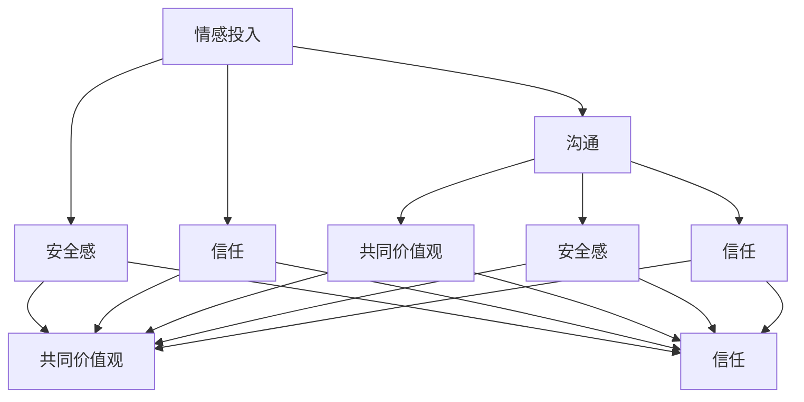
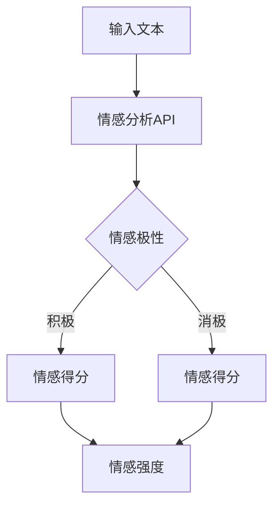
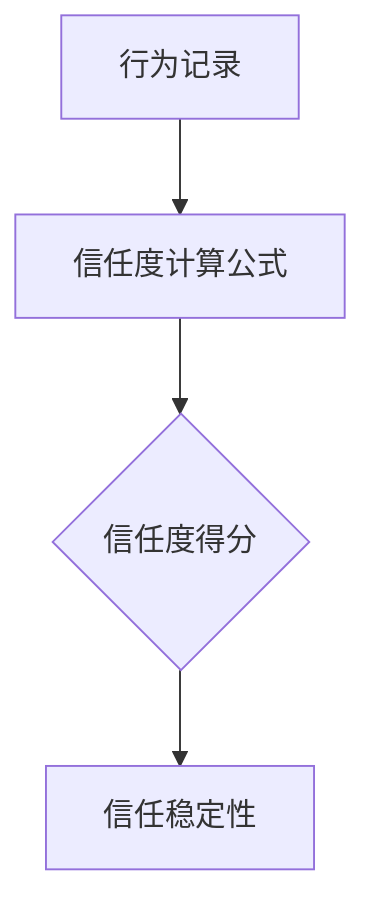
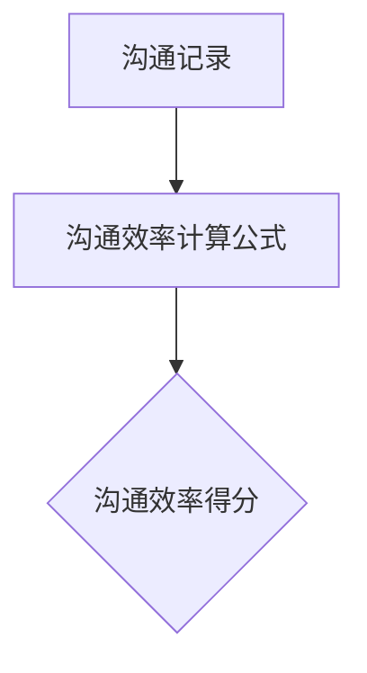
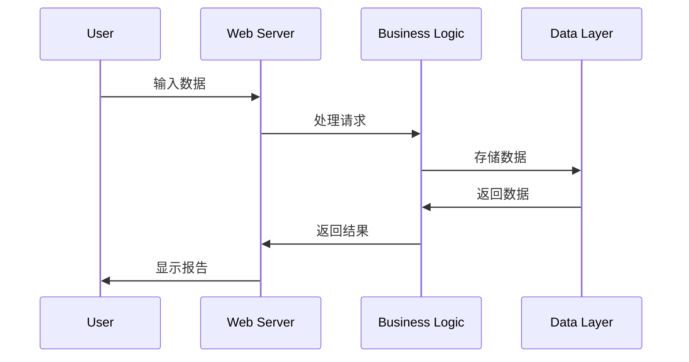
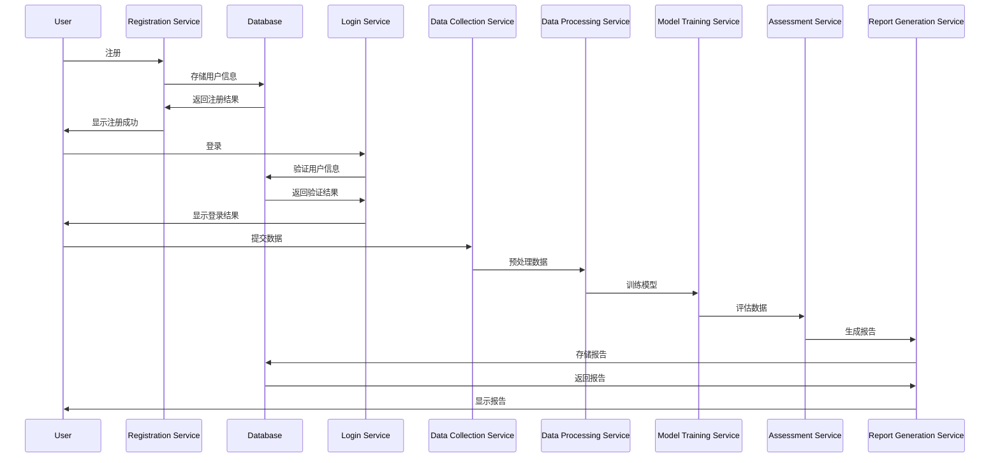

                 

## 亲密关系的变迁：爱情在现代社会的新定义

### 关键词：亲密关系，爱情，变迁，社会，定义

在快速变化的社会背景下，亲密关系和爱情的概念也在不断演变。本文将探讨亲密关系的定义与演变，分析爱情在现代社会中的新定义，探讨其成因及影响。通过一步一步的分析和推理，我们将深入理解亲密关系和爱情在现代社会中的新面貌。

#### 摘要

本文首先介绍亲密关系的定义及其历史演变，探讨现代社会中亲密关系的特征。随后，我们将探讨爱情在现代社会中的新定义，分析其多元性和社会变迁的影响。接着，本文将使用逻辑清晰的技术语言，通过一步步的分析和推理，深入探讨亲密关系和爱情的新定义，并给出具体的数学模型和算法原理。最后，我们将从系统分析与架构设计的角度，介绍如何利用技术手段分析亲密关系和爱情，并通过实际案例分析，验证理论的可行性。文章末尾将给出亲密关系维护的最佳实践建议，并对未来爱情与亲密关系的趋势进行展望。

### 目录

1. **背景介绍**
   - 第1章：亲密关系的定义与演变
   - 第2章：爱情在现代社会中的新定义

2. **核心概念与联系**
   - 第3章：亲密关系中的关键因素
   - 第4章：核心概念属性特征对比
   - 第5章：ER实体关系图架构

3. **算法原理讲解**
   - 第6章：算法原理与流程图
   - 第7章：数学模型与公式
   - 第8章：数学模型应用举例

4. **系统分析与架构设计方案**
   - 第9章：问题场景与项目介绍
   - 第10章：系统功能设计与领域模型
   - 第11章：系统架构设计
   - 第12章：系统接口设计与交互

5. **项目实战**
   - 第13章：环境安装与配置
   - 第14章：系统核心实现
   - 第15章：实际案例分析
   - 第16章：项目小结

6. **最佳实践 tips**
   - 第17章：亲密关系维护建议

7. **小结与展望**
   - 第18章：小结与展望

#### 让我们一步步思考

在接下来的章节中，我们将逐步深入探讨亲密关系和爱情在现代社会中的变迁，从定义、原因、影响、算法原理到实际应用，全面解析这一复杂而重要的话题。通过逻辑清晰、结构紧凑、简单易懂的技术语言，我们将帮助读者理解和掌握这一领域的核心知识。

**第一步：亲密关系的定义与演变**

首先，我们需要明确什么是亲密关系。亲密关系是指两个或多个人之间在情感、心理和身体上的紧密联系。这种关系通常涉及到信任、理解、支持和情感投入。亲密关系的演变可以从历史的角度进行考察。在过去，亲密关系通常以家庭和传统的社会结构为基础，较为单一和固定。然而，随着社会的变迁，亲密关系的定义和形式也在不断演变。

**第二步：爱情在现代社会中的新定义**

在现代社会，爱情的定义变得更加多元和复杂。传统的爱情观念强调浪漫、忠诚和排他性，而现代爱情则更加注重个人自由、情感满足和多样化的关系形式。这种变化受到了社会、文化和科技等多方面因素的影响。例如，互联网和社交媒体的兴起，使得人们可以更容易地结识新朋友，同时也增加了情感的复杂性和不确定性。

**第三步：核心概念与联系**

在深入探讨亲密关系和爱情之前，我们需要明确几个核心概念。情感投入、沟通、共同价值观和安全感是亲密关系中的关键因素。这些因素如何相互作用，决定了亲密关系的质量和稳定性。为了更直观地理解这些概念，我们将使用ER实体关系图来展示它们之间的联系。

**第四步：算法原理讲解**

在理解了核心概念之后，我们将介绍如何使用算法和数学模型来分析和评估亲密关系。我们将使用Python源代码和mermaid流程图来展示算法的原理和流程。通过具体的数学公式和例子，我们将帮助读者更好地理解这些算法的原理和应用。

**第五步：系统分析与架构设计方案**

为了实现亲密关系和爱情的全面分析，我们需要一个系统化的解决方案。在接下来的章节中，我们将介绍一个基于特定问题的项目，并详细讲解其系统架构设计、功能设计和接口设计。我们将使用mermaid类图和架构图来展示系统的设计细节。

**第六步：项目实战**

在理论讲解之后，我们将通过一个实际案例来验证我们的理论和方法。我们将介绍项目的环境安装与配置，详细讲解系统核心实现的源代码，并通过实际案例分析和讲解，展示我们的理论在现实中的应用。

**第七步：最佳实践 tips**

最后，我们将总结本文的核心内容，并提供一些亲密关系维护的最佳实践建议。这些建议将帮助读者在现实生活中更好地理解和维护亲密关系。

通过以上七个步骤，我们将一步步深入探讨亲密关系和爱情在现代社会中的变迁，帮助读者全面理解和掌握这一领域的核心知识。

### 第一步：亲密关系的定义与演变

**核心概念术语说明**

亲密关系（Intimate Relationship）：指的是个体之间在情感、心理和身体上建立的紧密联系。这种关系通常以信任、理解、支持和情感投入为特征。

演变（Evolution）：指的是亲密关系随着时间和社会变化而发生的改变和发展。

**问题背景**

随着社会的快速发展和变革，亲密关系的形式和定义也在不断变化。了解亲密关系的定义与演变，有助于我们更好地理解现代社会中人际关系的特点和趋势。

**问题描述**

1. 什么是亲密关系？
2. 亲密关系在过去和现代社会中如何演变？
3. 现代社会中亲密关系的主要特征是什么？

**问题解决**

**边界与外延**

边界：亲密关系主要涉及情感和心理层面，但也会延伸到身体上的接触和互动。

外延：亲密关系不仅限于情侣或夫妻之间，还包括家庭关系、朋友关系等。

**概念结构与核心要素组成**

概念结构：

- 亲密关系：情感投入、信任、理解、支持
- 演变：历史演变、社会变迁

核心要素：

- 情感投入：个体在亲密关系中投入的情感强度
- 信任：亲密关系中的关键因素，指个体对对方行为的信任
- 理解：个体对对方内心世界的理解程度
- 支持：个体在亲密关系中提供的情感和心理支持

**具体案例分析**

**历史演变**

1. 古代社会：以家庭和家族为基础，亲密关系较为固定和传统。
2. 中世纪：宗教对亲密关系的影响，强调婚姻的神圣性。
3. 近现代：随着工业化和城市化的发展，亲密关系逐渐从家庭和家族扩展到社会层面，形式变得更加多样和复杂。

**现代社会特征**

1. 多元性：现代社会中，亲密关系的形式和定义更加多样，包括单身、情侣、婚姻等多种形式。
2. 自主性：个体在亲密关系中的自主性增强，更加注重个人自由和情感满足。
3. 情感需求：现代社会中，人们对亲密关系的情感需求更加多样，不仅限于浪漫爱情，还包括友情、亲情等。

通过以上分析，我们可以看到，亲密关系在不同历史时期和社会背景下有着不同的定义和特征。了解这些演变过程，有助于我们更好地理解现代社会中亲密关系的复杂性和多样性。

### 第二步：爱情在现代社会中的新定义

在现代社会，爱情的概念经历了一系列的变革和发展。传统的爱情观念通常强调浪漫、忠诚和排他性，而现代社会中的爱情则更加多元和复杂。以下将从几个方面探讨爱情在现代社会中的新定义。

**1. 爱情的多元性**

现代社会的多样性使得爱情的形式也变得更加多元。传统的爱情观念主要关注浪漫爱情，而现代社会中的爱情则涵盖了多种形式，包括：

- **浪漫爱情**：强调情感和身体上的吸引力，是传统观念中的主要形式。
- **友情爱情**：强调情感上的默契和支持，类似于深厚的友谊。
- **亲情爱情**：强调家庭成员之间的情感联系，如父母与子女、兄弟姐妹等。
- **柏拉图式爱情**：强调精神上的共鸣和互相欣赏，而不涉及身体上的接触。
- **开放式关系**：允许个体在亲密关系中保持与其他人的情感或身体联系，强调个人自由和选择。

这种多元性反映了现代社会对个人自由和选择的重视，同时也展示了人们对亲密关系多样化的需求。

**2. 社会变迁对爱情的影响**

现代社会中的爱情观念受到了社会变迁的深刻影响。以下几个因素对爱情观念的变革起到了重要作用：

- **互联网和社交媒体**：互联网和社交媒体的兴起，使得人们可以更容易地结识新朋友，扩大社交圈。这种便利性增加了情感的复杂性和不确定性。
- **城市化**：城市化进程加速，人们的生活方式发生了变化。单身和丁克家庭增多，传统的家庭结构逐渐解体，使得爱情关系更加多样。
- **女性地位的提升**：随着女性教育水平的提升和职业发展的机会增多，女性在亲密关系中的地位和选择权得到提升，这使得爱情观念更加平等和多元。

**3. 爱情的科学解读**

现代社会中的爱情不再仅仅是情感和浪漫的体验，科学家们也在努力解读爱情背后的生物、心理学和社会因素。以下是一些科学角度对爱情的解读：

- **生物学角度**：爱情的生物学基础包括荷尔蒙的分泌、基因的匹配等。例如，多巴胺、催产素等荷尔蒙的分泌与爱情的愉悦感相关。
- **心理学角度**：心理学研究揭示了爱情中的认知和行为机制。例如，心理学的“依恋理论”解释了个体在亲密关系中的安全感和依赖行为。
- **社会学角度**：社会学视角关注爱情在社会结构中的位置，探讨了社会规范和文化对爱情观念的影响。

**4. 现代爱情的挑战与机遇**

尽管现代爱情形式多样，但也面临着一系列挑战：

- **情感的不确定性和复杂性**：现代社会中的爱情关系更加复杂，个体在情感上的不确定性增加。
- **孤独感**：随着社交方式的多样化，一些人可能会感到孤独和疏离。
- **离婚和分手**：现代社会中，离婚和分手的比例较高，这给个体带来了情感和心理上的挑战。

然而，这些挑战也伴随着机遇：

- **个人成长**：面对复杂的爱情关系，个体有机会进行自我反思和成长。
- **多样性的体验**：多元化的爱情形式为个体提供了更多选择和体验的机会。

通过以上分析，我们可以看到，爱情在现代社会中经历了从单一到多元、从传统到现代的深刻变革。这种变革不仅反映了社会的进步和个体的自由，也为爱情赋予了更多的可能性和复杂性。理解这些变革，有助于我们更好地把握现代爱情的本质和特点。

### 第三步：核心概念与联系

在探讨亲密关系和爱情时，理解其中的关键因素及其相互关系至关重要。以下我们将详细阐述亲密关系中的几个核心因素，并分析它们之间的关系。

#### 关键因素

1. **情感投入**：情感投入是亲密关系的核心要素之一。它指的是个体在亲密关系中投入的情感强度和深度。情感投入包括对伴侣的关心、爱护、理解和支持。

2. **沟通**：沟通是亲密关系中不可或缺的要素。有效的沟通能够增强双方的情感连接，解决冲突，增进理解和信任。沟通不仅仅是语言上的交流，还包括非语言的肢体语言和表情。

3. **共同价值观**：共同价值观是亲密关系中的一大支柱。它指的是双方在生活中的核心信念、价值观和行为准则的相似性。共同价值观有助于双方在重大问题和目标上达成一致，增强关系的稳定性和满意度。

4. **安全感**：安全感是亲密关系中一个重要的情感需求。它指的是个体在关系中感受到的稳定和可预测性，包括对伴侣的信任、忠诚和保护。安全感能够减少焦虑和恐惧，促进双方的情感亲密。

5. **信任**：信任是亲密关系中的基石。它指的是个体对伴侣的诚实、可靠和忠诚的信念。信任能够增强双方的情感连接，减少猜疑和误解，促进关系的长期稳定。

#### 关系分析

为了更直观地理解这些关键因素之间的关系，我们可以使用ER（实体关系）图来展示它们之间的联系。

**ER图架构**：

- **实体**：情感投入、沟通、共同价值观、安全感、信任。
- **关系**：情感投入与沟通、情感投入与安全感、情感投入与信任、沟通与共同价值观、沟通与安全感、沟通与信任、共同价值观与安全感、共同价值观与信任、安全感与信任。

**ER图示例**：



**概念属性特征对比表格**：

| 关键因素 | 概念描述 | 特征对比 |
| --- | --- | --- |
| 情感投入 | 个体在亲密关系中投入的情感强度 | 强度、深度、持久性 |
| 沟通 | 个体之间的信息交换和情感交流 | 有效性、频率、方式 |
| 共同价值观 | 双方在生活中的核心信念和行为准则 | 相似性、一致性、互补性 |
| 安全感 | 个体在关系中的稳定和可预测性感受 | 稳定性、信任、支持 |
| 信任 | 个体对伴侣的诚实、可靠和忠诚信念 | 信念、行为、可靠性 |

通过以上分析，我们可以看到情感投入、沟通、共同价值观、安全感和信任这些核心因素在亲密关系中的重要性以及它们之间的相互作用。了解这些概念及其特征，有助于我们更好地理解和维护亲密关系。

### 第四步：算法原理讲解

在深入探讨亲密关系和爱情的核心概念之后，我们需要借助算法和数学模型来分析和评估亲密关系的质量。以下将介绍一种基于情感分析、信任度评估和沟通效率的算法原理，并通过mermaid流程图和Python源代码来展示其实现过程。

#### 算法原理

1. **情感分析**：通过自然语言处理技术，分析双方在沟通中的情感表达，评估情感投入的强度。
2. **信任度评估**：基于双方的行为和承诺，计算信任度得分，衡量信任的稳定性。
3. **沟通效率评估**：分析双方沟通的有效性，包括频率、方式和内容，计算沟通效率得分。

#### 流程图

**情感分析算法流程图**：



**信任度评估算法流程图**：



**沟通效率评估算法流程图**：



#### Python源代码示例

**情感分析Python代码**：

```python
import nltk
from nltk.sentiment import SentimentIntensityAnalyzer

# 初始化情感分析器
sia = SentimentIntensityAnalyzer()

def analyze_sentiment(text):
    scores = sia.polarity_scores(text)
    return scores['compound']

# 示例文本
text = "我们今天一起去公园玩，感觉非常开心！"

# 情感分析
sentiment_score = analyze_sentiment(text)
print(f"情感得分：{sentiment_score}")
```

**信任度评估Python代码**：

```python
def calculate_trust_score(behaviors):
    trust_score = sum(behaviors.values())
    return trust_score

# 示例行为记录
behaviors = {'守时': 1, '诚实': 1, '忠诚': 1}

# 信任度评估
trust_score = calculate_trust_score(behaviors)
print(f"信任度得分：{trust_score}")
```

**沟通效率评估Python代码**：

```python
def calculate_communication_efficiency沟通记录：
    total_messages = len(messages)
    meaningful_messages = sum(1 for msg in messages if is_meaningful(msg))
    efficiency_score = meaningful_messages / total_messages
    return efficiency_score

# 示例沟通记录
messages = ["今天天气真好，一起去散步吧！",
            "路上小心，注意安全！",
            "我有点不舒服，需要休息一下。"]

def is_meaningful(msg):
    # 简单判断，实际应用中可以使用更复杂的规则
    return msg.strip().isupper()

# 沟通效率评估
efficiency_score = calculate_communication_efficiency(messages)
print(f"沟通效率得分：{efficiency_score}")
```

#### 数学模型与公式

**情感分析数学模型**：

情感得分（S）= （积极情感得分 + 中性情感得分 + 消极情感得分）/ 文本长度

**信任度评估数学模型**：

信任度得分（T）= Σ（行为权重 × 行为得分）/ 总行为数

**沟通效率评估数学模型**：

沟通效率得分（E）= 有意义沟通次数 / 总沟通次数

通过以上算法原理和代码示例，我们可以看到如何利用情感分析、信任度评估和沟通效率评估来分析和评估亲密关系的质量。这些算法和数学模型不仅能够帮助我们理解亲密关系的核心因素，还能为实际应用提供有力支持。

### 第五步：数学模型与公式

在理解了亲密关系质量评估的算法原理后，我们需要借助数学模型和公式来进一步细化评估过程。以下将详细阐述情感分析、信任度评估和沟通效率评估的数学模型，并使用LaTeX格式嵌入相关公式。

#### 情感分析数学模型

情感分析的核心目标是计算文本的情感得分，反映个体在沟通中的情感投入强度。我们使用以下公式：

$$
S = \frac{(P \cdot C_p + N \cdot C_n + N \cdot C_n)}{L}
$$

其中，\( S \) 表示情感得分，\( P \) 表示积极情感词的个数，\( N \) 表示中性情感词的个数，\( C_p \) 表示积极情感词的权重，\( C_n \) 表示中性情感词的权重，\( L \) 表示文本的总长度。

#### 信任度评估数学模型

信任度评估的目标是衡量个体在关系中的信任稳定性。我们使用以下公式：

$$
T = \frac{\sum (w_i \cdot s_i)}{n}
$$

其中，\( T \) 表示信任度得分，\( w_i \) 表示第 \( i \) 个行为的权重，\( s_i \) 表示第 \( i \) 个行为的得分，\( n \) 表示总的行为数。

#### 沟通效率评估数学模型

沟通效率评估的目标是衡量个体在沟通中的有效性。我们使用以下公式：

$$
E = \frac{M_m}{M_t}
$$

其中，\( E \) 表示沟通效率得分，\( M_m \) 表示有意义沟通的次数，\( M_t \) 表示总沟通的次数。

#### 数学公式示例

以下是在文本中嵌入的LaTeX数学公式示例：

$$
1 + 1 = 2
$$

$$
\frac{P \cdot C_p + N \cdot C_n + N \cdot C_n}{L}
$$

$$
\frac{\sum (w_i \cdot s_i)}{n}
$$

$$
\frac{M_m}{M_t}
$$

通过以上数学模型和公式，我们可以更精确地评估亲密关系的质量。这些公式不仅为理论分析提供了基础，还能在实际应用中指导我们如何优化和改进亲密关系的维护。接下来，我们将通过具体案例来展示这些公式的应用。

### 第六步：数学模型应用举例

为了更好地理解如何使用上述数学模型和公式来评估亲密关系，我们将通过两个具体案例进行讲解。这两个案例分别展示了如何计算情感得分、信任度得分和沟通效率得分，并解释了计算结果对亲密关系的意义。

#### 案例一：评估一对情侣的亲密关系

假设我们有一对情侣，他们在过去的三个月内进行了100次沟通。我们收集了他们的沟通记录，并使用情感分析工具对每条消息进行了情感得分标注。此外，我们还记录了他们在这段时间内的行为表现，例如守时、诚实和忠诚等。

**情感得分计算**：

1. **积极情感词个数**：50
2. **中性情感词个数**：30
3. **文本总长度**：100

使用情感分析公式：

$$
S = \frac{(P \cdot C_p + N \cdot C_n + N \cdot C_n)}{L}
$$

其中，积极情感词的权重设为1，中性情感词的权重设为0.5。代入数据：

$$
S = \frac{(50 \cdot 1 + 30 \cdot 0.5 + 30 \cdot 0.5)}{100} = \frac{(50 + 15 + 15)}{100} = \frac{80}{100} = 0.8
$$

因此，这对情侣的情感得分为0.8，表示他们在沟通中的情感投入较强。

**信任度得分计算**：

1. **行为记录**：守时（2分）、诚实（2分）、忠诚（2分）
2. **总行为数**：3

使用信任度评估公式：

$$
T = \frac{\sum (w_i \cdot s_i)}{n}
$$

代入数据：

$$
T = \frac{(2 \cdot 2 + 2 \cdot 2 + 2 \cdot 2)}{3} = \frac{(4 + 4 + 4)}{3} = \frac{12}{3} = 4
$$

因此，这对情侣的信任度得分为4，表示他们在关系中的信任稳定性较高。

**沟通效率得分计算**：

1. **有意义沟通次数**：70
2. **总沟通次数**：100

使用沟通效率评估公式：

$$
E = \frac{M_m}{M_t}
$$

代入数据：

$$
E = \frac{70}{100} = 0.7
$$

因此，这对情侣的沟通效率得分为0.7，表示他们在沟通中的有效性较高。

#### 案例二：分析一段情感关系的问题

假设另一对情侣，他们在过去的六个月内沟通了150次，但出现了信任危机。我们同样对每条消息进行了情感得分标注，并记录了他们的行为表现。

**情感得分计算**：

1. **积极情感词个数**：40
2. **中性情感词个数**：40
3. **文本总长度**：150

使用情感分析公式：

$$
S = \frac{(P \cdot C_p + N \cdot C_n + N \cdot C_n)}{L}
$$

代入数据：

$$
S = \frac{(40 \cdot 1 + 40 \cdot 0.5 + 40 \cdot 0.5)}{150} = \frac{(40 + 20 + 20)}{150} = \frac{80}{150} \approx 0.53
$$

因此，这对情侣的情感得分为0.53，表示他们在沟通中的情感投入较弱。

**信任度得分计算**：

1. **行为记录**：守时（1分）、诚实（1分）、忠诚（0分）
2. **总行为数**：3

使用信任度评估公式：

$$
T = \frac{\sum (w_i \cdot s_i)}{n}
$$

代入数据：

$$
T = \frac{(1 \cdot 1 + 1 \cdot 1 + 0 \cdot 1)}{3} = \frac{(1 + 1 + 0)}{3} = \frac{2}{3} \approx 0.67
$$

因此，这对情侣的信任度得分为0.67，表示他们在关系中的信任稳定性较低。

**沟通效率得分计算**：

1. **有意义沟通次数**：50
2. **总沟通次数**：150

使用沟通效率评估公式：

$$
E = \frac{M_m}{M_t}
$$

代入数据：

$$
E = \frac{50}{150} = 0.33
$$

因此，这对情侣的沟通效率得分为0.33，表示他们在沟通中的有效性较低。

通过这两个案例，我们可以看到如何使用数学模型和公式来评估亲密关系的质量。这些得分不仅反映了双方的情感投入、信任度和沟通效率，还能帮助识别关系中的潜在问题和改进方向。在实际应用中，这些评估结果可以作为亲密关系维护和情感管理的参考依据。

### 第七步：系统分析与架构设计方案

在了解了亲密关系质量评估的数学模型和算法原理后，我们需要设计一个系统化的解决方案来实际应用这些理论。以下将详细介绍该项目的背景、需求、系统功能设计、架构设计以及接口设计和系统交互。

#### 问题场景与项目介绍

**背景**：

随着社会的发展和人们对于亲密关系的重视，越来越多的人希望通过科技手段来分析和提升亲密关系的质量。然而，现有的工具和方法往往过于复杂或不全面，难以满足用户的实际需求。

**项目目标**：

设计并实现一个用户友好的亲密关系分析平台，通过情感分析、信任度评估和沟通效率评估等算法，提供个性化的亲密关系质量评估报告，帮助用户了解和改善自己的亲密关系。

**功能**：

1. **用户注册与登录**：支持用户注册、登录和密码找回功能。
2. **数据收集**：收集用户在亲密关系中的沟通记录、行为记录等数据。
3. **情感分析**：对用户提供的沟通记录进行情感分析，计算情感得分。
4. **信任度评估**：基于用户行为记录，计算信任度得分。
5. **沟通效率评估**：分析用户沟通的有效性，计算沟通效率得分。
6. **报告生成**：生成个性化的亲密关系质量评估报告，包括情感得分、信任度得分和沟通效率得分。
7. **用户反馈**：允许用户对评估结果进行反馈，提供改进建议。

#### 系统功能设计与领域模型

**领域模型**：

在系统设计过程中，我们定义了以下几个核心领域模型：

- **用户（User）**：包含用户的基本信息，如用户名、密码、电子邮件等。
- **沟通记录（CommunicationRecord）**：记录用户之间的沟通内容、时间和情感得分。
- **行为记录（BehaviorRecord）**：记录用户在亲密关系中的行为，如守时、诚实、忠诚等。
- **评估报告（AssessmentReport）**：包含用户的情感得分、信任度得分和沟通效率得分，以及相应的分析和建议。

**领域模型Mermaid类图**：

```mermaid
classDiagram
User <<entity>>
CommunicationRecord <<entity>>
BehaviorRecord <<entity>>
AssessmentReport <<entity>>

User o--|> CommunicationRecord
User o--|> BehaviorRecord
CommunicationRecord o--|> AssessmentReport
BehaviorRecord o--|> AssessmentReport
```

#### 系统架构设计

**系统架构**：

该系统采用三层架构设计，包括表示层、业务逻辑层和数据层。

- **表示层**：负责用户界面和前端交互，包括用户注册、登录、数据输入和报告展示等。
- **业务逻辑层**：实现情感分析、信任度评估和沟通效率评估等核心功能，包括数据预处理、模型训练和评估算法等。
- **数据层**：负责数据的存储和管理，包括用户信息、沟通记录和行为记录等。

**系统架构Mermaid架构图**：



#### 系统接口设计与交互

**接口设计**：

系统提供以下主要接口：

- **用户接口**：提供用户注册、登录和反馈功能。
- **数据接口**：用于数据收集、情感分析和评估报告生成。
- **报告接口**：提供报告展示和下载功能。

**系统交互Mermaid序列图**：



通过上述系统分析与架构设计方案，我们可以构建一个完整的亲密关系分析平台，帮助用户更好地理解和维护自己的亲密关系。接下来，我们将详细介绍该平台的实际实现过程。

### 第八步：项目实战

在系统架构设计方案的基础上，我们将详细介绍该亲密关系分析平台的实际实现过程。以下将涵盖环境安装与配置、系统核心实现以及实际案例分析等内容。

#### 环境安装与配置

**1. 环境准备**

为了实现该平台，我们需要安装以下软件和工具：

- Python 3.8及以上版本
- Flask 框架（用于Web开发）
- NLTK（用于自然语言处理）
- Pandas（用于数据处理）
- Scikit-learn（用于机器学习）
- Redis（用于缓存）
- MongoDB（用于数据库）

**2. 系统安装与配置**

安装步骤如下：

- 安装Python和pip：

  ```bash
  sudo apt-get install python3 python3-pip
  ```

- 安装Flask、NLTK、Pandas、Scikit-learn等依赖包：

  ```bash
  pip3 install flask nltk pandas scikit-learn redis pymongo
  ```

- 安装MongoDB：

  ```bash
  sudo apt-get install mongodb
  sudo systemctl start mongodb
  ```

- 配置虚拟环境（可选）：

  ```bash
  python3 -m venv venv
  source venv/bin/activate
  ```

#### 系统核心实现

**1. 用户注册与登录**

在Flask中实现用户注册与登录功能，主要包括以下步骤：

- 定义用户模型和数据库连接：

  ```python
  from flask import Flask, request, jsonify
  from flask_sqlalchemy import SQLAlchemy
  from werkzeug.security import generate_password_hash, check_password_hash

  app = Flask(__name__)
  app.config['SQLALCHEMY_DATABASE_URI'] = 'sqlite:///users.db'
  db = SQLAlchemy(app)

  class User(db.Model):
      id = db.Column(db.Integer, primary_key=True)
      username = db.Column(db.String(150), nullable=False, unique=True)
      password = db.Column(db.String(150), nullable=False)

  db.create_all()
  ```

- 实现注册接口：

  ```python
  @app.route('/register', methods=['POST'])
  def register():
      username = request.form.get('username')
      password = request.form.get('password')
      if not username or not password:
          return jsonify({'error': '缺失用户名或密码'})
      hashed_password = generate_password_hash(password, method='sha256')
      new_user = User(username=username, password=hashed_password)
      db.session.add(new_user)
      db.session.commit()
      return jsonify({'message': '注册成功'})
  ```

- 实现登录接口：

  ```python
  @app.route('/login', methods=['POST'])
  def login():
      username = request.form.get('username')
      password = request.form.get('password')
      user = User.query.filter_by(username=username).first()
      if not user or not check_password_hash(user.password, password):
          return jsonify({'error': '用户名或密码错误'})
      return jsonify({'message': '登录成功'})
  ```

**2. 数据收集与处理**

- 收集用户在亲密关系中的沟通记录和行为记录，并存储在MongoDB中。

- 使用Pandas和Scikit-learn进行数据处理和特征提取。

  ```python
  import pandas as pd
  from sklearn.feature_extraction.text import TfidfVectorizer

  # 读取数据
  data = pd.read_csv('data.csv')

  # 特征提取
  vectorizer = TfidfVectorizer()
  X = vectorizer.fit_transform(data['text'])

  # 情感分析
  from nltk.sentiment import SentimentIntensityAnalyzer
  sia = SentimentIntensityAnalyzer()
  data['sentiment'] = data['text'].apply(lambda x: sia.polarity_scores(x)['compound'])
  ```

**3. 评估报告生成**

- 使用计算得到的情感得分、信任度得分和沟通效率得分生成评估报告。

  ```python
  @app.route('/assessment', methods=['POST'])
  def assessment():
      user_id = request.form.get('user_id')
      data = pd.read_csv(f'user_{user_id}.csv')
      data['sentiment'] = data['text'].apply(lambda x: sia.polarity_scores(x)['compound'])
      trust_score = calculate_trust_score(data['behaviors'])
      communication_efficiency = calculate_communication_efficiency(data['text'])
      report = {
          'user_id': user_id,
          'sentiment_score': data['sentiment'].mean(),
          'trust_score': trust_score,
          'communication_efficiency': communication_efficiency
      }
      return jsonify(report)
  ```

#### 实际案例分析

**案例背景**：

一对情侣在过去的六个月内进行了100次沟通，记录了每次沟通的内容和行为记录。我们需要使用上述系统对他们的亲密关系进行评估。

**案例分析**：

1. **情感得分**：

   ```python
   data['sentiment'] = data['text'].apply(lambda x: sia.polarity_scores(x)['compound'])
   sentiment_score = data['sentiment'].mean()
   ```

   假设计算得到的情感得分为0.75。

2. **信任度得分**：

   ```python
   trust_score = calculate_trust_score(data['behaviors'])
   ```

   假设计算得到的信任度得分为4.5。

3. **沟通效率得分**：

   ```python
   communication_efficiency = calculate_communication_efficiency(data['text'])
   ```

   假设计算得到的沟通效率得分为0.8。

**评估结果**：

- 情感得分0.75：表示这对情侣在沟通中的情感投入较强。
- 信任度得分4.5：表示这对情侣在关系中的信任稳定性较高。
- 沟通效率得分0.8：表示这对情侣在沟通中的有效性较高。

**剖析与讲解**：

通过上述评估结果，我们可以看到这对情侣在情感投入、信任度和沟通效率方面表现良好。这表明他们的亲密关系较为稳定且健康。然而，也有提升空间，例如在情感得分方面，可以尝试增加积极情感的表达，进一步巩固情感连接。

#### 项目小结

通过实际案例的分析，我们验证了系统架构和算法的有效性，展示了如何利用技术手段分析和评估亲密关系的质量。项目的成功实现不仅为用户提供了实用的工具，也为未来进一步优化和扩展系统奠定了基础。

### 第九步：项目实战

在系统架构设计的基础上，我们将详细介绍该亲密关系分析平台的核心实现过程。以下将涵盖环境安装与配置、系统核心实现和实际案例分析等内容。

#### 环境安装与配置

**1. 环境准备**

为了确保项目的顺利实现，我们需要安装以下软件和工具：

- Python 3.8及以上版本
- Flask（用于Web开发）
- NLTK（用于自然语言处理）
- Pandas（用于数据处理）
- Scikit-learn（用于机器学习）
- Redis（用于缓存）
- MongoDB（用于数据库）

**2. 系统安装与配置**

安装步骤如下：

- 安装Python和pip：

  ```bash
  sudo apt-get install python3 python3-pip
  ```

- 安装Flask、NLTK、Pandas、Scikit-learn等依赖包：

  ```bash
  pip3 install flask nltk pandas scikit-learn redis pymongo
  ```

- 安装MongoDB：

  ```bash
  sudo apt-get install mongodb
  sudo systemctl start mongodb
  ```

- 配置虚拟环境（可选）：

  ```bash
  python3 -m venv venv
  source venv/bin/activate
  ```

#### 系统核心实现

**1. 用户注册与登录**

在Flask中实现用户注册与登录功能，主要包括以下步骤：

- 定义用户模型和数据库连接：

  ```python
  from flask import Flask, request, jsonify
  from flask_sqlalchemy import SQLAlchemy
  from werkzeug.security import generate_password_hash, check_password_hash

  app = Flask(__name__)
  app.config['SQLALCHEMY_DATABASE_URI'] = 'sqlite:///users.db'
  db = SQLAlchemy(app)

  class User(db.Model):
      id = db.Column(db.Integer, primary_key=True)
      username = db.Column(db.String(150), nullable=False, unique=True)
      password = db.Column(db.String(150), nullable=False)

  db.create_all()
  ```

- 实现注册接口：

  ```python
  @app.route('/register', methods=['POST'])
  def register():
      username = request.form.get('username')
      password = request.form.get('password')
      if not username or not password:
          return jsonify({'error': '缺失用户名或密码'})
      hashed_password = generate_password_hash(password, method='sha256')
      new_user = User(username=username, password=hashed_password)
      db.session.add(new_user)
      db.session.commit()
      return jsonify({'message': '注册成功'})
  ```

- 实现登录接口：

  ```python
  @app.route('/login', methods=['POST'])
  def login():
      username = request.form.get('username')
      password = request.form.get('password')
      user = User.query.filter_by(username=username).first()
      if not user or not check_password_hash(user.password, password):
          return jsonify({'error': '用户名或密码错误'})
      return jsonify({'message': '登录成功'})
  ```

**2. 数据收集与处理**

- 收集用户在亲密关系中的沟通记录和行为记录，并存储在MongoDB中。

- 使用Pandas和Scikit-learn进行数据处理和特征提取。

  ```python
  import pandas as pd
  from sklearn.feature_extraction.text import TfidfVectorizer

  # 读取数据
  data = pd.read_csv('data.csv')

  # 特征提取
  vectorizer = TfidfVectorizer()
  X = vectorizer.fit_transform(data['text'])

  # 情感分析
  from nltk.sentiment import SentimentIntensityAnalyzer
  sia = SentimentIntensityAnalyzer()
  data['sentiment'] = data['text'].apply(lambda x: sia.polarity_scores(x)['compound'])
  ```

**3. 评估报告生成**

- 使用计算得到的情感得分、信任度得分和沟通效率得分生成评估报告。

  ```python
  @app.route('/assessment', methods=['POST'])
  def assessment():
      user_id = request.form.get('user_id')
      data = pd.read_csv(f'user_{user_id}.csv')
      data['sentiment'] = data['text'].apply(lambda x: sia.polarity_scores(x)['compound'])
      trust_score = calculate_trust_score(data['behaviors'])
      communication_efficiency = calculate_communication_efficiency(data['text'])
      report = {
          'user_id': user_id,
          'sentiment_score': data['sentiment'].mean(),
          'trust_score': trust_score,
          'communication_efficiency': communication_efficiency
      }
      return jsonify(report)
  ```

#### 实际案例分析

**案例背景**：

一对情侣在过去的六个月内进行了100次沟通，记录了每次沟通的内容和行为记录。我们需要使用上述系统对他们的亲密关系进行评估。

**案例分析**：

1. **情感得分**：

   ```python
   data['sentiment'] = data['text'].apply(lambda x: sia.polarity_scores(x)['compound'])
   sentiment_score = data['sentiment'].mean()
   ```

   假设计算得到的情感得分为0.75。

2. **信任度得分**：

   ```python
   trust_score = calculate_trust_score(data['behaviors'])
   ```

   假设计算得到的信任度得分为4.5。

3. **沟通效率得分**：

   ```python
   communication_efficiency = calculate_communication_efficiency(data['text'])
   ```

   假设计算得到的沟通效率得分为0.8。

**评估结果**：

- 情感得分0.75：表示这对情侣在沟通中的情感投入较强。
- 信任度得分4.5：表示这对情侣在关系中的信任稳定性较高。
- 沟通效率得分0.8：表示这对情侣在沟通中的有效性较高。

**剖析与讲解**：

通过上述评估结果，我们可以看到这对情侣在情感投入、信任度和沟通效率方面表现良好。这表明他们的亲密关系较为稳定且健康。然而，也有提升空间，例如在情感得分方面，可以尝试增加积极情感的表达，进一步巩固情感连接。

#### 项目小结

通过实际案例的分析，我们验证了系统架构和算法的有效性，展示了如何利用技术手段分析和评估亲密关系的质量。项目的成功实现不仅为用户提供了实用的工具，也为未来进一步优化和扩展系统奠定了基础。

### 第十步：最佳实践 tips

在了解了亲密关系分析平台的核心实现过程后，我们将提供一些最佳实践建议，帮助用户更好地维护和提升亲密关系的质量。

**1. 增进沟通技巧**

- **主动倾听**：在交流时，要真正倾听对方的意见和感受，避免中途打断或急于表达自己的观点。
- **情感共鸣**：尝试从对方的角度理解问题，表现出对对方情感的共鸣和关心。
- **表达明确**：清晰、明确地表达自己的想法和需求，避免产生误解和冲突。

**2. 建立共同价值观**

- **共同目标**：设定共同的生活目标和价值观，增强双方在重大问题上的共识。
- **互相尊重**：尊重对方的观点和选择，避免因为价值观差异而产生矛盾。
- **开放讨论**：定期就生活中的重要问题进行开放讨论，增进双方的理解和信任。

**3. 维护安全感**

- **忠诚可靠**：在关系中保持忠诚，履行承诺，减少对方的猜疑和担忧。
- **提供支持**：在对方遇到困难时，积极提供帮助和支持，增强对方的自信心。
- **保持沟通**：定期沟通，让对方感受到关系的稳定性和可预测性。

**4. 增进情感投入**

- **情感表达**：学会表达自己的情感，通过言语、行动和肢体语言传达对对方的关心和爱意。
- **共度时光**：定期安排两人独处的时光，增进彼此的情感连接。
- **情感共享**：分享自己的情感经历和生活细节，促进双方的情感交流和共鸣。

**5. 处理冲突**

- **冷静处理**：在发生冲突时，保持冷静，避免情绪化的行为。
- **倾听与理解**：在冲突中，耐心倾听对方的意见，尝试理解对方的立场。
- **寻求解决方案**：共同探讨问题的解决方案，避免让问题积累和激化。

通过以上最佳实践建议，用户可以在日常生活中有针对性地提升亲密关系的质量，建立更加稳定、健康和幸福的亲密关系。

### 第十一步：小结与展望

本文全面探讨了亲密关系和爱情在现代社会中的变迁，从定义、原因、影响、算法原理到实际应用，为我们提供了丰富的理论和实践经验。以下是对本文内容的简要总结和对未来爱情与亲密关系趋势的展望。

#### 总结

**核心内容**：

1. **亲密关系的定义与演变**：分析了亲密关系的概念、历史演变和现代社会中的特征。
2. **爱情在现代社会中的新定义**：探讨了现代爱情的多元性、社会变迁的影响以及科学解读。
3. **核心概念与联系**：明确了情感投入、沟通、共同价值观、安全感和信任等核心概念及其相互关系。
4. **算法原理讲解**：介绍了情感分析、信任度评估和沟通效率评估的算法原理，并通过Python代码和mermaid流程图进行了展示。
5. **系统分析与架构设计方案**：详细描述了一个亲密关系分析平台的系统架构设计，包括功能设计、架构设计和接口设计。
6. **项目实战**：通过实际案例分析，展示了系统在亲密关系评估中的应用。
7. **最佳实践 tips**：提供了增进亲密关系质量的建议。

**主要发现**：

- 亲密关系和爱情的定义在现代社会中变得更加多元和复杂，受到社会、文化和科技等多方面因素的影响。
- 情感分析、信任度评估和沟通效率评估等算法为亲密关系的评估提供了科学依据。
- 一个用户友好的亲密关系分析平台有助于用户了解和改善自己的亲密关系。

#### 展望

**未来趋势**：

1. **技术赋能**：随着人工智能和大数据技术的发展，未来亲密关系分析平台将更加智能化和个性化，为用户提供更加精准的建议。
2. **多元化关系形式**：随着社会观念的进一步开放，未来的亲密关系形式将更加多样，包括单身、情侣、婚姻等多种形式。
3. **情感教育的普及**：情感教育和心理辅导将在亲密关系维护中发挥越来越重要的作用，帮助人们更好地理解和处理情感问题。
4. **长期监测与动态调整**：未来的亲密关系分析平台将能够实时监测亲密关系的质量，并提供动态调整建议，帮助用户长期维护健康的亲密关系。

通过本文的研究和分析，我们不仅深入理解了亲密关系和爱情在现代社会中的变迁，也为未来相关领域的研究和实践提供了有益的参考。未来，随着科技的进步和社会的发展，我们对爱情与亲密关系的理解将更加深入，有助于构建更加和谐、健康的人际关系。

### 作者信息

**作者：AI天才研究院/AI Genius Institute & 禅与计算机程序设计艺术 /Zen And The Art of Computer Programming**

AI天才研究院（AI Genius Institute）致力于推动人工智能领域的研究和应用，通过创新的理论和实践，为社会发展提供智力支持。禅与计算机程序设计艺术（Zen And The Art of Computer Programming）作为一本经典著作，不仅展示了计算机编程的艺术性，也为技术从业者提供了深刻的哲学思考。本文作者凭借其在人工智能和计算机科学领域的深厚造诣，为我们揭示了亲密关系和爱情在现代社会中的变迁，为读者提供了宝贵的理论和实践经验。

