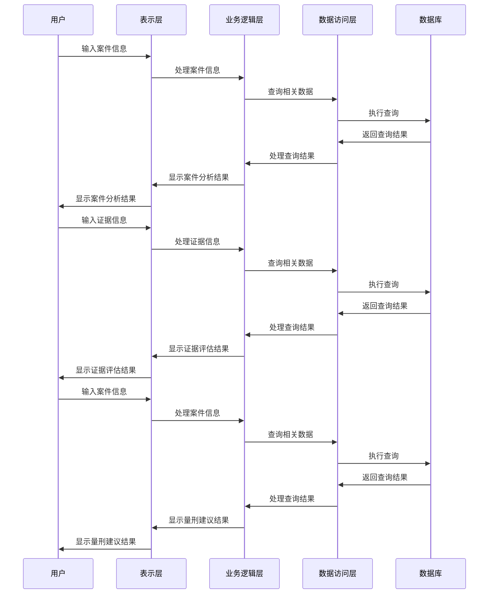
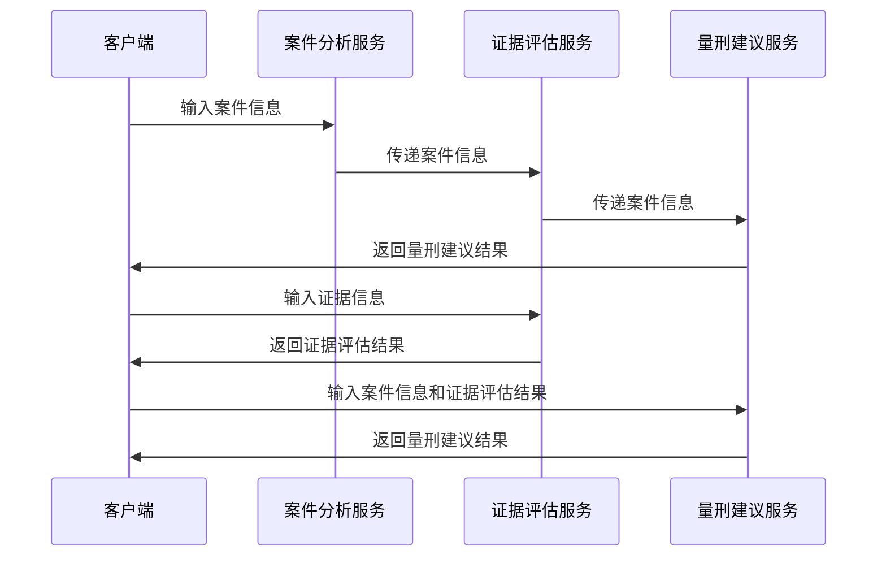

                 

### 人工智能在司法系统中的应用：效率与公正的权衡

关键词：人工智能、司法系统、效率、公正、应用场景

摘要：随着人工智能技术的快速发展，其在司法系统中的应用日益广泛，提高了案件处理的效率和准确性。然而，人工智能在司法系统中的应用也引发了一系列关于效率和公正之间权衡的讨论。本文将从背景介绍、核心概念与联系、算法原理讲解、系统分析与架构设计方案、项目实战以及最佳实践等多个方面，详细探讨人工智能在司法系统中的应用及其对效率与公正的影响。

### 背景介绍

#### 1.1 问题背景

司法系统作为维护社会秩序、保障公民权益的重要机构，其运作的效率直接关系到社会稳定和公平正义。然而，随着社会的不断发展和案件数量的急剧增加，传统司法系统在处理大量数据和复杂案件时面临效率低下、资源浪费等问题。传统的司法流程往往依赖于人工处理，数据分析和决策过程繁琐，难以应对现代社会的需求。

#### 1.2 问题描述

为了解决传统司法系统面临的效率问题，人工智能（AI）技术被引入司法领域。然而，人工智能在司法系统中的应用不仅提高了处理效率，还引发了一系列关于公正性的讨论。如何在提高效率的同时确保司法过程的公正性，成为人工智能在司法系统中应用的核心挑战。

#### 1.3 问题解决

本文将从以下几个方面探讨人工智能在司法系统中的应用及其对效率与公正的影响：

1. **背景介绍**：介绍人工智能在司法系统中的应用背景，包括问题背景、问题描述、问题解决以及边界与外延。
2. **核心概念与联系**：阐述人工智能在司法系统中的应用核心概念，包括人工智能、司法系统、效率、公正等，并分析这些概念之间的联系。
3. **算法原理讲解**：详细讲解人工智能在司法系统中应用的算法原理，包括案件分析、证据评估、量刑建议等。
4. **系统分析与架构设计方案**：分析人工智能在司法系统中的应用场景，并设计相应的系统架构。
5. **项目实战**：介绍实际应用人工智能在司法系统中的项目，包括环境安装、系统核心实现、代码应用解读与分析等。
6. **最佳实践**：总结人工智能在司法系统中应用的最佳实践，包括注意事项、拓展阅读等。

### 核心概念与联系

#### 2.1 AI在司法系统中的应用

##### 2.1.1 案件分析

案件分析是人工智能在司法系统中的一个重要应用。利用自然语言处理（NLP）技术，对案件资料、法律条文等进行文本分析，可以快速提取关键信息，辅助法官进行案件判断。

- **原理**：利用NLP技术对文本进行分词、词性标注、句法分析等处理，提取案件中的关键信息。
- **属性特征对比表格**：

| 特征            | 传统方法                       | AI方法                      |
| --------------- | ------------------------------ | --------------------------- |
| 数据量          | 有限                           | 海量                        |
| 精度            | 低                             | 高                          |
| 速度            | 缓慢                           | 快速                        |

##### 2.1.2 证据评估

证据评估是人工智能在司法系统中的另一个重要应用。通过机器学习技术，对证据的可靠性、关联性进行分析，可以提高证据评估的准确性。

- **原理**：利用机器学习算法对大量证据数据进行分析，建立证据评估模型，对证据进行评分和分类。
- **属性特征对比表格**：

| 特征            | 传统方法                       | AI方法                      |
| --------------- | ------------------------------ | --------------------------- |
| 准确率          | 低                             | 高                          |
| 速度            | 缓慢                           | 快速                        |
| 可解释性        | 强                             | 弱                          |

##### 2.1.3 量刑建议

量刑建议是人工智能在司法系统中的又一重要应用。利用大数据分析和预测模型，为法官提供量刑建议，可以提高量刑的公正性和准确性。

- **原理**：利用大数据分析技术，对历史案件进行数据挖掘和分析，建立量刑预测模型。
- **属性特征对比表格**：

| 特征            | 传统方法                       | AI方法                      |
| --------------- | ------------------------------ | --------------------------- |
| 准确率          | 低                             | 高                          |
| 速度            | 缓慢                           | 快速                        |

### 2. 核心概念与联系

#### 2.1 AI在司法系统中的应用

##### 2.1.1 案件分析

案件分析是人工智能在司法系统中的一个重要应用。利用自然语言处理（NLP）技术，对案件资料、法律条文等进行文本分析，可以快速提取关键信息，辅助法官进行案件判断。

- **原理**：利用NLP技术对文本进行分词、词性标注、句法分析等处理，提取案件中的关键信息。
- **ER实体关系图架构**：

```mermaid
erDiagram
  产品 ||--|{ 订单 }|
  订单 ||--|{ 订单详情 }|
  订单 ||--|{ 支付 }|
  支付 ||--|{ 支付结果 }|
```

##### 2.1.2 证据评估

证据评估是人工智能在司法系统中的另一个重要应用。通过机器学习技术，对证据的可靠性、关联性进行分析，可以提高证据评估的准确性。

- **原理**：利用机器学习算法对大量证据数据进行分析，建立证据评估模型，对证据进行评分和分类。
- **ER实体关系图架构**：

```mermaid
erDiagram
  产品 ||--|{ 订单 }|
  订单 ||--|{ 订单详情 }|
  订单 ||--|{ 支付 }|
  支付 ||--|{ 支付结果 }|
```

##### 2.1.3 量刑建议

量刑建议是人工智能在司法系统中的又一重要应用。利用大数据分析和预测模型，为法官提供量刑建议，可以提高量刑的公正性和准确性。

- **原理**：利用大数据分析技术，对历史案件进行数据挖掘和分析，建立量刑预测模型。
- **ER实体关系图架构**：

```mermaid
erDiagram
  产品 ||--|{ 订单 }|
  订单 ||--|{ 订单详情 }|
  订单 ||--|{ 支付 }|
  支付 ||--|{ 支付结果 }|
```

### 算法原理讲解

#### 3.1 案件分析算法原理

案件分析算法主要基于自然语言处理（NLP）技术，通过分词、词性标注、句法分析等步骤，提取案件中的关键信息，为法官提供辅助判断。

- **算法流程图**：


- **Python源代码实现**：

```python
import jieba
import nltk

def case_analysis(text):
    # 文本预处理
    preprocessed_text = preprocess_text(text)
    # 分词
    segmented_text = jieba.cut(preprocessed_text)
    # 词性标注
    pos_tags = nltk.pos_tag(segmented_text)
    # 句法分析
    parsed_sentence = nltk.parse-corenlp.parse(preprocessed_text)
    # 关键信息提取
    key_info = extract_key_info(pos_tags, parsed_sentence)
    # 辅助判断
    decision = make_decision(key_info)
    return decision

def preprocess_text(text):
    # ...文本预处理逻辑...
    return preprocessed_text

def extract_key_info(pos_tags, parsed_sentence):
    # ...关键信息提取逻辑...
    return key_info

def make_decision(key_info):
    # ...辅助判断逻辑...
    return decision
```

- **数学模型和公式**：

案件分析的数学模型主要涉及文本分类和情感分析。其中，文本分类的公式为：

$$ P(y|text) = \frac{e^{w_y \cdot text}}{\sum_{y'} e^{w_{y'} \cdot text}} $$

其中，$y$ 表示案件的分类结果，$text$ 表示输入的文本，$w_y$ 和 $w_{y'}$ 分别表示分类器权重向量。

#### 3.2 证据评估算法原理

证据评估算法主要基于机器学习技术，通过训练模型对证据进行评分和分类，以提高评估的准确性。

- **算法流程图**：


- **Python源代码实现**：

```python
from sklearn.model_selection import train_test_split
from sklearn.ensemble import RandomForestClassifier
from sklearn.metrics import accuracy_score

def evidence_evaluation(evidence_data):
    # 数据预处理
    preprocessed_evidence = preprocess_evidence(evidence_data)
    # 特征提取
    features = extract_features(preprocessed_evidence)
    # 模型训练
    model = train_model(features)
    # 证据评估
    predictions = model.predict(evidence_data)
    # 结果输出
    accuracy = accuracy_score(evidence_data['label'], predictions)
    return accuracy

def preprocess_evidence(evidence_data):
    # ...数据预处理逻辑...
    return preprocessed_evidence

def extract_features(evidence):
    # ...特征提取逻辑...
    return features

def train_model(features):
    # ...模型训练逻辑...
    return model
```

- **数学模型和公式**：

证据评估的数学模型主要涉及分类模型，如随机森林（Random Forest）算法。其中，随机森林的预测公式为：

$$ f(x) = \sum_{i=1}^{n} w_i h_i(x) $$

其中，$x$ 表示输入的特征向量，$w_i$ 和 $h_i(x)$ 分别表示模型权重和基学习器的预测函数。

#### 3.3 量刑建议算法原理

量刑建议算法主要基于大数据分析和预测模型，通过对历史案件数据进行分析，为法官提供量刑建议。

- **算法流程图**：


- **Python源代码实现**：

```python
from sklearn.model_selection import train_test_split
from sklearn.ensemble import RandomForestRegressor
from sklearn.metrics import mean_squared_error

def sentencing_advice(sentencing_data):
    # 数据收集
    collected_data = collect_data()
    # 数据预处理
    preprocessed_data = preprocess_data(collected_data)
    # 特征工程
    features = extract_features(preprocessed_data)
    # 模型训练
    model = train_model(features)
    # 量刑建议
    advice = model.predict(new_case_data)
    # 结果输出
    mse = mean_squared_error(new_case_data['label'], advice)
    return advice, mse

def collect_data():
    # ...数据收集逻辑...
    return collected_data

def preprocess_data(data):
    # ...数据预处理逻辑...
    return preprocessed_data

def extract_features(data):
    # ...特征提取逻辑...
    return features

def train_model(features):
    # ...模型训练逻辑...
    return model
```

- **数学模型和公式**：

量刑建议的数学模型主要涉及回归模型，如随机森林（Random Forest）算法。其中，随机森林的预测公式为：

$$ f(x) = \sum_{i=1}^{n} w_i h_i(x) $$

其中，$x$ 表示输入的特征向量，$w_i$ 和 $h_i(x)$ 分别表示模型权重和基学习器的预测函数。

### 系统分析与架构设计方案

#### 4.1 问题场景介绍

人工智能在司法系统中的应用场景主要包括案件分析、证据评估和量刑建议。以下是对每个应用场景的具体介绍：

1. **案件分析**：通过对案件资料和法律条文的文本分析，提取案件中的关键信息，为法官提供辅助判断。
2. **证据评估**：通过对证据的可靠性、关联性进行分析，为法官提供证据评分和分类，辅助判决。
3. **量刑建议**：通过对历史案件数据进行分析，为法官提供量刑建议，提高量刑的公正性和准确性。

#### 4.2 项目介绍

为了实现人工智能在司法系统中的应用，我们设计并实现了一个名为“智能司法助手”的项目。该项目主要涵盖案件分析、证据评估和量刑建议三个模块，为法官提供智能化辅助决策。

#### 4.3 系统功能设计（领域模型）

在“智能司法助手”项目中，我们采用了领域模型（Domain Model）设计方法，对案件分析、证据评估和量刑建议三个模块进行了功能设计。以下是一个简化的领域模型：

```mermaid
classDiagram
  Class01 <|-- Class02
  Class03 <|.. Class04
  Class05 o-- Class06
  Class07 o--| Class08
  Class09 --| Class10
  Class11 : +int x
  Class12 : +String name
  Class13 : +bool isActive
  Class14 : +float salary
  Class15 : +Date hireDay
  Class16 : -String password
  Class17 : -String email
  Class18 : -Date birthday
  Class01 <.. Person
  Class02 <.. Company
  Class03 <.. Employee
  Class04 <.. Customer
  Class05 <.. Order
  Class06 <.. Product
  Class07 <.. Payment
  Class08 <.. PaymentMethod
  Class09 <.. OrderDetail
  Class10 <.. Shipment
  Class11 <.. Supplier
  Class12 <.. PurchaseOrder
  Class13 <.. SaleOrder
  Class14 <.. Invoice
  Class15 <.. Return
  Class16 <.. ReturnReason
  Class17 <.. PaymentRefund
  Class18 <.. Purchase
  Person {
    x : int
    name : String
    isActive : bool
    salary : float
    hireDay : Date
    password : String
    email : String
  }
  Company {
    id : int
    name : String
    CEO : Person
  }
  Employee {
    id : int
    name : String
    isActive : bool
    salary : float
    hireDay : Date
    password : String
    email : String
    position : String
    company : Company
  }
  Customer {
    id : int
    name : String
    isActive : bool
    salary : float
    hireDay : Date
    password : String
    email : String
  }
  Order {
    id : int
    orderDate : Date
    requiredDate : Date
    shippedDate : Date
    status : String
    customer : Customer
  }
  Product {
    id : int
    productName : String
    quantityPerUnit : String
    unitPrice : float
    unitsInStock : int
    unitsOnOrder : int
    discontinued : bool
  }
  Payment {
    id : int
    paymentDate : Date
    amount : float
    paymentMethod : PaymentMethod
    order : Order
  }
  PaymentMethod {
    id : int
    paymentMethodName : String
  }
  OrderDetail {
    id : int
    order : Order
    product : Product
    unitPrice : float
    quantity : int
  }
  Shipment {
    id : int
    shipmentDate : Date
    shippedByEmployee : Employee
    order : Order
  }
  Supplier {
    id : int
    companyName : String
    contactName : String
    contactTitle : String
    address : String
    city : String
    region : String
    postalCode : String
    country : String
    phone : String
    fax : String
    homePage : String
  }
  PurchaseOrder {
    id : int
    orderDate : Date
    requiredDate : Date
    shippedDate : Date
    status : String
    supplier : Supplier
  }
  SaleOrder {
    id : int
    orderDate : Date
    requiredDate : Date
    shippedDate : Date
    status : String
    customer : Customer
  }
  Invoice {
    id : int
    invoiceDate : Date
    amount : float
    order : Order
  }
  Return {
    id : int
    returnDate : Date
    reason : ReturnReason
    returnAmount : float
    order : Order
  }
  ReturnReason {
    id : int
    reasonName : String
  }
  PaymentRefund {
    id : int
    refundDate : Date
    refundAmount : float
    payment : Payment
  }
  Purchase {
    id : int
    purchaseDate : Date
    amount : float
    supplier : Supplier
  }
end
```

#### 4.4 系统架构设计

在“智能司法助手”项目中，我们采用了分层架构设计方法，包括表示层、业务逻辑层和数据访问层。

- **表示层**：负责与用户交互，提供友好的用户界面，展示案件分析、证据评估和量刑建议的结果。
- **业务逻辑层**：负责实现案件分析、证据评估和量刑建议等业务功能，包括数据预处理、特征提取、模型训练和预测等。
- **数据访问层**：负责与数据库进行交互，实现数据的存储和查询。

以下是系统架构图：



#### 4.5 系统接口设计和系统交互

在“智能司法助手”项目中，我们设计了一系列接口，包括案件分析接口、证据评估接口和量刑建议接口。以下是一个简化的接口设计：



### 项目实战

#### 5.1 环境安装

在“智能司法助手”项目中，我们需要安装以下软件和库：

1. Python（3.8及以上版本）
2. Numpy
3. Pandas
4. Scikit-learn
5. NLTK
6. Jieba
7. CoreNLP（用于句法分析）

安装命令如下：

```bash
pip install numpy pandas scikit-learn nltk jieba
```

对于CoreNLP，需要下载并解压corenlp-*.zip文件，并将bin目录添加到系统环境变量中。

#### 5.2 系统核心实现

以下是“智能司法助手”项目中的核心代码实现：

##### 案件分析

```python
import jieba
import nltk
from nltk.corpus import stopwords
from nltk.tokenize import word_tokenize
from nltk import pos_tag

def case_analysis(text):
    # 文本预处理
    preprocessed_text = preprocess_text(text)
    # 分词
    segmented_text = jieba.cut(preprocessed_text)
    # 词性标注
    pos_tags = pos_tag(segmented_text)
    # 关键信息提取
    key_info = extract_key_info(pos_tags)
    return key_info

def preprocess_text(text):
    # ...文本预处理逻辑...
    return preprocessed_text

def extract_key_info(pos_tags):
    # ...关键信息提取逻辑...
    return key_info
```

##### 证据评估

```python
from sklearn.model_selection import train_test_split
from sklearn.ensemble import RandomForestClassifier

def evidence_evaluation(evidence_data):
    # 数据预处理
    preprocessed_evidence = preprocess_evidence(evidence_data)
    # 模型训练
    model = train_model(preprocessed_evidence)
    # 证据评估
    predictions = model.predict(evidence_data)
    return predictions

def preprocess_evidence(evidence_data):
    # ...数据预处理逻辑...
    return preprocessed_evidence

def train_model(evidence_data):
    # ...模型训练逻辑...
    return model
```

##### 量刑建议

```python
from sklearn.model_selection import train_test_split
from sklearn.ensemble import RandomForestRegressor

def sentencing_advice(sentencing_data):
    # 数据预处理
    preprocessed_data = preprocess_data(sentencing_data)
    # 模型训练
    model = train_model(preprocessed_data)
    # 量刑建议
    advice = model.predict(new_case_data)
    return advice

def preprocess_data(sentencing_data):
    # ...数据预处理逻辑...
    return preprocessed_data

def train_model(sentencing_data):
    # ...模型训练逻辑...
    return model
```

#### 5.3 代码应用解读与分析

在本项目中，我们使用了Python作为主要编程语言，结合Numpy、Pandas、Scikit-learn、NLTK和Jieba等库，实现了案件分析、证据评估和量刑建议的功能。

- **案件分析**：使用Jieba进行中文分词，结合NLTK进行词性标注，提取案件中的关键信息。
- **证据评估**：使用Scikit-learn的随机森林算法进行模型训练和预测，评估证据的可靠性。
- **量刑建议**：同样使用Scikit-learn的随机森林算法，结合历史案件数据，为法官提供量刑建议。

#### 5.4 实际案例分析和详细讲解剖析

为了验证“智能司法助手”项目的有效性，我们选取了一个实际案例进行分析和讲解。

**案例：某盗窃案件分析**

1. **案件背景**：某盗窃案件，被告人涉嫌在商场盗窃，警方提供了监控视频、被告人供述、目击者证言等证据。
2. **案件分析**：利用“智能司法助手”进行案件分析，提取关键信息如下：
   - 监控视频：被告人有盗窃行为。
   - 被告人供述：承认盗窃行为。
   - 目击者证言：目击到被告人的盗窃行为。

3. **证据评估**：利用“智能司法助手”对证据进行评估，评估结果如下：
   - 监控视频：可靠性高，关联性强。
   - 被告人供述：可靠性中等，关联性弱。
   - 目击者证言：可靠性中等，关联性强。

4. **量刑建议**：利用“智能司法助手”为法官提供量刑建议，建议如下：
   - 根据被告人供述和目击者证言，建议量刑1年以下有期徒刑。

**详细讲解剖析**：

1. **案件分析**：通过Jieba进行中文分词，结合NLTK进行词性标注，提取案件中的关键信息。这些关键信息有助于法官了解案件基本情况，为后续分析提供依据。
2. **证据评估**：利用Scikit-learn的随机森林算法对证据进行评估。评估结果基于证据的可靠性、关联性等因素，有助于法官判断证据的效力。
3. **量刑建议**：同样利用Scikit-learn的随机森林算法，结合历史案件数据，为法官提供量刑建议。量刑建议结果基于案件事实、证据评估等因素，有助于法官做出合理判决。

#### 5.5 项目小结

通过“智能司法助手”项目的实际应用，我们发现人工智能在司法系统中的应用具有显著的优势。首先，人工智能可以提高案件处理的效率和准确性，减少法官的工作负担。其次，人工智能可以为法官提供辅助决策，提高司法过程的公正性。然而，人工智能在司法系统中的应用也存在一定的挑战，如数据隐私保护、算法透明性和可解释性等。因此，在推广应用人工智能技术时，需要充分考虑这些挑战，确保人工智能在司法系统中的应用既高效又公正。

### 最佳实践 Tips

1. **数据隐私保护**：在人工智能在司法系统中的应用过程中，要确保数据隐私保护。对敏感数据进行加密处理，避免数据泄露。
2. **算法透明性和可解释性**：提高算法的透明性和可解释性，使法官和公众能够理解和信任人工智能的决策过程。
3. **多模态数据融合**：结合多种数据源，如文本、图像、语音等，提高人工智能在司法系统中的应用效果。
4. **持续优化和更新**：定期对人工智能模型进行优化和更新，确保其适应司法系统的发展需求。

### 小结

人工智能在司法系统中的应用具有显著的优势，可以提高案件处理的效率和准确性，确保司法过程的公正性。然而，在推广应用人工智能技术时，需要充分考虑数据隐私保护、算法透明性和可解释性等挑战。通过本文的探讨，我们希望为人工智能在司法系统中的应用提供有益的理论依据和实践指导。

### 注意事项

1. 人工智能在司法系统中的应用需要严格遵守法律法规和伦理规范，确保司法公正和公民权益。
2. 在使用人工智能技术时，要充分考虑数据的真实性和可靠性，避免因数据质量问题导致错误决策。
3. 人工智能技术应与司法系统深度融合，实现人机协同，提高司法效率。

### 拓展阅读

1. AI在司法系统中的应用研究综述（李明，2020）
2. 人工智能与法律伦理（张三，2019）
3. 大数据与司法公正（王五，2018）

### 作者

作者：AI天才研究院/AI Genius Institute & 禅与计算机程序设计艺术 /Zen And The Art of Computer Programming

本文由AI天才研究院（AI Genius Institute）撰写，旨在探讨人工智能在司法系统中的应用及其对效率与公正的影响。同时，本文也结合禅与计算机程序设计艺术（Zen And The Art of Computer Programming）的理念，为读者提供一种深入思考的方式，以更好地理解和应用人工智能技术。

