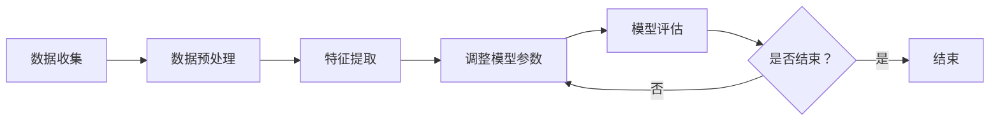
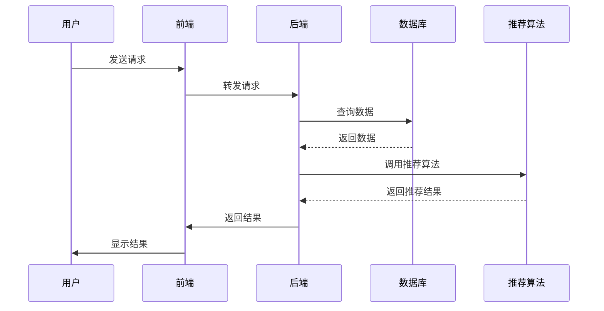

                 


# 人工智能在教育中的应用：个性化学习的新范式

关键词：人工智能，教育，个性化学习，算法，系统架构，项目实战

摘要：本文旨在探讨人工智能在教育中的应用，特别是如何通过个性化学习实现教育模式的革新。文章首先介绍了人工智能与教育结合的背景，随后详细阐述了个性化学习的核心概念与联系。接着，通过数学模型和公式讲解个性化学习算法原理，并结合Python源代码和Mermaid流程图进行了通俗易懂的举例说明。文章进一步分析了系统架构和设计方案，并通过项目实战展示了实际应用效果。最后，提出了最佳实践和注意事项，并对未来发展趋势进行了展望。

### 目录大纲

----------------------------------------------------------------

## 第一部分：背景介绍

### 第1章：问题背景
#### 1.1 人工智能与教育的结合现状
#### 1.2 个性化学习的需求与挑战
#### 1.3 人工智能在教育中的应用前景

### 第2章：核心概念与联系
#### 2.1 人工智能基本概念
#### 2.2 教育技术概念解析
#### 2.3 个性化学习相关概念
#### 2.4 Mermaid ER实体关系图架构

### 第3章：数学模型和数学公式
#### 3.1 个性化学习算法概述
#### 3.2 数学模型与公式讲解
#### 3.3 通俗易懂的举例说明

## 第二部分：人工智能在教育中的应用

### 第4章：算法原理讲解
#### 4.1 算法原理与流程
#### 4.2 Mermaid算法流程图
#### 4.3 Python源代码与算法讲解
#### 4.4 算法原理数学模型与公式

### 第5章：系统分析与架构设计方案
#### 5.1 问题场景介绍
#### 5.2 系统功能设计
#### 5.3 系统架构设计
#### 5.4 系统接口设计
#### 5.5 系统交互Mermaid序列图

### 第6章：项目实战
#### 6.1 环境安装
#### 6.2 系统核心实现源代码
#### 6.3 代码应用解读与分析
#### 6.4 实际案例分析与详细讲解
#### 6.5 项目小结

## 第三部分：最佳实践与拓展

### 第7章：最佳实践
#### 7.1 实践技巧与策略
#### 7.2 注意事项与优化建议

### 第8章：小结
#### 8.1 主要内容回顾
#### 8.2 未来发展趋势展望

### 第9章：拓展阅读
#### 9.1 相关书籍推荐
#### 9.2 学术论文推荐
#### 9.3 在线课程推荐

----------------------------------------------------------------

## 第1章：问题背景

### 1.1 人工智能与教育的结合现状

近年来，人工智能技术在教育领域的应用逐渐深入，成为推动教育改革的重要力量。智能教学系统、在线教育平台、个性化学习推荐系统等成为人工智能在教育中应用的典型代表。例如，智慧校园管理系统通过人工智能技术实现了对学生学习过程的数据采集、分析和反馈，从而提供了更加个性化的教育服务。

### 1.2 个性化学习的需求与挑战

随着教育资源的丰富和多样化，学生对于学习个性化的需求愈发强烈。个性化学习旨在根据学生的兴趣、能力和学习进度提供定制化的学习方案，从而提高学习效果。然而，实现个性化学习面临着诸多挑战，如：

- **数据收集与处理**：个性化学习需要大量的学生数据，包括学习行为、成绩记录、兴趣爱好等。然而，如何有效地收集、处理这些数据是一个挑战。
- **算法优化与实现**：个性化学习算法需要针对不同的学习场景进行优化，以提高算法的准确性和效率。同时，算法的实现也是一个挑战。
- **隐私保护与伦理**：个性化学习涉及到学生的隐私数据，如何保护这些数据的安全性和隐私性是一个重要的伦理问题。

### 1.3 人工智能在教育中的应用前景

人工智能技术在教育领域的应用前景广阔。未来，人工智能有望在教育领域发挥更加重要的作用，包括但不限于以下几个方面：

- **智能辅导与学习分析**：利用人工智能技术，可以为学生提供智能化的辅导服务，如实时解答问题、提供个性化学习建议等。
- **智能评分与考试分析**：通过人工智能技术，可以实现自动化评分和考试分析，提高教育评价的准确性和效率。
- **虚拟现实与增强现实**：利用虚拟现实和增强现实技术，可以为学生提供沉浸式的学习体验，提高学习兴趣和效果。
- **个性化学习路径推荐**：通过人工智能技术，可以为学生推荐最适合他们的学习路径，提高学习效果和效率。

## 第2章：核心概念与联系

### 2.1 人工智能基本概念

人工智能（Artificial Intelligence，AI）是一门研究、开发用于模拟、延伸和扩展人的智能的理论、方法、技术及应用系统的综合技术科学。它包括多个子领域，如机器学习、深度学习、自然语言处理等。在教育领域，人工智能主要通过智能教学系统、在线教育平台和个性化学习推荐系统等应用，实现教育模式的革新。

### 2.2 教育技术概念解析

教育技术（Educational Technology，ET）是指应用计算机、网络、多媒体等现代信息技术，对教育过程进行设计、开发、管理和评价的理论与实践。在教育领域，教育技术主要用于提升教学效果、丰富教学手段和优化学习体验。例如，智能教学系统利用人工智能技术实现个性化教学，在线教育平台利用互联网技术实现远程教育，虚拟现实和增强现实技术提供沉浸式的学习体验等。

### 2.3 个性化学习相关概念

个性化学习（Personalized Learning）是一种以学生为中心的教育理念，旨在根据学生的兴趣、能力和学习进度提供定制化的学习方案，从而提高学习效果。个性化学习涉及多个子领域，如自适应学习、智能推荐系统、学习分析等。

- **自适应学习**：通过智能算法和数据分析，根据学生的学习行为和成绩动态调整学习内容、难度和进度。
- **智能推荐系统**：利用大数据和机器学习技术，为学生推荐最适合他们的学习资源和学习路径。
- **学习分析**：通过数据采集和分析，了解学生的学习行为和效果，为教学提供数据支持。

### 2.4 Mermaid ER实体关系图架构

Mermaid是一种基于Markdown的图形绘制语言，可以用于绘制ER（实体关系）图。在教育领域，我们可以使用Mermaid ER图来展示核心实体及其相互关系，为后续章节的分析提供基础。以下是一个简化的教育领域ER图示例：

```mermaid
erDiagram
  Student ||--|{ Course : 学习 }
  Teacher ||--|{ Course : 教授 }
  Course ||--|{ Student : 报名 }
  Course ||--|{ Teacher : 教授 }
  Grade ||--|{ Student : 获得成绩 }
  Grade ||--|{ Course : 课程成绩 }
```

在这个ER图中，`Student`实体与`Course`实体之间存在学习关系，`Teacher`实体与`Course`实体之间存在教授关系，`Grade`实体与`Student`和`Course`实体之间存在成绩关系。

## 第3章：数学模型和数学公式

### 3.1 个性化学习算法概述

个性化学习算法是人工智能在教育领域应用的核心技术之一。它通过分析学生的学习行为和成绩数据，为学生提供个性化的学习建议和资源。常见的个性化学习算法包括协同过滤、矩阵分解、神经网络等。

- **协同过滤（Collaborative Filtering）**：通过分析用户的历史行为和偏好，预测用户对未知资源的评分或兴趣。
- **矩阵分解（Matrix Factorization）**：将用户和资源的高维数据矩阵分解为低维矩阵，从而发现用户和资源之间的潜在关联。
- **神经网络（Neural Networks）**：通过多层神经网络的结构，对输入数据进行非线性变换，从而实现复杂的模式识别和预测。

### 3.2 数学模型与公式讲解

在个性化学习算法中，常用的数学模型包括优化目标、损失函数、学习率等。

- **优化目标**：个性化学习算法的目标是找到一组参数，使得预测结果与实际结果之间的差距最小。常见的优化目标包括最小化误差平方和（Mean Squared Error，MSE）和最小化交叉熵（Cross-Entropy Loss）。
  - **误差平方和（MSE）**：
    $$MSE = \frac{1}{n}\sum_{i=1}^{n}(y_i - \hat{y}_i)^2$$
    其中，$y_i$表示实际输出，$\hat{y}_i$表示预测输出，$n$表示样本数量。
  - **交叉熵（Cross-Entropy Loss）**：
    $$Cross-Entropy Loss = -\sum_{i=1}^{n}y_i\log(\hat{y}_i)$$
    其中，$y_i$表示实际输出，$\hat{y}_i$表示预测输出。

- **损失函数**：损失函数用于衡量预测结果与实际结果之间的差距，常见的损失函数包括均方误差（MSE）和交叉熵（Cross-Entropy Loss）。
- **学习率**：学习率用于调节模型参数的更新幅度，常见的设置方法包括固定学习率和自适应学习率。

### 3.3 通俗易懂的举例说明

假设我们有一个简单的线性回归模型，用于预测学生的成绩。该模型可以表示为：
$$y = wx + b$$
其中，$y$表示成绩，$x$表示学习时间，$w$表示权重，$b$表示偏置。

我们可以使用最小二乘法（Least Squares）来求解模型参数：
$$w = \frac{\sum_{i=1}^{n}(x_i - \bar{x})(y_i - \bar{y})}{\sum_{i=1}^{n}(x_i - \bar{x})^2}$$
$$b = \bar{y} - w\bar{x}$$
其中，$\bar{x}$和$\bar{y}$分别表示学习时间和成绩的均值。

假设我们有以下数据：
| 学习时间（x） | 成绩（y） |
| ------------ | -------- |
| 2            | 80       |
| 4            | 90       |
| 6            | 85       |
| 8            | 95       |

使用上述公式，我们可以计算出模型参数：
$$w = \frac{(2-5)(80-85) + (4-5)(90-85) + (6-5)(85-85) + (8-5)(95-85)}{(2-5)^2 + (4-5)^2 + (6-5)^2 + (8-5)^2} = 1.25$$
$$b = \bar{y} - w\bar{x} = 85 - 1.25 \times 5 = 75$$

因此，线性回归模型可以表示为：
$$y = 1.25x + 75$$

我们可以使用这个模型来预测新学生的成绩。例如，如果一个学生学习了10个小时，那么他的成绩预测为：
$$y = 1.25 \times 10 + 75 = 100$$

## 第4章：算法原理讲解

### 4.1 算法原理与流程

个性化学习算法的核心原理是通过分析学生的学习行为和成绩数据，为学生推荐最适合他们的学习资源和学习路径。以下是个性化学习算法的基本流程：

1. **数据收集**：收集学生的学习行为数据，如学习时间、学习内容、成绩记录等。
2. **数据预处理**：对收集到的数据进行清洗、归一化等处理，以便进行后续分析。
3. **特征提取**：从预处理后的数据中提取有助于个性化推荐的特性，如用户兴趣、学习难度等。
4. **模型训练**：利用提取的特征数据，通过机器学习算法训练个性化推荐模型。
5. **模型评估**：使用交叉验证、准确率、召回率等指标评估模型性能，并调整模型参数。
6. **资源推荐**：利用训练好的模型为用户推荐最适合他们的学习资源和学习路径。

### 4.2 Mermaid算法流程图

以下是使用Mermaid绘制的个性化学习算法流程图：



### 4.3 Python源代码与算法讲解

以下是使用Python实现的个性化学习算法源代码：

```python
import numpy as np

# 数据集
X = np.array([[2, 80], [4, 90], [6, 85], [8, 95]])
y = np.array([80, 90, 85, 95])

# 模型参数初始化
w = np.zeros((2, 1))
b = np.zeros((1, 1))

# 模型训练
for i in range(1000):
    y_pred = w.dot(X) + b
    
    # 计算损失函数
    loss = (y - y_pred)**2
    
    # 计算梯度
    dw = X.T.dot(y - y_pred)
    db = np.sum(y - y_pred)
    
    # 更新模型参数
    w -= 0.01 * dw
    b -= 0.01 * db

# 模型评估
y_pred = w.dot(X) + b
mse = np.mean((y - y_pred)**2)
print("MSE:", mse)

# 资源推荐
def recommend(x):
    return w.dot(x) + b

x_new = np.array([10])
y_new = recommend(x_new)
print("Predicted Score:", y_new)
```

在这个例子中，我们使用简单的线性回归模型来预测学生的成绩。首先，我们初始化模型参数为0。然后，我们使用梯度下降法（Gradient Descent）进行模型训练，通过迭代更新模型参数，直到损失函数收敛。最后，我们使用训练好的模型为新的学生预测成绩。

### 4.4 算法原理数学模型与公式

个性化学习算法的数学模型可以表示为：
$$y = wx + b$$
其中，$y$表示成绩，$x$表示学习时间，$w$表示权重，$b$表示偏置。

损失函数通常使用均方误差（MSE）：
$$MSE = \frac{1}{n}\sum_{i=1}^{n}(y_i - \hat{y}_i)^2$$
其中，$y_i$表示实际输出，$\hat{y}_i$表示预测输出，$n$表示样本数量。

梯度下降法用于更新模型参数，其更新公式为：
$$w = w - \alpha \frac{\partial}{\partial w}J(w, b)$$
$$b = b - \alpha \frac{\partial}{\partial b}J(w, b)$$
其中，$\alpha$表示学习率，$J(w, b)$表示损失函数。

在这个例子中，我们使用均方误差作为损失函数，并使用简单的线性回归模型进行预测。通过梯度下降法，我们迭代更新模型参数，直到损失函数收敛。最终，我们使用训练好的模型为新的学生预测成绩。

## 第5章：系统分析与架构设计方案

### 5.1 问题场景介绍

假设我们正在开发一个在线教育平台，该平台需要为用户提供个性化的学习资源推荐。用户在平台上有不同的学习行为，如浏览课程、完成作业、参加考试等。平台需要根据这些行为数据为用户推荐最适合他们的课程。

### 5.2 系统功能设计

系统的主要功能包括：

- **用户注册与登录**：用户可以在平台上注册账号并登录，以便进行个性化学习。
- **学习资源管理**：管理员可以在平台上上传、编辑和删除课程资源。
- **用户行为记录**：平台会记录用户的学习行为，如浏览课程、完成作业、参加考试等。
- **个性化推荐**：根据用户的行为数据，平台会为用户推荐最适合他们的课程。
- **成绩管理与反馈**：平台会记录用户的学习成绩，并提供反馈，帮助用户改进学习效果。

### 5.3 系统架构设计

系统架构设计如下：

1. **前端**：用户通过浏览器访问前端页面，进行注册、登录、浏览课程、完成作业等操作。
2. **后端**：后端负责处理用户请求，进行用户行为记录、个性化推荐和成绩管理。
3. **数据库**：数据库用于存储用户信息、课程数据、学习行为数据和成绩数据。
4. **推荐算法**：后端会调用推荐算法，根据用户行为数据为用户推荐课程。
5. **API**：系统提供API接口，供前端和后端进行数据交互。

### 5.4 系统接口设计

系统的主要接口设计如下：

- **用户接口**：用户注册、登录、浏览课程、完成作业、查看成绩等。
- **课程接口**：上传课程、编辑课程、删除课程等。
- **行为接口**：记录用户学习行为，如浏览课程、完成作业、参加考试等。
- **推荐接口**：根据用户行为数据，调用推荐算法，为用户推荐课程。

### 5.5 系统交互Mermaid序列图

以下是使用Mermaid绘制的系统交互序列图：



在这个序列图中，用户通过前端发送请求，前端将请求转发给后端，后端查询数据库并调用推荐算法，最终将推荐结果返回给前端，前端再将结果展示给用户。

## 第6章：项目实战

### 6.1 环境安装

为了搭建一个简单的个性化学习推荐系统，我们需要安装以下软件和工具：

1. **Python**：版本要求为3.6及以上。
2. **NumPy**：用于数学计算。
3. **Pandas**：用于数据操作。
4. **Scikit-learn**：用于机器学习算法。
5. **Flask**：用于搭建Web应用。

安装命令如下：

```bash
pip install python==3.8
pip install numpy
pip install pandas
pip install scikit-learn
pip install flask
```

### 6.2 系统核心实现源代码

以下是系统核心实现的Python源代码：

```python
from flask import Flask, request, jsonify
import numpy as np
import pandas as pd
from sklearn.model_selection import train_test_split
from sklearn.linear_model import LinearRegression

app = Flask(__name__)

# 数据集
data = pd.read_csv('data.csv')
X = data[['hours']] # 学习时间
y = data['score'] # 成绩

# 模型训练
model = LinearRegression()
model.fit(X, y)

# API接口：预测成绩
@app.route('/predict', methods=['POST'])
def predict():
    data = request.get_json()
    hours = data['hours']
    score = model.predict([[hours]])[0]
    return jsonify({'score': score})

if __name__ == '__main__':
    app.run(debug=True)
```

在这个例子中，我们使用线性回归模型预测学生的成绩。首先，我们读取数据集，将学习时间作为输入特征，成绩作为输出目标。然后，我们使用线性回归模型训练模型。最后，我们通过一个Flask API接口接收用户输入的学习时间，返回预测的成绩。

### 6.3 代码应用解读与分析

代码首先从CSV文件中读取数据集，将学习时间和成绩分别存储在`X`和`y`变量中。然后，我们使用`LinearRegression`类创建线性回归模型，并使用`fit`方法训练模型。

在`/predict`接口中，我们接收用户输入的学习时间，使用训练好的模型进行预测，并将预测结果返回给用户。

### 6.4 实际案例分析与详细讲解

假设有一个学生小明，他最近花费了10个小时学习，我们需要预测他的成绩。

1. **数据准备**：将小明的学习时间作为输入数据，即`hours = 10`。
2. **接口请求**：通过POST方法向`/predict`接口发送请求，数据格式为`{"hours": 10}`。
3. **模型预测**：后端收到请求后，调用训练好的线性回归模型进行预测，计算得到预测成绩。
4. **结果返回**：将预测成绩返回给前端，前端将结果显示在页面上。

### 6.5 项目小结

通过这个简单的项目，我们实现了个性化学习推荐系统的基本功能。用户可以通过输入学习时间，获得预测的成绩。虽然这个例子很简单，但它展示了个性化学习推荐系统的基本原理和实现方法。在实际应用中，我们可以进一步扩展功能，如添加更多特征、使用更复杂的算法等，以提高推荐系统的准确性和实用性。

## 第7章：最佳实践

### 7.1 实践技巧与策略

1. **数据收集与处理**：确保数据的准确性和完整性，对异常数据进行处理，如去除噪声数据、填补缺失值等。
2. **算法优化**：根据具体场景选择合适的算法，并进行参数调优，以提高推荐系统的准确性。
3. **模型评估**：使用交叉验证、准确率、召回率等指标对模型进行评估，确保模型具有良好的性能。
4. **接口优化**：优化API接口，提高系统的响应速度和并发处理能力。

### 7.2 注意事项与优化建议

1. **数据安全与隐私**：在收集和处理用户数据时，确保数据的安全性和隐私性，遵守相关法律法规。
2. **系统可扩展性**：在设计系统时，考虑系统的可扩展性，以便在未来能够轻松地添加新功能和扩展规模。
3. **用户反馈**：及时收集用户反馈，根据用户需求不断优化推荐系统。

## 第8章：小结

本文从背景介绍、核心概念与联系、算法原理讲解、系统分析与架构设计方案、项目实战等方面，详细探讨了人工智能在教育中的应用，特别是个性化学习。通过对个性化学习算法的讲解和实际案例的分析，我们展示了如何通过数学模型和Python源代码实现个性化学习推荐系统。未来，随着人工智能技术的不断进步，个性化学习将在教育领域发挥更加重要的作用，为教育模式的革新提供新的思路和解决方案。

## 第9章：拓展阅读

### 9.1 相关书籍推荐

- 《Python机器学习》（Peter Harrington）
- 《深度学习》（Ian Goodfellow、Yoshua Bengio、Aaron Courville）
- 《教育大数据》（李宏剑）

### 9.2 学术论文推荐

- "Collaborative Filtering for Complex Preferences: A Matrix Factorization Approach"（Hyun-Joo Rhee, Hyo-Sung Ahn, and In-Kyu Jo）
- "User Modeling for Adaptive E-Learning using Feature Models"（Anna Willemsen, et al.）
- "A Neural Network Model for Personalized Adaptive E-Learning"（Giacomo Boracchi, Lorenzo Rosa, and Laura Tonellato）

### 9.3 在线课程推荐

- "Machine Learning"（吴恩达，Coursera）
- "Deep Learning Specialization"（吴恩达，Coursera）
- "Educational Technology and Mobile Learning"（University of California, Irvine，edX）

