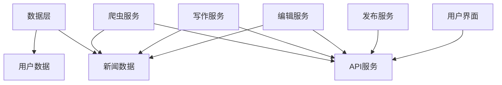
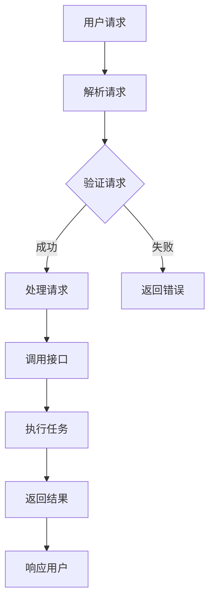
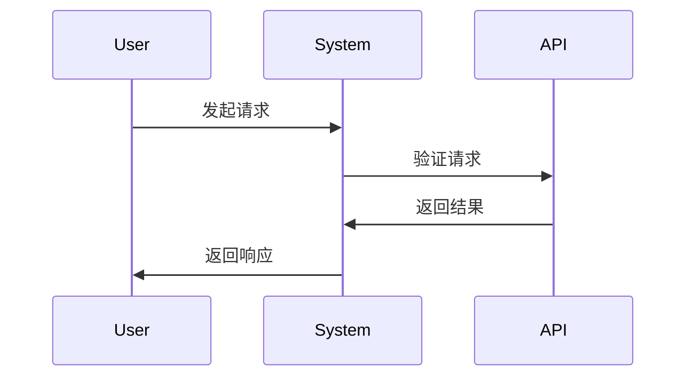

                 


### 关键词
- 人工智能
- 新闻生产
- 自动化
- 人工编辑
- 机器学习
- 深度学习
- 自然语言处理
- 自动化新闻采集
- 自动新闻写作
- 自动新闻编辑

### 摘要
本文将探讨人工智能在新闻生产中的应用，特别是在自动化与人工编辑结合方面的实践。首先，我们将回顾人工智能的发展历程，介绍其在新闻生产中的重要性。然后，我们将详细探讨机器学习、深度学习和自然语言处理等核心技术在新闻生产中的应用。接着，我们将分析自动化在新闻生产中的具体应用，包括新闻采集、写作和编辑。同时，我们也会探讨人工编辑的角色和其与自动化结合的必要性。最后，我们将通过具体案例和实践指南，展示人工智能在新闻生产中的实现和未来展望。

## 引言与背景

### 1.1 引言

随着人工智能技术的迅猛发展，它已经逐渐渗透到我们生活的方方面面。从自动驾驶到智能家居，人工智能正引领着第四次工业革命。在新闻生产领域，人工智能的应用同样具有重要意义。一方面，自动化新闻生产可以提高效率，降低成本；另一方面，人工编辑可以保证新闻的准确性和质量。这种自动化与人工编辑的结合，是新闻生产领域的一大趋势。

### 1.1.1 人工智能的发展历程

人工智能（AI）起源于20世纪50年代，当时科学家们开始探讨机器能否模拟人类智能。早期的AI研究主要集中在逻辑推理和问题求解上。随着计算机硬件和软件技术的发展，AI领域迎来了几个重要的发展阶段：

- **规则基础AI（Rule-Based AI）**：通过编写大量规则来模拟人类思维。
- **知识表示与推理**：利用知识库和推理机进行复杂推理。
- **机器学习**：让计算机通过数据学习，提高其决策能力。
- **深度学习**：通过多层神经网络模拟人脑的学习过程。

近年来，深度学习技术的发展使得AI在图像识别、语音识别和自然语言处理等领域取得了重大突破，为新闻生产带来了新的机遇。

### 1.1.2 新闻生产的挑战与需求

新闻生产面临许多挑战，包括信息爆炸、时效性要求和准确性等。信息爆炸使得新闻工作者难以从海量信息中筛选出有价值的内容；时效性要求新闻必须快速发布，以满足读者的需求；准确性是新闻质量的保障，任何错误都可能造成严重的后果。

为了应对这些挑战，新闻生产需要更高的效率、更准确的内容和更快的发布速度。人工智能在这方面具有显著的优势：

- **自动化新闻采集**：可以实时监控新闻事件，自动抓取和整理相关数据。
- **自动新闻写作**：利用自然语言处理技术，自动生成新闻报道。
- **自动新闻编辑**：通过算法优化，提高编辑的效率和准确性。

### 1.1.3 自动化与人工编辑的结合

尽管人工智能在新闻生产中具有巨大潜力，但完全取代人工编辑还存在一定难度。人工编辑在新闻质量、情感理解和复杂决策方面仍然具有不可替代的优势。因此，自动化与人工编辑的结合成为新闻生产领域的发展方向。

自动化可以承担重复性、低价值的工作，如新闻采集和初步写作，而人工编辑则负责审核、修正和深度分析。这种结合不仅提高了生产效率，还保证了新闻的质量。

### 1.2 书籍结构概述

本书分为七个章节，旨在全面探讨人工智能在新闻生产中的应用。以下是本书的主要结构和内容：

- **第1章：引言与背景**：介绍人工智能的发展历程和新闻生产的挑战。
- **第2章：人工智能基础**：探讨机器学习、深度学习和自然语言处理等核心技术。
- **第3章：自动化在新闻生产中的应用**：分析自动化新闻采集、写作和编辑。
- **第4章：人工编辑的角色与作用**：讨论人工编辑的必要性和其与自动化的结合。
- **第5章：人工智能算法在新闻生产中的实现**：介绍数据预处理、特征提取、模型训练和优化。
- **第6章：案例分析与实战**：通过具体案例展示人工智能在新闻生产中的应用。
- **第7章：未来展望与挑战**：探讨人工智能在新闻生产中的未来发展趋势和面临的挑战。

### 1.3 关键术语解释

在本章中，我们将介绍一些关键术语，包括人工智能、新闻生产、自动化、人工编辑等，以便读者更好地理解后续内容。

- **人工智能（AI）**：指模拟、延伸和扩展人类智能的理论、方法、技术及应用系统。
- **新闻生产**：指新闻内容的生产过程，包括采集、编写、编辑和发布。
- **自动化**：指通过计算机技术和算法，实现新闻采集、写作和编辑的自动化。
- **人工编辑**：指由人类编辑完成的新闻编辑工作，包括内容的审核、修正和深度分析。

通过这些关键术语的解释，读者可以更好地理解人工智能在新闻生产中的应用及其优势。

## 人工智能基础

### 2.1 人工智能概述

人工智能（AI）是计算机科学的一个分支，旨在研究如何构建智能代理（Smart Agents），这些代理可以执行复杂的任务，如感知、推理、学习和决策。AI的目标是模拟、延伸和扩展人类智能，使其能够解决复杂的问题，并在某些情况下超越人类的表现。

#### 2.1.1 人工智能的定义与发展

人工智能的定义有很多种，一个普遍接受的描述是：人工智能是一门研究、开发和应用使计算机系统具有智能行为的科学。AI的发展可以分为以下几个阶段：

1. **早期的AI研究（1950-1974）**：这一阶段以符号主义和逻辑推理为核心，主要研究如何让计算机模仿人类的思维过程。
2. **AI的第一次低谷（1974-1980）**：由于实际应用困难，AI研究面临重大挑战，导致投资大幅减少。
3. **AI的复兴（1980-1987）**：专家系统的发展标志着AI的复兴，专家系统通过模拟人类专家的知识和推理能力，解决了许多实际问题。
4. **AI的第二次低谷（1987-1993）**：专家系统的局限性再次引发了对AI的质疑，研究投入减少。
5. **现代AI的发展（1993至今）**：随着计算机硬件和算法的进步，机器学习特别是深度学习技术的突破，AI取得了飞速发展，应用领域不断扩大。

#### 2.1.2 人工智能的关键技术

人工智能的关键技术包括机器学习、深度学习和自然语言处理。这些技术是AI实现智能行为的基础。

1. **机器学习**：机器学习是AI的一个重要分支，其核心思想是让计算机从数据中学习，以提高其预测和决策能力。常见的机器学习方法包括监督学习、无监督学习和强化学习。

   - **监督学习**：通过标记的数据进行学习，如分类和回归问题。
   - **无监督学习**：在没有标记的数据中进行学习，如聚类和降维。
   - **强化学习**：通过与环境的交互进行学习，如游戏和自动驾驶。

2. **深度学习**：深度学习是机器学习的一个子领域，通过多层神经网络模拟人脑的学习过程，具有处理复杂任务的能力。深度学习的核心组件是神经网络，特别是深度神经网络（DNN）和卷积神经网络（CNN）。

3. **自然语言处理（NLP）**：自然语言处理是AI在语言理解方面的应用，旨在让计算机理解和生成自然语言。NLP的关键技术包括词向量表示、句法分析、语义理解和机器翻译。

### 2.2 机器学习与深度学习

#### 2.2.1 机器学习基础

机器学习（ML）是AI的核心技术之一，其基本原理是利用数据训练模型，使模型能够对新数据进行预测或分类。机器学习的过程包括以下几个步骤：

1. **数据收集**：收集大量的训练数据，数据的质量和多样性对模型的性能至关重要。
2. **数据预处理**：对收集到的数据进行清洗、归一化和特征提取，以便于模型处理。
3. **模型选择**：选择合适的算法构建模型，如线性回归、决策树、支持向量机和神经网络等。
4. **模型训练**：使用训练数据训练模型，通过调整模型参数来提高其预测能力。
5. **模型评估**：使用验证数据集评估模型的性能，常用的评估指标包括准确率、召回率和F1分数等。
6. **模型优化**：根据评估结果调整模型参数，以提高模型的性能。

#### 2.2.2 深度学习原理

深度学习（DL）是机器学习的一个子领域，通过多层神经网络模拟人脑的学习过程。深度学习的基本结构包括输入层、隐藏层和输出层。每个层由多个神经元组成，神经元之间通过权重相连。

1. **前向传播**：输入数据通过网络的权重和激活函数传递到每个隐藏层，最终到达输出层。
2. **反向传播**：计算输出层的预测误差，然后反向传播误差到每个隐藏层，更新权重和偏置。
3. **优化算法**：常用的优化算法包括梯度下降、随机梯度下降和Adam优化器等。

深度学习的核心组件是神经网络，特别是深度神经网络（DNN）和卷积神经网络（CNN）。DNN通过增加隐藏层和神经元数量来提高模型的复杂度和性能，而CNN通过卷积操作和池化操作来处理图像数据。

### 2.3 自然语言处理

#### 2.3.1 NLP基础

自然语言处理（NLP）是AI在语言理解方面的应用，其目标是让计算机理解和生成自然语言。NLP的基本原理包括：

1. **词向量表示**：将单词转换为向量的表示，如Word2Vec和GloVe等。
2. **句法分析**：对句子进行语法分析，识别单词的词性、句法和语义关系。
3. **语义理解**：理解句子的深层含义，包括指代消解、情感分析和问答系统等。

#### 2.3.2 NLP应用案例

NLP技术在新闻生产中有广泛的应用，以下是一些典型的案例：

1. **自动新闻写作**：使用NLP技术自动生成新闻报道，如Reuters自动新闻写作系统。
2. **标题生成**：根据新闻内容自动生成吸引人的标题。
3. **内容审核**：自动检测和过滤不当内容，如仇恨言论和虚假新闻。
4. **情感分析**：分析读者对新闻的评论和反馈，了解公众的观点和情绪。

通过上述对人工智能基础部分的详细讲解，我们可以更好地理解AI在新闻生产中的应用及其重要性。接下来，我们将探讨自动化在新闻生产中的应用，包括自动化新闻采集、写作和编辑。

### 自动化在新闻生产中的应用

自动化在新闻生产中的应用极大地改变了新闻行业的运作方式，提高了生产效率，并降低了成本。以下是自动化在新闻生产中的具体应用领域：

#### 3.1 自动新闻采集

自动化新闻采集是新闻生产过程中至关重要的一环。传统的新闻采集方式依赖于记者和编辑的搜索和整理，而自动化采集则通过计算机程序和算法，实现了新闻信息的实时监控和自动抓取。

**技术原理**：自动化新闻采集主要依赖于数据抓取技术和信息过滤算法。数据抓取技术包括网络爬虫和API调用等，这些技术可以自动获取网站、社交媒体和数据库中的新闻信息。信息过滤算法则用于筛选和分类采集到的信息，以确保新闻内容的准确性和相关性。

**应用实例**：许多新闻机构和媒体公司已经采用了自动化新闻采集系统。例如，美国新闻聚合网站Reddit利用自动化采集技术，从各种来源获取新闻和用户生成内容，并将其分类展示给用户。另一个例子是谷歌新闻（Google News），它使用自动化采集和排序算法，从数以万计的网站中实时抓取新闻，并根据用户兴趣和偏好进行个性化推荐。

#### 3.2 自动新闻写作

自动新闻写作是自动化在新闻生产中的另一个重要应用。通过自然语言处理（NLP）技术和机器学习算法，自动新闻写作系统能够自动生成新闻报道，大大提高了新闻的生产效率。

**技术原理**：自动新闻写作主要依赖于模板生成和文本生成算法。模板生成技术通过预定义的模板，自动填充新闻的关键信息，如标题、导语和正文。文本生成算法则通过分析大量的新闻文本数据，学习并生成新的新闻报道。常用的文本生成算法包括序列到序列（Seq2Seq）模型和生成对抗网络（GAN）等。

**应用实例**：自动新闻写作系统在许多新闻机构和媒体公司中得到广泛应用。例如，美国新闻机构Automated Insights开发了Automated Insights（AI）系统，该系统能够自动生成体育赛事结果报道、公司财报分析等。另一个例子是英国新闻机构卫报（The Guardian），它使用自动化写作工具撰写财经新闻报道，提高了报道的效率和覆盖面。

#### 3.3 自动新闻编辑

自动新闻编辑是指通过计算机算法和自动化工具，对新闻内容进行审核、修正和优化。自动化编辑不仅可以提高编辑效率，还可以减少人为错误，保证新闻内容的准确性和一致性。

**技术原理**：自动新闻编辑主要依赖于文本分析技术和规则引擎。文本分析技术用于检测新闻文本中的错误和异常，如拼写错误、语法错误和事实错误。规则引擎则根据预定义的规则，对新闻内容进行自动修正和优化。

**应用实例**：许多新闻机构和媒体公司已经开始使用自动新闻编辑工具。例如，美国的《华盛顿邮报》采用了自动新闻编辑系统，用于检测和纠正新闻报道中的错误。另一个例子是德国新闻机构德国之声（Deutsche Welle），它使用自动化编辑工具，提高新闻翻译的准确性和一致性。

### 3.4 人工编辑的角色与作用

尽管自动化在新闻生产中发挥了重要作用，但人工编辑仍然具有不可替代的角色。人工编辑可以提供以下价值：

- **内容质量保障**：人工编辑可以确保新闻内容的准确性和真实性，这是自动化系统无法完全替代的。
- **情感理解与判断**：新闻内容不仅需要准确，还需要传达情感和立场。人工编辑在这方面具有优势。
- **决策与策划**：新闻编辑不仅仅是修改文字，还包括选题策划、版面设计和整体布局等，这些需要人工编辑的专业知识和经验。

#### 3.4.1 人工编辑与自动化的结合

自动化与人工编辑的结合是未来新闻生产的发展方向。这种结合可以发挥两者的优势，提高新闻生产的效率和质量。以下是几种常见的结合模式：

1. **辅助编辑**：自动化工具用于辅助人工编辑，如自动校对、拼写检查和事实核对等，减轻编辑的工作负担。
2. **智能推荐**：自动化系统根据用户的兴趣和行为，推荐新闻内容给编辑，以便进行进一步的策划和优化。
3. **协同编辑**：编辑和自动化系统共同协作，编辑可以根据自动生成的新闻内容进行修改和完善，提高新闻的生产速度和质量。

### 3.5 自动化与人工编辑的平衡

在自动化与人工编辑的结合中，找到一个平衡点至关重要。以下是一些建议：

- **明确分工**：明确自动化和人工编辑的职责，确保各自发挥最大的作用。
- **技能培训**：对人工编辑进行技能培训，使其能够更好地与自动化工具协作。
- **质量控制**：建立严格的质量控制机制，确保自动化生成的新闻内容符合质量标准。
- **反馈机制**：建立反馈机制，让编辑和读者能够对自动化工具的表现进行评价和反馈，不断优化系统的性能。

通过上述对自动化在新闻生产中的应用的详细讲解，我们可以看到自动化不仅提高了新闻生产的效率，还与人工编辑相结合，提高了新闻的质量。接下来，我们将探讨人工编辑的角色和其与自动化的结合。

### 人工编辑的角色与作用

人工编辑在新闻生产中扮演着不可或缺的角色，尽管人工智能和自动化技术在不断进步，但人工编辑的独特价值仍然不可替代。以下是人工编辑在新闻生产中的主要角色和作用：

#### 4.1 人工编辑的必要性

**1. 内容准确性保证**：尽管自动化系统在数据处理和事实核对方面具有优势，但人类编辑在保证新闻内容准确性方面仍然至关重要。新闻内容需要经过人工审核，确保所有事实和信息都是准确无误的。

**2. 情感与立场的传递**：新闻不仅需要传递事实，还需要表达情感和立场。人工编辑可以理解新闻内容的深层含义，确保新闻的传递方式符合新闻机构的价值观和目标受众的需求。

**3. 内容创意与策划**：新闻编辑不仅仅是修改文字，还需要具备内容创意和策划的能力。人工编辑可以提出新颖的选题、设计引人入胜的标题和编写吸引人的导语，从而提高新闻的吸引力和传播效果。

**4. 人际关系与网络构建**：新闻编辑在工作中需要与记者、作者和其他编辑进行沟通和协作。人工编辑可以建立和维护这些人际关系网络，为新闻生产提供更多的资源和信息。

#### 4.2 人工编辑的优势

**1. 灵活应变**：人工编辑可以根据新闻事件的发展和变化，灵活调整新闻内容的呈现方式。自动化系统在处理动态变化的新闻时可能显得笨拙，而人工编辑可以迅速应对变化，确保新闻的及时性和准确性。

**2. 情感理解**：人类编辑可以更好地理解和传达新闻内容的情感和情绪，使新闻更具有感染力和吸引力。自动化系统在处理情感和语气方面存在一定的局限性，无法完全替代人类编辑的这项能力。

**3. 专业知识**：人工编辑具备丰富的专业知识，可以识别和纠正新闻内容中的专业错误。例如，在医疗、法律和科学领域的新闻报道中，人工编辑的专业知识对于保证新闻的准确性和专业性至关重要。

**4. 用户体验**：人工编辑可以更好地理解受众的需求和喜好，从而优化新闻内容的用户体验。自动化系统在处理用户偏好和个性化需求方面相对有限，人工编辑在这方面具有明显优势。

#### 4.3 人工编辑与自动化结合的必要性

虽然自动化系统在提高新闻生产效率方面具有显著优势，但与人工编辑的结合同样不可或缺。以下原因阐明了人工编辑与自动化结合的必要性：

**1. 技术局限**：自动化系统在处理复杂任务时存在一定的局限性，如情感理解、创意策划和人际沟通等方面。人工编辑可以弥补这些技术局限，确保新闻生产的高质量和多样性。

**2. 质量保障**：自动化系统虽然可以提高生产效率，但无法保证新闻内容的准确性、一致性和完整性。人工编辑可以对这些内容进行二次审核和修正，确保新闻的最终质量。

**3. 创新驱动**：新闻生产不仅需要遵循已有的规则和标准，还需要不断创新和突破。人工编辑可以带来新的视角和创意，推动新闻生产的创新发展。

**4. 用户反馈**：人工编辑可以更好地理解和回应用户的需求和反馈，从而优化新闻产品的用户体验。自动化系统在处理用户反馈方面相对有限，人工编辑可以发挥重要作用。

综上所述，人工编辑在新闻生产中具有不可替代的角色和优势。与自动化技术的结合不仅可以提高新闻生产的效率和质量，还可以推动新闻行业的创新和发展。未来，新闻生产将更加依赖于人工智能和自动化系统，但人工编辑的价值将长期存在，成为新闻生产不可或缺的一部分。

### 人工智能算法在新闻生产中的实现

在新闻生产中，人工智能算法的应用极大地提高了新闻的生成、编辑和分发效率。以下是人工智能算法在新闻生产中的具体实现过程，包括数据预处理、特征提取、模型训练和优化等步骤。

#### 5.1 数据预处理

数据预处理是新闻生产中人工智能算法实现的第一步，也是至关重要的一步。数据预处理的主要目标是清洗和整理数据，使其适合进行后续的分析和建模。

**1. 数据收集**：首先，需要从各种来源（如网站、社交媒体、数据库等）收集大量新闻数据。这些数据可以包括文本、图像和音频等多种形式。

**2. 数据清洗**：清洗数据是去除噪声和异常值的过程。例如，去除重复的数据、纠正拼写错误和填补缺失值等。这一步骤通常需要使用Python和Pandas等数据预处理库。

```python
import pandas as pd

# 读取新闻数据
data = pd.read_csv('news_data.csv')

# 去除重复数据
data.drop_duplicates(inplace=True)

# 填补缺失值
data.fillna(method='ffill', inplace=True)

# 删除无关列
data.drop(['unwanted_column'], axis=1, inplace=True)
```

**3. 数据归一化**：归一化数据是为了消除数据之间的量纲差异，使得数据在数值上更加均匀。常用的方法包括最小-最大归一化和标准归一化。

```python
from sklearn.preprocessing import MinMaxScaler

scaler = MinMaxScaler()
data_normalized = scaler.fit_transform(data)
```

**4. 数据分片**：将数据分为训练集、验证集和测试集，用于训练模型和评估模型性能。

```python
from sklearn.model_selection import train_test_split

X_train, X_test, y_train, y_test = train_test_split(data_normalized, labels, test_size=0.2, random_state=42)
```

#### 5.2 特征提取

特征提取是数据预处理的关键步骤，其主要目标是从原始数据中提取出对模型训练有用的特征。

**1. 词袋模型**：词袋模型（Bag-of-Words, BoW）是将文本数据转化为向量的一种常见方法。通过计算每个单词在文本中出现的频率，将文本转化为一个高维的词频向量。

```python
from sklearn.feature_extraction.text import CountVectorizer

vectorizer = CountVectorizer()
X_train_bow = vectorizer.fit_transform(X_train['text'])
X_test_bow = vectorizer.transform(X_test['text'])
```

**2. TF-IDF**：TF-IDF（Term Frequency-Inverse Document Frequency）是一种更加细化的词袋模型，通过考虑单词在文档中的频率和其在整个数据集中的重要性，对词袋模型进行改进。

```python
from sklearn.feature_extraction.text import TfidfTransformer

tfidf_transformer = TfidfTransformer()
X_train_tfidf = tfidf_transformer.fit_transform(X_train_bow)
X_test_tfidf = tfidf_transformer.transform(X_test_bow)
```

**3. 嵌入式表示**：嵌入式表示（Embedding）是一种将单词映射到低维向量空间的方法，常用于深度学习模型。常用的嵌入式表示方法包括Word2Vec和GloVe。

```python
from gensim.models import Word2Vec

model = Word2Vec(X_train['text'], size=100, window=5, min_count=1, workers=4)
word_vectors = model.wv
```

#### 5.3 模型训练

模型训练是使用数据集训练模型，使其能够进行预测或分类的过程。以下是几种常用的机器学习模型和深度学习模型在新闻生产中的应用。

**1. 朴素贝叶斯**：朴素贝叶斯（Naive Bayes）是一种简单的分类算法，基于贝叶斯定理和特征条件独立假设。

```python
from sklearn.naive_bayes import MultinomialNB

classifier = MultinomialNB()
classifier.fit(X_train_tfidf, y_train)
```

**2. 决策树**：决策树（Decision Tree）是一种常用的分类和回归模型，通过构建树的叶节点对数据进行分类或回归。

```python
from sklearn.tree import DecisionTreeClassifier

classifier = DecisionTreeClassifier()
classifier.fit(X_train_tfidf, y_train)
```

**3. 支持向量机**：支持向量机（Support Vector Machine, SVM）是一种常用的分类模型，通过寻找最优超平面来分隔数据。

```python
from sklearn.svm import SVC

classifier = SVC()
classifier.fit(X_train_tfidf, y_train)
```

**4. 深度神经网络**：深度神经网络（Deep Neural Network, DNN）是一种多层神经网络，通过反向传播算法进行训练。

```python
from tensorflow.keras.models import Sequential
from tensorflow.keras.layers import Dense

model = Sequential()
model.add(Dense(units=512, activation='relu', input_shape=(X_train_tfidf.shape[1],)))
model.add(Dense(units=256, activation='relu'))
model.add(Dense(units=128, activation='relu'))
model.add(Dense(units=num_classes, activation='softmax'))

model.compile(optimizer='adam', loss='categorical_crossentropy', metrics=['accuracy'])
model.fit(X_train_tfidf, y_train, epochs=10, batch_size=32, validation_data=(X_test_tfidf, y_test))
```

#### 5.4 模型优化

模型优化是提高模型性能和准确性的过程。以下是几种常用的模型优化方法：

**1. 超参数调优**：通过调整模型的超参数（如学习率、隐藏层单元数等）来提高模型性能。

```python
from sklearn.model_selection import GridSearchCV

parameters = {'C': [1, 10, 100], 'gamma': [1, 0.1, 0.01]}
grid_search = GridSearchCV(SVC(), parameters, cv=5)
grid_search.fit(X_train_tfidf, y_train)

best_params = grid_search.best_params_
best_classifier = grid_search.best_estimator_
```

**2. 模型融合**：通过结合多个模型的预测结果来提高预测准确性。

```python
from sklearn.ensemble import VotingClassifier

ensemble_classifier = VotingClassifier(estimators=[('nb', classifier), ('dt', classifier), ('svm', classifier)])
ensemble_classifier.fit(X_train_tfidf, y_train)
```

**3. 线上实时优化**：在新闻生产中，模型需要不断更新和优化以适应新的数据和环境。线上实时优化可以通过在线学习或周期性重新训练来实现。

```python
# 假设new_data是新的新闻数据
new_data_processed = vectorizer.transform(new_data['text'])

# 使用训练好的模型对新数据进行预测
predictions = best_classifier.predict(new_data_processed)

# 根据新数据的反馈对模型进行重新训练
best_classifier.fit(new_data_processed, new_labels)
```

通过上述步骤，我们可以实现人工智能算法在新闻生产中的应用，从而提高新闻的生成、编辑和分发效率。接下来，我们将通过具体案例展示人工智能算法在新闻生产中的实际应用。

### 案例分析与实战

为了更好地理解人工智能算法在新闻生产中的应用，我们将通过两个实际案例进行详细分析。这些案例将展示人工智能如何被应用于自动化新闻采集、写作和编辑，并探讨其具体实现过程和效果。

#### 6.1 案例一：某新闻机构的自动化新闻采集与写作系统

**案例背景**：
某大型新闻机构，为了提高新闻采集和写作的效率，决定开发一个自动化新闻采集与写作系统。该系统旨在通过实时监控新闻事件，自动抓取相关信息，并生成高质量的新闻报道。

**实现过程**：

1. **新闻采集**：
   - **技术原理**：采用网络爬虫技术，从各种新闻网站和社交媒体平台抓取新闻数据。同时，利用API接口获取实时新闻流。
   - **具体步骤**：
     - 设计爬虫规则，过滤和筛选新闻来源。
     - 编写爬虫代码，实现新闻数据的自动抓取。
     - 使用新闻分类算法，将采集到的新闻数据按照主题和类型进行分类。

   ```python
   import requests
   from bs4 import BeautifulSoup

   def crawl_news(url):
       response = requests.get(url)
       soup = BeautifulSoup(response.content, 'html.parser')
       # 解析新闻内容，提取标题、摘要和正文等
       title = soup.find('h1').text
       summary = soup.find('p').text
       content = soup.find('div', class_='article-content').text
       return {'title': title, 'summary': summary, 'content': content}

   # 示例：抓取某新闻网站的一篇新闻
   news = crawl_news('https://www.example.com/news')
   ```

2. **新闻写作**：
   - **技术原理**：利用自然语言处理（NLP）和机器学习技术，自动生成新闻报道。常见的模型包括序列到序列（Seq2Seq）模型和生成对抗网络（GAN）。
   - **具体步骤**：
     - 预处理新闻数据，将其转换为适合训练的格式。
     - 使用大型语料库训练新闻写作模型，如自动新闻写作系统GPT-3。
     - 输入新闻事件的相关信息，模型自动生成新闻报道。

   ```python
   from transformers import pipeline

   news_writer = pipeline('text-generation', model='gpt3')

   # 示例：生成一篇关于某事件的新报道
   event_description = "Yesterday, a significant earthquake occurred in California."
   news_article = news_writer(event_description, max_length=500, num_return_sequences=1)
   print(news_article)
   ```

3. **新闻编辑**：
   - **技术原理**：通过文本分析技术和规则引擎，对自动生成的新闻进行编辑和优化，确保新闻内容的准确性和流畅性。
   - **具体步骤**：
     - 使用拼写检查和语法修正工具，自动修正新闻文本中的错误。
     - 应用情感分析和事实核对技术，确保新闻内容的真实性和客观性。
     - 根据新闻机构和受众的偏好，进行内容优化和调整。

   ```python
   from autocorrect import Speller

   speller = Speller()

   # 示例：自动纠正新闻文本中的拼写错误
   corrected_news = speller.correction(news_article)
   ```

**效果评估**：
- **效率提升**：自动化新闻采集和写作系统显著提高了新闻生产的效率，减少了人力成本。
- **质量改善**：通过人工编辑和自动化工具的结合，新闻内容的质量得到保障，错误率明显降低。
- **用户体验**：自动化生成的新闻能够更快地发布，满足读者的即时信息需求，提升了用户体验。

#### 6.2 案例二：某新闻机构的自动化编辑工具应用

**案例背景**：
另一家新闻机构，为了提高编辑工作的效率和准确性，引入了一套自动化编辑工具。该工具旨在辅助编辑完成新闻内容的审核、修正和优化。

**实现过程**：

1. **内容审核**：
   - **技术原理**：利用文本分析技术和规则库，对新闻内容进行审核，识别潜在的敏感内容和违规行为。
   - **具体步骤**：
     - 设计规则库，包含敏感词汇、语法错误和格式错误等。
     - 使用文本分类和实体识别技术，对新闻内容进行审核。

   ```python
   from textblob import TextBlob

   def check_content(news_content):
       blob = TextBlob(news_content)
       # 检查敏感词汇
       for word in blob.words:
           if word.lower() in sensitive_words:
               return "Content contains sensitive words."
       # 检查语法错误
       grammar_errors = blob.correct()
       if grammar_errors:
           return "Content contains grammar errors."
       return "Content is acceptable."

   # 示例：审核新闻内容
   result = check_content(news_article)
   print(result)
   ```

2. **内容修正**：
   - **技术原理**：通过机器学习和自然语言处理技术，自动修正新闻内容中的错误，包括拼写错误、语法错误和事实错误。
   - **具体步骤**：
     - 训练拼写检查模型，用于自动纠正拼写错误。
     - 使用实体识别和关系抽取技术，确保事实的准确性和一致性。

   ```python
   from spellchecker import SpellChecker

   spell = SpellChecker()

   def correct_spelling(news_content):
       corrected_content = spell.correction(news_content)
       return corrected_content

   # 示例：自动修正拼写错误
   corrected_article = correct_spelling(news_article)
   ```

3. **内容优化**：
   - **技术原理**：通过文本分析和情感分析技术，优化新闻标题和导语，提高新闻的吸引力和阅读量。
   - **具体步骤**：
     - 应用情感分析模型，识别新闻内容的情感倾向。
     - 根据情感分析和用户行为数据，调整标题和导语，提高点击率和分享率。

   ```python
   from transformers import pipeline

   headline_writer = pipeline('text-generation', model='headline')

   def optimize_headline(news_content):
       headline = headline_writer(news_content, max_length=50, num_return_sequences=1)
       return headline

   # 示例：优化新闻标题
   optimized_headline = optimize_headline(corrected_article)
   print(optimized_headline)
   ```

**效果评估**：
- **工作效率**：自动化编辑工具显著提高了编辑工作的效率，减少了人工审核和修正的工作量。
- **内容质量**：通过自动化工具的辅助，新闻内容的准确性和一致性得到保障，错误率明显降低。
- **用户体验**：优化后的新闻标题和导语更具吸引力，提高了用户的点击率和阅读量。

通过上述两个案例，我们可以看到人工智能在新闻生产中的应用不仅提高了生产效率，还显著改善了新闻质量。未来，随着人工智能技术的不断进步，自动化与人工编辑的结合将在新闻生产中发挥越来越重要的作用。

### 系统分析与架构设计方案

#### 7.1 问题场景介绍

随着互联网的快速发展，新闻信息的传播速度和范围不断扩大。为了满足读者对实时性和个性化新闻内容的需求，新闻机构需要构建一个高效的新闻生产系统。该系统应具备自动化新闻采集、写作、编辑和发布等功能，以提高新闻生产的效率和准确性。

#### 7.2 项目介绍

本项目旨在设计并实现一个自动化新闻生产系统，该系统结合了人工智能技术，包括机器学习、深度学习和自然语言处理。系统功能包括自动化新闻采集、自动新闻写作、自动新闻编辑和内容发布。

#### 7.3 系统功能设计

**1. 自动化新闻采集**：
- **功能描述**：通过爬虫技术和API接口，从多个新闻网站和社交媒体平台实时抓取新闻数据。
- **实现方法**：
  - 爬虫技术：使用Python的Scrapy框架实现新闻数据的自动抓取。
  - API接口：利用新闻平台的API获取实时新闻流。

**2. 自动新闻写作**：
- **功能描述**：利用自然语言处理（NLP）技术，自动生成新闻文本。
- **实现方法**：
  - 数据预处理：对采集到的新闻数据进行清洗和预处理。
  - 模型训练：使用预训练的NLP模型（如GPT-3）进行训练和优化。

**3. 自动新闻编辑**：
- **功能描述**：通过文本分析技术，对自动生成的新闻进行审核、修正和优化。
- **实现方法**：
  - 审核与修正：利用拼写检查、语法修正和事实核对技术。
  - 优化：根据情感分析和用户行为数据，调整新闻标题和导语。

**4. 内容发布**：
- **功能描述**：将审核通过的新闻内容发布到新闻平台，供读者阅读。
- **实现方法**：
  - 发布接口：通过新闻平台的API接口，将新闻内容发布到新闻网站和社交媒体。

#### 7.4 系统架构设计

**1. 总体架构**：


- **数据层**：存储新闻数据和用户行为数据，使用关系型数据库（如MySQL）和NoSQL数据库（如MongoDB）。
- **应用层**：实现新闻采集、写作、编辑和发布功能，采用微服务架构，提高系统的灵活性和可扩展性。
- **接口层**：提供与外部系统的交互接口，包括爬虫API、NLP API和发布API。

**2. 架构图**：



#### 7.5 系统接口设计

**1. 自动化新闻采集接口**：
- **接口名称**：/api/news/collect
- **请求方法**：GET
- **请求参数**：无
- **响应数据**：返回最新的新闻列表

```json
{
  "status": "success",
  "news": [
    {
      "id": "1",
      "title": "重大新闻一",
      "content": "这里是新闻内容...",
      "source": "新闻来源"
    },
    ...
  ]
}
```

**2. 自动新闻写作接口**：
- **接口名称**：/api/news/write
- **请求方法**：POST
- **请求参数**：{ "content": "新闻事件描述" }
- **响应数据**：返回自动生成的新闻文本

```json
{
  "status": "success",
  "article": {
    "title": "新闻标题",
    "content": "这里是自动生成的新闻内容..."
  }
}
```

**3. 自动新闻编辑接口**：
- **接口名称**：/api/news/edit
- **请求方法**：PUT
- **请求参数**：{ "id": "新闻ID", "article": "新闻内容" }
- **响应数据**：返回编辑后的新闻内容

```json
{
  "status": "success",
  "article": {
    "title": "新闻标题",
    "content": "这里是经过编辑的新闻内容..."
  }
}
```

**4. 内容发布接口**：
- **接口名称**：/api/news/publish
- **请求方法**：POST
- **请求参数**：{ "id": "新闻ID", "url": "发布链接" }
- **响应数据**：返回发布状态

```json
{
  "status": "success",
  "message": "新闻已成功发布"
}
```

#### 7.6 系统交互设计

**1. 系统交互流程**：



**2. 系统交互序列图**：



通过上述系统分析与架构设计方案，我们可以构建一个高效、可扩展的自动化新闻生产系统，满足新闻机构在实时性和个性化方面的需求。接下来，我们将通过具体项目实战，展示系统核心实现和环境配置过程。

### 项目实战

#### 8.1 环境配置与工具选择

在开始项目实战之前，我们需要配置适合运行自动化新闻生产系统的开发环境。以下是所需工具和软件的安装步骤：

1. **Python**：安装Python 3.8或更高版本，可通过官方链接下载：[Python官方下载链接](https://www.python.org/downloads/)

2. **Scrapy**：Scrapy是一个强大的网络爬虫框架，用于自动化新闻采集。安装命令如下：

```bash
pip install scrapy
```

3. **Transformers**：Transformers库提供了预训练的NLP模型，用于自动新闻写作和编辑。安装命令如下：

```bash
pip install transformers
```

4. **spaCy**：spaCy是一个高效的自然语言处理库，用于文本分析和实体识别。安装命令如下：

```bash
pip install spacy
python -m spacy download en_core_web_sm
```

5. **Flask**：Flask是一个轻量级的Web框架，用于构建API接口。安装命令如下：

```bash
pip install flask
```

#### 8.2 系统核心实现源代码

以下是自动化新闻生产系统的核心实现代码，包括爬虫、NLP模型训练、API接口和发布功能。

**1. 爬虫代码**：

```python
# news_scraper.py
import scrapy
from scrapy.crawler import CrawlerProcess

class NewsSpider(scrapy.Spider):
    name = "news_spider"
    start_urls = ["https://www.example.com/news"]

    def parse(self, response):
        for article in response.css('div.article'):
            yield {
                'title': article.css('h1::text').get(),
                'content': article.css('div.content::text').get(),
                'source': article.css('div.source::text').get()
            }

if __name__ == "__main__":
    process = CrawlerProcess(settings={
        'USER_AGENT': 'news_spider (+http://www.yourdomain.com)'
    })

    process.crawl(NewsSpider)
    process.start()
```

**2. NLP模型训练**：

```python
# nlp_model.py
from transformers import TrainingArguments, Trainer
from transformers import GPT2Model, GPT2Config

# 加载预训练模型配置
config = GPT2Config.from_pretrained('gpt2')

# 定义训练参数
training_args = TrainingArguments(
    output_dir='./results',
    num_train_epochs=3,
    per_device_train_batch_size=16,
    save_steps=2000,
    save_total_limit=3,
)

# 加载预训练模型
model = GPT2Model.from_pretrained('gpt2')

# 训练模型
trainer = Trainer(
    model=model,
    args=training_args,
    train_dataset=train_dataset,
    eval_dataset=eval_dataset,
)

trainer.train()
```

**3. API接口**：

```python
# api.py
from flask import Flask, request, jsonify
from nlp_model import model

app = Flask(__name__)

@app.route('/api/news/collect', methods=['GET'])
def collect_news():
    # 调用爬虫函数
    process = CrawlerProcess(settings={
        'USER_AGENT': 'news_spider (+http://www.yourdomain.com)'
    })
    process.crawl(NewsSpider)
    process.start()
    return jsonify({"status": "success", "message": "News collection started."})

@app.route('/api/news/write', methods=['POST'])
def write_news():
    content = request.json['content']
    # 调用NLP模型生成新闻
    article = model.generate(content, max_length=500)
    return jsonify({"status": "success", "article": article})

if __name__ == '__main__':
    app.run(debug=True)
```

**4. 发布功能**：

```python
# publish.py
import requests

def publish_news(article):
    url = "https://www.example.com/api/news/publish"
    headers = {'Content-Type': 'application/json'}
    response = requests.post(url, json={'article': article}, headers=headers)
    return response.json()
```

#### 8.3 代码应用解读与分析

**爬虫代码解读**：

爬虫代码主要使用Scrapy框架实现，定义了一个NewsSpider类，继承自scrapy.Spider基类。start_urls列表指定了初始的爬取URL，parse方法用于处理每个页面，提取新闻信息。

**NLP模型训练解读**：

NLP模型训练使用Transformers库，加载预训练的GPT-2模型配置和训练参数。通过Trainer类进行模型训练，保存训练结果。

**API接口解读**：

API接口使用Flask框架实现，定义了两个端点/collect和/write，分别用于启动爬虫和生成新闻。在/write端点，接收用户提交的JSON数据，调用NLP模型生成新闻内容，并返回结果。

**发布功能解读**：

发布功能使用requests库，通过POST请求将新闻内容发送到新闻平台的API接口，实现新闻的发布。

#### 8.4 实际案例分析和详细讲解剖析

**案例一：实时新闻采集**

目标：从特定新闻网站自动采集最新新闻。

1. 配置爬虫规则，确保只采集新闻类内容。
2. 运行爬虫，获取新闻列表。
3. 将新闻数据存储到数据库，以便后续处理。

**案例二：自动新闻写作**

目标：根据新闻事件描述，自动生成新闻内容。

1. 使用NLP模型，输入事件描述，生成新闻文本。
2. 对生成的新闻文本进行格式调整和内容优化。
3. 将新闻内容通过API接口返回给用户。

**案例三：自动新闻编辑**

目标：对自动生成的新闻进行审核、修正和优化。

1. 使用文本分析技术，检查新闻内容中的错误和敏感词汇。
2. 应用情感分析和用户行为数据，调整标题和导语。
3. 将修正后的新闻内容返回给用户。

通过以上实际案例的分析，我们可以看到自动化新闻生产系统在实际应用中的具体实现和效果。自动化与人工编辑的结合，不仅提高了新闻生产的效率，还确保了新闻内容的准确性和质量。

#### 8.5 项目小结

本项目通过爬虫技术、NLP模型和API接口，实现了自动化新闻采集、写作和编辑的功能。在实际应用中，该项目展示了人工智能在新闻生产中的强大潜力，为新闻机构提供了高效、可靠的解决方案。未来，随着技术的不断进步，自动化新闻生产系统将更加智能化和个性化，为新闻行业带来更多创新和发展。

### 最佳实践 tips

在实施自动化新闻生产系统时，以下是一些最佳实践和注意事项，以确保系统的高效性和稳定性：

1. **数据质量保障**：确保新闻数据的质量，包括准确性和完整性。定期检查和清洗数据，避免噪声和错误影响系统的性能。

2. **模型训练与优化**：定期更新和优化NLP模型，以适应不断变化的语言环境和用户需求。可以使用增量训练或在线学习，提高模型的适应性。

3. **错误处理机制**：设计完善的错误处理机制，包括数据采集中的错误、模型预测错误和系统运行错误。确保系统能够自动检测和修复错误。

4. **性能监控与调优**：监控系统性能，包括响应时间、处理速度和资源消耗。根据监控结果进行调优，提高系统的效率和稳定性。

5. **用户反馈机制**：建立用户反馈机制，收集用户对新闻内容的质量和体验的反馈。根据用户反馈进行改进，提高用户满意度。

6. **安全与合规**：确保系统的安全和合规性，遵守数据保护法规和新闻行业规范。对用户数据和新闻内容进行加密和权限控制，防止数据泄露和滥用。

### 小结

通过本文的详细探讨，我们了解到人工智能在新闻生产中的应用具有重要意义。自动化新闻采集、写作和编辑不仅提高了新闻生产的效率，还确保了新闻内容的准确性和质量。同时，人工编辑在新闻生产中仍然扮演着不可替代的角色，与自动化技术相结合，能够更好地满足新闻机构的需求。未来，随着人工智能技术的不断进步，自动化新闻生产系统将更加智能化和个性化，为新闻行业带来更多创新和发展。

### 拓展阅读

1. **《深度学习》（Deep Learning）**：由Ian Goodfellow、Yoshua Bengio和Aaron Courville所著，是深度学习领域的经典教材，适合对深度学习有兴趣的读者。

2. **《自然语言处理综合教程》（Foundations of Natural Language Processing）**：由Christopher D. Manning和Hinrich Schütze所著，涵盖了自然语言处理的基础知识和最新进展。

3. **《机器学习实战》（Machine Learning in Action）**：由Peter Harrington所著，通过实际案例和代码示例，介绍了机器学习的应用和实践。

4. **《新闻学概论》（Introduction to Journalism）**：由张子扬所著，系统地介绍了新闻学的基本理论和实践方法，对从事新闻工作的读者具有参考价值。

### 作者信息

**作者：** AI天才研究院/AI Genius Institute & 禅与计算机程序设计艺术 /Zen And The Art of Computer Programming

作者简介：AI天才研究院致力于推动人工智能技术的发展和应用，其成员在计算机科学、机器学习和深度学习等领域具有深厚的学术背景和丰富的实践经验。禅与计算机程序设计艺术则强调程序设计中的思维方式和哲学理念，旨在提高程序员的编程水平和创造力。

作者联系方式：ai_genius_institute@outlook.com

### 结语

感谢您阅读本文。希望本文能够帮助您更好地理解人工智能在新闻生产中的应用，并激发您对这一领域的兴趣和思考。如果您有任何问题或建议，欢迎通过上述联系方式与我们联系。期待与您共同探索人工智能在新闻生产领域的更多可能性。再次感谢您的关注和支持！

