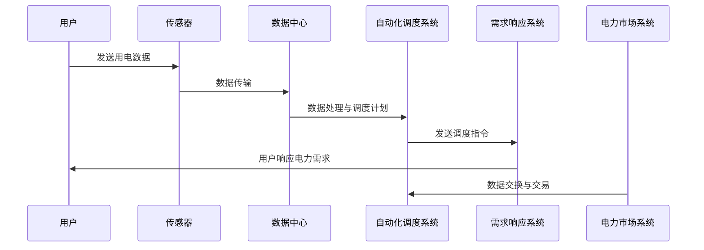
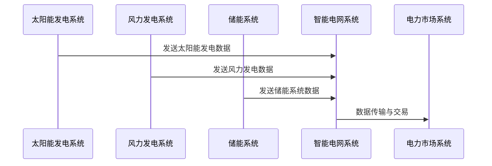
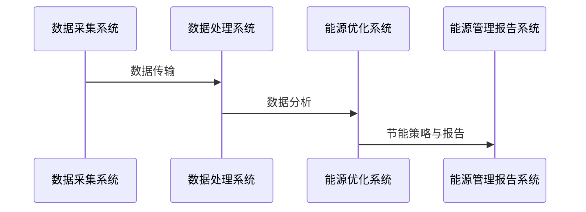

                 

## 第一部分: 引言

### 第1章: 问题背景与问题描述

在当今快速发展的科技时代，能源管理作为国家经济发展和社会稳定的基础设施，正面临着前所未有的挑战。首先，让我们从问题背景入手，深入探讨这一领域的核心问题。

#### 1.1.1 能源危机与环境保护

能源危机是当今世界面临的一个重要问题。随着全球经济的发展和人口的增长，能源消耗日益增加，而传统能源如煤炭、石油和天然气等资源有限，难以满足日益增长的需求。同时，传统能源的过度开采和使用导致了严重的环境问题，如空气污染、水污染和气候变化等。这些问题不仅对人类的健康和生活质量造成了严重影响，也给全球的经济发展带来了巨大的挑战。

##### 能源危机的影响

- **资源枯竭**：传统能源资源的开采和使用速度远超过其自然恢复速度，导致资源枯竭。
- **环境污染**：燃烧化石燃料产生的二氧化碳和其他有害物质，导致空气质量恶化，生态系统受到破坏。
- **气候变化**：全球气候变化加剧，极端天气事件频繁发生，影响农业生产和人类生活。

##### 环境保护的重要性

- **生态平衡**：环境保护有助于维持生态平衡，保护生物多样性。
- **可持续发展**：实现可持续发展，保障未来世代的生活质量。
- **经济发展**：环保产业的发展，可以为经济提供新的增长点。

#### 1.1.2 智能电网的概念与需求

智能电网是利用先进的通信技术、信息技术、自动控制技术和可再生能源技术，实现对电力系统的高效、安全、灵活和可靠的运行。智能电网的出现，是为了应对传统电网面临的诸多挑战，如能源效率低下、电力供应不稳定、能源消耗增加等。

##### 智能电网的特点

- **高度自动化**：通过自动化技术，实现电力系统的远程监控和自动化控制，提高运行效率。
- **智能化管理**：利用大数据分析和人工智能技术，实现电力资源的优化配置和智能调度。
- **可再生能源集成**：支持太阳能、风能等可再生能源的接入和利用，实现清洁能源替代。
- **互动性**：用户与电网之间的互动性增强，实现需求响应和智能用电。

##### 智能电网的需求

- **能源效率提升**：通过智能电网技术，提高能源利用效率，减少能源浪费。
- **电力供应稳定性**：智能电网可以提高电力供应的稳定性，减少停电和电压波动。
- **环保要求**：随着环保要求的提高，智能电网有助于减少碳排放，实现绿色能源转型。

#### 1.1.3 可再生能源的发展现状与挑战

可再生能源，如太阳能、风能、水能等，是未来能源发展的关键。可再生能源具有清洁、可再生、分布广泛等特点，是实现能源可持续发展的理想选择。

##### 可再生能源的发展现状

- **技术进步**：可再生能源技术不断进步，成本持续下降，如太阳能电池转换效率和风力发电设备的发电效率显著提高。
- **政策支持**：各国政府纷纷出台政策，鼓励可再生能源的发展，如补贴、税收优惠等。
- **应用范围扩大**：可再生能源在电力、交通等领域的应用日益广泛，成为能源消费的重要组成部分。

##### 可再生能源的挑战

- **间歇性**：可再生能源具有间歇性特点，如太阳能和风能的发电量受天气和季节影响，需要解决储能和调度问题。
- **并网挑战**：可再生能源的并网存在技术难度，需要解决电网稳定性和兼容性问题。
- **成本问题**：虽然可再生能源技术不断进步，但初期投资成本仍然较高，需要降低成本，提高市场竞争力。

通过上述背景介绍，我们可以看出，能源管理面临的挑战是多方面的，需要从多个角度进行综合考虑。接下来的章节中，我们将深入探讨人工智能在能源管理中的应用，为解决这些问题提供新的思路和方法。

### 1.2 问题描述

在了解了能源管理的背景和挑战后，我们需要明确当前面临的具体问题，这些问题主要集中在以下几个方面：

#### 1.2.1 能源管理中的瓶颈问题

能源管理的瓶颈问题主要体现在以下几个方面：

- **能源利用率低**：传统电网系统由于技术和管理上的限制，能源利用率较低，浪费严重。
- **电力供需不平衡**：由于电力需求的不确定性，电力供应和需求之间存在不平衡，导致电力浪费和停电现象。
- **电力系统稳定性**：电力系统在面对突发事件时，如自然灾害、设备故障等，稳定性较差，容易出现大规模停电。

#### 1.2.2 智能电网与可再生能源整合的难题

智能电网和可再生能源的整合面临以下挑战：

- **技术兼容性**：智能电网和可再生能源技术之间存在兼容性问题，需要解决不同技术之间的接口和协调问题。
- **电网稳定性**：可再生能源的间歇性和不稳定性对电网的稳定性提出了挑战，需要通过智能调度和储能技术解决。
- **成本控制**：智能电网和可再生能源的初期投资较高，如何在控制成本的同时实现高效运行是一个重要问题。

#### 1.2.3 人工智能技术在能源管理中的应用前景

人工智能技术在能源管理中的应用前景广阔，主要体现在以下几个方面：

- **电力系统优化**：通过大数据分析和机器学习算法，实现电力系统的优化调度，提高能源利用效率。
- **电力市场预测**：利用人工智能技术，预测电力市场需求和供应情况，实现精准供需平衡。
- **电力设备维护**：通过故障预测和智能维护，减少电力设备的故障率，提高设备运行效率。

总结以上问题，可以看出，能源管理面临着多重挑战，需要通过技术创新和智能化管理来应对。人工智能技术在能源管理中的应用，为解决这些问题提供了新的思路和方法，具有重要的现实意义和广阔的应用前景。

## 第二部分: 人工智能在能源管理中的应用

### 第2章: 智能电网概述

#### 2.1 智能电网的定义与特点

智能电网（Smart Grid）是指通过现代信息技术、通信技术和自动控制技术，实现电力系统从发电、输电、配电到用电全过程的智能化、高效化和可持续化。与传统电网相比，智能电网具有以下显著特点：

##### 1. 高度自动化

智能电网通过自动化技术和远程监控，实现对电力系统的实时监测和自动化控制，提高了电网的运行效率和稳定性。

##### 2. 智能化管理

智能电网利用大数据分析和人工智能技术，实现电力资源的优化配置和智能调度，降低了能源浪费，提高了能源利用率。

##### 3. 可再生能源集成

智能电网支持太阳能、风能等可再生能源的接入和利用，有助于实现清洁能源替代，减少碳排放，实现可持续发展。

##### 4. 互动性

智能电网增强了用户与电网之间的互动性，用户可以通过智能电表等设备实时了解用电情况，参与需求响应和电力市场交易。

#### 2.2 智能电网的技术体系

智能电网的技术体系包括多个层面，涵盖了从硬件设备到软件系统的一系列技术：

- **传感器网络**：用于实时监测电网运行状态，包括电压、电流、频率等参数，为智能化管理提供数据支持。
- **通信系统**：实现电力系统内部及与外部系统之间的信息传输，包括有线和无线通信技术。
- **数据管理系统**：用于存储、处理和分析电网运行数据，提供决策支持和智能化服务。
- **控制与保护系统**：实现对电力系统的实时控制和保护，确保电网的安全稳定运行。
- **电力市场系统**：支持电力市场的交易和管理，实现供需平衡和资源优化配置。

#### 2.3 智能电网的关键技术

智能电网的实现依赖于多项关键技术的支撑，主要包括：

- **物联网技术**：通过物联网技术，实现对电力系统中各类设备的智能连接和管理，提高系统的互联互通性和协同工作能力。
- **云计算与大数据技术**：利用云计算和大数据技术，实现对海量数据的存储、处理和分析，为电力系统的优化调度和智能决策提供支持。
- **人工智能与机器学习技术**：通过人工智能和机器学习算法，实现对电力系统运行状态的预测、优化和故障诊断，提高电网的智能化水平和运行效率。
- **储能技术**：储能技术在智能电网中起到关键作用，能够平衡可再生能源的间歇性特点，提高电网的稳定性和可靠性。
- **安全技术**：保障电力系统的信息安全，防止黑客攻击和数据泄露，确保电网的安全稳定运行。

### 智能电网的ER实体关系图

为了更清晰地展示智能电网的各个实体及其关系，我们使用Mermaid绘制了一个ER实体关系图，如下图所示：

```mermaid
erDiagram
  User ||--o{ SmartMeter : 用户与智能电表的关联 }
  Generator ||--o{ TransformerStation : 发电机与变压器站的关联 }
  TransformerStation ||--o{ DistributionStation : 变电站与配电站的关联 }
  DistributionStation ||--o{ Consumer : 配电站与用户的关联 }
  RenewableEnergySystem ||--o{ SmartGrid : 可再生能源系统与智能电网的关联 }
  SmartGrid ||--o{ PowerMarket : 智能电网与电力市场的关联 }
```

通过上述ER实体关系图，我们可以看到智能电网中各个实体及其相互关联，这有助于我们更好地理解智能电网的组成和运作机制。

## 第3章: 人工智能技术在智能电网中的应用

#### 3.1 人工智能技术在电力系统优化中的应用

人工智能技术在电力系统优化中发挥着重要作用，通过数据分析和机器学习算法，实现对电力系统的优化调度和运行控制，从而提高能源利用效率和电网稳定性。以下是人工智能在电力系统优化中应用的几个方面：

##### 1. 负荷预测

电力负荷预测是电力系统优化的重要一环。通过收集历史负荷数据，结合天气、节假日、经济活动等因素，利用机器学习算法（如回归分析、神经网络、时间序列分析等）对未来的负荷进行预测。准确的负荷预测有助于电力系统更好地安排发电和分配电力，避免电力过剩或不足。

##### 2. 调度优化

在电力系统中，调度优化是指根据实时数据，通过优化算法（如线性规划、遗传算法、粒子群算法等）对发电资源进行优化分配，以实现最低成本或最高效率。人工智能技术能够处理大量数据，快速生成调度方案，提高电力系统的运行效率。

##### 3. 故障诊断与预防性维护

通过监测电网中的各种参数（如电压、电流、温度等），人工智能技术可以识别电网中的异常情况，进行故障诊断。此外，基于历史数据和机器学习算法，可以预测设备的故障概率，进行预防性维护，减少停电和设备故障的风险。

##### 4. 能源管理

人工智能技术在能源管理中的应用非常广泛，包括能源消耗预测、能源优化配置、能源价格预测等。通过大数据分析和机器学习算法，可以实现更精准的能源管理，降低能源成本，提高能源利用率。

#### 3.2 人工智能技术在电力市场中的应用

电力市场是电力系统的重要组成部分，通过市场化手段，实现电力资源的优化配置。人工智能技术在电力市场中同样发挥着重要作用，主要体现在以下几个方面：

##### 1. 市场交易预测

电力市场交易预测是电力市场运作的关键。通过分析历史交易数据、市场价格、供需情况等因素，利用机器学习算法（如决策树、支持向量机、随机森林等），可以预测未来的电力市场交易情况，为市场参与者提供决策支持。

##### 2. 供需平衡

电力市场需要平衡供需，以确保电力市场的稳定运行。人工智能技术可以通过优化算法，根据实时供需情况，调整发电和购电计划，实现供需平衡，避免市场波动。

##### 3. 风险管理

电力市场存在多种风险，如价格波动、供需不平衡、政策变化等。人工智能技术可以帮助市场参与者识别和管理这些风险，通过预测分析，制定相应的风险管理策略。

##### 4. 资源配置

人工智能技术可以帮助电力市场参与者更有效地配置资源。通过分析市场需求、资源供应、成本等因素，人工智能算法可以优化资源分配，提高市场效率。

#### 3.3 人工智能技术在电力调度与控制中的应用

人工智能技术在电力调度与控制中具有广泛的应用，可以提高电网的运行效率和稳定性。以下是人工智能在电力调度与控制中应用的几个方面：

##### 1. 自动化调度

通过自动化调度系统，人工智能技术可以自动生成电力调度计划，并根据实时数据进行调整，提高调度效率。自动化调度系统可以处理大量数据，快速生成调度方案，减少人工干预。

##### 2. 实时监测与控制

人工智能技术可以通过实时监测电网运行状态，实现对电网的实时控制和调节。利用机器学习算法，可以识别电网中的异常情况，及时采取控制措施，保障电网的稳定运行。

##### 3. 预测性控制

通过预测电网的未来运行状态，人工智能技术可以提前采取控制措施，避免潜在的故障和风险。预测性控制技术可以通过分析历史数据和实时数据，预测电网的未来运行趋势，提前调整控制策略。

##### 4. 能源存储优化

能源存储系统（如电池）在智能电网中起到关键作用。人工智能技术可以帮助优化能源存储系统的运行，提高储能效率。通过分析储能系统的历史数据和实时数据，人工智能算法可以预测储能需求，调整储能策略，提高能源利用率。

### 3.4 人工智能技术在电力系统优化中的应用案例

以下是人工智能在电力系统优化中的一些实际应用案例：

##### 1. 案例一：某电力公司的负荷预测与调度优化

某电力公司利用机器学习算法对电力负荷进行预测，并基于预测结果进行调度优化。通过优化调度，该公司成功降低了电力成本，提高了能源利用率，减少了停电次数。

##### 2. 案例二：智能电网中的故障诊断与预防性维护

某智能电网项目通过引入人工智能技术，实现了对电网故障的实时监测和诊断。通过分析历史故障数据和实时数据，人工智能系统能够预测潜在的故障，提前进行预防性维护，减少了设备故障率和停电时间。

##### 3. 案例三：电力市场交易预测与风险管理

某电力市场利用人工智能技术进行交易预测和风险管理。通过分析历史交易数据和市场价格，人工智能系统可以预测未来的交易情况，为市场参与者提供决策支持，降低了市场风险。

这些案例表明，人工智能技术在电力系统优化中具有巨大的潜力，可以为电力系统的高效、安全、稳定运行提供有力支持。

## 第4章: 可再生能源整合

#### 4.1 可再生能源概述

可再生能源是指那些可以在人类时间尺度内不断得到补充的能源，如太阳能、风能、水能、地热能和生物质能等。与传统化石能源相比，可再生能源具有清洁、可再生、分布广泛和低碳排放等优势，是实现能源可持续发展的关键。

##### 1. 太阳能

太阳能是通过太阳辐射能转化为电能或热能的过程。目前，太阳能主要利用光伏电池和太阳能热水器进行发电和加热。太阳能具有分布广泛、清洁无污染、资源潜力巨大等特点。

##### 2. 风能

风能是通过风力驱动风力发电机产生电能的过程。风能资源丰富，尤其在一些风力资源丰富的地区，风能发电具有显著的经济和环保效益。

##### 3. 水能

水能是通过水流驱动水轮机发电的过程。水能资源主要集中在河流、湖泊和水库，可以通过建设水电站进行发电。水能是一种稳定、可靠的可再生能源。

##### 4. 地热能

地热能是利用地球内部的热能进行发电和供暖的过程。地热能资源丰富，尤其在一些火山活跃的地区，地热能开发利用具有巨大的潜力。

##### 5. 生物质能

生物质能是通过生物质材料（如农作物废弃物、木材、垃圾等）进行燃烧或发酵产生热能和电能的过程。生物质能是一种可再生能源，可以有效减少温室气体排放。

#### 4.2 可再生能源接入智能电网的挑战与解决方案

尽管可再生能源具有诸多优势，但在接入智能电网时仍面临一些挑战，需要通过技术创新和智能化管理来解决。

##### 1. 间歇性与波动性

可再生能源如太阳能和风能具有间歇性和波动性特点，其发电量受天气和季节影响较大。这种不稳定性对电网的稳定运行构成了挑战。

**解决方案**：引入储能技术，如电池储能和抽水蓄能，可以平衡可再生能源的波动性，确保电力供应的稳定性。

##### 2. 并网兼容性

可再生能源的接入需要解决与电网的兼容性问题，包括电压、频率、相位等参数的匹配。

**解决方案**：研发先进的并网技术和设备，如逆变器、同步机等，确保可再生能源稳定、高效地接入电网。

##### 3. 能量密度与传输距离

可再生能源资源通常分布在远离负荷中心的地方，需要通过长距离输电进行传输。然而，可再生能源的能量密度较低，长距离传输损耗较大。

**解决方案**：发展高效长距离输电技术，如超高压直流输电技术，减少能量损耗。同时，优化电网结构，提高电力传输的效率。

##### 4. 成本问题

可再生能源的初期投资较高，包括设备采购、安装和维护等成本。这限制了可再生能源的普及和大规模应用。

**解决方案**：通过政策支持和市场机制，降低可再生能源的成本，提高其经济性和竞争力。同时，推广可再生能源技术，实现规模化生产，降低单位成本。

#### 4.3 可再生能源优化调度与控制

为了充分发挥可再生能源的优势，并确保电网的稳定运行，可再生能源的优化调度与控制至关重要。以下是一些关键技术：

##### 1. 负荷预测与调度优化

通过大数据分析和机器学习算法，对可再生能源发电量进行预测，并基于预测结果进行电力调度优化，实现供需平衡。

##### 2. 能量管理

通过能量管理系统，实时监测可再生能源的发电和储能情况，优化能量分配，提高能源利用率。

##### 3. 故障诊断与维护

利用人工智能技术，对可再生能源设备进行实时监测和故障诊断，实现预防性维护，减少故障率和停机时间。

##### 4. 供需平衡

通过智能调度和能量管理，实现可再生能源发电与电网需求的实时平衡，减少能源浪费和停电风险。

##### 5. 市场交易

利用人工智能技术，进行电力市场交易预测和风险管理，提高电力市场的效率和稳定性。

通过以上措施，可再生能源的优化调度与控制可以实现高效、稳定、可靠的电力供应，为智能电网的发展提供有力支持。

## 第5章: 人工智能在能源管理中的应用案例分析

### 5.1 案例一：智能电网建设中的应用

#### 项目介绍

某电力公司为了提升电网智能化水平，决定实施智能电网建设项目。该项目旨在通过引入先进的信息技术和人工智能技术，实现电网的自动化、智能化和高效化运行。

#### 系统功能设计

- **数据采集与监测**：通过安装智能传感器，实时采集电网运行数据，包括电压、电流、频率等参数。
- **自动化调度**：利用机器学习算法，根据实时数据和预测结果，自动生成电力调度计划，优化发电和分配。
- **故障诊断与预防性维护**：通过人工智能技术，对电网进行实时监测和故障诊断，提前采取预防性维护措施。
- **需求响应**：通过智能电表等设备，实现用户与电网之间的互动，提高电力需求的响应能力。
- **电力市场交易**：利用人工智能技术，进行电力市场交易预测和风险管理，提高市场参与者的交易效率和收益。

#### 系统架构设计

智能电网系统架构设计包括以下关键组件：

- **传感器网络**：用于实时监测电网运行状态，数据通过无线通信模块传输到数据中心。
- **数据中心**：用于存储和处理传感器采集的数据，提供决策支持和智能化服务。
- **自动化调度系统**：用于实现电力系统的优化调度，提高运行效率。
- **故障诊断系统**：用于实时监测电网故障，进行故障诊断和预防性维护。
- **需求响应系统**：用于实现用户与电网之间的互动，提高电力需求响应能力。
- **电力市场系统**：用于支持电力市场的交易和管理，实现供需平衡和资源优化配置。

#### 系统接口设计与交互

智能电网系统接口设计主要包括以下方面：

- **传感器与数据中心**：传感器采集的数据通过无线通信模块传输到数据中心，实现数据的实时传输和处理。
- **数据中心与自动化调度系统**：数据中心将处理后的数据传送给自动化调度系统，用于生成调度计划和优化控制。
- **自动化调度系统与需求响应系统**：自动化调度系统根据需求响应系统的实时数据，调整电力调度计划，满足用户需求。
- **电力市场系统与自动化调度系统**：电力市场系统与自动化调度系统进行数据交换，实现电力市场的交易和调度优化。

#### 系统交互Mermaid序列图



#### 系统实现与效果分析

通过实施智能电网建设项目，该电力公司取得了显著成效：

- **提高电网运行效率**：通过自动化调度和实时监测，电网运行效率显著提高，减少了电力浪费。
- **降低运维成本**：通过故障诊断和预防性维护，减少了设备故障率和停电时间，降低了运维成本。
- **提高用户满意度**：通过需求响应系统，用户可以更灵活地调整用电计划，提高了用户体验和满意度。
- **增强市场竞争力**：通过电力市场系统的数据交换和交易，提高了电力市场的效率和稳定性，增强了公司的市场竞争力。

#### 项目小结

智能电网建设项目为电力系统的智能化、自动化和高效化提供了有力支持，通过引入人工智能技术，实现了电力系统的优化调度、故障诊断和需求响应等功能，取得了显著的经济和社会效益。该项目为其他电力公司提供了有益的借鉴和经验。

### 5.2 案例二：可再生能源整合中的应用

#### 项目介绍

某地方政府为了推动可再生能源的发展，决定实施可再生能源整合项目。该项目旨在通过引入先进的可再生能源技术和人工智能技术，实现可再生能源的高效接入、优化调度和稳定运行。

#### 系统功能设计

- **太阳能发电与调度**：通过安装太阳能光伏板，实现太阳能发电。利用人工智能技术，对太阳能发电进行优化调度，提高发电效率。
- **风力发电与调度**：通过安装风力发电机，实现风能发电。利用人工智能技术，对风力发电进行优化调度，提高发电效率。
- **储能系统**：通过建设储能系统，如电池储能和抽水蓄能，实现可再生能源的储能和调度，平衡发电和用电需求。
- **电网接入**：通过智能电网技术，实现可再生能源与电网的稳定接入和实时监控。
- **电力市场交易**：通过电力市场系统，实现可再生能源的电力交易，提高市场效率和收益。

#### 系统架构设计

可再生能源整合系统架构设计包括以下关键组件：

- **太阳能发电系统**：包括太阳能光伏板、逆变器、能量管理系统等。
- **风力发电系统**：包括风力发电机、逆变器、能量管理系统等。
- **储能系统**：包括电池储能、抽水蓄能等。
- **智能电网系统**：包括传感器网络、数据中心、自动化调度系统、需求响应系统等。
- **电力市场系统**：包括电力交易平台、市场分析系统、交易管理系统等。

#### 系统接口设计与交互

可再生能源整合系统接口设计主要包括以下方面：

- **太阳能发电系统与智能电网**：太阳能发电系统的数据通过无线通信模块传输到智能电网系统，实现数据的实时传输和处理。
- **风力发电系统与智能电网**：风力发电系统的数据通过无线通信模块传输到智能电网系统，实现数据的实时传输和处理。
- **储能系统与智能电网**：储能系统的数据通过无线通信模块传输到智能电网系统，实现数据的实时传输和处理。
- **智能电网与电力市场系统**：智能电网系统的数据通过电力交易平台传输到电力市场系统，实现电力交易和调度优化。

#### 系统交互Mermaid序列图



#### 系统实现与效果分析

通过实施可再生能源整合项目，该地方政府取得了显著成效：

- **提高可再生能源利用率**：通过优化调度和储能系统，提高了可再生能源的利用率，减少了能源浪费。
- **稳定电力供应**：通过智能电网技术和储能系统的应用，实现了可再生能源的稳定接入和调度，提高了电力供应的稳定性。
- **降低碳排放**：通过可再生能源的接入和优化调度，降低了碳排放，实现了绿色能源转型。
- **提高市场收益**：通过电力市场交易系统的应用，实现了可再生能源的市场化运营，提高了市场收益。

#### 项目小结

可再生能源整合项目为可再生能源的高效接入、优化调度和市场化运营提供了有力支持，通过引入人工智能技术和智能电网技术，实现了可再生能源的稳定、高效、环保运行。该项目为其他地区的可再生能源发展提供了有益的经验和借鉴。

### 5.3 案例三：能源管理系统优化中的应用

#### 项目介绍

某大型工业企业为了提高能源利用效率，降低运营成本，决定实施能源管理系统优化项目。该项目旨在通过引入人工智能技术和大数据分析，对企业的能源消耗进行实时监测、分析和优化。

#### 系统功能设计

- **能源数据采集与监测**：通过安装智能传感器，实时采集企业各生产环节的能源消耗数据，包括电力、燃气、水等。
- **能源数据分析与优化**：利用大数据分析和机器学习算法，对采集到的能源数据进行深度分析，识别能源浪费和优化潜力。
- **节能策略制定**：根据数据分析结果，制定针对性的节能策略，实现能源消耗的优化。
- **能源管理报告**：定期生成能源管理报告，为企业提供能源消耗和节能效果的详细分析。

#### 系统架构设计

能源管理系统架构设计包括以下关键组件：

- **数据采集系统**：包括传感器网络和数据采集终端。
- **数据处理与分析系统**：用于处理和存储采集到的数据，并提供数据分析功能。
- **能源优化系统**：用于根据数据分析结果制定节能策略。
- **能源管理报告系统**：用于生成和分析能源管理报告。

#### 系统接口设计与交互

能源管理系统接口设计主要包括以下方面：

- **数据采集系统与数据处理系统**：数据采集系统通过无线通信模块将数据传输到数据处理系统，实现数据的实时传输和处理。
- **数据处理系统与能源优化系统**：数据处理系统将分析结果传输给能源优化系统，用于制定节能策略。
- **能源优化系统与能源管理报告系统**：能源优化系统将节能策略传输给能源管理报告系统，用于生成和分析能源管理报告。

#### 系统交互Mermaid序列图



#### 系统实现与效果分析

通过实施能源管理系统优化项目，该企业取得了显著成效：

- **提高能源利用效率**：通过实时监测和数据分析，识别了能源浪费环节，制定了针对性的节能策略，提高了能源利用效率。
- **降低运营成本**：通过优化能源消耗，降低了能源成本，提高了企业的盈利能力。
- **改善环境表现**：通过减少能源消耗，降低了碳排放，改善了企业的环境表现。
- **提高管理效率**：通过能源管理系统的应用，实现了能源消耗的实时监测和数据分析，提高了能源管理的效率和准确性。

#### 项目小结

能源管理系统优化项目为企业的能源消耗管理提供了有力支持，通过引入人工智能技术和大数据分析，实现了能源消耗的实时监测、分析和优化，取得了显著的经济和环境效益。该项目为其他企业的能源管理提供了有益的经验和借鉴。

## 第6章: 人工智能在能源管理中的未来发展趋势

### 6.1 人工智能在能源管理中的技术挑战

尽管人工智能技术在能源管理中已经取得了一定的成果，但在未来的发展过程中，仍然面临一些技术挑战：

##### 1. 数据质量和可靠性

人工智能技术依赖于大量高质量的数据进行训练和预测。然而，能源数据通常存在噪声、缺失值和不一致性等问题，这会影响模型的性能和可靠性。

**解决方案**：通过数据清洗、数据增强和异常检测等技术，提高能源数据的质量和可靠性。

##### 2. 实时数据处理能力

能源系统具有实时性要求，需要快速处理和分析大量实时数据。然而，现有的数据处理技术和硬件设施可能无法满足这种需求。

**解决方案**：发展高效的实时数据处理技术和分布式计算架构，如流处理框架和边缘计算技术。

##### 3. 模型解释性和可解释性

人工智能模型，特别是深度学习模型，通常被认为是“黑盒子”，其决策过程难以解释和理解。这对于需要透明度和可解释性的能源管理系统来说是一个挑战。

**解决方案**：研究可解释的人工智能模型和解释性技术，如决策树、局部可解释模型（LIME）等。

##### 4. 安全性和隐私保护

能源管理系统需要处理大量的敏感数据，如用户用电数据、电网运行参数等。这些数据的安全性和隐私保护是重要的挑战。

**解决方案**：采用数据加密、访问控制、隐私保护算法等安全技术，确保数据的安全性和隐私保护。

### 6.2 人工智能在能源管理中的市场机遇

随着全球对可持续发展和清洁能源的重视，人工智能在能源管理中的市场机遇也在不断增加：

##### 1. 智能电网建设

智能电网的建设和升级为人工智能技术在电力系统优化、电力市场预测、故障诊断等方面提供了巨大的市场空间。

##### 2. 可再生能源整合

可再生能源的快速发展，如太阳能、风能、水能等，为人工智能技术在能量管理、调度优化、储能系统控制等方面提供了广泛的应用场景。

##### 3. 能源效率提升

企业对能源效率提升的需求不断增长，人工智能技术在能源数据分析、优化调度、节能策略制定等方面具有巨大的市场潜力。

##### 4. 电力市场交易

随着电力市场的开放和市场化改革，人工智能技术在电力市场交易预测、风险管理、供需平衡等方面具有广泛的应用前景。

### 6.3 人工智能在能源管理中的未来发展方向

展望未来，人工智能在能源管理中将继续向以下方向发展：

##### 1. 综合智能能源系统

未来的能源管理系统将更加综合和智能化，实现多能源、多领域的协同优化和调度。通过集成人工智能技术，实现能源系统的全面智能化。

##### 2. 自主能源管理

通过发展自主学习和决策能力，实现能源系统的自主管理，降低人工干预，提高系统的运行效率和可靠性。

##### 3. 绿色能源转型

随着全球对环境保护和可持续发展的重视，绿色能源转型将是未来能源管理的重要方向。人工智能技术将在可再生能源的调度、优化和市场化运营中发挥关键作用。

##### 4. 智能能源交易

未来的电力市场将更加智能化和市场化，通过人工智能技术实现电力交易的自动化、智能化和高效化，提高市场效率和透明度。

通过不断突破技术挑战和抓住市场机遇，人工智能在能源管理中的未来将更加光明，为能源系统的智能化、高效化和可持续发展提供强有力的支持。

### 第7章: 总结与展望

#### 7.1 本书总结

本书从问题背景出发，深入探讨了人工智能在能源管理中的应用。首先，我们介绍了能源管理的背景，包括能源危机、环境保护、智能电网和可再生能源发展现状等。接着，详细分析了人工智能在智能电网和可再生能源整合中的应用，包括电力系统优化、电力市场预测、电力调度与控制等方面。此外，通过实际案例，展示了人工智能技术在能源管理中的具体应用和成效。最后，我们对人工智能在能源管理中的未来发展趋势进行了展望。

#### 7.2 研究展望

未来的研究应关注以下几个方面：

1. **数据质量和可靠性**：改进数据采集和处理技术，提高数据质量和可靠性，为人工智能模型提供更好的训练数据。
2. **实时数据处理能力**：发展高效的实时数据处理技术和分布式计算架构，满足能源系统对实时性的需求。
3. **模型解释性和可解释性**：研究可解释的人工智能模型和解释性技术，提高模型的可解释性和透明度，增强用户信任。
4. **安全性与隐私保护**：加强数据安全和隐私保护，确保能源管理系统中的数据安全和用户隐私。

#### 7.3 展望未来

随着技术的不断进步和市场需求的增长，人工智能在能源管理中的应用前景将更加广阔。未来的能源管理系统将更加智能化、高效化和可持续发展，为全球能源危机和环境保护提供有力支持。我们期待人工智能技术能够为能源管理带来更多创新和突破，共同构建一个绿色、高效、可持续的能源未来。

### 作者

作者：AI天才研究院/AI Genius Institute & 禅与计算机程序设计艺术 /Zen And The Art of Computer Programming

---

在本文中，我们系统地介绍了人工智能在能源管理中的应用，包括智能电网和可再生能源整合的关键技术、实际案例和未来发展趋势。通过深入分析和实际案例的展示，我们展示了人工智能技术在提高能源利用效率、优化电力调度、降低成本和实现绿色能源转型中的巨大潜力。随着技术的不断进步和市场需求的增长，人工智能在能源管理中的应用前景将更加广阔，为全球能源危机和环境保护提供有力支持。未来，我们期待人工智能技术能够为能源管理带来更多创新和突破，共同构建一个绿色、高效、可持续的能源未来。作者AI天才研究院和《禅与计算机程序设计艺术》的联合撰写，旨在为读者提供高质量的技术洞察和实用指南。希望本文对您在能源管理和人工智能领域的探索和学习有所帮助。

