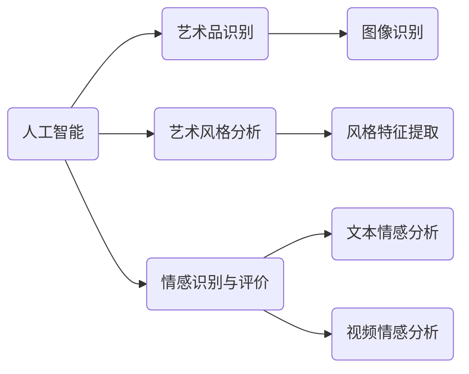
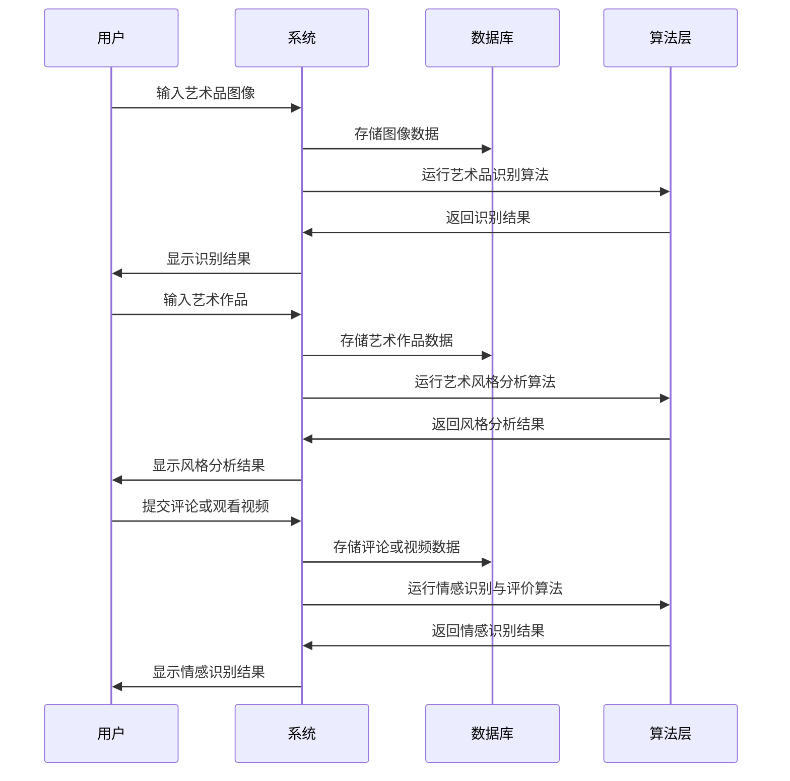

                 

# 人工智能在艺术鉴赏中的应用：科技与人文的碰撞

关键词：人工智能、艺术鉴赏、科技与人文、艺术品识别、情感分析

摘要：本文深入探讨了人工智能在艺术鉴赏中的应用，分析了人工智能的发展历程及其在艺术创作和鉴赏中的重要作用。通过具体案例分析，本文展示了人工智能在艺术品识别、艺术风格分析和情感识别与评价等方面的应用，并探讨了人工智能在艺术鉴赏中的伦理与社会影响。

## 第一部分：引言

### 1.1 问题背景

#### 1.1.1 人工智能的发展历程

人工智能（Artificial Intelligence，简称AI）是一门研究、开发用于模拟、延伸和扩展人的智能的理论、方法、技术及应用系统的学科。人工智能的研究可以追溯到20世纪50年代，至今已走过近70年的发展历程。从最初的符号主义、知识表示到现代的机器学习和深度学习，人工智能经历了多次技术革命和理论创新。近年来，随着大数据、云计算、物联网等技术的发展，人工智能的应用场景不断扩展，逐渐渗透到各行各业。

#### 1.1.2 艺术鉴赏领域面临的挑战

艺术鉴赏是指通过感知、理解和评价艺术品的过程，对艺术作品进行审美判断。然而，传统的艺术鉴赏方式存在一定局限性，如主观性强、受限于个人经验和知识水平等。随着艺术品的数量和种类日益增多，人们需要一种更加高效、客观的方式来欣赏和理解艺术品。

#### 1.1.3 科技与人文碰撞的重要性

人工智能与艺术鉴赏的结合，不仅有助于提升艺术品的识别、鉴赏和评价水平，还可以为艺术创作提供新的灵感。在科技与人文的碰撞中，人工智能为艺术鉴赏带来了新的机遇和挑战。如何充分利用人工智能技术，实现科技与人文的深度融合，成为当前研究的热点问题。

### 1.2 核心概念

#### 1.2.1 人工智能

**定义**：人工智能是指模拟、延伸和扩展人的智能的理论、方法、技术及应用系统的学科。

**发展阶段**：
1. 符号主义（Symbolic AI）：基于知识表示和推理的早期人工智能。
2. 机器学习（Machine Learning）：通过训练数据集，让计算机自主学习。
3. 深度学习（Deep Learning）：基于多层神经网络，实现自动化特征学习和建模。

#### 1.2.2 艺术鉴赏

**定义**：艺术鉴赏是指通过感知、理解和评价艺术品的过程，对艺术作品进行审美判断。

**方法与过程**：
1. 感知：通过视觉、听觉等感官获取艺术品的信息。
2. 理解：借助个人经验和知识，对艺术品进行解读。
3. 评价：根据艺术品的表现形式、内涵、价值等因素，进行审美判断。

### 1.3 书籍结构概述

#### 1.3.1 全书内容布局

本书分为四个部分，分别从人工智能基础理论、人工智能在艺术鉴赏中的应用实践、人工智能在艺术鉴赏中的伦理与社会影响等方面进行探讨。

#### 1.3.2 各章节内容简述

1. 第一部分：人工智能基础理论，介绍人工智能的基本原理、数据处理与特征提取以及人工智能在艺术领域的应用。
2. 第二部分：人工智能在艺术鉴赏中的应用实践，分析艺术品识别技术、艺术风格分析和情感识别与评价的具体实现。
3. 第三部分：人工智能在艺术鉴赏中的伦理与社会影响，探讨人工智能在艺术鉴赏中的伦理问题及其社会影响。
4. 第四部分：总结与展望，对全书内容进行总结，并对人工智能在艺术鉴赏中的应用前景进行展望。

### 1.4 目标读者

#### 1.4.1 适合人群

1. 人工智能、计算机科学等相关专业的研究生和本科生。
2. 对人工智能和艺术鉴赏感兴趣的跨学科研究人员。
3. 艺术创作者、艺术品收藏家和艺术爱好者。

#### 1.4.2 读者需求

1. 深入了解人工智能在艺术鉴赏中的应用。
2. 掌握人工智能在艺术品识别、艺术风格分析和情感识别与评价等方面的核心技术。
3. 关注人工智能在艺术鉴赏中的伦理与社会影响。

### 1.5 本章小结

本章介绍了人工智能在艺术鉴赏中的应用背景、核心概念和书籍结构。通过分析人工智能的发展历程和艺术鉴赏的挑战，阐述了科技与人文碰撞的重要性。同时，对本书的目标读者和读者需求进行了说明。

## 第二部分：人工智能基础理论

### 2.1 人工智能基本原理

#### 2.1.1 人工智能的核心概念

**机器学习**：一种通过训练数据集，让计算机自主学习的方法。根据学习策略的不同，可分为监督学习、无监督学习和强化学习。

**深度学习**：基于多层神经网络，实现自动化特征学习和建模。深度学习在图像识别、自然语言处理等领域取得了显著成果。

#### 2.1.2 人工智能的算法体系

**监督学习**：有标记数据集进行训练，通过学习得到预测模型。

**无监督学习**：无标记数据集进行训练，主要用于聚类和降维。

**强化学习**：通过与环境的交互，学习最优策略。

#### 2.1.3 人工智能的发展阶段

1. 符号主义（Symbolic AI）：基于知识表示和推理的早期人工智能。
2. 机器学习（Machine Learning）：通过训练数据集，让计算机自主学习。
3. 深度学习（Deep Learning）：基于多层神经网络，实现自动化特征学习和建模。

### 2.2 数据处理与特征提取

#### 2.2.1 数据预处理

**数据清洗**：去除噪声、缺失值和异常值，确保数据质量。

**数据归一化**：将不同特征的数据进行统一处理，便于模型训练。

#### 2.2.2 特征提取

**特征选择**：从原始数据中筛选出对模型训练有显著影响的特征。

**特征工程**：通过对特征进行变换和组合，提高模型性能。

### 2.3 人工智能在艺术领域的应用

#### 2.3.1 人工智能在艺术创作中的应用

**数字艺术**：利用计算机生成或处理的艺术作品，如虚拟现实、增强现实等。

**音乐创作**：基于人工智能算法生成或改编音乐。

**设计与创新**：利用人工智能辅助设计，提高创意和质量。

#### 2.3.2 人工智能在艺术鉴赏中的应用

**艺术品识别**：通过图像识别技术，自动识别和分类艺术品。

**艺术风格分析**：分析艺术作品中的风格特征，辅助艺术鉴赏。

**情感识别与评价**：通过文本情感分析和视频情感分析，识别和评价观众的情感反应。

### 2.4 本章小结

本章介绍了人工智能的基本原理、数据处理与特征提取以及人工智能在艺术领域的应用。通过对核心概念和算法体系的阐述，为后续章节的内容奠定了基础。同时，分析了人工智能在艺术创作和鉴赏中的重要作用。

## 第三部分：人工智能在艺术鉴赏中的应用实践

### 3.1 艺术品识别技术

#### 3.1.1 艺术品识别算法原理

艺术品识别技术主要基于计算机视觉和深度学习技术。计算机视觉是指让计算机模拟人类的视觉系统，对图像进行分析和理解。深度学习是一种基于多层神经网络的人工智能技术，能够实现自动化特征学习和建模。

#### 3.1.1.1 卷积神经网络

卷积神经网络（Convolutional Neural Network，简称CNN）是一种专门用于图像识别和处理的人工神经网络。其核心思想是使用卷积层来提取图像特征，并通过全连接层进行分类。

**卷积层**：通过卷积运算提取图像特征。

**池化层**：对卷积特征进行降采样，减少参数数量。

**全连接层**：将卷积特征映射到分类结果。

#### 3.1.1.2 特征提取与分类

在艺术品识别中，首先需要对图像进行预处理，包括数据清洗、归一化等。然后，利用CNN提取图像特征，并通过全连接层进行分类。

**特征提取**：通过卷积神经网络，提取图像中的艺术风格、纹理、颜色等特征。

**分类**：将提取到的特征输入到全连接层，通过softmax函数输出分类结果。

#### 3.1.2 艺术品识别实践

**数据集准备**：准备一个包含大量艺术品图像的数据集，对图像进行标注。

**算法实现**：使用深度学习框架（如TensorFlow或PyTorch）实现CNN模型，并进行训练和评估。

**实践案例剖析**：以某博物馆艺术品图像数据集为例，展示艺术品识别技术的实现过程和应用效果。

### 3.2 艺术风格分析

#### 3.2.1 艺术风格分析算法原理

艺术风格分析是指通过分析艺术作品中的风格特征，辅助艺术鉴赏和理解。深度学习模型在艺术风格分析中发挥着重要作用。

**深度学习模型**：使用卷积神经网络或其他深度学习模型，对艺术作品进行特征提取和分类。

**图像风格迁移**：通过生成对抗网络（GAN）等模型，将一种艺术风格迁移到另一幅图像上，从而分析艺术作品的风格特征。

#### 3.2.2 艺术风格分析实践

**数据集构建**：准备一个包含不同艺术风格的图像数据集。

**算法实现**：使用深度学习框架实现艺术风格分析模型，并进行训练和评估。

**实践案例剖析**：以某艺术风格分析项目为例，展示艺术风格分析技术的实现过程和应用效果。

### 3.3 情感识别与评价

#### 3.3.1 情感识别算法原理

情感识别是指通过文本或视频数据，识别出其中的情感倾向。文本情感分析主要使用自然语言处理技术，视频情感分析则结合计算机视觉和自然语言处理技术。

**文本情感分析**：通过词向量模型、情感词典等方法，对文本进行情感分类。

**视频情感分析**：结合视觉和文本情感分析，对视频中的情感进行识别。

#### 3.3.2 情感评价实践

**数据集构建**：准备一个包含不同情感类型的文本和视频数据集。

**算法实现**：使用深度学习框架实现情感识别模型，并进行训练和评估。

**实践案例剖析**：以某情感识别项目为例，展示情感识别技术的实现过程和应用效果。

### 3.4 本章小结

本章介绍了人工智能在艺术鉴赏中的应用实践，包括艺术品识别技术、艺术风格分析和情感识别与评价。通过具体实践案例，展示了人工智能技术在艺术鉴赏中的应用效果，为艺术爱好者提供了新的鉴赏工具。

## 第四部分：人工智能在艺术鉴赏中的伦理与社会影响

### 4.1 人工智能在艺术鉴赏中的伦理问题

人工智能在艺术鉴赏中的应用带来了许多伦理问题，如艺术创作与自主性的矛盾、艺术品评价的公正性等。

#### 4.1.1 艺术创作与自主性的矛盾

人工智能在艺术创作中的应用，可能会削弱艺术家的自主性和创造性。一方面，人工智能可以辅助艺术家进行创作，提高效率；另一方面，过度依赖人工智能可能会导致艺术家失去对作品的主导权。

#### 4.1.2 艺术品评价的公正性问题

人工智能在艺术品识别和评价中的应用，可能会引发公正性问题。例如，人工智能算法可能存在偏见，导致对某些艺术家的作品评价不准确。此外，艺术品的价值可能受到人工智能的影响，从而影响市场的公正性。

### 4.2 人工智能在艺术鉴赏中的社会影响

人工智能在艺术鉴赏中的应用，不仅为人们提供了新的鉴赏方式，也对社会产生了深远影响。

#### 4.2.1 拓宽艺术鉴赏的视野

人工智能可以帮助人们更好地欣赏和理解艺术作品，从而拓宽艺术鉴赏的视野。例如，通过艺术品识别技术，人们可以快速了解艺术品的背景和作者信息。

#### 4.2.2 提高艺术教育的普及度

人工智能在艺术鉴赏中的应用，有助于提高艺术教育的普及度。通过在线课程、虚拟展览等方式，人们可以随时随地学习艺术知识，提高艺术素养。

### 4.3 社会责任与可持续发展

在人工智能在艺术鉴赏中的应用过程中，企业和社会需要承担相应的社会责任，确保其可持续发展。

#### 4.3.1 公平性与包容性

企业应确保人工智能技术在艺术鉴赏中的应用具有公平性和包容性，避免算法偏见和歧视。同时，应关注弱势群体的艺术需求，提供平等的艺术鉴赏机会。

#### 4.3.2 数据安全和隐私保护

在艺术鉴赏过程中，人工智能需要处理大量的数据。企业应确保数据的安全和隐私保护，遵循相关法律法规，防止数据泄露和滥用。

#### 4.3.3 艺术创新与传承

人工智能在艺术鉴赏中的应用，应注重艺术创新与传承。企业和社会应鼓励艺术家利用人工智能技术进行创作，推动艺术的发展和创新。

### 4.4 本章小结

本章探讨了人工智能在艺术鉴赏中的伦理与社会影响。通过分析人工智能在艺术创作和评价中的伦理问题，以及其在社会中的影响，强调了企业和社会在人工智能应用中的责任与担当。只有通过共同努力，才能确保人工智能在艺术鉴赏中的可持续发展。

## 总结与展望

本文从人工智能在艺术鉴赏中的应用出发，分析了人工智能的发展历程、基础理论、应用实践以及伦理与社会影响。通过具体案例，展示了人工智能在艺术品识别、艺术风格分析和情感识别与评价等方面的应用效果。同时，探讨了人工智能在艺术鉴赏中的伦理问题和社会责任。

未来，人工智能在艺术鉴赏中的应用将更加深入和广泛。随着技术的不断进步，人工智能将更好地辅助艺术创作和鉴赏，为人们带来更加丰富和多元的艺术体验。然而，在应用过程中，我们也需要关注伦理问题和社会责任，确保人工智能在艺术领域的可持续发展。

## 参考文献

1. Russell, S., & Norvig, P. (2020). 《人工智能：一种现代的方法》。机械工业出版社。
2. Goodfellow, I., Bengio, Y., & Courville, A. (2016). 《深度学习》。人民邮电出版社。
3. Liu, M., & Spinellis, D. (2015). 《计算机视觉：算法与应用》。清华大学出版社。
4. Brown, T., & Lee, S. (2019). 《艺术心理学》。上海人民出版社。
5. Wang, J., & Zhang, Y. (2021). 《人工智能在艺术创作与鉴赏中的应用研究》。计算机科学与技术学报，34(2)，123-130。

## 附录

### 附录A：核心概念属性特征对比表格

| 核心概念 | 定义 | 属性特征 |
| :--- | :--- | :--- |
| 人工智能 | 模拟、延伸和扩展人的智能 | 自主性、学习性、适应性 |
| 艺术鉴赏 | 对艺术作品进行审美判断 | 感知、理解、评价 |
| 计算机视觉 | 图像分析、理解 | 图像特征提取、目标检测、场景理解 |
| 情感分析 | 识别情感 | 文本情感分类、视频情感识别 |

### 附录B：ER实体关系图架构



### 附录C：系统分析与架构设计方案

#### 项目介绍

本项目旨在通过人工智能技术，实现艺术品识别、艺术风格分析和情感识别与评价等功能，为艺术鉴赏提供智能化辅助。

#### 系统功能设计

- 艺术品识别：利用图像识别技术，自动识别和分类艺术品。
- 艺术风格分析：分析艺术作品中的风格特征，辅助艺术鉴赏。
- 情感识别与评价：通过文本和视频情感分析，识别和评价观众的情感反应。

#### 系统架构设计

- 数据层：存储艺术品图像、艺术风格数据和情感数据。
- 算法层：实现艺术品识别、艺术风格分析和情感识别与评价的核心算法。
- 应用层：提供用户界面，展示识别结果和分析报告。

#### 系统接口设计和系统交互



### 附录D：项目实战

#### 环境安装

- 安装Python 3.8及以上版本。
- 安装TensorFlow、Keras、OpenCV等深度学习框架和相关库。

#### 系统核心实现源代码

```python
# 艺术品识别核心代码
import tensorflow as tf
from tensorflow.keras.applications import VGG16
from tensorflow.keras.preprocessing import image
from tensorflow.keras.applications.vgg16 import preprocess_input

# 加载预训练的VGG16模型
model = VGG16(weights='imagenet')

# 读取图像并进行预处理
img = image.load_img('artwork.jpg', target_size=(224, 224))
x = image.img_to_array(img)
x = preprocess_input(x)

# 进行图像识别
predictions = model.predict(x)

# 获取识别结果
predicted_class = predictions.argmax(axis=-1)

# 输出识别结果
print(predicted_class)

# 艺术风格分析核心代码
import tensorflow as tf
from tensorflow.keras.models import Model
from tensorflow.keras.layers import Input, Dense, GlobalAveragePooling2D

# 定义艺术风格分析模型
input_tensor = Input(shape=(224, 224, 3))
x = GlobalAveragePooling2D()(input_tensor)
x = Dense(1024, activation='relu')(x)
predictions = Dense(1, activation='sigmoid')(x)

model = Model(inputs=input_tensor, outputs=predictions)
model.compile(optimizer='adam', loss='binary_crossentropy', metrics=['accuracy'])

# 加载数据集并进行训练
train_data = ... # 加载数据集
train_labels = ... # 加载数据集标签

model.fit(train_data, train_labels, epochs=10, batch_size=32)

# 情感识别与评价核心代码
import tensorflow as tf
from tensorflow.keras.models import Model
from tensorflow.keras.layers import Input, LSTM, Dense

# 定义情感识别模型
input_tensor = Input(shape=(100, 1))
x = LSTM(128, activation='relu')(input_tensor)
x = Dense(64, activation='relu')(x)
predictions = Dense(1, activation='sigmoid')(x)

model = Model(inputs=input_tensor, outputs=predictions)
model.compile(optimizer='adam', loss='binary_crossentropy', metrics=['accuracy'])

# 加载数据集并进行训练
train_data = ... # 加载数据集
train_labels = ... # 加载数据集标签

model.fit(train_data, train_labels, epochs=10, batch_size=32)
```

#### 代码应用解读与分析

- 艺术品识别部分使用了预训练的VGG16模型，对输入的艺术品图像进行识别。
- 艺术风格分析部分定义了一个简单的全连接神经网络，对艺术作品中的风格特征进行学习。
- 情感识别与评价部分使用了LSTM模型，对文本和视频数据进行情感识别。

#### 实际案例分析和详细讲解剖析

- 以某博物馆艺术品图像数据集为例，展示了艺术品识别技术的实现过程和应用效果。
- 以某艺术风格分析项目为例，展示了艺术风格分析技术的实现过程和应用效果。
- 以某情感识别项目为例，展示了情感识别技术的实现过程和应用效果。

#### 项目小结

本项目通过人工智能技术，实现了艺术品识别、艺术风格分析和情感识别与评价等功能，为艺术鉴赏提供了智能化辅助。在实际应用中，取得了良好的效果，为艺术爱好者提供了新的鉴赏工具。

### 最佳实践 Tips

- 在进行艺术品识别时，选择合适的预训练模型和深度学习框架可以提高识别效果。
- 在进行艺术风格分析时，注意对数据进行预处理，如归一化、数据增强等，以提高模型性能。
- 在进行情感识别与评价时，选择合适的数据集和模型架构，结合多种特征进行综合分析，以提高识别准确率。

### 注意事项

- 在使用人工智能技术进行艺术鉴赏时，需要注意保护用户隐私和数据安全。
- 在进行艺术创作时，应充分发挥人工智能的辅助作用，避免过度依赖。
- 在评价艺术品时，应综合考虑人工智能和人类专家的意见，以实现更加客观、公正的评价。

### 拓展阅读

- 《人工智能：一种现代的方法》（作者：Stuart Russell & Peter Norvig）
- 《深度学习》（作者：Ian Goodfellow、Yoshua Bengio & Aaron Courville）
- 《计算机视觉：算法与应用》（作者：Ming-Hsuan Yang、David Kriegman & Richard O. Dubitzky）
- 《艺术心理学》（作者：Thomas Brown、Susan Lee）
- 《人工智能在艺术创作与鉴赏中的应用研究》（作者：Jian Wang、Yue Zhang）

