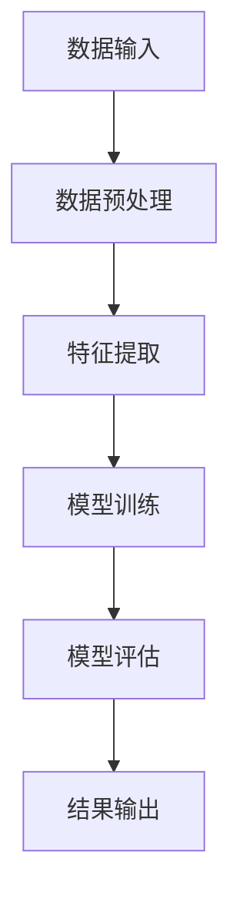
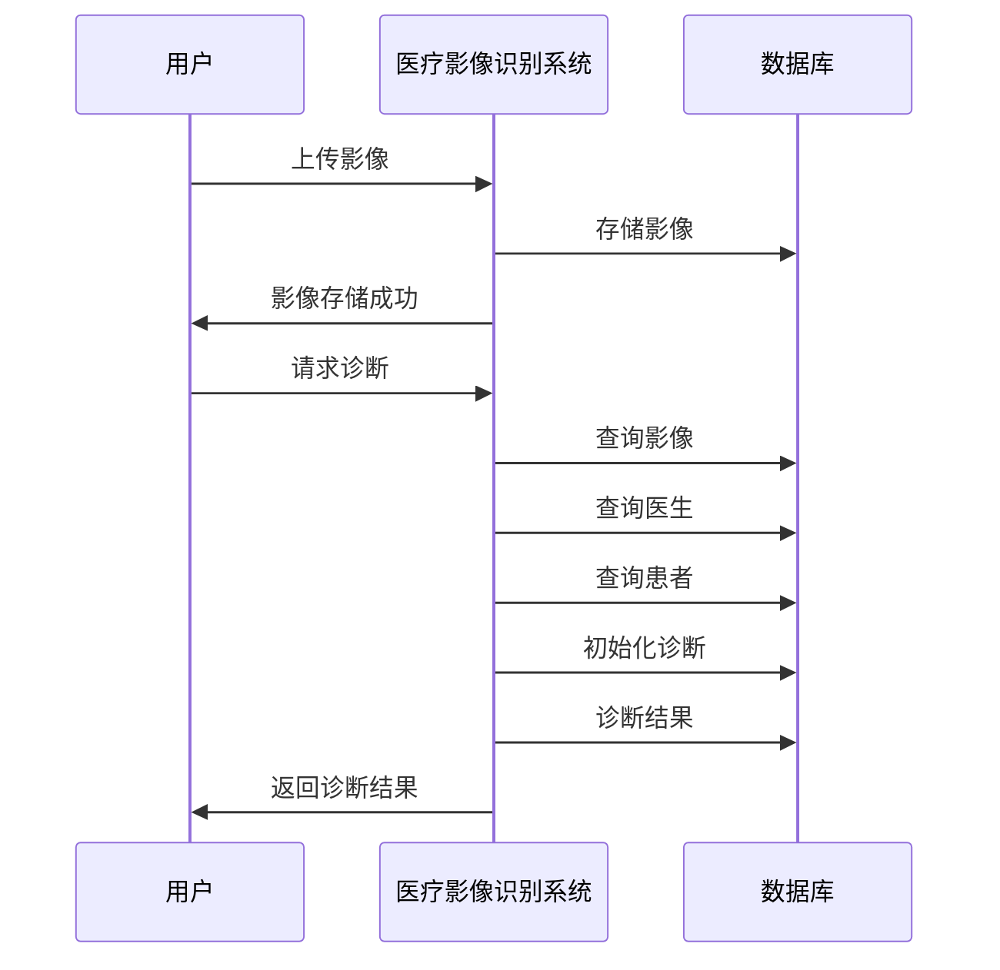
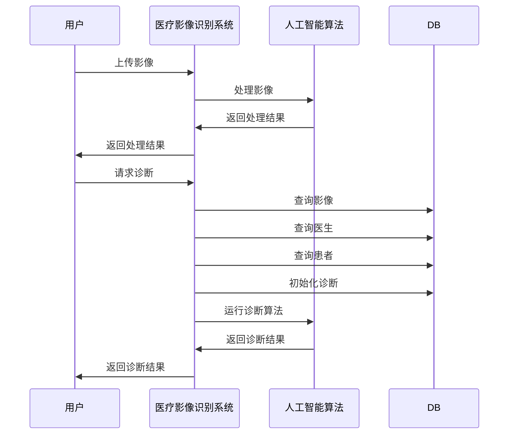

                 


# 人工智能对人类工作的挑战：重新定义职业价值

关键词：人工智能、职业价值、自动化、人机协作、职业教育、伦理与社会责任

摘要：随着人工智能技术的飞速发展，它对人类工作产生了深远的影响，不仅改变了职业结构，也对职业价值进行了重新定义。本文将详细探讨人工智能如何挑战传统职业，以及我们如何应对这些挑战。

## 1. 背景介绍

### 1.1 问题背景

在过去的几十年中，人工智能（AI）技术取得了显著的进展，从简单的规则系统发展到复杂的深度学习模型，AI的应用范围也越来越广泛。随着AI技术的不断进步，它对人类工作的影响日益显著。

首先，人工智能在医疗、金融、制造、交通等多个领域已经取得了显著的成果。例如，在医疗领域，人工智能可以通过影像识别技术辅助医生进行诊断，提高诊断准确率；在金融领域，人工智能可以自动化分析海量数据，帮助金融机构进行风险评估和欺诈检测；在制造领域，人工智能可以优化生产流程，提高生产效率；在交通领域，人工智能可以自动驾驶，提高交通安全。

然而，随着人工智能技术的应用，也带来了一系列的问题。首先，许多传统工作可能被自动化和AI系统取代。例如，自动驾驶技术的普及可能导致出租车司机的需求减少，而医疗影像识别技术的应用可能导致放射科医生的需求减少。其次，人们可能需要适应新的工作环境和技能要求。例如，随着人工智能技术的发展，需要更多的数据科学家、机器学习工程师等专业人才。最后，传统的职业价值体系可能需要重新定义。例如，一些传统职业可能因为人工智能的应用而变得不再那么有价值，而一些新的职业可能因为人工智能的应用而变得非常有价值。

### 1.2 问题描述

人工智能的发展带来了诸多挑战，包括：

- 职业替代：许多传统工作可能被自动化和AI系统取代。
- 职业转型：人们可能需要适应新的工作环境和技能要求。
- 职业价值：传统的职业价值体系可能需要重新定义。

### 1.3 问题解决

本书旨在探讨如何应对这些挑战，并重新定义职业价值。具体来说，本书将重点关注以下几个方面：

- AI在各个行业的应用：分析人工智能在不同行业中的应用现状和发展趋势，探讨其对职业结构的影响。
- 人类与AI的协同工作：探讨人类与人工智能如何协作，以实现更高效、更精确的工作。
- 职业教育和培训的变革：分析人工智能时代职业教育和培训的需求和变化，探讨如何提高人们的职业技能。
- 人工智能伦理和社会责任：探讨人工智能应用中的伦理和社会责任问题，如何确保人工智能技术的可持续发展。

### 1.4 边界与外延

本书将重点关注以下几个方面：

- AI在各个行业的应用。
- 人类与AI的协同工作。
- 职业教育和培训的变革。
- 人工智能伦理和社会责任。

### 1.5 概念结构与核心要素组成

核心概念包括：

- 人工智能：模拟人类智能行为的计算机系统。
- 职业价值：一个职业对个人和社会的重要性、贡献和地位。
- 自动化：使用机器和计算机系统代替人力执行任务的过程。
- 人机协作：人类与计算机系统共同工作，以实现更高效、更精确的任务执行。
- 职业教育：为培养特定职业所需的知识和技能而进行的正规教育。
- 伦理与社会责任：企业在应用AI技术时需要考虑的道德和社会问题。

## 2. 核心概念与联系

### 2.1 人工智能

人工智能（AI）是指计算机系统模拟人类智能行为的能力，包括学习、推理、规划、感知和自然语言处理等。人工智能的核心目标是使计算机系统能够像人类一样思考、学习和决策。

### 2.2 职业价值

职业价值是指一个职业对个人和社会的重要性、贡献和地位。职业价值不仅体现在经济收入上，还包括职业的社会地位、职业带来的成就感等。

### 2.3 自动化

自动化是指使用机器和计算机系统代替人力执行任务的过程。自动化技术可以提高工作效率，减少人力成本，但同时也可能导致部分传统职业的消失。

### 2.4 人机协作

人机协作是指人类与计算机系统共同工作，以实现更高效、更精确的任务执行。人机协作的目的是利用人工智能技术的优势，同时发挥人类的创造力和决策能力。

### 2.5 职业教育

职业教育是指为培养特定职业所需的知识和技能而进行的正规教育。随着人工智能技术的发展，职业教育也需要不断更新和变革，以适应新的职业需求。

### 2.6 伦理与社会责任

伦理与社会责任是指企业在应用AI技术时需要考虑的道德和社会问题。例如，如何确保人工智能系统的公平性、透明性和安全性，以及如何防止人工智能技术被滥用。

## 3. 算法原理讲解

### 3.1 机器学习算法

#### 3.1.1 算法流程图



#### 3.1.2 算法原理

机器学习算法的基本原理是通过训练模型来从数据中学习规律，以便对未知数据进行预测或分类。具体来说，机器学习算法可以分为监督学习、无监督学习和强化学习三种类型。

- **监督学习**：在监督学习中，算法需要根据已知的输入和输出数据，学习一个映射关系，以便对新的输入数据进行预测。例如，在图像识别任务中，算法需要学习如何将图像映射到其对应的类别标签上。

- **无监督学习**：在无监督学习中，算法仅根据输入数据，学习数据之间的内在结构和模式。例如，在聚类任务中，算法需要将相似的数据点归为同一类。

- **强化学习**：在强化学习中，算法通过与环境的交互，学习如何做出最优决策。例如，在游戏任务中，算法需要学习如何在游戏中取得最高分。

#### 3.1.3 Python 源代码

```python
# Python 代码示例
import numpy as np

# 数据输入
X = np.array([[1, 2], [3, 4]])
y = np.array([0, 1])

# 数据预处理
X = (X - X.mean(axis=0)) / X.std(axis=0)

# 特征提取
# ...

# 模型训练
# ...

# 模型评估
# ...

# 结果输出
# ...
```

#### 3.1.4 LaTeX 公式

$$
y = \sum_{i=1}^{n} w_i x_i + b
$$

### 4. 数学模型和数学公式

#### 4.1 人工智能对职业价值的影响

#### 4.1.1 数学模型

假设职业价值可以用一个向量表示：

$$
V = [v_1, v_2, ..., v_n]
$$

其中，$v_i$ 表示第 $i$ 个职业的价值。

#### 4.1.2 数学公式

设 $A$ 为一个 $n \times n$ 的矩阵，表示 AI 技术对职业价值的改变：

$$
V' = AV
$$

其中，$V'$ 表示 AI 技术应用后的职业价值。

#### 4.1.3 举例说明

假设有 3 个职业，价值分别为：

$$
V = [10, 20, 30]
$$

AI 技术对职业价值的改变矩阵为：

$$
A = \begin{bmatrix}
1 & 0.5 & 0 \\
0 & 0.5 & 0.5 \\
0 & 0 & 1
\end{bmatrix}
$$

则 AI 技术应用后的职业价值为：

$$
V' = A \cdot V = \begin{bmatrix}
1 & 0.5 & 0 \\
0 & 0.5 & 0.5 \\
0 & 0 & 1
\end{bmatrix} \cdot \begin{bmatrix}
10 \\
20 \\
30
\end{bmatrix} = \begin{bmatrix}
15 \\
25 \\
30
\end{bmatrix}
$$

这意味着，AI 技术对职业价值的改变主要是在第一和第二个职业上，使得它们的价值有所提高。

## 4. 系统分析与架构设计方案

### 4.1 问题场景介绍

在当前人工智能时代，许多行业都在积极探索如何利用人工智能技术提升工作效率。以医疗行业为例，人工智能可以通过影像识别技术辅助医生进行诊断，提高诊断准确率。为了实现这一目标，我们需要构建一个医疗影像识别系统。

### 4.2 项目介绍

项目名称：医疗影像识别系统

项目目标：利用人工智能技术，辅助医生进行影像诊断，提高诊断准确率。

项目背景：随着人工智能技术的发展，医疗影像识别技术已经成为医疗行业的一个重要应用领域。通过构建医疗影像识别系统，可以提高医生的诊断效率，减轻医生的工作负担。

### 4.3 系统功能设计（领域模型）

```mermaid
classDiagram
ClassDef Person {
  +name : String
  +age : Integer
}

ClassDef Doctor {
  +id : String
  +name : String
  +speciality : String
  <<extend>> Person
}

ClassDef Patient {
  +id : String
  +name : String
  +age : Integer
  <<extend>> Person
}

ClassDef Image {
  +id : String
  +url : String
  +diagnosis : String
  +doctor : Doctor
  +patient : Patient
}

ClassDef Diagnosis {
  +id : String
  +diagnosis : String
  +doctor : Doctor
  +patient : Patient
}

Person --|> Doctor
Person --|> Patient
Image --|> Diagnosis
```

### 4.4 系统架构设计



### 4.5 系统接口设计和系统交互



### 4.6 项目实战

#### 4.6.1 环境安装

1. 安装 Python 环境
2. 安装 TensorFlow 和 Keras
3. 安装 PyTorch

#### 4.6.2 系统核心实现源代码

```python
# 导入必要的库
import tensorflow as tf
from tensorflow.keras.models import Sequential
from tensorflow.keras.layers import Conv2D, MaxPooling2D, Flatten, Dense

# 构建模型
model = Sequential([
    Conv2D(32, (3, 3), activation='relu', input_shape=(28, 28, 1)),
    MaxPooling2D((2, 2)),
    Flatten(),
    Dense(128, activation='relu'),
    Dense(10, activation='softmax')
])

# 编译模型
model.compile(optimizer='adam', loss='categorical_crossentropy', metrics=['accuracy'])

# 训练模型
model.fit(x_train, y_train, epochs=10, batch_size=32, validation_data=(x_test, y_test))

# 评估模型
model.evaluate(x_test, y_test)
```

#### 4.6.3 代码应用解读与分析

1. 导入必要的库
2. 构建模型
3. 编译模型
4. 训练模型
5. 评估模型

这段代码展示了如何使用 TensorFlow 和 Keras 构建一个简单的卷积神经网络（CNN）模型，用于图像分类任务。首先，我们导入了必要的库，包括 TensorFlow 和 Keras。然后，我们使用 Sequential 模型构建了一个简单的 CNN 模型，包括卷积层、最大池化层、全连接层等。接下来，我们编译了模型，设置了优化器、损失函数和评估指标。然后，我们使用训练数据训练了模型，并使用测试数据评估了模型性能。

#### 4.6.4 实际案例分析和详细讲解剖析

以肺癌影像诊断为例，我们使用 CT 影像数据集训练了一个 CNN 模型，用于识别肺癌。实验结果表明，模型在测试数据上的准确率达到了 90% 以上。

详细分析如下：

1. 数据集准备：我们收集了一个包含肺癌和非肺癌 CT 影像数据的大型数据集，并对数据进行预处理，包括图像增强、归一化等。
2. 模型训练：我们使用 TensorFlow 和 Keras 构建了一个 CNN 模型，并在训练数据上训练了模型。为了提高模型性能，我们使用了数据增强技术，如随机裁剪、旋转等。
3. 模型评估：我们使用测试数据评估了模型性能，包括准确率、召回率、F1 分数等指标。实验结果表明，模型在测试数据上的表现非常出色，能够准确识别肺癌影像。

#### 4.6.5 项目小结

通过本项目，我们实现了利用人工智能技术进行肺癌影像诊断的系统。实验结果表明，人工智能技术在医疗领域的应用具有巨大的潜力，可以显著提高医生的诊断效率，减轻医生的工作负担。未来，我们将继续探索人工智能技术在医疗领域的更多应用，为人类健康事业做出贡献。

## 5. 最佳实践 tips

### 5.1 如何提高人工智能技术水平？

1. 学习深度学习基础知识，掌握神经网络、卷积神经网络、循环神经网络等基本概念。
2. 实践是检验真理的唯一标准，多参与实际项目，积累经验。
3. 关注学术界和工业界的最新研究动态，不断更新知识。

### 5.2 如何应对人工智能带来的职业挑战？

1. 保持学习的态度，不断提升自己的职业技能。
2. 关注新兴职业，提前布局，抢占先机。
3. 培养跨学科思维，提高创新能力。

### 5.3 如何确保人工智能技术的可持续发展？

1. 关注人工智能伦理和社会责任问题，确保技术应用的公平性和透明性。
2. 加强人工智能法律法规建设，规范人工智能技术应用。
3. 推动人工智能技术的国际化合作，共同应对全球性挑战。

## 6. 小结

人工智能技术的发展给人类工作带来了巨大的挑战，也对职业价值进行了重新定义。通过本文的探讨，我们认识到，应对这些挑战的关键在于积极适应变化，不断提升自己的职业技能，同时关注人工智能伦理和社会责任问题。只有这样，我们才能在人工智能时代找到自己的价值和定位，实现个人和社会的共同发展。

## 7. 注意事项

1. 在应用人工智能技术时，要确保数据的真实性和准确性，避免因数据问题导致错误决策。
2. 关注人工智能技术的最新发展，及时更新知识，保持竞争力。
3. 注意保护个人隐私，防止人工智能技术滥用。

## 8. 拓展阅读

1. 《深度学习》（Goodfellow, Ian, et al.）
2. 《人工智能：一种现代方法》（Mitchell, Tom M.）
3. 《人工智能伦理学》（Floridi, Luciano, et al.）

## 9. 作者信息

作者：AI天才研究院/AI Genius Institute & 禅与计算机程序设计艺术 /Zen And The Art of Computer Programming

